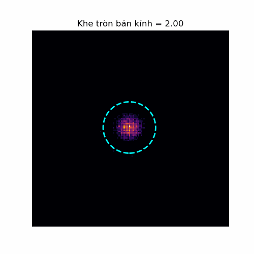
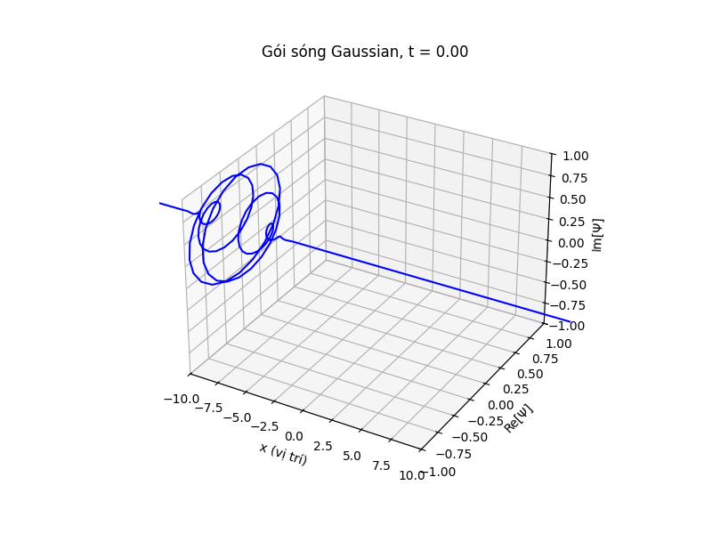

## Mục lục

Nội dung của bài này bao gồm:

- [1. Giới hạn của phép đo](#1-giới-hạn-của-phép-đo)
- [2. Nguyên lý bất định](#2-nguyên-lý-bất-định)
- [3. Tham khảo](#3-tham-khảo)

---

## 1. Giới hạn của phép đo

Ở bài trước, chúng ta đã biết rằng để thực hiện một phép đo đối với một quan sát (toán tử $\hat{Q}$), ta luôn phải tác động lên hệ theo các cách khác nhau khiến cho hệ sau khi được đo không còn ở trạng thái ban đầu nữa. Điều này khiến cho việc đo hai quan sát (ví dụ vị trí và động lượng) một cách đồng thời là không thể thực hiện được. 

Ví dụ, để đo lường vị trí của electron chuyển động tự do, ta cần chiếu một photon vào nó và quan sát góc tán xạ (Compton) trên màn chắn để suy ra vị trí của electron. Bước sóng ta sử dụng càng ngắn (năng lượng càng cao) thì vị trí ta đo được càng chính xác. Tuy nhiên, photon mang năng lượng càng cao thì khi va chạm, động lượng nó truyền cho electron càng lớn. Điều này khiến độ biến động của động lượng sau va chạm càng cao. Hay ta nói: vị trí đo càng chính xác thì động lượng càng “mờ”.

Vậy nguyên nhân chính khiến chúng ta không thể nào đo lường hai quan sát một cách đồng thời là gì? Có phải do phương pháp đo lường của chúng ta không chính xác hay do thiết bị sử dụng không đủ hiện đại? 

Cùng quay lại với hiện tượng nhiễu xạ ánh sáng qua khe hẹp. Chúng ta đã biết rằng khi khe càng rộng (so với bước sóng) thì càng ít nhiễu xạ và ngược lại. Tuy nhiên đó là góc nhìn khi ta coi ánh sáng là sóng. Vậy nếu ta coi chúng là hạt thì sao? Dưới đây là kết quả khi ta chiếu electron qua khe khi bề rộng của khe nhỏ dần.

 
*(Hình 1.1. Nhiễu xạ electron trên màn chắn khi bán kính khe thu nhỏ dần)*

Ở hình trên, ta thấy rằng khi ta thu nhỏ bề rộng của khe lại (nghĩa là ta biết vị trí của electron đi qua khe càng chính xác), thì phân bố của electron trên màn chắn lại càng phân tán (hay động lượng theo phương ngang càng biến động dữ dội). Đây không phải là lỗi thiết bị, mà thực chất là một **tính chất nội tại** của hệ lượng tử.

---

## 2. Nguyên lý bất định

Nguyên lý bất định được đề xuất lần đầu tiên bởi nhà vật lý Werner Heisenberg vào năm 1927. Phát biểu ban đầu thường được diễn giải qua ví dụ tưởng tượng về kính hiển vi lượng tử (Kính hiển vi Heisenberg). Các công trình sau này (như của Robertson) đã dần tổng quát hóa nguyên lý bất định thành phát biểu toán học vô cùng chặt chẽ như sau:

* **Phát biểu:** Với mọi cặp toán tử (quan sát) không giao hoán, ta không thể nào biết được chính xác cả hai đại lượng này một cách đồng thời. Đây là một **tính chất nội tại** của hệ lượng tử chứ không phải sai số đến từ phép đo hay thiết bị đo. Việc biết được đại lượng này càng chính xác thì thành phần còn lại càng bất định. Khi đó, phương sai của các phép đo trên các quan sát này luôn thỏa mãn bất đẳng thức:

$$
\sigma_A^2 \sigma_B^2 \geq \left( \frac{1}{2i} \langle [\hat{A}, \hat{B}] \rangle \right)^2 \tag{2.1}
$$

Trong đó:
- $\hat{A}, \hat{B}$ là hai toán tử bất kỳ không giao hoán với nhau.
- $\sigma_A, \sigma_B$ là độ lệch chuẩn (căn bậc hai của phương sai) của phép đo với toán tử tương ứng.
- $[\hat{A}, \hat{B}]$ là **giao hoán tử** của hai quan sát $\hat{A}, \hat{B}$ và được định nghĩa:

$$
[\hat{A}, \hat{B}] \equiv \hat{A} \hat{B} - \hat{B} \hat{A} \tag{2.2}
$$

* **Chứng minh:**

Trong Bài 8, ta đã biết rằng với mọi quan sát $\hat{Q}$, giá trị trung bình (kỳ vọng) của quan sát đó trên trạng thái $\Psi$ là:

$$
\langle Q \rangle = \langle \Psi | \hat{Q} | \Psi \rangle \tag{2.3}
$$

Mà phương sai là kỳ vọng của bình phương độ lệch giữa mỗi quan sát so với giá trị trung bình. Đặt giá trị trung bình $\langle Q \rangle = q$, ta có:

$$
\sigma^2 = \langle (Q - \langle Q \rangle)^2 \rangle = \langle \Psi | (\hat{Q} - q)^2 | \Psi \rangle = \langle (\hat{Q} - q)\Psi | (\hat{Q} - q)\Psi \rangle \tag{2.4}
$$

*(Ở đây ta dễ dàng suy ra $\hat{Q} - q$ cũng là một toán tử Hermitian do $\hat{Q}$ là toán tử Hermitian và $q$ là một số thực).*

Vậy đối với quan sát $\hat{A}$, ta đặt $f \equiv \left( \hat{A} - \langle A \rangle \right) \Psi$, khi đó phương sai của quan sát $\hat{A}$ sẽ là:

$$
\sigma_A^2 = \langle f | f \rangle \tag{2.5}
$$

Tương tự với quan sát $\hat{B}$, ta đặt $g \equiv \left( \hat{B} - \langle B \rangle \right) \Psi$, vậy phương sai của $\hat{B}$ là:

$$
\sigma_B^2 = \langle g | g \rangle \tag{2.6}
$$

Vì $f$ và $g$ đều là các hàm trạng thái (hàm phức) khả tích bình phương trong không gian Hilbert $L^2$, ta áp dụng **bất đẳng thức tích phân Cauchy–Schwarz**:

$$
\left| \int_a^b f(x)^* g(x) \, dx \right| \leq \sqrt{ \int_a^b |f(x)|^2 \, dx \cdot \int_a^b |g(x)|^2 \, dx } \tag{2.7}
$$

Bình phương hai vế của $(2.7)$ và viết lại dưới ngôn ngữ Bra-Ket, ta được:

$$
| \langle f | g \rangle |^2 \leq \langle f | f \rangle \langle g | g \rangle \tag{2.8}
$$

Mặt khác, với mọi số phức $z$, bình phương module luôn lớn hơn hoặc bằng bình phương phần ảo:

$$
|z|^2 = [\mathrm{Re}(z)]^2 + [\mathrm{Im}(z)]^2 \geq [\mathrm{Im}(z)]^2 = \left[ \frac{1}{2i}(z - z^*) \right]^2 \tag{2.9}
$$

Do $\langle f | g \rangle$ cũng là một số phức, nên từ $(2.9), (2.8), (2.6)$ và $(2.5)$, ta kết hợp lại:

$$
\sigma_A^2 \sigma_B^2 \geq \left( \frac{1}{2i} \left[ \langle f | g \rangle - \langle g | f \rangle \right] \right)^2 \tag{2.10}
$$

Bây giờ ta đi tính thành phần $\langle f | g \rangle$:

$$
\begin{aligned} 
\langle f | g \rangle &= \left\langle (\hat{A} - \langle A \rangle)\Psi \middle| (\hat{B} - \langle B \rangle)\Psi \right\rangle \\
&= \left\langle \Psi \middle| (\hat{A} - \langle A \rangle)(\hat{B} - \langle B \rangle)\Psi \right\rangle \\
&= \left\langle \Psi \middle| \left( \hat{A} \hat{B} - \hat{A} \langle B \rangle - \hat{B} \langle A \rangle + \langle A \rangle \langle B \rangle \right) \Psi \right\rangle \\
&= \langle \Psi | \hat{A} \hat{B} | \Psi \rangle - \langle B \rangle \langle \Psi | \hat{A} | \Psi \rangle - \langle A \rangle \langle \Psi | \hat{B} | \Psi \rangle + \langle A \rangle \langle B \rangle \langle \Psi | \Psi \rangle \\
&= \langle \hat{A} \hat{B} \rangle - \langle B \rangle \langle A \rangle - \langle A \rangle \langle B \rangle + \langle A \rangle \langle B \rangle \\
&= \langle \hat{A} \hat{B} \rangle - \langle A \rangle \langle B \rangle 
\end{aligned} \tag{2.11}
$$

Tương tự với $\langle g | f \rangle$:

$$
\langle g | f \rangle = \langle \hat{B} \hat{A} \rangle - \langle A \rangle \langle B \rangle \tag{2.12}
$$

Trừ hai biểu thức cho nhau, ta được:

$$
\langle f | g \rangle - \langle g | f \rangle = \langle \hat{A} \hat{B} \rangle - \langle \hat{B} \hat{A} \rangle = \langle [ \hat{A}, \hat{B} ] \rangle \tag{2.13}
$$

Thay $(2.13)$ vào $(2.10)$, bất đẳng thức trở thành:

$$
\sigma_A^2 \sigma_B^2 \geq \left( \frac{1}{2i} \langle [\hat{A}, \hat{B}] \rangle \right)^2 \tag{2.14}
$$

Đây chính là **Nguyên lý bất định tổng quát** cho mọi cặp toán tử không giao hoán. Ta cùng xem xét điều này trên cặp toán tử nổi tiếng nhất: **Vị trí và Động lượng**.

* **Ví dụ:**

Trong cơ học lượng tử, cặp toán tử vị trí $\hat{x} = x$ và toán tử động lượng $\hat{p} = -i\hbar \frac{d}{dx}$ là không giao hoán. Ta cần tính giao hoán tử của chúng $[\hat{x}, \hat{p}]$. 

Lưu ý rằng bản thân toán tử chỉ là các hàm toán học (phép biến đổi), vì vậy để tính toán, ta cần cho chúng tác dụng lên một hàm sóng thử $\Psi(x)$. Áp dụng quy tắc đạo hàm của một tích:

$$
\begin{aligned}
[\hat{x}, \hat{p}] \Psi(x) &= \hat{x}(\hat{p}\Psi(x)) - \hat{p}(\hat{x}\Psi(x)) \\
&= x \left(-i\hbar \frac{d\Psi(x)}{dx}\right) - \left(-i\hbar \frac{d}{dx}\right)(x \Psi(x)) \\
&= -i\hbar x \frac{d\Psi(x)}{dx} + i\hbar \left( \Psi(x) + x \frac{d\Psi(x)}{dx} \right) \\
&= i\hbar \Psi(x)
\end{aligned} \tag{2.15}
$$

Bỏ đi hàm thử $\Psi(x)$, ta thu được giao hoán tử kinh điển của vị trí và động lượng:

$$
[\hat{x}, \hat{p}] = i \hbar \tag{2.16}
$$

Thay kết quả $(2.16)$ vào công thức $(2.14)$, ta được:

$$
\sigma_x^2 \sigma_p^2 \geq \left( \frac{1}{2i} i\hbar \right)^2 = \left( \frac{\hbar}{2} \right)^2 \tag{2.17}
$$

Hay:

$$
\sigma_x \sigma_p \geq \frac{\hbar}{2} \tag{2.18}
$$

Đây chính là dạng chuẩn của **Nguyên lý bất định Heisenberg**. Tích độ bất định của vị trí và động lượng luôn lớn hơn hoặc bằng $\hbar/2$. Ta càng biết rõ vị trí của hạt ($\sigma_x$ nhỏ) thì độ bất định của động lượng ($\sigma_p$) càng lớn để bù trừ vào bất đẳng thức.

* **Trạng thái cực tiểu hóa độ bất định (Gói sóng)**

Vậy có tồn tại hàm sóng nào chạm đến giới hạn lý tưởng, tức là thỏa mãn dấu bằng $\sigma_x \sigma_p = \hbar/2$ hay không?

Quay lại bất đẳng thức Cauchy-Schwarz ở công thức $(2.8)$, dấu bằng xảy ra khi hai vector phụ thuộc tuyến tính: $g = c \cdot f$ (với $c$ là một hằng số phức). Khi đó:

$$
\langle f | g \rangle = c \langle f | f \rangle \tag{2.19}
$$

Ta đã biết $\langle f | g \rangle$ là một số phức, và dấu bằng ở công thức $(2.9)$ chỉ xảy ra khi phần thực $\mathrm{Re}(z) = 0$ (tức là $z$ là một số thuần ảo). Vì $\langle f | f \rangle$ là phương sai (luôn là số thực), nên $c$ bắt buộc phải là một số thuần ảo. Đặt $c = ia$:

$$
g = ia f \tag{2.20}
$$

*(Với $a$ là một số thực dương ($a > 0$) để đảm bảo hàm sóng có thể chuẩn hóa được và không bị phân kỳ ở vô cực).*

Thay lại định nghĩa $f = \left(\hat{x} - \langle x \rangle\right)\Psi$ và $g = \left(\hat{p} - \langle p \rangle\right)\Psi$ vào phương trình $(2.20)$:

$$
\left( -i\hbar \frac{d}{dx} - \langle p \rangle \right) \Psi = ia(x - \langle x \rangle)\Psi \tag{2.21}
$$

Đây là một phương trình vi phân tuyến tính bậc một. Bằng cách tách biến và lấy nguyên hàm, ta tìm được nghiệm tổng quát có dạng:

$$
\Psi(x) = A \, e^{-a(x - \langle x \rangle)^2 / 2\hbar} \, e^{i \langle p \rangle x / \hbar} \tag{2.22}
$$

Cấu trúc toán học này chính là **Gói sóng Gaussian (Gaussian Wave Packet)** trong không gian vị trí, mô tả một trạng thái lượng tử có vị trí trung bình $\langle x \rangle$ và động lượng trung bình $\langle p \rangle$. Sự phát triển của gói sóng này theo thời gian có đặc tính phân tán ra xa như hình dưới:

  
*(Hình 2.1. Sự phát triển của gói sóng Gaussian theo thời gian)*

Vậy là ở bài này chúng ta đã nghiên cứu xong về Nguyên lý bất định một cách tường minh từ giải tích hàm. Bắt đầu từ bài học sau, chúng ta sẽ tìm hiểu về một chủ đề nâng cao và mang tính ứng dụng thực tế nhiều hơn: **Cơ học lượng tử trong không gian 3 chiều**. Cảm ơn bạn đọc đã theo dõi.

---

## 3. Tham khảo

1. *Critical Analysis of the Origins of Heisenberg’s Uncertainty Principle*. [PDF](https://www.scirp.org/pdf/jmp2024156_17505289.pdf).
2. University of Chicago REU. *Dubey.pdf*. [PDF](https://math.uchicago.edu/~may/REU2021/REUPapers/Dubey.pdf).