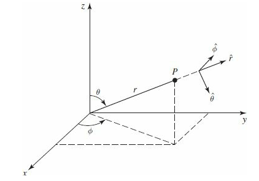
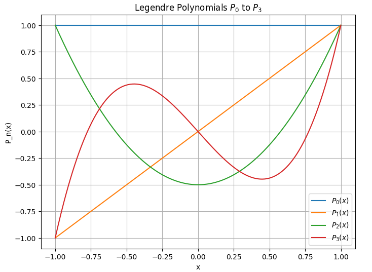
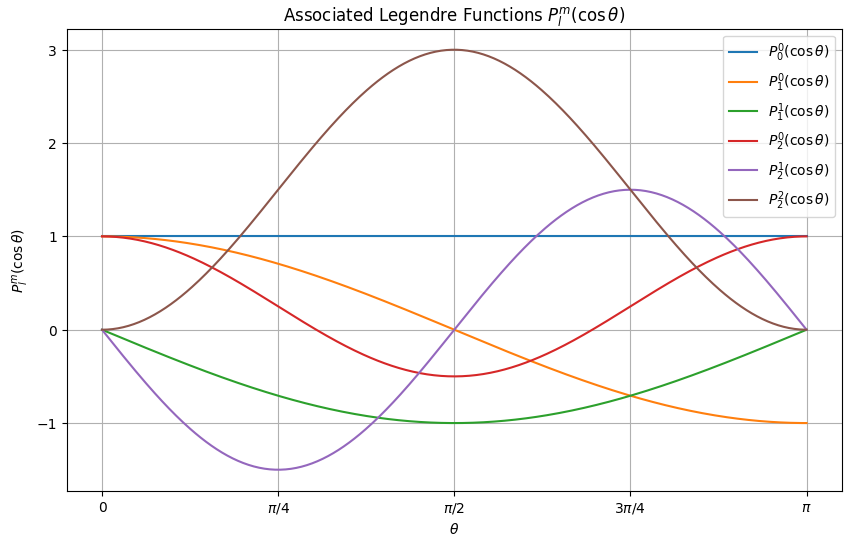
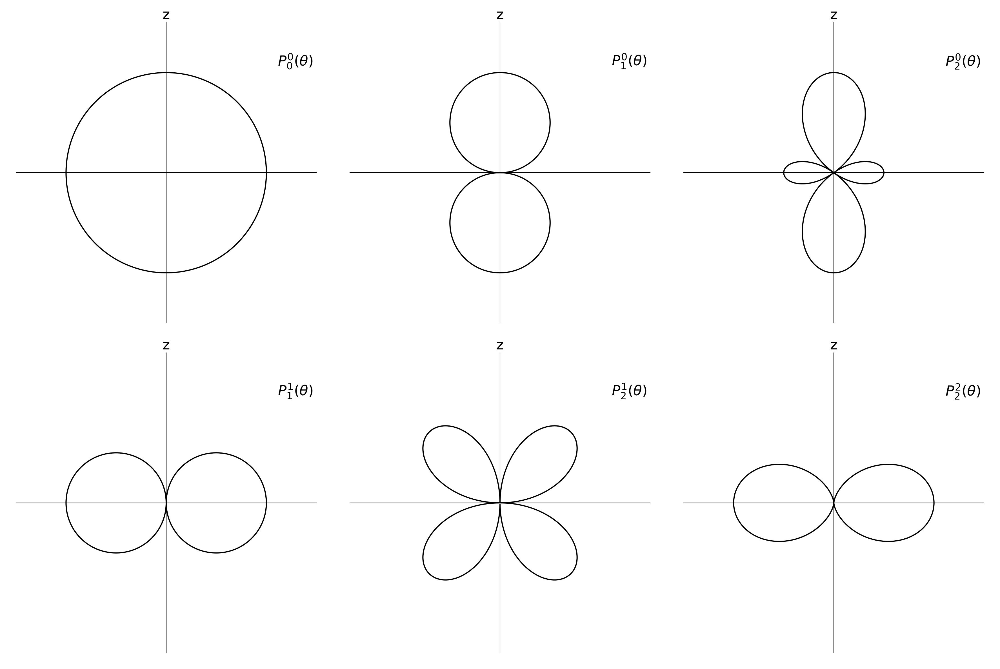

# Bài 12: Phương pháp tách biến - Phần 2

## Mục lục

Nội dung của bài này bao gồm:

- [1. Tách biến](#1-tách-biến)
- [2. Phương trình góc](#2-phương-trình-góc)
  - [2.1. Phương trình $\Phi$ (Góc phương vị)](#21-phương-trình-phi-góc-phương-vị)
  - [2.2. Phương trình $\Theta$ (Góc cực)](#22-phương-trình-theta-góc-cực)
- [3. Phương trình hướng tâm](#3-phương-trình-hướng-tâm)
- [4. Chuẩn hóa](#4-chuẩn-hóa)
  - [4.1. Chuẩn hóa góc](#41-chuẩn-hóa-góc)
- [5. Tham khảo](#5-tham-khảo)

---

## 1. Tách biến

  
*(Hình 1.1. Biểu diễn vector trong hệ tọa độ cầu)* 

Ta cùng nhắc lại về phương trình Schrödinger độc lập thời gian trong hệ tọa độ cầu chúng ta đã gặp ở bài trước:

$$
-\frac{\hbar^2}{2m} \left[ \frac{1}{r^2}\frac{\partial}{\partial r}\left(r^2\frac{\partial\psi}{\partial r}\right) + \frac{1}{r^2\sin\theta}\frac{\partial}{\partial \theta}\left(\sin\theta\frac{\partial\psi}{\partial \theta}\right) + \frac{1}{r^2\sin^2\theta}\left(\frac{\partial^2\psi}{\partial \phi^2}\right) \right] + V\psi = E\psi \tag{1.1}
$$

Chúng ta cần giải phương trình $(1.1)$ đối với một trường thế $V(r)$ nào đó. Hãy cùng phân tích $(1.1)$ xem chúng ta có thể làm cho nó trở nên đơn giản hơn không. Như tại Bài 3 tôi đã đề cập, phương pháp tách biến sẽ được sử dụng rất nhiều. Để bắt đầu, ta giả định rằng nghiệm riêng $\psi$ có thể được phân tích thành tích của các hàm độc lập:

$$
\psi(r, \theta, \phi) = R(r) Y(\theta, \phi) \tag{1.2}
$$

Trong đó:
- $R(r)$ là hàm hướng tâm chỉ phụ thuộc vào khoảng cách từ chất điểm đến gốc tọa độ.
- $Y(\theta, \phi)$ là hàm góc.

Thay $(1.2)$ vào phương trình $(1.1)$ ta được:

$$
-\frac{\hbar^2}{2m} \left[ \frac{Y}{r^2} \frac{d}{dr}\left(r^2\frac{dR}{dr}\right) + \frac{R}{r^2\sin\theta} \frac{\partial}{\partial \theta}\left(\sin\theta\frac{\partial Y}{\partial \theta}\right) + \frac{R}{r^2\sin^2\theta} \frac{\partial^2 Y}{\partial \phi^2} \right] + VRY = ERY \tag{1.3}
$$

Chia cả hai vế của $(1.3)$ cho $YR$ và nhân hai vế với $-\frac{2mr^2}{\hbar^2}$, sau đó chuyển vế ta được:

$$
\left\{ \frac{1}{R} \frac{d}{dr} \left(r^2 \frac{dR}{dr}\right) - \frac{2mr^2}{\hbar^2} [V(r) - E] \right\} = - \left\{ \frac{1}{Y \sin\theta} \frac{\partial}{\partial \theta} \left(\sin\theta \frac{\partial Y}{\partial \theta}\right) + \frac{1}{Y \sin^2\theta} \frac{\partial^2 Y}{\partial \phi^2} \right\} \tag{1.4}
$$

Giờ chúng ta đã thấy rằng phần bên trái của $(1.4)$ chỉ phụ thuộc vào bán kính $r$ và phần bên phải chỉ phụ thuộc vào góc $\theta, \phi$. Để phương trình này luôn đúng với mọi tọa độ, cả hai vế phải cùng bằng một hằng số. Đặt hằng số phân ly này là $\ell(\ell+1)$, ta được **phương trình hướng tâm** (Radial Equation):

$$
\frac{1}{R} \frac{d}{dr} \left(r^2 \frac{dR}{dr}\right) - \frac{2mr^2}{\hbar^2} [V(r) - E] = \ell(\ell+1) \tag{1.5}
$$

Và **phương trình góc** (Angular Equation):

$$
\frac{1}{Y} \left\{ \frac{1}{\sin \theta} \frac{\partial}{\partial \theta} \left(\sin \theta \frac{\partial Y}{\partial \theta}\right) + \frac{1}{\sin^2 \theta} \frac{\partial^2 Y}{\partial \phi^2} \right\} = -\ell(\ell+1) \tag{1.6}
$$

Ta cùng phân tích phương trình góc trước.

---

## 2. Phương trình góc

Nếu bạn đọc theo học các khối ngành kỹ thuật thì chắc hẳn không xa lạ gì với phương trình $(1.6)$. Để các bạn dễ hình dung, tôi sẽ viết lại phương trình $(1.6)$ bằng cách nhân cả hai vế của nó với $Y \sin^2 \theta$:

$$
\sin \theta \frac{\partial}{\partial \theta} \left(\sin \theta \frac{\partial Y}{\partial \theta}\right) + \frac{\partial^2 Y}{\partial \phi^2} = -\ell(\ell+1) \sin^2 \theta Y \tag{2.1}
$$

Nếu đã học qua về **Điện động lực học (Electrodynamics)**, hẳn bạn đã bắt gặp phương trình $(2.1)$ khi giải Phương trình Laplace ($\nabla^2 V = 0$) hay Phương trình Helmholtz trong các bài toán tán xạ sóng, phân bổ điện tích... 

Chúng ta lại tiếp tục sử dụng phương pháp tách biến cho phương trình $(2.1)$ bằng cách giả định nghiệm riêng của nó có thể viết dưới dạng:

$$
Y(\theta, \phi) = \Theta(\theta) \Phi(\phi) \tag{2.2}
$$

Trong đó:
- $\Theta(\theta)$ là hàm chỉ phụ thuộc góc cực $(\theta)$.
- $\Phi(\phi)$ là hàm phụ thuộc vào góc phương vị $(\phi)$.

Thế $(2.2)$ vào $(2.1)$, chia cả hai vế cho $\Phi \Theta$ sau đó chuyển vế, ta được:

$$
\left\{ \frac{1}{\Theta} \left[ \sin \theta \frac{d}{d \theta} \left(\sin \theta \frac{d \Theta}{d \theta}\right) \right] + \ell(\ell+1) \sin^2 \theta \right\} = - \frac{1}{\Phi} \frac{d^2 \Phi}{d \phi^2} \tag{2.3}
$$

Ta lại thấy vế trái chỉ phụ thuộc vào góc cực $\theta$ và vế phải chỉ phụ thuộc vào góc phương vị $\phi$. Lần này, chúng ta sẽ đặt hằng số phân ly là $m^2$ (cả $m$ hay $\ell$ đều có thể là số phức). Ta được **phương trình $\Phi$**:

$$
\frac{1}{\Phi} \frac{d^2 \Phi}{d \phi^2} = -m^2 \tag{2.4}
$$

Và **phương trình $\Theta$**:

$$
\frac{1}{\Theta} \left[ \sin \theta \frac{d}{d \theta} \left(\sin \theta \frac{d \Theta}{d \theta}\right) \right] + \ell(\ell+1) \sin^2 \theta = m^2 \tag{2.5}
$$

### 2.1. Phương trình $\Phi$ (góc phương vị)

Ta dễ dàng giải phương trình vi phân bậc 2 tuyến tính $(2.4)$ và tìm được nghiệm tổng quát có dạng:

$$
\Phi(\phi) = e^{im\phi} \tag{2.6}
$$

*(Chú ý: Ở đây tôi bỏ hằng số tích phân trong nghiệm tổng quát $(2.6)$ vì ta có thể gộp nó chung với hằng số chuẩn hóa của phương trình $\Theta$ ở bước sau).*

Nhìn lại Hình 1.1, ta sẽ nhận thấy rằng nếu ta quay vector $r$ một góc $2\pi$ quanh trục $z$, ta sẽ quay trở lại không gian vật lý ban đầu. Hay nói cách khác, trạng thái phải tuần hoàn:

$$
\Phi(\phi + 2\pi) = \Phi(\phi) \tag{2.7}
$$

Điều này dẫn đến nghiệm $(2.6)$ phải thỏa mãn:

$$
e^{im(\phi + 2\pi)} = e^{im\phi} \implies e^{im2\pi} = 1 \tag{2.8}
$$

Và điều này chỉ xảy ra khi $m$ là một số nguyên. Vậy ta kết luận rằng $m \in \mathbb{Z}$:
$$m = 0, \pm 1, \pm 2, \ldots$$

### 2.2. Phương trình $\Theta$ (góc cực)

Ta viết lại phương trình $(2.5)$ bằng cách nhân cả hai vế với $\Theta$ và chuyển vế để về dạng:

$$
\sin \theta \frac{d}{d \theta} \left(\sin \theta \frac{d \Theta}{d \theta}\right) + \left[ \ell(\ell+1) \sin^2 \theta - m^2 \right] \Theta = 0 \tag{2.9}
$$

Đây là **Phương trình Legendre liên hợp** (Associated Legendre Equation) và cách giải của nó như sau:

Đặt biến mới:

$$
u = \cos \theta \tag{2.10}
$$

Áp dụng quy tắc chuỗi ta sẽ thu được:
$$
\frac{d}{d \theta} = \frac{d}{d u} \frac{d u}{d \theta} = (-\sin \theta) \frac{d}{d u} \tag{2.11}
$$

Và:
$$
\sin^2 \theta = 1 - \cos^2 \theta = 1 - u^2 \tag{2.12}
$$

Thay thế dần các thành phần của $(2.9)$:

* **Bước 1: Thay thế đạo hàm bậc nhất**
$$
\sin \theta \frac{d \Theta}{d \theta} = \sin \theta \left[ (-\sin \theta) \frac{d \Theta}{d u} \right] = - \sin^2 \theta \frac{d \Theta}{d u} = -(1 - u^2) \frac{d \Theta}{d u} \tag{2.13}
$$

* **Bước 2: Thay thế đạo hàm bậc hai**
$$
\sin \theta \frac{d}{d \theta} \left(\sin \theta \frac{d \Theta}{d \theta}\right) = \sin \theta \frac{d}{d \theta} \left[ -(1 - u^2) \frac{d \Theta}{d u} \right] \tag{2.14}
$$

Tiếp tục sử dụng quy tắc chuỗi $(2.11)$ cho $(2.14)$:
$$
\sin \theta \left[ (-\sin \theta) \frac{d}{d u} \left( -(1 - u^2) \frac{d \Theta}{d u} \right) \right] = -\sin^2 \theta \frac{d}{d u} \left( -(1 - u^2) \frac{d \Theta}{d u} \right) = (1 - u^2) \frac{d}{d u} \left( (1 - u^2) \frac{d \Theta}{d u} \right) \tag{2.15}
$$

Thay $(2.15)$ vào phương trình $(2.9)$ và chia cho $\sin^2\theta$, ta thu được **dạng chuẩn của Phương trình Legendre Liên hợp**:

$$
\frac{d}{du} \left[ (1 - u^2) \frac{d \Theta}{du} \right] + \left[ \ell(\ell+1) - \frac{m^2}{1 - u^2} \right] \Theta = 0 \tag{2.16}
$$

Cách giải phương trình $(2.16)$ khá phức tạp (bằng chuỗi lũy thừa), vì vậy ở đây tôi sẽ sử dụng luôn nghiệm toán học của nó:

$$
\Theta(\theta) = A P_{\ell}^{m}(u) \tag{2.17}
$$

Trong đó:
- $A$ là hằng số chuẩn hóa (sẽ tìm ở phần sau).
- $P_\ell^m$ là **Hàm Legendre liên hợp**, được định nghĩa là:

$$
P_{\ell}^{m}(x) \equiv (-1)^m (1-x^2)^{m/2} \left(\frac{d}{dx}\right)^m P_{\ell}(x) \tag{2.18}
$$

- $P_\ell(x)$ là **Đa thức Legendre** (Legendre polynomial), được định nghĩa thông qua **Công thức Rodrigues** (Rodrigues formula):

$$
P_{\ell}(x) \equiv \frac{1}{2^{\ell}\ell!} \left(\frac{d}{dx}\right)^{\ell} (x^2 - 1)^{\ell} \tag{2.19}
$$

> **💡 Lưu ý (Đạo hàm bậc âm):** Công thức $(2.18)$ sử dụng toán tử đạo hàm bậc $m$, do đó nó chỉ có ý nghĩa toán học trực tiếp khi $m \geq 0$. Đối với các giá trị $m$ âm ($m = -\ell, \dots, -1$), hàm Legendre liên hợp được suy ra thông qua tính chất đối xứng:
> $$P_\ell^{-m}(x) = (-1)^m \frac{(\ell-m)!}{(\ell+m)!} P_\ell^m(x)$$

*(Chú ý: Phương trình Legendre có nghiệm loại 2 là $\Theta(\theta) = C \ln \left| \tan \left(\frac{\theta}{2}\right) \right|$, tuy nhiên ta loại bỏ nó do nó phân kỳ tại $\theta = 0$ và $\theta = \pi$, tức là xác suất tiến đến vô cực trên trục $z$, vi phạm nguyên lý vật lý).*

* **Ví dụ đa thức Legendre:**
Với $\ell = 2$, đa thức $P_2(x)$:
$$P_2(x) = \frac{1}{4 \cdot 2} \left(\frac{d}{dx}\right)^2 (x^2 - 1)^2 = \frac{1}{2}(3x^2 - 1)$$

  
*(Hình 2.1. Biểu đồ các đa thức Legendre)*

* **Ví dụ Hàm liên hợp Legendre:**
Với $m=1, \ell=2$:
$$P_2^1(x) = -(1-x^2)^{1/2} \frac{d}{dx} \left[ \frac{1}{2}(3x^2 - 1) \right] = -3x\sqrt{1-x^2}$$

  
*(Hình 2.2. Đồ thị các hàm Legendre liên hợp với $x = \cos \theta$)*

Biên độ hàm $\Theta(\theta)$ biểu diễn theo góc $\theta$ là:

$$
r = |P_{\ell}^{m}(\cos \theta)| \tag{2.20}
$$

  
*(Hình 2.3. Biểu đồ mặt cắt 2D của $r = |P_{\ell}^{m}(\cos \theta)|$)*

Để công thức Rodrigues hữu hạn và không bị triệt tiêu, $\ell$ phải là số nguyên dương, và $m$ bị giới hạn trong khoảng $[-\ell, \ell]$. Hay ta nói:
$$\ell = 0, 1, 2, \ldots; \quad m = -\ell, -\ell+1, \ldots, -1, 0, 1, \ldots, \ell-1, \ell$$

Kết hợp $(2.17)$ và $(2.6)$, ta thu được nghiệm tổng quát của phương trình góc $(1.6)$, gọi là **Hàm cầu hài (Spherical Harmonics)**:

$$
Y_{\ell}^{m}(\theta, \phi) = A e^{im\phi} P_{\ell}^{m}(\cos \theta) \tag{2.21}
$$

Để bạn đọc dễ hình dung hơn sự tồn tại trong không gian 3 chiều của các hàm cầu hài này, dưới đây là hình ảnh các khối xác suất (orbital s, p, d, f) khi kết hợp hoàn chỉnh cả không gian $\Theta$ và $\Phi$:

---

## 3. Phương trình hướng tâm

Nếu nghiệm của phương trình góc $Y_\ell^m$ là định chuẩn cho mọi hệ lượng tử đối xứng cầu, thì nghiệm của phương trình hướng tâm $(1.5)$ lại phụ thuộc vào “hình dạng” của trường thế $V(r)$. Ta viết lại phương trình $(1.5)$:

$$
\frac{d}{dr} \left(r^2 \frac{dR}{dr}\right) - \frac{2mr^2}{\hbar^2} [V(r) - E] R = \ell (\ell + 1) R \tag{3.1}
$$

Để biến đổi phương trình này về dạng thân thiện hơn, ta đổi biến:

$$
u(r) = r R(r) \tag{3.2}
$$

Khi đó ta có:
$$
R = \frac{u}{r}, \quad \frac{dR}{dr} = \frac{r \frac{du}{dr} - u}{r^2}, \quad \frac{d}{dr} \left[ r^2 \frac{dR}{dr} \right] = r \frac{d^2 u}{dr^2}
$$

Thế ba thành phần này vào $(3.1)$ và sắp xếp lại, ta thu được phương trình dạng y hệt Schrödinger 1 chiều:

$$
-\frac{\hbar^2}{2m} \frac{d^2 u}{dr^2} + \left[ V(r) + \frac{\hbar^2}{2m} \frac{\ell (\ell + 1)}{r^2} \right] u = E u \tag{3.3}
$$

Ta đặt **Thế năng hiệu dụng** (Effective Potential):

$$
V_{\text{eff}} = V(r) + \frac{\hbar^2}{2m} \frac{\ell (\ell + 1)}{r^2} \tag{3.4}
$$

Khi đó phương trình $(3.3)$ trở thành:

$$
-\frac{\hbar^2}{2m} \frac{d^2 u}{dr^2} + V_{\text{eff}} \cdot u = Eu \tag{3.5}
$$

> **💡 Ý nghĩa Vật lý của Thế năng Hiệu dụng:** > Về mặt toán học, phép đổi biến $u = rR$ đã giúp ta thu gọn phương trình. Nhưng về mặt vật lý, thành phần bổ sung $\frac{\hbar^2}{2m} \frac{\ell (\ell + 1)}{r^2}$ mang một ý nghĩa tuyệt đẹp: Nó chính là **Hàng rào thế ly tâm (Centrifugal barrier)**. 
> Giống như trong cơ học cổ điển, khi một vật quay quanh tâm, lực ly tâm có xu hướng đẩy nó ra xa. Trong cơ học lượng tử, nếu hạt có momen động lượng quỹ đạo ($\ell > 0$), "thế năng ảo" này sẽ tạo ra một lực đẩy mạnh ở các khoảng cách nhỏ, ngăn không cho hạt rơi thẳng vào gốc tọa độ ($r \to 0$).

Ở bài tiếp theo, chúng ta sẽ áp dụng phương trình này để tìm nghiệm cho trạng thái của electron trong nguyên tử Hydro (thế Coulomb).

---

## 4. Chuẩn hóa

Xác suất tìm thấy chất điểm trong toàn không gian bằng 1:

$$
\int |\psi(\mathbf{r})|^2 \, d^3\mathbf{r} = 1 \tag{4.1}
$$

Áp dụng phép biến đổi vi phân thể tích (Định thức Jacobian) sang hệ tọa độ cầu như đã chứng minh ở bài trước:

$$
d^3\mathbf{r} = r^2 \sin\theta \, dr \, d\theta \, d\phi = r^2 dr \, d\Omega \tag{4.2}
$$

Trong đó $d\Omega = \sin \theta \, d\theta \, d\phi$ là **phần tử góc khối** (solid angle element). Điều kiện chuẩn hóa tách thành 2 phần:

$$
\int |\psi|^2 r^2 \sin\theta \, dr \, d\theta \, d\phi = \int_0^{\infty} |R|^2 r^2 dr \int_0^{2\pi}\int_0^\pi |Y|^2 d\Omega = 1 \tag{4.3}
$$

Từ đó, ta có **điều kiện chuẩn hóa góc**:
$$
\int_{0}^{2\pi} \int_{0}^{\pi} |Y|^2 \sin\theta \, d\theta \, d\phi = 1 \tag{4.4}
$$

Và **điều kiện chuẩn hóa hướng tâm**:
$$
\int_{0}^{\infty} |R|^2 r^2 dr = 1 \tag{4.5}
$$

Vì điều kiện chuẩn hóa hướng tâm phụ thuộc vào $V(r)$ cụ thể, ở đây ta sẽ giải điều kiện chuẩn hóa góc chung trước.

### 4.1. Chuẩn hóa góc

Thay nghiệm $(4.6)$ vào phương trình $(4.4)$, ta có:

$$
\int_{0}^{2\pi} \int_{0}^{\pi} \left| A e^{im\phi} P_{\ell}^{m}(\cos \theta) \right|^2 \sin\theta \, d\theta \, d\phi = 1 \tag{4.7}
$$

Do $|e^{im\phi}|^2 = 1$ và $A$ là số thực, ta tách tích phân theo hai biến $\theta$ và $\phi$:

$$
A^2 \left( \int_{0}^{2\pi} 1 \, d\phi \right) \left( \int_{0}^{\pi} |P_{\ell}^{m}(\cos \theta)|^2 \sin\theta \, d\theta \right) = 1 \tag{4.10}
$$

* **Tích phân theo $\phi$**: Bằng $2\pi$.
* **Tích phân theo $\theta$**: Đổi biến $u = \cos\theta \implies du = -\sin\theta \, d\theta$, tích phân trở thành:

$$
\int_{-1}^{1} [P_{\ell}^{m}(u)]^2 \, du \tag{4.11}
$$

Theo tính chất trực giao của Hàm Legendre Liên hợp, tích phân này có giá trị xác định:

$$
\int_{-1}^{1} [P_{\ell}^{m}(u)]^2 \, du = \frac{2}{2\ell + 1} \frac{(\ell + m)!}{(\ell - m)!} \tag{4.12}
$$

Thay vào $(4.10)$ ta được:

$$
A^2 (2\pi) \left( \frac{2}{2\ell + 1} \frac{(\ell + m)!}{(\ell - m)!} \right) = 1 \tag{4.13}
$$

Suy ra hằng số chuẩn hóa:

$$
A = \sqrt{\frac{(2\ell + 1)(\ell - m)!}{4\pi (\ell + m)!}} \tag{4.14}
$$

Vậy Hàm Cầu Hài chuẩn hóa hoàn chỉnh là:

$$
Y_{\ell}^{m}(\theta, \phi) = \sqrt{\frac{(2\ell + 1)(\ell - m)!}{4\pi (\ell + m)!}} e^{im\phi} P_{\ell}^{m}(\cos \theta) \tag{4.15}
$$

---

## 5. Tham khảo

1. Cambridge Higher Education. *Introduction to Quantum Mechanics*. [Link](https://www.cambridge.org/highereducation/books/introduction-to-quantum-mechanics/990799CA07A83FC5312402AF6860311E#overview)
2. *Exact solutions of the Schrödinger Equation with Dunkl Derivative...* [PDF arXiv](https://arxiv.org/pdf/2103.04461)