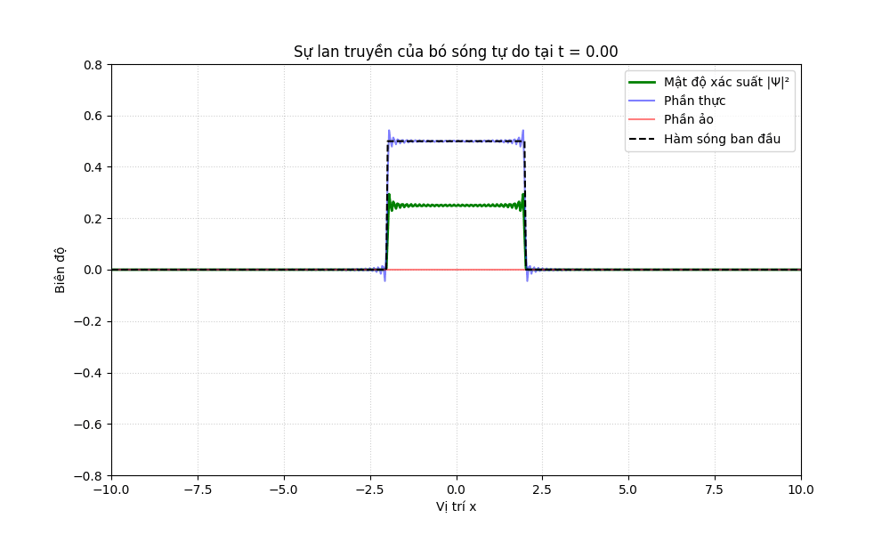

**Mục lục:**

Nội dung của bài này bao gồm:

1. [Trường thế](#1-trường-thế)  
2. [Lời giải](#2-lời-giải)  
3. [Ví dụ](#3-ví-dụ)  
4. [Phụ lục](#4-phụ-lục)  
5. [Tham khảo](#5-tham-khảo)

## 1. Trường thế

Khác với trường thế của Infinite box, trường thế của chất điểm chuyển động tự do bằng $0$ tại mọi điểm, hay:

$$
V(x) = 0, \quad \forall x \tag{1.1}
$$

Vậy khi đó phương trình Schrodinger độc lập thời gian cho trường thế này sẽ có dạng:

$$
-\frac{\hbar^2}{2m} \frac{d^2 \psi(x)}{dx^2} = E \psi(x) \tag{1.2}
$$

Và như đã biết trong “Bài 4: Infinite box”, lời giải tổng quát cho $(1.2)$ sẽ có dạng:

$$
\psi(x) = A \sin(kx) + B \cos(kx) \tag{1.3}
$$

Trong đó:

- $A, B$ là các hằng số khi lấy tích phân.  
- $k = \frac{\sqrt{2mE}}{\hbar}$ là số sóng.

Tuy nhiên để thuận tiện cho các diễn giải phía sau, tôi sẽ viết lại $(1.3)$ dưới dạng:

$$
\psi(x) = A e^{ikx} + B e^{-ikx} \tag{1.4}
$$

*(Bạn đọc có thể tham khảo cách biến đổi $(1.3)$ sang $(1.4)$ tại phần phụ lục.)*

Vậy nếu ta kết hợp lời giải của $(1.4)$ với lời giải của Phương trình Schrodinger phụ thuộc thời gian, ta sẽ thu được:

$$
\Psi(x,t) = (A e^{ikx} + B e^{-ikx}) e^{\frac{-iEt}{\hbar}} = A e^{ik\left(x - \frac{\hbar k}{2m}t\right)} + B e^{-ik\left(x + \frac{\hbar k}{2m}t\right)} \tag{1.5}
$$

Trong cơ học lượng tử, năng lượng của hạt tự do luôn dương ($E > 0$), do đó tần số góc $\omega = \frac{E}{\hbar}$ luôn luôn dương. Hướng lan truyền của sóng thực chất được quyết định bởi **dấu của số sóng $k$** trong biểu thức pha. Vậy ta có thể dễ dàng thấy rằng thành phần đầu tiên của $(1.5)$ đại diện cho sóng lan truyền về “bên phải” ($A e^{ik\left(x - \frac{\hbar k}{2m}t\right)}$) và thành phần thứ hai ($B e^{-ik\left(x + \frac{\hbar k}{2m}t\right)}$) đại diện cho sóng lan truyền sang bên trái. Khi đó ta có thể viết lại $(1.5)$ một cách tổng quát như sau:

$$
\Psi_k(x,t) = A e^{i \left(kx - \frac{\hbar k^2}{2m}t\right)} \tag{1.6}
$$

Với $k$ có thể nhận giá trị âm để mô tả sóng chuyển động theo chiều âm, hay:

$$
k \equiv \pm \frac{\sqrt{2mE}}{\hbar} \tag{1.7}
$$

## 2. Lời giải

### 2.1. Chuẩn hóa

Công thức $(1.6)$ có thể là lời giải (nghiệm riêng) cho Phương trình Schrodinger với trường thế bằng $0$ tại mọi điểm nếu chúng ta có thể tìm ra hằng số tích phân $A$. Và để tìm hằng số này, chúng ta tiếp tục sử dụng công thức chuẩn hóa:

$$
\int_{-\infty}^{\infty} |\Psi(x)|^2 \, dx = 1 \tag{2.1}
$$

Vậy thay $(1.7)$ vào $(2.1)$ ta có:

$$
\int_{-\infty}^{+\infty} \Psi_k^* \Psi_k \, dx = |A|^2 \int_{-\infty}^{+\infty} dx = |A|^2 (\infty) = 1 \tag{2.2}
$$

Có gì đó không đúng? Đúng vậy, chúng ta không thể chuẩn hóa được hàm sóng trên hay không thể tìm được $A$. Điều này có nghĩa rằng, “không có chất điểm chuyển động tự do với một mức năng lượng xác định”. Vậy có nghĩa rằng chúng ta không thể sử dụng phương pháp tách biến để giải Phương trình Schrodinger cho chất điểm chuyển động tự do? Không hẳn vậy, chúng ta hãy cùng xem xét lập luận sau.

### 2.2. Lập luận

- Nếu chúng ta còn nhớ trong “Bài 4: Infinite Box” thì do điều kiện biên tại 2 thành hộp sẽ khiến cho số sóng $k$ nhận các giá trị rời rạc (lượng tử hóa). Tuy nhiên đối với chất điểm chuyển động tự do, không có điều kiện biên nào cả, vì vậy $k$ có thể nhận bất kỳ giá trị nào tùy ý (hay $k$ sẽ là **biến liên tục**).  
- Theo nguyên lý chồng chất trạng thái, **nghiệm tổng quát** sẽ là tổ hợp của các **nghiệm riêng**.

Từ hai quan điểm trên, thay vì tính tổng rời rạc $\sum$ các nghiệm riêng như trong “Infinite Box”, đối với chất điểm chuyển động tự do, ta sẽ lấy tích phân trên toàn bộ miền của $k$. Ta gộp việc tìm hằng số tích phân $A$ và các hệ số $c_n$ bằng cách đi tìm một hàm số liên tục $f(k)$ phụ thuộc vào $k$. Khi đó nghiệm tổng quát của Phương trình Schrodinger cho chất điểm tự do có thể viết dưới dạng:

$$
\Psi(x,t) = \int_{-\infty}^{+\infty} f(k) e^{i\left(kx - \frac{\hbar k^2}{2m} t\right)} \, dk \tag{2.3}
$$

Với $f(k)$ là một hàm số liên tục chưa biết phụ thuộc vào $k$. Để nghiệm tổng quát về sau đẹp hơn, tôi sẽ đặt:

$$
f(k) = \frac{1}{\sqrt{2\pi}} \phi(k) \tag{2.4}
$$

Vậy khi đó $(2.3)$ sẽ có dạng:

$$
\Psi(x, t) = \frac{1}{\sqrt{2\pi}} \int_{-\infty}^{+\infty} \phi(k) e^{i\left(kx - \frac{\hbar k^2}{2m} t\right)} \, dk \tag{2.5}
$$

Bằng cách sử dụng $(2.5)$, chúng ta có thể chuẩn hóa hàm sóng với một hàm $\phi(k)$ phù hợp, bài toán của chúng ta quy về việc tìm dạng hàm đúng của $\phi(k)$.

Trong các bài toán của cơ học lượng tử, chúng ta thường sẽ được cho biết dạng hàm của hàm sóng ban đầu hay $\Psi(x,0)$. Vì $\phi(k)$ là một hàm số phụ thuộc vào năng lượng (do bản thân số sóng $k$ chỉ phụ thuộc vào năng lượng $E$ và khối lượng $m$) mà không phụ thuộc vào thời gian nên tại $t=0$, chúng ta sẽ có:

$$
\Psi(x, 0) = \frac{1}{\sqrt{2\pi}} \int_{-\infty}^{+\infty} \phi(k) e^{ikx} \, dk \tag{2.6}
$$

Nếu đã từng nghiên cứu về phân tích Fourier, chúng ta sẽ dễ dàng nhận ra và tìm được $\phi(k)$ bằng cách sử dụng **Định lý nghịch đảo Fourier** (Fourier Inversion Theorem):

$$
f(x) = \frac{1}{\sqrt{2\pi}} \int_{-\infty}^{+\infty} F(k) e^{ikx} \, dk \quad \iff \quad F(k) = \frac{1}{\sqrt{2\pi}} \int_{-\infty}^{+\infty} f(x) e^{-ikx} \, dx \tag{2.7}
$$

Với:

- $F(k)$ được gọi là **biến đổi Fourier** của $f(x)$.  
- $f(x)$ là **biến đổi Fourier ngược** của $F(k)$.

Áp dụng định lý này, $\phi(k)$ sẽ có dạng:

$$
\phi(k) = \frac{1}{\sqrt{2\pi}} \int_{-\infty}^{+\infty} \Psi(x, 0) e^{-ikx} \, dx \tag{2.8}
$$

Vậy chúng ta đã cùng đi qua cách giải Phương trình Schrodinger cho chất điểm chuyển động tự do bằng $(2.5)$ và $(2.8)$. Ở phần tiếp theo, chúng ta sẽ cùng đi qua một ví dụ để hiểu rõ hơn về các bài toán thực tế mà chúng ta có thể gặp.
## 3. Nhận xét và ví dụ
     
### 3.1. Nhận xét

> **Phổ** của chất điểm là liên tục: khi $k$ liên tục, đương nhiên năng lượng $E$ đo được cũng sẽ liên tục.

### 3.2. Ví dụ

Để bạn đọc dễ làm quen, tôi sẽ dùng lại ví dụ về chất điểm bị nhốt trong hộp chiều dài $a$ ($0 < x < a$) ở bài trước làm trạng thái ban đầu, và chất điểm sẽ được “thả” ra tại thời điểm $t=0$:

$$
\Psi(x,0) = Ax(a-x), \quad (0 \le x \le a) \tag{3.1}
$$

Biết rằng trường thế $V(x)=0$ tại mọi điểm, hãy tìm $\Psi(x,t)$.

**Lời giải:**

Như mọi bài toán khác, bước đầu tiên chúng ta cần làm là chuẩn hóa $(3.1)$. Nếu bạn còn nhớ thì hằng số $A=\sqrt{\frac{30}{a^5}}$, vậy $(3.1)$ trở thành:

$$
\Psi(x,0) = \sqrt{\frac{30}{a^5}} x(a-x) \tag{3.2}
$$

Sử dụng công thức $(2.8)$ để tìm dạng hàm của $\phi(k)$ ta có:

$$
\phi(k) = \frac{1}{\sqrt{2\pi}} \int_{-\infty}^{+\infty} \Psi(x, 0) e^{-ikx} \, dx = \sqrt{\frac{30}{2\pi a^5}} \int_{0}^{a} x (a - x) e^{-ikx} \, dx \tag{3.3}
$$

Bạn đọc có thể dễ dàng tính được tích phân $(3.3)$ trên bằng cách nhân đa thức sau đó tính tích phân từng phần. Ở đây tôi sẽ dùng kết quả luôn (bạn đọc có thể tự kiểm tra lại):

$$
\phi(k) = \sqrt{\frac{30}{2\pi a^5}} \left[ -\frac{a}{k^2} \left(1 + e^{-ika}\right) - \frac{2i}{k^3} \left(1 - e^{-ika}\right) \right] \tag{3.4}
$$

Thay $(3.4)$ vào phương trình $(2.5)$, ta thu được nghiệm tổng quát có dạng:

$$
\Psi(x, t) = \frac{1}{2\pi}\sqrt{\frac{30}{a^5}} \int_{-\infty}^{+\infty} \left[ -\frac{a}{k^2} \left(1 + e^{-ika}\right) - \frac{2i}{k^3} \left(1 - e^{-ika}\right) \right] e^{i\left(kx - \frac{\hbar k^2}{2m} t\right)} \, dk \tag{3.5}
$$

### 3.3. Mô phỏng

Vì công thức $(3.5)$ rất phức tạp để mô tả trên máy tính, nên tôi sẽ sử dụng lời giải cho hàm sóng có trạng thái ban đầu đơn giản hơn. Bạn đọc có thể coi đây như một bài ôn tập.

**Ví dụ:** Một chất điểm ban đầu được đặt trong một hộp ($-a < x < a$), tại thời điểm $t=0$ chất điểm được thả ra, hàm sóng tại thời điểm đó có dạng: 

$$
\Psi(x,0) = \begin{cases} A & -a < x < a \\ 0 & \text{otherwise} \end{cases}
$$

Trong đó $A, a$ là các số thực dương. Tìm $\Psi(x,t)$.

**Lời giải:**

Nghiệm của bài toán này sẽ có dạng một hàm `sinc`:

$$
\Psi(x, t) = \frac{1}{\pi \sqrt{2a}} \int_{-\infty}^{\infty} \frac{\sin(ka)}{k} e^{i \left( kx - \frac{\hbar k^2}{2m} t \right)} \, dk \tag{3.6}
$$

Để đơn giản hóa trong việc mô phỏng $(3.6)$, tôi sẽ chọn chiều dài của hộp bằng $4$ (hay $a=2$), $\hbar = 1, m=1$. Đây là code Python sử dụng để mô phỏng sự tiến hóa theo thời gian của $(3.6)$ (Chi tiết mã nguồn xem tại [GitHub Gist](https://gist.github.com/3591f7ba28e0bf5ca1e2e1d4c8debbfa.git)):

  
*(Hình 3.1. Mô tả sự lan truyền của bó sóng với trường thế tự do)*

Ta dễ dàng nhận thấy rằng, chất điểm sau khi được “thả” đã lan truyền về cả 2 hướng. Tuy nhiên, xác suất (hay biên độ dao động) vẫn tập trung cao nhất ở vị trí ban đầu. Bạn có thể tưởng tượng giống như việc chúng ta làm rơi một viên bi từ trong túi quần ra vậy: ban đầu viên bi được đặt cố định trong túi, tuy nhiên vì túi bị thủng, viên bi lăn ra ngoài mà chúng ta không biết. Chúng ta biết rằng xác suất tìm thấy viên bi ngay cạnh mình sẽ cao hơn, nhưng vì viên bi lăn liên tục, để càng lâu thì xác suất tìm thấy nó ở vị trí ban đầu càng giảm.

**Góc nhìn Lượng tử (Nguyên lý bất định Heisenberg):**

Sự so sánh "viên bi rơi" phía trên khá trực quan dưới góc nhìn cổ điển. Tuy nhiên, để hiểu sâu hơn về bản chất lượng tử của sự lan rộng bó sóng (wave packet dispersion), chúng ta cần nhìn qua lăng kính của **Nguyên lý bất định Heisenberg** ($\Delta x \Delta p \ge \frac{\hbar}{2}$). 

Khi chất điểm bị nhốt trong hộp, vị trí của nó bị giới hạn trong một khoảng rất hẹp (độ bất định vị trí $\Delta x$ nhỏ). Theo nguyên lý Heisenberg, điều này bắt buộc độ bất định về động lượng $\Delta p$ phải lớn. Khi hạt được "thả" tự do, chính sự đa dạng về các vận tốc khả dĩ này (do $\Delta p$ lớn) đã khiến bó sóng nhanh chóng bị "tòe" ra (spread out) và lan rộng khắp không gian theo thời gian.

Trong bài này chúng ta đã tìm hiểu qua về một trường hợp mà phổ của chất điểm là liên tục. Ở bài tiếp theo, chúng ta sẽ cùng nghiên cứu một trong các hiện tượng thú vị nhất của cơ học lượng tử: **hiện tượng xuyên hầm** (Quantum Tunneling).

## 4. Phụ lục

### 4.1. Chuyển đổi dạng mũ phức sang dạng sin, cos

Giả sử ta có hàm sóng dạng:

$$
\psi(x) = C_1 e^{ikx} + C_2 e^{-ikx} \tag{4.1}
$$

Để chuyển đổi hàm này sang dạng sin, cos ta sẽ sử dụng công thức Euler:

$$
e^{ikx} = \cos(kx) + i\sin(kx), \quad e^{-ikx} = \cos(kx) - i\sin(kx) \tag{4.2}
$$

Thay $(4.2)$ vào $(4.1)$ ta được:

$$
\begin{aligned} 
\psi(x) &= C_1 (\cos(kx) + i\sin(kx)) + C_2 (\cos(kx) - i\sin(kx)) \\
&= (C_1 + C_2)\cos(kx) + i(C_1 - C_2)\sin(kx) 
\end{aligned}
$$

Để đơn giản hóa, chúng ta đặt lại các hằng số:

$$
\begin{aligned} 
B &= C_1 + C_2 \\
A &= i(C_1 - C_2) 
\end{aligned}
$$

Khi đó $(4.1)$ trở thành:

$$
\psi(x) = A \sin(kx) + B \cos(kx) \tag{4.3}
$$

Đây chính là cơ sở toán học để biến đổi qua lại giữa dạng hàm mũ phức và dạng sóng lượng giác trong lời giải của phương trình Schrödinger.

## 5. Tham khảo

### Sách giáo trình

1. Griffiths, D. J., & Schroeter, D. F. (2018). *Introduction to Quantum Mechanics* (3rd ed.). Cambridge University Press. (Chương 2: The Free Particle).
2. Shankar, R. (1994). *Principles of Quantum Mechanics* (2nd ed.). Springer.

### Tài liệu Web

1. [The free particle - TN2304 Kwantummechanica 1](https://qm1.quantumtinkerer.tudelft.nl/6_the_free_particle/)  
2. [2.2: Free Particle- Wave Packets - Physics LibreTexts](https://phys.libretexts.org/Bookshelves/Quantum_Mechanics/Essential_Graduate_Physics_-_Quantum_Mechanics_%28Likharev%29/02%3A_1D_Wave_Mechanics/2.02%3A_Free_Particle-_Wave_Packets)
