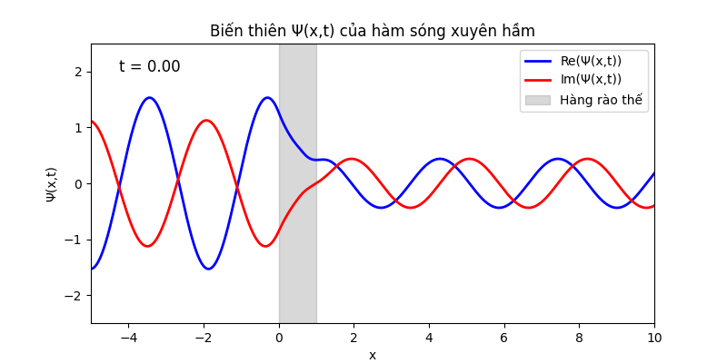

**Mục lục:**

Nội dung của bài này bao gồm:

1. [Dẫn nhập](#1-dẫn-nhập)  
2. [Giả định và lời giải](#2-giả-định-và-lời-giải)  
3. [Nhận xét](#3-nhận-xét)  
4. [Phụ lục](#4-phụ-lục)  
5. [Tham khảo](#5-tham-khảo)

## 1. Dẫn nhập

Xuyên hầm lượng tử (Quantum Tunneling) là một hiện tượng rất thú vị trong cơ học lượng tử khi mà các hạt vi mô (như electron, proton, …) có khả năng vượt qua những rào cản năng lượng mà theo lý thuyết cổ điển, chúng không có đủ năng lượng để "leo" qua. Đây là một bằng chứng sống động cho bản chất sóng – hạt của vật chất, vốn được mô tả bởi hàm sóng trong cơ học lượng tử.

Bạn đọc có thể không để ý nhưng xuyên hầm lượng tử là một trong các hiện tượng tác động đến đời sống hằng ngày của chúng ta nhiều nhất? Có thể bạn đọc sẽ không tin, vì vậy chúng ta cùng tìm hiểu qua về phản ứng tổng hợp hạt nhân của mặt trời.

### **Phản ứng hạt nhân**

Phản ứng hạt nhân là quá trình trong đó hạt nhân của nguyên tử thay đổi cấu trúc, thường qua việc tách ra (phân hạch) hoặc hợp nhất (tổng hợp) với các hạt nhân khác, dẫn đến giải phóng hoặc hấp thụ một lượng năng lượng khổng lồ. Đây là một hiện tượng vật lý đặc biệt, liên quan mật thiết đến bản chất của vật chất và năng lượng ở cấp độ nguyên tử.

![][image1] 
*(Hình 1.1: Mô tả phản ứng tổng hợp hạt nhân của 2 nguyên tử Hidro)* *(Nguồn: [Kindpng](https://www.kindpng.com/imgv/hhbwxii_deuterium-tritium-fusion-hd-png-download/))*

Phản ứng tổng hợp Heli trong lõi mặt trời từ hai nguyên tử Hidro được coi là phản ứng tổng hợp hạt nhân. Điều kiện lý thuyết để phản ứng trên xảy ra là khi các Proton có thể vượt qua lực đẩy Coulomb giữa hai Proton để tiếp cận nhau. Như chúng ta đã được học trong chương trình vật lý phổ thông, năng lượng nói trên có thể được biểu diễn qua công thức:

$$
E_C = \frac{Z_1 Z_2 e^2}{4 \pi \epsilon_0 r} \tag{1.1}
$$

Trong đó:

- $Z_1, Z_2$ đây là số hiệu hạt nhân (hoặc số proton) của hai hạt tương tác. Ví dụ, đối với hai proton trong phản ứng hợp hạch, $Z_1 = Z_2 = 1$. Với các hạt có điện tích khác, các giá trị này sẽ thay đổi theo số lượng điện tích dương (hoặc âm, trong trường hợp điện tích trái dấu).  
- $e$ là điện tích cơ bản của một electron (mặc dù electron mang điện tích âm, nhưng khi tính năng lượng tương tác chúng ta thường dùng giá trị tuyệt đối). Điện tích cơ bản có giá trị khoảng $1.602 \times 10^{-19}$ Coulomb.  
- $\epsilon_0$ là hằng số môi trường điện tích trong chân không, hay còn gọi là hằng số điện môi chân không. Giá trị của nó khoảng $8.854 \times 10^{-12} \text{ F/m}$ (Farad trên mét).  
- $r$ là khoảng cách giữa hai hạt, cụ thể là khoảng cách từ tâm của hạt này đến tâm của hạt kia. Trong các bài toán, $r$ thường được tính ở đơn vị femtometer (fm), với $1 \text{ fm} = 10^{-15} \text{ m}$.

 

Công thức trên mô tả năng lượng tĩnh điện (hay còn gọi là năng lượng Coulomb) giữa hai hạt mang điện tích điểm. Đây là biểu thức cho lượng năng lượng mà bạn cần (hoặc được giải phóng) khi đưa hai điện tích từ vô cực đến khoảng cách $r$ với nhau.

Đối với trường hợp bài toán của chúng ta, $Z_1 = Z_2 = 1$ (vì proton có điện tích $+1$) và đặt $r$ khoảng 1 femtometer – khoảng cách mà lực hạt nhân mạnh bắt đầu “hành động” để kết hợp hạt nhân – ta có:

$$
E_C \approx \frac{1.44 \, \text{MeV} \cdot \text{fm}}{1 \, \text{fm}} \approx 1.44 \, \text{MeV}
$$

Đây là năng lượng cần thiết để đưa 2 Proton đến khoảng cách đủ gần để lực hạt nhân mạnh hoạt động.

### **Điều kiện nhiệt độ**

Như chúng ta đã biết, nhiệt độ chỉ là một biểu diễn khác của động năng nguyên tử. Trong nhiệt động lực học, đối với một hệ thống ở trạng thái cân bằng, năng lượng động học trung bình của các hạt được quy đổi sang đơn vị năng lượng bằng hằng số Boltzmann $k_B$. Hằng số này có giá trị:

$$
k_B \approx 8.617 \times 10^{-5} \, \text{eV/K}
$$

Điều này có nghĩa là, đối với mỗi $1$ Kelvin tăng lên trong nhiệt độ, năng lượng trung bình của một hạt tăng thêm khoảng $8.617 \times 10^{-5}$ electron Volt (eV).

Ở dạng đơn giản, chúng ta nói rằng:

$$
E \sim k_B T
$$

Vậy nếu năng lượng cần cung cấp là $1.44 \text{ MeV}$ thì nhiệt độ cần thiết có thể được tính thông qua công thức:

$$
T \approx \frac{E_C}{k_B} = \frac{1.44 \times 10^6 \, \text{eV}}{8.617 \times 10^{-5} \, \text{eV/K}} \approx 1.67 \times 10^{10} \, \text{K}
$$

Vậy chúng ta cần đưa nhiệt độ của hệ lên xấp xỉ 16,7 tỷ độ C (nếu quy đổi từ độ K sang độ C).

Ngoài điều kiện về nhiệt độ, chúng ta còn cần quan tâm đến mật độ của hệ (yếu tố quyết định tần suất va chạm giữa các Proton). Tuy nhiên, mật độ hạt trên mặt trời cực kỳ lớn, khoảng $10^{26}$ hạt proton trên mỗi mét khối. Mật độ này tạo ra một môi trường dày đặc, cho phép các proton có cơ hội va chạm với nhau nhiều hơn và do đó tăng khả năng xảy ra phản ứng hợp hạch. Vì vậy tôi sẽ không đi sâu vào lý thuyết của phần này.

Theo các đo đạc quang phổ mặt trời, mô hình hóa sao chuẩn và Định luật Stefan-Boltzmann, các nhà khoa học đã đo đạc nhiệt độ của mặt trời rơi vào khoảng 5,500 - 15,000,000 độ C (Bạn đọc có thể tham khảo thêm cách ước lượng nhiệt độ trên tại phần phụ lục). Vậy mặc dù tại lõi của mặt trời nhiệt độ cũng chỉ đạt 15 triệu độ, cách khá xa nhiệt độ cần thiết 16,7 tỷ độ để phản ứng hợp hạch xảy ra. Nên nhớ rằng đa số năng lượng phát ra từ mặt trời đều đến từ phản ứng hợp hạch trên, đây chính là lúc hiệu ứng “Xuyên hầm” phát huy tác dụng.

## 2. Giả định và lời giải
     
### **Giả định**

Ở đây tôi sẽ giả định trường thế của chất điểm sẽ bằng $V_0$ (dương và bé hơn vô cùng) trong đoạn từ gốc tọa độ đến $L$ để mô tả một bức tường. Biểu diễn toán học của trường thế này sẽ có dạng:

$$
V(x) = \begin{cases} V_0 & 0 < x < L \\ 0 & \text{otherwise} \end{cases}
$$

![][image2] 
*(Hình 2.1: Mô tả trường thế của bức tường)*

Ta sẽ cùng tìm hiểu nghiệm của Phương trình Schrodinger độc lập thời gian đối với trường thế này với năng lượng toàn phần của hạt $E < V_0$.

### **Lời giải**

- **Trong đoạn $x<0$ (Trường thế $V(x) = 0$):**

 

Trong 2 bài trước chúng ta đã biết rằng nghiệm của Phương trình Schrodinger độc lập thời gian đối với trường thế bằng không có thể viết dưới 2 dạng sin/cos hoặc dạng hàm mũ. Ở đây tôi sẽ dùng dạng hàm mũ:

$$
\psi(x) = A e^{ikx} + B e^{-ikx} \tag{2.1}
$$

Và nếu chúng ta còn nhớ thì $(2.1)$ không thể chuẩn hóa trong đoạn từ âm vô cực đến $0$ (bạn đọc có thể tự kiểm tra lại bằng cách lấy tích phân trong đoạn này của $(2.1)$). Tuy nhiên, ở đây chúng ta đang nghiên cứu tính chất “Xuyên hầm” nên tôi tạm bỏ qua bước chuẩn hóa này và biến đổi $(2.1)$ bằng cách chia nó cho $A$, ta được:

$$
\psi_I(x) = \frac{A}{A} e^{ikx} + \frac{B}{A} e^{-ikx} = e^{ikx} + R e^{-ikx} \tag{2.2}
$$

Sở dĩ tôi có thể viết lại $(2.1)$ thành $(2.2)$ vì các lý do sau:

1. Theo nguyên lý chồng chất trạng thái (Phụ lục Bài 2: Phương trình Schrodinger), khi $\psi_1, \psi_2$ là nghiệm của Phương trình Schrodinger thì một tổ hợp tuyến tính **bất kỳ** cũng sẽ là nghiệm. Do đó, nếu $(2.1)$ là nghiệm thì $(2.1)/A$ cũng là nghiệm.  
2. Các hằng số tích phân $A, B$ vốn được xác định bằng việc chuẩn hóa hàm sóng trên toàn bộ không gian. Nhưng như đã nêu phía trên, $(2.1)$ vốn không thể chuẩn hóa nên việc dùng $(2.1)$ hay $(2.2)$ không có sự khác biệt.  
3. Nếu chúng ta để ý, thành phần đầu tiên của $(2.2)$ là $e^{ikx}$ đại diện cho sóng đi theo trục dương của trục Ox. Trong bài toán này chúng ta cũng giả định rằng chất điểm di chuyển từ trái sang phải, vì vậy thành phần này đóng vai trò như **sóng tới**, còn thành phần thứ hai là $R e^{-ikx}$ tượng trưng cho sóng đi ngược chiều dương (đóng vai trò là **sóng phản xạ**). Biên độ sóng đại diện cho mật độ xác suất, vì vậy việc chuẩn hóa sóng tới bằng $1$ sẽ cho chúng ta biết biên độ sóng phản xạ có tương quan như thế nào so với sóng tới.

 

- **Trong đoạn $x > L$ (Trường thế $V(x) = 0$):**

 

Tương tự như trong đoạn $x < 0$, nghiệm của Phương trình Schrodinger độc lập thời gian trong đoạn này cũng sẽ có dạng:

$$
\psi(x) = T e^{ikx} + G e^{-ikx} \tag{2.3}
$$

Thành phần $T e^{ikx}$ tương tự là đại diện cho sóng truyền theo chiều dương. Tuy nhiên, vì sóng truyền theo chiều dương sẽ đi đến vô cùng nên chúng ta sẽ không có sóng phản xạ dội lại từ phía đó. Vì vậy $G=0$, khi đó ta viết lại $(2.3)$ thành:

$$
\psi_{III}(x) = T e^{ikx} \tag{2.4}
$$

*Chú ý: Thành phần $k$ trong các công thức $(2.2)$ và $(2.4)$ là tương tự nhau và bằng $k = \sqrt{\frac{2mE}{\hbar^2}}$ vì năng lượng toàn phần $E$ của hạt là không đổi. Nếu chất điểm vượt qua được tường thì động năng của nó vẫn giữ nguyên, mặc dù biên độ sóng tại hai vùng này có thể khác nhau.*

- **Trong đoạn $0 < x < L$ (Trường thế $V(x) = V_0$):**

 

Phương trình Schrodinger độc lập thời gian trong đoạn này có dạng:

$$
-\frac{\hbar^2}{2m} \frac{d^2\psi(x)}{dx^2} + V_0 \psi(x) = E \psi(x) \tag{2.5}
$$

Chuyển các thành phần giống nhau về cùng một vế, sau đó nhân cả 2 vế với $-\frac{2m}{\hbar^2}$, ta được:

$$
\frac{d^2\psi(x)}{dx^2} = \frac{2m}{\hbar^2}(V_0 - E) \psi(x) \tag{2.6}
$$

Đặt:

$$
\kappa \equiv \sqrt{\frac{2m(V_0 - E)}{\hbar^2}} \tag{2.7}
$$

Khi đó $(2.6)$ trở thành:

$$
\psi''(x) = \kappa^2 \psi(x) \tag{2.8}
$$

Như đã trình bày trong các bài trước, nghiệm của phương trình vi phân $(2.8)$ cũng sẽ có dạng:

$$
\psi_{II}(x) = C e^{\kappa x} + D e^{-\kappa x} \tag{2.9}
$$

Trong đó $C, D$ cũng là các hằng số tích phân.

Nhưng ở đây sẽ có sự khác biệt vì $V_0 > E$, do đó $\kappa$ trong $(2.7)$ là một số thực. Vậy $(2.9)$ là một hàm số thực, hay nói cách khác hàm sóng trong đoạn này **không dao động (không chứa thành phần sin, cos)** mà chỉ giảm hoặc tăng theo hàm mũ (tượng trưng cho việc hàm sóng đang suy giảm trong quá trình xuyên hầm).

* **Điều kiện biên**

 

Tương tự như bài toán hạt trong giếng thế, hàm sóng đối với chất điểm xuyên tường cần phải liên tục tại các biên ($x = 0, x = L$). Tuy nhiên, khác với giếng thế vô hạn, rào thế ở đây có độ cao hữu hạn $V_0$, nên ta cần thêm điều kiện **đạo hàm bậc nhất của hàm sóng cũng phải liên tục** tại các biên.

1. Tại $x = 0$:

Điều kiện liên tục hàm sóng yêu cầu $\psi_I(0) = \psi_{II}(0)$:

$$
e^{ik \cdot 0} + R e^{-ik \cdot 0} = C e^{\kappa \cdot 0} + D e^{-\kappa \cdot 0} \implies 1 + R = C + D \tag{2.10}
$$

Điều kiện liên tục của đạo hàm yêu cầu $\psi'_I(0) = \psi'_{II}(0)$:

$$
ik(1 - R) = \kappa (C - D) \tag{2.11}
$$

2. Tại $x = L$:

Tương tự, điều kiện liên tục hàm sóng yêu cầu $\psi_{II}(L) = \psi_{III}(L)$:

$$
C e^{\kappa L} + D e^{-\kappa L} = T e^{ik L} \tag{2.12}
$$

Điều kiện liên tục của đạo hàm yêu cầu $\psi'_{II}(L) = \psi'_{III}(L)$:

$$
\kappa \left(C e^{\kappa L} - D e^{-\kappa L}\right) = ik T e^{ikL} \tag{2.13}
$$

Kết hợp $(2.10), (2.11), (2.12)$ và $(2.13)$, ta có một hệ 4 phương trình 4 ẩn $(R, C, D, T)$. Bạn đọc có thể tham khảo chi tiết cách giải ở phần phụ lục. Ở đây tôi sẽ trình bày nghiệm trực tiếp:

$$
T = \frac{4ik\kappa e^{-ikL}}{(ik+\kappa)^2 e^{\kappa L} - (ik-\kappa)^2 e^{-\kappa L}} \tag{2.14}
$$

Đây là biên độ của sóng truyền qua. Để biết xác suất sóng truyền qua là bao nhiêu, ta tính hệ số truyền qua (Transmission coefficient) $|T|^2$:

$$
|T|^2 = \frac{1}{1 + \frac{V_0^2\sinh^2(\kappa L)}{4E(V_0-E)}} \tag{2.15}
$$

Với hàm sinh hyperbolic được định nghĩa là:

$$
\sinh(x) = \frac{e^x - e^{-x}}{2} \tag{2.16}
$$

Đối với hệ số của sóng phản xạ, ta có:

$$
R = \frac{(k^2 + \kappa^2)\sinh(\kappa L)}{2ik\kappa\cosh(\kappa L) + (k^2 - \kappa^2)\sinh(\kappa L)} \tag{2.17}
$$

Và vì tổng xác suất truyền qua và phản xạ phải bằng $1$, ta có hệ số phản xạ (Reflection coefficient) là:

$$
|R|^2 = 1 - |T|^2 \tag{2.18}
$$

*Chú ý: Ở đây chúng ta không tính xác suất của hàm sóng trong tường vì các hệ số $R$ (Phản xạ) và $T$ (Truyền qua) **không phải** là xác suất không gian. Chúng đại diện cho dòng xác suất (số hạt đi qua một mặt cắt trong một đơn vị thời gian - xem thêm tại phụ lục).*

Cuối cùng là $C, D$, được xác định qua:

$$
C = \frac{1}{2} \left[ (1 + R) + \frac{ik}{\kappa} (1 - R) \right], \quad D = \frac{1}{2} \left[ (1 + R) - \frac{ik}{\kappa} (1 - R) \right] \tag{2.19}
$$

### **Mô phỏng**

Bạn đọc có thể tham khảo mã nguồn Python mô phỏng lại hiện tượng xuyên hầm đối với sóng phẳng tại: [GitHub Gist](https://gist.github.com/luongle1911/5ea0ddf2243f9c19c1c63848c809cd80).

 
*(Hình 2.2: Mô tả sóng phẳng khi xuyên hầm)*

Qua đây ta có thể thấy rằng dù năng lượng của hạt không lớn hơn thế năng rào, nhưng vẫn có một xác suất hữu hạn để hạt lọt qua được. Đây là bằng chứng đanh thép cho tính chất sóng của vật chất vi mô.

Quay lại bài toán về việc đưa hai Proton lại gần nhau đủ để phản ứng tổng hợp hạt nhân xảy ra trên Mặt Trời: Dù điều kiện nhiệt độ thực tế còn cách khá xa mức năng lượng lý thuyết cần thiết, nhưng nhờ hiệu ứng xuyên hầm, vẫn sẽ có một xác suất nhỏ các Proton vượt qua được rào thế Coulomb và hợp hạch. Và chính cái "xác suất nhỏ" đó lại là nguồn năng lượng khổng lồ duy trì sự sống và mọi hoạt động trên Trái Đất.

## 3. Nhận xét

Nhận xét đầu tiên dễ thấy nhất là khi ta **tăng độ dày** của bức tường (tăng $L$), xác suất truyền qua ở phương trình $(2.15)$ sẽ **giảm**. Lý do là khi $L$ tăng thì $\sinh(\kappa L)$ sẽ tăng theo hàm mũ, làm cho mẫu số lớn lên rất nhanh, kéo theo $|T|^2$ giảm mạnh.

Thứ hai, khi ta **tăng năng lượng toàn phần** $E$ của hạt, xác suất truyền qua sẽ **tăng**. Khi $E$ tăng dần đến gần mức $V_0$, hệ số suy giảm $\kappa$ sẽ nhỏ đi, kéo theo $\sinh^2(\kappa L)$ cũng giảm (giảm nhanh hơn cụm $4E(V_0-E)$ dưới mẫu). Điều này làm cho phân số ở mẫu của $(2.15)$ nhỏ lại, giúp $|T|^2$ tăng lên.

Thứ ba, khi ta **tăng độ cao** của bức tường (tăng $V_0$), xác suất truyền qua sẽ **giảm**. Khi $V_0$ tăng, cả $\sinh(\kappa L)$ và $V_0^2$ đều tăng rất nhanh (nhanh hơn nhiều so với $4E(V_0-E)$). Hệ quả là mẫu số của $(2.15)$ phình to, bóp nghẹt xác suất xuyên hầm.

Sóng tới, sóng phản xạ và sóng truyền qua có **cùng tần số (tốc độ góc) và bước sóng**. Như đã đề cập, năng lượng toàn phần của hạt được bảo toàn, do đó trong các vùng tự do ($x < 0$ và $x > L$), hằng số sóng $k$ là như nhau, dẫn đến bước sóng và tần số góc đồng nhất trên toàn miền.

Sóng tới và sóng phản xạ tạo thành **sóng dừng từng phần (Partial Standing Wave)**. Ta dễ dàng nhận ra điều này vì sóng tới và sóng phản xạ chuyển động ngược chiều nhau, có cùng bước sóng và tần số. Tuy nhiên, do một phần năng lượng đã bị "rò rỉ" qua rào thế, biên độ sóng phản xạ luôn nhỏ hơn sóng tới ($|R| < 1$). Sự chồng chập này tạo ra các bụng và nút sóng, nhưng biên độ tại nút sẽ không bao giờ triệt tiêu hoàn toàn về $0$ như sóng dừng lý tưởng.

## 4. Phụ lục

### 4.1. Giải hệ phương trình của hàm sóng trong rào thế

Nhắc lại hệ 4 phương trình của chúng ta:

$$
\begin{cases} 
\Psi_{II}(L) = \Psi_{III}(L) \implies C e^{\kappa L} + D e^{-\kappa L} = T e^{ikL} & (1) \\
\Psi'_{II}(L) = \Psi'_{III}(L) \implies \kappa (C e^{\kappa L} - D e^{-\kappa L}) = ik T e^{ikL} & (2) \\
\Psi_I(0) = \Psi_{II}(0) \implies 1 + R = C + D & (3) \\
\Psi'_I(0) = \Psi'_{II}(0) \implies ik(1 - R) = \kappa (C - D) & (4)
\end{cases}
$$

### **Bước 1: Tìm $C, D$**

Từ phương trình $(3)$ và $(4)$ ta có:

* $(3): C + D = 1 + R$  
* $(4): C - D = \frac{ik(1 - R)}{\kappa}$

Cộng và trừ hai vế của hai phương trình trên, ta có:

$$
C = \frac{1}{2} \left[ (1 + R) + \frac{ik}{\kappa} (1 - R) \right], \quad D = \frac{1}{2} \left[ (1 + R) - \frac{ik}{\kappa} (1 - R) \right] \tag{4.1}
$$

### **Bước 2: Tìm $R, T$**

Thay $(4.1)$ vào phương trình $(1)$ ta được:

$$
\frac{1}{2} \left[ \left( (1 + R) + \frac{ik(1 - R)}{\kappa} \right) e^{\kappa L} + \left( (1 + R) - \frac{ik(1 - R)}{\kappa} \right) e^{-\kappa L} \right] = T e^{ikL} \tag{4.2}
$$

Viết gọn lại bằng các hàm hyperbolic $\cosh$ và $\sinh$:

$$
(1 + R)\cosh(\kappa L) + \frac{ik(1 - R)}{\kappa}\sinh(\kappa L) = T e^{ikL} \tag{4.3}
$$

Tương tự, ta thay $(4.1)$ vào phương trình $(2)$:

$$
\frac{\kappa}{2} \left[ \left( (1 + R) + \frac{ik (1 - R)}{\kappa} \right) e^{\kappa L} - \left( (1 + R) - \frac{ik (1 - R)}{\kappa} \right) e^{-\kappa L} \right] = ik T e^{ik L} \tag{4.4}
$$

Hay:

$$
(1 + R) \kappa \sinh(\kappa L) + ik (1 - R) \cosh(\kappa L) = ik T e^{ik L} \tag{4.5}
$$

Chia cả 2 vế của $(4.5)$ cho $ik$ sau đó thay vào $(4.3)$ ta được phương trình 1 ẩn theo $R$, giải phương trình này ta thu được hệ số phản xạ:

$$
R = \frac{(k^2 + \kappa^2)\sinh(\kappa L)}{2ik\kappa\cosh(\kappa L) + (k^2 - \kappa^2)\sinh(\kappa L)} \tag{4.6}
$$

Thay ngược $(4.6)$ vào $(4.3)$ ta được phương trình 1 ẩn theo $T$, khi đó hệ số truyền qua là:

$$
T = \frac{4ik\kappa e^{-ikL}}{(ik + \kappa)^2 e^{\kappa L} - (ik - \kappa)^2 e^{-\kappa L}} \tag{4.7}
$$

Vậy là chúng ta đã hoàn thành việc giải hệ phương trình 4 ẩn trên.

### 4.2. Ước lượng nhiệt độ và xác định thành phần hóa học của mặt trời

### **Xác định thành phần hóa học**

Trước khi bước vào phân tích nhiệt độ của mặt trời, chúng ta cần phải biết thành phần hóa học của mặt trời bao gồm những gì. Nếu chúng ta còn nhớ trong chương trình hóa học lớp 10, các electron trong nguyên tử chỉ tồn tại tại các mức năng lượng riêng biệt. Chúng sẽ hấp thụ (hoặc phát xạ) photon để chuyển lên (hoặc giảm xuống) các mức năng lượng cho phép, và các nguyên tố hóa học khác nhau sẽ có các vạch hấp thụ (hoặc phát xạ) khác nhau. Vì vậy, ý tưởng chính của phương pháp phân tích quang phổ là:

**Bước 1:** Chiếu ánh sáng mặt trời qua một lăng kính để làm tán sắc ánh sáng và đặt một màn chắn phía sau để thu quang phổ của nó.

**Bước 2:** Xem xét các vạch hấp thụ (hoặc phát xạ) trong quang phổ này để xác định các thành phần hóa học của mặt trời.

Bạn đọc hoàn toàn có thể thực hiện thí nghiệm này tại nhà do quang phổ vạch hấp thụ của Hidro (đỏ) và Heli (vàng) đều nằm trong vùng quang phổ khả kiến (mắt thường có thể nhìn thấy được). Bằng các đo đạc thực nghiệm, các nhà khoa học nhận thấy rằng trong quang phổ vạch hấp thụ có các đường hấp thụ chính ở các bước sóng như $656.3 \text{ nm}$ (H-alpha), $486.1 \text{ nm}$ (H-beta) - đây là đường hấp thụ của **Hidro**; và các đường hấp thụ ở $587.6 \text{ nm}$ (He-D3), $447.1 \text{ nm}$ của **Heli**,... Từ đây ta có kết luận rằng thành phần hóa học chủ yếu của mặt trời là Hidro và Heli.

### **Xác định nhiệt độ bề mặt bằng định luật bức xạ Planck**

Trước tiên chúng ta phải biết rằng ánh sáng phát ra từ mặt trời giống như ánh sáng từ một **vật đen (Blackbody).**

**Vật đen (Blackbody)** là một vật thể lý tưởng hấp thụ toàn bộ bức xạ điện từ rơi vào nó và phát ra bức xạ ở mọi bước sóng.

**Bức xạ vật đen:** Là phổ bức xạ nhiệt phát ra bởi một vật đen, phụ thuộc vào nhiệt độ của nó.

Vật đen có một vài tính chất đặc biệt: phổ bức xạ vật đen có một cực đại tại một bước sóng nhất định và cường độ bức xạ tăng khi nhiệt độ của vật đen tăng.

Tiếp theo chúng ta cần biết thêm về **Định luật dịch chuyển Wien** (đặt tên theo nhà vật lý học người Đức - Fritz Franz Wien, 1864 - 1928) mô tả mối quan hệ giữa nhiệt độ của vật đen và bước sóng tại đó phổ bức xạ đạt cực đại.

Phương trình Wien có dạng:

$$
\lambda_{\text{max}} = \frac{b}{T} \tag{4.8}
$$

Trong đó:
- $\lambda_{\text{max}}$ là bước sóng tại cực đại của phổ bức xạ.
- $b$ là hằng số dịch chuyển Wien, khoảng $2.897 \times 10^{-3} \text{ m}\cdot\text{K}$.
- $T$ là nhiệt độ tuyệt đối của vật đen.

Vậy để đo nhiệt độ (bề mặt) của mặt trời ta chỉ cần đo bước sóng cực đại của phổ bức xạ. Việc này có thể thực hiện dễ dàng bằng phương pháp phân tích quang phổ, sau đó áp dụng công thức Wien để tìm được nhiệt độ mặt trời. Trong các đo đạc thực nghiệm, các nhà khoa học đã xác định bước sóng tại đó phổ bức xạ đạt cực đại của mặt trời là khoảng $500 \text{ nm}$ (xanh lục). Khi đó áp dụng công thức Wien ta được nhiệt độ của mặt trời bằng:

$$
T = \frac{2.897 \times 10^{-3} \text{ m}\cdot\text{K}}{0.5 \times 10^{-6} \text{ m}} \approx 5794 \text{ K}
$$

Ở phần phía trên chúng ta đã biết rằng thành phần chính của mặt trời là Hidro và Heli (trong đó Heli được tạo thành chủ yếu từ phản ứng tổng hợp hạt nhân) và phản ứng tổng hợp hạt nhân trên mặt trời chủ yếu đến từ Hidro và các đồng vị của nó (Hình 1.1). Quá trình tổng hợp hạt nhân này sẽ phát ra một lượng lớn Neutrino. Neutrino tương tác rất ít với vật chất (vì vậy đa số các Neutrino sinh ra trong lõi đều dễ dàng xuyên qua các lớp vật chất và thoát ra khỏi bề mặt của mặt trời) và rất nhạy với nhiệt độ (chỉ cần một thay đổi nhỏ về nhiệt độ cũng sẽ dẫn đến sự thay đổi rất lớn về tốc độ phản ứng, do đó ảnh hưởng đến số lượng neutrino phát ra).

Vì vậy, việc đo đạc nhiệt độ tại lõi của mặt trời sẽ phức tạp hơn vì chúng ta cần đo lượng Neutrino phát ra. Các phòng thí nghiệm nằm sâu trong lòng đất (để loại bỏ nhiễu từ tia vũ trụ) như Super-K (Nhật Bản), hay NOvA (Mỹ) đều được trang bị các máy dò Neutrino khổng lồ. Từ dữ liệu thu được, các nhà khoa học đã ước tính thành công nhiệt độ tại lõi của mặt trời rơi vào khoảng 15 triệu độ C.
### 4.3. Mật độ xác suất tìm thấy hạt trong tường và khái niệm dòng xác suất

### **4.3.1. Xác suất tìm thấy hạt trong tường**

Như đã nghiên cứu phía trên, chúng ta biết rằng phương trình hàm sóng trong tường không phải là một phương trình dao động mà là một phương trình suy giảm của hàm mũ thực. Vậy ta phải giải thích nó như thế nào?

Nhắc lại một chút, trong vùng rào thế (Vùng II), nơi năng lượng của hạt nhỏ hơn thế năng rào ($E < V_0$), Phương trình Schrödinger độc lập thời gian có dạng:

$$
-\frac{\hbar^2}{2m}\frac{d^2\psi_{II}}{dx^2} + V_0\psi_{II} = E\psi_{II} \tag{4.9}
$$

Viết lại phương trình ta có:

$$
\frac{d^2\psi_{II}}{dx^2} = \frac{2m(V_0 - E)}{\hbar^2}\psi_{II} \tag{4.10}
$$

Vì $E < V_0$, đại lượng $\frac{2m(V_0 - E)}{\hbar^2}$ là một số dương. Đặt $\kappa = \frac{\sqrt{2m(V_0 - E)}}{\hbar}$, ta có nghiệm tổng quát là một hàm thực tuyến tính của các hàm mũ:

$$
\psi_{II}(x) = Ae^{\kappa x} + Be^{-\kappa x} \tag{4.11}
$$

Với một rào thế có bề dày hữu hạn hoặc trải dài vô tận về một phía, thành phần vật lý hợp lý sẽ suy giảm theo hàm mũ:

$$
\psi_{II}(x) \approx Be^{-\kappa x} \tag{4.12}
$$

**Điểm mấu chốt:** Đúng là hàm số này không dao động (nó không có dạng $e^{ikx}$ hay $\sin(kx), \cos(kx)$ như vùng hạt tự do), nhưng theo tiên đề của cơ học lượng tử (Quy tắc Born), xác suất tìm thấy hạt tại vị trí $x$ được quyết định bởi bình phương module của hàm sóng:

$$
P(x) = |\psi_{II}(x)|^2 = |B|^2e^{-2\kappa x} \tag{4.13}
$$

Rõ ràng, $|B|^2e^{-2\kappa x} \neq 0$ với mọi $x$ hữu hạn. Dù hàm sóng suy giảm rất nhanh (evanescent wave), mật độ xác suất hoàn toàn lớn hơn $0$. Do đó, **vẫn có xác suất toán học để tìm thấy hạt bên trong rào thế.**

Điều này dường như khá phản trực giác vì nếu ta thừa nhận hạt có thể tồn tại trong tường thì ta phải xác nhận rằng động năng của hạt trong tường là âm (do trong tường thì $E < V_0$). Trong các giáo trình cơ bản thường có hai cách giải thích về hiện tượng này.

### **4.3.2. Phân tích theo Hệ thức bất định Năng lượng - Thời gian**

Dù cách giải thích này xuất hiện trong hầu hết các giáo trình vật lý đại cương vì tính trực quan của nó, nhưng dưới góc độ của Cơ học Lượng tử hàn lâm (như các giáo trình của Griffiths hay Sakurai), đây được coi là một **cách nói ẩn dụ (heuristic)** hoặc một "lời nói dối sư phạm" hơn là một cơ chế vật lý thực sự.

Dưới đây là phân tích chi tiết về sự thành công trong tính toán bán cổ điển và những lỗ hổng lý thuyết của góc nhìn này.

### **Sự thành công của góc nhìn "mượn năng lượng" (Tại sao nó được giảng dạy?)**

Góc nhìn này rất phổ biến vì nó dẫn đến một kết quả toán học ước lượng cực kỳ chính xác về xác suất xuyên hầm, tương đương với kết quả giải phương trình Schrödinger. Cụ thể:

Giả sử hạt có năng lượng $E$ đối mặt với rào thế có độ cao $V_0$ ($E < V_0$) và bề dày $a$.

Theo góc nhìn bán cổ điển, để vượt qua rào, hạt cần "mượn" một lượng năng lượng tối thiểu là:

$$
\Delta E = V_0 - E \tag{4.14}
$$

Theo hệ thức bất định, hạt chỉ có thể giữ lượng năng lượng vay mượn này trong một khoảng thời gian tối đa là:

$$
\Delta t \approx \frac{\hbar}{\Delta E} = \frac{\hbar}{V_0 - E} \tag{4.15}
$$

Với năng lượng "mới" là $V_0$, động năng của hạt bằng $\Delta E$. Vận tốc tương ứng của hạt lúc này sẽ là:

$$
v = \sqrt{\frac{2\Delta E}{m}} = \sqrt{\frac{2(V_0 - E)}{m}} \tag{4.16}
$$

Thời gian cần thiết để hạt đi xuyên qua bề dày $a$ của rào thế là:

$$
t_{\text{cross}} = \frac{a}{v} = a\sqrt{\frac{m}{2(V_0 - E)}} \tag{4.17}
$$

Để hiện tượng xuyên hầm có thể xảy ra với xác suất đáng kể, thời gian hạt được phép mượn năng lượng ($\Delta t$) phải lớn hơn hoặc xấp xỉ bằng thời gian cần để vượt qua rào ($t_{\text{cross}}$):

$$
\Delta t \ge t_{\text{cross}}
$$

Hay:

$$
\frac{\hbar}{V_0 - E} \ge a\sqrt{\frac{m}{2(V_0 - E)}} \tag{4.18}
$$

Chuyển vế và rút gọn, ta được:

$$
\frac{\sqrt{2m(V_0 - E)}}{\hbar}a \le 1 \tag{4.19}
$$

Đại lượng $\frac{\sqrt{2m(V_0 - E)}}{\hbar}$ chính xác là hằng số suy giảm $\kappa$ trong nghiệm của phương trình Schrödinger. Điều kiện trên trở thành:

$$
\kappa a \le 1 \tag{4.20}
$$

Và hệ số truyền qua (xác suất xuyên hầm) trong cơ học lượng tử được tính chính xác bằng $T \approx e^{-2\kappa a}$. Nghĩa là khi $\kappa a \le 1$, xác suất xuyên hầm là đáng kể. **Ước lượng bán cổ điển này cho ra kết quả hoàn toàn khớp với lý thuyết lượng tử chặt chẽ.** Đó là lý do nó được yêu thích.

### **Lỗ hổng học thuật (Tại sao nó không hoàn toàn đúng?)**

Mặc dù cho ra kết quả đẹp, nhưng góc nhìn "mượn năng lượng" vấp phải 3 vấn đề lớn về mặt nền tảng lý thuyết:

**Thứ nhất, thời gian không phải là một toán tử quan sát được (Observable Operator):**

Trong Cơ học Lượng tử chuẩn, vị trí ($x$), động lượng ($p$), và năng lượng ($E$) là các toán tử Hermitian. Nhưng thời gian ($t$) chỉ là một *tham số tiến hóa*, không phải là một toán tử. Do đó, hệ thức $\Delta E \Delta t \ge \frac{\hbar}{2}$ có bản chất hoàn toàn khác với $\Delta x \Delta p \ge \frac{\hbar}{2}$. Trong đó, $\Delta t$ không phải là "sai số của phép đo thời gian", mà là khoảng thời gian cần thiết để giá trị kỳ vọng của một đại lượng vật lý thay đổi đáng kể. Việc nói "độ bất định của thời gian" là thiếu chặt chẽ.

**Thứ hai, vi phạm định luật bảo toàn năng lượng:**

Nếu xét bài toán xuyên hầm dưới dạng một **trạng thái dừng** (Stationary state - nghiệm của phương trình Schrödinger độc lập thời gian), hạt ở trạng thái riêng (eigenstate) của năng lượng. Điều này có nghĩa là năng lượng của hạt là hoàn toàn xác định tại mọi thời điểm và mọi vị trí không gian:

$$
\Delta E = 0 \tag{4.21}
$$

Khi $\Delta E = 0$, thời gian sống của trạng thái là vô hạn ($\Delta t \rightarrow \infty$). Hạt hoàn toàn không "mượn" hay "trả" bất kỳ năng lượng nào. Năng lượng của nó luôn luôn, và ở mọi nơi, chính xác bằng $E$, kể cả khi nó đang ở bên trong tường.

**Thứ ba, sự lầm tưởng về "vùng cấm":**

Vấn đề cốt lõi là vật lý bán cổ điển mặc định rằng: "Muốn tồn tại ở vùng có thế năng $V_0$, hạt bắt buộc phải có tổng năng lượng $E > V_0$". Cơ học Lượng tử bác bỏ định kiến này. Hạt không cần mượn năng lượng để vào vùng cấm. Nó mang đúng năng lượng $E < V_0$ tiến vào rào thế. Cái giá phải trả không phải là "năng lượng vay mượn", mà là hàm sóng của nó bị ép phải suy giảm theo hàm mũ thay vì dao động lan truyền.

### **Kết luận**

Góc nhìn $\Delta E \Delta t \ge \frac{\hbar}{2}$ (mượn năng lượng) là một **công cụ trực giác (heuristic tool)** tuyệt vời để hình dung và ước lượng xấp xỉ bài toán xuyên hầm. Tuy nhiên, nó không phản ánh đúng bản chất toán lý chặt chẽ của hiện tượng.

### **4.3.3. Phân tích theo Hệ thức bất định Vị trí - Động lượng**

Đây là một bài toán kinh điển trong cơ học lượng tử nhằm giải quyết nghịch lý về "động năng âm" khi hạt đi qua rào thế.

Dưới đây là chứng minh toán học từng bước:

### **Xác định "Độ sâu xâm nhập" (Penetration Depth)**

Xét một hạt có khối lượng $m$ và năng lượng $E$ bay tới một rào thế có độ cao $V_0$, với điều kiện $E < V_0$.

Trong rào thế, hàm sóng suy giảm theo hàm mũ $\psi(x) \propto e^{-\kappa x}$, với tham số suy giảm $\kappa$ được xác định bởi:

$$
\kappa = \frac{\sqrt{2m(V_0 - E)}}{\hbar} \tag{4.22}
$$

Quãng đường đặc trưng mà hạt có thể xâm nhập vào rào thế (độ sâu xuyên hầm) được định nghĩa là nghịch đảo của $\kappa$:

$$
\delta = \frac{1}{\kappa} = \frac{\hbar}{\sqrt{2m(V_0 - E)}} \tag{4.23}
$$

Hạt chủ yếu sẽ chỉ được tìm thấy lẩn quẩn trong vùng từ biên rào thế $x=0$ đến độ sâu $x=\delta$.

### **Điều kiện để "bắt quả tang" hạt**

Để thực sự đo được hạt đang nằm *bên trong* rào thế, ta phải thực hiện một phép đo vị trí. Độ bất định về vị trí $\Delta x$ của máy đo phải nhỏ hơn nhiều so với độ sâu xâm nhập $\delta$.

Nếu $\Delta x$ lớn hơn $\delta$, sai số của phép đo sẽ bao trùm ra cả bên ngoài rào thế, và ta không thể kết luận chắc chắn hạt đang ở trong hay ngoài tường. Để đảm bảo hạt nằm gọn trong rào, ta cần một phép đo với độ chính xác tối thiểu là một nửa độ sâu xâm nhập:

$$
\Delta x \le \frac{\delta}{2} = \frac{\hbar}{2\sqrt{2m(V_0 - E)}} \tag{4.24}
$$

### **Áp dụng Hệ thức bất định Heisenberg**

Theo nguyên lý bất định Heisenberg về vị trí và động lượng:

$$
\Delta x\Delta p \ge \frac{\hbar}{2} \tag{4.25}
$$

Thay điều kiện của $\Delta x$ ở trên vào hệ thức này, ta có:

$$
\frac{\hbar}{2\sqrt{2m(V_0 - E)}} \Delta p \ge \frac{\hbar}{2} \tag{4.26}
$$

Triệt tiêu $\frac{\hbar}{2}$ ở cả hai vế, ta tính được độ bất định về động lượng tối thiểu mà phép đo gây ra cho hạt:

$$
\Delta p \ge \sqrt{2m(V_0 - E)} \tag{4.27}
$$

### **Động năng truyền vào từ phép đo**

Sự gia tăng đột ngột về độ bất định động lượng $\Delta p$ đồng nghĩa với việc hạt nhận được một động năng bổ sung. Động năng kỳ vọng tối thiểu $K$ do thiết bị đo truyền vào hạt được tính bằng:

$$
K \ge \frac{(\Delta p)^2}{2m} \tag{4.28}
$$

Thay giá trị $\Delta p$ vừa tìm được vào công thức:

$$
K \ge \frac{(\sqrt{2m(V_0 - E)})^2}{2m} = \frac{2m(V_0 - E)}{2m}
$$

Hay:

$$
K \ge V_0 - E \tag{4.29}
$$

### **Năng lượng tổng cộng sau phép đo**

Năng lượng mới của hạt ($E_{\text{new}}$) ngay tại khoảnh khắc bị đo đạc sẽ bằng năng lượng ban đầu ($E$) cộng với động năng bổ sung ($K$) từ phép đo:

$$
E_{\text{new}} = E + K \ge E + (V_0 - E) = V_0 \tag{4.30}
$$

Nghĩa là:

$$
E_{\text{new}} \ge V_0 \tag{4.31}
$$

### **Kết luận**

Chứng minh toán học chỉ ra rằng, ngay khi bạn ép sai số vị trí $\Delta x$ đủ nhỏ để xác nhận hạt "nằm trong tường", bản thân thao tác đo lường đã bơm vào hạt một lượng động năng $K \ge V_0 - E$.

Lúc này, năng lượng tổng cộng của hạt bị đẩy lên vượt mức $V_0$. Động năng thực tế của hạt lúc bị đo là $K_{\text{thực}} = E_{\text{new}} - V_0 \ge 0$, hoàn toàn là một số dương. Hạt không hề vi phạm vật lý bằng cách sở hữu "động năng âm", mà đơn giản là thiết bị đo của bạn đã cung cấp đủ năng lượng để "nhấc" nó lên khỏi rào thế.

### **4.3.4. Dòng xác suất**

Nếu ta còn nhớ thì, công thức $R + T = 1$ (hay $|R|^2 + |T|^2 = 1$) ở phần đầu không hề nhắc đến phần xác suất hạt xuất hiện trong tường như ta vừa phân tích ở trên. Tuy nhiên, nó không hề mâu thuẫn với việc hạt có xác suất tồn tại bên trong tường. Sự nhầm lẫn ở đây xuất phát từ việc chúng ta đang đánh đồng hai khái niệm vật lý khác nhau: **Xác suất không gian (Probability Density)** và **Dòng xác suất (Probability Current/Flux)**.

Dưới đây là giải thích chi tiết tại sao công thức đó vẫn đúng dù hạt "đi dạo" trong tường:

### **Phân biệt "Mật độ xác suất" và "Dòng xác suất"**

**Mật độ xác suất ($|\psi|^2$): Trả lời câu hỏi "Hạt đang ở đâu tại thời điểm này?"** Nếu bạn chụp một bức ảnh tức thời của hệ thống, $|\psi(x)|^2$ cho bạn biết xác suất tìm thấy hạt tại vị trí $x$. Nếu bạn lấy tích phân mật độ này trên toàn bộ không gian (từ $-\infty$ đến $+\infty$), tổng xác suất chắc chắn phải bằng $1$. Trong phép tính này, **đúng là phần xác suất trong tường $\int_{0}^{L} |\psi_{II}(x)|^2 dx$ phải được tính vào**, và nó đóng góp một phần vào tổng số $1$ đó.

**Dòng xác suất ($J$): Trả lời câu hỏi "Hạt đang chảy đi đâu?"** Các hệ số $R$ (Phản xạ) và $T$ (Truyền qua) **không phải** là xác suất không gian. Chúng đại diện cho *dòng xác suất* (số hạt đi qua một điểm trong một đơn vị thời gian).

- Sóng tới mang theo một dòng hạt: $J_{\text{inc}}$  
- Sóng dội lại mang theo dòng hạt: $J_{\text{ref}}$  
- Sóng lọt qua mang theo dòng hạt: $J_{\text{trans}}$

Hệ số phản xạ và truyền qua được định nghĩa là tỉ lệ của các dòng này:

$$
R = \frac{|J_{\text{ref}}|}{J_{\text{inc}}} \tag{4.32}
$$

Và:

$$
T = \frac{J_{\text{trans}}}{J_{\text{inc}}} \tag{4.33}
$$

### **Trạng thái dừng và Sự bảo toàn hạt**

Bài toán chúng ta đang giải sử dụng **Phương trình Schrödinger độc lập thời gian**. Điều này có nghĩa là chúng ta đang xét hệ ở một **trạng thái dừng (steady state)**.

Hãy tưởng tượng một dòng nước chảy liên tục vào một ống có chứa một lớp bọt biển (tượng trưng cho rào thế).

1. Nước có thấm vào và tồn tại bên trong bọt biển không? **Có** (tương đương với xác suất $|\psi_{II}|^2 > 0$ trong tường).  
2. Nước có tích tụ mãi mãi trong bọt biển để bọt biển ngày càng phình to ra không? **Không**. Ở trạng thái ổn định, lượng nước chảy vào bọt biển phải bằng đúng lượng nước thoát ra khỏi nó.

Tương tự với hạt lượng tử: Hạt có thể xâm nhập vào tường, nhưng vì không có hạt nào bị "tiêu diệt" hay "sinh ra" bên trong tường, nên **tổng dòng hạt đi vào tường phải bằng tổng dòng hạt đi ra khỏi tường**.

Dòng đi vào tường chính là phần sóng tới trừ đi phần dội lại ($J_{\text{inc}} - |J_{\text{ref}}|$). Dòng đi ra khỏi tường chính là phần truyền qua ($J_{\text{trans}}$). Do đó ta có phương trình bảo toàn dòng:

$$
J_{\text{inc}} - |J_{\text{ref}}| = J_{\text{trans}} \tag{4.34}
$$

Chia cả 2 vế cho $J_{\text{inc}}$, ta lập tức có:

$$
1 - R = T \implies R + T = 1 \tag{4.35}
$$

### **Kết luận**

**Khi tính tích phân không gian:** Tổng xác suất = Xác suất (Vùng I) + Xác suất (Vùng II - trong tường) + Xác suất (Vùng III) = $1$.

**Khi tính hệ số truyền qua/phản xạ:** Ta đang tính toán trên *dòng chảy* của hạt. Do tính chất bảo toàn hạt, dòng hạt tới = dòng hạt phản xạ + dòng hạt truyền qua, dẫn đến $R + T = 1$. Việc hạt có "nằm lại" một chút trong tường không làm thay đổi sự thật rằng cuối cùng nó chỉ có 2 kết cục: bật ngược lại vùng I hoặc chui lọt sang vùng III.

## 5. Tham khảo

**Tiếng Anh**

1. [Quantum tunnelling - Wikipedia](https://en.wikipedia.org/wiki/Quantum_tunnelling)  
2. [7.7: Quantum Tunneling of Particles through Potential Barriers - Physics LibreTexts](https://phys.libretexts.org/Bookshelves/University_Physics/University_Physics_%28OpenStax%29/University_Physics_III_-_Optics_and_Modern_Physics_%28OpenStax%29/07%3A_Quantum_Mechanics/7.07%3A_Quantum_Tunneling_of_Particles_through_Potential_Barriers)  
3. [tunnelingSummary.pdf](https://spot.colorado.edu/~rehnd/heuristics/pdf/tunnelingSummary.pdf)

[image1]: <data:image/png;base64,iVBORw0KGgoAAAANSUhEUgAAAPcAAAE+CAIAAADefhHMAABet0lEQVR4Xu2dB3gURRvHLwm9hCpVRASpoUmxIAIKFj4QaaEqICAgIL1L771Lb9JBUBSlKUV6k947pJJe7i7JJbnvP/PubTZzhQukXO72/8wTjt253b2Z377zTtfoValydmnEA6pUOZ1UylU5v1TKVTm/VMpVOb9UylU5v1TKVTm/VMpVOb9UylU5v1TKVTm/VMpVOb9UylU5v16J8u3bt2tMypEjh3halSrH0CtRDrhz586ND1qtFp9nzJghxlClygH0SpRv2bLl4cOH9BmU16lTR/4MJcVLLpz64osvxKOqVKWZrLKYUoHdffv2yZ9Vyh1WPj4+PXv2bNCgQfXq1evWrdu1a9f9+/eLkZxLVlm0X//99x/A7dOnj3xEpdzRFBISkidPHqR8vpxZ2tcu+mBiXZ8pdfwn1fAZ73V/xNvTPitcIKc7zubMmfPs2bPilzO/rLJop4KCgpA6uXLlUh5UKXco5cuXD2n+Tb1SwYu/CFv8ediiJqELPg6d2yBk1vvB02sHTa4WNKFS4JgygSNK9quTEzGzZ8+Ot0K8SmaWVRbt0d69e5Eoa9asEY6rlDuIWrdujdQ+O+mziNVtI1Z7R6xqG7GydfjyluE/NQtb8nnogk9C534UMvPd4Kk1gyZWej62bMCIEgFDCl3tntPdzVYOKpUlSxbExN8bN26I5xxGdv0Sa6L3XjyalpSfOHFi8ODB7bgGDhz477//ijFUmdSlSxcPd7eQVe0j138dueEbHr6OXNcpYk2HiFVtwpd/FbakaejCJiFz6zPQp1QPmlAxcHTpgOHF/Afm8+uXo00Fj6xZs4oXTS5kpbu7e69evWzneIbrlZ6Mfpss/GCLx82VIsoPHz7s5sZsS/5cWQZ9/PqF4TVujKp+fXjl8wPKDa5fID93KKEDBw6I33RhIS/KFfOM2vht1Oae0Vt7R2/7noWtfaK2fBe1qQeIj1jbkdn1Zc3DFjaB9xI8o27QlOrPx70dOPqNgCGv+Q/IA9D3ts2GhI2OjhavznXw4EGYcPqs0+kQU/ZznnAlRVXI39/f2qm00ytRbk0Kni3LTsoDAgIQ2d3N7fSY+tyh/JQVsvM+CpldL3hGneCpNYImVn4+rlzgyNcvfFeYCtmlS5eKV3E9tWrVqnzxfFGbezCyd/TX/jJIu2swD4Oidw6I3t4vavN3kT9346C3CVv6v9CFjVmSwkdHev74VsDw4v6DCvj1ywnQD3fIDhMDiMV7JNfDhw81CltOuaw4n6RGjRpZO5V2SpP72fiRers9FkTLkdWDuZIUyKFc9mXYki+Y+ZnXIGT2B8HT3gma5MVAhwUa+pr/QM+vynvgi+fOnRMv5zL66KOPsmf1iIL9Bt+7h+r2jNT98aNu7zgW/hir2zNa++swLVjf9j0sPRyY8JWtGOjzPw6Z9UHwlBpB4ysGjirFEnNAXlCOMP5D5nmLtzGpQIEClN39+vWTD9oAQKVckq+vL+JMa18TecB8yvXfsL/rOjOHcrV3+ApeeYJdn9+ItRIAdFggU83J74c8P32WFV9/+vSpeF3XEH575Kae0Tt+YIj/Pkb/5wT9/ikxB6bFHJgec2Cq/q9JYF3723DtLwOjtvRiFn1Nu/DlLZCeIXM/Cp5WK2hilcAxbzLvfFB+ohyhaG63q1evinfi6t69e4sWLYQctwGASjkTeSl+KzpGbeoOJ5L5lFv74C+yBEcif+7K6k9gfVkLGPXQeQ2ZBWJNBJWlvBlcgDIGF/n000/Fqzu7ypYte2dxx+jtfWGwYcJjwPffM2OPzI89upCHBbF/zwbxetj130ZE7/wBKQwLgqKS1URhzme+y7zzsXACSzKTYaKc0tO234IIc+bMkT9bA0ClXB8REYGzIeu6gmlkFbIBriRzKOFZcoeS4Y5ylmcMWSC4LrzmVI35Lbyo9fshN3Ll6fcsY4KDg8V7OLXwk6O29EZa6X4frf9rYszfs0B23PFlhpMrDadWxZ1YHnd0Uew/c2DdmUXfNRh+CwxHxOr24T81Z945ysapNZ+PKy+lZH/mmlPInVXz+eefK+/VsWNHZS7j8+rVq+XP1gBQKWenHiztxEzRLwNRqup+H8VcSXIofx+j/XUEy5jtfaM294QbE7G6HfKGFbVzPgyeXodqToEjSvgPYg1hsgWSR9o4vfLnzz/wf1VZ6u0eqv9zXMzBabDfINtwbkP8hc3xF7fEn9/IWP93Scyhmcx1IXOOEhLe+fKvwhZ9FjIHddBaz+Gaj34zYFhRf24vKPj0ZYkp3DFbNtYIQ5Jb2PQmAHZYUrVq1cyvk9ZKk/vRjxSPmqSxQnmHDh36fFoF/glQRgagVGXWaP9U5lPun6rfN5nhvmcUB70fz5vO4StQc2rK/JaZ7wVNrsoawkaV8h9c0K9/Lsob2zUnJxN+KfxsVun8dRhLukMzAbTh9Or4i1sTruxKuLo74dJ2w9l1cSeWSeYciQnvHCYDKbm8Zdjiz7m9qE1doQLlCFk9LKTk/PnzkZtC0xYBYEPKyOmg9L6fNZ0/fx4/Hg4J0h2pjzpTzMHpyIzYIwuYQ4m/h+fhiH7fJA76ENb0u7EbM+fLWrCiFtkD73xCReadK9oHEGoUdT969Kh4P2cUEhDuHKt3/jocCQV3Je74T4Yz6xIu7Ui8/kfizb/Aevy5DXEnVyAx9funwquBK8gLxq9Rp2f1nLn1FZQXo1ZzOez3zj506FDxrpZkA2Xn8VheQijvxrWtFb2jn3b3MFjxmANTkRNxxxYjS+BTMofy36UM9EMz9HvHs6J2R3+WPWs7MnO++DPWrzG9VtCkKqy5F0aI997JQVmYOqvOnj3bvdHbtxa0Oze3o+/GH7hTDlu+1HB6Tfx/22DIE6/9lnB5p+HseiRm7D9zRVu+gtnyUMGWJ6fct28Omk7wQqmUWxazQ5t7an8ZoNszktuh2XHHlrA609kN8ed/hmeJkhflLytq4brAR0f2bO0dub5zxKo2zAjNbxQ8o07QZK/nY8vxTo2kVjA/7p3fu3dPvKWzqGbNmkSVufLlyTm1TyskIJwWsA7vnCfjUph5Vioyv3xAkl+++DPusdR6zrr6Rb9cTknx9pZEdxePcrku5X/99dewL6tHb+0FVwQExxyYHntkftzJlfHnfk64tJM5lJd3xl/YhCOxRxehUgVjz5yWbd9HbugSsdqbdWos+IS1gk2uBtc8ABVQuOaKvJnzcVbnm7D31VdfARdPT8+hXEOGDBk0aNDAgQP79+///fff9+rVq2fPnl27dv3444+JuQe/zjKcWgnbIbkre8dqdw9BVZU3mbM2lrCFTVhHm9TGwnrZlG0sKuWvqly5coFX5pTvHspaeQ/OgCNuOLUKZCdc+y3x1j78hTUynFoNHwZn9X+ON+UQKG8XtrSZRDlrTywfMKKkQLnF9oHMq+fPn2v4WPDRXKNGjRo5cuSIESOGDRsG1gH6Dz/80Ldv3969e3fv3h2gd+7cuWnTpvhK3lzZ4avwBJzA3BUY8q29eLNskqUIltrLX+ft5SrlqSf8bFAe8nNPsMspZ7Ychif+/EZUmBKv/86qTRe3gPvYY4tYHfTPcYzybX1FW84ot2DLEbK4O8QvfXXRYPHx48dPMAmfx40bN3bs2DFjxoB4sD548OABAwb069cPoPfo0YNAb9euXcOGDfHdUwu/0+0Zwca0sBr8t8yQ82ZEXrepHTTJiznl0lCWZGmoUv4yOnXqVK1atShFzDW6a1PDmbWAO+G/7ayt99wG1gR2ZAHrpt5LPRp92Ni61aZ+uxl1qTGRUW6WQ2/mcxNvnwn1/vvvo9ybOHHi5MmTp0yZMnXqVPzF50mTJuEgWP/xxx9h14cPH06gw6LDdfn222+7dOnSsWNHb2/vjz76CGkbuu0H1u0AjxyGfGXr8J94YTi7Hm+nqsTclWFF/Ad6qpS/vG7cuIHSFj+1UqVKKFtRyCJLlOUsHEpkzBdffJE9e3ZE6+fdmPkqJ5bHHl3Iqk1/sdI2egfvnV7XCZnEGgfmNSQ7xAa0sBHSyWqfCL1qZrl//774KJlK7u7uJUqUANbTpk2bMWPGzJkzZ3HhA/6Lg8Adph1GHW4MgY4khY+O9OzWrRvMefv27b25kKqbB3zCUm9VWxoUxOqdqL5PqsITkBeGZk65/ZQ7mtL7oZHcSClYFHIoITiUyBLUnyhXqJz97rvvEPObb75p2bJllixZsmfLErZvFkOctfKOgfvOhtRt6i6Vtgs/DZlbXxq29SM1gYl2aGbDrIcPHxafJvNoyZIlefLkgfEG0CB7zpw580yaO3cu/ouD06dPxztAoJPrAttB6QkHHYlJ5hz63//+h1wwjZL4jHervRs8tcbz8RXYRIqhRZQdDnK40DW7xe48x1f6UR4YGIiUfeedd8YrpHQowTo1FCBj+vTpQxb966+/Rt5Qe8LgNvXgtTPEYch5XwYrbVH15IMTmVM+vjyfBFCIhrIow4QPs5w+fVp8pkyiPXv24OfDWsNsg+n58+cvWrRo8eLFS7jweeHChcB99uzZeAcIdHJdkJ7wW2DOYTVk75xAR5LmyOrBBgLRBFA+WJ+PeBPbYeVQPI9bJh0XlE6Uw0tBPoFg8illkUMJ3JErsO6w6zDqypoTHEo5b9hLUrYYQ3xrb9a6srYDG5kIdwWGHE45L20DR5bkmSSWts3LeURERIiPlUmEHw5SgThs9oIFC8D3Tz/9tGzZsuVc+EysE+jkusB8ID1hzslqkHcOcy47LZCbm9vKzpVCZr1HA275fJSSAUMKm9sICngMfMXX11d8PodXelBOLV8wMMgAlKrmDiXMD1WeYNTJAqGopZoTilqA3qFDB8qY/Pnz16tYnA2jg6/COqU/54b8PdbKywx5afMeOwqFc2bW2ue5c+dKliyJVALisOIAGnyvWrVqzZo1a7lWr169YsUKsE6gI2ERmcw5rAYSs3///igbhZSEaO4zmzlBA91Y62Fhi74KQrtKHqgmtWrVCqCjBik+pWMrzSnX6XRIF1hrJD0yAMYGZa7gUFI5C7tOFohqTtS7QTWnTp06yUUtMmZS2xp8nBZvGUC1CaYI9U42IJGPinaiahMEtmCbkURIMXgmQHzlypWAe8OGDT9zrV+/HsQDdLwAsPRIYZgSWA24gjAZKBupDkpNirJrTkKd5/HoClIDuZV2FTkBaVK5Ny8EXnvtNfFBHVhpnvdIHZSSyCSkPvIJ2UA+JQmfYZ+AO+w6XgOy6MqaE5lzeOdKI4RrPl/4mdT4Nb0OnxT3NsunoZZN0f1emZVyPz8/PDkqnbAFSDpwDJrBNODesmXLtm3btm7dumnTJoAOi07mnBKTTAalJDUpUleo0l5Abdq0yZHFLZBPs/IfaCHpKPSrlaVcuXJycyRUsWLFQoUKiY/rqErbvL99+zZMEfAlxJEHVOCSQ4kPlDHIPxh15A3VnOC3oKilJhcUteSdI3vkvPnss89yZfOQhpVPqc5aBsbwcReWPHIEr9fcKlSoID5cZtAnn3xStGhRKgaRSkuXLiVDDrKB+C+//LJz507gDrsO9JGeMBxEOcw/yk+BcqFUJOEtYohbcvMokI2w2BzZuHFj8YkdUmlLOdkhJDqVtmAapghWhxxKZAz8S+QN0IdFp6IW2UMNYShqYc4ttg9QEm/8uhyz4tT4NYK3DFjyVfx4aWttuQUHF54cjMqUI6GI8o0bN4JyIL5jx47Nmze/IuW/t8lunmjK1IOVocYAZXMkfffZs2fiQzue0pByJDpSAeACX8oh2G8gjuKVHErkDTIM2YaYVNSSg47sgTmn9gGqgyJ74LQos6dBgwbubho2rghWfERx7o5LMyeE8E+H7MWKFRMfLpNIw2vtZCmo6il7LIB7KxeIFzwWJKPssVCblTWPBfL09OxezcM83Sh4uLMpL1So4gpCoYrKaKZwBdPwEfH7QSpSHN4IUh95QIijtEXewBShqEVuyTUn5CIsFnKU2geoDkpNitRwrmwF8+Z1IF5n4o6KFcSfZfJxWnh4wIo3H8kIfKk8JHNOxgKWYt26dUhYWBCLtc8hQ4bYqH1CVapUKZLLzTzp7nzHkg5pToWqNXMDjxRulfjcDqY0JABphHKTOjJAOQw2gEauAHGUs/ApATqIJ3MOjxM5RK1gyCFzyoW2XuiNN9443aOgDUcFwcNNU69ePfHJMo+QhoAVhpnqNnJLIlKMHD/y+qjVnPqGkOCCpbDWkkiqU6cO7iKk2w+12UzCMVxyozsygihXZkTbtm0d346k1fP5+PiUKlXKIuUw4aAcPuUrUt6mTZtKhdzNyZaDdyWPd955R3yyTCVCDciSOacmcyQmkos6hqgGD/Tl7k8kIN4KZd1GHrNlXh56m1Heki/bhINCRuBVkTNCeFUcf+x+WlG+Z8+e5s2bU0Ov0mNB8So7lK/osXjz2o853BQGcGskPlZmE34CYIXTAuCm8R5+Ah1Myw2y1Egl9/BP5mO2qH+NRiZaq8GT4LEUz+P2W+tsVQqzFSfhgcgtAeT2UHsXFQgWKf/4448RTXx0R1JacVC/fn2kMpJJWfukBhY4lNSjgQ/K2ifyyf7aJ8ka5TWKuGeubgtrwg/E2z569GhghMQkiz6Lj9aizjXqWUMKU4cDIS73Byn7HITmEVl58+bNli1by5YtyRFCKZFSyiEHn1mbVpTnz58f9lhuHxBaEql3WmhJRG7Z35JIMqfcl/vijl+G2in8QIAFzgA6WXTlyFsSPiPdkM5wVOSRtzSXQtl/rGzqFtIQX4TRQY5QFZYKVfs9FrqI+OiOpLR6OFgIyhhQS+YcaUfDjJCUK0wixPECUCsvsopSlkpbaw1YysRVIj6uHlshEdkgPk2mVcWKFeFR4IUn0EEwOAaUU7imck3hEykmmga90WBm8lXMZ1GYCykGxKmhRtnirnQd5dqnxQoSXUR8dEdSWj3cu+++C3NCNSfyzi328INvZQ+/sl/aRg+/MnEB9+j3s9Cyzvii+ByZXLShDZJiyJAhoA0vP5IU5I3jUo5epkGd5KiQgSDEhXGdglq3bp0zZ065oUbZFikPbLTdkkhyUcqRRnjjgR2ZHxgGJBw5lGB9Phe5lUqfkqwRjaSzNs9FSFwoS5YsTrxsOX4gvAUYZrBLRh0oI2FpajMJ/6WJcIgAuyvPugLixKVFGwEVK1YMX6FCFWmobIuExaGSQR6kTv1KyAvxKi5L+aNHj8qUKSPXnKicnWYaeTuTD74ln3KaaeQtVTrlapNy5K3F0rZNmzZvvfWWeGOn05UrVwoXLgzIiHVADOyQRMNMGso1mM8qpKH5tFIFdQPZQJx6LmG/qVCFFYfRoWYu5fhQ3JGccvMeflkuSrmeGyEkPZIJ9gBWARAj7SabpuXKPiXVmcbxweW03IKcrGTILbYhevNO/hmusVu0hg+WArt484n1gVyDuAhumkxIJhz1dVqjgmZaiQlnUtasWcuWLQu4yWmkAXMwQ8gRKlTJ4pB/j2tSe67Fd8alKUeKA3SAi/SCYSCHcrxplQVyK8e+aEacxWT1dvjWq1TUsWPHkJgwpUANSYrEIeJl4b84CPtNfHfjU2atuXmkZs2aZc+efZZJ1FBDRocsjrItsjefOWqtUPV2Zcrfe++9IkWKUCGL9KLKE1infmMQj7/kUypXzKF2WbIclKzmdR1v7q44eMqmrmB0q1WrhjQB63j/kT69TPqOCwcBIiUaTEOnTp1sIO7NuUS5Oo1LbqiRC1XkFBWq1MxFk82tFapQzZo1xSd2JKUtKBo+YRHGwKJDST6ltZUqYI3MB9DJ8vDwwHsi3s+phcTMly8fkgUcwxvpZlJXLhwk+w27YI1FWbgUolFZSoUqNdTIhSrVYqm5ncoHax65N5+mqNVqxcd1JKUt5UiXevXqAVxyKMGx7E2a+5RUZyLEqYHcRm65lCEn0dzCd999FynTObk6ccG1s5FispB0TZs2Bc1UqJIsFqqUI+Ti28gOx8+LNH8+JEGLFi2ohFU6lFRVIp+SKkzEt1xnsmbFvXmyZtIlE15dJUuWxM9HIrRTSEwgK4LFwXeR1HKhOtwkKleVhapcNaLmdmuIw5A7/mCKNKf8r7/+0vBuapgEwaEknxIH4WsiAgpf8ilhk2zkHErtnDlzirdxJcGTRpJWr15dTBqbop2BqVClVhoqTkG2XK7KhSrZHRlxaw0A3tzihIeHi4/oYEpzyqHTp08jic0dSvIpyaGkCpNtvqEKFSo4vuVIH4FIEJYtW7bWrVuLyaQQXgaNSe+99555oSqXqAQ3OY3UUPPCWizMzd69e8UnczylB+VQkSJFALrsUH5tEvmU8E9eyDdUunRpjcO7gOkseNIyxIULF0YSlStX7vXXX8+TJw8dRLLTVp20i+oLC1XimwpV234j7Q4gPpBDKv2ekpbXev/995UOpY1EVKpNmzbu7u5169YVrlm2bNnMktDpoIiIiJCQENRYQkNDLc7mjoyMRHIBX2WhSr6iXK6S/X5hQ81nn33m4eEh3sBRla6I0G7txYoVE9PMpho3bqzhs1fEy/GqrYbPphFPZD7Z2jA2FUVbU1ChKpeocrlqZ6HaoEGDzGVcMuBZly5dSiUp3EQx/RRq2bJl0aJFNbyaJV7CJBgtAn3evHniucwl7WXxSJrJ398fKebl5ZXSEpVUsGBBVAZs7+PsaMoAyknTp08nQCFUKJHosNbvvPMO3Epattw237I2bNhAkcUTmUjaMzH6VG4YRRraWJ/jyZMnlOwiwjZF/c2ZsYHLIeAICAi4fv36oUOHTp8+fe/ePYs+pQ0VKlQIqZ8rVy7xRKaQ7oY+ar1en7KfbEOwslmzstkkkG2Lu3//fpSocK/r1asnEq1Q69aty5cvj6uhRmv7gg4rh6D81UWZCp9SPOH4AuKM8lSTvGu4natewYGkrUGAe4kSJVCiNmnSBO57zZo1cZxa2QsUKPD8+XPxm5lHTkL5o0ePKGtRFovnHFnaM6lLeffu3Skd/Pz8xHM2FR4eDtNO3RGw2Z6ennB42rdvf+vWLTFqJpSTUA6VKVOGMlg8YVvR28Uj6aUY3U3Gd+S61KKcTDIUFBQknnNtpZAJxxblMSqy4gkb0v6tj86g3juy4qlky3v27Ek/H5Uc8ZzLy6ko15tAr1WrlnjCmnQPOGcbxONpreiduK/hgleqUJ4jB1vTEILnJp5T5XyUUxuZ5kXNCwrpJM6id4hn0kw67V3cMe5Wc4ny6K1ijJRIbnh9/PixeE4Vl7NRDtF2OSkAHcBd/TBVbKq9Yu74WiAuUa49K0awW7ly5aIfGxISIp5TZZITUq43mbfChQuLJywqan3sk15xt/+XTq4LLDd8lYvVDBe9ENhNdQ/FOPYpd+7cKuL2yDkp15scdLvGhUatjwlbbPjPCyHNLXr0bwzxK+/Q7QxXavPb2VfmJJc86lA8ocpMTptG48ePtxcC5j+sNlzyYuHa+2lp0f35vdawG52vgL9xNz9+uZdKtuJqddMe2QFBptWwYcPsAj1qI7Ovl7wSDhUyXPZCMFn01J6xS+44bvFfJeMvGtwx1mfQS1Aut6iIJ1RZkZOnFNEwYsQI8YRS0dsZ5Ze94k+WTtyXx3AFFr2GCfQoMfJLK/p37qvAS/Ey7tYgsNcpclVKKZe7flRf3H45OeURERHExJw5c8RzsrQXk/j7TWPcozFcA+gmi649J8Z/CemOsVvcrIPLJh4uwO7ymwa3Y9eP3iNGtq58+fKpVvwl5PzptXnzZttksFGvQPCqF4Lxdw1C4oEchuteCCaL/soDBvl12DUvVzT+wW9xMDduh4O66DNiZCvKnz8//RAfHx/xnCqbspr3zqTChQtr+F4i8hEU95MmTTL9L5oheKMmDK1xr8b4Jw9/aQw3vBBink/gFv1v+bspFuqy7PooHypLF9+riT9bWiou9L5ifEuSHRXxhCo75BKpptPpCJFWrVrRkWzZsqH0T4oRtT7uUWvYWuLbuI+H/W6Gm14I0oAq3UtZUC33Ve7Ww3Wky/7FQDdcLg8HhlP+YsmIq2NUXk4uQTmk1WoJFF9f39WrV4t2MWpDzPOxMLccbo3xAA8HNcZDGsP1CoZbXrH+vDEkelfSV+wSKyViwubiCgnnS0iX3c9Yx73i7n9uD+UFChQQn1ZVCuVCaVepUiXCRVbSuejN+ogVzNwedCO4Wfibh380htteCDGRy7lFv5X0rReK2ijx9Vte7FKH+JtzkLGOe0lvjk0VLFiQHlUdTPsqciHKw8LCkkOuWbhwIZ2K0f7DcLzllXgsJ5HNwmGN8QgPRzXxN8sb7njF+bTjFt2+wVXUk3/HC4Fd6jC/5tnyhDvupY9cI1BeoUKFadOmyf/19PSk51REUfUycv4U3LNnT+fOneVyX6msWbNKkXSPifKEc0WT+D7KwzEe/tUY7lYx3PWKCV/I0NSeSnYPC2JDHWPCF+Mr8ZdKsOvggr5DJdb/5pRHifMnNHxpA/osd+CrLSqvLuenHHrrrbeS0a2QFEMXKrkWNysl4/tfHo7zcIKDfs8rJmwWB/1osnsIiua+yj0vw70q7Ar0qiQeocIh8VRe3ItdREE5rX0FRUdHz5s3jz7joOKiql5SLkE5KQlthXbtMlUoo9bHPWzMvAuC+/kEIpuFkzycYsFwv7LhgVdM8GjE10X9kewGsqK3MMTvVzXc92JfPMFfkoCR7Joc9/grpXEj7vzslr+UJQvbbFqp0NBQxUVVvbxciHLI27StnKyiRYtK56LWx/r1hIMhGW+/wcarnFEOt/E0D2dYiL9fyfDQK/Y5rztqkzA1iberRCzGyxB/vaT09ZPckJ/Kxa78ryb+FvPy+dcP03du374tPJiKeCrKtSiH4A/IazmQpBOsyW8OfAzJeJ/iXMZsZ2Sf5eEcD+dZMDyoaHjkFRvwLbfHyZsXmR+yBq9B/N2y7Fv8xTAm/M0p51eG5wNP5i6jPEYfSF+iBSEEFSxYMNmVVb2sXI5yUpEiRWSYpEPcS2Y+xpkskuUGlwiGvTLcxgs8XGTBcP9tgB4X0J6Dvk26SPRmdpFHVXFK+gq9G3Sp07LbA3+dOj4lKdgWVb9+fTmaqpeTi1JOojWoTpw4wf5DlD/wSryUXzLeNytLdCYcIrKN//FwSQrx998wPPYy+DXjoK/X69jw8diAb3Aw8UoO6SsXTIjDnJtMO+4S96i+THm5cuVEtDWa3LlzZ7K1ZRxYLk051KtXL8k1j95BlMffKSMZbxlQFg5LcF/m4YoU4u+VNDzxivNtQi+JPnI5/hv/oIwUGa/Es3bGxKPsCv59JLt+llEeG/CdTLkIuEazfXuGrRLjlHJ1yvV8lAv/5wKj/KGX4WEVyS0Bo48/VYB+1HjVzXhVY7yWLMQ/KG546hXnU499/akXAotz1fQmJJ4wJh43Jv5rvJRdcnjg1j+k5siNuG3evHlluGvVqpXSNSJV2SOVcpN0T7lL7cVcatkzuSyb86OMVPB6XcPCjWQh4f5rhmdeBp/a+Jt4KxuLQO+Ar7cx8bQx8ZQx8aRk2pkb44Fb6CNXU7WV+M6VK5edyxqqegmplCvEjPH78Kolvq9wk+zfUeIbpDJezxjvFjbe0ggh8V5eg49X4t3cxpsaFkD/bU9j4nlj4jlj4lljzG52tcvszUm87skoZ82I5z7//PMFCxaIj6EqtaVSrlDU+jifL+BYS3xf42b7OnkdJ7lVPsupPW+8rTHeEUPivZzs+G0T+glnjIkXjYkXWPz73I3hoCfcKYEXiTvl6gCsdJJKuUKsyXwKo5z4vsGtMgKZcMb3BQ7uf8bEy0bfD4z3NBbCXR7u5TYmXjUmXmExEy+xS5Ebc1VjeFIFt+CUv8wCFapeQirlsrS8nWQtqz7KiN/itjmwrQnx/xiyjF0QfM34MLvxgSZZuM8DWE9AtOssDrFObwsHnVdVG8kNLKrSQa5NuS6EptbLISZiAatB3s4u8X2HDLOGm3CZb+B7w5h405h42xg+xvhIkxQe8hC1iJ1KvMXDDRaf3Bjur+P6sSFD05JyLVt6QBfOhqDpnul1t/TRJ/TR+1Nh9mqmlWtSHkyDv01hXUz4LMOz2qwdkDWVeCU8LJoMcZjnsMEc8WsmvoHvHWPiXWPiPaNPUeMTDQuPeQDriffZcXb2DsM9cj67zh0JdNwiJny23ZRH63WRjFc8s+4J255Fe1wf/SdbXYP9hM00UcN2iDGNlnFZuQrlOu3t5Hm/LjZoIOu5RHjCGrkNT6sk3C8ieSlKvh9w88zYJRNOfN/jKD8wJj40Jj4yxu01PtMYn/IQs5MdYccf8Dh3jQ+zSv46aqh3s+EtMgfxZULk6piw+TFBU2L9h8c+6xv78GvDnS9jrzc0XKwa4zdGiqO9JCaES8q5Kdfpo08mJ2NtnF871vXD28U55ZUTb+Vh9UKlIy4gTkY6yYTfk/g2PjIaHxuNT4zGp8bQNkYfjdE3B/vMjjxhZxnr99kVyGW/q0m8n9fga4nyyFVwlmJCJ8YGj4gN7BPr1znuadO4h/UNd6uy2UZ8Th0LN9myAixcZyvGsNU1rrDFwFi4xBZejLveULog22NDrd1Kcj7KdfqoP0SyHzVkA6QQHnhR72bi5eysj4YaxalFRWnFlSb8MfdGYKQDq3Mn5D7nm+B+ZjT6GI2+RqMfCzgrffblx5+xOIZ/2RVMoMc/Kw3KWfDh3tEzXow8ofeNv3js8fhz8hFdhrssxF8vF3+pVMKZQonH8yYezpl4KJtxXxbjXjfjHk38+bIS6PdamPhO6RRs55eTUM5WDuILwckhJnRG3IP6zBDe5bjc94q/WSrxfFZpgAp1bVK7OLWoKK24EnHwDW+E2WkNt+KE+FMOMTEdwEOgKeCzv4n1Z8bQTpLLzkE3+FWK9ymb8LhEwoNCiXdyJ97KkXgjm/FaFuNlN6ln9DwfKHaGRqW7G09kMR7Pbjz3pvGIG5swymdGs4UG/tQk/pOXzHncjQ+lyXVRG/Q6dW6RBWVeynV62n0qyWavjvXtw8p0Ktxvs2nFCReLsIkLNF6cRoqf5zBR7yZ1/ZCvonRUCHEy4YS4n8borzGGNjIh7mPiG1gHGY3BycNzfpyz7sOvwC6V2+hT3uhb2xjwhTFshDF6tTGBWt/P8f6mE7yHVR4zYwq+/dmsDpo2+g9fBeCAJuF0EXJa4h62Mf38zam/dqkTKRNSrv03Odwr4x58xfxUcliZ51ox4WxhNo/4qGnW5kk+XpxmQtBILDLk1nyVR+5G3zeMQZ8ZI4cZY3fxZsG7zBdnjjhZcUL8OUc8xGgMNRrDTCGUHwk22XU//ko84VVSXhllV7vBm2su8wb4c7zL6SQfRMBHL1K435S9mTSb7piJ8sNZJO/8Vk19xEopBXTqsqAvUCakHNKepQyOfdKV1cCuMcMWf/HNxH+yswKdlpqgScr/clBoSptsyGWP/E4x4+N3jcG9jLqlxsRjnDPqxqcOoCu8XeWmqcZJvgo5KoR4MGc63GiMUIRwE+tBPI4/j/+UfZfVWe/xq93kV77C73Ke3/EUv/sxxvftd9jbeIY/s0z5UY3hZiUqpmKfdZP4jn6Fde1cSZmTcpLussS6bz/Jll99m3muMuXHOCKnshljdoiegIXwL3cbqCef+oCumpoOeaVTMuS+HNxAjngYZzrSaIw2GrWmEM2PhHPQyaL7m8w5b3JhV7vFKb/K73KBU37aGPi9NG7xgjQMnVFOM+juVKGWltjnIyW+tf+JqaHKujIz5ZAuQnZdJHflllfi8dySu0KUk7sC03jtTWPEPDO4rVF+2dQHdFtqOpQ8cjLk5KjIiOuMxhge9PwzgR7G4zzn8X34dx+ZzDn1iV7ld7lg9G1OQ1xYCUOUUx30tCb+2utSS8u9uqZfukGvjxTTQZVNZXLKZUVvIwjiHreiBd8SznhK7orslMutK1TvfPyBMX5vcspPcsrPS+OxGOW8G1+inJoO/UyGPJT7J1Ec61ij0cBDHGddy4+TOQ/i8Xl7C3NaHvKrcdc8oIXcIcqqBzRo8ZLU0hJ/r4LUnviEz7hj/slv4q9WZZ+chXJIyyb76NlYlGWGO9Wopdl4ws1q64pc73z0ulG32DSCXEk5OeVE+UNOOTWtyJSTIddzyhOMxkSjMZ5/1nHKI6xS7leT1XGpQ/R20kAuojzxam6p4fxBdYX9fi7+XlV2y4ko59LpQkysL2Edh7ylnFFOUznNW1eUbeSs9dDDGOptnXJzWy5THs+DQUG5mS0PbiC1KtK4Lt4bKg3kusEeKeHOa1IP0SMT39Hr2S9S9WpyNsolaY9IzrpPK+ryjL/zpoU2RLknSGpA5Ag+4x1AfhpjWEOj4aAlj4X8cqXHEsPhjuN/9QqPxeSXJ1xmze2+/OJPFZTfkyl3MzypzBB/4hUTsUhC/MWrMaqyS05KOcnUsh7r14nGrsQ/KJfUq6/s71T2BMmUB2qMzzXGYI0xvHTy2qe/qRkxzAS6lrNOQcs9GXJXFG0sMevZZX045dQVyinn47eq8N7+qmwyKPGtuy3+FlWvIKemXE+NMDQ2dZ3hUTXm7z7xSryewyrl1Nnpy3s6ZcqTWhKVrjmZcwKdHPRoTjw1I1IDS5CpY4iPaTGjPN6nHI1piQ0ZZnJR1FEoqS9np1xSpDwO2/CkOg21Tbydyy7Kw+ta6hWiJnNlx2e4KVCXkNzPb+r7ZM2It2XKDf7lDf5eBj+vmPBpJr4PiU+tKpXkIpQzxfAtfvRscud0mjAR/6SMSLm5xyI1mcujEck7l0En1yVEEYJNvZ5y9z51fPLWlegZxqduhgAvIB73XB5FuF4dJZumciHKJWnPSKyHz2bDX3294DZYpjxAY0w4L7aaJ5LfIg9IJNYJdwo0fIU69pWI3+dlwi1jWM8En2KgPDZsCHsM3S3xCVWltlyPcpLJWY/zbwS3ASHxUY6kcYg0CDGiLW9PpIme8mgWGXQamSizrgymYbfJEKdxWnwEyyNNvG85gK6X9ipS2wrTVq5KOYkvUYsQ97wZ85L9vaQB5dJochqzRZ2g13m3PFn0+8aEa6bKKA1R9FEEDnf8P9yJpy595VBEGr5ygY81Z2+Xad8V1WNJQ7k25Xppe/LYkL5APPFpQWlmEJwW3XQ+oEUenCjPa77DMI3SmE2KU4bHxlBcYYxp1IrCiktjV/4zBnc13nPjDSxV+ZvG1kxUlUZybcq11xjiQV25x5JP6hgC6M/r8KGwtJKWbNG56xJe2BgOZ0ZjjFsp2XWGMgWa0cyNd4jGGMQrr7D60tisa/xtoTHlF9iVeccnTY3joG8QH09VKsm1Kae2RT4RM2mWEJvITGNa5CXjTOtphb7G8IWdDtMYo6mF0bReRVK4y14GQjyQt0iGNTchfikJ8cQzbP3/25qEh8WTVmjRqp1BaSIXppwQZwuwVEk2miWsF5+zQwNxTWvHxa5N6iRCINaZE0IT+8llN600FPk1ixnAEffjXj5cIP1azjfNmTjN36LjxthtxhuaxNuebMGtAG8OOt8yQFWqylUpj97AEH9aHZQbb7pJawwxc+5mGoh7lFt0Dnrwe4zXAFMLepCJdalWSuu0KEJQQRHxp9zdjxyrQJwmeh6VlpWTF09Ua6JpINekPErPBi3OhwWNf1Q2WVe/YbdixPkxBmLwR1LzuQw6sc46jK7wcFUMMuLy8Cx5Gv/DHJxvvm4/e5GOsDHubP6EGx+KSDXR9eLzqno1uR7lfHoR6xJ67BX/oHTS8rYA/V4uBeJHjNrJyabxE+sy7ghx200uO60SSm73fxLfSitOgxDlMeV+nyW7kX49zYWjtZDUmmiqy/UoJ3ecL6wlLlaR8E8SeVETki3JomRdxj2kDvezz3OHWxGUfD/WGAK8Ep4VSUL8Ds2ckF0jHvhiLAk3iyt2Er0rPrmql5WLUR71M0P8YXW2rYqwKkvsliTm5JqoDDq1oxPrhLvUc3TGFM5KIX6fxLfkpbhRfxPrA/KtaLzjLk0O4tMmjHdKJ92UT2pOvJyP7SDnw2ui0SfF51f1UnIlyrV/A524p01gLxMveIgrbBFqcb9KNVEC3XwpOWJdxl1qh1EE7XSJb+6lJD4pxHrycd+AxtLacc8qS4v2SztsZTEm8D1v9ZtpVS3D/SqG+2pNNDXlKpTTTLmYkKls3tCt0kkT5Giyc/x+xtnTRsnWBDVnneOe+CRHvN8bkoHXzef1SEV4nEWK+YB90dSNz5FlnaxDpbUR2VZyHtKkfTzGk9bcnOej1SkMdyvT5s4cdHXRrFeVi1CuY7hEruHTQKuI62zdr8sIu5Ytac1Ei6Df1yQ8KyG5H/5ezFSz8eiFTS7HUanN5IFphVs+FYg7KtXY3XU+Mutxge1p8pvhcRVp51s8zDkP9vVT0kpDbHb2HbXJJXXkGpRTjZMvCyqumQjCwqYlrbYlb5ols37Hw+BTiUwyQlxQm5jIpWzQy4OsEtCyY03hnqKWeUcDFyU2lI2wNT2KjhwnPbXz0PQl5kHlkFYAvVyBrSHzrybxeFa20tC9d1nk6F+Vv0ZVSuUClJM7/vATUJ54IkvSCi0E+u1aSXvYyj46A90t/lEZNsiEgm+NmMiFsjEG7vHP3pSAViKOKqyJb14UZDWtyS+0DEbro3fSpWKf95OXcjae8mCP96+0MGLCmfyGW15xTzuymNrTya+gKgVydsqj2VrmcXfrGW57GY+5M3r+NS1FJFt02XX5T5N4JVv8w7dNu1N4xfk31UeukOHWa4/q9QGMchr6QjQrKfdtyOC+Ja0lZHhaQRqJpfcTH4ykPS9dOWK54cE7tIxWwvmCbPm7w2wpvPgrbwH0mLAF/CLqzokvKeemnG/7FrmaL6JZWVofVAm6bNHPaRJuFjPtTgG+a8aGjkqCO3qHXuefdFVmgDvDSEs069cnUX4rC/NzqKHwOttCKC6AT3uzpODg4Pr167NP0QfoRjFBP3J3nK0Nlng0G1vH+aDGcKOy4YY6DP2V5MSUR3PEV/G1nisnWwhXAXr8zTeZt0B7VDx+J4Ym70hwn7LcvsFXq+NbyeViND8ol0T5ddMqWSy4ozTQR621RjntTZ60d7PuoXRfPPPdOrS8bfy5EsZ9GlqtXDqrKuVyXsqj+HgsvkQoW+75ULIVnxPO5zfcqUwrbxnuV40N+D4J7qif2YZsthTIrsxcmsoS0DLlV7lbzxvCaaEsG2jOnj2bQD927Jh8MEZ7nL4SEzbXcLMaLcqeeDS/4ZpX3K167JR2t+IaquySk1Ie/RsD8WZtmEDjfnfjfr5RySG3+PPFaa1Q5hXcrwOrmQS3NiVrgcNpCR0p7WV+RUH5Zd5Wc5lVZA2Pq0g7kWvPiV836fr16wR6YGCg8rhOFyY/WNyDFmyBdmmvLN4oGbVJGVnVC+WMlOv4DKAn3UBGwuF8bAuew7kNN6pIO7GwVgvefy4H3VPxCi8U/yIgTryWm7XMhI6XKKcFyHngKxzVZjFtOtMlSpQg0KOjxV1nY3Q3pCdE1eLm+2yXrCteMSFzcSRGr06IToGcj3I2qpZhcZUbP75NBa3hHxNiWt8HIXr3C5ssbt26JR6SxVsn+RBC3q1ztRBD/GlL1lZD4TyjPCZ0Mqf8BWratCmBLp4g6cLlx2av7iWvmMDxL/lyuqqspGzmFVnZy3wjTE553O0G+kheBeTB/vVPbJBHHoXhSR026us8711iTnlx9oH1YmqMF7OjOsurnnZ16NC9ihcvLp6QpXsi/YTItXHXuINux/ujimQ5FzOneDc+4LvE9r+M8Vc2BW6P0SdzfF8oHx8fYOfp6SmekMWAWw6UWUPkWU45fTjDQvzd8tLq43avtZI1a1bc0c3NTTyRTDpxS3JVdsiJKOeNKrFP+yaD4GUXR+7bty+Y++OPP8QTsrRH2Rv1wCvhahFGNig/zRvgT7P+JtZ049MyRRTqdDqy6OPHjxfPieKNpNILrM63eLGchXLtuWRw666LEVIoG+5KktgGL41Yz/xJjfHe/9jfk9QM72645yV1mqZEvr6+dN+6deuK5ywqegt/k9Vh6C/QizIyM4g1OEiG7RCrfb6yZLMqnhAELx9Oyz0vNr5KERIuFzeNm03xWkLHjx+nW5s3uVgRt+s6H/GwKoVelJGZQmxn7ofiwVfQhg0bwNnkyZPFE4L4q8VGnlwqKg2x4sFwl21caHrrUqz8+fPb9Y4lk5/t9koXV4qS0lVkJ2QxfMNR1sF0x0vaRJwHduRuTe6uvGTB0rBhQzufQZU9UtPRguwmjLXqGO7zAY+H+SjCw2wQAdt+NpDPUH4F0TPkyZNHPKEq5bInL11L5JS7u7uLJywqejMbNHvLy3gkKxsnc0iTeCwX/svdlVfdO4VAt+99U2VLagqKOnfuHMD65ptvxBMWxUcTsMGDl0qzzdEPaAzXKhhu0pjyADFyCoUKKFE+f/588ZyqlEilXFTBggVTZj5ZI30nNvJxv4ZGycY+/eYV3RVZctsiPHXxnCq7lZLsdA2l2EkA0JErAbfxYDbjfg/Dda+YiGWpRTl05MgReqSQEHu7UVUJSkl2uoBOnz4Nnrp16yaesCG+oQUbEHatSvy50oZrtsaUv5x69OhBoB8+fFg8p8oOqZQnU/ny5QETKqDiCRvi46ikIeA88KpnKk9GrlSpUooLGVUmqamWTC9JEtseehCf5eAVd/NDbshT8p7YpyxZsmj4cC6t1tI8PVXWlfIcdWq9JOXRW5k5p1kOAT+mrruiFD0ecBdPpKXwUq1YsaJRo0bvvfdekyZNJk2alLKyzgGU8hx1Xp08eRIM1atXTzzxQtFw8+vvGi6Tu3JQjJB6ItALFy4snkhV+fn5lSxZkoqOt99+u23btv369fv+++979+7dvn37UqVKUcHi7u4eFPSCySiOIJXyJH344YfIuZs3b4on7BGcFv9Rhku0WJxiWYvUFg18hz744APl8bt3U20laBrpDsqHDx8+bNiwoUOHDhkyZODAgT/88EPfvn379OnTs2fPb7/99ptvvqFqDOKLl3AwqZQniegRj9op3q4S+7hH2rkrsiIiIuhRZ82aJR/MkSOHIspLqmzZsrjs4MGDx3L9+OOPY8aMGT169MiRI4E7sd6/f38Y9V69egH0Ll26dOzY8csvv8S34M+Il3MYvWymOp0CAwORVbly5RJP2ClaOYim3qW9WrVqRaAfP34c/338+DE+L1++XIyXEsEw4+ePHz9+okITJkwYN24ccB81atSIESMA+qBBgwh0suhff/11hw4d4NJoXs7ZSxeplEuCKUI+3bhxQzxhv6iZHDXRdNHmzZsJdH9/f/qgeemCiJdjcIEmT548derUadOmTefCB/wXB4E7sU5GnSw6uS5du3bt3Llzu3btvL29X3/99Vd5hrSTIz5ThugVKWEiyrUXxeNpJngpMt+kM2fOiJHsEOqyDRo0mDJlCsieOXMmHKHZXPiA/+IgWJ80aRLMPBwYgE6uC3x08lvgoMOce3OVLl26QoUK4g0yWq+Wr04kokQ8miJpL6WPuyKrQIECySF/mZ+QO3fuIkWKwGwD6Llz586fP3/BggULufAB/50zZw5wRwQYdQKdXBdURslv6datW6dOncicQ6iMwqiLt8lQpThRnFLBwcHgI1++fOKJlCpdKAdkQFOk2yQxtk2Fh4fjKzDV4BiIA+tFixYtWbJkKRc+LF68GAdxCu8AQIfrglopfHTyW/r16/fdd9/J3jlRDqX0MdJajvU0GSVasjBpYc6XVnotp9+xY0cBblkAV4xtXXny5IFVnjFjBgw2fj6w/umnn1asWLGSC9VZ/JdARwREU5pzqob27t27R48ecFrwSDLlDRs2rFWrlnizjJNKORP1cYhHX0Z2TklOHY0ePVpkPCUdRnv37nVzc4PbjZccHINmYL1q1aq1a9eu48IH/HfZsmWgH64LosGcw0GHOSfvfMCAAXIdFE6LTLk3N+dXrlwRb5lBSpWszdzSarWaFy/347gy917s7IHHuw1nmgw5HBWYbUL8559/3si1YcMGsA6jjlNw0+G34JWAOR83bhxesKFDh8JpgWsOp4VaWpSUU7ukeMsMkkq5HtkGMuCGiicylajFmmSnt4CYU6ZMgcM9b948MuRr1qwB2Vu2bNm2bdv27ds3b94M4levXo1TiIBoeCXwFXJa4JrDaenbty8oRwUUrrmScm9H8s4d5TkyUJ6eno6TH6+ie/fueXh4EOjiOTNFR0cXK1YMyKLeCW8EPglQJkMOxH/55Zddu3Zt3boVFh3ow1MH5YiGV8Kc8l69ehHlcjMLKVu2bCmqJKSdXpwcTi87scgsevz4sT1Ts9u0aQPfmmy5TDmABuWAewcXjDpRTrbcGuWyLRco//DDD+HkiDfOCDlP7r60NJnZKbcm+BvioeSCIYd7DW+NmskBMWqZcE7Wr1+/adOmLVz4gP9SBRSOu+yxkF9OlJNfDsoFv5xUpEgR8cYZIVenHFkIyseOHSuecHbhVwPWSZMmURsLKpcw5/BMADpqnBu48IGcclRaqDFRbmMZNWqU0MZikXI4LeKNM0KuTjmNonbBicP41T/++OOECROmTp1KFVBqZgHoePNXc+ED/gvEyZDDg0fkiRMn0oCWwYMH//DDD9Re3qVLF6ElkZTOEz6sydUp19i/wJBzCT8cXgc5LbDQMOfgmCw6sP6Ji7o/cZAQh9WHIcdXlH2fqHp2795d6PuURXUeqHHjxuITpKNcmvL//vtP48DjRdNU+OGwx6hEwpzD1YbDDY5BMw1iWcRFQ1ngteMdAOKIhsgw5DSOBe4Kqp40jgXuSvv27UXGvb2zZ3ELHP3GxV6FXsvljjvirRCfI13k0pSjboSkDw62ve+hc6p27dqoOwJ0UDt+/Hiy6DQgEf73XC4ap4UXgIZqEeL4ytChQ6l1Be4KDDnNpRAB9/Zu1qxZ00qez8eVDxxVKmBYUf9B+QbWZn3M585Z3TQvjeTSlFNhKh51DcFUt2rVCo4H3A9y0OGN0ODyGSbREHOYcJxCBKp0Dh8+HIjDI0e9U25DtGjIK1aseLR/paBJXs9/LBs48vWAoa/5/ZDbrx8bLQwnXnygtJSL5jHJlSmHsmXLBktctWpVlGnZuYoXL16rVi2gP4mLpgvB0oNvGlmOU1TppAZEfF0Yp6UU0jZk9gfB02oFTaj0/Me3AkeU9B9UwK9/ToD+el63Dz/8UHygNJPr5vGtW7eQDchj8YQL6Pbt2zTFE6pYNFff+sUXtiq9oOXrvd4rULYQm9qs4ZVyON809ZOmw5GjQu44VTppkJZFQ04jDkLnNQiZ+V7Q5GrPx1cIHF06YGhh/wF5QTlZdFxBfLK0ketSni9fPiT006eutWtm8+bN8aurl8r3bO5nYUu+CFv8WeiCxqHzGobMrhcy893gqTWCJlV5PrZc4Kg3/IYWLVuAVRlhCMA3TDg1qshWnNrILSIOeXh49GhQJmxhk9C59YOn16LLBgwv4T+4IFGOkMVd4+fnJz5iGsh1KSeLJR51ahUoUCB39iy+i1tErGyNEL6iZfjyFuE/NQtb8nnogo9D537EQJ/2TtCEyhz0UjC9vgPy5mQ1Rk3//v2BOPniMuIWWw9J+ApugRcpdH4jdtkp1Zk5h3c+pDA5LQjPvs+RPs24rpXNsm7cuIFsqFOnjnjCSUVtpofGfBq5/uvIDV2ksP7riLWdIlZ7h69oxVhf/Dk36h8w0GF6x70dOLIkg/KHXORgeHl59ejRgxaosGHFIbj4xyY2j1jTPnzZl2GLPkVBwbzziVUCR78ZMKyY/4A8sjl/w9OtXLly4uOmtlyU8kaNGiHbjh49Kp5wRh0+fBg/NmhN56iN30Zt7hm1pVfUlt7sLz5v7B654ZuItR2ZaedEMtCZ61IzaGLlwDFvBgwv7j/QEzg+6M1A/+qrr1DdhC9uw4rXr18fMaM29Yhc1wnFBTPncFpm1AmaXBV1UOa0DJRcc4Qn37PLik+c2krzGzimXMddCQgIYM7Dz99Gb+sTvaOf9pdB2l2DtbuHaHcN0f4yMHpH/6itvaM2dY9c3zlidTsGOjx1cl2m1GDmfNQb3JxL1lfD3XSRa4Wo0hm1cxDeIhQXESvbhC39n/TmwGmBI8RaWvLJlCM0fct937594nOnqlwip83lOpS7ubkFr+sWve17MK39dZhuzyjd72N0f/yo+2MMPuNI9M4BOMtB/5pZ9J+ahS74JGROveDptYMmshZA5mMMzE9E3vmOgS6ibRIh/mzzEO3uoXipIn/uGrGqLbsgXPNZ77HXZiy8oNf9B0lXo4BSIn/+/OJzp6pcIqfNhczImzeveNTpVLZs2dc8czDEdw7U7RkJuPV/TdTvn6zfP1W/fwo+6/aO1f46HAY+emsf+DPMk4aPwRx0agGsCnMeAOs7uJAM5dQGWT09PUXAuZCq7T+uqd87jr08276P/Lkbp7w5p/z94Km8cBhZilMuVUAppLXFSdurO6Z69eqFZP3777/FE84lnU7n4e4Gz0G7axAQ1/81IebAtNh/5sQenh97ZEHskfkxf8+OOTBd/+d4GPXoXwZGbe3DfAz4LbC+CxuHzPmQeecTKjGnZWgRv/6sDkrB3Y2tiqjku3DhwozUwwtiDs1kb87uYdyWE+UmWz7Vsi0nyh88eCD+gNSTK1JOS1KJR51ONWvWvDSnbfT2vrDWII8Qj/t3cdyJZXEnVuBv7LHFsf/MjTkwVbK+2/vDnEeu7Ri+vAX3zhtQOzevgyZrGNnnnU32W5o3b+7u7u6ZO2fcieWxh+fhLvCF4PRHb+3N3plV8MubJfPLGeXJ/HKErO5puw+e82e2uTSpssCQY4t2LUXNEu44HHH9vskAOu7YEsPpNfHnfo6/sAl/DadXxx1fGvP3HP2+KcxH/wVVxu/gnYevaBW2pCkMcPCMulLDyIgS1NIihzzZmMvHHL9cOUL/XhJ3/KfYowtjDs1gXtBvI+DrR23ugRotv9QXqM7auBRCkzfd8baIvyH15HKUb9q0ScOHVosnnEsdO3YsWTAX3AbtrsGSIT+yIO7k8vjzPydc2p5w5ZeESzviz22IO7mCuS4HppMBjtqqaBhZ8DEMcNCUamysFVzzgckM8J9ts3m9VSLor1lx/y6NPbaE+z+z4PHD9WeGfHvfqI3dItZ2CF/WgrWXw/mxUixQ6FjZ49133xV/Q+rJ5ShPvQWGHFr4jU+XdYje1le7e4h+7/iYg9Pjji0ynFoVf3FrwtXfjLf3J17bE39hM8w5s8EHZ+j+GMsaRuBm8IaRMGppSXIzSlp0pnFZ2G98PYbqsr+PZhfZ0S9qc8/IdZ3Z24Iygb0tvIFlfEXen/qa3Pcph6/KezRq1Ej8Dakn589vQRou8ajTCb8RVpm1ruwaots7DtY6llG+Mv7CloQruxJv/JFwdXf8+U3gPvboAk75j8koX5qcctbIbYFy1FwpsKZJ+Dy7h0Tv/IG5PbgIarHLv2LdTMy/r83G344tx9wVxTgWOVQu7Na7d2/xN6SenD+/BbkQ5eu/jmZ++SDWgLh/Suzh+fCeDWfXw4TH/7eNGfIza1kd9PBc/f6pzAzvGsy7cr4JX9maeSzzYYPrsuGEP5blzrRYZcQtLi/+Vrt7GF4PfBd8s3Z3WPH137AWSSDOBrE0DJn1fhAbxFKRuStDX/MfIDrldKkjR46IvyH15Pz5rdSff/6JBO3QoYN4wrmEqmcRzxyR6zpFbf4uescPsLKsGfHvWXBO4IijAmo4s85wei1rFTm6KObQTLMqI++Wn9eQdctP8gocU4b185tGzCrRLF3Es1mdt2Z3+wgVADZkYOO3bLzA6vas0rm0KWuOnE29S1Wej2UTKZghV7RIKi8l/oZUVdpe3dHk5uaGBI2KihJPOJcCAgLeLVswYk07YMcroENgqlE1BNCoJsJ1ift3Cf6yhj+G+CTd72OYMWb9OF35EKvmYYuahMypz4ZtTazMxoUPK0rTfJShUE63atWqdevW7auvvqL1yaA2dUuxYQI0FHE2r3ROrkoNiHyukFjvVClPfbmIuxIUFPRO6fwRK1vDssKFgDmHX6Hb+6N+30RWX/x7FusPwt8D0/X7OOK/DmMDWjZ/x6qMq0xVxtkfmIbLllIOl5VDnmxsUCftpEVjcdu2bUt9Eeu7VeVWnI/QwhVGvcHnfRYw5xthQ7Oso0aNEn9Dqsr5s1zWH3/8oUnH+SkZqywebrCpqALCS4YvEb29n3bXUN1vvJN/7zhWZdxLVcaRzIozxHtG/tyFjcJd1kKa+jCjLp/6UJa5K5YARWK2aNFiwIABtF5Fjx49ADrNAS1WrBjO3h5ZiXXpj2FFAau8WvJV6Dri06e20vwGjiNK+kePHoknnFH4pXAb4B/DA4Efwhx0gL5zIKsp/jpc+9sI9heffxnE2rZZq0gX1rzNqoxNqcoId4VPY6Mqo+iUE52DuQC6bNFpPn+7du2qVKmCCE+HvxEwgr8kZg4PhbH1sqTD+lsuRLmLuCsk/FJ4HUAW4HKL/jUNLo/e2gf+N8iO3tY3emtv0M+qjOu/ZlZ8Oa90wleZxacks7n3ZQJHlOBmWHRXiPLRo0cPHz6c5jvTsqC0+4o83xlxRtbLafHr8kWio9N8awNXyXW961G+qVul0IWNmUUH6KvaRq7tyCYKwa4D943dGdw/d5WmUDDEW3B3/BNW6ZxeW5qPzNZRKWKxyujTN4eHh4e8x5By9xWaSUSUt2zZEk/ia/Z1Cu+XdJ8yZYr46GkgV8l1OCpI7v/973/iCSfVjh07NGyhiHpwP8IWfRa29H9siiccmFVtwXTEmnbsLz6zKUItwpY2C1vUhI8c/ID34KDKWJ41bw8rYt5MTqHJmx7AmtZMBOi0L4XFvRHJoptfoZSnW/bs2cXnThu5CuU1a9ZEWj958kQ84bzC7wWy8LBD5zWEkQ5b/DlzYH5qjlqpFH5qFra0KRt+uLAxmx9Ea6cwK84Q575KARtVRlpTjtYyJ7+Ftro1X20rX758hXK6Kb++qTkb1Sg+cZop/e6UsXIpd4W0adOmhmXzBE2pETyjDliHKxI6r0Ho/I9BPFudAn/nN2KzJeZ8yOqa0+sET6kRNLEyaxUZ/QYbUzXEcg8OQvUi7rlz56b1QWlvRFpWjqqh8sqJykX7kfj9a2Whr+fKmt4LxrtExtOulg64p3BaC7/62ZgKQZOrBk+tyez6jHcZ7rM+gNlmf/F55rs4zmZLTKrKV8Aqy9q2hxf1H1TQojtOAZelVRRnzpxJeyNSNVTYAVQ5yf/zzz9nDnpf1spesmRJ8UHTWC5BOWpFSOLffvtNPOHsatKkSTYPt+fjyoPgoEle8EaCp9ZgxE99h/2F8Z5cjR0H3+PKBY4pw5amkNq2LTf8IbSv5PHee+/RZlow57QQrrwDqHKtZ2EpCypOM2R1EJeg3AXdFVn169f/smJOWOjnY8o8H1sWDgmgh+fN/o4rx4aXwAUf9Qa8cFbXHFzAYtO4HD4q5Q5ng5bul3enkNftl1taaP1EYTWLTz75pHXr1uLzpYtcIu9dmXI9//mDP8gNVztwZInAUa8HjiolhZGvM+M9vFjAUPBdkE3hseKIU7j8bXZcSt4BVLkHi7w7hXI3Z/M1WzIqFzLmruksJG6ePHnEo66k7Nmzf/hGFv+B+fwHFWBAU8DnQfmZ8bbSMakMtYuxNRM3btxIlFu05SrlGSbUkJC4y5YtE0+4mOBpZPXQsCUiYLApJF8uwkao/7o7tGnTpg0bNqxdu3b58uXynuW005Dsl4Ny8sutUX737l3xydJezk+5i7srSoWFhbFiLavVzkgh+PTNUb8UM+Fdu3Zdz7VmzRpyVxYtWjR37lyLbSzUMWRe+/Tmm2n9+eef4mOlvZw/+5FJDrJTmYOI1jHM4q6Bn21ONoWLXbM3eIPx7enpCazlXeNQ70SpuHjxYrgrtNmQcj8tWtpc3v5T2OQWypkzJy4lPlDay8kpR3mKrIIFEk+4vGDXa9WqRQWduUqXLj1kyBCgDJst7xpHW8bhCHwVeOS0wy0MOZxyGHLEp75PGoJrcWNEVA+2bdsmPkray8kpz5qV7azgILvBO6x0Oh08aRha2hsR5pl2FwLKyl3jaMs4HIEVh69CHjkN2JL307I4jkUW8uLEiRPi7dNeTki5VquVP5NlUpxUZVk+Pj6onqIGCdBhngE67DQcEtAMpueYRHzTllpAnHwVefCtch9nc3eFKI+MjBTvnfZyQgLc3d3lIcsq5XYKKYaEgkkG6PBAgC8gRs0SBhusy7vGgW8cwXGy4jROi/b+lHs9be+nJd44XZQxd01TEdkoQHfu3IkPaT2n0GkEj2XgwIFAFqDT9ohgfcKECQAaph1k065xOILjNOCWEKcxt9TlSR65RUPesmXLIkWKiHdNFzkt5bKaNm2KzEDqazLIkGQWwQlp3LgxgY4Uo52dQTNs9jiT8BlH4NXQroiyFQfiNBTRYgMiqXjx4um/ny3JCTO+QIECAugk1LHEqKqSS8M3EQe4KAlBMDgG7jDtI03CZxyBY0MmnDb+pM5OQtyar+Kdce6K3ikpt9hAVrBgQTGeKjOhAlq7dm24H/379yfWUa0E0ENNwmfaEpFMOE1qJsTJHbfoq3jziRQZOPLZCSlHiguIe3p6ipFUWRGS67vvvoN57tOnD+H+g0L9uXCc+IaX8u23375wV0SyO+Kd0lEZee800rx58wTKVV/Ffs2dOxd2F+YZBINjwv17k/AZR3Ccdv2EQaG5zDYQ9+a+yo0bN8Q7paOckPKLFy8qEc+QLuVMrTx58uTIkQMWGhDDVIPmHibhM47gOM7CRQHf8FKsVTdJ7u7uFy5cEO+RvnJCymkbBlL6T75yDsFBh5uH2iRQ7sIFrOkDjuC4PXxDWbNmTbeJ+jbkhJTrFY2J4glVdsubm2G4Ih0V6sD1QrihVq1aIf0XL14sXjcj5JwcEOJnzpwRT6hKid5++20kI3gVEX6RmjVrhi/irRCvmEFyWsqrV68uHlWVctHu5qiPiiBbV7ZsbK0VHx8f8VoZJ6elXDyk6hV08OBBKh4rVqzYtm1bkWtv79atW5cuXZriXL9+Xfx+Rss5adi7d694SNUr6/z58zSS2aIKFiyYpjvTvoqck3JVqpRSKVfl/FIpV+X8UilX5fxSKU9DnTp1CtUyLy8v8YSq9JVKeVpJp9NRi4RKeYYrM1H+559/FipUSGzBMilHjhxbtmwRv5Nx8vDwyJUrlyY55fSoilhJev31162dSiNt3bpVmYDu7u5iDIWUMZUS43Hlz5/fxlmIeo5sRFDqhTHx5LYj2DrnOFqzZg391OrVqw8ePHjQoEEDBgygHZtoLlb37t0BE8UZPXq0+P1019WrV/EkERERGkel3N/fnx6mcePGvXr1wjtp49n0L0u5tQ2EbX9dEMW0MXz6hZeydc4RRHxXqFBhtEk0L4smHQ4cOLB///7Kbfg6d+5co0YNfAVHxGullwC3m5ubn5+fnmdA+lN+/vz5Bg0aiEeTyxydGTNmaKxvvaRJydLjMuVvvvmmeE6vb9q0KZ3V2Pd7T548iZjvv/++eIJr1apVOAsexBMK2XWbjNLs2bM1fCbiuHHjxnPR7PExY8aMGjUKrCtBpy0Q5P0m8cWcOXOKV0wXUXH8Lxc+vPXWW/hAp2xkrTXKhw8fnjt3bthavOoPHz4UT1vSP//8Y/FSSqGUL1OmjPJIZGQkvmVt902cQtqKR62IKO/Ro4fFx6BEEJIiODj4jTfewM8sUKBAhw4dFNGZhMhK0Skbll7vyJTj0fGDaY2EKSbRegm0WAJYp5nkcGBoyRsCXV4PBGYJF3n27Jl46TTWGwrhAVAHxQc6ZSO3zCl/8uQJxT906BBKhrJly1KaKONYlD2UmyskJERjxWA/f/4cp1avXi2esCKiXM9/r7mVxcFffvlFmRT0uWXLlgEBAdOmTaP/KsfD/P333ziCglo+Qvr999813A4KxwWlOC3SR2+//TYKOzCN30yr3sycORN/8Vle2Il2J6N9m2ivD/LRlWs7Va1aVU7KDJHmFTwWiqy0UrR9JkpwRSwLejnKCxcujG/BXxdP6PXHjx/HqbNnz27btg0lQL58+WxXfpSUC5VagphO0YfTp0/jQ8OGDZXR5LM2jlg7aK4Xx0h/5cqVCxaLluqD0zJ37tx58+bNnz8ff/FZXsSM1hSGAwPXhTYos7hOX7NmzWy3HqSpPvroIzyM/F/KFRuSY+7duxf/Xbt2rXyEpOGFg3BQUIoot3h3QeZTaUnIFDEql0x5kyZN6IMs/Jf2XaEr6HljlBBHz7cVEA56enqaR5MvYlsvjpHOojW2p06dCpTnzJmDdFy4cOFik/AZR8A6bcNHywrT4tm0RLxyzVV51QRgUblyZfFOGSHKFRuSY8K24b9Pnz5VfJtJiCbLRhurxlJ8WXIc1JiteXewHYhQvnx5+cjNmzdtXFmmnFqZDhw4QMcfP34sf0X+usXrwDpokpdj1GyFCph85Ny5czgC91U+Yk3i1TNWNGWTEAfKCxYsWLJkyU8//bTcpGXLltHiwgQ6bWojL7uq3IkPToty4hay0HYFJX1kMUdJgsciN+1ZlOJ7FpQiWy4LaatJjrJtlShRAvGvXbsmnlBQDhUvXlz+rGzYln+I6TdZkJBlOXPm1Ch+F8VRnLcquyKlm9q2bYs6Pow03BIgDuONpF+5ciXqPWvWrMHfVatWgXV5Uxt5CW2Yc3k3eHknPuXyCS1atLA//9JONjJGoJy8ZJRsiij26uUo19t8PHPBymis7C+ppPzhw4ca0+La+FCsWDE6Lt/L/puS8YYRxGcUOxpLVVuLsuvq6SY8N2qTZMhhsGHFgTV80/Xr12/YsAF/8ZlAp7XiyZyjzKKF4ml9YXn3JmppkWVnUqapbOSoQDleVPz35RYWtIdyX19fuBPCQRuPZy4QpuHtP+KJ5JTr+WUbN24cHByMD3JjqHyvFN1UjmxeWbche+Olj2DI8aaCXRAMzwQ0A2vwvXnz5q1bt27ZsmXjxo04QnuUwUenTT9olWFqPkcdlFbR7tKli7AdQtGiRWvUqCHeMn1lI0eFbAsKCsJ/zReJPXXqlHDEXC+knOxrqVKlhOPWHo+OC/6Dtch6S5RDVapUMT+oN5VaISEh8ikI5bbFftPcuXMjslarxV84deJpK7L8lBki2AbYYNhmsAvKYchB87p160D2tm3bdu7cuX37duAOi44kwFlQTk4LuebUpGiDcjgt1nIl3SRnrbnMjRMN9jp//rx8BCmg4bgoYlnQCynXm55k3rx58hEUfTiSN29eIY7etPl1vnz55FO//vqrfNZcAuUrVqygyPiWfFD+ekBAgIYPQ5JPKc8KunDhAo63adMGf8GAeNqKLFwoo4Tnpr0+BMo3bdqE3N21a9eOHTtgzmXK4bSkiHJvB3BarGWe3hLlet6oSl+RBU9GiPPSorqgUh988IEyAh2kz9TDpVTp0qWVkZUSKNdb+uHKIyiu5cuS8GyCdZdFL7+bm5t4wrrEZM1A4dHhe8BjIcrhk8AGwD/5+eef4a4AdPwF8eAerjl5LKBc9lhAuW2PxZvvxJexLS1PuMSjXD4+PhZPBQYGfvnll15eXqh7wI0RT7+aUIdr3rw5Lo6CFDZVOEudr/J/URVGwlarVg1vmrU2RxLOCr/F/IiQFMgX5HudOnWaNm0qD4iwKNCPL9IwITvlWJSjHjllyhSqfVIDC8w2sAbo8Fvwlww5/HWcFWqf8MuVtU8a0CJQXrly5Rd2HKqSRSNbxKOZUI7yG2gg6Pjx4ydPnky7k8FUowIKcw6sYdHBOv7SlpPklMOnREzYfurqlzuGbOxu89577+3evVu8tyoraty4sXPs7O4olD969AiUwyTDMFvsFQLcr9IrRILfCedevLcqZ5ejUE57lNF+kzRICxAT6LSxKknu5KcefsTEW0GbwJO78v3339MGNxb3cKpVq9b+/fvFe6tydjkK5XrulwNWIEv7TdJoLbguYH2+SfBScISsuLxxsNy6YnG0llKFCxf29fUVb6zK2eVYlANWIAtwCXS4LjTmFlijAo6/NP6WBiRSpZN2gIchp6FaNPLW2k5lzlGXUpVSOVCuV6lSBf4GgQ6LTptNyrMoQDxNpKBdJ2nSEM2ikH0V2gbEYr2TpFLumnKgXIfHXLly5UGDBgFc2iqbNlaFXZ9gEk2KQ3VT3nISiMsbB8tjbi0a8vr166uUu6YcK9c1fHbTwIEDwS5tNgmHBECPMQmfacanxdnNNEvIIuLe3JBn+AY3qjJEjkV5njx5qlWrBtDhgdBmk3BgCHdZtOskLVah3HKS3HGLlU6SashdVo6V8dSeCGrlzSYHcA1UCP/FcZlvO7eczJYtW2BgoHg/Va4hx6IcArKVKlWizSZpp0ng3s8k2k+Vdp0Utpy05qh4qx65y8sR817D52UB9x58b9XvuGgnVQhHcJx2nQTftPe7eQeQrLZt2+KCKCXE26hyGTki5eHh4eCyU6dOgLgb17cKyVuqgm/EseGlkNzc3DJ242BVGS5HpFxvmuwNM/w11zcm0X9pS1XwbcOEk6hYEK+uysXkoJRDoaGhGr7UE1Bub9ILsZbVqFEjTfKJNqpcVo5LOUnDF9kREX6RaIrhn3/+KV5OlUvK0SnX80G5blzNmzcXcU6ur776iqaQoZIqXkWVCysTUE7au3cvQAfB4LhGjRpffvllS64WLVrUrVs3T548Gi5h5qIqVfpMRLlSBw4c6Nq166efftq4ceNOnTrt2rVLjKFKlUKZknJVqlIklXJVzi+VclXOL5VyVc4vlXJVzq+Mp/z8+fOdO3fevn27eMJMnbnEo2by9/dHtKFDh4onkouuZmNKP0U4e/aseMJMAwYMQMzbt2+LJxRCBLUVP6OUwZT/9ttv1M5te58aaO7cuRRTPJFcV65coWgVKlQQzyUXRbO23N7q1aspgj2rFD148AAxc+fOLZ4wiYYb2PPCqEoLvQCal1M0l3g0uWjFdYh2ZrJN+b59+yiyxjrl9+7dowi0up89lL/77rvWLqjhG0xq7KNcb3pnxKMm2T6rKq1lb9LT7pV2rkZJK1KLR5NLw9efxstAuNumnCixzUqWLFnc3d0jIyP1PL49lNOWueaexsWLFzV8BqrGjPIzZ84cOXLEfLufevXqaaxssEZ76wgrF6tKT1mFRs85qFixorC4sLx1pQ3ZQ7m8m+MLKa9VqxZdjR5APG3S4cOH5c8a+yiHF5QzZ87s2bObn4JoPW+Zcjqo1MGDB4VvWdy9jUYfhIaGiidUpZesQqPn2ZY3b95PPvlEPkL4arVaRSwLsodyWbYpv3btmsY0957YEmNYksY+ymfPnr1582aNadcb5aly5cp58+HpRHm1atWEh6RBNUp2hb0WZNn/2KrSSLZS3zx7aGXa5cuXKw+aKxUpx6mSJUvKn+28rMZuyumDsoAit16n08mU05FPP/006ctcGjM/RJN8wwaoTJkyOKhOrM5Y2YLGnCraqXD69OnKgySKbE1ibIVsUN6lSxfld194KVmalFCu3J4PwksFFx8fZMpHjBiBD/DI5Tgk8+ex54iq9JetDLCYQxorlH+vEO3LqDwixlbIGuVLly59aWI0KaH86NGjGpMbRtsy0UYLMuW0a7A1Ka9J22/Lszdot762bdsq46hKf9mCxjwX6aBFypVKFY9Fw4eSC0fsvKwmJZTT55YtW+JD06ZN5VvIlFP9e+DAgYMsSb4gSaPYuwzFgp0PrCpNZSsPLFKlSUfKbUiILEiTQsppayg6KPcTyZTTbtmPHj2Sv2tDRYoU0fCFMci7y58/vxhDVbrLFi4WedKkF+XHzETPQ5+FyII0KaScmrQvXbqEv3v27KGDMuX//fcfPnTt2jXpy9ZFPk/NmjW/+eYbjR3tUarSQbZYJKrMD6YP5eYyfx7Q6efnZ3EP4hRRTv+l5kL5iLIl0fzWZKrfeust5UESRRYqtaoyULaywTxr6eALKbdHdHGLEqOaZH523bp1OLJlyxb5rEUpvyJLk5xy6u3v0qWLfERJOVloqEePHitWrKD9LOHbWNxXEZelyGq900FkmQCSRUQ0jkf5tm3b5LMWpfyKLE1yyqkrgAYIkJSU63m5Ub58efmaVatWlWOai+JY3GNbVfrLMgGZSM2bN1fH+qmyrUxPuTVTrUqVLBURVc4vlXJVzi+VclXOL5VyVc4vlXJVzi+VclXOL5VyVc4vlXJVzi+VclXOL5VyVc4vlXJVzi+VclXOL5VyVc4vlXJVzi+VclXOL5VyVc4vlXJVzi+VclXOL5VyVc4vlXJVzi+VclXOL5VyVc6v/wOv1W40OVcvGAAAAABJRU5ErkJggg==>

[image2]: <data:image/png;base64,iVBORw0KGgoAAAANSUhEUgAAAnAAAAG7CAYAAABD1KhJAAA3vklEQVR4Xu3dC7RcVX3HcUISAjENkWhBigRoKA1UFIsYLFSrpbZYamu12IIWUWpxVRYUFQNohbZLBZa2UCiLirXQUqXQKk8fSwUERHkmIQ8SLiFvgbzfj3tzmt/BPZ7Zc+bu/+zcnZmd+/2stVfu7POfO/OfmXvml3POnNmrAAAAQFb28icAAADQ2whwAAAAmSHAAQAAZIYABwAAkBkCHAAAQGYIcAAAAJkhwAEAAGSGAAcAAJAZAhyAaLfddlvxzW9+05/GLhgYGCgf1x//+Mf+IpPly5eX18/VE088kc39v+OOO4pvf/vb/nTQjh07sukRvYsAh2Hl61//evHe9763Md7//vcXX/7yl4vnnnvOL01m+vTpxapVq/zpLO21117FL/3SL/nTyTz00ENNz9/pp59efOpTnyruu+8+v7Qjek7mz5/vTyfV7ja3b99ePq5/8id/4i8yueeee8rrW+i5U60be++9d3HEEUcUV1xxRRkku+GjH/2o+f4PhRtvvLG8vVAQc4/Rli1bysvPPPNMeXnmzJlepc3JJ59c/P7v/74/DZjtvr8SoAd85jOfaXrDqo7Xve51fnkSui29aewJ1MvuDHDf+MY3Wp43N37zN3/TLzfT9adOnepPJ6XbPOGEE/zprgS4N77xjeV4/etfX7ziFa8o50aMGOGX7xa7O8AtW7asvL13v/vd/qKGF198saz527/928bcQQcdVIwfP75S1ZkNGzaUv7NbQRn5231/JUAPcAGuqr+/v/jlX/7lcv7KK69sWpaCbocAF8cFuGuvvbZp/pxzzinnp02b1jRv1UsBblfFBDifdotr/j/+4z/8RXuczZs3l71OmjTJX9Twa7/2a+XWySpd584772ya65R+B1vhEKv1LxfYg9UFONm0aVM5X7dMFBze8IY3FCNHjize9KY3FT/4wQ/8koYbbrihOOaYY4pRo0aV/1511VXl/JIlS4p3vvOd5W38xm/8Rvmzhu6ToxrtFnzVq15V7LPPPsUf/dEflbtqfPpfu3ZzydNPP10GgbFjxxbvec97ivXr13vVLzv77LMbPap+3bp1Zb1uo0q/t2630IMPPtjoxdHv8gPcmjVryts6+OCDi9GjR5dvftr1WUe3pfq5c+cWb3/728uetUWknXYBTto9f9pFvv/++xf77rtvceqppxbbtm1rWu6eE9W450SjauvWrcXHPvaxYsyYMWWdthL59Dypn4ULFxbf+973iqOPPrrs5y1veUvTbf70pz8d9Dbdc/t///d/jeuIeleNtvpoK9lZZ51VrFy5sqlGhiLAieaPO+64pjk9V//wD/9QHHvssY3n9p/+6Z+aahz1oPui471+53d+p3ws9Dckeh251+9f/uVfFuPGjSsmTpxYXv7ud7/bWObTf7AOP/zw8u9Qz+WCBQv8kuKaa64p7r333vJ29ZxVb7cd9dpui6NuU8t1bKHzz//8z20fty996UstfyeiLavq64EHHmjM6TXf7vcAIbxyMKy0C3B602wXALSrRPMKZL/1W79V/k9cl+fNm9dUpzd5vbFomf496aSTyjcl9ztV726jOt71rnc1fod7I9Eb55vf/OZGjf8mqUCg+Ztuuqn8V2+khx12WOP6PoUpLVPNJz7xifJNUHUKmAoaVar793//96Y5+bu/+7varRB+gHP3WW/yCi8KTrqsUOfTvAKW/j3kkEPKx3fRokV+WUMnAU7PqQsov/qrv1q+ibual156qeV6/nB+8pOfNOaOP/74YsqUKeXPr3nNaxo1ooPSNX/dddeV/yqka7e8ftbrQYFC7r777pbbqt5m3S5Ut5VIAVL/gdDrw13nkUceadTJUAQ4vZY1f/755zfNu9t87Wtf2/TcfvjDH26qc7Uf/OAHy78b1eu5VWAV93dywAEHlAFLx4O5Ze12obrrvPKVryx/l7sv+huo0u9UuNXt6jrV223H9eFzz4V+T5X+3vRaqHP99deX11HYrdKc/7ep/yhp/vbbb2+aByxaX7HAHqxdgPvHf/zHcv6UU05pmj/xxBPL+f/6r/9qmteWK//37LfffuXcV77ylaZ5/xgX1bTbhVq3pcqFQL2ZOC7A6Y2lunVHu3Q0v2LFisacezPWm1rVRz7ykXJ+qAPct771rabL4h7HanASzWloq5VFKMBpy6Xztre9rZzTc+tod7nm9IZdpbm6XajuDVz11edRWy81X90S5wKchm7H0ZYbzf3nf/5nY040V7cLtS7Aac4FQEfHUOn50Jawql0JcLrfCqx6HOt+hz516XPPSfU1J+6xuOSSS5rmxYUxPwRLXYC79NJLy7k5c+Y0zes/In6tApzmqlu2Q84777yW3yP6kJPm1WOV5tptJRS/N/efPgXxKoU8zevvA+hU6ysW2IO5AKetBxrayqX/FWtOW8x8mq/bXSZaduutt5Y/uy14H/jAB7yqVqprF+Da0XX0xuy4AKcg4fPvs3vzq6PehzrAtaPaCy64oGXODzaDcWHh4x//eLmrTZ8c/OxnP1vOaTz//PNlndtipa1gPne83GOPPdaY0+W6AHfggQe2fex0wH91mQtwepx8mtdWUH/OGuDacY+H61tiApw/9DzXbVVrR9e58MILW+b814vjAlwdP8C5x+Ouu+6qVP2CllV3pSrA+VvMQnR9//64v+k/+IM/aJoXzX//+9/3pxsuu+yyssYdS6itge1ouY7BBTpV/xcE7KHafQpVK3190synZX/6p39anHvuuS1Dy3QMi+i4M13WsXQhqmsX4PRmpd0z/v3TUFBxXICro/nTTjutcVm7kLR7so52LQ51gNMbnz4R6t9/Df94O83p+Derdp9C1f2qnpJDxyhqvrr1zXGnf6gGLV2uC3Du9/vPvYZ2P2uZ4wJc3ekoNO/vPtNcJwHua1/7WuPDNv6onkYlJsD5qkG5Ss/tn//5n5eBxL8Pf/zHf9xUq7nq4QFVnQS4GTNmlJf9x7/6d6hj3hz9Lf/hH/5h47LFxo0by9+j23Jc0Pe3oIvmQ+fp065h99j4W0+rtHxXPs2K4av+LwjYQ9XtQnVv6AoB/oq2+gZVNxSAxO0KsVBdXYDTbbs3tve9733lsWFf/epXy6G5T37yk43aTgKcjkWbPHlypeIXhvoYOPXg3rj06TodAK5eXQ/+J+4018k5+AbbhVrlwtS//du/+Ysaj111l7IuDxbgBhuOu826LTN+rZuzBjjtYtacgpN2fetAfT2mbteftkY6QxHgRIcTVJdVn1vtuvSfW32ooEpz+oBCnU4C3I9+9KPG49duVE+KqwD3oQ99qHHZSr9Hj6e4v+fPfe5zXtXLtOyHP/yhP91kwoQJZV27DxU5qnn1q1/tTwNB9X9BwB6qLsDJv/zLv5TzOualSnMPP/xw01wdd06ntWvX+otaqK4uwJ155pnlsurxU47mYwOcwqDeeOvoDbwuwOlN2acD2kMBzgUsHXfn0/zuCnDaIqU67cry6VO7Wnb55Zc35nR5sABnkTLA6TH2d8HKzTffXNamCHBu95/z3//93+XlulOLaD5VgNMJj3W5bktYnV0JcG6Xu/vwSTvtHgfn0EMPLWv0d6djY9vRSYFV5/8NAhbtX6HAHqhdgBO367JKl/U/aQvVasUdorqrr77an258StKnT7tpPjbAucDy+OOPV6qKYtasWbVvHpp7xzve0TTn5kMBzp2qxOeOw9tdAU5UVxdcdcJaLaseN6bLdVsp9SlKLXv22Wf9RS1iApzbgltVF+B0uS4MadeblqUIcAoz1WXaYllX6z7QkSrAiS77H8JpJzbA6Xb1gZBbbrmlvL26Yxkdfaq27phZcX+v7hsb9POnP/1pr+plbut/3X/ogJD6vyBgDzVYgFu8eHG5rLrb7fd+7/favnn432Xodpnoq52q/C1qOl/bkUce2TQnLvxUt+Lp9AKa04gNcG5Ob5ruwP0nn3yy3B2n82/5Ac7tJqt+Ys4FsFCAc1ttqgeVa9eb62F3BjgFINVWj+Ny4Uh9V7lPCfrcp1b12Plff6bfVT3Qv9MA1y7E1AU4nTrD35KjLaLu9w51gNOHTTSvr9Vy3GtRu3AdPbe6b5pPGeDcqWbqPvCiT81WxQa4Rx99tPF4+p9S9ulceP59FL2+Nb969erGnEJhXa1o63i7ZUAIrxwMK4MFOFGw8pe73Ska2sLmPpno1+nN3h3crUCgM7srrPl1999/f+P6Gu5Ab+0ickFCpyBwB6y7LWW7EuB08tjqbWpoF6K2svhfQeUCgIZ6cG+21mPg3GOg43rcOfTcVo3dGeB0X9wpWPSm7u6LhnZ5V7kTs1aHs3Tp0sacetJrwAWf6odDOg1wbre9f5t1Ac59lZM+CKGtPzqvmS4r0OjfXQ1wdcP/5GT1uVWYdI+nOyddygAn7m9Jr0E97u659WtjA9wLL7zQ+H2hwyZcsK+e/ka9as7fcjd79uxy3v87E83rcQRitP6VAHswbWXzT3xapTPba7l/4LG2KOkUIXrj+ZVf+ZVy64d/3itH19exTTrpqj6lqm8w8Ol8aE888URZW/2mBQWz3/3d3y3fKHWKE7c1TsFFxwI5ejNt14f/Ox0FRO1OVZjTp+5EW6LqTpOifrWLSMt1vivdnh47f2uHbktbLqp0O9qyoP4VEN0nJNWDwmuVru92NVnotrQFKHQAeZVuX+c107cX6Mz87Y6lUqjTbmbdJ/+x1XV0Al6FaoUXnYJGWzGrH3pxr5264yDrfqfU3aZ7bv3nUK8X9w0ICug6zlDhUo/rz372s0adtv7U3VYdPZ7utt146qmnWs7X5+hxUNhVePKf2+o3DIh+V19fX9Oco9dRu/uo1167ZXoM9OEKbSU+6qijyg9S6DGo0lbmdrc7GPe4+6/xdhS+dD5I0XMx2HXbPf/6HXodATEIcMAw5c4Yr6/vAtAZnXRbfz8KnDH0H8K68xQCVgQ4YBjQMT3acqhjm774xS+Wu2jrdj8BsNO3TPi7TC20JVPHZvqnLQI6wdobGAbccUXVoV1R1a/nAgDkgwAHAACQGQIcAABAZghwAAAAmSHAAQAAZIYABwAAkBkCHAAAQGYIcAAAAJkhwAEAAGSGAAcAAJAZAhwAAEBmCHAAAACZIcABAABkhgAHAACQGQIcAABAZvbYAPf8888Xq1atYjAYDAaDwchqKMOE7LEBbq+99irOOOMMBsM0Tj311OIv/uIvWuYZDAZjV8f73//+ch3jzzMY7YYyTEi4IlOW5gHnySefLLZv3+5PA8Au27RpU7mOAawsGSZckSlL84Czbds2fwoAhsSOHTtYx6AjlgwTrsiUpXnAWbduXbmSBYCh1t/fX65jACtLhglXZMrSPOCwCxVAKuxCRacsGSZckSlL84BDgAOQCgEOnbJkmHBFpizNAw4BDkAqBDh0ypJhwhWZsjQPOBwDByCVgYEBjoFDRywZJlyRKUvzAAAAvcaSYcIVmbI0DzjTp09nFyqAJDZv3lyuYwArS4YJV2TK0jzgcAwcgFQ4Bg6dsmSYcEWmLM0DDgEOQCoEOHTKkmHCFZmyNA84BDgAqRDg0ClLhglXZMrSPAAAQK+xZJhwRaYszQPOzJkz2QIHIAl9iEHrGMDKkmHCFZmyNA847EIFkAq7UNEpS4YJV2TK0jzgEOAApEKAQ6csGSZckSlL84BDgAOQCgEOnbJkmHBFpizNAwAA9BpLhglXZMrSPODouwoBIBXWMeiEJcOEKzJlaR5w2IUKIBV2oaJTlgwTrsiUpXnAIcABSIUAh05ZMky4IlOW5gGHAAcgFQIcOmXJMOGKTFmaB5wFCxZwjAqAJLZt21auYwArS4YJV2TK0jwAAECvsWSYcEWmLM0DDrtQAaTCLlR0ypJhwhWZsjQPOAQ4AKkQ4NApS4YJV2TK0jzgEOAApEKAQ6csGSZckSlL84BDgAOQCgEOnbJkmHBFpizNAwAA9BpLhglXZMrSPOAsXbqU04gASEKnEdE6BrCyZJhwRaYszQMOu1ABpMIuVHTKkmHCFZmyNA84BDgAqRDg0ClLhglXZMrSPOAQ4ACkQoBDpywZJlyRKUvzgEN4A5DKjh07WMegI5YME67IlKV5AACAXmPJMOGKTFmaBxx2oQJIhV2o6JQlw4QrMmVpHnAIcABSIcChU5YME67IlKV5wCHAAUiFAIdOWTJMuCJTluYBZ9asWUV/f78/DQC7bMuWLeU6BrCyZJhwRaYszQMAAPQaS4YJV2TK0jzgTJ8+nV2oAJLYvHlzuY4BrCwZJlyRKUvzgMMxcABS4Rg4dMqSYcIVmbI0DzgEOACpEODQKUuGCVdkytI84BDgAKRCgEOnLBkmXJGI7tz48eP96QYtP+SQQ/xpM0vzAAAAvcaSYcIViejOjR492p8uXXDBBeVyffQ6lqV5wNH/kPV9hQAw1AYGBsp1DGBlyTDhikSuueaatndQ81/5ylf86Y60+91AHXahAkiFXajolCXDhCsS0da1ujt4/vnnFxMmTPCnO1b3u4E6ky66i8FgMJKPyRff469+gFqWDBOuSERnvdcdvOmmmxpz+l+K5lavXl2ptHnooYeahn7P+vXrG8Opzm3durVlztXqvD3+nF+rGn/O1ep3+3PaRVed27ZtW9vr67Hw5/zabt++28Vdd30t8+e0G6E657Z41V1/48aNLXN+bd3tb9iwoZyru3295qpz7vb9lSyDwWCkGJMvvrtpnaR1UHWdpHVku3Wa/vXXaZZ1qtt1W7dO1XtAda7u9nU9sdy++zab6px7n6q7ff99yh3GUp3L6fZ12X+fde9Tdbfvv09Vb7+nA5zoDh599NGNy4cddlix9957VypedvXVVxfjxo0rLrnkEn9Rw6tf/eqmod89c+bMxnAPTHVuxYoVLXMasnDhwpY5v3bRokUtc672pZdeapnTi6s6t2rVqrbXX7BgQcucX7t48eKWOVf7wgsvtMzpxVqdc0G57vp9fX0tc37t0qVLW+Zc7c9+9rOWOa1IqnNr165te/1nn322Zc6vXb58ecvc7Nmzy7lly5a1XF9/FNU590fkr2QZDAYjxThi2t1N66Q1a9Y0rZPcRoW6dZr+9ddp/jq9bp06f/78cm7evHkt19d7UHXO/ae+Ojdnzpxyru72FUCqcy5sVueee+65cu6ZZ55pub7/PukCaHVu7ty55Zy+isy/vn/7LqxV555//vlyru72/fepTm9ft1ed02X/fd69T+v3+NfXe2h1zgVQ/dzzAW7kyJHFfvvtV/58yy23lHfYPQHOVVddVdx6663lz48++mhx1llnNS1vx9I8INUV7CN9K4o5y9YyGAzGkIyjLr23sX5hFyqsLBkmXJHQeeed17iT+vfEE0/0Klqb8C+3Y60DqgFu5YaX/wcMAENhymcIcOicJcOEKxLSLjDdSW1GHDFihL+45DfhX27HWgcQ4ACkQoBDDEuGCVckpP3tupMa2hdex2/Cv9yOtQ4gwAFIhQCHGJYME65I7J3vfGc52vGb8C+3Y60DCHAAUiHAIYYlw4Qruuwd73hH45M1+sTJkUce6VXUszQPCAEOQCoEOMSwZJhwRZfpVA+jRo0qpk2bVuy7776NU0eEWJoHhAAHIBUCHGJYMky4IlOW5gEhwAFIhQCHGJYME67IlKV5QAhwAFIhwCGGJcOEKzJlaR4QAhyAVAhwiGHJMOGKTFmaB4QAByAVAhxiWDJMuCJTluYBIcABSIUAhxiWDBOuyJSleUAIcABSIcAhhiXDhCsyZWkeEAIcgFQIcIhhyTDhikxZmgeEAAcgFQIcYlgyTLgiU5bmASHAAUiFAIcYlgwTrsiUpXlACHAAUiHAIYYlw4QrMmVpHhACHIBUCHCIYckw4YpMWZoHhAAHIBUCHGJYMky4IlOW5gEhwAFIhQCHGJYME67IlKV5QAhwAFIhwCGGJcOEKzJlaR4QAhyAVAhwiGHJMOGKTFmaB4QAByAVAhxiWDJMuCJTluYBIcABSIUAhxiWDBOuyJSleUAIcABSIcAhhiXDhCsyZWkeEAIcgFQIcIhhyTDhikxZmgeEAAcgFQIcYlgyTLgiU5bmASHAAUiFAIcYlgwTrsiUpXlACHAAUiHAIYYlw4QrMmVpHhACHIBUCHCIYckw4YpMWZoHhAAHIBUCHGJYMky4IlOW5gEhwAFIhQCHGJYME67IlKV5QAhwAFIhwCGGJcOEKzJlaR4QAhyAVAhwiGHJMOGKTFmaB4QAByAVAhxiWDJMuCJTluYBIcABSIUAhxiWDBOuyJSleUAIcABSIcAhhiXDhCsyZWkeEAIcgFQIcIhhyTDhikxZmgeEAAcgFQIcYlgyTLgiU5bmASHAAUiFAIcYlgwTrsiUpXlACHAAUiHAIYYlw4QrMmVpHhACHIBUCHCIYckw4YpMWZoHhAAHIBUCHGJYMky4IlOW5gEhwAFIhQCHGJYME67IlKV5QAhwAFIhwCGGJcOEKzJlaR4QAhyAVAhwiGHJMOGKTFmaB4QAByAVAhxiWDJMuCJTluYBIcABSIUAhxiWDBOuyJSleUAIcABSIcAhhiXDhCsyZWkeEAIcgFQIcIhhyTDhikxZmgeEAAcgFQIcYlgyTLgiU5bmASHAAUiFAIcYlgwTrsiUpXlACHAAUiHAIYYlw4QrMmVpHhACHIBUCHCIYckw4YpMWZoHhAAHIBUCHGJYMky4IlOW5gEhwAFIhQCHGJYME67IlKV5QAhwAFIhwCGGJcOEKzJlaR4QAhyAVAhwiGHJMOGKTFmaB4QAByAVAhxiWDJMuCJTluYBIcABSIUAhxiWDBOuyJSleUAIcABSIcAhhiXDhCsyZWkeEAIcgFQIcIhhyTDhikxZmgeEAAcgFQIcYlgyTLgiU5bmASHAAUiFAIcYlgwTrsiUpXlACHAAUiHAIYYlw4QrMmVpHhACHIBUCHCIYckw4YpMWZoHhAAHIBUCHGJYMky4IlOW5gEhwAFIhQCHGJYME67IlKV5QAhwAFIhwCGGJcOEKzJlaR4QAhyAVAhwiGHJMOGKTFmaB4QAByAVAhxiWDJMuCJTluYBIcABSIUAhxiWDBOuyJSleUAIcABSIcAhhiXDhCs827dvL26++ebinHPOKd773vcWf/M3f1PcfffdflnXWZoHhAAHIBUCHGJYMky44ufmz59fvP71ry/23nvvcowYMaIx3OVDDz20WLt2rX/VrrA0DwgBDkAqBDjEsGSYcMVOkydPLgPapEmTiocffrjYtm1b0/L169cX3/nOd4o3velNZZj77d/+7WJgYKCpZnezNA8IAQ5AKgQ4xLBkmHDFTn19ff7UoB555JFiyZIl/vRuZWkeEAIcgFQIcIhhyTDhikxZmgeEAAcgFQIcYlgyTLjCc//99/tTPcnSPCAEOACpEOAQw5JhwhUeHQt34okn+tM9x9I8IAQ4AKkQ4BDDkmHCFZ6VK1eWIW7KlClN86effnr5AYZeYWkeEAIcgFQIcIhhyTDhihobN24sw9ohhxxSXH/99cWoUaPKyx/96Ef90q6xNA8IAQ5AKgQ4xLBkmHBFG1u3bm2cE+6EE04otmzZ4pd0laV5QAhwAFIhwCGGJcOEKzw6Rcg+++xTBjcdC6d/J06c6Jd1naV5QAhwAFIhwCGGJcOEKzwKbOPHj2+czLe/v78YOXJkse+++3qV3WVpHhACHIBUCHCIYckw4QrP0qVL/anSmDFj+BADskSAA5AKAQ4xLBkmXNEBbZnrFZbmASHAAUiFAIcYlgwTrsiUpXlACHAAUiHAIYYlw4Qrdur0i+n1CdUNGzb407uVpXlACHAAUiHAIYYlw4Qripe/fWHatGnFpk2b/EVNFNze9ra3lfULFy70F+9WluYBIcABSIUAhxiWDBOu+Lm//uu/Lk/Yq3Dmzv9WHW7+q1/9qn/VrrA0DwgBDkAqBDjEsGSYcIXnG9/4RnHssccWBx54YLH//vsXBx98cHk+uEcffdQv7SpL84AQ4ACkQoBDDEuGCVfsdNpppxXbt2/3p3uapXlACHAAUiHAIYYlw4QripePgdO46aab/EU9y9I8IAQ4AKkQ4BDDkmHCFT/3P//zP8Xo0aPLIHfbbbf5i3uOpXlACHAAUiHAIYYlw4QrPMccc0z5YQUd/9bX1+cv7hmW5gEhwAFIhQCHGJYME66oMX369GLChAnl1rjrrrvOX9wTLM0DQoADkAoBDjEsGSZcMYhrrrmmDHH6HtSnnnrKX9xVluYBIcABSIUAhxiWDBOuMLj22msb54LrFZbmASHAAUiFAIcYlgwTrhjEihUrihtuuKH4sz/7s/KYOIW4XmFpHhACHIBUCHCIYckw4Yqfe+KJJ4qrrrqqOP744xunFamOww8/vDjnnHP8q3WNpXlACHAAUiHAIYYlw4Qril+cB+6AAw4oPvGJTxT33HNPsXHjRr+sp1iaB4QAByAVAhxiWDJMuGKnHTt2+FM9z9I8IAQ4AKkQ4BDDkmHCFZmyNA8IAQ5AKgQ4xLBkmHBFpizNA0KAA5AKAQ4xLBkmXJEpS/OAEOAApEKAQwxLhglXZMrSPCAEOACpEOAQw5JhwhWZsjQPCAEOQCoEOMSwZJhwRaYszQNCgAOQCgEOMSwZJlyx0+OPP24evcLSPCAEOACpEOAQw5JhwhU76SuyrKNXWJoHhAAHIBUCHGJYMky4YqdNmzaZR6+wNA8IAQ5AKgQ4xLBkmHBFpizNA0KAA5AKAQ4xLBkmXDGIVatWFYsXL24avcLSPCAEOACpEOAQw5JhwhWelStXFqNGjWo59o1j4JArAhyAVAhwiGHJMOEKj0LascceW37B/YgRI8q5JUuWlPNf/vKXverusTQPCAEOQCoEOMSwZJhwhae6lc0FOGfcuHFNl7vJ0jwgBDgAqRDgEMOSYcIVnmpo8wPcSSedVPT19TXNdYuleUAIcABSIcAhhiXDhCs81S1w+nn79u2Ny+PHjy93p/YCS/OAEOAApEKAQwxLhglXeMaMGVPcdNNN5c933nlnuRVOQU7/6sMNvcLSPCAEOACpEOAQw5JhwhUBd9xxRzF16tTivPPO8xd1laV5QAhwAFIhwCGGJcOEKzJlaR4QAhyAVAhwiGHJMOGKTFmaB4QAByAVAhxiWDJMuKJ4+dOmZ555ZvmzO96t3egVluYBIcABSIUAhxiWDBOu2GnmzJmNr8nSz4ONXmFpHhACHIBUCHCIYckw4YpMWZoHhAAHIBUCHGJYMky4wvOe97zHn2r44Ac/6E91jaV5QAhwAFIhwCGGJcOEKzyDfWH9AQcc4E91jaV5QAhwAFIhwCGGJcOEKzyDBbjBlu1uluYBIcABSIUAhxiWDBOu2On2229v+bRp3SDAIUcEOACpEOAQw5JhwhU7rVmzppg+fXo5FNLcz27MmDGjWL16tX+1rrI0DwgBDkAqBDjEsGSYcIXnnnvyeAFamgeEAAcgFQIcYlgyTLgiU5bmASHAAUiFAIcYlgwTrvBs3bq1eOtb39py/BvfxIBcEeAApEKAQwxLhglXeHQM3JQpU4rZs2cX69evLzZs2NA0eoWleUAIcABSIcAhhiXDhCs8vfRJ08FYmgeEAAcgFQIcYlgyTLjCQ4DDnoYAByAVAhxiWDJMuMIzevTo4sknn/Sne46leUAIcABSIcAhhiXDhCs8b3nLW4qRI0cWr3rVq4qpU6eWl6ujV1iaB4QAByAVAhxiWDJMuMLjf+rUH73C0jwgBDgAqRDgEMOSYcIVmbI0DwgBDkAqBDjEsGSYcEWmLM0DQoADkAoBDjEsGSZcUePGG28sXvGKVzTtMr355puLAw88sFLVXZbmASHAAUiFAIcYlgwTrvB87GMfK08lcsoppxT7779/07JeOsWIpXlACHAAUiHAIYYlw4QrPAppP/7xj8ufDzrooKZlRxxxRLFq1aqmuW6xNA8IAQ5AKgQ4xLBkmHCFp7rb1A9wOo3I/Pnzm+a6xdI8IAQ4AKkQ4BDDkmHCFZ7qblI/wI0fP75Yt25d01y3WJoHhAAHIBUCHGJYMky4wqMAd9FFF5U/VwPcLbfcwnngkCUCHIBUCHCIYckw4QrPwMBAsd9++zVO3KtA5/597LHH/PKusTQPCAEOQCoEOMSwZJhwRRv33ntvcdRRRxWHHXZYccEFF/iLu87SPCAEOACpEOAQw5JhwhWZsjQPCAEOQCoEOMSwZJhwhWewc70dcMAB/lTXWJoHhAAHIBUCHGJYMky4wjNYgJswYYI/1TWW5gEhwAFIhQCHGJYME67Yqb+/v9i8eXM5FODcz25s2rSpePbZZwcNd7ubpXlACHAAUiHAIYYlw4Qrdrr99tsbnzodbIwdO9a/atdYmgeEAAcgFQIcYlgyTLhip5deeqm47777yqGtbO5nNx544IHihRde8K/WVZbmASHAAUiFAIcYlgwTrsiUpXlACHAAUiHAIYYlw4Qramzbtq244ooriuOOO648F9y5555bLF261C/rKkvzgBDgAKRCgEMMS4YJV3j6+voa37ygMXr06Ma3Mfz93/+9X941luYBIcABSIUAhxiWDBOu8CionX/++f50MWvWLL4LFVkiwAFIhQCHGJYME67wDHaqkGOOOaZYvHixP90VluYBIcABSIUAhxiWDBOu8AwW4N7whjcUCxcu9Ke7wtI8IAQ4AKkQ4BDDkmHCFR7tJr3uuuv86WLNmjXlsh07dviLusLSPCAEOACpEOAQw5JhwhWeBx98sPGhhcMPP7zcbTpy5Mhy7owzzvDLu8bSPCAEOACpEOAQw5JhwhU1XnzxxeL0009vBDmdTuShhx7yy7rK0jwgBDgAqRDgEMOSYcIVmbI0DwgBDkAqBDjEsGSYcEWFTth7/PHHFx/60If8RT3H0jwgBDgAqRDgEMOSYcIVO+nUIO7EvRMmTGjsOtW533qVpXlACHAAUiHAIYYlw4QrdjrrrLOKMWPGFP39/eXlgYGBYuzYscWpp57qVfYOS/OAEOAApEKAQwxLhglX7DRx4sTiwx/+cNPc5z//+WL8+PFNc73E0jwgBDgAqRDgEMOSYcIVxcvnfrv44oub5m644Yae+uosn6V5QAhwAFIhwCGGJcOEKwoCHPZsBDgAqRDgEMOSYcIVxcsBzjIG+5qt3c3SPCAEOACpEOAQw5JhwhU7Pf300+bRKyzNA0KAA5AKAQ4xLBkmXJEpS/OAEOAApEKAQwxLhglXZMrSPCAEOACpEOAQw5JhwhWZsjQPCAEOQCoEOMSwZJhwRaYszQNCgAOQCgEOMSwZJlyRKUvzgBDgAKRCgEMMS4YJV2TK0jwgBDgAqRDgEMOSYcIVmbI0DwgBDkAqBDjEsGSYcEWmLM0DQoADkAoBDjEsGSZckSlL84AQ4ACkQoBDDEuGCVdkytI8IAQ4AKkQ4BDDkmHCFZmyNA8IAQ5AKgQ4xLBkmHBFpizNA0KAA5AKAQ4xLBkmXJEpS/OAEOAApEKAQwxLhglXZMrSPCAEOACpEOAQw5JhwhWZsjQPCAEOQCoEOMSwZJhwRaYszQNCgAOQCgEOMSwZJlyRKUvzgBDgAKRCgEMMS4YJV2TK0jwgBDgAqRDgEMOSYcIVmbI0DwgBDkAqBDjEsGSYcEWmLM0DQoADkAoBDjEsGSZckSlL84AQ4ACkQoBDDEuGCVdkytI8IAQ4AKkQ4BDDkmHCFZmyNA8IAQ5AKgQ4xLBkmHBFpizNA0KAA5AKAQ4xLBkmXJEpS/OAEOAApEKAQwxLhglXZMrSPCAEOACpEOAQw5JhwhWZsjQPCAEOQCoEOMSwZJhwRaYszQNCgAOQCgEOMSwZJlyRKUvzgBDgAKRCgEMMS4YJV2TK0jwgBDgAqRDgEMOSYcIVmbI0DwgBDkAqBDjEsGSYcEWmLM0DQoADkAoBDjEsGSZckSlL84AQ4ACkQoBDDEuGCVdkytI8IAQ4AKkQ4BDDkmHCFZmyNA8IAQ5AKgQ4xLBkmHBFpizNA0KAA5AKAQ4xLBkmXJEpS/OAEOAApEKAQwxLhglXZMrSPCAEOACpEOAQw5JhwhWZsjQPCAEOQCoEOMSwZJhwRaYszQNCgAOQCgEOMSwZJlyRKUvzgBDgAKRCgEMMS4YJV2TK0jwgBDgAqRDgEMOSYcIVmbI0DwgBDkAqBDjEsGSYcEWmLM0DQoADkAoBDjEsGSZckSlL84AQ4ACkQoBDDEuGCVdkytI8IAQ4AKkQ4BDDkmHCFZmyNA8IAQ5AKgQ4xLBkmHBFpizNA0KAA5AKAQ4xLBkmXJEpS/OAEOAApEKAQwxLhglXZMrSPCAEOACpEOAQw5JhwhWZsjQPCAEOQCoEOMSwZJhwRaYszQNCgAOQCgEOMSwZJlyRKUvzgBDgAKRCgEMMS4YJV2TK0jwgBDgAqRDgEMOSYcIVmbI0DwgBDkAqBDjEsGSYcEWmLM0DQoADkAoBDjEsGSZckSlL84AQ4ACkQoBDDEuGCVdkytI8IAQ4AKkQ4BDDkmHCFZmyNA8IAQ5AKgQ4xLBkmHBFpizNA0KAA5AKAQ4xLBkmXJEpS/OAEOAApEKAQwxLhglXZMrSPCAEOACpEOAQw5JhwhWZsjQPCAEOQCoEOMSwZJhwRaYszQNCgAOQCgEOMSwZJlyRKUvzgBDgAKRCgEMMS4YJV2TK0jwgBDgAqRDgEMOSYcIVmbI0DwgBDkAqBDjEsGSYcEWmLM0DQoADkAoBDjEsGSZckSlL84AQ4ACkQoBDDEuGCVd0yeWXX1424MaUKVP8kkFZmgeEAAcgFQIcYlgyTLiiC77zne+Ud/5Tn/pUeXn+/Pnl5ZNPPtmrbM/SPCAEOACpEOAQw5JhwhVdoDs+YcKEprnPf/7zpoacTmoxvBHgAKRCgEMMS4YJV3SB7vhZZ53VNLd69WpTQ45qV+x8M2YwQqMa4F5av8V/KQFAND/A+esfBqNuWPJOuKILdMd/8IMf+NPl/IIFC/zp0ooVK5qGaqtvzAyGZcxfvqZ8PfX39xfbt29vDCc0p+tJ3fV37NjRNKfL/vVdbd2cP183526/7vrdvv2BgYGmuV68/bo5d31/vm6uk9uvu/5gt1/3mvJrdRv+nKvt9u1brp/i9gf7m/RrO719/2+q7vaPuvQXAY7BsI6sA9yTTz7pT5fz06dP96dLWuYP/wFhMELjvkceL19Pc+bMKV+DbjihuVmzZpVzixYtaqnVVuTq3Pr161uu72r1e/w5v1b0BlKdmzt3bkudq9V/bKpzGzdubFs7c+bMljm/VvSGVZ3T8ap+nat94YUXmuY2b97ctlZ/5/6c3kD9Of/2n3vuuba/c9myZU1zW7e+vLu8Olf3nDz11FPlnOr93+nfp4ULF7Zc39UuXry4ac6FgOrcpk2bWubc7de9JvQ7qnNLlixpub6rff7555vmXNioztU9J26d+/TTT7f8Tv/2ly9f3nJ9V9vX19cy59fW3f6MGTPKubrb37ZtW9Pciy++2HL92bNnl3Pz5s1rub7/97Nly8tb4Ktz7vbr/ib818TKlStbrn/UJXe3rGcYjNDIOsD98Ic/9KfLebeCDiHAMWIGx8ABGErVXagMhnVkHeA+8pGPNM2tWbPG1JDTSS0AAECvsGSYcEUX6I5PnDixae7KK680NeR0UgtoVwwApKBdtaxj0AlLhglXdMGdd95Z3vnLLrusvLxgwYLy8tSpU73K9izNA46OVXHHJAHAUNKxje64OcDCkmHCFV2ik/iqATcmT57c+ISQhaV5wCHAAUiFAIdOWTJMuCJTluYBhwAHIBUCHDplyTDhikxZmgccnX7AnVYBAIaS/nPoTnECWFgyTLgiU5bmAQAAeo0lw4QrMmVpHnDYhQogFXaholOWDBOuyJSlecAhwAFIhQCHTlkyTLgiU5bmAYcAByAVAhw6Zckw4YpMWZoHHAIcgFQIcOiUJcOEKzJlaR4AAKDXWDJMuCJTluYB55lnnin6+/v9aQDYZVu3bi3XMYCVJcOEKzJlaR5w2IUKIBV2oaJTlgwTrsiUpXnAIcABSIUAh05ZMky4IlOW5gGHAAcgFQIcOmXJMOGKTFmaBwAA6DWWDBOuyJSlecDZsWOHPwUAQ4Z1DDphyTDhikxZmgccdqECSIVdqOiUJcOEKzJlaR5wCHAAUiHAoVOWDBOuyJSlecAhwAFIhQCHTlkyTLgiU5bmAWfu3LmcyBdAElu2bCnXMYCVJcOEKzJlaR4AAKDXWDJMuCJTluYBh12oAFJhFyo6Zckw4YpMWZoHHAIcgFQIcOiUJcOEKzJlaR5wCHAAUiHAoVOWDBOuyJSlecCZMWMGH2IAkMTmzZvLdQxgZckw4YpMWZoHAADoNZYME67IlKV5wFmxYgVfdQMgCW3d1zoGsLJkmHBFpizNAw7HwAFIhWPg0ClLhglXZMrSPOAQ4ACkQoBDpywZJlyRKUvzgEOAA5AKAQ6dsmSYcEWmLM0DzsaNGzkGDkASAwMD5ToGsLJkmHBFpizNA87WrVsJcACS0LpF6xjAypJhwhWZsjQPOOxCBZAKu1DRKUuGCVdkytI84BDgAKRCgEOnLBkmXJEpS/OAQ4ADkAoBDp2yZJhwRaYszQPOypUrywONAWCo6US+WscAVpYME67IlKV5AACAXmPJMOGKTFmaB5yZM2eyCxVAEvoye61jACtLhglXZMrSPOBwDByAVDgGDp2yZJhwRaYszQMOAQ5AKgQ4dMqSYcIVmbI0DzgEOACpEODQKUuGCVdkytI8AABAr7FkmHBFpizNA86cOXPKj/oDwFDbsmVLuY4BrCwZJlyRKUvzgMMuVACpsAsVnbJkmHBFpizNAw4BDkAqBDh0ypJhwhWZUvPf+973GAzTuP7664tvf/vbLfMMBoOxq+Ouu+4q1zH+PIPRbgzrAHfwwQcXkyZNYjBMQ38sr33ta1vmGQwGY1eH3o+0jvHnGYx2Q6+ZkD02wAGd0MqV7yoEkMKsWbNMW1SATvCKAgoCHIB0CHBIgVcUUBDgAKRDgEMKvKKAnSZPnlysXr3anwaAXTZ//vxyHQMMJQIcAABAZghwAAAAmSHAAQAAZIYABwAAkBkCHIa9Cy+8sHjXu95VXH755eWXTgMA0OsIcBi23Ef7L7roouLxxx8vPvCBD5SX161b55cCQJRx48ZxChEkwasKw9aECROK0aNHN82dcMIJxSmnnNI0BwCxRo4cSYBDEryqMCz19/eXK9Xzzz+/af6nP/0pK1sAQ0brk7PPPtufBnYZ71QYlp544olyxXrPPff4i8p5joUDMBS0PnnxxRf9aWCXEeAwLH3rW98qV6zz5s3zF5XzixYt8qcBoGNanwwMDPjTwC4jwGFYuvvuu8sV69NPP+0vKueXLl3qTwNAR/73f/+XQzKQDK8sDEszZswoV6x33HGHv6ic3759uz8NAB05+uiji1GjRvnTwJAgwGFY2rFjRxnUzj333Kb5+++/n/8xAxgSOoXIZZdd5k8DQ4J3Kgxb73vf+1rC2pgxY4obb7yxaQ4AYmj9snHjRn8aGBIEOAxbOrB47NixxT777FMcccQRxd57790S6AAghtYvWp+cccYZxZlnntk0vvSlL/nlQMd4t8Kw9/Wvf734+Mc/Xnz3u98tzw8HALvqyiuvLANc3Zg5c6ZfDnSMAAcAAJAZAhwAAEBmCHAAAACZIcABAABkhgAHAACQGQIcAABAZghwAAAAmSHAAUDF1q1bi+XLl/vTLXSiVtXxvbkAuoEAByAL7sz2bhx44IHFpZdeWmzYsMEv3SUPPPBA0zdy6HtzFyxY0HKS5xUrVpR1s2fPbpoHgN2BAAcgCy7Avfvd7y7Hcccd1/j6s3nz5vnl0R599NHiqKOOalzetGlTeRtLliypVBXF6tWry7pnn322aR4AdgcCHIAsuABXpd2XmnvlK1/ZND+U2gU4AOgmAhyALNQFOJkwYULT/Ny5c5t2tWqsXLmysVxbzkaPHt1Ss23btnJ5dReqC2/+kLpdqPodhxxySFPt29/+9sZy0Zy28r3mNa9pqtNtDWbz5s1l3WmnndaY0+5d7UoeO3ZspRLAcNC6NgSAHlQX4BRgNDdmzJjy8tq1a8vL06ZNa9Rod6vm3DFsBx10UDFu3LimDx/ceuutjcv+MXDttsDVBbiJEyeWu3Wdu+66q6z5yU9+0pjTZQXIq6++urysHkaOHNnSW51Pf/rTZZ0+aCG//uu/XvauxwbA8BJeYwBAD3AB7kc/+lE5FI4UxDR37bXXljVnnHFGbRDS3HXXXdf4WUGondgAN3369PLyHXfc0VT3V3/1V8V+++3XuKyaN77xjZWKorjiiitq73cd1U2dOrU46aSTilGjRhVbtmzxSwAMA7Y1BgB0mf8p1H333bd43eteVzz44IONGs0feuihlWv9Yv74448vf9YuTV0+/fTTi0ceecSrjA9wX/jCF2pDmHbfVuf18/e///1KRVE899xztdetc9ttt5W12tK3Zs0afzGAYcK2xgCALqvbherT8mOPPdafLndZHnnkkU1z//qv/1qcfPLJjUBYdwycWAPcxRdf3Pb++QFOx8BVLVy4sO11fdryplrddwDDl22NAQBdZglwOq2Hjifz6XralVnH/d7Pfe5z5eV2AW7x4sWNOfEDnNsypg9JVH3zm98csgCn4/m05W3ZsmVlveWEwwD2TOE1BgD0AEuAu/fee8uajRs3NuZcOOrr6ysvVz+R6mj5Zz/72fJnP8C5U5V87Wtfa8yJH+DcByre/OY3N9XpU7IXXHBB43JsgDv77LPLmkWLFpWXtVVx0qRJzUUAho3B1xgA0CMsAU7cJz+ro/pJ0REjRrQsf+tb39pY7gc4+eQnP9lUL36Ak3Xr1jVOa+JG9aTAorlOA9wll1xSfmCjyh1bd+GFFzbNAxge2q8xACBT2hr22GOPFU899ZS/qKStalr+0EMPlbVDTeeie/jhh8tztwFACgQ4AACAzBDgAAAAMkOAAwAAyAwBDgAAIDMEOAAAgMwQ4AAAADJDgAMAAMgMAQ4AACAzBDgAAIDMEOAAAAAyQ4ADAADIzP8DYBKfpTqzliYAAAAASUVORK5CYII=>

[image3]: <data:image/png;base64,iVBORw0KGgoAAAANSUhEUgAAAnAAAAE4CAMAAADsLj4NAAADAFBMVEX//////v7+/v/+/v7//f39/f/9/f3//Pz8/P/8/Pz/+vr7+/76+v3/+fn4+P/5+fn4+Pj/9/f39//39/f/9fX/8vL19f/29vb19fXz8//z8/P/8fHx8f/x8fH/7+/w8Pbv7/Lu7vn/6+v/5+ft7fbs7Pnr6+vp6f/p6enl5f/n5+fl5eX/4eH/3Nzv3/Dj4+ri4u7h4fHg4ODf39/b2//d3d3b29va2tr/2NjY2P/Y2Nj/1NT/zc3b09XX19/W1vLW1tbU1OzT09PS0vLS0tLSz8/Q0P/MzP/Q0NjPz8/MzMzKysr/x8f/wcHOx9rHx+HGxsbCwv/Dw8fAwMC/v7//urr/tLTNu8a8vOm7u7v/ra3/pqbgqqr/oKD/mZnimpq3t/+xsf+4uL+1tbWysrKvr6+srP+oqP+qqt6srKyoqKikpP+fn/+Zmf+kpKifn72goKCfn5+bm5uWlpb/kJD/h4f/f3//d3e9i5z/cHD/a2v/Z2f/YWH/XFz/VlbrYGiRkf+Ojv+Li/+SkqqQkJCNjY2Li4uIiIiFhf+AgP+GhZGDg4OAgIB/f399ff96ev92dv9vb/9paf95eaR6enp2dnZycnJvb29tbW1ra2tpaWlkZP9dXf9YWP9UVP9kZIRjY2NgYGBfX19cXFxVVVX/UFD/S0v/RET/PT3/NDT/LS3/KSn/IyP/HR3/GxvxNDtQUP9KSv9RUH1PT09MTExJSUlFRf9BQf9HQ4BDQ0NAQEA/Pz87O/81Nf8vL/8qKv8lJf8fH/8cHP8bG/8vLsw8PDw5OTk2NjYzMzMvLy8tLS0rKyspKSklJSUiIiIhISEfHx8dHR0bGxv/GBj/FRX/EhL/Dg7/Cwv/CQn/Bwf/BQX/AwP/AQH/AAD7CgyqAlUZGf8hE2MYGBgVFf8WFW8VFRUSEv8QEP8NDf8LC/8REFYQEBAODg4MDAwLCwsJCf8HB/8FBf8EBP8CAv8BAf8HBnwJCQkHBwcGBgYFBQUDAwMCAgIBAQEAAP8AAPUAAAD8rQiGAAA70UlEQVR4Xu2dB1hUx9fGX0BAQNHEFokYU2yxgRQLiGgixij/aKKxRUXsXVBjFAtiwdgx9goYNZbEJHZNYi90gho1RuOnRmPUqKiAKOx3yy7cOzu7e5ctiJnf87B77zu7y93dszNnZs6cARgMBoPBYDAYDAaDwWAwGAwGg8FgMBgMBoPBYDAYDAaDwWAwGAwGg8F4qejuRCoWwY4UGEZSwj9BlesBoNyJRz3zT5BFXKHbLuE+7NQ0YMa8Gb/cIh4gYdVOUgHGrFhBKEO99s0hpIMbxPvXDgbukJeQ1Jq2h5QMcWrI/zbJlc7n/kkWj+bvf63OKXlhScCWFEoEYSqV6q9+mrNJuWO/XCwtBjrWkJ8DfcPXzJIrYaowrFQB6emATx952dwB3E3sK3IRWBZLmmABf/etF05qMuwWjiIlg2S2rzSa1DT0Cf/0OKmVAEqmwQGjwuLW9AcqTgLcGw5P6kEU+1aQnKyoyN2MPTxJXTXQCD0rP+/Xgru5t1Or/m8/iVQKuDCkEinJ8MrIIyVDOI26PYK/dipbFq7SfTEvLqVIoYTA1WgDA9bg7oIxcP17563fucZm27DBNY+2FUrnh08AbIABX51dvhaDF3CHw5eqTnMl/7aY7ffNmGz+QSr1S9nko/PgzkB8F84PvBN4jtde6dWLe/6wFYPFh7Qf6vvngUk42GY74ht6YFagR0bccvXTAyf6x3D/bb7fO7Yp2+GVHH1v+rEJ3du+83OwWB7nWetgZArGdK9fYdZVHCw/buJru7nHN47y/PHos+38I6rsbn8b12689yPacFfR0CvlOvfUChcrwnHTuxf5Wmxl8sAGw9aq/59NRs2jkxPxiX/OxZPcafyiqOYz57//eZW1RCX/glJSa7hadVqX2ysc1dnkufnW/JncUe8fl/qIpXu/njmKa8A8Js+znSsqox/MXOXmBZSOvTdzyFBBegKxGnTLRZO8RGDK704YM12wN+Sc5J8PD/HJ+Pb1+FT1S/O0P7tQtUzTosdcnvwFd9wlNXrFxnbc+Xvd17Vc4vdjPH/M8+HRiY41gHn3IkI2lwMcYy7f4h7vtqb1eg91c3m74VSurg4TfgUceceDagFdK8BhY8LEU3zb7jH58Ly5tdTF/LuMAdrsmZgmXMKqmzPnhS24lDtPcoEvMCW1hrvI+WCbhaMvXgm6gK8HRXDvZRJyWv/Caz+13pHC3TUKSDx8UHiQWwTX3sV9EQKnw+PQpct8XvsTlfm7ehX347Xb14Grs6O2TlQ3xdmXhfqioXjmdKHjVWn3Kug2yh38VF3lrF+EUa3WosFD4LOu3G+gWtPrGOacDZfyD/jiGqsnYgH3s9jTKRfzQheiQdiicmdarR3mOXD1wv3q11s16OfKCxLUJ8CGYcHz0S4dg4PsgUsdv+ffByKChYsW3yX3ZqfeBm41TuV6LRMwfe7IZc1PdEsqeIUXmJJaw/XoMWrOEOGo/b47FSqc5A2F67CeeEv6oJ8T8dM98UEVa9Wqld+AO+LMJP1tQTtxsylX46A70vDq37ywecSSHM1TRZxeE+5a7brKVTyF8m3UqJLeWH3yFfDrO8BDONTKqMud776OX8HVVv9XUyh+0LAGfxf0XS7W3OOq2H+/wkPu8d5n1uGexuAi0iZNmqo+5kg4/TFqBZ1Am3Tuoo/7Ce8D98SLFt8l+Gtwq5XMvR7igDMPV+LkXeHn88JTUms4rnaru+wiX51VdOAc/JuduCOulvqnjvRBN9R/wFvgv5to4P4Fri0VHfHsd/fe24uRn/dfi399BcXOd6n6mWruC4aIGmI7K8C5g59sOfRNlpPGm+cM8b475xHu+vm2vSN3fpc75/V7Yh/iQdQA78a991b9jrPJy5xhXhEfX/F2Hl/Hijw8MpZ/GRX32vzro08G1qcNR9V8/qJ3qN9HGfWD+XfJ/RSOH7jyuAr/YO4NZfIv+pdWn/qFpKQaHPjKWRjsvVfqe7KksEOg4TpvoSQPu0b3RAxnb/j7FXfue3RLSx84XCxSP/938e5qc/HeFbzp4v3cLg/woSgVkNYxDyMITSAxEf/22HurYRLKvaWp0jizrGqXhzfTxJP3R8TX5i7gKV9H8VX07wcbN5nNVWLulItWE9iYM8buYgVcoiipTSqH99MM/m53F949f1de9i/Rvuy8x7eesuqP4/pnu9CJd8US7Jpwt1MjI8+WF0ueiNVFunj2U4cawhB5wzpox9WFqpzS8GovFhXClYv1pBzeJh7b4MDHduhfkXcsRZIbhKKC2KUGZpyfMGkGdznq1wd+DM//mvPOeBcAbgXPkfKM+7PrSaolgJJaw6mQPXmR4Fb1iQ6b/cr5/b/Jiudn/FiKb280XK+429flwqQLEkngJoTqcfvKCdvd9uQMQuNnXb7HyeboNi3LyQZLh4mPyo1a6XVly3yM3/Ru380NMfSP3aqN64lh3v2JtX/dpO5kSHHd9Vbe1GW48EtCg7g3rxbIEd9Pjfxhrdgx/TB9MG5Oz/jf0Avi6wOrV43iLnXR+qT6jy93KXiOlJ9a3cs5uEiwSEYJxOdp4XGgZsCj/LVC0SLMqEcqGu6WwMZSGSW4STUnSXGFx16aIdZ+gvNvIaoAFT6QdEZkVNgt9lZeQqTtDsOK7P7r3vve9E+/TlCbZeKgNoPBYDAYDAYduhdRVOoRUT6Ml5D6uro6ijDvOFwm6meS2otFE5X+qLRSZ5+QEkOGq2nfsHkNjjO566TyYtHwaRYpyXjljjjbz9CFOykYBxuHY1gVZnAMq2LuJpVhZZycScVimMXZYAZXorGro3/ljlm5c0F/h0sRzOBKMk5Nbh4mNctRq0WCZt1F0WE+XEnGGQ9JyYI8hBmab2ZwJZvnpGBBzPK/mMExrAozuJeeeFVu2lJNJoJ37zburPKCqga4W6gX7YoICyo5pX+Kg1Q2M8zgXn72NF3WNUp93DchtbCgcWzhsZquTthYqRepmhFmcC8/+amr93k5RKclDgECf4FK/aWr0PkckFge5Tbwp/Hvq7hKr1JHZB8KlD7bzFhrWKRjizGkJFLjhFPyInUeq8BxzfJaXAAcpn3w7OuSkSrjBeBnegvYouCobXbp5yP/Dp2A2Oa9vAfhVG4Av0b/TCre4+5m3V4yQniB3lXbcLc/fbAZx5b3yy14srmxlsH5htMNzmHT5lvd49WLijfeXuYYF/QQC4fGVYx5vkz+SIYOHNSrZnVyaFH3/OXL1q2DC9ecZuHm1t6bueb0qPjlf786XPpBP7ADnpR65bZEMi/WMjhd9G/WHLuPqU9eCU6Fqt+Cev1XDbI7OogZnDJy+SRK+sjd+/PxcAy4LgxslANmbt6B/sGtAX6pmkPtZ/ySXQ2v3uC+hvuWszdrGdz8cM5l8C5cB1xAc+5juLBDzPuC77hfYGrbBR84bEbelhjikQwd8A2jAXK/Hpvj/i1/dK9hAi50/8K3/fF7XKvKCdPe7bZGfFA+f1PtZ64ne77giebHSgY35ukEdWzxfPUC4l/FVFgf/sjdJLQTchp8yGcMPD20fKu0w8BWZnBmZHHVr4YmV01f9+34UXG5uBDSp9NVTh3dfXOFCq/ju5PvZcf3xpQsJ++UGwtQb4AmT48lsJLBFfKNOg+leuVxWd49fSgmVnDij3NQ3p7/rf0rljNMpjd/MwGThHyZsf0H870x8def/dnmewO5e84JTON+9s5cg7sWGLrZpBhyA1jd4JLkWcwe8T2kco+F42z+uDQePOO77a9KH8UwF3lRtSVnv7ndFA9aq9NG1f6O6zd8VfgA82O6wUUPzEkNJkXduKnTxeSLeT7+5MNryv2fcPx/fE/e9e6Du83t8lBdfBjDzOyVLrEepzkQ0jhyJHJ/ERrRIphucBMmoM4ngkOqj4LgvdffEe+figa3lvtp1ZrAWZ1vIs6N2paKz8Zibvdlg+wW8h4t46XDdIPjcDWchOMCRud+z9ffRJO6/rN5t7rxHsUqrhNxf80eu6S1OLdmqI1bc+OTzDNKAOYwOIcpHfi78mWFjH10ds+bWypB7TBIye5xwilFcGs5eo0ZmtfiARCW2e7ZKDbT8FJihoXQK5v2F2ot3uDOVn/Blwm2N7RM8LRZIvetRIUGZ6x4ueJ/c+eTvhYd0yfv7ZoNFFvJB9evm7ZGlmEFlsRKTq6R6TUD3fj9lgjRrJhucMunPXq3CikyXhzid0pO3u22WBIPt0Xq5PDxcIfDuH5cf3o0gHkw3eAGbD93jtx5iPGiUuzxcKZ3GszgBTIsy0HP9duPHfy5Tnuvv8M+QhbchUnte5gWDKQmDFkWzXtl7i7v4s/sv2aMyY4ZockBagFMr+EYLz4XxyU8/nfBIremsLuF9Ny3ee3MVWEnnqjQ+f2FXsD1J7/9lo27FYGH9SzYpppewzGKmS32pCLwseT4HGdP13ERFYs/Ho7VcP8F8gBVPndrg3stgF5dZ2FHv+EAH0cR3emT7uKDhPCkhpyL53fScvbGariST1dS0Mc+T+5GE56U5JSNsOHf1fARxrVueT26mlvvMFDbUESnKbAa7r/FIX+Jf7axIyrEr8GCGCfEA8uPXWyA/amoFxBb+BCzY94+pvs1NtNgTYyfabA7vlkyZ7i7YAOnsIXCXbn3vsNSlxCNKscsMw2sSf1vkddMela4YZhob3j4HaDe78lCsCaVYVWYwTGsCjM4hlVhBsewKszgGFaFGRzDqjCD+8/QnxQkNNa/IbC7JKbJRJjBlXzKVaAgTRgicrwzqRSS+iWpcKgGiPdNEn3Uy1bNABv4LfGU83IiJY5szVLT+FeCgc7bbHAh/qy4NJPGqyNli5bm+zcpOHaYceQ98w0GF6/BDVzO3dz8cgmpmxPbKUP4bGD9YsmCl4VSTpRVms5aRlhrSv34rxfj4OVPsreNQfO5jvM3DVzN6Qev5L8dNNOvev3ImxjSr9RuYR10OFThC1E26/zyNfDP7fFLHd2maiTF2aTaLuTtDW4xFs1bs3qykH1ubSSh/9ewv9bywLz2XGXXYcGo7k6LH88aqS7onB8JVZvpjSPx4eJDcWFhvLY8ud4moE9g0peoseFC/1fXSV7INIqzhps3Ertik6aFYHiYEItlEexDgHXT3u8aNNlmKln236Dtv3zGFpybiCSP9rtxMSGhq79zQ4/fHJuK5Ze49nISUipNQvdfxuGdnvy0anb+b9ztscQbgzAsfQyumW8f3GI0uOGjgE756JcW7Twlkiw0G1/iUdh6xG7MwZir68nC/wSHJgNNY+AUFWJXZqsQ/Xu3zJvnfsNxdTnfWnaf8LqTE2pyUrqkM/sbbt5D1Q9VhYrpFJ/B2cdgndANWrJk0eSWH1lmSWu1jf4zp/AHz+y/C14TZ7mK9AUmNxF8aqBtdys5nConRP/C5s96dS74q8uzgSGLHDF3LC41ADwyeC1fCFt7xmeefpAeaM7tborPhxuMY5o8PREImCgrMxvj/DFdPMoff13vSNRLzzXPwFVvaE42Zcz/eERh2VUHn9Ftgc2t547uu4kXrr/TTp3lCssrf+3bXchzbhaKzeCqTUDMP+rjJ1kYVFdWai5CkPlMfXhxFnryy5ReQpy10V5Ys+jaxsfqbPFcrTay/MR1ENPyceyddaQN1y/YM7JV30VCZFz8nvi+6rJzH+PwmIJHmkxxRfzWPlKpiToXpniWVVZSai7a7rnZ7EbBWdDe674+L2HEbzmaX/Rcfzs44DHGPPUjVf2U6IjfIZWENUNqLsaNNcNGddp0xdpCe8MBuA+VJwt7OdBvWnRcBtunzyBFa1BcBtcNj6SnX4VUrH1RKpgF70+vL5ArIS+jwRWFRYtIxUoUlw9XCdukpze+Qaj03Dz0dvpG1vndybUHjOKlmAyuL/arZ4bVjFo/1nzzdWqihuELmfDxkZfO4rQ7B5bDLP+rmJrULthKKLv7djJfSIKAbQCp5O9o2c6iKbqtzaPc6vb6O0FmpFT1XJkbVDSKx+DqBhzfSEg/oFWzU4RmGh+14LoJcrZMbBlntS/ICuSee1tITGMdMi+aYc+34jG4Pk6nNcNjGvK5joR5Da49sIuQ/tk6PICsWks0D38tY71v8AE/SWEq1rtcCZ3GYTypITaEn1w1I32xRKuRHjV8xAVh7uZlIa8oYyLFSbF0GlqRAo9mLtmMFAysS/kfKTCsSXEYnEsnUKbqv70tJMgzG7VxXNjFXc5t+PN73zCKi+IwuEVulBYVmcOwitRMYSlmUoJDJj1xWUFqDCtSHD5ce9z9ntQ49l4PrHqLFAmcO3yMc3HXSJlC3VZHyT4qz+1DHcxajzKMxNw1nJL5girYpYkTkZLzY9lgUiPoER/t4xOy/3Nxu0u9vM/vyEhhL2DBDLYMQ5jb4HoLuyAZIoEUBFJRuFSISsR0Pn8jHAatbEAWadEO+0lJ4I/DqENqDOthRwomUS7sSMjwq7+Tspygz3YVbJsoI32qx7V0UizEOb7Ds+n9YxYvTnnDq1uiJAqExqBR4sa0JLXyDr89JEV3DlunG9mkxJBRjtbjU47pNdwn1zQLZnnGw462plbKe/iJlArQt/n1aN+nYzfw8fUnxiRj7FtksRxfUigg9xQ+IjWG1TDd4MqrY7hFshPgaCCU0lunwT2Ch+7r6d0Pn6tnDq6NS/GcoT909EPQ3ESBwwhqSGoMa6H7C1bKWn41LU95d3dXzq/v/Ty9i+wBBCMCY86TmpoY+EWSmoZvpmJdwUzVtU/RRNeLiFRGJClpyLwJrRkIhrUw47DI5HDh7sTqIZ/u0xNW8L4Ob55j3yT4kJoGH6StlJyuC7W30bt8LWs3qRSwXbMEmGF9TK/hCphevXp9/n4RGg8mywpxDSjYYF2LhGPQFWbPuWxxdyXnK9Og3s+CSl0k6O5V7L8J1qYWF2Y0OM1+qc/z0U930Mx7rvxyRzr5GXAhNTXdsV66CyPufodPhBQOdN6HsH8ZncyN+JTUGFbCdINza4ca8s5l26f2+2SCFMlqSG1mPNJxQRtDVxBLPjb19jjyulwqxGXibX15HX6c3nIWG/0tHujfrzE034OJo2XKlVg9L9sSR0ipkH9OcnUTBf+m0ErTcAKle5KahqDKe3NITcoBtGBDI8WD6Z2G7drjE+t7OzU9TYoF6ItHS2rbnDYDOoRrQ0kNeXYh26+QokgLHfNaErofvkNKDCuguyoygTutnsYL/QdtbJEp5PrQwYybg2leXFMIib3kfJLv+AOpiVQbCAMp5z6+U4mMcWdYBYsYHO7E2umYh38fR/XNjDw7WEmTY0XC28iJJTXgzAboWD3dRisbH8mdzXByJUWGFbCMwWE7etHjHJtDz2wpRxotHPgTxGu3qOCHV+gegQcpaLP/KNqRGsMKWMjgrsCR/n16cM6+Pk6hESnhld751FHc40noRGoCDfgUVPrJ3PIkpDopMiyPhQwOSaCOSwQF76R1CgpJRlAIIdmsdAqjZ2AM/XUWzVUc2BJrSE2LjE/LbDRqa1uGWbCUwclGaQsx1KLykA1iey+t5X5qsk7bfkhqHJwR/kpq2mQ+QSibcLA6ljK4H7NAm23wgOHtrclKS7uNLeBb9KL0Gxogi7J8Rov1cNY5kMewFJYyuEc98KX2AF1QsNZieJJ1ZK+hVyh05tC+DOe1pAYEyJJ06WRLz3+as0bV2ljK4HAm0bNwv2ENzUlBG60mt72+BjId3qTEo/UiVK5Ny2aNqrWxmMFhD6UtJN0zClqhJD5IofZRBRKob+CxzgAoORlrnaeyrqp1oX1f5mEvepLhHPa+0L2aQM354yBHZBN1B77tpSSNrYskQ6sNNexA5SGkxrAoljO4u3AkU2NFVFGw1nk7ZBnNg5EwT3ou58w0IgUcxyAonrXK7XnT/3NSZFgSyxkc0uBNdFTdoaCTegqyhOYNobtB5Tj8vCfZT62v4J9ouDbzUTCLjbMmFjS4JNgSEwE1cVf/PANP6vUmkvn7sj1y9fZrr210IlbCunofMyJbcEYM+geRIsNyWNDg5qTyYUVS/LDpiVyhkB9bSdLKhZWeqj+M6CtEyleJjSn7rezcAPt3Ok3eQooMi2FBg1NRMobri4XTcFLSva3UQ9csg4b75KytO4yo4DhWHIEb2U1hWAwLGhyOkoISFw44BK+Cq/rAHoZTpNaWnti2pv1fPWTGnMBIFnBuLSxpcKeTIcsB8ioUeVfP4FaQY+QDaQGdHPSQDr/Udofe6HJt7my607Y3szgrYUmDw3RMlp6OhlLvKlRz0BSUqSs5kXAYKjnVs0JRFxkfP+nzMz18j2FuLGpwZ5O81JvACjRU6F1l4Z3Ck0uFh3R2Z6OH5JSc+ldExGMs8SJFhiWgh8yaixSfFoWLaWw97ijzrhIDA6qJs+8VkaN3FI4na3OoZMeKyj5GunACKeMj3BYd+MFAl+b1ljbI+P0pKRcFl7r1HXNvplHyn7z1bjnVoz/p8X/G4vqxy/OMc5SQfpsOZe0enNOxAsmyWNbg9g2WzK3Xdt+vzLs6G4j3Y4WjIGw23GeQZQfzc8Ef0nOFZAz/DkFB627egkM5h2plbXKuXzoqv9gODTwb87NoT9P3xcsKikDt7qOEfnHWmr0/ydLCOrfvKmTAQ9zl/bSgemPw7uztU4a7f5yULJ+MKRv89qfCYHl62gLDn665sazBnYH32IKJqcFau8/oYMVwdI3lD8pOehpDlFHYViekS8HGXX34AKcicKeFa6BvgesocjResxi2x8ecHeSnpOTDs1GTJlNVscSqbGOoGx3M9dYvPcws/erbI0cC/WLVBc6JTsDzpIxcm1IN+iAKq9bpH4HUR9txfJDXsdRHqPZ2q1bjcGiuOp7hlQF9uf5R7prnKoeGjTz6IqepnjQwlsCyBsdR6BrV15mmi+D8CT/R9WvnGKvk47iMWgXHXrgt2RbTGDJ//DGofNmK/5f36Ebuw0rVqrWrHBBwRnyt+tOBpN1HrvHHNn4t+tv0vSYkqisCLpMHueL6jjFixTaiU0us9Y8U/Ae/kZy9JYwUK7bgRp/ZD/xsusJfqBZVtzvj2NEfxav37jwOrZrUEgMaVnsib8MFMdlQxdYzbUuvXXy88HlWwMIGl+bp/ZbaVeC8KyVhkTyX/MSR2FqcLSngwJRuXz5XH7shSWfqEoMckG7Q6/JDK+yesZSzjJ4RnL11U8uq48ef93Wc2nZy0Twg7kUxeuO/6rOvlvbuFdj3/Rrc4bgBdog7oPF4d+7c3Hmgc/QvRWtXgyZy9tZG8zkkJ//ZvYXzpmju3ZUdztlbO82Henfrbx1DvNavjjGLW6oQreAek9DaEbpDDBLUfcjZ4xTnd227R3ho8CJqmLo2vSJXadJu5qHzDlkZQXtjdoSuyv1CDt3xBVoJlZuEs054VoRUwZFjnI8vIq6v7uwO2Dl7TGPVaiJ1qE2vCQ45X+hYHKKHmOGAP7mLVDOuHmu53BnLF2l+mmo+H2CL3oZnuAsxcUdoiw6LcL2GrII21Yjv57jYsVI8wnECPgU/nCzdOSaM5tbITLT2RV4kaW/4KAn29ETFeigdM9l5Z0/y93C+01xU3NT46QQyVa0qvi9Kzzd62UVlzt6WkvaGU0uBeGekzSPsDXPCs7GKiH+wJBY2uOffFDTaXoaDLzU8Oc2HKNl48Tu+KeEKPNXB61WVB18qYWm3U1eRHb6B1HF5wHoMHm9k87CEM4Uu2m5F/hen3FToKtuwWOR0IuymkaIBqm3Ck1GUjIsjR59SIYkS/LezW3LpedYL0bKwwUnGLDjvSqLr5zwCgOae+pK8EagTGbaFeUawNDwsp7J5kEuqHI9mrsDACaSqF5e+nClQHcxKKtiSNY9Av3WwGUuKeqka2+ruSGpilQevwbYc7a2cHQ57E3rdRqLUrQI6h/b4oGau/vqjXNhCYpjxt/Ief4pGNxVfKlvbwnEuzCUec1/HMMrIKA0/N+/FwsG0WiNuEmVyauVRv/IC5Gnzz3W1T8lp8VkobYP4k/dbNi6t3PmxXbX10dCuiaTM4b/P4fToZrMDpd6jmmfHvnIcPPK+gQFpCZVvvnm7KvVjvtTKZugnjcIWUToIWWtcPIfe/o2UdWCltPlV5sY3L+UectrgwD/J5QJXLEvh0haOG0d9KsMbqWfIAh1oakJ735upsgLTCC6N5LEhh+Eui0HWsCEKg5RXPwtCMTqWFHn8VjomDk4bg5bLyBIe1VzY6Es3Jaf0KvzTlxQFgm2xdn/IHSwsTZZwZM2Ls4+iJBGyBEoN7kDVqs0/a9+oaYaYOVo5p/LFXoNx3tUfLn5cB1rxiJom6sm7copCt08JXeYiafi1G0OPYmk1sownfjmGKPbpRyA7ltQEwktjxCMkX0cgLVEZVGthq9Snt50TfCeE+rP2/xKxc3BgSGbIHNo3nrUQDssV99FMQmmTuuK7ev+ogH/ufUeWSNFuUnHfMdiRt4dJfguU+3C4G+q0f2B2qNItiK+V9bzL14ZTPSMukGVyjGhSL7Wx89iUBdyLOxgV5k4bnjhZ1rPVIGrFRNI22XFea1LkcYz3Tu/9F3ew6MyHU51pI+PH1jfuH5B8n5QpDEzwhStt5LJi7NBSTfZxP8ULX071HTeLLObI3VW/evf1NA9Pi2mnyK/YKGj2TiehJnfzdgIpG+S4ODBSV8cGW3SS4dUG31D8DR1c4tOcA+8YyM1kBDbjbKGZ5zj1WMemdQsTUVr4xwaou9J1Pb2HEd706QLRRnZMxDhqc/hoPDxnGdhsRWA6MJfUBGK8kKYeQo6BE3UJx5WoLIxS0useaOK23coNTriaMkqmmuSchhf3ndj7GOVdPYNbXRgxlv/Ls66lgGoBuvefMRLHCYOxNlpz9jkQIiksIGt8CmaSq8a0qbrUHeHUtr5Xf0zV/EaWAtHNZKVqrmXBR28ubpFqFbFetsKygKZ4ulB9ODYWk6ge6Zkhz/qOIUVtmkWRipEoNrhlqvBly1YsNdBiUbH147yrKsZ6V53zlGSkUXM3xfkDPr2muXhlfD+siC4YqlgZg2hqTolrUdm+hm1hZkvNWDaBfwRQOP4Wi0oFJi5jwnP0IzUt7JfgyETqZ9wL+QVWnT/hkN9X1CUcx6djkN4thHiqzjI1UFWpD4fd70Ru3r1rrf4AXIoPBwwq1WypAu9Kzue3Sk3XGi7Xw6+9Km/DrHdg6AeozIfz3+uRG7FaIu9fN2lA428pX+c/y0Z5DaWOexXSaRb6UxuiUj/bJX9Y6Dj9uK1j/Qq0DQd+X1Km8YAD+t24kKP1+oXR1sRVX9t93afnCk6fxIfX/uJf2vDMmabu7/tThp+lPHzjTsd72l+xESiu4dCnqFNo38DReO8qid8+1Qguw6s+Ghv5T3TRYzWyBsg/+hv/IJg+Oroe9vrduLqLsVgr6b9AOLKnS32U8yMfDx8oOS9kUZLzTP1u3CwnroakUCrak2udpMokgP5OxqXCS78b14mrbWXhh8aj3OBE4kjBMLwrZrR3dSbf6DmDxqhUpOBLLcZPd0juSAbtTMjGMEISWZqMmY6kKMH1K7f99A7DpwPzp8nf5I5JiKK6cVkT4UOZryqkchUd6ynDmiJHXjcuWYqysoVuGv6an8s1v3rQ/dNRjuImVc33gVdJKX1hB01DS21SzzR7PaV3c4ONnZzer0OcO1BKy9dafDMWE2mjAlIMNql/d9zSJG9luFb7lT7bs17ggcekDORs/7PfMGFQhk7Wm48aUOettvayqVnY1Ikktno3dAYt1O7+/UDP1GukWsCInzI7ziRFnvrzsZIcK9y7reMXr9CG624sdQlvqXsEZnFs2Xc3WmumQYPdYVIZGtfuov5IkBQ0ly0XVEJj2Bh3aamwa4NMY9w+Kq8sjHJMCy+IUpaQP/xYyxnUa9rJNVPSxUIygoQ2jIKNF9K0TWviHR0V6Ya1CNPZdLedgS+oGTHKTkbCAlLkmm6MpI7AIAYeVLsVGIZHylZB6YP6CVKJd+NuvI6SMnotPDywDynK2A/vxsYGUZWCTWNS08slfjuHFJN+fBwOUU0414reON2YgBD6LFMcHHWNKFSbiHX0PkUv5GrGKiScmoIZbUlR4KskD11Nd+1JZbCSFAVGeKdNolSvOwB6fzgrS/de2jp/Okah3OBq7+qI0fs1saoFlPMCcoVZEXGDXgpnUrwqK0xKKeEvnZUGlYO56Ga020fy1lAVsibrarm46pNuV8tTICyw0cZ+aYvD9Od0mIQZtC7OqiVlIqge1qMI+Mr3NCtgUXMcIjWBXv2wiDqaGYdKVUlNYGK+rp0Wdf90jEK5D7dm5YCda0I3k/I7I6YBI3knrrQjHIdSfDggu11mOeNGRTq0SwgoZ1QHJedRYKnyfbUDLgj0+XA1Y1q5RY2br9sdm+NdN+B7yvRH1ra7rYdfpXTfQo7Uy65DeQKc4/vbNqB3w/cNqDesPM3Duu/g4zV4KalyDBr5uAd1xLd6LNZtJEWBHw4GT75PGxv5fYlviP8hSlT0l9veqL+OP7CaD1du2dCji7XHH2/wX6Awb6LZL1Wbg1BlHiFFvdTDviQf+m9QF1x1oSiThC5chk1BHnXHmwJywo63oo8obFplG02Z/J7urGO38xG+fOtFZ2QWqKN2mB8LR8q4a7MoTCLDiAVKzUayrplenU23agK8BmtX1yHDkKV/03eFKDe4g026f7BxySpSfpjCeT4GmrKnUJ3Taov14oUTZ52pH4hOLmeYNChSc2FTZEQZmNy4OAvDhpOiwCI4TdYaKHN1wy662zMQ+dQ6iWcH59pRpzVUXNM9RMsWqkVXXE+36rAmOdN1djlXQUfTfS0XfbUHR6KddPx0jEV5k7p61QXVzzOPaa1lXvvrog+6q4+pwyIcI2zsVpCaPsb+b+WuOwPsviF1vbR585HhRG86mtS3+nazz4jZe58IwNTickXfdu/FkipHXmpwtcHEQM6wI487zqDMTuD1dVXjuuiujQ+t9p7xxi7tHizXdP89ZvjfRKTk/Tdut6Q8FvUPNUVtPYOf24LrD6MOVS11aRy4W26otmv8jgWo44Ss1KTyXVSeB5qDQhqVpo5VSikFZz9S04cXTiIVPvakrpdaNvWqk5pCakZ45q6Yq6QjPekQ/Klxa8e5tlYewxg0A5NovhhKzWmcIh/8J7g1ESHUnaOwFbZEQV9+UJjG5NL643POh2VBx9hIEmbIIxIiQ+5O0F6MUSSUGtxpsRtt193wVLU2LhcVbdFQQCWuRUU+qlAbFl3U9bOxa0GKCpnkgJm0LqM2mSNugj5StWEdRssGyiJcdbRC4U0xXa+vyPeHw+n71iXA6RXpebNoLIyVChpsvJEmT/FAsmOBjoiErIgseURCSBgmmzzCqUapwXVzP7Vq7pKdf35BrYUN4BckXYFvmDZ2ECoAY56DFvhLDIoznja2SKCOHlA4PzJrBH2+c3Gyp3SgzMUfh2ntKe/AqXT3hEUWw5k+0fJFmmxguFp0pdhIyXkhY/Bska7xHTXTYivNpYYyX56AgdLpiWhnBdnnFaLUh7t+dc/e7Xs2L1xBGUYsRIcPN8FjcSM3+gdIw/Fr+1yubhhn72LMwMicGu4PNAt2dEPx4dpMa7QyRjNEYMCHAx81O6VD61hS5cjdPqLasIJ3OYJz4KjDxG+vqRrXmRRJ9m9pWN9rp9alcn20rffChxe8y5jNb9wMpDXOfvubruxuwN6g+nFwvTBqBfJ7Wc9Wv2j8v9Lfeh4NKPxareTDITHhyq/lSFEh72QqX+8HYUNnfogqET7U3x+dV71xzIi104X49+ajko0g/wha0Jai8D0/aJYf9J2FCKoDV3GWR7JeB07k4oTbHWix4MBG2IVq3uZwZNGn9MMcoT2jpc2wx6C7SAsTMeV18dB2Tod/JprJgYMRBte1+5gTe6uQqiJqt0jZl4WKpKyTegAfFXYWTkZEVLYsg0v5xjXCIgMEQzGGz/8BdSkK5sVhtjhr3HaBM6jD8qWGemOifgdO5NQwDI8kRYEkNFJ3HDiffyJ1BK6SJ5L1NkVqdkRgVggp8mRFpHnNFTsOkcMwwVwOHJQ3qXj814XjFabtLK+3PqU3qZObzEy9977dMVLXRTyS+VStdwegNH2cnMbs2hjxj09VQw032aS6jKyaOOXPwnPDTSpwc/69qVOo4/RHvu/fzS/xIeqecDzkS32hSx75E5XVpxdebdLyGm1CcPuhj6o32fcMQce7x/rQOqKlIpY8DVVSwXGtSPS0j4acoYTY3N86rPrQMtxX9vB9zJPFMlirSf3zypUr4xtcU+pbS+G3hvnlWTdNzgcFCOsDU6+jMVmgGw/8k0xtw/QT6pGyLpcUDcJ5mLOoQR3XsuA9F3WX42gIdaR7HBClNAdX+DospHZVzwzObTrWudnaygij9UpsxodgvLI+N/BsPyrTo7gn5/Nx7SFlsG4CWWQKig2ua7du3Vbd6qrJWmUErl64iLupzkZMxgvrTPPTQZnI0YU70p6dSTW2n9rCF9/S4rINsQTOZO4ZkcHZ8G64rMWxoVSvZ+xgLN9AirrIHxHnupxqccenoM/YzW44RK1rJoYifycp6qTfYbhRx1G3ct2JzzstROwImlUXGcUG9y2H9y/ffkvqhmkmxJDsUzwSVx3p4sLmDKLAAGf4mtGo8WXwv2Elw71ahC2FE3WO68TgHPzQEkOo847jhmAFLdROBzmjUWldCKnybMtDnwo4EkLqPI6cvUWSom5u9TmKzVSL27Acgxa47hypNbdkEop9uOeTp078YA2pElB9uAgPPtr311HeBR1t/YzymC1O+/w61IHaaacyNbt3JpJDW27S//nIfbhh1TPGy3uMSnw4DtXeGa9OnVpxL6lzjeqtBmUeHKaN+FY8440V9IWjOni6qF7Dj0odofRp82u4ZP00+v9IGXhr+ay8yAGGhvmkZMatmxoaPpuUOU5XaKh68NEDQrWWD9e1W3ANoyKMCqiJO+KBgl0+OCp2z/lZPPo3GYrHRaoikWvEnn7j0IYs0UPNpjbfKF3cT5Ifxtmr9gpP28i4ZjbwIKO6ORosRf40o+yNM4ae6xGxSjtqpvTiZrfh/X0wqQNzfRChvKclcuMAyi7Qnq+rvDriVj6WGtlmGEKxwX377d6/SU0ZzTXrr6jzKFq0dijIXH5W+UpTdZ6uK5x5K8Z9PKYVqUEVyB/1BAdCSHX1ZBd0TEbURNL97LnF+2lEPCEa5MnAeeirFYPovQs4nw7nBeQabMexHsg2sNKPQtd1GPUD+eNpuyUEJ8JzvNb00gpQMQXFBmcKQg2fpnCQrFZhTrnf0FBaoo+64qYjB6G8M+zQzdHwtiN6WNLnutva1bIQH9uBIcBXGcPWo9/yLtICvB3liAFK+6cS8sffRYuFsjrOJXJ3q6zpgz5PhO16ebiAX9wQJH0kkxSROWgmWh2KlGmVtwfgzvid/eAQaWyNqRezWq92jl+evOw6fJfNP05Rxl5ZYt9jNWvod8k0lL6a85bQmbqMNfRofTWSHL/r7BGlZXCyHL8GiRxcCbe37T4gnNQOWgTsnCB0FxpE+ACJu8SvynFsT0fkzCrq9+Y6bSTXGQkXhopQt1tAAHfpA4STDjGcRUaImafLflC3D/erNjhppoNqU0OBo0e/ETs7zTa748nyKKH/3uMTDzz7Wr2jQ48OTRCo/RUbgeL6oMiI3hX3kaV7VL9GFmojm5y61DxA/DINEVApTuy859l521CcbAoO9ojXsjcjidwypluV4cN3Xs3Mf/1tH66BO/axeBlnPuveqZGv7/8ynuXbN2hUmruu4KKMYApkhr3VAX4Jx/+4gbKufEDR4SXq6YVddfs62kY/S09R2ZTit6fLXb9a9kwjuDFg++eBAQGT1t/LcXV9h68426qnFzYdDB1o37fHrxnPYd/QR/akomB5g9NkQVUle7RUMAblDYkbfx21lRlcbc3oRnITj/a75GU68MWvmrRyRed8/7X7ykDjvB/5br1mzOr5hr0rPOGtdltzv/6hyPbG8VGnkA7w1zSf/b8u6GjP3dKtl7O9j9oMVm0z5Z/s/2VvK2G2jCf7p7iC6aw7X9r2cnT0Va/mSjcxabflDe5TqF3lBT0j9hqeRfSQ5iGYP+mTrwrP9NAZc8SDSfttQxQZ3LiGcT+RWlE4VY77kdR3sP8j45a84C7XulVv6Gyfe/6CkmlNvezgqjTXeg2R+xfx+7s2h3vfbzW1UT1SPtSri2d8Dy3odYenFzOIsfDoaNjUe7MsMn+7wo+wm4TFDa504+vqTurTzaFBm+SF2thAJZmVyUSL2rpDsQup6w/1Z3Ql2VfcrcoANRvyUY5mIln0r7S5psCHUErmKV0XfMWUio1AV4OiOiu2UyZj8V5qQKVfNM3M79JtKXXgh2T5VLKi+QlJpC9lLJaCyzhoTJRhVSxucAXeFbAb3WTh0TT8sEcuKBoYqVd4eEJRl6G5E2jRHgyLY3GD64z5msMsONLD/QrpMDBRNjh6HCHSU130Ldwk9fIKPl+lARx6Y40y55BhZixtcJx3VTj1lo2e6jBSXTQgKrg/QM8eQSDdJHWHytfg4KIP0pQFpTHMjaUNLkB6sgmlWkvPtXDsAfkKfcVjjL8WHF1O8mwvKaDh0gc7izqHyjANSxtcN0gyGkSnYUrhGYWxzpD36+YqikxwwXVJSoPxmE3OMcpxX+I00dQhX0YRsbDB1Q6QOueqJP3/r2wPEAuVxG3eDOGPnyVBgtfgpFnKQuejUsprToaZ0WsAptNcPXOvxoDjFFwa5EBdBvQ3wgJ+ZDIwatKMAprgKSkxrIWFDc5D6l0BJ1KgLxdme34fQTmn+ZcwRCP5Jkk56EEGBxHEkgLDWljY4EJxZL30fEJ+pGRxOklTrCKDuXYcCjXYprbtUDjxx/MFHPQt3hqNKAM1LcNyWNjgnGUtKt+F9NAbr6WdRU5Bm9qc6GnsStOdNxSo6ZVKCc1mWAkLGxxwTn66S89W5P5I1g5FOGa4TW1UsJugiIq2WFODTTB2Gb8ukGEuLGtwVXGUWNW+CX3GypUCqq/ODSc1Pv+xoTY1KJiccp4bhx5ypZBBniaF+TJMxLIG15aWlFLX+tRPHb7+i9QEDLSplOn98wU5Pkgqehq7+pBhVixrcB7keAWfokZH+JBNExwmNREDbWp1UuCqxXRfHb1hzhC/JzWGFbGswTWAVpAjNfkKTwcdO2U9NrAQq/QHuE1qz0/bUJbQ8TRGKmtRixOLGtzAwCVa4ZNblyOC1AQWSCfBJKxAC+oadw2RVSibXMxFv3GkxtMBabQ1ygyrYVGDq480UgI2P+31Fqnx2GpC0Qm4jquORlikoZChlEQFavqCHkhgXdRixaIG1xCUfEZ/bbCXL9kUeRu59BzkB+7wm+7opjmOU3bYSEAjUuLwb5Kl5VQyrIolDW54CxALSwSiMVA7RPLtXXld5MO3Gp6sKEihTqUstlLS+3yWBO10C/5xmKwoIJhhMSxpcLp6l/kI0WpUP3WI1bVKg1JLytHqmHCoNqKTVpDSUJDRKAxrY7LBzT2pTlWjhX1bTRYbgjg4diWk+n1Bb1A5Ek7gVVIrpDaOaHVMeHYmeWqtQm+iPUrDsDImG5ztIVLR0NqNd/gpfP9Ma0eKTnag5P0Uyb+I/5FaIe/rGsjdiM+JEbpSwA9yhWF1TDa4MfRBDg7OUaMn6zzbIstOPvW0NQTTZIKMeVl9SKmA0hF3dFzAzmdOP/lJhbfSMZreEWZYD5MNrhByv9RAHCGj29TcmY0JMi/OC8k6W1TgYkKAzkxf7ars0bW+dB3spLvy2XzmFGf68nSGiRR15f3SocKdnyROY7LW1Ls09lLGpvZNPpte2F8MRv5X+oJwT7bqoGtte4Am+Zw2q729pAnCevRBUfMXMcxHUQ1umHYS7zFj4C4Z2XDBP5MKz+Soelzu00szY/XKcp+kPvrsDZERYWuEDExa1B1J3w6B5/6n4wafH6CJtdzuiVidbiLDapjcpDZuZ9uuHSnyBEFnY8exErbq4d+Ky3wwQ6+9IR9lPiQ1ET7/im7mxTksV7txb3siZbm8lFEcmGxwo/e8uofIziASqLux44iJw8yxQvW61Be5uobgCtERwqvf4FTL4CxmTOswB+lRhlM3MSxOUZvUAnr3JhURW48n+sYgni6s3XSIzw87G7XwxlPtiQeCuxXbkpJIoP4Ff3eTvR037UjIGtzHNj3SsFUzLI/JBqeL+f6j6W6Xmkc9u3zq7T0dWLWOPjwsZcoyHbNbZRBGSjK62nwW2YS7f7reyPzhDAthMYPzIOO+tdi2o9M7jX7LUrJTxo+zXUvTkv1Wxk0D/0W1Ie/NBti9z7BRM6yCpQwuKEBMK66P5+SaQJ3cOhLcjha52RH79HRMRMil1YxixeROgw509CqLykG0IiWepvQgYcaLi6UMbgQUZdpVytK4YeT0K8eIPktiSY3xYmMpg9OdLbZoHJOmVdXwIZkuk/HCYyGDexWZ35GaSWzFJ1r7btUN4ppaRsnCQga3FaG0YN+i8wRl4olrddmLLEqsL+OFxjIG16zVUX2jvkXhMFoSWUl6ukO97SCj5GAZg+uGI+aue74TFjFL6cjWNJdALGJw1brC0Fa+RrPhJojFXm1xnMUblTgsYXCVT1XK0jutVRQygx67yBJbeuN2N7YkpsRhCYMb6oYi7AxqiPNxGCw9740N5u2XMKyBJQyuH3QvwTKB5Y+7S6o47z531xWeMUoKFjA4b7cnTcw76ityvmml5II1+J0SyngZnKxlvHiY3+Dsp2O9rhUIpnEezuM1y3RGAWZ3ExlWwPwGNz3o+GxSMxNHERglHtm2gM71sIwXGbMbXN9hWG8pZ372E6h3h5uCzMnyMkbJwI4UTKJcmOtU+1h1LWR+Ln9ZwXfqG08bfrmxZUzrorWotfL0D6U43cgmJYaMcpLd+oqAuQMwQ1XrpauPzUz+56rhISH8ka7M1IwXHLM3qdMHGozBNYGcMCG96vX+5p45Y1gJc9dwb+hdRWU6+TpW0zBKCGav4RgMfTCDY1gVZnAMq8IMjmFVmMExrAozOIZVYQbHsCrM4BhWhRkcw6owg2NYFWZwDKvCDI5hVZjBMawKMziGVWEGx7AqzOAYVoUZHMOqmBrx6zWikepQ1ENSZjDomGpwHjZzXKY5iTu9MRgGMdXg1q4F3qLutcVgUDDV4Hhcxa3ZypeFbL9UBkObohqcZL/U1IymRCGDoYuiGtxXYvLJc0C9cwNF6cEDuEsewWBQKKrBXdAc1Iv3z5UWMBj6KKrBaQhbgCzAhpQZDDqmGtzChaTCYOiBzTQwrAozOIZVYQbHsCrM4BhWhRkcw6owg2NYFWZwDKvCDI5hVZjBMawKMziGVWEGx7AqzOAYVoUZHMOqMINjWBVmcAyrwgyOYVWYwTGsCjM4hlUxNcScxPUFX7jlVLoMKckoVcmZlBgyXE3aLtXMy18cauq/Gtez9fU/wBCuZ6uTknFcM/ECTH1+sX8Cpj4flf69SkrGYN4aLvccqchxR6Zp21u6w7Tnw9QLMPX5xf4JmPp8U2E+HMOqMINjMBgMBoPBYDAYerEjBctTPjvxD1JTTuzUha8miBkQi8CYXzr8fYkUlRM9c1qr/zNtWCH6p9d2k5oRbFg1Lc2EN4AlMxeW/0VFqgr5ZO7Gm6mwm7dm5k9/kWVKKYZe6mxSMAqbOS27RZOiUobObHcxtg6pKqfhlv62y91I1Rjaf5BESsZQIz+k5V1SNIZOS1qETiNFpZS/yt/O6D39fysqEEWKMe/ArxL6eZOKUfQB4oqcU7hX3OGTyX0mkLJi2gN/nm/2LSkbQdScUFIyhnF9SMVIDq7F3jdIUSlrMYy77bl6Nep0XUYWKsTqNdzuOqYZHMfADaSikHpN9yL3WCApG4PDvJOm2NvQoM2kZBShS9qFjyZFY3jyPPd6L1I0DveNwLfNSVUpVqvhNEmBy08hChSi9jv8TqLergXyImuypFpPUjKCxhFFrRjU2A7H3pOLSNUI/Ef+vvm2KS9gKlYzOE1SYN+HwA/f9CZKDeMn3p1Dvfhm8hLl3HhWCShrkg/UpL+B6WK9eLnlwr5VeDapK4bPdKs/3MUA8csQ+5mJBlf9HKpcJkWlWM3gNEmB2wI/jzoqK1LESfV9vfjzRc4p/DDFa7WDhwmdRLtlA03y+Xe/B8y6VHR7Qwb395gUjeS5iRFC1/33wn8HqSrFxH9eJFQf7iUl5QhNa5GveszMtBkmGJzwz8NNyzJ78I8hpGQEiQ3OmeQDL29ec11EUXeq6ryNu9nQd06XSoEJZBmDwWAwGAwGg8FgMBgMBoPBYDD+oxRDAOZLRL/TqU++NGHm4j8IMzhTSKve02NsDqky9GD1eLiXi8k2nz4gNYY+mMGZRL06RY4jYDCMZlmau8MuUmTog9VwptB/+vXcpmNIlcFgMBgMBsPS/D94+wLZVrmpvgAAAABJRU5ErkJggg==>