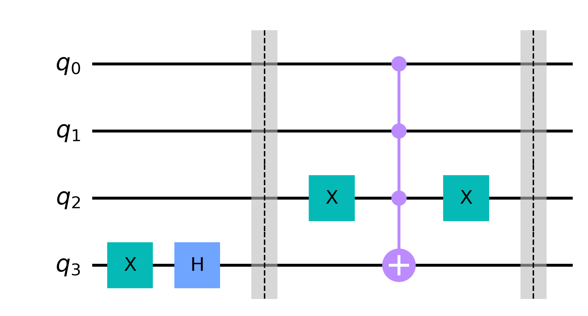
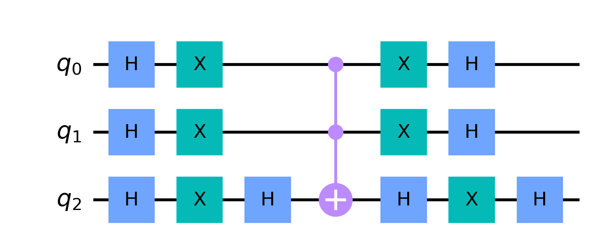
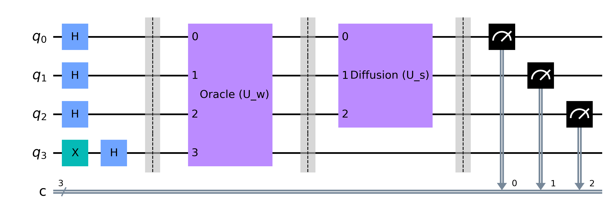
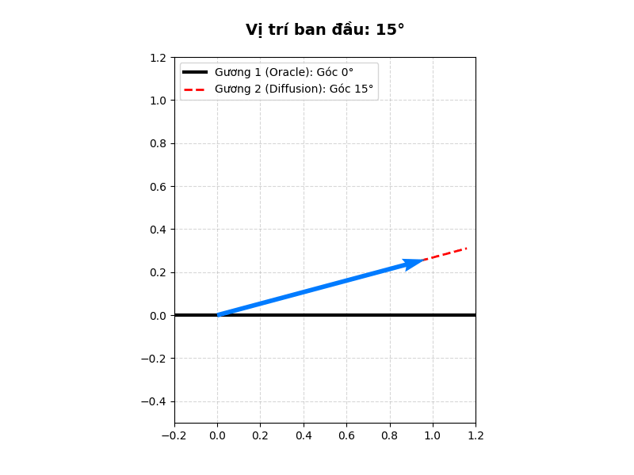
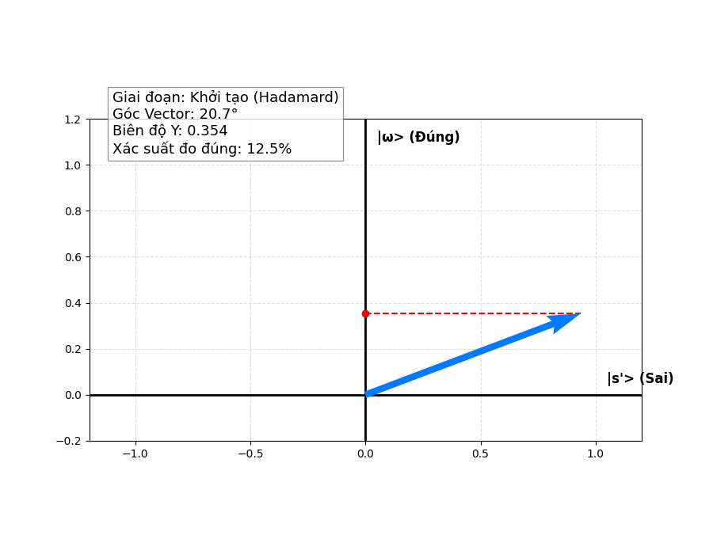

**Mục lục:**

Nội dung của bài này bao gồm:

1. [Thuật toán](#1-thuật-toán)
2. [Phân tích thuật toán](#2-phân-tích-thuật-toán)
3. [Ứng dụng](#3-ứng-dụng)
4. [Tham khảo](#4-tham-khảo)

 

Để kết thúc Series về Điện toán lượng tử cơ bản, chúng ta sẽ cùng nghiên cứu một thuật toán lượng tử đơn giản nhưng cũng không kém phần hiệu quả đó là thuật toán Grover. Chúng ta cùng đi vào chi tiết thuật toán.

## 1. Thuật toán

### 1.1. Bài toán

Giả sử ta có một tập hợp gồm $N$ phần tử, được đánh số index từ $0$ đến $N-1$. (Trong điện toán lượng tử, ta thường có $N = 2^n$, tương ứng với không gian trạng thái của $n$ qubit).

Ta được cung cấp một hàm $f(x)$ hoạt động như một "hộp đen" (black-box). Hàm này có tính chất sau:

* $f(x) = 1$ nếu $x$ chính là phần tử mục tiêu (thường ký hiệu là $\omega$) mà bạn đang cần tìm.
* $f(x) = 0$ đối với mọi giá trị $x$ khác ($x \neq \omega$).

**Mục tiêu của bài toán:** Tìm ra giá trị $\omega$ bằng cách "gọi" (đánh giá) hàm $f(x)$ với số lần ít nhất có thể.

### Tại sao gọi là "Không có cấu trúc"?

"Không có cấu trúc" nghĩa là các phần tử trong tập hợp $N$ hoàn toàn không tuân theo một quy luật sắp xếp nào (không xếp theo bảng chữ cái, không xếp từ nhỏ đến lớn). Hàm $f(x)$ cũng không cung cấp bất kỳ gợi ý nào kiểu "ta đang ở gần mục tiêu rồi" hoặc "mục tiêu nằm ở nửa kia". Nó chỉ trả lời: **"Đúng" (1)** hoặc **"Sai" (0)**.

Ví dụ kinh điển nhất: Ta có số điện thoại của một người và cần tìm tên của họ trong một cuốn danh bạ điện thoại giấy (nơi dữ liệu được sắp xếp theo tên chứ không phải theo số).

### **Giới hạn của máy tính cổ điển**

Vì không có manh mối nào, mọi thuật toán chạy trên máy tính cổ điển đều buộc phải dùng phương pháp thử sai (brute-force). Ta gọi hàm $f(0)$, rồi $f(1)$, rồi $f(2)$... cho đến khi tìm được $\omega$. Trong trường hợp xấu nhất, ta phải thử $N$ lần. Trung bình, ta cần thử $N/2$ lần. Độ phức tạp thời gian là $O(N)$. 

### 1.2. Thuật toán

Để đi sâu vào chi tiết toán học của thuật toán Grover, chúng ta sẽ sử dụng ngôn ngữ của đại số tuyến tính và biểu diễn trạng thái trong không gian Hilbert.

Thay vì chỉ nhìn từng biên độ, cách thanh lịch và mạnh mẽ nhất để hiểu thuật toán Grover là **mô hình hóa nó như một chuỗi các phép quay hình học (geometric rotations) trong một không gian 2 chiều**.

Giả sử chúng ta có một hệ $n$ qubit, tạo ra một không gian trạng thái gồm $N = 2^n$ phần tử. Ta cần tìm một trạng thái mục tiêu duy nhất là $|\omega\rangle$.

Dưới đây là chi tiết toán học qua từng bước.

#### Bước 1: Khởi tạo (Initialization)

Ta bắt đầu với trạng thái $|0\rangle^{\otimes n}$. Bằng cách áp dụng cổng Hadamard $H^{\otimes n}$, ta tạo ra trạng thái chồng chập đều $|s\rangle$:

$$
|s\rangle = \frac{1}{\sqrt{N}} \sum_{x=0}^{N-1} |x\rangle \tag{1.1}
$$

Lúc này, mọi trạng thái (bao gồm cả trạng thái đúng $|\omega\rangle$) đều có cùng một biên độ xác suất là $\frac{1}{\sqrt{N}}$.

#### Bước 2: Định hình Không gian 2 Chiều (The 2D Subspace)

Đây là bước đột phá trong toán học của thuật toán này. Mặc dù không gian tổng thể có $N$ chiều, toán tử Grover thực chất chỉ hoạt động trong một mặt phẳng 2 chiều được tạo bởi hai vector trực chuẩn (orthonormal vectors):

1. $|\omega\rangle$: Trạng thái mục tiêu mà ta muốn tìm.
2. $|s'\rangle$: Trạng thái chồng chập đều của TẤT CẢ các trạng thái sai (tức là $x \neq \omega$).

$$
|s'\rangle = \frac{1}{\sqrt{N-1}} \sum_{x \neq \omega} |x\rangle \tag{1.2}
$$

Chúng ta có thể dễ dàng chứng minh tính trực chuẩn của 2 vector này thông qua định nghĩa về tích vô hướng và tính trực giao của các vector cơ sở, cụ thể:
Trong điện toán lượng tử, tất cả các trạng thái cơ sở (ví dụ $|00\rangle, |01\rangle, |10\rangle, |11\rangle$) đều trực giao với nhau. Nghĩa là tích vô hướng của hai trạng thái cơ sở khác nhau luôn bằng 0: $\langle x | y \rangle = 0$ nếu $x \neq y$.

Bây giờ, hãy tính tích vô hướng của $|\omega\rangle$ và $|s'\rangle$.

$$
\langle \omega | s' \rangle = \langle \omega | \left( \frac{1}{\sqrt{N-1}} \sum_{x \neq \omega} |x\rangle \right) \tag{1.3}
$$

Kéo hằng số ra ngoài và phân phối $\langle\omega|$ vào bên trong dấu tổng:

$$
\langle \omega | s' \rangle = \frac{1}{\sqrt{N-1}} \sum_{x \neq \omega} \langle \omega | x \rangle \tag{1.4}
$$

Hãy nhìn vào cụm $\langle \omega | x \rangle$ ở trong tổng. Vì điều kiện của tổng là $x \neq \omega$ (các trạng thái này không bao giờ chứa đáp án đúng), nên với mọi phần tử trong tổng đó, tích vô hướng $\langle \omega | x \rangle$ luôn luôn bằng $0$.

$$
\langle \omega | s' \rangle = \frac{1}{\sqrt{N-1}} \sum (0) = 0 \tag{1.5}
$$

Vì tích vô hướng của chúng bằng 0, về mặt hình học, **hai vector $|\omega\rangle$ và $|s'\rangle$ vuông góc hoàn toàn với nhau.**

Để dễ tưởng tượng hơn, hãy lùi về không gian 3 chiều (Oxyz) với 3 trạng thái cơ sở là trục X, Y và Z.

* Giả sử đáp án đúng $|\omega\rangle$ nằm trên **trục Z**.
* Các đáp án sai là trục X và trục Y.
* Trạng thái $|s'\rangle$ là sự chồng chập đều của tất cả các đáp án sai. Do đó, $|s'\rangle$ là sự kết hợp của X và Y. Về mặt hình học, $|s'\rangle$ là một vector nằm chéo góc $45^\circ$ hoàn toàn trên **mặt phẳng (Oxy)**.

 

Và như ta đã biết trong hình học không gian: **Bất kỳ vector nào nằm trên mặt phẳng (Oxy) cũng đều vuông góc với trục Z.**

Vậy ta có thể biểu diễn trạng thái ban đầu $|s\rangle$ dưới dạng tổ hợp tuyến tính của $|\omega\rangle$ và $|s'\rangle$:

$$
|s\rangle = \sqrt{\frac{1}{N}}|\omega\rangle + \sqrt{\frac{N-1}{N}}|s'\rangle \tag{1.6}
$$

Nếu ta đặt $\sin(\theta) = \frac{1}{\sqrt{N}}$, ta có thể viết lại dưới dạng lượng giác:

$$
|s\rangle = \sin(\theta)|\omega\rangle + \cos(\theta)|s'\rangle \tag{1.7}
$$

Lúc này, $|s\rangle$ là một vector nằm cách trục $|s'\rangle$ một góc $\theta$ rất nhỏ (vì $N$ rất lớn). Mục tiêu của thuật toán là quay vector trạng thái này sao cho nó nằm trùng với trục $|\omega\rangle$.

#### Bước 3: Toán học của Oracle ($U_\omega$)

Oracle hoạt động bằng cách đảo dấu biên độ của trạng thái $|\omega\rangle$. Về mặt đại số, ma trận của Oracle là:

$$
U_\omega = I - 2|\omega\rangle\langle\omega| \tag{1.8}
$$

1. Tác động lên $|\omega\rangle$: $U_\omega|\omega\rangle = (I - 2|\omega\rangle\langle\omega|)|\omega\rangle = |\omega\rangle - 2|\omega\rangle = -|\omega\rangle$.
2. Tác động lên $|s'\rangle$: Vì $|s'\rangle$ vuông góc với $|\omega\rangle$ nên $\langle\omega|s'\rangle = 0$. Suy ra $U_\omega|s'\rangle = |s'\rangle$.

 

**Ý nghĩa hình học:** Oracle $U_\omega$ là **phép đối xứng (reflection) qua trục $|s'\rangle$**. Nó giữ nguyên thành phần $|s'\rangle$ và lật ngược thành phần $|\omega\rangle$.

#### Bước 4: Toán học của Khuếch đại ($U_s$)

Toán tử Khuếch đại (Diffusion) có biểu thức đại số là:

$$
U_s = 2|s\rangle\langle s| - I \tag{1.9}
$$

1. Tác động lên $|s\rangle$: $U_s|s\rangle = 2|s\rangle\langle s|s\rangle - |s\rangle = 2|s\rangle - |s\rangle = |s\rangle$.
2. Tác động lên một vector $|s^\perp\rangle$ vuông góc với $|s\rangle$: $U_s|s^\perp\rangle = -|s^\perp\rangle$.

 

**Ý nghĩa hình học:** Khuếch đại $U_s$ là **phép đối xứng (reflection) qua trục $|s\rangle$**.

#### Bước 5: Toán tử Grover ($G$) là một phép quay

Toán tử Grover cho một lần lặp là tích của hai toán tử trên:

$$
G = U_s U_\omega \tag{1.10}
$$

Trong hình học tuyến tính, **tích của hai phép đối xứng qua hai trục cắt nhau là một phép quay (rotation)**. Góc quay bằng 2 lần góc giữa hai trục.

Trục thứ nhất là $|s'\rangle$ (do $U_\omega$), trục thứ hai là $|s\rangle$ (do $U_s$). Góc giữa chúng chính là $\theta$.

Do đó, toán tử Grover $G$ thực chất là một **phép quay góc $2\theta$** hướng vector trạng thái về phía trục $|\omega\rangle$.

Sau $k$ lần lặp áp dụng $G$, trạng thái của hệ thống $|\psi_k\rangle$ sẽ là:

$$
|\psi_k\rangle = G^k |s\rangle = \sin((2k+1)\theta)|\omega\rangle + \cos((2k+1)\theta)|s'\rangle \tag{1.11}
$$

*(Lưu ý: Ban đầu là $\theta$, sau 1 lần lặp cộng thêm $2\theta$ thành $3\theta$, sau $k$ lần sẽ là $(2k+1)\theta$).*

#### Bước 6: Xác định số lần lặp tối ưu

Để đo được trạng thái $|\omega\rangle$ với xác suất gần 100%, ta cần hệ số của $|\omega\rangle$ tiến gần đến 1, nghĩa là:

$$
\sin((2k+1)\theta) \approx 1 \implies (2k+1)\theta \approx \frac{\pi}{2} \tag{1.12}
$$

Giải phương trình này để tìm $k$:

$$
2k+1 \approx \frac{\pi}{2\theta} \tag{1.13}
$$

Vì $N$ rất lớn, $\theta = \arcsin(\frac{1}{\sqrt{N}}) \approx \frac{1}{\sqrt{N}}$.

Thay vào, ta có:

$$
2k \approx \frac{\pi\sqrt{N}}{2} \implies k \approx \frac{\pi}{4}\sqrt{N} \tag{1.14}
$$

Đó chính là nguồn gốc toán học chặt chẽ của việc tại sao thuật toán Grover lại đạt được sự tăng tốc bậc hai $O(\sqrt{N})$. Nếu ta lặp quá số lần này (ví dụ tiếp tục áp dụng $G$), vector trạng thái sẽ "quay quá đà" vượt qua trục $|\omega\rangle$ và tiến về phía trục âm, làm giảm xác suất đo được kết quả đúng.
## 2. Phân tích thuật toán

Như thường lệ chúng ta lại bắt đầu với bước phân tích thuật toán.

### 2.1. Toán tử Oracle và Toán tử khuếch đại

Ở bài 2 chúng ta đã biết rằng Mọi mạch lượng tử, cho dù phức tạp đến đâu, về mặt toán học chỉ là một chuỗi các phép nhân ma trận (cho các cổng nối tiếp) và tích tensor (cho các cổng song song) (xem thêm tại [Định lý không sao chép](https://luongle1911.github.io/QuantumBlog/dien-toan-luong-tu/bai-2-quantum-gate/#4-%C4%91%E1%BB%8Bnh-l%C3%BD-kh%C3%B4ng-sao-ch%C3%A9p)). Chúng ta **không có "cổng trừ"** để thực hiện trực tiếp phép toán $A - B$, vậy tại sao công thức của mạch Oracle $(1.8)$ và mạch Khuếch đại $(1.9)$ lại xuất hiện dấu trừ.

#### 2.1.1. Toán tử khuếch đại

Vậy làm thế nào chuỗi nhân ma trận lại sinh ra biểu thức $2|s\rangle\langle s| - I$?

Với toán tử khuếch đại bí quyết nằm ở hai yếu tố: **Biến đổi cơ sở (Basis Transformation)** và **Thủ thuật tạo dấu trừ từ cổng Z (Phase Flip)**. Dưới đây là cách các nhà khoa học máy tính biến phép trừ đó thành một chuỗi nhân ma trận.

#### Bước 1: Phân tích ngược biểu thức toán học

Đầu tiên, ta biết rằng trạng thái chồng chập đều $|s\rangle$ được tạo ra bằng cách áp dụng cổng Hadamard lên tất cả các qubit đang ở trạng thái $|0\rangle$. Tức là:

$$
|s\rangle = H^{\otimes n}|0\rangle \tag{2.1}
$$

Thay nó vào biểu thức của toán tử Diffusion $U_s$, ta có:

$$
U_s = 2|s\rangle\langle s| - I \tag{2.2}
$$

$$
U_s = 2(H^{\otimes n}|0\rangle)(\langle 0|H^{\otimes n}) - I \tag{2.3}
$$

Vì $H$ là ma trận Hermitian ($H = H^\dagger$) và Unitary ($H^2 = I$), ta có thể viết lại ma trận đơn vị $I = H^{\otimes n} \cdot I \cdot H^{\otimes n}$. Rút nhân tử chung $H^{\otimes n}$ ra ngoài, ta được:

$$
U_s = H^{\otimes n} (2|0\rangle\langle 0| - I) H^{\otimes n} \tag{2.4}
$$

Như vậy, bài toán thiết kế mạch $U_s$ được quy về bài toán đơn giản hơn: **Làm sao thiết kế mạch cho ma trận $2|0\rangle\langle 0| - I$ ?**

#### Bước 2: Bản chất của ma trận $2|0\rangle\langle 0| - I$

Hãy nhìn vào tác động của toán tử $2|0\rangle\langle 0| - I$ lên một trạng thái cơ sở $|x\rangle$ bất kỳ:

* Nếu $|x\rangle = |00...0\rangle$: Toán tử sẽ trả về $2|0\rangle\langle 0|0\rangle - |0\rangle = 2(1)|0\rangle - |0\rangle = |0\rangle$. (Không đổi dấu).
* Nếu $|x\rangle \neq |00...0\rangle$ (ví dụ $|01\rangle, |10\rangle,...$): Tích vô hướng $\langle 0|x\rangle = 0$. Toán tử trả về $0 - |x\rangle = -|x\rangle$. (Bị đảo dấu).

Nói cách khác, ma trận của $2|0\rangle\langle 0| - I$ là một ma trận đường chéo, trong đó phần tử đầu tiên (tương ứng với $|00...0\rangle$) là $1$, và TẤT CẢ các phần tử còn lại trên đường chéo là $-1$.

#### Bước 3: Dùng phép nhân ma trận để tạo ra dấu trừ

Trong tính toán lượng tử, nơi duy nhất sinh ra dấu trừ là **pha (phase)**, cụ thể là từ cổng Pauli-Z. Cổng Z tác động lên $|1\rangle$ sẽ sinh ra dấu trừ: $Z|1\rangle = -|1\rangle$.

Để tạo ra ma trận có các dấu trừ trên đường chéo như yêu cầu ở Bước 2, người ta dùng một thủ thuật gồm 3 cổng nhân liên tiếp nhau:

1. **Cổng $X^{\otimes n}$:** Áp dụng cổng X (NOT) lên tất cả các qubit. Trạng thái $|00...0\rangle$ sẽ biến thành $|11...1\rangle$.
2. **Cổng Multi-Controlled Z (MCZ):** Cổng này chỉ kích hoạt cổng Z trên qubit cuối cùng NẾU tất cả các qubit trước đó đều là $|1\rangle$. Tức là nó chỉ đảo dấu trạng thái $|11...1\rangle$ thành $-|11...1\rangle$.
3. **Cổng $X^{\otimes n}$:** Áp dụng cổng X một lần nữa để trả các qubit về trạng thái ban đầu.

**Điều gì vừa xảy ra?**

Trạng thái ban đầu là $|00...0\rangle$ bị biến thành $|11...1\rangle$, bị cổng MCZ gán dấu trừ thành $-|11...1\rangle$, rồi bị cổng X đưa về lại $-|00...0\rangle$. Mọi trạng thái khác đi qua chuỗi này sẽ KHÔNG bị cổng MCZ gán dấu trừ.

Chuỗi mạch này ($X^{\otimes n} \cdot MCZ \cdot X^{\otimes n}$) tạo ra một ma trận đường chéo có phần tử đầu tiên là $-1$, và các phần tử còn lại là $1$. Nó chính là ma trận:

$$
I - 2|0\rangle\langle 0| \tag{2.5}
$$

#### Bước 4: Chấp nhận "Pha toàn cục" (Global Phase)

Bạn đọc có thể sẽ nhận ra một sự ngược ngạo nhẹ:

* Cái ta cần (Toán học): $2|0\rangle\langle 0| - I$ (Dấu $1$ cho $|0\rangle$, dấu $-1$ cho phần còn lại).
* Cái mạch tạo ra (Vật lý): $I - 2|0\rangle\langle 0|$ (Dấu $-1$ cho $|0\rangle$, dấu $1$ cho phần còn lại).

Hai ma trận này trái dấu nhau hoàn toàn: $(2|0\rangle\langle 0| - I) = -(I - 2|0\rangle\langle 0|)$.

Nhưng đây là phép màu của Cơ học lượng tử: Một dấu trừ tổng thể (pha toàn cục $e^{i\pi} = -1$) nhân vào toàn bộ hệ thống sẽ **không gây ra bất kỳ sự thay đổi nào về xác suất đo lường**. Trạng thái $|\psi\rangle$ và $-|\psi\rangle$ là hoàn toàn tương đương nhau về mặt vật lý.

#### Tổng kết Mạch hoàn chỉnh

Để tạo ra biểu thức có dấu trừ $2|s\rangle\langle s| - I$, ta chỉ cần thực hiện chuỗi nhân ma trận (cổng lượng tử) cực kỳ tiêu chuẩn sau:

$$
G = H^{\otimes n} \cdot X^{\otimes n} \cdot MCZ \cdot X^{\otimes n} \cdot H^{\otimes n} \tag{2.6}
$$

Tóm lại, trong lượng tử, ta không bao giờ "trừ" hai ma trận cho nhau bằng mạch vật lý. Ta dùng phép nhân với cổng Z (để nhét dấu trừ vào các pha) và cổng X/H (để nhào nặn vị trí của các dấu trừ đó), sao cho kết quả cuối cùng của chuỗi nhân đó tạo ra một ma trận đồng nhất với biểu thức $A - B$.

#### 2.1.2. Toán tử Oracle

Và cũng giống như toán tử Khuếch đại, chúng ta không có "cổng trừ" trong mạch lượng tử vật lý. Dấu trừ trong Oracle hoàn toàn được sinh ra từ các cổng Z (hoặc thủ thuật liên quan đến pha).

Tuy nhiên, cách thiết kế mạch cho Oracle thú vị và đa dạng hơn nhiều, vì nó phụ thuộc vào việc ta **biết trước** trạng thái mục tiêu $\omega$, hay ta chỉ có một **hàm kiểm tra logic** (như mã PIN, mật khẩu, phương trình logic).

Dưới đây là 2 cách thiết kế mạch Oracle phổ biến nhất.

#### Cách 1: Thiết kế trực tiếp khi biết trước mục tiêu $\omega$ (Direct Phase Oracle)

Cách này dùng kỹ thuật **"Sandwich cổng X"** hoàn toàn tương tự như cách ta làm với toán tử Khuếch đại, nhưng thay vì nhắm vào trạng thái $|00...0\rangle$, ta nhắm vào một chuỗi nhị phân cụ thể $\omega$.

Giả sử hệ có 3 qubit và bạn muốn tìm trạng thái $|\omega\rangle = |101\rangle$.

Ma trận của Oracle cần lật dấu của $|101\rangle$ thành $-|101\rangle$, và giữ nguyên mọi trạng thái khác. Ta biết rằng cổng Multi-Controlled Z (MCZ) chỉ lật dấu trạng thái $|111\rangle$. Vậy ta làm thế nào?

1. **Cổng X (Đóng gói):** Áp dụng cổng X vào các qubit có giá trị $0$ trong chuỗi mục tiêu. Với $\omega = 101$, ta áp dụng cổng X vào qubit ở giữa (qubit số 2).
   * Trạng thái mục tiêu $|101\rangle$ sẽ biến thành $|111\rangle$.
   * Các trạng thái khác (ví dụ $|000\rangle$) sẽ biến thành trạng thái khác (thành $|010\rangle$).

 

2. **Cổng MCZ (Đánh dấu):** Áp dụng cổng Z đa điều khiển (kích hoạt Z khi tất cả qubit là 1).
   * Chỉ có trạng thái $|111\rangle$ (vốn là $|101\rangle$ cải trang) bị lật pha thành $-|111\rangle$.
   * Các trạng thái khác (như $|010\rangle$) đi qua an toàn, không bị lật pha.

 

3. **Cổng X (Mở gói):** Áp dụng lại cổng X vào qubit ở giữa để trả các bit về vị trí cũ (uncomputation).
   * Trạng thái $-|111\rangle$ trở về lại thành $-|101\rangle$.
   * Trạng thái $|010\rangle$ trở về lại $|000\rangle$.

 

**Mạch tổng quát:** $Oracle = X_{mask} \cdot MCZ \cdot X_{mask}$ (trong đó $X_{mask}$ là tập hợp các cổng X đặt tại các vị trí bit 0 của $\omega$). Chuỗi này tạo ra chính xác ma trận $I - 2|\omega\rangle\langle\omega|$.

#### Cách 2: Thiết kế bằng Phản hồi Pha (Phase Kickback) - Dành cho bài toán thực tế

Cách 1 ở trên rất dễ hiểu, nhưng có một nghịch lý: **Nếu ta đã biết trước $\omega = 101$ để đặt cổng X, thì ta cần thuật toán tìm kiếm để làm gì nữa?**

Trong thực tế (như bẻ khóa mật mã, giải Sudoku), bạn không biết $\omega$. Ta chỉ có một mạch logic kiểm tra cổ điển: *Đưa đầu vào x, nếu đúng trả về 1, nếu sai trả về 0.* Để chuyển mạch logic này thành Oracle lượng tử có dấu trừ, người ta kỹ thuật **Phase Kickback** mà chúng ta đã học ở các bài trước.

Thay vì lật pha trực tiếp, ta dùng một **qubit phụ trợ (Ancilla qubit)**.

### **Bước 1: Xây dựng mạch Bit-flip (Boolean Oracle)**

Đầu tiên, ta dùng các cổng Toffoli, CNOT (tương đương với các cổng AND, XOR cổ điển) để tổng hợp thành một hàm $f(x)$. Toán tử này $U_f$ hoạt động như sau:

$$
U_f |x\rangle|y\rangle = |x\rangle|y \oplus f(x)\rangle \tag{2.7}
$$

Trong đó $|x\rangle$ là thanh ghi chứa dữ liệu, $|y\rangle$ là qubit phụ trợ, $\oplus$ là phép cộng modulo 2 (XOR). 

Hàm $f(x)$ trong điện toán lượng tử (và cả khoa học máy tính cổ điển) được gọi là **hàm kiểm tra (checking function)** hay **hàm chỉ thị (indicator function)**.

Ta có thể tưởng tượng $f(x)$ giống như một câu lệnh if trong lập trình, hoặc một giám khảo cầm bảng "Đúng/Sai". Nó lấy đầu vào là một trạng thái $x$ bất kỳ và trả về một kết quả duy nhất:

* **Trả về 1:** Nếu $x$ đúng là thứ ta đang tìm.
* **Trả về 0:** Nếu $x$ không phải là thứ ta đang tìm.

### **Bước 2: Thủ thuật Kickback**

Bí quyết nằm ở việc ta thiết lập trạng thái ban đầu của qubit phụ trợ $|y\rangle$ không phải là $|0\rangle$, mà là trạng thái $|-\rangle = \frac{|0\rangle - |1\rangle}{\sqrt{2}}$ (tạo ra bằng cách cho $|1\rangle$ đi qua cổng Hadamard).

Bây giờ hãy xem $U_f$ tác động lên hệ thống $|x\rangle|-\rangle$:

$$
U_f |x\rangle \left( \frac{|0\rangle - |1\rangle}{\sqrt{2}} \right) = |x\rangle \left( \frac{|0 \oplus f(x)\rangle - |1 \oplus f(x)\rangle}{\sqrt{2}} \right) \tag{2.8}
$$

* **Nếu $x$ không phải là đáp án ($f(x) = 0$):**
  Phép XOR với 0 không làm thay đổi gì. Cụm phụ trợ giữ nguyên là $\frac{|0\rangle - |1\rangle}{\sqrt{2}} = |-\rangle$.

  Kết quả: Hệ thống giữ nguyên $|x\rangle|-\rangle$.

* **Nếu $x$ là đáp án đúng ($f(x) = 1$):**
  Phép XOR với 1 lật $|0\rangle$ thành $|1\rangle$ và $|1\rangle$ thành $|0\rangle$. Cụm phụ trợ biến thành $\frac{|1\rangle - |0\rangle}{\sqrt{2}}$.
  Hãy chú ý, $\frac{|1\rangle - |0\rangle}{\sqrt{2}} = - \left(\frac{|0\rangle - |1\rangle}{\sqrt{2}}\right) = -|-\rangle$.

  Kết quả: Hệ thống trở thành $-|x\rangle|-\rangle$.

### **Tổng kết lại:**

$$
U_f |x\rangle|-\rangle = (-1)^{f(x)} |x\rangle|-\rangle \tag{2.9}
$$

Vì qubit phụ trợ luôn giữ nguyên trạng thái $|-\rangle$, ta có thể "tách" nó ra khỏi phương trình. Thanh ghi chính $|x\rangle$ đã tự động nhận một dấu trừ **chỉ khi** $x$ là đáp án đúng.

Bằng cách dùng Phase Kickback, bạn không cần biết trước đáp án. Bạn chỉ cần xây dựng mạch kiểm tra điều kiện (Boolean function) bằng các cổng logic thông thường, gán thêm một qubit phụ ở trạng thái $|-\rangle$, và toàn bộ mạch đó sẽ hoạt động chính xác như ma trận $I - 2|\omega\rangle\langle\omega|$.

Hãy cùng thử xây dựng lại một hàm Oracle cho một danh bạ đơn giản với 8 người ($n = 3$) và đương nhiên danh bạ này không được sắp xếp theo bất kỳ thứ tự nào để phù hợp với điều kiện dữ liệu không có cấu trúc, người đầu tiên ta kiểm tra có thể là bất kỳ ai trong đoạn từ $|000\rangle \rightarrow |111\rangle$..
**Ví dụ:**

Để thiết kế một mạch kiểm tra điều kiện (Boolean Oracle) cho một danh bạ gồm 8 người, chúng ta sẽ cần **3 qubit dữ liệu** (để mã hóa 8 người, từ index 000 đến 111) và **1 qubit phụ trợ (Ancilla)** để ghi nhận kết quả và tạo hiệu ứng Phase Kickback.

Và giả sử mỗi lần tôi muốn kiếm một người thì sao? Trong kỹ thuật lượng tử, chúng giải quyết việc này bằng cách tạo ra một **khuôn mẫu mạch chung** (template). Tùy thuộc vào người ta muốn tìm, ta chỉ cần thay đổi vị trí của các cổng X (NOT) ở đầu vào.

Dưới đây là cách chúng ta xây dựng mạch đó từng bước một.

### Bước 1: Chuẩn bị hệ thống

* **Thanh ghi dữ liệu (Data Register):** 3 qubit $|q_2\rangle, |q_1\rangle, |q_0\rangle$. (Giả sử chúng đã được đưa vào trạng thái chồng chập đều bởi cổng Hadamard ở Bước 1 của Grover).
* **Thanh ghi phụ trợ (Ancilla Register):** 1 qubit $|ancilla\rangle$. Ta áp dụng cổng X rồi đến cổng H để đưa nó vào trạng thái $|-\rangle = \frac{|0\rangle - |1\rangle}{\sqrt{2}}$.

### Bước 2: Thiết kế Mạch Logic kiểm tra (The Logic Lock)

Giả sử danh bạ của ta có 8 người đánh số từ 0 đến 7. Mạch logic của chúng ta cần hoạt động như một "ổ khóa đa nấc" (Multi-Controlled X gate, hay cổng CCCNOT). Cổng này giống như một cổng AND khổng lồ: nó chỉ lật bit của Qubit Ancilla khi **TẤT CẢ** các qubit dữ liệu điều khiển nó đều có giá trị là 1.

Nhưng nếu người bạn muốn tìm không phải là 111 (số 7) thì sao? Đó là lúc ta dùng **Cổng X (NOT)** để "đánh lừa" ổ khóa.

**Ví dụ ta muốn tìm người số 3 (Mã nhị phân là 011)**

Khi đó hàm $f(x)$ của chúng ta được định nghĩa như sau:

* $f(011) = 1$
* $f(000) = f(001) = f(010) = f(100) = f(101) = f(110) = f(111) = 0$

Người số 3 tương ứng với trạng thái $|q_2 q_1 q_0\rangle = |011\rangle$. Để cổng CCCNOT nhận diện được trạng thái này, ta phải làm cho $q_2$ (đang là 0) tạm thời biến thành 1.

Mạch Oracle sẽ gồm 3 giai đoạn:

1. **Giai đoạn "Mặt nạ" (Masking):** Áp dụng cổng X vào các qubit tương ứng với bit 0 trong mã nhị phân của mục tiêu.
   * Với mục tiêu 011, ta áp dụng cổng X vào $q_2$.
   * Lúc này, nếu đầu vào thực sự là $|011\rangle$, qua lớp mặt nạ này, nó sẽ biến thành $|111\rangle$.

 

2. **Giai đoạn "Kiểm tra" (The AND condition):** Đặt một cổng CCCNOT với 3 qubit điều khiển là $q_2, q_1, q_0$ và mục tiêu là qubit Ancilla.
   * Vì đầu vào đã bị biến thành $|111\rangle$, cổng CCCNOT sẽ kích hoạt, lật qubit Ancilla.
   * Nhờ Ancilla đang ở trạng thái $|-\rangle$, hiệu ứng Phase Kickback xảy ra, ném một **dấu trừ** ngược lại vào toàn bộ hệ thống.

 

3. **Giai đoạn "Gỡ mặt nạ" (Uncomputation):** Áp dụng lại cổng X y hệt như Giai đoạn 1 (tức là vào $q_2$) để trả hệ thống về trạng thái ban đầu.
   * Hệ thống trở về $|011\rangle$, nhưng lúc này nó đã mang theo một dấu trừ: $-|011\rangle$.
   * Các trạng thái sai khác (ví dụ $|000\rangle$) khi qua lớp mặt nạ sẽ không tạo ra đủ chuỗi 111, nên không kích hoạt cổng CCCNOT, không có dấu trừ nào được tạo ra, và được gỡ mặt nạ về lại y nguyên.

### Bước 3: Bảng "Lập trình" Oracle cho từng người

"Mỗi lần muốn kiếm một người khác", ta chỉ cần thay đổi vị trí đặt cổng X ở Giai đoạn 1 và 3 theo quy tắc: **Chỗ nào có số 0 trong mã nhị phân, chỗ đó đặt cổng X.**

Đây là bảng thiết kế Oracle cho toàn bộ danh bạ 8 người của chúng ta:

| Người cần tìm | Index (Hệ 10) | Nhị phân (q2​q1​q0​) | Vị trí đặt cổng X (trước và sau CCCNOT) |
| :---: | :---: | :---: | :---: |
| Người A | 0 | 000 | Áp dụng X cho cả 3 qubit: $q_2, q_1, q_0$ |
| Người B | 1 | 001 | Áp dụng X cho $q_2, q_1$ |
| Người C | 2 | 010 | Áp dụng X cho $q_2, q_0$ |
| Người D | 3 | 011 | Áp dụng X cho $q_2$ |
| Người E | 4 | 100 | Áp dụng X cho $q_1, q_0$ |
| Người F | 5 | 101 | Áp dụng X cho $q_1$ |
| Người G | 6 | 110 | Áp dụng X cho $q_0$ |
| Người H | 7 | 111 | KHÔNG áp dụng X (chỉ dùng CCCNOT) |

### Tổng kết

Bằng cách sử dụng thủ thuật **"Mặt nạ X $\rightarrow$ Cổng AND $\rightarrow$ Gỡ Mặt nạ X"** kết hợp với một qubit Ancilla trạng thái $|-\rangle$, bạn đã tạo ra một hàm Boolean tiêu chuẩn.

Mạch điện này hoàn toàn có thể lập trình được. Trên thực tế, khi ta lập trình các thuật toán lượng tử, trình biên dịch (compiler) sẽ tự động sinh ra các lớp mặt nạ X này dựa trên phương trình logic cổ điển (như `if person_id == 3`) mà bạn nhập vào.

Mạch Oracle đối với trường hợp ta cần tìm người thứ 3 (011) có thể được biểu diễn:

  
*(Hình 2.1. Mô phỏng mạch Oracle với trường hợp $n=3$)*

Mạch khuếch đại của ví dụ này có dạng:

  
*(Hình 2.2. Mô phỏng mạch khuếch đại)*

Và nếu ta đóng gói các mạch trên thành các gói dán nhãn $U_\omega$ và $U_s$ thì toàn bộ mạch cho thuật toán Grover đối với ví dụ trên sẽ trông như sau:

  
*(Hình 2.3. Mô phỏng thuật toán Grover)*

Tôi đã làm thêm một mô phỏng trên Codesanbox để mô tả lại xác suất đo được đáp án đúng khi ta chạy vòng lặp Grover.

<iframe 
  src="https://lnw225.csb.app" 
  style="width: 100%; height: 550px; border: none; border-radius: 8px; box-shadow: 0 4px 12px rgba(0,0,0,0.1);" 
  title="Grover Algorithm Simulation"
  sandbox="allow-scripts allow-same-origin"
></iframe>

Ở mô phỏng trên ta thấy rằng chỉ sau 2 lần lặp xác suất ta đo được trạng thái đúng đã tăng lên gần 100%, trong khi đó với bất kỳ thuật toán cổ điển nào thì trung bình ta cũng cần 4 lần đo để được đáp án đúng. Khi số lượng phân tử trong danh sách lớn hơn thì sự khác biệt còn được thể hiện rõ hơn nữa.
### 2.2. Toán tử Grover là một phép quay

Ở bước 5 của thuật toán chúng ta có đề cập đến việc toán tử Grover thực chất là một phép quay nên ở phần này tôi sẽ trình bày chi tiết hơn về nó.

#### 1. Thiết lập sân khấu: Mặt phẳng 2 chiều

Hãy tưởng tượng một mặt phẳng tọa độ gồm 2 trục vuông góc với nhau (trực chuẩn):

* **Trục hoành (Trục nằm ngang):** Đại diện cho $|s'\rangle$ – Đây là trạng thái tập hợp tất cả các đáp án **SAI**. Bạn có thể coi nó là gốc tọa độ góc (góc 0). 
* **Trục tung (Trục thẳng đứng):** Đại diện cho $|\omega\rangle$ – Đây là mục tiêu **ĐÚNG** duy nhất mà ta đang tìm. Nằm ở góc vuông.

**Vị trí ban đầu của hệ thống:**

Sau khi áp dụng cổng Hadamard ở bước đầu tiên, hệ thống lượng tử rơi vào trạng thái chồng chập đều $|s\rangle$.

Trên mặt phẳng này, vector $|s\rangle$ không nằm đè lên trục nào cả. Vì phần lớn các trạng thái là sai, nó nằm rất sát trục hoành $|s'\rangle$, cách trục này một góc rất nhỏ là $\theta$.

Vậy ta có:

* Trục thứ nhất (Trục Oracle): Nằm ở góc 0. 
* Trục thứ hai (Trục Diffusion): Chính là vector $|s\rangle$, nằm ở góc $\theta$.

#### 2. Nguyên lý hình học: 2 phép đối xứng = 1 phép quay

Đây là một định lý kinh điển trong hình học phẳng: **Nếu ta lấy một vật, lật nó qua tấm gương thứ nhất, rồi tiếp tục lật qua tấm gương thứ hai, kết quả cuối cùng hoàn toàn tương đương với việc ta cầm vật đó và quay nó một góc bằng đúng 2 lần góc tạo bởi hai tấm gương.**

Hãy chứng minh bằng phép tính góc đơn giản:

Giả sử vector trạng thái của ta đang nằm ở một góc $\alpha$ bất kỳ.

1. **Gương 1 (Nằm ở góc 0):** Khi lật vector $\alpha$ qua góc 0, nó sẽ rơi xuống vị trí đối xứng là $-\alpha$. 
2. **Gương 2 (Nằm ở góc $\theta$):** Theo quy tắc đối xứng, lật một vector từ vị trí $x$ qua một trục nằm ở vị trí $y$, vị trí mới sẽ là $y + (y - x) = 2y - x$. 
   Áp dụng vào đây: Lật vector đang ở $-\alpha$ qua trục $\theta$, vị trí mới sẽ là $2\theta - (-\alpha) = \alpha + 2\theta$.

**Kết luận:** Vector đi từ vị trí $\alpha$ lên vị trí $\alpha + 2\theta$. Nghĩa là nó vừa được **quay thêm một góc $2\theta$**.

  
*(Hình 3.1. Mô tả phép quay trong thuật toán Grover)*

#### 3. Diễn biến thực tế của 1 vòng lặp Grover

Bây giờ, hãy áp dụng nguyên lý trên vào đúng thuật toán Grover. Nhắc lại, vị trí ban đầu của hệ thống đang ở góc $\theta$.

#### **Bước 1: Đi qua Oracle ($U_\omega$)**

* Oracle là phép đối xứng qua trục $|s'\rangle$ (góc 0). 
* Vector hệ thống đang ở $\theta$, bị lật ngược xuống dưới mặt phẳng, rơi vào góc $-\theta$. 
* *Ý nghĩa vật lý:* Oracle lật ngược pha (gắn dấu trừ) vào các trạng thái đúng.

#### **Bước 2: Đi qua Khuếch đại ($U_s$)**

* Khuếch đại là phép đối xứng qua trục $|s\rangle$ (nằm ở góc $\theta$). 
* Vector hệ thống lúc này đang nằm ở $-\theta$ (dưới mặt phẳng). Khoảng cách từ nó đến trục $\theta$ là $2\theta$. 
* Khi lật qua trục $\theta$, nó sẽ văng lên trên một khoảng tương đương $2\theta$, đáp xuống vị trí $\theta + 2\theta = 3\theta$. 
* *Ý nghĩa vật lý:* Phóng to biên độ của trạng thái đúng, hạ thấp biên độ trạng thái sai.

#### **Tổng kết 1 vòng lặp:**

Hệ thống bắt đầu từ $\theta$ và kết thúc ở $3\theta$. Vector trạng thái vừa thực hiện một bước nhảy (quay) một góc chính xác là $2\theta$ hướng dần về phía trục thẳng đứng (trục $|\omega\rangle$).

#### 4. Bức tranh toàn cảnh

Thuật toán Grover không hề "tìm kiếm" dữ liệu theo cách cổ điển. Nó đang **tái định hướng hình học** của vector trạng thái trong không gian lượng tử.

Mỗi một lần ta gọi toán tử $G = U_s U_\omega$, vector trạng thái lại nhích lên một góc $2\theta$:

* Khởi tạo: Góc $\theta$ 
* Lặp 1 lần: Góc $3\theta$ 
* Lặp 2 lần: Góc $5\theta$ 
* Lặp $k$ lần: Góc $(2k + 1)\theta$

 

Mục tiêu của ta là quay vector này cho đến khi nó trùng khớp (hoặc nằm sát nhất có thể) với trục đứng thẳng $|\omega\rangle$ (tức là góc $90^\circ$, hay $\frac{\pi}{2}$ radian). Khi vector chỉ thẳng đứng, xác suất ta đo được đáp án đúng là 100%. Đó là lý do toán học dẫn đến công thức lặp tối ưu $k \approx \frac{\pi}{4}\sqrt{N}$ mà không cần dựa trên ma trận phức tạp.

Dưới đây là minh họa lại về việc toán tử Grover tác động như thế nào đến vector trạng thái của hệ trong ví dụ về danh bạ 8 người mà ta vừa làm ở trên:

  
*(Hình 3.2. Mô phỏng vector trạng thái trong thuật toán Grover)*

## 3. Ứng dụng

Mặc dù được thiết kế như một thuật toán tìm kiếm nhưng ứng dụng nội bật nhất của Thuật toán Grover lại là trong lĩnh vực bảo mật, cụ thể là trong việc bẻ khóa đối với các loại mã hóa đối xứng.

Chuẩn Mã hóa Nâng cao (AES - Advanced Encryption Standard) là một trong những thuật toán mã hóa phổ biến và an toàn nhất thế giới hiện nay, được Viện Tiêu chuẩn và Công nghệ Quốc gia Hoa Kỳ (NIST) công nhận vào năm 2001. Đây chính là công nghệ bảo vệ kết nối Wi-Fi (WPA2/WPA3), giao dịch ngân hàng trực tuyến, và dữ liệu trên ổ cứng của bạn. 

Mật mã đối xứng sử dụng chung một khóa bí mật (Secret Key) để vừa mã hóa vừa giải mã. 

Để tấn công AES bằng Grover, tin tặc lượng tử thường dùng mô hình **Known-Plaintext Attack (Tấn công khi biết bản rõ)**. Tin tặc đã bắt lén được một thông điệp gốc (Plaintext - ví dụ: "Hello") và đoạn mã hóa tương ứng của nó (Ciphertext - ví dụ: "X9#kP"). Mục tiêu là tìm ra Khóa bí mật $K$.

### **Cách thiết lập hệ thống lượng tử:**

* Giả sử hệ thống dùng chuẩn **AES-128**, nghĩa là khóa $K$ có độ dài 128 bit. 
* Không gian tìm kiếm của khóa là khổng lồ: $N = 2^{128}$. 
* Tin tặc thiết lập một thanh ghi lượng tử gồm 128 qubit, áp dụng cổng Hadamard để tạo ra trạng thái chồng chập của tất cả $2^{128}$ khóa khả dĩ.

### **Thiết kế Oracle ($U_\omega$) cho bẻ khóa:**

Oracle lúc này không phải là luật Sudoku, mà chính là **toàn bộ thuật toán mã hóa AES được viết lại dưới dạng mạch lượng tử**.

* **Thực thi đồng thời:** Oracle nhận vào bản rõ "Hello" và dùng trạng thái chồng chập của $2^{128}$ khóa để mã hóa nó. Nó thực sự đang thực hiện $2^{128}$ phép mã hóa AES song song cùng một lúc. 
* **Kiểm tra đối chiếu:** Mạch Oracle sẽ so sánh kết quả đầu ra với bản Ciphertext "X9#kP" mà tin tặc đã biết. 
* **Phase Kickback:** Duy nhất nhánh tính toán nào sử dụng đúng Khóa bí mật $K$ sinh ra kết quả khớp với "X9#kP" sẽ kích hoạt cổng logic lật trạng thái Ancilla $|-\rangle$, từ đó đảo dấu pha của Khóa $K$ đó.

### **Sự đe dọa thực tế và Cách phòng thủ:**

* **Toán học của cuộc tấn công:** Máy tính cổ điển phải dùng Brute-force thử từng khóa, mất tối đa $2^{128}$ lần thử (mất hàng tỷ năm). Với Grover, số lần lặp tối ưu là $k \approx \frac{\pi}{4}\sqrt{2^{128}} \approx 2^{64}$. 
* **Thực tế:** Mức $2^{64}$ phép toán là hoàn toàn nằm trong khả năng điện toán hiện đại (các mạng lưới đào Bitcoin hiện nay thực hiện nhiều hơn thế này mỗi giây). Nghĩa là, chuẩn mã hóa AES-128 sẽ chính thức **bị phá vỡ** khi một máy tính lượng tử chịu lỗi (Fault-tolerant quantum computer) đủ lớn ra đời. 
* **Giải pháp (Hậu Lượng tử - Post-Quantum):** Tin tốt là cách phòng thủ trước thuật toán Grover lại cực kỳ đơn giản: **Tăng gấp đôi độ dài khóa**. Giới học thuật và Viện Tiêu chuẩn và Công nghệ Quốc gia Mỹ (NIST) đã khuyến cáo chuyển đổi sang **AES-256**. Với khóa 256 bit, Grover sẽ giảm không gian tìm kiếm xuống còn $\sqrt{2^{256}} = 2^{128}$. Mức $2^{128}$ phép toán lượng tử vẫn là một con số an toàn tuyệt đối trước mọi công nghệ trong nhiều thập kỷ tới.

 

Vậy là chúng ta đã nghiên cứu xong về thuật toán Grover và đây cũng đã là bài cuối cùng trong các thuật toán cơ bản của Điện toán lượng tử. Cảm ơn bạn đọc đã đồng hành cùng QuantumBlog và hẹn gặp các bạn trong các chủ đề lượng tử khác.

*Mọi thông tin về liên hệ và hợp tác tôi đã để trong phần [Giới thiệu](http://localhost:4321/QuantumBlog/gioi-thieu/).*

## 4. Tham khảo

**Tiếng Anh**

1. A fast quantum mechanical algorithm for database search (https://arxiv.org/abs/quant-ph/9605043) - Đây là công trình nghiên cứu nguyên bản của Lov K. Grover, nơi thuật toán này lần đầu tiên được giới thiệu với thế giới.   
2. Quantum Networks for Elementary Arithmetic Operations (https://arxiv.org/abs/quant-ph/9511018) - Bài viết này đi sâu vào cách áp dụng thuật toán Grover để giải quyết các bài toán Thỏa mãn Ràng buộc (Constraint Satisfaction Problems) như bài toán 3-SAT (nền tảng của Sudoku).
