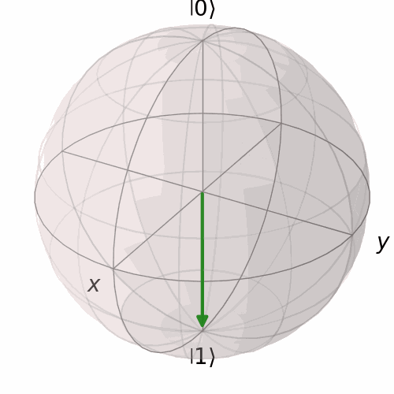
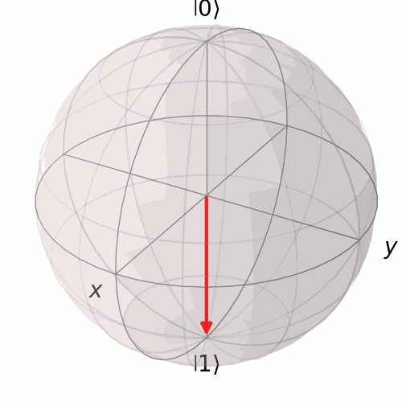
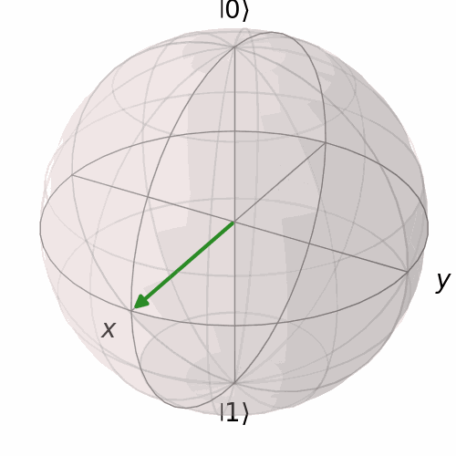

## Mục lục

Nội dung của bài này bao gồm:

- [1. Dẫn nhập](#1-dẫn-nhập)
- [2. Cổng đơn Qubit](#2-cổng-đơn-qubit)
- [3. Cổng đa Qubit](#3-cổng-đa-qubit)
- [4. Định lý không sao chép](#4-định-lý-không-sao-chép)
- [5. Tham khảo](#5-tham-khảo)

---

## 1. Dẫn nhập

### 1.1. Logic gate

Trong máy tính cổ điển, để thực hiện thao tác trên các Bit chúng ta sẽ cần các cổng Logic, các cổng này sẽ nhận một hoặc vài bit đầu vào và trả về một đầu ra duy nhất, các cổng logic quan trọng nhất có thể kể đến đó là cổng NOT, OR và AND, bảng liệt kê các giá trị input và output tương ứng với các cổng gọi là Truth Table:

![][image1]

*(Hình 0.1. Các cổng logic cơ bản)*

Các cổng logic khác đều là tổ hợp của các cổng cơ bản này, ví dụ: Bản chất cổng NAND là một cổng AND có đầu ra nối tiếp vào đầu vào của một cổng NOT. Các cổng NAND và NOR gọi là các cổng đa năng vì ta có thể giả lập các cổng logic khác chỉ bằng cách tổ hợp lại các cổng NAND và NOR tương ứng. Có hai lý do quan trọng khiến cho việc sản xuất NOR và NAND được ưu tiên hơn là sản xuất các cổng logic cơ bản là:

* **Cấu tạo vật lý:** Bên trong chip, các cổng logic được tạo thành từ các **Transistor**. Để tạo ra một cổng NAND bằng công nghệ CMOS, ta cần **ít transistor hơn** so với việc tạo ra một cổng AND (thực tế cổng AND vật lý thường là một cổng NAND nối thêm một cổng đảo phía sau). Nói chung cổng NAND nhanh hơn và tốn ít diện tích silicon hơn cổng AND.  
* **Sản xuất hàng loạt:** Khi sản xuất chip nhớ (như ổ cứng SSD hay RAM), việc chỉ cần in dập khuôn hàng tỷ con giống hệt nhau (toàn bộ là NAND) sẽ dễ dàng và ít lỗi hơn là phải thiết kế nhiều loại cổng khác nhau xen kẽ.

Một trong các cổng quan trọng nhất đó chính là cổng XOR (Exclusive OR), đây là cổng quan trọng nhất để thực hiện phép **cộng nhị phân** trong máy tính.

![][image2]

*(Hình 0.2. Cổng XOR và XNOR)*

Bằng cách kết hợp hàng tỷ cổng Logic trên lại với nhau chúng ta sẽ tạo thành các mạch phức tạp (mạch tổ hợp và mạch tuần tự) và khi kết hợp các mạch này lại với nhau chúng ta sẽ thu được các thành phần cơ bản của máy tính CPU, RAM, bộ nhớ,...

Ví dụ, để máy tính thực hiện phép tính $1 + 1 = 10$ (trong hệ nhị phân, tức là bằng 2 thập phân), nó sử dụng một mạch gọi là "Half Adder" (Bộ cộng bán phần) được ghép từ một cổng XOR và một cổng AND.

![][image3]

*(Hình 0.3. Mạch Half Adder)*

### 1.2. Quantum Gate

Tương tự với các cổng logic, trong máy tính lượng tử, để thực hiện thao tác với các Qubit chúng ta cũng phải sử dụng các cổng chuyên dụng gọi là Quantum Gate, các cổng lượng thường được biểu diễn bằng một ma trận đặc trưng. Một cổng lượng tử được coi là hợp lệ nếu ma trận đặc trưng của nó thỏa mãn hai điều kiện sau:

* **Ma trận phải khả nghịch (Reversible):** ta luôn có thể khôi phục lại đầu vào từ đầu ra. Chúng ta đều biết rằng trong đại số tuyến tính thì điều kiện để một ma trận khả nghịch là định thức của nó phải khác không. Nếu định thức bằng 0, ma trận đó là "kỳ dị" và làm mất thông tin đầu vào.

 

**Ví dụ: Ma trận Chiếu (Projection Matrix)**

Phép chiếu trạng thái lên một trục có thể được biểu diễn thông qua ma trận:

$$
M_{proj} = \begin{bmatrix} 1 & 0 \\ 0 & 0 \end{bmatrix}
$$

- Phép toán này ép mọi trạng thái về $|0\rangle$ hoặc triệt tiêu thành phần $|1\rangle$.  
- Ta dễ thấy định thức của ma trận trên bằng 0 nên nó không khả nghịch.  
- Phép toán này làm mất thông tin: giả sử bạn áp dụng toán tử này lên trạng thái cơ bản $|1 \rangle$ bạn sẽ nhận được vector 0. Hay nói cách khác nếu bạn nhìn vào vector sau khi áp dụng toán tử này bạn sẽ không thể biết trạng thái của vector ban đầu.

> Vì vậy ta còn gọi các ma trận vi phạm tính khả nghịch là “*Kẻ hủy diệt thông tin*”.

* **Ma trận Unitary:** Một ma trận vuông $U$ (với các phần tử là số phức) được gọi là Unitary nếu nghịch đảo của nó chính là chuyển vị liên hợp (conjugate transpose) của nó hay:

$$
U^\dagger U = U U^\dagger = I
$$

Trong đó:

- $I$ là ma trận đơn vị.  
- $U^\dagger$ (đọc là "U dagger") là ký hiệu của chuyển vị liên hợp (lấy chuyển vị $T$, sau đó lấy liên hợp phức của từng phần tử). Trong toán học thuần túy, người ta thường dùng ký hiệu $U^*$ hoặc $U^H$.

 

Một ma trận có thể khả nghịch (bạn có thể tính ngược lại), nhưng nếu nó không phải là Unita, nó sẽ làm tổng xác suất không còn bằng 100% (bằng 1).

**Ví dụ: Ma trận Khuếch đại (Scaling Matrix)**

Xét ma trận sau:

$$
M_{scale} = \begin{bmatrix} 2 & 0 \\ 0 & 2 \end{bmatrix}
$$

- Ma trận này là khả nghịch, nhưng không unita vì:

$$
M^{\dagger}M = \begin{bmatrix} 2 & 0 \\ 0 & 2 \end{bmatrix} \begin{bmatrix} 2 & 0 \\ 0 & 2 \end{bmatrix} = \begin{bmatrix} 4 & 0 \\ 0 & 4 \end{bmatrix} \neq I
$$

- Nếu trạng thái ban đầu là $|0\rangle = \begin{bmatrix} 1 \\ 0 \end{bmatrix}$ (xác suất 100%), sau khi qua cổng này nó thành $\begin{bmatrix} 2 \\ 0 \end{bmatrix}$. Xác suất mới là $|2|^2 = 4$ (tức 400%). Trong cơ học lượng tử, tổng xác suất không thể vượt quá 100%. Đây là điều vô lý về mặt vật lý.

> Đây là lý do mà ta gọi chúng là “*Kẻ hủy diệt xác suất*”.

Các phép toán thỏa mãn hai tính chất trên được coi là một cổng lượng tử hợp lệ, sau đây chúng ta sẽ nghiên cứu các cổng lượng tử đơn giản nhất.

---

## 2. Cổng đơn Qubit

### 2.1. Cổng Hadamard (H) - Người tạo chồng chập

**A. Định nghĩa:** Cổng Hadamard được biểu diễn bằng ma trận $2 \times 2$ sau:

$$
H = \frac{1}{\sqrt{2}} \begin{bmatrix} 1 & 1 \\ 1 & -1 \end{bmatrix} \tag{2.1}
$$

Dĩ nhiên là nó khả nghịch và unita (bạn đọc có thể kiểm tra lại). Vậy cổng này có tác dụng gì? Sức mạnh tính toán của máy tính lượng tử đến từ sự “chồng chập” và “rối” và cổng Hadamard chính là cổng đưa Qubit vào trạng thái chồng chập. Ví dụ ta áp dụng cổng $H$ lên một Qubit đang ở trạng thái cơ bản $|0 \rangle$:

$$
H|0\rangle = \frac{1}{\sqrt{2}} \begin{bmatrix} 1 & 1 \\ 1 & -1 \end{bmatrix} \begin{bmatrix} 1 \\ 0 \end{bmatrix} = \frac{1}{\sqrt{2}} \begin{bmatrix} 1 \\ 1 \end{bmatrix} = \frac{|0\rangle + |1\rangle}{\sqrt{2}}
$$

Trạng thái mới của Qubit sau khi áp dụng $H$ chính là $|+ \rangle$ ta đã học ở bài trước. Nếu bạn đo trạng thái này, bạn có 50% cơ hội nhận được 0 và 50% cơ hội nhận được 1. Tương tự nếu ta áp dụng $H$ lên trạng thái $|1 \rangle$:

$$
H|1\rangle = \frac{1}{\sqrt{2}} \begin{bmatrix} 1 & 1 \\ 1 & -1 \end{bmatrix} \begin{bmatrix} 0 \\ 1 \end{bmatrix} = \frac{1}{\sqrt{2}} \begin{bmatrix} 1 \\ -1 \end{bmatrix} = \frac{|0\rangle - |1\rangle}{\sqrt{2}}
$$

Đây chính là trạng thái $|- \rangle$. Về mặt xác suất đo lường, nó **giống hệt** trường hợp trên (50/50). Tuy nhiên, về mặt toán học, dấu trừ ở giữa biểu thị sự khác biệt về **pha**. Sự khác biệt này là cốt lõi của các thuật toán lượng tử (như giao thoa sóng).

*(Hình 2.1. Mô tả cách cổng Hadamard quay vector trạng thái cơ bản trên Cầu Bloch)*

**B. Tính chất đặc biệt: Tự nghịch đảo (Self-Inverse)**

Cổng Hadamard là nghịch đảo của chính nó.

$$
H^2 = H \cdot H = I \tag{2.2}
$$

Điều này có nghĩa là nếu bạn áp dụng $H$ lên $|0\rangle$, bạn được trạng thái chồng chập, nếu bạn áp dụng H thêm một lần nữa lên trạng thái chồng chập đó, bạn quay về $|0\rangle$.

**Chứng minh:**

$$
H(H|0\rangle) = H(|+\rangle) = H\left(\frac{|0\rangle + |1\rangle}{\sqrt{2}}\right) = \frac{H|0\rangle + H|1\rangle}{\sqrt{2}} = \frac{(|0\rangle + |1\rangle) + (|0\rangle - |1\rangle)}{2} = \frac{2|0\rangle}{2} = |0\rangle
$$

**C. Ý nghĩa:** 

Nếu không có cổng Hadamard, máy tính lượng tử cũng chỉ giống máy tính cổ điển nhưng đắt tiền hơn. Cổng $H$ mang lại sức mạnh thực sự vì 2 tính chất sau:

 

- **Khởi tạo song song (Quantum Parallelism):** Nếu bạn có 10 qubit đều ở trạng thái $|0\rangle$, sau khi áp dụng cổng $H$ lên tất cả chúng, bạn sẽ có một trạng thái chồng chập của $2^{10} = 1024$ trạng thái cùng một lúc. Máy tính lượng tử có thể xử lý cả 1024 trường hợp này trong một bước.

- **Chuyển đổi cơ sở (Change of Basis):** Trong ngôn ngữ đại số tuyến tính, cổng H thực chất là ma trận chuyển cơ sở từ cơ sở Z (Standard basis: $|0\rangle, |1\rangle$) sang cơ sở X (Hadamard basis: $|+\rangle, |-\rangle$). Việc chuyển đổi qua lại giữa các "hệ quy chiếu" này giúp giải quyết các bài toán mà máy tính cổ điển bó tay (như trong thuật toán Deutsch-Jozsa hay Shor).

### 2.2. Cổng Pauli-X (NOT lượng tử)

**A. Định nghĩa:** Nếu trong máy tính cổ điển cổng NOT chuyển bit từ trạng thái 0 sang 1 và ngược lại thì trong máy tính lượng tử ta cũng có một cổng tương tự gọi là cổng Pauli-X. Ma trận đặc trưng của cổng Pauli-X là:

$$
X = \begin{bmatrix} 0 & 1 \\ 1 & 0 \end{bmatrix} \tag{2.3}
$$

**B. Tính chất:** Nếu Qubit đang ở một trong hai trạng thái cơ bản nó cũng sẽ hoạt động tương tự như cổng NOT cổ điển, tuy nhiên nếu Qubit đang ở trong trạng thái chồng chập thì nó quay vector trạng thái của Qubit 180 độ trên cầu Bloch. Hãy tưởng tượng vector trạng thái của bạn đang hướng về phía **Đông Bắc** (gần cực Bắc $|0\rangle$ hơn). Khi cổng $X$ quay cả quả cầu 180 độ quanh trục $X$. Vector đó sẽ bị xoay xuống phía **Đông Nam** (gần cực Nam $|1\rangle$ hơn).  
    

*(Hình 2.2. Mô tả cổng X quay vector trạng thái cơ bản trên Cầu Bloch)*

    
**C. Góc nhìn hình học**

Trong lượng tử, qubit là một vector nằm trên mặt cầu đơn vị.

- **Trục quay:** Tên gọi "Pauli-X" ám chỉ việc **quay quanh trục X**.  
- **Góc quay:** Nó thực hiện một cú quay $180^\circ$ ($\pi$ radian).

 

Hãy tưởng tượng trục X đâm xuyên qua quả cầu từ trái sang phải. Nếu bạn cầm trục đó và xoay quả cầu 180 độ:

- Cực Bắc ($|0\rangle$) sẽ bị úp xuống thành Cực Nam ($|1\rangle$).  
- Cực Nam ($|1\rangle$) sẽ bị lật lên thành Cực Bắc ($|0\rangle$).

 

Giả sử ta có một trạng thái lượng tử tổng quát $|\psi\rangle$. Trạng thái này là sự chồng chập của $|0\rangle$ và $|1\rangle$ với các hệ số $\alpha$ và $\beta$:  

$$
|\psi\rangle = \alpha|0\rangle + \beta|1\rangle = \begin{bmatrix} \alpha \\ \beta \end{bmatrix}
$$

*(Lưu ý: $|\alpha|^2 + |\beta|^2 = 1$)*

Khi áp dụng cổng X vào vector này, chúng ta thực hiện phép nhân ma trận như sau:

$$
X|\psi\rangle = \begin{bmatrix} 0 & 1 \\ 1 & 0 \end{bmatrix} \begin{bmatrix} \alpha \\ \beta \end{bmatrix} = \begin{bmatrix} (0\cdot\alpha) + (1\cdot\beta) \\ (1\cdot\alpha) + (0\cdot\beta) \end{bmatrix} = \begin{bmatrix} \beta \\ \alpha \end{bmatrix}
$$

Kết quả:

$$
|\psi_{new}\rangle = \beta|0\rangle + \alpha|1\rangle
$$

Hay ta nói cổng NOT lượng tử đã đảo ngược khả năng xảy ra của các kết quả. Cái gì trước đây dễ xảy ra thì giờ thành khó xảy ra, và ngược lại.

Và $X$ cũng là một ma trận tự nghịch đảo hay:

$$
X^2 = \begin{bmatrix} 0 & 1 \\ 1 & 0 \end{bmatrix} \begin{bmatrix} 0 & 1 \\ 1 & 0 \end{bmatrix} = \begin{bmatrix} 1 & 0 \\ 0 & 1 \end{bmatrix} = I \tag{2.4}
$$

Giống như cổng Hadamard, nếu bạn áp dụng cổng NOT hai lần, bạn sẽ quay lại trạng thái ban đầu (phủ định của phủ định là khẳng định).

* **Trạng thái nào "miễn nhiễm" với cổng $X$? (Vector riêng)**

 

Trong đại số tuyến tính, vector riêng (eigenvector) là những vector không bị thay đổi phương hướng khi qua ma trận, chỉ bị thay đổi độ lớn (eigenvalue). Hãy xem trạng thái $|+\rangle$:

$$
X|+\rangle = X\left( \frac{|0\rangle + |1\rangle}{\sqrt{2}} \right) = \frac{X|0\rangle + X|1\rangle}{\sqrt{2}} = \frac{|1\rangle + |0\rangle}{\sqrt{2}} = |+\rangle
$$

Vậy ta nói trạng thái $|+\rangle$ là vector riêng của cổng $X$ với giá trị riêng là $+1$. Nghĩa là nếu qubit đang ở trạng thái $|+\rangle$ (nằm ngay trên trục X), việc quay quanh trục X sẽ không làm nó thay đổi gì.

### 2.3. Cổng Pauli-Z (Cổng Phase-Flip)

**A. Định nghĩa:** Cổng Pauli-Z được biểu diễn bằng một ma trận đường chéo:

$$
Z = \begin{bmatrix} 1 & 0 \\ 0 & -1 \end{bmatrix} \tag{2.5}
$$

**B. Tính chất:**

Nếu cổng Pauli-X là "kẻ ồn ào" (thay đổi giá trị 0 thành 1 rõ rệt), thì cổng Pauli-Z lại là một "kẻ trầm lặng". Tại sao lại gọi là "trầm lặng"? Bởi vì nếu ta chỉ đo đạc đơn thuần, ta sẽ **không thấy sự thay đổi nào cả**. Nhưng về mặt toán học, nó đã thay đổi bản chất bên trong của qubit. 

Giả sử ta có trạng thái chồng chập tổng quát:

$$
|\psi\rangle = \alpha|0\rangle + \beta|1\rangle = \begin{bmatrix} \alpha \\ \beta \end{bmatrix}
$$

Khi áp dụng cổng $Z$:

$$
Z|\psi\rangle = \begin{bmatrix} 1 & 0 \\ 0 & -1 \end{bmatrix} \begin{bmatrix} \alpha \\ \beta \end{bmatrix} = \begin{bmatrix} \alpha \\ -\beta \end{bmatrix} = \alpha|0\rangle - \beta|1\rangle
$$

Hãy tính xác suất đo được trạng thái $|1\rangle$:

- **Trước khi qua cổng $Z$:** Xác suất là $|\beta|^2$.  
- **Sau khi qua cổng $Z$:** Xác suất là $|-\beta|^2$.

 

Vì bình phương của một số (dù âm hay dương) đều dương và bằng nhau ($|\beta|^2 = |-\beta|^2$), nên **xác suất đo lường hoàn toàn không đổi**. Nếu ta chỉ nhìn vào các con số thống kê sau khi đo, ta sẽ không bao giờ biết cổng $Z$ đã từng tác động vào đó.

**C. Ý nghĩa:** Vậy cổng $Z$ dùng để làm gì? 

> Nó dùng để tạo ra **Giao thoa (Interference)**. Dấu trừ ($-\beta$) cực kỳ quan trọng khi ta kết hợp cổng Z với cổng Hadamard. Nó biến phép cộng thành phép trừ, giúp triệt tiêu các trạng thái sai và khuếch đại các trạng thái đúng trong thuật toán lượng tử.

**D. Góc nhìn Hình học: Xoay quanh trục Z**

Trên cầu Bloch:

- Trục Z là trục thẳng đứng nối cực Bắc ($|0\rangle$) và cực Nam ($|1\rangle$).  
- Cổng $Z$ thực hiện phép quay $180^\circ$ ($\pi$ radian) quanh trục Z.

Vì vector $|0\rangle$ và $|1\rangle$ nằm ngay trên trục quay, nên chúng không bị di chuyển vị trí (chỉ vector $|1\rangle$ bị xoay tại chỗ - đổi pha).

Nhưng nếu bạn có một vector nằm ở đường xích đạo (ví dụ trạng thái $|+\rangle$), cổng $Z$ sẽ quay nó sang phía đối diện của hình tròn xích đạo.

Ví dụ:

$$
Z|+\rangle = Z\left(\frac{|0\rangle + |1\rangle}{\sqrt{2}}\right) = \frac{|0\rangle - |1\rangle}{\sqrt{2}} = |-\rangle
$$

Nó biến trạng thái $|+\rangle$ thành $|-\rangle$.

*(Hình 2.3. Mô tả cổng Pauli-Z tác động lên vector trạng thái $|+ \rangle$)*

Có một tính chất rất đặc biệt với ba cổng lượng tử phía trên được biểu diễn thông qua đẳng thức:

$$
H \cdot Z \cdot H = X \tag{2.6}
$$

Hoặc:

$$
H \cdot X \cdot H = Z \tag{2.7}
$$

**E. Ý nghĩa:** 

> Cổng $Z$ (đảo pha) thực chất là cổng $X$ (đảo bit) nếu ta nhìn nó trong "cơ sở Hadamard" (sau khi kẹp giữa 2 cổng $H$). Điều này cho thấy: Việc thay đổi pha và thay đổi bit chỉ là hai mặt của một đồng xu, tùy thuộc vào việc ta đang đứng ở hệ quy chiếu nào.

### 2.4. Các cổng đơn khác

* **Pauli-Y**

 

Nếu cổng Pauli-X và Pauli-Z mô tả sự quay của vector trạng thái của Qubit quanh các trục X, Z của cầu Bloch thì chúng ta cũng có một cổng mà vector quay quanh trục Y (quay 180 độ) và ta gọi đó là cổng Pauli-Y.

Ma trận đặc trưng của cổng Pauli-Y có dạng:

$$
Y = \begin{bmatrix} 0 & -i \\ i & 0 \end{bmatrix} \tag{2.8}
$$

* **Phase Gate (S-Gate)**

 

Như chúng ta đã biết thì góc $\phi$ chính là pha tương đối giữa hai trạng thái cơ bản của Qubit, việc ta thay đổi góc này (bằng việc áp dụng cổng $Z$ chẳng hạn) sẽ làm ảnh hưởng đến giao thoa của hệ sau này và vì góc $\phi$ này rất quan trọng với giao thoa nên ta sẽ có thêm 2 cổng đặc biệt khác là cổng $S$ (còn gọi là cổng Phase) và cổng $T$.

Nếu cổng Pauli-Z quay một góc 180 độ quanh trục $Z$ thì cổng $S$ chỉ quay 90 độ quanh $Z$.

Ma trận đặc trưng của cổng Phase là:

$$
S = \begin{bmatrix} 1 & 0 \\ 0 & i \end{bmatrix} \tag{2.9}
$$

Việc áp dụng hai lần cổng $S$ sẽ tương đương một lần áp dụng cổng $Z$ hay $S^2 = S \cdot S = Z$.

* **T-Gate ($\pi /8$ - Gate)**

 

Cổng $T$ thực hiện quay vector trạng thái một góc 45 độ quanh $Z$, ma trận đặc trưng của nó có dạng:

$$
T = \begin{bmatrix} 1 & 0 \\ 0 & e^{i\pi/4} \end{bmatrix} \tag{2.10}
$$

*(Chú ý: $e^{i\pi/4}$ cũng có thể được viết dưới dạng đại số $\frac{1+i}{\sqrt{2}}$)*.

Áp dụng hai lần cổng $T$ liên tiếp cũng tương đương áp dụng một lần cổng $S$ hay $T^2 = T \cdot T = S$.

### 2.5. Ký hiệu trên mạch

Tương tự như trong máy tính cổ điển khi biểu diễn các logic gate trên các mạch cần dùng các ký hiệu đặc biệt thì trong máy tính lượng tử chúng ta cũng có các ký hiệu riêng để mô tả các mạch lượng tử.

Trong đó các Qubit thường được biểu diễn bằng một đoạn thẳng (dây dẫn), chiều đi của thông tin sẽ là từ trái qua phải (đây cũng là thứ tự áp dụng của các cổng trên Qubit đó).

Dưới đây là ký hiệu của 6 cổng chúng ta vừa nghiên cứu phía trên:

![][image7]

*(Hình 2.4. Ký hiệu mạch lượng tử của các cổng đơn Qubit)*

---

## 3. Cổng đa Qubit

### 3.1. Tích tensor

**Tích tensor** (Tensor Product), ký hiệu là $\otimes$, là một phép toán trong đại số tuyến tính dùng để "ghép" hai không gian vector lại với nhau thành một không gian lớn hơn. Khác với phép cộng vector (nơi ta cộng các thành phần tương ứng), tích tensor tạo ra một không gian mới bao gồm **tất cả các sự kết hợp có thể** giữa các phần tử của hai không gian ban đầu.

**Ví dụ:** Hãy tưởng tượng ta đang chọn quần áo:

- **Tập hợp A (Áo):** Có 2 loại {Áo đỏ, Áo xanh}. (Kích thước = 2)  
- **Tập hợp B (Quần):** Có 3 loại {Quần Jeans, Quần Kaki, Quần Short}. (Kích thước = 3)

Tích tensor của A và B ($A \otimes B$) là tập hợp tất cả các bộ trang phục có thể phối hợp:

- (Áo đỏ, Jeans), (Áo đỏ, Kaki), (Áo đỏ, Short)  
- (Áo xanh, Jeans), (Áo xanh, Kaki), (Áo xanh, Short)

**Kết quả:** ta có một không gian mới với kích thước là $2 \times 3 = 6$.

**A. Định nghĩa:** Cho ma trận $A$ kích thước $m \times n$ và ma trận $B$ kích thước $p \times q$. Tích tensor $A \otimes B$ sẽ là một ma trận lớn kích thước $mp \times nq$.  
    
$$
A \otimes B = \begin{bmatrix} a_{11} B & \cdots & a_{1n} B \\ \vdots & \ddots & \vdots \\ a_{m1} B & \cdots & a_{mn} B \end{bmatrix} \tag{3.1}
$$

**Ví dụ:** Nếu $A = \begin{bmatrix} 1 & 2 \\ 3 & 4 \end{bmatrix}$ và $B = \begin{bmatrix} 0 & 5 \\ 6 & 7 \end{bmatrix}$, thì:

$$
A \otimes B = \begin{bmatrix} 1 \cdot \begin{bmatrix} 0 & 5 \\ 6 & 7 \end{bmatrix} & 2 \cdot \begin{bmatrix} 0 & 5 \\ 6 & 7 \end{bmatrix} \\ 3 \cdot \begin{bmatrix} 0 & 5 \\ 6 & 7 \end{bmatrix} & 4 \cdot \begin{bmatrix} 0 & 5 \\ 6 & 7 \end{bmatrix} \end{bmatrix} = \begin{bmatrix} 0 & 5 & 0 & 10 \\ 6 & 7 & 12 & 14 \\ 0 & 15 & 0 & 20 \\ 18 & 21 & 24 & 28 \end{bmatrix}
$$

**B. Ý nghĩa:** 

**Một Qubit**: Được biểu diễn trong không gian vector phức 2 chiều $\mathbb{C}^2$. Các trạng thái cơ bản là $|0\rangle$ và $|1\rangle$.

**Hệ nhiều Qubit:** Để mô tả trạng thái của 2 qubit cùng lúc, ta phải dùng tích tensor của không gian chứa chúng: $\mathbb{C}^2 \otimes \mathbb{C}^2 = \mathbb{C}^4$.

Giả sử ta có 2 Qubit độc lập:

- **Qubit 1 (Control):** $\begin{bmatrix} a \\ b \end{bmatrix}$ (trong đó $a$ là biên độ của $|0\rangle$, $b$ là biên độ của $|1\rangle$)  
- **Qubit 2 (Target):** $\begin{bmatrix} c \\ d \end{bmatrix}$ (tương tự)

Vector trạng thái chung của hệ thống (vector 4 dòng) được tính như sau:

$$
|\psi\rangle = \text{Qubit}_1 \otimes \text{Qubit}_2 = \begin{bmatrix} a \\ b \end{bmatrix} \otimes \begin{bmatrix} c \\ d \end{bmatrix} = \begin{bmatrix} a \cdot \begin{bmatrix} c \\ d \end{bmatrix} \\ b \cdot \begin{bmatrix} c \\ d \end{bmatrix} \end{bmatrix} = \begin{bmatrix} a \cdot c \\ a \cdot d \\ b \cdot c \\ b \cdot d \end{bmatrix} \tag{3.2}
$$

Vậy ý nghĩa của các số hạng trên vector này trong thực tế là gì? 

- **Dòng 1 ($ac$):** Biên độ xác suất của trạng thái $|00\rangle$  
- **Dòng 2 ($ad$):** Biên độ xác suất của trạng thái $|01\rangle$  
- **Dòng 3 ($bc$):** Biên độ xác suất của trạng thái $|10\rangle$ (Control là 1, Target là 0)  
- **Dòng 4 ($bd$):** Biên độ xác suất của trạng thái $|11\rangle$ (Control là 1, Target là 1)

 

Hay nói cách khác thì xác suất ta đo hệ trên và thu được trạng thái mà cả hai Qubit đang ở trạng thái cơ bản $|0 \rangle$ chính là $|ac|^2$. Và đương nhiên ta cũng sẽ có tổng xác suất của bốn khả năng nói trên bằng 1, hay:

$$
|ac|^2+ |ad|^2+|bc|^2+|bd|^2=1 \tag{3.3}
$$

**Chứng minh:** - Với Qubit 1 ta có: 

$$
|a|^2+|b|^2=1 \tag{3.4}
$$

- Với Qubit 2: 
$$
|c|^2+|d|^2=1 \tag{3.5}
$$

Nhân chúng với nhau ta được:

$$
(|a|^2+|b|^2)(|c|^2+|d|^2)=|ac|^2+ |ad|^2+|bc|^2+|bd|^2=1 \quad (QED)
$$

Một cách tổng quát ta có thể chứng minh điều tương tự với trường hợp $n$ qubit.

### 3.2. Vướng víu (Entanglement)

Tích tensor cho phép mô tả hiện tượng **Vướng víu lượng tử (Entanglement)**, nơi trạng thái của hệ thống không thể tách rời thành từng phần nhỏ riêng biệt.

Dưới đây là một số trạng thái đặc biệt của hai qubit khi chúng vướng víu tối đa (Bell States - Entangled):

- **Phi cộng ($|\Phi^{+} \rangle$):**

$$
|\Phi^+\rangle = \frac{1}{\sqrt{2}} \begin{bmatrix} 1 \\ 0 \\ 0 \\ 1 \end{bmatrix} \approx \begin{bmatrix} 0.707 \\ 0 \\ 0 \\ 0.707 \end{bmatrix} \tag{3.6}
$$

- **Phi trừ ($|\Phi^{-} \rangle$):**

$$
|\Phi^-\rangle = \frac{1}{\sqrt{2}} \begin{bmatrix} 1 \\ 0 \\ 0 \\ -1 \end{bmatrix} \tag{3.7}
$$

- **Psi cộng ($|\Psi^{+} \rangle$):**

$$
|\Psi^+\rangle = \frac{1}{\sqrt{2}} \begin{bmatrix} 0 \\ 1 \\ 1 \\ 0 \end{bmatrix} \tag{3.8}
$$

- **Psi trừ ($|\Psi^{-} \rangle$):**

$$
|\Psi^-\rangle = \frac{1}{\sqrt{2}} \begin{bmatrix} 0 \\ 1 \\ -1 \\ 0 \end{bmatrix} \tag{3.9}
$$

Vậy sao ta nói trạng thái của hệ là không thể tách biệt? Nếu hệ A ở trạng thái $|\psi\rangle_A$ và hệ B ở trạng thái $|\phi\rangle_B$, thì trạng thái của cả hệ thống là:

$$
|\Psi\rangle = |\psi\rangle_A \otimes |\phi\rangle_B
$$

Hiện tượng **Vướng víu** xảy ra khi trạng thái tổng $|\Psi\rangle$ **KHÔNG THỂ** viết dưới dạng tích đơn giản này. Hãy xem xét ví dụ sau:

Giả sử Alice giữ một qubit và Bob giữ một qubit. Cơ sở chuẩn cho mỗi qubit là $|0\rangle$ và $|1\rangle$.

* **Trường hợp A: Trạng thái KHÔNG vướng víu (Separable State)**

 

Giả sử Alice có qubit ở trạng thái $|0\rangle$ và Bob có qubit ở trạng thái $|1\rangle$. Trạng thái của hệ thống là:

$$
|\Psi_{sep}\rangle = |0\rangle_A \otimes |1\rangle_B = |01\rangle
$$

Ở đây, trạng thái của Alice hoàn toàn độc lập với Bob. Chúngua có thể tách biệt rõ ràng: "Alice có 0, Bob có 1". Đây là trạng thái có thể tách rời.

* **Trường hợp B: Trạng thái Vướng víu (Entangled State) - Trạng thái Bell**

 

Xét trạng thái nổi tiếng là **trạng thái Bell** (cụ thể là $|\Phi^+\rangle$):

$$
|\Phi^+\rangle = \frac{1}{\sqrt{2}} (|00\rangle + |11\rangle)
$$

Trạng thái này mô tả một chồng chập lượng tử nơi mà:
- Hoặc cả Alice và Bob đều có $|0\rangle$.  
- Hoặc cả Alice và Bob đều có $|1\rangle$.

Tại sao đây là vướng víu? Chúng ta hãy thử chứng minh bằng toán học rằng trạng thái này không thể tách thành phần riêng biệt của Alice và Bob.

### Chứng minh toán học (Phản chứng):

Giả sử chúng ta có thể tách trạng thái $|\Phi^+\rangle$ thành trạng thái riêng của Alice và Bob.
Gọi trạng thái của Alice là $(\alpha|0\rangle + \beta|1\rangle)$ và của Bob là $(\gamma|0\rangle + \delta|1\rangle)$.

Tích tensor của chúng sẽ là:

$$
(\alpha|0\rangle + \beta|1\rangle) \otimes (\gamma|0\rangle + \delta|1\rangle) = \alpha\gamma|00\rangle + \alpha\delta|01\rangle + \beta\gamma|10\rangle + \beta\delta|11\rangle
$$

Bây giờ, hãy so sánh kết quả này với trạng thái Bell mục tiêu:

$$
\frac{1}{\sqrt{2}}|00\rangle + 0|01\rangle + 0|10\rangle + \frac{1}{\sqrt{2}}|11\rangle
$$

Để hai biểu thức này bằng nhau, các hệ số phải khớp nhau:

1. $\alpha\gamma = \frac{1}{\sqrt{2}}$ (Hệ số của $|00\rangle$)  
2. $\beta\delta = \frac{1}{\sqrt{2}}$ (Hệ số của $|11\rangle$)  
3. $\alpha\delta = 0$ (Hệ số của $|01\rangle$)  
4. $\beta\gamma = 0$ (Hệ số của $|10\rangle$)

 

**Mâu thuẫn:**

- Từ phương trình (3): $\alpha\delta = 0$, nghĩa là hoặc $\alpha = 0$ hoặc $\delta = 0$.  
- Nếu $\alpha = 0$: Phương trình (1) trở thành $0 \times \gamma = \frac{1}{\sqrt{2}}$, điều này **vô lý**.  
- Nếu $\delta = 0$: Phương trình (2) trở thành $\beta \times 0 = \frac{1}{\sqrt{2}}$, điều này cũng **vô lý**.

 

**Kết luận:** Giả thiết ban đầu là sai. Chúng ta **không thể** tìm được $\alpha, \beta, \gamma, \delta$ để mô tả trạng thái này dưới dạng tích tensor của hai phần riêng biệt. Do đó, Alice và Bob đã bị "vướng víu".

### A. Ý nghĩa vật lý

Vì không thể tách rời phương trình ($|\Psi\rangle \neq |\psi\rangle_A \otimes |\phi\rangle_B$), điều này dẫn đến hệ quả vật lý:

- **Không có trạng thái cục bộ:** Alice không có trạng thái qubit xác định (cô ấy không có "0" cũng không có "1", cũng không có một chồng chập riêng của mình). Trạng thái của cô ấy chỉ được xác định trong mối tương quan với Bob.  
- **Đo lường:** Ngay khi Alice đo qubit của mình và thấy kết quả là $|0\rangle$, trạng thái sóng sụp đổ và qubit của Bob **ngay lập tức** trở thành $|0\rangle$, bất kể khoảng cách bao xa.

Đây chính là điều Einstein gọi là "tác động ma quái từ xa" (spooky action at a distance), và tích tensor là công cụ toán học mô tả cấu trúc không thể tách rời này.

Tương tự với Qubit, nếu một cổng lượng tử $U$ không thể được phân tích thành tích tensor của các cổng đơn thì chúng được gọi là các cổng đa Qubit (Non-Separable). Cùng xem xét ví dụ về một cổng “giả” (Separable):

Giả sử bạn áp dụng cổng Hadamard ($H$) lên qubit 1 và cổng Pauli-X ($X$) lên qubit 2 **cùng một lúc**. Trong toán học, toán tử toàn hệ thống là:

$$
U = H \otimes X
$$

Ma trận $4 \times 4$ của nó sẽ là:

$$
U = \frac{1}{\sqrt{2}} \begin{bmatrix} 1 & 1 \\ 1 & -1 \end{bmatrix} \otimes \begin{bmatrix} 0 & 1 \\ 1 & 0 \end{bmatrix} = \frac{1}{\sqrt{2}} \begin{bmatrix} 0 & 1 & 0 & 1 \\ 1 & 0 & 1 & 0 \\ 0 & 1 & 0 & -1 \\ 1 & 0 & -1 & 0 \end{bmatrix}
$$

Ta thấy rằng ma trận cuối cùng trông có vẻ phức tạp nhưng nó hoàn toàn có thể phân tách thành hai ma trận đơn giản. Điều này có nghĩa rằng việc ta áp dụng cổng $H$ lên Qubit 1 sẽ không ảnh hưởng đến việc Qubit 2 bị tác động bởi cổng $X$ (chúng độc lập với nhau), nên chúng ta còn nói rằng tích tensor $A \otimes B$ chính là việc áp dụng cổng $A$ lên Qubit đầu tiên và $B$ lên Qubit còn lại một cách **độc lập và song song**.

Tiếp theo chúng ta sẽ nghiên cứu cổng đa Qubit đầu tiên và cũng là cổng đa Qubit quan trọng nhất.

### 3.3. Controlled-NOT (CNOT)

Cổng CNOT là cổng hoạt động trên **2 qubit**:

- **Qubit điều khiển (Control qubit):** Quyết định xem có thực hiện hành động hay không.  
- **Qubit mục tiêu (Target qubit):** Qubit bị tác động.

* **Nguyên lý hoạt động:** - Nếu qubit *Control* ở trạng thái $|0\rangle$, qubit *Target* **giữ nguyên**.  
- Nếu qubit *Control* ở trạng thái $|1\rangle$, qubit *Target* sẽ bị **đảo ngược** (thực hiện phép NOT: $0 \to 1, 1 \to 0$).

* **Ký hiệu trong mạch:** - Dấu chấm đen (•) nằm trên dây của qubit Control ($q_0$).  
- Dấu cộng trong hình tròn ($\oplus$) nằm trên dây của qubit Target ($q_1$).

![][image8]

*(Hình 3.1. Cổng CNOT)*

### A. Bảng chân trị (Truth Table):

Tương tự như Logic gate trong máy tính cổ điển, ta cũng có thể biểu diễn output của CNOT thông qua bảng dưới đây:

| Control (Input) | Target (Input) | $\rightarrow$ | Control (Output) | Target (Output) |
| :---: | :---: | :---: | :---: | :---: |
| $\vert 0 \rangle$ | $\vert 0 \rangle$ | $\rightarrow$ | $\vert 0 \rangle$ | $\vert 0 \rangle$ |
| $\vert 0 \rangle$ | $\vert 1 \rangle$ | $\rightarrow$ | $\vert 0 \rangle$ | $\vert 1 \rangle$ |
| $\vert 1 \rangle$ | $\vert 0 \rangle$ | $\rightarrow$ | $\vert 1 \rangle$ | $\vert 1 \rangle$ |
| $\vert 1 \rangle$ | $\vert 1 \rangle$ | $\rightarrow$ | $\vert 1 \rangle$ | $\vert 0 \rangle$ |

Về mặt toán học, hành động này tương đương với phép cộng modulo 2 trên qubit mục tiêu:

$$
|x, y\rangle \xrightarrow{CNOT} |x, y \oplus x\rangle
$$

*(Trong đó $x$ là control, $y$ là target).*

Trong toán học, "modulo" là phép lấy phần dư. Phép $\oplus$ chính là phép cộng số học thông thường, sau đó lấy phần dư cho 2.

Công thức tổng quát:

$$
a \oplus b = (a + b) \pmod 2
$$

Ví dụ với $1 \oplus 1$:
- Cộng thường: $1 + 1 = 2$  
- Chia cho 2 lấy dư: $2 \div 2 = 1$ (dư **0**)  
- Kết quả: **0**

 

### B. Ma trận đặc trưng

Ma trận chuẩn của cổng CNOT (với control là qubit đầu tiên) là:

$$
CNOT = \begin{bmatrix} 1 & 0 & 0 & 0 \\ 0 & 1 & 0 & 0 \\ 0 & 0 & 0 & 1 \\ 0 & 0 & 1 & 0 \end{bmatrix} = \begin{bmatrix} I & 0 \\ 0 & X \end{bmatrix} \tag{3.10}
$$

*(Trong đó $I$ là ma trận đơn vị $2 \times 2$ và $X$ là cổng Pauli-X)*

Như đã nói ở phía trên, cổng CNOT là một cổng không thể phân tách thành hai cổng độc lập, ta sẽ cùng chứng mình điều này thông qua phản chứng như sau:

Giả sử cổng CNOT có thể tách thành tích tensor của hai cổng 1-qubit bất kỳ là $A$ và $B$. Khi đó:

$$
CNOT = A \otimes B
$$

Trong đó:

$$
A = \begin{bmatrix} a_{00} & a_{01} \\ a_{10} & a_{11} \end{bmatrix}, \quad B = \begin{bmatrix} b_{00} & b_{01} \\ b_{10} & b_{11} \end{bmatrix}
$$

Tích tensor $A \otimes B$ sẽ có dạng ma trận $4 \times 4$:

$$
A \otimes B = \begin{bmatrix} a_{00}B & a_{01}B \\ a_{10}B & a_{11}B \end{bmatrix}
$$

Ta so sánh ma trận này với ma trận $(3.10)$:

- Nhìn vào khối góc trên bên trái ($2 \times 2$) ta có:  
$$
a_{00}B = I = \begin{bmatrix} 1 & 0 \\ 0 & 1 \end{bmatrix}
$$
$\Rightarrow B$ phải tỷ lệ với ma trận đơn vị $I$ (và $a_{00} \neq 0$).

- Nhìn vào khối góc dưới bên phải ($2 \times 2$):  
$$
a_{11}B = X = \begin{bmatrix} 0 & 1 \\ 1 & 0 \end{bmatrix}
$$  
$\Rightarrow B$ phải tỷ lệ với ma trận Pauli-X $X$ (và $a_{11} \neq 0$).

**Mâu thuẫn:** Ma trận $B$ không thể vừa tỷ lệ với $I$ (ma trận đường chéo) vừa tỷ lệ với $X$ (ma trận phản đường chéo) cùng một lúc được.
$\Rightarrow$ **Giả thiết sai**. CNOT không thể phân tách thành tích tensor hai ma trận 2x2.

### C. Ý nghĩa

Cổng CNOT không chỉ đơn thuần là logic "If-Then". Nó là chìa khóa để tạo ra **Vướng víu lượng tử (Entanglement)**.

Nếu ta đưa một qubit vào trạng thái chồng chập (bằng cổng Hadamard $H$) và sau đó dùng nó làm Control cho cổng CNOT, ta sẽ tạo ra trạng thái Bell (Bell State) - trạng thái vướng víu tối đa. Quy trình đó có thể thực hiện như sau:

**Bước 1:** Trạng thái khởi tạo (Initial State)

Chúng ta bắt đầu với 2 qubit đều ở trạng thái cơ bản $|0\rangle$. Ta tính tính tensor để tìm ra trạng thái chung của hệ hai qubit:

$$
|\psi_0\rangle = |0\rangle \otimes |0\rangle = \begin{bmatrix} 1 \\ 0 \end{bmatrix} \otimes \begin{bmatrix} 1 \\ 0 \end{bmatrix} = \begin{bmatrix} 1 \\ 0 \\ 0 \\ 0 \end{bmatrix}
$$

*(Đây là trạng thái $|00\rangle$)*

**Bước 2:** Áp dụng cổng Hadamard lên Qubit 1

Cổng Hadamard ($H$) được áp dụng cho Qubit 1, và Qubit 2 không làm gì cả (tức là áp dụng ma trận đơn vị $I$). Toán tử tổng hợp cho bước này là $H \otimes I$.

**Tính toán ma trận $H \otimes I$:**

$$
H = \frac{1}{\sqrt{2}}\begin{bmatrix} 1 & 1 \\ 1 & -1 \end{bmatrix}, \quad I = \begin{bmatrix} 1 & 0 \\ 0 & 1 \end{bmatrix}
$$

$$
H \otimes I = \frac{1}{\sqrt{2}} \begin{bmatrix} 1 \cdot I & 1 \cdot I \\ 1 \cdot I & -1 \cdot I \end{bmatrix} = \frac{1}{\sqrt{2}} \begin{bmatrix} 1 & 0 & 1 & 0 \\ 0 & 1 & 0 & 1 \\ 1 & 0 & -1 & 0 \\ 0 & 1 & 0 & -1 \end{bmatrix}
$$

Bây giờ ta nhân ma trận $(H \otimes I)$ với vector trạng thái khởi tạo $|\psi_0\rangle$:

$$
|\psi_1\rangle = (H \otimes I) |\psi_0\rangle = \frac{1}{\sqrt{2}} \begin{bmatrix} 1 & 0 & 1 & 0 \\ 0 & 1 & 0 & 1 \\ 1 & 0 & -1 & 0 \\ 0 & 1 & 0 & -1 \end{bmatrix} \begin{bmatrix} 1 \\ 0 \\ 0 \\ 0 \end{bmatrix} = \frac{1}{\sqrt{2}} \begin{bmatrix} 1 \\ 0 \\ 1 \\ 0 \end{bmatrix}
$$

Giải thích trạng thái $|\psi_1\rangle$:
Nếu viết lại dưới dạng Dirac, vector $\frac{1}{\sqrt{2}} [1, 0, 1, 0]^T$ tương ứng với:
$$
\frac{1}{\sqrt{2}} (|00\rangle + |10\rangle)
$$
Lúc này, Qubit 1 đang ở trạng thái chồng chập ($0$ và $1$), còn Qubit 2 vẫn chắc chắn là $0$. Chúng chưa vướng víu.

**Bước 3:** Áp dụng cổng CNOT

Bây giờ ta áp dụng ma trận CNOT (đã nói ở phần trước) lên vector trạng thái $|\psi_1\rangle$.

$$
|\psi_{final}\rangle = CNOT \cdot |\psi_1\rangle
$$

$$
|\psi_{final}\rangle = \begin{bmatrix} 1 & 0 & 0 & 0 \\ 0 & 1 & 0 & 0 \\ 0 & 0 & 0 & 1 \\ 0 & 0 & 1 & 0 \end{bmatrix} \cdot \frac{1}{\sqrt{2}} \begin{bmatrix} 1 \\ 0 \\ 1 \\ 0 \end{bmatrix} = \frac{1}{\sqrt{2}} \begin{bmatrix} 1 \\ 0 \\ 0 \\ 1 \end{bmatrix} 
$$

Đây chính là trạng thái $|\Phi^+ \rangle$ chúng ta đã đề cập phía trên. Mạch lượng tử của ta có thể được biểu diễn như sau:

![][image10]

*(Hình 3.2. Mô tả mạch lượng tử tạo vướng víu giữa hai Qubit)*

### 3.4. Cổng SWAP

Cổng SWAP hoạt động trên hệ 2 qubit. Đúng như tên gọi, nó hoán đổi trạng thái của hai qubit đầu vào.

Nếu trạng thái đầu vào là $|a\rangle \otimes |b\rangle$ (viết tắt là $|a, b\rangle$), thì đầu ra sẽ là:

$$
SWAP |a, b\rangle = |b, a\rangle
$$

**Trên các trạng thái cơ sở (Basis states):**

- $|00\rangle \xrightarrow{} |00\rangle$ (Không đổi)  
- $|01\rangle \xrightarrow{} |10\rangle$ (Đổi chỗ)  
- $|10\rangle \xrightarrow{} |01\rangle$ (Đổi chỗ)  
- $|11\rangle \xrightarrow{} |11\rangle$ (Không đổi)

### A. Ma trận đặc trưng

Từ tác động trên, ta có thể xây dựng ma trận $4 \times 4$ của cổng SWAP trong cơ sở $\{|00\rangle, |01\rangle, |10\rangle, |11\rangle\}$:

$$
SWAP = \begin{bmatrix} 1 & 0 & 0 & 0 \\ 0 & 0 & 1 & 0 \\ 0 & 1 & 0 & 0 \\ 0 & 0 & 0 & 1 \end{bmatrix} \tag{3.11}
$$

Tương tự như cổng CNOT thì cổng SWAP cũng là một cổng không thể phân tách thành tích tensor của hai cổng bất kỳ $A \otimes B$.

* **Ký hiệu trong mạch:**

Trong điện toán lượng tử, mạch SWAP thường được ký hiệu như sau:

![][image11]

*(Hình 3.3. Cổng SWAP)*

Cổng SWAP có một tính chất rất đặc biệt và cũng vô cùng quan trọng đó chính là nó có thể được biểu diễn bằng **3 cổng CNOT mắc nối tiếp ngược chiều.** Tại sao điều này lại quan trọng? Đó là vì trong thực tế, nhiều máy tính lượng tử (như của IBM) không có sẵn cổng SWAP vật lý. Họ chỉ có cổng CNOT, vì vậy họ cần phải cấu hình SWAP dựa trên các cổng CNOT.

**Công thức:**

$$
SWAP_{1,2} = CNOT_{1 \to 2} \times CNOT_{2 \to 1} \times CNOT_{1 \to 2} \tag{3.12}
$$

Hay biểu diễn trong mạch lượng tử là:

![][image12]

*(Hình 3.4. Cấu hình cổng SWAP bằng cổng CNOT)*

Ta có thể dễ dàng chứng minh $(3.12)$ bằng phép nhân ma trận.

**Bước 1:** Tìm ma trận $CNOT_{21}$

Bằng cách đổi lại thứ tự của Qubit control và target trên cổng CNOT chuẩn (đây là cổng CNOT "ngược", qubit thứ 2 điều khiển qubit thứ 1), ta dễ dàng tìm được bảng chân trị của $CNOT_{21}$.

- $|00\rangle \to |00\rangle$ (Control=0 $\to$ giữ)  
- $|01\rangle \to |11\rangle$ (Control=1 $\to$ đảo qubit 1: $0 \to 1$)  
- $|10\rangle \to |10\rangle$ (Control=0 $\to$ giữ)  
- $|11\rangle \to |01\rangle$ (Control=1 $\to$ đảo qubit 1: $1 \to 0$)

Từ đó, ma trận $C_{21}$ có các cột tương ứng với các trạng thái đầu ra ($|00\rangle, |11\rangle, |10\rangle, |01\rangle$):

$$
CNOT_{21} = \begin{bmatrix} 1 & 0 & 0 & 0 \\ 0 & 0 & 0 & 1 \\ 0 & 0 & 1 & 0 \\ 0 & 1 & 0 & 0 \end{bmatrix} \tag{3.13}
$$

**Bước 2:** Nhân ma trận.

Thay $(3.10)$ và $(3.13)$ vào công thức $(3.12)$ ta được:

$$
SWAP_{1,2} = \begin{bmatrix} 1 & 0 & 0 & 0 \\ 0 & 1 & 0 & 0 \\ 0 & 0 & 0 & 1 \\ 0 & 0 & 1 & 0 \end{bmatrix} \times \begin{bmatrix} 1 & 0 & 0 & 0 \\ 0 & 0 & 0 & 1 \\ 0 & 0 & 1 & 0 \\ 0 & 1 & 0 & 0 \end{bmatrix} \times \begin{bmatrix} 1 & 0 & 0 & 0 \\ 0 & 1 & 0 & 0 \\ 0 & 0 & 0 & 1 \\ 0 & 0 & 1 & 0 \end{bmatrix} = \begin{bmatrix} 1 & 0 & 0 & 0 \\ 0 & 0 & 1 & 0 \\ 0 & 1 & 0 & 0 \\ 0 & 0 & 0 & 1 \end{bmatrix} \quad (QED)
$$

### B. Ý nghĩa

Trong lý thuyết, chúng ta vẽ mạch lượng tử và giả sử qubit 1 có thể tương tác với qubit 100 bằng một cổng CNOT. Tuy nhiên, trong phần cứng vật lý (ví dụ chip siêu dẫn): **Các qubit chỉ tương tác được với qubit nằm ngay cạnh nó (Nearest Neighbor).**

Nếu ta muốn thực hiện CNOT giữa Qubit 1 và Qubit 3, nhưng chúng nằm xa nhau (1 -- 2 -- 3), bạn phải:

- **Bước 1:** Dùng **SWAP** để đổi chỗ Qubit 1 và Qubit 2. (Lúc này thông tin của Q1 đang nằm ở vị trí vật lý số 2).  
- **Bước 2:** Thực hiện CNOT giữa vị trí 2 và 3.  
- **Bước 3:** Dùng **SWAP** để đưa thông tin về lại chỗ cũ.

Do đó, cổng SWAP là "chi phí" bắt buộc để di chuyển thông tin lượng tử trên chip.

### 3.5. Cổng Toffoli (CCNOT)

Cổng Toffoli (hay còn gọi là cổng Controlled-Controlled-NOT - CCNOT) là một trong những cổng quan trọng nhất trong lý thuyết tính toán, không chỉ cho máy tính lượng tử mà còn cho cả máy tính cổ điển.

### A. Định nghĩa

Cổng Toffoli tác động lên **3 qubit**: 2 qubit điều khiển (Control) và 1 qubit mục tiêu (Target).

- **Qubit 1 (C1):** Giữ nguyên.  
- **Qubit 2 (C2):** Giữ nguyên.  
- **Qubit 3 (T):** Bị lật (X) nếu và chỉ nếu cả C1 và C2 đều ở trạng thái $|1\rangle$.

**Biểu thức logic:**

Nếu trạng thái là $|c_1, c_2, t\rangle$, thì trạng thái sau cổng Toffoli là $|c_1, c_2, t \oplus (c_1 \cdot c_2)\rangle$.

### B. Bảng chân trị (Truth Table)

Hầu hết các trường hợp đầu ra giống hệt đầu vào, ngoại trừ 2 hàng cuối:

- $|110\rangle \xrightarrow{} |111\rangle$  
- $|111\rangle \xrightarrow{} |110\rangle$

### C. Ma trận đặc trưng

Vì tác động lên 3 qubit ($2^3 = 8$ trạng thái), ma trận của nó là ma trận đơn vị $8 \times 8$ với một khối hoán vị nhỏ ở góc dưới cùng bên phải (2 Qubit đầu là Controlled-Qubit và Qubit thứ 3 là Target-Qubit):

$$
Toffoli = \begin{bmatrix} 1 & 0 & 0 & 0 & 0 & 0 & 0 & 0 \\ 0 & 1 & 0 & 0 & 0 & 0 & 0 & 0 \\ 0 & 0 & 1 & 0 & 0 & 0 & 0 & 0 \\ 0 & 0 & 0 & 1 & 0 & 0 & 0 & 0 \\ 0 & 0 & 0 & 0 & 1 & 0 & 0 & 0 \\ 0 & 0 & 0 & 0 & 0 & 1 & 0 & 0 \\ 0 & 0 & 0 & 0 & 0 & 0 & 0 & 1 \\ 0 & 0 & 0 & 0 & 0 & 0 & 1 & 0 \end{bmatrix} \tag{3.14}
$$

Giống như CNOT, ma trận này **không thể phân tách** thành $A \otimes B \otimes C$. Nó tạo ra sự vướng víu cao giữa 3 qubit.

### D. Ký hiệu trên mạch

Ký hiệu chuẩn của cổng Toffoli trên mạch lượng tử có dạng:

![][image13]

*(Hình 3.5. Cổng Toffoli)*

### E. Ý nghĩa

Vậy tại sao tôi lại nói cổng Toffoli là một trong các cổng quan trọng nhất? Nó đến từ ba lý do chính sau đây:

**1. Tính vạn năng cổ điển (Classical Universality)**

Tính vạn năng trong khoa học máy tính thường có nghĩa là nếu chúng ta có đủ số lượng của một loại cổng cụ thể nào đó, chúng ta có thể xây dựng bất kỳ mạch máy tính nào (CPU, Memory,...). Ví dụ trong tính toán cổ điển thì NAND là một cổng vạn năng.

Tuy nhiên khác với các Logic Gate thì Quantum Gate có một nguyên tắc quan trọng đó là: “Thông tin không thể bị phá hủy” hay chính là tính khả nghịch của ma trận đặc trưng mà ta đã nói ban đầu.

**Vấn đề của cổng NAND:**
Ví dụ với cổng NAND cổ điển nó nhận hai bit và trả về một bit, và nếu ta thấy bit trả về là 1 thì sẽ có 3 khả năng có thể xảy ra đó là:
- Input: $0, 1 \rightarrow$ Output: $1$  
- Input: $1, 0 \rightarrow$ Output: $1$  
- Input: $0, 0 \rightarrow$ Output: $1$

Và chúng ta không thể nào suy ra được trạng thái ban đầu của hệ dựa trên bit đầu ra, hay ta nói một phần thông tin của hệ đã bị xóa. 

**Giải pháp của cổng Toffoli:**
Nhưng với cổng Toffoli (hay bất kỳ cổng lượng tử nào khác) thông tin không hề bị mất đi. Ví dụ cổng Toffoli nhận 3 qubit đầu vào và trả về 3 qubit đầu ra, ta hoàn toàn có thể áp dụng cổng Toffoli một lần nữa lên 3 qubit này để khôi phục trạng thái của 3 qubit ban đầu.

**Giả lập cổng NAND bằng cổng Toffoli:**
Để chứng minh Toffoli là một cổng vạn năng, chúng ta cần chỉ ra rằng nó cũng có thể hành xử tương tự như một cổng NAND. Và ta có thể làm được điều này dễ dàng bằng cách cố định đầu vào của Target-Qubit là $|1 \rangle$, vậy ta tạm gọi trạng thái ban đầu của hệ 3 qubit này là $|A,B,1 \rangle$, áp dụng cổng Toffoli lên hệ này ta được:

$$
Toffoli |A, B, 1\rangle = |A, B, 1 \oplus (A \cdot B)\rangle
$$

Hay:

$$
Output = |A, B, \text{NAND}(A, B)\rangle
$$

Vậy nếu ta coi Input của hai Controlled-Qubit đầu tiên là Input và Output của Target-Qubit là Output của cổng thì đây chính xác là mô tả của cổng NAND trong máy tính cổ điển. Đây cũng chính là bằng chứng cho thấy bất kỳ thuật toán nào chạy được trên máy tính cổ điển thì cũng có thể chạy được trên máy tính lượng tử (điều ngược lại thì chưa chắc).

**2. Phép nhân lượng tử (Quantum Multiplication)**

**Phép nhân thực chất là cổng AND**
Khi thực hiện một phép nhân giữa hai bit cổ điển, chúng ta sẽ có 4 khả năng có thể xảy ra là:
- $0 \times 0 = 0$  
- $0 \times 1 = 0$  
- $1 \times 0 = 0$  
- $1 \times 1 = 1$

Và đây thực chất cũng chính là bảng chân trị của cổng AND cổ điển. Bằng cách cố định đầu vào của Taget-Qubit trong cổng Toffoli về $|0 \rangle$ ta hoàn toàn có thể giả lập lại cách hoạt động của cổng AND:

$$
Toffoli |A, B, 0\rangle = |A, B, A \cdot B\rangle = |A, B, \text{AND}(A,B) \rangle
$$

Hay ta nói là kết quả của phép nhân $A \cdot B$ được lưu ở Qubit thứ 3 (Ouput của Target-Qubit).

### 3.6. Các cổng đa Qubit khác

### Controlled-Z (CZ-Gate)

Đây là anh em sinh đôi của CNOT nhưng thay vì xoay bit (X) thì nó xoay pha (180 độ quanh Z). Nếu hai Qubit đang là $|11 \rangle$ nó sẽ xoay pha (thêm dấu trừ), nếu không thì không làm gì cả, bảng chân trị của nó dạng:
- $|00\rangle \to |00\rangle$  
- $|01\rangle \to |01\rangle$  
- $|10\rangle \to |10\rangle$  
- $|11\rangle \to -|11\rangle$

 

Ma trận đặc trưng của $CZ$:

$$
CZ = \begin{bmatrix} 1 & 0 & 0 & 0 \\ 0 & 1 & 0 & 0 \\ 0 & 0 & 1 & 0 \\ 0 & 0 & 0 & -1 \end{bmatrix} \tag{3.15}
$$

Biểu diễn trên mạch của $CZ$:

![][image14]

*(Hình 3.6. Cổng Controlled-Z)*

### Controlled-S (CS-Gate) và Controlled-T (CT-Gate)

Nếu cổng $CZ$ xoay các Qubit 180 độ quanh Z thì cổng $CS$ chỉ xoay 90 độ, vì vậy ma trận đặc trưng của nó có dạng:

$$
CS = \begin{bmatrix} 1 & 0 & 0 & 0 \\ 0 & 1 & 0 & 0 \\ 0 & 0 & 1 & 0 \\ 0 & 0 & 0 & i \end{bmatrix} \tag{3.16}
$$

Và tương tự với cổng $CT$ là cổng sẽ xoay các Qubit một góc 45 độ quanh Z:

$$
CT = \begin{bmatrix} 1 & 0 & 0 & 0 \\ 0 & 1 & 0 & 0 \\ 0 & 0 & 1 & 0 \\ 0 & 0 & 0 & e^{i\pi /4} \end{bmatrix} \tag{3.17}
$$

Biểu diễn trên mạch của hai cổng trên có dạng:

![][image15]

*(Hình 3.7. Cổng CS và CT)*

Nhóm 3 cổng $CZ, CS, CT$ còn được viết dưới dạng $CP(\theta)$ với $\theta$ là góc xoay pha ($\theta \in \pi, \pi/2, \pi/4, \ldots$).

### CSWAP (Fredkin-Gate)

Cũng giống như CCNOT thì CSWAP cũng là một cổng vạn năng và nó cũng cần 3 Qubit đầu vào. Nguyên lý hoạt động của nó là chỉ đổi trạng thái của hai Target-Qubit (X) nếu Controlled-Qubit là 1. Bảng chân trị tương ứng với Input $|C, T_1, T_2\rangle$ dạng:

- $|000\rangle \to |000\rangle$ (Control=0: Keep)   
- $|001\rangle \to |001\rangle$ (Control=0: Keep)   
- $|010\rangle \to |010\rangle$ (Control=0: Keep)   
- $|011\rangle \to |011\rangle$ (Control=0: Keep)   
- $|100\rangle \to |100\rangle$ (Control=1: Swap 0,0 $\to$ Keep)   
- $|101\rangle \to |110\rangle$ (**Control=1: SWAP!**)   
- $|110\rangle \to |101\rangle$ (**Control=1: SWAP!**)   
- $|111\rangle \to |111\rangle$ (Control=1: Swap 1,1 $\to$ Keep)

 

Ma trận đặc trưng của nó có dạng:

$$
CSWAP = \begin{bmatrix} 1 & 0 & 0 & 0 & 0 & 0 & 0 & 0 \\ 0 & 1 & 0 & 0 & 0 & 0 & 0 & 0 \\ 0 & 0 & 1 & 0 & 0 & 0 & 0 & 0 \\ 0 & 0 & 0 & 1 & 0 & 0 & 0 & 0 \\ 0 & 0 & 0 & 0 & 1 & 0 & 0 & 0 \\ 0 & 0 & 0 & 0 & 0 & \mathbf{0} & \mathbf{1} & 0 \\ 0 & 0 & 0 & 0 & 0 & \mathbf{1} & \mathbf{0} & 0 \\ 0 & 0 & 0 & 0 & 0 & 0 & 0 & 1 \end{bmatrix} \tag{3.18}
$$

Biểu diễn trên mạch của CSWAP là:

![][image16]

*(Hình 3.8. Cổng CSWAP)*

---

## 4. Định lý không sao chép

Trong tính toán cổ điển, việc sao chép một bit được thực hiện một cách đơn giản bằng cổng CNOT và nguyên lý của cổng CNOT cổ điển cũng tương tự như CNOT lượng tử khi nó chỉ lật Target-Bit nếu Controlled-Bit là 1. Cách sao chép một bit cụ thể như sau:

**Bước 1:** Chuẩn bị một bit làm Controlled-Bit gọi là $x$ (bit cần sao chép, trạng thái có thể là 0 hoặc 1) và một bit đang ở trạng thái 0 làm Target-Bit (Blank Bit).

**Bước 2:** Áp dụng cổng CNOT lên hai bit này.

- Nếu $x$ là 0 thì CNOT không làm gì cả (Target-Bit vẫn là 0).  
- Nếu $x$ là 1, CNOT lật Target-Bit (Target-Bit là 1).

Kết quả:

$$
(x, 0) \xrightarrow{\text{CNOT}} (x, x)
$$

Vây là chúng ta đã có thể sao chép trạng thái của một bit sang một bit khác chỉ với một cổng. Tuy nhiên trong tính toán lượng tử, việc sao chép trạng thái của một Qubit (đang trong trạng thái chồng chập) là bất khả thi, điều này còn được biết đến với tên gọi **Định lý không sao chép (No-Cloning Theorem).** Đây là một trong các định lý quan trọng nhất của tính toán lượng tử và nó được phát biểu như sau:

### A. Định lý:

> Không thể tạo ra một bản sao **độc lập và giống hệt** của một trạng thái lượng tử **bất kỳ** chưa biết.

Vậy cổng CNOT lượng tử của chúng ta thì sao? Chẳng phải ở phần trước chúng ta đã sử dụng CNOT để tạo ra hai Qubit có cùng một trạng thái đó sao. Tuy nhiên định lý không cấm chúng ta tạo ra hai Qubit giống hệt nhau, nó cấm chúng ta tạo ra hai Qubit giống hệt và độc lập với nhau (independent). CNOT giúp chúng ta tạo ra hai Qubit giống hệt **nhưng** vướng víu với nhau. Cụ thể:

Trạng thái của hai Qubit sau khi áp dụng CNOT:

$$
|\text{Target}\rangle = \alpha |00 \rangle + \beta |11 \rangle
$$

Việc đo lường một Qubit sẽ làm sụp đổ trạng thái của Qubit còn lại. Nhưng điều chúng ta mong muốn là hai Qubit phải độc lập với nhau, hay theo ngôn ngữ của tích tensor thì trạng thái sau khi sao chép có thể viết được dưới dạng:

$$
|\text{Target}\rangle = |\psi\rangle \otimes |\psi\rangle
$$

$$
= (\alpha|0\rangle + \beta|1\rangle) \otimes (\alpha|0\rangle + \beta|1\rangle)
$$

$$
= \alpha^2|00\rangle + \alpha\beta|01\rangle + \beta\alpha|10\rangle + \beta^2|11\rangle
$$

### Chứng minh

Chúng ta bắt đầu bằng việc giả sử là có thể tạo ra một cổng lượng tử có thể nhận một Qubit đầu vào (Qubit chồng chập cần sao chép) và một Qubit ở trạng thái cơ bản và tạo ra hai Qubit độc lập chồng chập, vậy bài toán của chúng ta sẽ có dạng như sau:

**Khởi đầu:** Ta có một Qubit cần sao chép đang ở trạng thái $q_1 = \alpha|0\rangle + \beta|1\rangle$ và Qubit 2 đang ở trạng thái cơ bản $q_2 = |0\rangle$. Trạng thái ban đầu của hệ này có thể được mô tả bằng tích tensor:

$$
|\text{Input}\rangle = \begin{bmatrix} \alpha \\ \beta \end{bmatrix} \otimes \begin{bmatrix} 1 \\ 0 \end{bmatrix} = \begin{bmatrix} \alpha \cdot 1 \\ \alpha \cdot 0 \\ \beta \cdot 1 \\ \beta \cdot 0 \end{bmatrix} = \begin{bmatrix} \alpha \\ 0 \\ \beta \\ 0 \end{bmatrix}
$$

**Bài toán:** Giả sử ma trận đặc trưng của cổng lượng tử cần tìm là $U$ (cỡ $4 \times 4$) và ma trận này thỏa mãn:

$$
U |\text{Input}\rangle = |\text{Target}\rangle = q_1 \otimes q_1 = \begin{bmatrix} \alpha \\ \beta \end{bmatrix} \otimes \begin{bmatrix} \alpha \\ \beta \end{bmatrix} = \begin{bmatrix} \alpha^2 \\ \alpha\beta \\ \beta\alpha \\ \beta^2 \end{bmatrix}
$$

Hãy cùng nhìn vào dòng đầu tiên của phép nhân ma trận $U | \text{Input} \rangle$:

$$
(U_{11} \cdot \alpha) + (U_{12} \cdot 0) + (U_{13} \cdot \beta) + (U_{14} \cdot 0) = \alpha^2
$$

Hay có thể viết gọn lại:

$$
U_{11}\alpha + U_{13}\beta = \alpha^2
$$

Ta dễ dàng nhìn thấy ngay một nghịch lý ở đây đó là vế trái của phương trình là một bậc nhất (theo hai biến $\alpha, \beta$) nhưng vế phải lại có dạng bậc hai ($\alpha^2$), hay nói cách khác là không thể tồn tại bộ số $U_{11},U_{13}$ nào có thể biến phương trình bậc nhất thành phương trình bậc hai được.

### Kết luận:

> Không tồn tại ma trận cỡ $4 \times 4$ nào thỏa mãn điều kiện của bài toán.

*Chú ý: Nếu bạn coi $U_{11} = \alpha$ và $U_{13} = 0$ là nghiệm thì bạn đang giả định rằng cổng lượng tử cần tìm của chúng ta sẽ thay đổi dựa trên Input đầu vào, điều này là phi lý vì ta không thể chế tạo một cổng nào như vậy (các số hạng của ma trận đặc trưng phải là cố định với mọi Input đầu vào).*

Bạn đọc có thể thắc mắc là kết luận phía trên chỉ áp dụng với các cổng mà có ma trận đặc trưng cỡ $2 \times 2$, vậy nếu tôi dùng nhiều Qubit hơn và nhiều cổng hơn với quy trình phức tạp hơn thì có thể hay không?

Câu trả lời vẫn là **không**. Điều này bắt nguồn từ **Tính tuyến tính (Linearity)** của ma trận:

- Phép nhân hai ma trận $A \times B$ (tương tự việc mắc nối tiếp hai cổng liên tiếp) sẽ tương đương với việc sử dụng một ma trận thay thế $C$.  
- Tích tensor của hai ma trận hoặc vector (giống như việc bạn sử dụng nhiều cổng và Qubit hỗ trợ hơn) chỉ tạo ra một ma trận với kích thước lớn hơn chứ không làm mất đi tính tuyến tính của kết quả cuối cùng (không thể biến $\alpha$ thành $\alpha^2$).

Và quy trình dù có phức tạp đến đâu cũng đều có thể được viết dưới dạng tích ma trận và tích tensor, giả sử quy trình của chúng ta dạng:

$$
\text{Process} = G_1 \otimes (G_2 \times G_3) \otimes \ldots
$$

Đây thực chất vẫn là một ma trận khổng lồ và nó vẫn phải tuân thủ tính tuyến tính của một ma trận. Vì vậy dù ta cố gắng bao nhiêu thì cuối cùng vẫn không thể tạo ra hai Qubit giống hệt và độc lập với nhau.

### B. Ý nghĩa

Định lý này dường như giống một hạn chế (khi mà chúng ta không thể backup data một cách dễ dàng), nhưng thật ra nó lại mang ý nghĩa sống còn trong lĩnh vực bảo mật.

1. **Mã hóa lượng tử (QKD):** Bởi vì ta không thể sao chép trạng thái lượng tử, kẻ tấn công không thể nghe lén cuộc “trò chuyện lượng tử”. Để đọc được thông điệp, họ phải đo nó. Việc đo sẽ làm sụp đổ hàm sóng và phá hủy thông tin. Người nhận sẽ ngay lập tức biết rằng thông điệp đã bị can thiệp.  
2. **Sửa Lỗi:** Vì chúng ta không thể chỉ sao chép dữ liệu để sao lưu (như RAID trên ổ cứng), chúng ta đã phải phát minh ra các mã “Sửa Lỗi Lượng Tử”, phân tán thông tin ra nhiều qubit rối lượng tử thay vì sao chép nó.

---

Vậy là ở bài này chúng ta đã nghiên cứu xong về các cổng lượng tử. Ở bài tiếp theo ta sẽ cùng tìm hiểu về Qiskit - một nền tảng mã nguồn mở để làm việc với máy tính lượng tử.

## 5. Tham khảo

**Tiếng Anh**

1. Chương 1 của cuốn [Quantum Computation and Quantum Information | Cambridge Aspire website](https://www.cambridge.org/highereducation/books/quantum-computation-and-quantum-information/01E10196D0A682A6AEFFEA52D53BE9AE#overview)  
2. [Ultimate Guide to Quantum Gates: Everything You Need to Know | SpinQ](https://www.spinquanta.com/news-detail/quantum-gates)

[image1]: <data:image/png;base64,iVBORw0KGgoAAAANSUhEUgAAAcsAAAEyCAIAAAAa/WzBAABM1UlEQVR4Xu2dB5QUVdr3e7on9PQkQBBFDCACYtZ1zaKIWUniIkGSIghiQsWcIwLGNa4BCSJKMpPz5Ok8qacnwBDd3fN+35716J7v+875/n0fp95+607f6a7u6umZeeb8zpzquk/fCl33V0+lWxavr9Ll83s9jT6/y+etZhiGYeLB76v1+atc3lpfpdtS6Q82BJf+ff+T/zgwr4UHWgj/GGlYUcRhimFFEYcphhVF8rCiiMMUw4oiDlMM//Hxnwce/cfBRxvqVvi8NRavr6Y58OFvhyb9dnD670dGhPjlpj8I/xhpWFHEYYphRRGHKYYVRfKwoojDFMOKIg5TDLd8DOn0wIym6rc9nnqLyx/YF/jw139c+++/j/j1yHiGYRgmHv79z2t//WVUfe3bLk+DxeXzNgb/+p+D4/99ZNJvh8cxDMMw8fDr4Yn/OTgxUPuex+tnwzIMwyQSNizDMIxZsGEZhmHMgg3LMAxjFmxYhmEYs2DDMgzDmEVshv398K2/HR7/2+GJvx2a/NuhqSEOTg9Bw7qPkYYVRRymGFYUcVibw4oiDlMMK4o4LDQ8OfRMweHxvx8eKwszZsP++8j43w9O+u3ImP8cBqMYhmG6IL8f+W9+OzIWVoQbZWHGbFhkr3Drfx2ce6D+0+b6peBAMAQN6z5GGlYUcZhiWFHEYW0OK4o4TDGsKOriYWBf8Iv9wU/+69AcWFFksrIwjRh27D8PPu3z+dz+SuD1haBh3cdIw4oiDlMMK4o4rM1hRRGHKYYVRV05TBv2+Tz/OPgorPjr4dadGZthEf37kTF/PzwfhtWmwTAM0zUJGfbQAzDsvw9PloXJhmUYhjEODPvPww+yYRmGYRIPG5ZhGMYsYMJ/Hnr4P4fHKJzJhmUYhjECG5ZhGMYs2LAMwzBmwYbttOAH81dWy+PVuD0+n79KHp9YFJOorKrBnCsCYgVVEahWLg0PUwcwjAHYsJ2BL5YunzDxdu0jLAm3Tpw0udfRx3z40d9oZHmFq6q61uX2fvLp56cOOX38hEkYWeF033HnXSiC1/ARpZdeNvSEE/u9/MprKAqfBALgINQw/9HHzzjz7MefeErzESaH2vY1H8DA2FvHjbttAmYGYODFl17BGEBjfvjxZ1SCmlHD2eech+G6YEP4VFAnJnHBhRcPHHTq9h27vlr1zW3jJ2qTxlRqA8GZs2bfMvYvgbr6mtq66poAasOEELNz156HHp4/9IphM+6a5XR5aMZQikkMOe2MkwcMxGIiHmsGkevWf6dJHAEYxixddPGltB40mvY20/rBFwGGUTOmi5mZMnU6AsbccuuWrduxqm/9y22YK1pMTGLS7VOwMrE4qHDhojf27tsfXi3mcNr0O/8ybjyWDjVMnjINs3rnjJmY+Vl3z0H9iNmwcfOo0bdoqwUxmCjiMV1awxh4+52/YgDrhGIwb1hFtOzh00I8poVIzCdWSH1D0+gxY7GuysqdmD2MeeXVBVdceRVGYjZQD/4jPrwSLA4qQeXg4KEj4UWMGjZsZ+C1BQu79+ipfYQLLBYrWhqa+rLlX1rSbDAIRl52+RUYjwEU4eeEAiAXlCIMrTQzK/vc884nnTXvP6hL6NDqLh96Jb6u+Q7tk4rumnn39DtmaCpHAE0dMfgWhjEV1EY5NbyZX9Ad3y0pLYd3yA7hIB71B+sbf96wCV+x2jLoi9u276QiR04eBmBYykyvvuY6W3omAmhaqBmGysvvRlq0Z+dgZHFJWWjztVhPGTgYs7fiy6+AJtP3P/gIRaiBVkv4zMA+WD9YUSg6/oSTMDO0rjB7WGRMnSrHkmI8zR6gOcG3MIypwEoYDq8WH/EV+plQG9YPwjCr+CINYHLYa6ZZ07Wv4NfBGqOVj/FYfHwRY7A2aF+I8RiTZXegkvBp0a4IS0HLi/9YM5guKkEkJoSZyci0l5ZV0Pg9hcVYIowJrwQfUQ9JXNszMdHAhu0MLFy4uHv3o7zicT003fSMLGRbVIT2g/TtsyWfI6OypFlw/O0V+Q5pC8Noe/gKEjF4SvadBlxhTbdV1/5hJarBF9qAKm22DLQ6NEJUiAH8R+utFAf7ofotVvgIH8kOSKOQI+tEptHYtA/+RZIF6UAcaM9o8JALXIDxEIoQpWXlypXFxcXV1dVVwuZWazoWAUVYBEwClWAAqgUopZoxHNqdCPF9uXIV0EwBSY0YORrTwhd184NlgVUxdYCpFBR0X7/+O9SAmSFhoUJaFrKt9kWsAaofNSBLbXV59x84hJWPminbtaTb0L5ATk7O9u3bly1bhiWlSI/Y02jD+BZ8Rx/xW2PZveKHhkmx4DqbEzRvmCWUwuzjJ06AYyFVnzg3glJ81++vGjhw8GOPPeEVY7xhT39iKlAw/b66gxtGDRu2MxBuWFhSa/ahMR4fWqMjN6eqpvqMs850ul3ellOTdEhIhs3Jzf/bJ59paZ1Mz6N7jRl7C9Ijr2jMVINmWLIbJVY6w6Jxvr5wMYGRmGi2I7fX0cfIk6CaoRLMDGaJEkP8xxg0b+SMFJCRkeF0OvG/rq5uw4ZNxx57HJaXDItp4aAYX0dGj69QMks1Iy8rKi7FjMEvOsNiliBxyul084OYz5cs/ezzL1A/FrOhoQnTCtnWloElhZQVhsVR/7Tpd2J+Bg0eQjszHTrD2jLSMX3sySDWysrKKA2Lid4z9z6sHExr5qzZbRoWC4J9YYXLuW3H9rn33UuGxXqbdPuUo48+Jisru6LCJRsWH996+90Fry9auOgNuXJGARu2MxBuWDQwtECtiNSTac/atWf3tddfh6ZFXsDhJNpVyAtpNjpc3bhpi+Zlmaxs++x75kDTMAIOY/FdCCsQCILnnnsBWeoZZ5595bDhEJmcw27esg2H/MArTnqihquGX4PxhUUl8oSQbC75YhmSxHG3TaAaGhr3WkTuiZpDrrFaXS4X/peVlWF8c/OBjIwspLdk533NB957/8OCbj127S7E0p12+pnhlZOLdYal1Gz+o49job5ZvTY8HrNKeywszh13zHA63ZgWxtPpgkqRQUcy7Pc//IQjg+07dl162dBWrafPYS2WzMzMbt26HTp0yOv1rlq1SjMspgV14mfySobFnKxZux4T2rFz94aNm9s0LHY8ofNCVZU4Akmzhc6NUGnz/oNIzzFQh5pbM+zOXXswFdBq/Uwk2LCdgXDDQqBoddpJUjSqZ5974Y4Zd6KdWtIsLo+bjnnRXOn0JRm2/8mnwC/at2SefvYZfB2C9ogL/TAUWlptbV16euaCBQtfePHlxW+8ZREneXWGRXoISVHOS8eziCFdWsRpU92EcBBKc0hWRSWhk6EWKxyKRRM7A4vH4xk+fPhNN92E8Uii8/O7IQH3ChH4xXnSl195jdJV7AzCKydX6gzrE8fOHnFiWnf+seW8hHX41dd6PL6ysoqcnLy7Zt4NUA8tQiTDYsdA48feOo4WXIfOsNhnYLmQnqelpcGwbrdbMyxZntaVzrChNSAWBGsJYW0a9t77HuhxVK9XXnsV+ajFmkaGTRe7DWSvxcWlocjWDEtnkLDUuitpjBo2bGfgpZdf7SYMC5BOPv/CS46cPL+4dENXObzi+BoD11x7PcYj0/S1nDklw0IlyGrRbt3iPgQYAWPCJ0H5Gl0LqhQXi5ANoc2jcSIelaNOTNQnzsNC8ZQ7e0Xj1M5vYmYgAkTu3befzorSdXMN1KlZmHYApD/MJNWGUos4Tqf5wc4DMeeed/7ce+8n39G1cgwMHHQq5jYnN/+773/Ed7E4lDgjDHqlK11+cX2M7jdADHJqnWEJfIvOxqLCoVcMI4v5W3JYiiERa1+BYWmGEQPDyucfvC2G1fxO17XKK1zYJ9FqtIhT2FjJtNR0ApQMq92DQTVo86A2LGYDU8EkaCR2q3n53UKrV/yy+C2w0izi2p12GEQX4lAtTZ1Wl1w/Ewk2bGfgtQUL0QbQKkIIAe0pLMYAQU0doBW9+NIroZEiDOkMGhvZkALoMj2hZUkaaIpDTjtDC0DLP+9Pf8bxuPb1Dz78ePacuagTM4ORdFYXbfiPKabZ4Lu/jBuv1aCrH2zctAXKxixZxB0INDK0kwiTOwIwELrwLVI5DNw5Y+aFF13iFR6hRYN5yTv4f1K/ky1CkU88+TRVuHzFSm1dQWcXXHhxaO1ZrNCr7u4x4oYbb0YuDOmHLgdVViMMw1jJMJEmLBIixVPSTVfq3OLOJ0oVw8GY0NkPkcOiWlSFeaCqMMOQMn0Fs4c5x//wZB8zQAmytyVt97bcn5DtyKXVrsMikvfQvifMyEUiY6XzBlgQVEu3mtFZI1pFGEmrGvOA/1j5993/oFw/Ewk2bGcAiQbdkESghfjEUTm1cM2wLnGFisZAJfhWpbi+jzZGAU5xgxfFaCM13OKkJImDbqGlK/7hBqfxNNIjzidQOkYfKVHCbFA+qKvfK4SI8ZgK1UMjq1quetGcwzV+kWXjo5bwYm7d4lkJCqNh+i5KMZ/hyTLJmqB6fOIMBhLGVhPASnHGA0WYNJyOlLxSXLLDSFqHXpF7ulsSVdQPKsUBNc2SvDJd4g4w/Kcv0n9yJb6ICdH8Y7YxQGe3qYh+L03ZtFa9LXdl0U1sumlRANYDpuILe7ACA3AuFod+dMyMts5p6TzihhOfuA9M+wW1FJiJBjYswzCMWbBhGYZhzIINyzAMYxZsWIZhGLNgwzIMw5gFG5ZhGMYs2LAMwzBmwYZlGIYxCzYswzCMWbBhGYZhzIINyzAMYxZsWIZhGLNgwzIMw5gFG5ZhGMYs2LAMwzBmwYZlGIYxCzYswzCMWbBhGYZhzIINyzAMYxZsWIZhGLNgwzIMw5gFG5ZhGMYs2LAMwzBmwYZlGIYxCzYskzzKK1xOlyc9IysnN99isforq7t1P6rC6a6qrnV7fJVVNRiPkSjauGmL9i18zMzKxva3a3chhq22DPxHPSWl5fhioK6eAvB/+45djU37fP4qe3YOaquuCcjz0AnAGnPk5GU7crEqbOmZWXYHVkJ+QXdaOVgVWDNYdkuarTYQRDxWCFYvrTesfIABfDHNmo61jfFULdYwRq5b/134tM4+5zwEULUoxRexYjEDmCimUlbuxLfwW2B8bl4BVnt9Q5PL7Z3/6ON9jz9Rq6S0rAJfp0nn5XfDR3mhOitsWCZ5wLAF3Xqce9752JjwMVjfWFNbh8YJHcACGJg9Zy5kAX1gGA0V7R9haJNwgcfjKS0tnT9/fnV1dSAQsNvt2MbwLTR+eASqRctHCydToyVjEiiV56HTgKULrRavn1Zmenr69u3ba2trnU4n1gkshpWANeP2h9RZXu6EcGmF4CMCtOGMTDuG6SMc+v0PP8nTamjce/KAgYjBL4XfpaCgYOLEiZWVlcFgECOLiktJ0yjFbwf/3v/AvMGnnvbHfPp8iMzMzNRmtUvBhmWSB1ojmj0kqLkPCkDL//a7H9Ase/bqTU0deoU7UIrGvK/5wEMPz0du6/V6ybBVVVWQrMVigXMhaygbORSsCpavWNm9R8+ubFi4rLy8HCuwuKQsesNqdbZpWOzz8JWsrKyamhqHw0E7Oc2wKA39Ur7KVg0rV9sVYMMySWVPYTEOMEeOGgN7ov2jfWIMjAAzwrwIwH8c/14+9MpRo29BKY49kZ/iKzBsRUXFKaecctVVV+Xk5Gzbtq2+vh52QCKsmRQDiIRw6axCpzesdoAPrFbrli1bkN0PHTr04UcexR4rGsPWBRtwiIC1Da697gasPYVhveLXwRd79+6NBp6dnY2dHBkWv+Cllw3Ff/xY8KzOsPiDYW8bPxHcPnkqdoHyJDorbFgmedCBP7akM886BxKsb2jCSLTJK668CtkonRPAf8pAYQE0RRx1Up6FLQqGfeKJJ3BkOnPmzF69eiGTRSQq0UxaU1tnz85BfBfJYcMNa7PZ+vTpg9Qe4iuvcNFKaNOwOK6HVZHwAogS+zO1YfELzrp7DvZtWPnYz61du5YMS7u6CRNvx1R27ynSGXbv3r35+fk0le07drFh2bCMKSADKit30kBpWcXV11xHVv1y5arPlyylNg874FiVrswsXPQGsh6MhDfRpOksAdontkUcIG/bvhNJE+yMZo/vwtShbVRciukKhgX/w7DpmVghGPh5w6Zbxv4FiTzGQKBIZjHyzbfewZqho4Rww9LeK7yS777/UZ6QdpYA8djnrf/2e/DVqm9obRcWlYTmxOt3Ot3Z2TkulyfcsF6x18QOVa62K8CGZZIHydEr8q975t73yaef08dww8ICaLdIvp559nkcwNKY0GnZlvOwUDCsQZfC9hQWI+3CGGSvdFMBDN7FDQurQmeQ2oiRo7FnotWVX9B91der5Rw2VsOicjpF7hW/JjJW7NjCDetw5NbV1bNhNdiwTPLA8eOfL7gI+oMWh111NTV+bFhQ7cd/+5RurkJmREf6oKBbD3iTjFBTU7N792673Q4L4CP0iq+XlJYfOHiYTuPiPzyLMWjPsACAOzTvdEqQTsJ6dCsFlvTb737A3ojuncJ6wMC42yZgL9WzV++t23aE72/obDUNa+6jO7dWfPmVPCHI9KR+J2MqCHjl1QU0Er/LGWeefeZZ5+zaXUh3ywGPB02/8pH5j2H9W8VtXvi564INFnF/GP12MLI8ic4KG5ZJHvApXSrBxkQH9fiI/3Ar5EjHs/iIYVgDDR4Nm/QROg/Q8ofxVAMMiwAMQxZ0elfLkfERddJIrxCEPDOdACwd3fFKOyqsCiwpVgvGYJ3QRSfsojBMOypNsoin8zMYiXVLI/Fb0HdbBT8KHStAlzSG1jbdaRda+agQ+0VhWPoRtWop0iduFMF0tRq6AmxYhmEYs2DDMgzDmAUblmEYxizYsAzDMGbBhmUYhjELNizDMIxZsGEZhmHMgg3LMClE8/6DHvG0RXKgicrjzWb3nqLOepOyDjYsw6QQGzZuzszKThoZmXYgjzcbW3omPSvR6WHDMkwKsaeweOGiN5wuj9vjMxuX2ztz1uy6YINcZCpl5U5oXXuWrHPDhmWYFMLnr5p19xy36ARLR1VVjc9XuXPn7tKyCmgRhqJOxaprAh7xKhd6JhUj8XXtiWGt/4FWmXHXLN3ROmqjp5C9Lb3B0iO29OwyhunhZgxjNmi6GKYndPER/zGGHnr2iGdq5Yk6xZuEWl3GzgcblmFSCBjt+htuIsHpsNkyiotLMzPt8BektntP0TvvvgffPfRwqEfH3sf0Ids+/Mij+IhSi8W6Zet2dScAsmHxcdnyL088qT8mgRr2NR/AET2yTny8bfxElG7fsSsnNx9jmvY23z37Hugy25GrdQ2B+Zn30COY+mWXX7Fj5+7CohISfThsWDYsw7QPgbr6666/UR7vFW+EdDrdAN4sr3DBYq++9jrlmPMffbxnr97UJw6GSV6I17p6iYRsWHzFkmaj61E1tXUnDxhoz86BXhH2l3HjvSJ7pYBgfePce++n11NSPztUw+NPPIXh4VdfG8mhbFg2LMO0DxDcWWefK+d9XmHM0tJyp3jPq1d0BQnDhvoMTLPtKSxOlGEpdaVzCyiy2jKQsbZqWI/oBx3B9CIfNmyrsGEZJoWAyAafelqrZwmo11d6hzmGYVUYFskjnXW9cthwuA/yOrr3sR7RkSO9J1GuJxzZsPiIyr3ihGxdsGHU6FuGnHZGWbmTOvb2ipOz0C5qRun9D8yrFD0TYrqvvLoAs+EWb6+AcNmwBBuWYVKIaAwLN23avJUMS56C0corXBmZdsQ88eTT1CesMcOiQhicqhp6xTASKNJY1LZo8ZsUQIZF6vrgvIdpErWBYLYjF1+B32FeNqwGG5ZhUohWDesTfVcjRUUiiQC6mk/BXmE3/C8uKYMZAXWJDaAwrRvsSNw1826dYb3iPECl6Pvc1XJDFeaHek9H/SiCwVFzpej+nPCKnBeOoGticCi9jVGunOpnw7JhGaYdgJJ6HNULiSq9mbUkaig+ym9pL5edOPF2udRUCguL9+wpQhas7Sc6N2xYhkkhKsXFJRxxZ9kdwB41FB/ltygsMyvb4cjNycmTA8wjOzsH/5HDtnkVrnPAhmWYFAKGpfcbykUKkA/i+N3Acfddd82iBxl8UlGrhJ8coFsX5JhI0FSAi8/DsmEZpl3QGdbtj4pyd+jmKjp/GjoDKwXo0CYXblg5rFWKyys8lVWgKlDn8vnlgEiwYWVhsmGZxAMFnH7GWUu+WEavmK0NBOnZyi7S5NQYy2FzcvPd4gnXz5cspVtZo0S+l0ANXe/KL+h+Ur+TLRarsXOpfC8BG5YxEYjg3PPOn37HjCy7I82a3vf4E4uKS9HeYlJDZ8WYYfcfOHT8CSdBeW7lG7llYjWsW7yaG5PYtbtwT2FxSWm5HNMmbFg2LGMi0MeZZ53z9DPPoa2Cu2ffY0mz2bNzsh25aLRovTjabfNGzs6KMcMCrEADKy1WwxKYPastA79UWblTLm0TNiwbljERzbD+ymq00vBumaZMnZ4pOi29/oabAnX18nc7PcYMC9Ot//Z7rDe5SI0xw9JDX/STyaVtwoZlwzImohm21aLqmkBD495zzv0TRINEaeSoMTW1dTCIsXSpw2HMsEj/g/WNYOmyFTEducdqWPwWO3bu7n1MnyuHDb/s8iti+q4GG5YNy5iIwrA60IDRGpEx0UOcny9ZSvckeUTHo3TdXP5Wh8aYYQ1z54yZxiwZD2xYNixjItEbFtucTzwtiuHCohJLmg2eReN848233VE8EtoRYcN2MtiwTLKJ3rCtUlpW8e13P6RZ0622jCy7I1BXTxZGVkundOWvdCDgu8ysbCxdEsAKTBPdD8pF5oGJYk+J//Kyd0rYsEyyidOwyICc4j0l2CKfevrZgm49SLUYQzcnyF/pQGD+j+3TF8uCPYfZ4CBg1t1z6oINcpF5BOsbsSNkw3Z+wyLrQSo05557tdsw77v/QcqAsM2VlTsHnDJoxMjRGCgqLp330CP3zL3voYfnP/7EUxjQOm2T8Yj+hEpKyx+Z/9iFF13yyaefax0U7d23/+7Z96CowulGDbPnzH3gwYdQ4f0PzMM2hyLMAMaDxqZ9xu7l7hDEaVgZj+iN/5SBg5GOZTtyR42+hZJZ/LKtvieKvkJH4uUVLqxq/OIIToV1nuSzBLFe6UoI3LdWlzAsWtQLL75sCesHHsNk2EWL38Qw8oj3P/goJzcfh6XzH338mWefv/e+BzIy7Rh+7PEnI22XWE0vvvQKNqC33n4Xdj73vPO1+nsdfYw2OdQAsSLzgogBIlH0wYcfL/liGcBsRKq/E5Bww6JCrC5YFSsf/088qb89Oye/oPsll16ukCa+9fU3a+h11hdfchl1ZS2HJRk2bCej6xrW769atOiNa665zm53wLZomfjVneKFbmic2iaO7AbuwzaB8Rs2bsbRjXrrR5NOs6bvP3AofCQlvGjJSLWmT5/uoz9/lS09k2rD1obhSHlxJyPhhtWB+nEQAHHQO6aQ1eLgoFL0JI3/dEiB4eeef7GgW4/6hiYMU+/RxjpPSSyYARg21tnAcmFBGhr3YtmREMgBkTBm2OKSMkwOh/zGtli+0tWFDDtw4OCcnLwRI0dj08SvjkTmquHXhCe22P7QSvE/SsMiYOmyFdqZB43Q6hPPcVsslkiGpVzMwBbfsTDbsDjwxzp0i+f06VzBjp27c/MK6FaEzVu2ecWOE2O0cwV07HL8CScZU0YCwWwPGjxEHq8Gy/XjTxuwX7eIlxLKAZEwZlikIE88+TRWWkzT0mDDdiHD9u8/IBAIYrtEdon/WMhjjj3uymHDtTCMwdaA3TU2iC1bt0Og4VerqV93tFLtziFNmoVFJXQX59vv/BUx+I/kIljfCMM2NTXV1oZOFOoMizafk5uPb6klniiWr1h5++SpyWfS7VOO7dPXPMNGAg0bPwEyRGSsOM4448yzA+JqD5XSoevESZPlGVaAZUnsj4U8eshpZ8jj1WCbwc6b9uKoQQ6IhDHDYk1C6JVG70dmw3YJw2LjWLT4zRNP6g/Tbd+xKzMrG45De3vyqWewmVLSipjaQDBd9Bas5bDhhl3x5Vfgi6XLtUOzLLtjytTpiKdsaOCgU994821kVagT9WMqNFBW7pQN2+4JVHLAIsNuzzz7vFxkBlj51JixwgF+IEj2wosuKejWg04dYCR+d8yVRTwM2r5glgwYFuk5LR32HKY+06Xx/Q8/xaTycNiwXc6wLvEG4569emMhkQvYs3PwHyMRgwNMHBPR5isblsZTQ6Ux4jyAlc4Douikfie/+dY72BZRJ50mc4pX1NF3dYalHk86vWeTbFgcTHjFRLHa4daXXn4VvxE+4oihqLgUPnKK278ef+KpqdPuMKabBGLMsNi6vGKLCj/BFQ1sWLPpuoYFz7/w0nF9T9CMiSZHAwcOHoZVsRHQmTsaiQ335w2bcBSvNmB1TQBSxnEopavY9BcuegPuRmJLAZgcaiYpoxRbG1UIw9J1bbDq69XhHu9k+Ew+D4v1idYbrG/Euq1vaEKuilV66pDTw1cpPXQL5w4aPOTOGTOx8vGjpMJDYsYMix2/W/QriE3O1N4LCaxYtAVMiF7CGCts2C5hWPzAbtEnqbYr1tRJd1MiD6XshkZiY6J8J6Ds8wn6qBLv43SKmzFpKp6WKypesXlRN8aokF7niTBMDkagSI94T7Jcc6fBbMP6xCmd0rIK7MCw14RAneIWERxDaDG7dhciAD/ThIm3X3Lp5dt37MKPS9lu+2LMsMUlZbQ7p01aDoiEMcNiE12+YiXWoTFLsmG7hGGZ9sIMwyKfotM12L3BNeCiiy/FjsrYxe52BItw2ulnxnSkHw/GDBsnbFg2LGMiZhi2rNz53fc/0mPvi994i04UIEtVPHGQstxw481JO0fEhjUbNiyTbBJiWLRPevEfJa04QL71L7fho/ocTofguutvTP0cVn01Qg0blg3LmEhCDOsVt22gocKtX65cBdvSnRhJc5N5dAjDGr6RwMuGlZzJhmUSiWHD0kVCHEF/vmQp3VZMF7U6U1vFEhkwLNaM1ZZhoMMqA4aFW7Psjjn33JuZlW3sJAwblg3LmEj0hsU2R90I+MXTH+UVLkpa739gnhzcOcBiXnvdDQbsE2qfsT8xEathodfqmsDce++HJTGTQ047I9adgZcNKzmTDcskkugNSxd8du8peufd947qeTQMcuDg4dpA0Fjq1CHAIs+eM1ce3ybJMaxX9IBOj435xEMcbFg1bFgm2bRp2EBdPTRaVu5cvWYdvQ/xuedf1LrZ7ay4/aH/Ho/v7tn3GLiXIDmGrRSdk63/9nv8iNTRjBzTJmxYNixjImrDQqzY1B6c9zAlrf6WDpxS4YErU+kQhnWLh2L6Hn8ifqbpd8z49LMlckybsGHZsIyJyIalxoZj/8KikmxHbpbdsXTZii7SAjXIsH5/lTHDQnmZWdnyeDWxGra+oQk/3+Qp02DzM848+8gv/5Bj2oQNy4ZlTERnWI94UPi6629Eq8vItHvFoSj1vCN/txNDhi0qKlnw+iIDJzf9ogMjebyaWA2LX4p68sTkdu8pMjBFLxtWciYblkkk0MfJAwY++9wLSLt+3rAJmRfa285de2oDwS7S6lqFDFtYWPz6wsUGDGuMWA2bENiwbFjGRKCPP51/wdArhtnSM3GwSe86raquRcNLmllSEDZsp4QNyyQbn+gf9pvVa50tPTcy3hbD7tq1Z9HiN40dfRuADWs2bFiGSSE2bNy8fMVKA1e6jAHDJtl0fvHmNBy+JHm67QUblmFSiI2btixb/iU9w5YEZs6aXVVdK483j0rxksqkvYyu3WHDMkwKsW37TnrPRWZWttlo79SQi8yDpphldyT/7ES7wIZlmBTCI7oH84kebcxGyyvlIvPQphhP71wdCDYswzCMWbBhGYZhzIINyzAMYxZsWIZhGLNgwzIMw5gFG5ZhGMYs2LAMwzBmwYZlGIYxCzYswzCMWbBhGYZhzIINyzAMYxZsWIZJIWoDwYxMu9WWkWV3pBSZWdkWi1Uebx5YD926H4UBehVmB4UNyzApRIXTDbMkrQfuKKmsqln8xlt9jjteLjIPeqk7tO7pyN20s2EZJoWAywy8lNts/JXVry1YeMKJ/eQieAGl5kkQ6XyH7kmWDcswKYTb40vPyArWN8pFrfLx3z7FQfRNN490ujzI+Obccy+y4NsnT+17/IkYg6KbR4xCnVXVtZOnTBtzy623jP3LiJGjR44aU1bulGuLRKuGxc4A40tKy3sf02f5ipWlZRXIOr1iEZ5+5rnGpn2YFsAM/Lxh09hbx10+9MrCohKUYm6pBsz8uNsm3HjTCHDlsOHydIFNGNbt/+MtOx0ONizDpBBwVmZWtjw+Es89/yI0irSXjqYvu/wKiA81QKn33vcATJ1ld9DLt9Os6QhA6alDTkcpzCjXFolWDQufznvokZ9+3oj6m/Y2f75kaX1Dk1cYdtToW1AK11M+Xl7hotmD91EVZolqmP/o49gNjJ8wCfMZqbtYNqw+mg3LMPEAGUV/HhbZYqhlWqybNm+9a+bd5//5QnzEkTWkdnTvYxsa90KssCoqtKTZvCLxhGHletS0athQnRYrnSLAMFJvioRhkSPX1NZhGBNFERSJAXzMyc3HDHTrfhTV8NTTz+I/MmvsJCKdCmDD6qPZsAxjGAgITpTHR0IzLJLB/iefcvfse0Jes1hxYF4XbKDa/OLlAjCglsPK9ahp1bAwKSXLGMZ/R04eDWMqN48YhalrhkW+nF/QHfHkelt6JtWwaPGbXjYsG5ZhkkaomYlkM0qeefZ5UirJ6/gTTsJIWBXCpQA6SwCF9es/AAM4Hh846FS5HjWtGhbi+3Llqj+df0F9Q9Onny1BvlxaVgFpFhWX9jr6GHoNF8kUX9esitzWnp2Dga3bdsDCmKWxt44L1NVHevUsX+nSR7NhGcYwsRoWaWNtIEhvvqpwuotLynbtLsRIuujkFUkxXIaPUBssVlbujOQyBa0aFvU0Nu2DVTdv2Yap0F2r+L99xy5MRZsBOkugfURReYULM0mzhFnFIqMef4QXmLNh9dFsWIYxDB3yQz0YSBRQIZDHRw8c9/Irr/U4qpdcpEOeVquTlsNkkBpD3Eh+I8m3Q8CGZZgUwiOuU+E4Oj0jK060l3UTckD0OHLysh25CZmr6MGepnuPnmxYfTQblmEME2pmFivSNxxEx0ltIEjPRNGAHBA9+Pq7f31/0OAhcpGpNDTuZcPqo9mwDGMYNDPkm54Ij0hhPGRX4XQ7XR4cQZeWVcgxOtq8u7a6JgAOHjpCtxzIAd4I52HbBHOLmj3iBgYDJ38JPg+rj2bDMoxh1IZ1ub0TJt5OA7PunhNJiOGoDaud8IW4l3yxLNJ9uMYMi9omT5k2Zer06XfM+OTTz+WAaGDD6qPZsAxjGLVh64INewqLH3jwIRw+f7N6bWFRiRyjQ21YumUVk6MbvLR7vOQwA4b1CskCLNHWbTvk0mjg+2H10WxYhjGM2rA41oZkTx1yOj0iFelJ03DUhkWFP/60YfWadXThPtJ0jRkWZkSFJw8YiEw5pod0w2HD6qPZsEw8UCOHO+iIlY5h6TixQx8tRonasFgDUNVxfU+gx1WjWSFqw3pFf4npGVnlFS65SMOYYYP1jfgRh5x2hlwUPWxYfTQblokHehZo46YtH//t03kPPTJ5yrSp0+544cWX16771i16MJG/0plQG9Yjugr85NPPy8qdn362JJr+sdSGpQnB1+qqjBmWliWaRFsBG1YfzYZl2oSeRPKLTkPgzYJuPay2DLRzW3pmmjXdInqKyrI7+vUfMPSKYZdeNjQnNx/HxRip3SmJsPyC7ji2ra4JIK0LNUKjV6tTCrVhsdIuuvhSZJ1ID8897/ymvc1yjA61YSkLvuTSy3EgL5dqkGHpkdzoqQs2/PmCiy648GL8gs8+94IcEA18pUsfzYZl2sTp8lCPdlDq6wsXQxxyjBqPuBNo5qzZqITsTM+Dhp9V6Ih4Wi46YRESAnwtj4wVrNgFry9CDisXmQd2w1gPMfWDk4KwYZl2gJrQddffmO3Irayq8RkVInIriBU53c8bNsGzSG/ffOudhsa9hitsdzzimS4Yja7Cx09efjd5ZKzAdM89/2LvY/rIReaBDSPWnsZSEDYs025gk0IOC5sYyGFbBVntW2+/i+PinNx85Mj08LsclspgnThy8qCVROHIzUmzWUNIRdGTZXdY0mzyeFPBesAuM40Ny4ZlDPPBhx8/OO9hebwxkPLg0LK+oenOGTPRMi++5LKOaFjoDLk53Z0aD5QJWtIsLo8byAHRg3pefuW1PscdT3XKAWaAtVFSWs6G1UezYTsoOLJG40Hqh+ZdU1uHj3T8DvCxUryUiR5/dIv3PqEN+EWH9j7RdR49H6ldogkfjnTMjqN7l7gdXX0h2xiofN3675AHrV33rTYnqY9HeaXLAJn2LK/fF0Iqih5j9xIkBL7SpY9mw3ZE/KIXZxxf08V6DGDLpg6ZQteRxHX8bEcuspizzj536BXDxk+Y9OhjT6DVffrZkp83bKKMI1BX39i0j55zpzq9kfXqFY9sht4xlWbbtn2nXBondHEcU7elZ94z9z45IDVhw+pgw+qj2bAdEXqexyNutwR0JEipK2Ws1FmyS/SmjPTQKx6IRMK7dduOL5Yuf+XVBXDuny+4qPcxfeheK4D80Z6dQ/9hDboTKy+/G3kc/zESRbl5BWniXVLyXCUEzC1mzCJefuUTTxnJMalDm4bF74I1if0cliga9ajv1sIebv6jj+fk5uMXwd5RDiAMG7Z5/8E4f1m+H1YfzYbtiHhaekomDdEJAU/LbU9ag/e09JMEnOKOIor0tuSq9BU6+0kVkrK1MfgWRgZEj/f4Ym0giP+WqJ9QMgCl0si1LaJna9o9pCxtGhaL8N33P3qFOqO5Qqg2LNY5VgvWCR3E0MGHjDHDTp4yDeLGPlUuih42rD6aDcvEBJo3kjJP2HlbMygtqxg9Zmy2I7dDGxauueba6+FBHD2MGDkauw05RofasNjn0bu1UTOOJCJdGDRmWLrtrC7YAHdHqrlN2LD6aDYsExPImt//4KPNW7bJRQkHCWCUB9fthdqwMN1pp58JWxWXlN0z976XXn5VjtGhNiwm1OvoY1AhdjyYbiQPxmpYt3i+edDgIV7ROwHWeaQlahM2rD6aDcvEBJpi8/6D3Xv0NNwIoweH1f36D0CDl4tSBLVhYa7vvv+xsWkfAvoef2Kkg/pw2jQsMk26xY3O1cgx3tgN6xU1nzJwcKV4A26aeKO4HBMNbFh9NBuWMYCieSecU4ecPm36nXT/Q6qhNixUuGPnbkdO3kMPzz+2T99oFkFtWBjwkksv79mrN6WZkX4CA4b1iheJQ9yY53iOG9iw+mg2LGMAtQgSC50ZjPMat0moDQvTFRaV7Gs+0NC41y+eGJZjdKhXLGqjd2tjnWi32ckYM2yf444/8aT+uXkFqJwNq3BmZzZsTW0dNtNK8QS01uQ8LZfUo7kqQp2zYdN0i7uaaCRdNEcz8IorOW5x8Z2eh9FaBY2kS/ZytV0NaEXdRWlioYNiT+r1EaM2rAHUho0SY4bF5h2oq4+UF0cJG1Yf3bEMS9a7bfzEH3/aoLVwjFn51dervl4dzd0w+PnxxU8+/Xznrj1ac8VOe/OWbRs3bcFa++nnjVu37QDbtu8EW7ZuR/NGEY3EAN261MWBCOJsijGBnd/tk6c+8eTTcfZemnA6k2Fpw45zDbNh9dEdxbDYwUJwtvTMDz/6G5YNlszJzW/efxAbU5o1PVjfuHfffqstI9uRK3+XoAwIwU89/SxyWDTaBa8v0oqwZdON9FBtUXFpSWn5tdfdgHzWI8523XjTCJ94IBVfjCZT7vRgXaFBJtAsamhfiIniiFsubUfUhqUNBof22HpxMBQpLBy1YZEWYH+PVrB23bdyqYYxw3pFshLpzEOUsGH10R3FsPjtx902AValR+yhuel3zIBP4db8gu50Jzw2DoVhUYpNEzmpX/TTgXq0lxGh8uuuvxEbN7UBuANjhl99LRkWlV99zXUUiW9hinLlXY0su+PAwcPRKCMh0KmhJV8sU/y+7YLasNh+6MJRv/4Dzjjz7Ehh4agNi5Uw6+45qPPnDZvkUg1jhj33vPMtbb09oU3YsProjmJYgNaFHXj4GNockbpiy0NRn+OOP/uc8+QvEkgl7Nk5XuHTStExir/lASe6xfrrb9YsWvxmTW0dHf9eOWw4pU6NTfuGXXU1tjywY+fuOA+jOgdYYzhokMebCn4j2qemzk+gNiy2pd17iujx5Z69essBMmrD0oTwf/WadXKphjHDIu2I51kDgg2rj+4ohsXP5sjJQ3ap3fKCzQgbN9IES8uT9eMnTNJe1IHNurikDMF7Covp60hF4WLkrbAqXAzb4qizWnQxVdCtB3W5b0mzlZZV6AzrFD23X3DhxeCBBx/iswReYdjm/QcjmcUkMLmi4lIcyuBXw68ZJdgkzDtljM2Mei+Ui7wihz3/zxfS88o45NLOSilQG1Zjzdr18kgNY4YNKYMN22UNS28xefKpZzTB0YnX0HKm2ehOAASs+PIrKkUjhEnhTRjTI57iR2NDBkTDdcEGfCU9Iwsfly5bgS/+6fwLLrzokty8ArqxxhtmWCQgyGG187BxboKdA7p9KsmG9Yrpwlk4nsXvFSUXX3KZeXd6uUI9utoi7XSxwWBuaeoTJ01evmKlHKODDdu+dF3DQm1fLF2el9+NrOcRfcsjncEGkSFebYSt/G+ffGaJ/PyPT/SacWyfvnSKAP/xRa/Xb7WmF4o8F/TrP+Cyy6/QGRZqvuTSyymAekKRK+9qQARxXhKJCbqHhPrckkvbEdrBy+MJbJPbtu/EPh6pd7fuR0Ujr2gMi83SjLMEbFhvVzYshFhTWzd6zFjKYrBZDxo8xC3uWiXDhn5XcZgvf5eAHEtKy+l8Qq+jj4GscezvcnkyMrJ8LTHIbZHG6gzrEY8qEkh7o3kyp9OT5PthMS26ZCQXtS9qw1aKh1Ax2wsXvYGw2ijuJozGsDjMUlfFhjVM1zUsQemn538+L0jnUmlY/ZZjgu4QoGM3T2UVKHf/97ldutKF9lzZ8lADEhC0EwrQRnZxYNikXW5Cm8dPjCliBxnN75tM1IYlsPGohRhONIZtE2OGpSvAcR6isWH10R3LsB5xFhXtjbJLwifeJEzD0bRA+i55GdsBDKttDR5xz6yn5RXTtD+nbY5GekWDl+vsasB3kS7vJBxMiLqL9Yvb7OSAdiQawyIBj36v3I6GrRRvIYrzZ2XD6qM7lmGZdsctOuqma4xyqRnAUFl2RzT7zuQTjWFjoh0NmxDYsPpoNiwTE3QWZfyESdEf+cZJj6N6ecUxh1zU7rBhdbBh9dFsWCYm0H6O63tCoK4+OWdLMjLtry9cLI9PEaIxbOhklFhX4ae2IqE2LF0PqAs2YPeGnyBShcYMi31YVXUtnyVgwzLtCd2YbPajw1ASkuUsu2PkqDFyaeqgvn3FK1L+NGs6nUSO5ryK2rCoZNr0O6nC5v0HtQuwcpgBw6JaepGMXBQ9bFh9NBuWiQm0QDRFJDvR+MIwfvGmv9NOPzOSRFIEzKctPTNSLllSWo7EsLikLIGGxeToaRpL5He9GDMszScblg3LtCdr1q439b5Uv7hhDh4ZMXK0XJpq0EW/SIYlfOJRl0QZ9qieR3vEjS6WyG8iMGbYkDLYsGxYpn1x5OSZmlfCDnDW19+sSc1LWzqSbFiny5OX340Mi8hItySzYQ3DhmVCYCPevafIJ55kSxpQXlFxKRqhGe6DO+CFB+c9nJFp1/Wglsok2bB0coBu5U7PyIr0WB0b1jBsWCZEtiMXoI0lE7gP/wecMsiMHBbWgKrOPOscStDkgNQkyYaF/gqLSiziye+ycmekXR0b1jBsWOYP3OId98kEaWavo48Jf0Y5TtzivWcwBcSNtr1x0xYz3G0q0RjWLd4CRwNyqQ61YT3ilXRV1bWRzg8QfkOGRUYMfReXlMlF0cOG1UezYTsi1OWoPN5UoEJ4kJ5el0sNgG10xMjR0OvNI0Y5xXsrElVz0ojGsLRcPvE0tlyqQ21YegusWq9eo4b1in2AelnahA2rj2bDMm1CTRp6vfGmEXJpTKDxoxnv3LWHDnW3bN1eGwhG6l819cGytGnYmFAbNkoMGzZ+2LD6aDYsEw3IniBEqFbLxTyihzOfuAj2R0dlLZ3jUFhNbZ1P9CSCtNcjnmsqKS0/tk9fumG+tKxCnkpHxCpeYiSPNwYbtn1hwzLtANpMoK7+w4/+RolnSJFpNvCn8y8oKi6tb2hyi+5g8F8baGjciwP/4Vdfa0vPzMi0IxgDF1x4McbTe6sSaKX2hQ0bDhtWH82GZWIi1H7EFZvCopKRo8aQOqlvcpiU7jeAJjA+y+6AUlevWUeZrFxV5wBLGmnpKkW38fhP583jPw+LxJ/eRKc+L2HMsJhV7C/bPMmrhg2rj2bDMjFBNkErouv+dG2Ezq5qAXT2AGMoXaWPclWdA4VhsezFJWWDBg+hu7UihYWjNmxJaTnWKmr7atU3cqmGMcMe1/cEmk+5KHrYsPpoNizDxIPCsF4h2UBdPdJ8fyLuh8Vxw46du2sDwW9Wr5VLNYwZNljfmGZNj+aWMgVsWH00G5Zh4kFhWLr0h6PvRD1xgKroXZyrvl4tl2oYM6xLvFKMDcuGZZhUIfR+xjSb+hyIX/QTlhDDEqiH3zVrEmxYhkkh0Mxs6ZlqdQbq6i2iNzJ1GBGNYSHQdeu/k8eHBxgwLHJYLEuc90WwYfXRbFiGMUw0hqXHgr2JeGqWgATXrvtWHq9hzLAgy+7gewnYsAyTKkRj2JiIxrBtYtiw8ZPYJ9ySDxuWYVIINqwONqw+mg3LMIbRrmLJRcZgw7YvbFiGSSEqnG44kXNYDTasPpoNyzCGqayqceTkRXMJK0rs2Tmelg504uH1hYsHDR4ijzeP8gpXVXUtPVshl3YU2LAMk0LQa11CiK5w4kLUk2V3JKBCUUO2I1c/3kyQvWKibFh9NBuWYQwTrG/ctn0no7Fz154476htX9iwDMMwZsGGZRiGMQs2LMMwjFmwYRmGYcyCDcswDGMWbFiGYRizYMMyDMOYBRuWYRjGLNiwDMMwZsGGZZgUgvoQAG6Pr4tD66G6JlBSWi6vqI4CG5ZhUoiq6tpwv3RlaD04XZ66YIO8ojoKbFiGSSHglMys7Jzc/PSMrNTBlp5ptWWkpdkyMrIypFKToN5qMjLt3HshG5ZhEgOaGQxbVu6srKpJHfyV1Vu37cjNza+qqqmSSk0Ca6M2EGTD6qPZsAxjGLgMCaM76v5hXW4vgUNpNFEMlJZVVFXXlle4aDx1/QdJAXzEQTfGwF8YlmuLBL67afPW/PxuvpAy/kdRdU2AKsQAPqJ+1Bysb8RIDGCWMIAdhle8IhczVlxSpi0dZhIOpXMCpFQdiGTD6qPZsAxjGDJs9E6BvIqKS9Os6Su/+rqmtm7jpi0NjXv/6BDWYkUpikLvavX4qK9Ye3YOdbpKQowShWEvu/wK1Jlf0L3C6d7XfAAORfDadd9iruhIH4q84cabc3LzkZsDlFrEq8jBWWefixgajwB5umxYPWxYhokHGNZqy/BE/UoCGG3L1u0w1FE9j25s2rdt+06okxSGdHLB64toGBVCtV7hSoyJ1Vlk2Lz8buEjkX6OGn1L095mTAgTxWxjBpCoQotff7MGwkUOC4HSsmDqGPPOu++hKkRSDWeedQ6C3//gIySz8izRjoENq49mwzKMYWATpITRO4UMC2mWlJbj/x+GTbNBZ/gICeoMG3rTYprNJ04ayLVFolXDYtLQHw2gWsx2fUNTuGHJj5phkWJjZqBd7dVhMCz+v/f+hzCs/CIDNqw+lA3LMPEDAcm6iYRm2MqqGiisuKQMY/ARstu9pwhjKCOG7zAA/aFmOm8Qk7ZaNSxS1wsuvJjOwNLpCAhx7779KHr2uRd84rQvcliMRABKMWMwPuJpFwKrjrnlVswb57BsWIZJHll2R/SXoWCfzVu20YE/JZKhhtpyohPcOWPm7DlzH5z38MxZsxEALYaXRgkZNjevQC5CbRs2bi7o1gOV06SLikvx/8DBw/iYk5sPsWJxtInCsAiG/a8cNpwS3k8/W4KRpWUV8kRRAxtWH82GZZh4iMmwhUUldBqUfLSv+QDS1YbGvUhmtRhksl5x1QjQC1zletQoDIs64Uf8RwyMif+Yulecl8BwXbABs4cBup2AxmNM8/6DwfpGjMe8YQAZt1wzG1YfyoZlmDiBTTKzsuEdj/SMkzEotYwTzBgyZeSecpF50OkFNqw+mg3LMIaBTZAqpmdkwSwJARmxPDJWMD/0VnC5yDy0m73YsGxYhkkMlMN6or5bS4FPXM6iW1DjlBQSYeSwuitdSYCvdOlhwzJMPMAmyN1oICGgNnlkrMCwW7ZuR3ItF5mHlw0rw4ZlmHiAyzLETaatUl0T+P6Hn+CdktLybEeuO4qHa8nXkagNBK+/4aaycueSL5YtWvxmeYVLjvG2XOmKNYd1iwfJ0qzp+H/iSf3lADU+vltLhg3LMPGgNixcQ8/IQj17CovjNyzdRwXPwtc+ce1ejvEaNWxVdS11U4B5wGzLAWrYsPpQNiyjJlBXXyk6akosaMPUh4g8xQ6HX2lYr3AitGXPzqGeZOUAHWrDYqWhwm7dj2ra2yyXahgzLAF3Yyo7du6Wi9SwYfWhbFhGTZbdYbVlwA6JBTkdap50+5Sa2jo6hUe3+/ijfjIqdVAblvrNgjSPP+Gk8DteFagN6xUiQxqrlrUxw1J3Wa+8ugALVeF0ywFq2LD6UDYso4YeSycJJhC6e7SktLxnr97ImE4ZOJjuZvd1wJapNmx1TaC+oQmeDbVGizUabbWjYXHIgh3qsuVfrlm7fumyFXKAGh8bVoYNyyiwpWdGOtOXEHA0CkP16z8Anr1n7n3IoTrcqQO1Yb3CO1pkq32q6mjTsF5Rp/bMVasYMyz2fHReCAPq+mXc/kpPZRW+w4bVR7NhmUiYbVg0Zkp8cAQ99977HTl5aOFyWCqjNmx4H1R+8bCWHKMjGsO2aWpjhvWJp2Y94vFZubRNOIfVh7JhGTVmGzYcWKOquhZSGDlqDD2Y3yGAN+HE0rKKktLyhGARHRvGCcy+YePmvsefKBeZRCn+l5QVFhazYfXRbFgmEsk0bIXT/UfPfmm2RYvflANSExiWrgemS28GNEa2I1ceGSv44ei2VrnIJDIysux2R15eARtWH82G7Si8vnAxWjK9w8NsrNZ0wqO8omIGSGDhrBNO7NchXgpNOaxX9EGVENLFWwbiBPOzafPWnNx8ucg8vPxMlwwbtgNB90Ii10sGFS5gs2VUx951XpxgGamhsmENQ+dh2bAGYMMyyYDeoJeenulN1lkCHfAsEvbikjK5p+eUQn2li4Bx9h84VF0TcLo8cqkO8nUkPOL1B17hsvIKF3lNxtiVrjjhK136UDYsoyaZ52F1wLDTpt+ZX9A9xa96tWnYAwcPWyzWOffcG+ULE9WGLSt3Llz0RmZWtiXNtuD1RWRbGWOGDV2wKqug3YCB2+bYsPpQNiyjph0NC5Xsaz5AjzzIpamD2rB0xoM6f7l5xKjlK1bKMTrUhq2sqsE6qaquRUac7ciNdCLFmGGz7A5Uu3bdt/36D+B+CRTO7JyGxbbVtLf5q1Xf7N5TRGM2bNy8es26xqZ99HHZ8i/pN0bMM88+/+5f30f6A+hdb5HAvrqwqARhs+fMfe75F//rf/1LuyVz3frv9hQWY7pfrlwFvv5mDWpe+dXXGEbpii+/WrN2/aqvVwO52s5BOxqW+Pa7H26fPFX9/FL70qZh33r73f0HDmFg/bffX33NdXKMDrVhveJBO21Au9lWR6yGpROpFvF+Rm/YJGKCDasP7ViGLa9wYafd46he2lY1ddodOIrUFICfFqLEvtcuXo2Jg52LLr7UkZMHgcq1acDX2J7uu/9BxMOtFeKdxlSEwzrs1ZEvIFMA8Clqq29oCtY3wrw4TIPckWeleJIVD+1uWGqxHdewXrGTwHaFrevTz5ZgbyEH6FAb1icemdUiI62ZWA1Lz5tZxPsZAb1oVg5Tw4bVh3Yswzqd7ry8gt27C++//0EsG7w2eco0gM0Cm29xSRmEiJ8WiswUb1emn/mjjz8ZNHgI7aJ1FdLWmZtX0NC4V3cJAmujuLj4448/ttv/+4o28mUYh4YrKlyZmXaPx+cXbwPV1dxpaHfDesV+LtKxcCqgNiy2RuyPH5z3MDa2E07sF81VO7Vh4UFkFdRZBDKJSCepYzUsAbHi50adnMN2RcPW1tYNGnQqpBa6wC3umpx0+5QbbrwZG9yAUwbhYF9nWI+4Z6Ws3IntDDtk+ZoAYuBlBGOz0O2x8Wez2Twez7x587bv2EUjZcOuXr0WI5HP6mruNLS7YfErz5w1+7w//VkuShHUhqX7B7r36AlvIhuIdFAfjtqwqMEt+skGipsTYjWsR3RsZhddLKLJUOezcpgaNqw+tKMYlhLS/v0H7Nu3H2rLysrGPhxMnXbHlcOGw4DIQyFQGBZ7+HK4TxiWvovNBYf2ftEtKTIIbJS0XdKhPR0ZecUWlpObD1lbRK9F5eXlVqvV7/djtWBro6ogU0yChsvLnRD9iBGjbrp55Jq16+V57hy0u2Hxu2Pfqe3YUhC1YTWw1dFGKxfpUBuWwFatripWwxLUHNAQyJVygBo2rD60oxiWNiaY7sKLLrniyqtOHXJ6Xl6B1+ufPv1OGBabODIduA+eDcmxwgWlekXXnPgiHVVRPfjhybDhHWeglF7FQR4np4wcNaZnr96oHKA2bNDYt4cbFmMQSZlvh96e1LS7YQlLmk0emSL4xJu11L6LiWgM2+pZr3CMGTZO2LD60I5iWJ+4bIXNBV6DHEFubr7T6dYM6xUuKOjWA5HQJV0BKCwqqQs2YJ/c0Lg3vCrdz4+AAacMwshAXT191yVe1BGsb0QlAFadcdcsrE3ZsIj3ifMS8jx3DlLEsNFIp73A5oe1FOlo3QAJWVg2rGG6qGGhvEfmP6a19qys7OLi0hkzZl5/w01+cRkUm3i37kchqaRTq3SiCkJ88613kLTKdWrQeX0kqhbRTYZF3IAZnpVAo/T0IQyrXQEIrVxRP/5rOXLnI0UMm2ZN37Z9Z/Rs3bZj85Zt0Zz0jB9snFl2R6QcFnvf+oYmbJ90sS6anbHasLQxYwf/2oKFcqmGMcPSBTTDvzgbVh/aUQyL7RIehEP/+5fz+isqXG6xQWA8HfhDr/QbI55OHSASper8gqqtFB2V4j+qQjJL9VBA8/6DdPKBbvOmkVi51PWn7pxDJyNFDIvZWPLFsuj5Yunyz5csTU47VxsWpSjCHpoOp6JZmWrDYlNc9fVq1PnwI4/KpRqGDYu2E2vf2xpsWH1oRzEs0160u2HRVv2ie0C5KHWg21Hk8V4x/17xLAwCrr7mOqhfjtGhNiyB/fq8hx6Rx2vEaljaE2DSxxx7nEXc/mjgd2fD6kPZsIyadjcsmvorry44tk9fuSh1UBgWxzevvvY6rcMtW7dfetlQOUZHuxgWx2279xQtX7GyvqHphBP74bvqI79WYcPqQ9mwjJp2N6xH9Oa34suv5KLUQWHYqurateu+pWEsxbjbJsgxOtrFsBVO9+NPPEXn2ZBxR/PsmQwbVh/KhmXUtLth0WIxD5H8lSIoDIvxNbV1F118aeiCapotmkdR28WwiH/xpVfoXAEMO3vOXANnY9mw+lA2LKMmFQyLFmvgiDWZKAwLmvY2F3TrAb1OnDR5X/MBOUBHNIatrKpRP0kYq2E94gFIpNv4r90hHitsWH0oG5ZR046GRTIFsdLNc3JpSqE2bKxEY9g2idWwBN3j2K//ALkoGtiw+lA2LKOmHQ3rE8/LorkWl5TJpSlFpzFsoK4+Ulcy0cCG1YeyYTsW9GaXZNKOb5EpLCpBPrV02YoEyssk4JRoTrBGSTsaNk7YsPpQNmzHQjag2bSjYRsa91ptGdU1gfZKoqMHOWwCnzphw7YvbNiuy88/b3z88Sefeea5pJGdneNPemuBrUrLKuzZOamfvRJZdkckp1CnbthbfLXqGyxXNEukNiwmhJXz/gcfvfvX98N7i5fDDBgWFQ676uqt23bIRdHAhtWHsmE7Fu+998HgwUMGDhycNHCcnvy3edcGgpjuMccel/rXuAi1YQN19bb0TIt440uksHDaNGxuXsFnn3+x+I23jut7QqTc2ZhhMZNNe5u17o1ihQ2rD2XDdkQ80nvqzYCmlfwrXdU1garqWkdOXl2wIVKClmooDEt4RD9BHnFHlFyqQ21YVEIK84nukBJlWMT/vGGTT3T7csWVV61Zuz6aWZUrYcPqYcMyCpJv2Ol3zIBei0vK0FYNvO60XVAYlgyI7DVRhkUN1NMbWTtSmh+rYZFoT5k6PVjfiN3bzl17brjxZgP3ILNh9aFsWEZNMg2L5v3Ou+9Z0myUSckBKYvCsIRm2GiWS23YSvEaAqoKkZF6aIzVsKgNK782EMTASy+/+syzz6uXqFXYsPpQNiyjxmzDesTrodAsqdfzY/v0jaYH1VSjTcNiAbMdudRfu1yqQ21YpJaYHDyLNZZmTU+UYVEPZq//yaegZj4Py4ZlkoTZhnWJ1/xccunlmVnZRcWlbtG3rxyW4rRpWJQ6cvKoD2K5VIfasIVFJZTG9j6mD47oI92HG6th6Ve+8KJLUPPiN96SA6KBDasPZcMyauAOpDaV4s09CYS6LX/7nb/C4HArrNERxUpgJ5HYvmnUho2SWA2bENiw+lA2LKOGXpODNp9YkNCh5pzc/N17inzi1RIYkKfeIYBhsZNIYKafzoZtV9iwTPII1jfSW3YSS2WEe4w6Ih5x+xQb1suGlUPZsIya0rIK6pU5scgT6riwYTV8bFgZNizDxAMbVoMNqw9lwzJMnLBhNdiw+lA2LMPEidPlsdoyIt1LUFlVU+F05+YVUB+ykW6uCkdt2GB94yPzH7OlZz72+JNyqYYxw1os1mxHruG9BRtWH8qGZZg4CTWzNJs8Xo7xJOKpWSLh7+nSvgXJRjOTrcKG1YeyYRkmTtiwGmxYfSgblmHiJBrDav0SRDqZEA4btn1hwzJMCsGG1WDD6kPZsAwTJ9EYtrKqBt7E//ivdBFQ9sOPPCqP1zBm2OKSsmxH7s5de+SiaGDD6kPZsAwTJ9EY1unyUAIbqTvXcKIxbE1tnTodNmZYzGRtIKiuWQEbVh/KhmWYOEEzs6VnJtAp0Ri2TYwZNk7YsPpQNizDxI/VlpHAnhbYsO0LG5ZhUgg0szRrujzeMAk0bE5uvlxkHmxYfSgblmHihM7DVtcE5KJY8YlucbIduTQgB0QPvr51247k57DAlp6ZwIw++bBhGSa1yLI7kMZmZmUnBOSw8shYQSKJeqiD86RBLy232jLi3D20L2xYhkktPNK70LsyLreXDcuGZZiEQUfHDCGvn44FG5ZhGMYs2LAMwzBmwYZlGIYxi0Qb9si43w/f+vdDj/mkKTEMw3Q1YMJ/HpoPK/77yHhZmDEb9re/3/jboam/HJxT7Sv1+1wCj4CGdR8jDSuKOEwxrCjisDaHFUUcphhWFHGYp8pf/PeDs34/cOdvv9ykt6URw/4yCob91y/j/3Vo5r+OTGUYhunK/O/DM/79y7hfD9356y9j9LY0YtjDE387Mvb3w+N+PzImZFuAAW1Y9zHSsKKIwxTDiiIOa3NYUcRhimFFEYeJ4f8cHgvJ/iuCM2M1LMMwDBMtbFiGYRizYMMyDMOYBRuWYRjGLNiwDMMwZsGGZRiGMQs2LMMwjFn8D8N6fO59de/8330zfz044/fDtwrGthD+MdKwoojDFMOKIg5TDCuK5GFFEYcphhVFHKYY/uPjb4em/p/mGcHqT3xep6Wssqq+4W3ksKHnE46MBb/+8gfhHyMNK4o4TDGsKOIwxbCiSB5WFHGYYlhRxGGKYe3jr0du/c/hsbWBd52+Wovf59offPf/HZj2+5Hb/nN4kmBCC+EfIw0rijhMMawo4jDFsKJIHlYUcZhiWFHEYYrhPz7+fnjK/z04qTn4XrW3xlJS5fJVbw56N/j8O2v8PzEMwzDx4KvcEvD95KosKasst+h65WIYhmHiIVyq/x/2c/5YVZ8qJwAAAABJRU5ErkJggg==>

[image2]: <data:image/png;base64,iVBORw0KGgoAAAANSUhEUgAAAa4AAAEeCAIAAABdXWa4AAA+YUlEQVR4Xu2dZ3QcVbquW2rl5JzBxtmEMTDYGDB4SEMegjFgk2EYMsbkbDBDjhPI0QHbgHEAZ6KzcujqVs7OZu7cde65Z4456/65b+/PKmq6VNW7Wy2pJb1az+pVveurXaXq2k99u6KntOSfleV55SUVgTIfIYT0IHwFVf5NhlFnBHye8rKK//zHDQf3X3Vw/zUH911LCCE9hf2zDu6+qb58VWmgxgMd/sc/Z/zr5xn/OjDrXweuCo7bf2jA/jXScs0wp3LNMGu5ZphTuWaYU7lmmLVcM8ypXDPMWq4Z5lSuGeZUrhlmLdcMcyrXDHMq1wyzlmuGOZVrhjmVa4ZZyzXDnMo1w6zlmmFO5ZphTuXmV6SA/2/PtUEVlpd7Ar6q/zpw7S/BrPCqXwghpMegesNX1ZZ/Xeav8viNyv88pMKgIwkhpEcRVGGgkiokhPRoqEJCCKEKCSGEKiSEkINUISGEHIxAhQeuCI46MIMQQroWv+yf8cu+Wf/1j+m/7Lsm1GwRqnDW/+yd9cuBS3/Zf4X9qhxCCIlzgveP7L8GTrTJLUIVYtQ/d9/bVL24qXqRQgYWWwZcyjXDnMo1w6zlmmFO5ZphTuWaYdZyzTCncs0wa7lmmFO5ZphTuWaYtVwzzKlcM8ypXDPMWq4Z5lSuGeZUrhlmLdcMcyrXDLOWa4Y5lWuGLd5V8/7/OXCl6tdeYZNbJCr8F6Y/MP0fu+Ya/nJCCOlaVARyfzkwEz3loMpsfotEhT/P+AUq3P14WSB0HoQQEucEynP/58CV//p5OlRm9xtVSAjpEVCFhBBCFRJCiKnCA1dQhYSQngtVSAghVCEhhFCFhBBiUIWEEGJQhYQQYlCFhBBiUIWEEGJQhYQQYlCFXYUyn/+SS6ebX/2BijPOPDszM9vrTR41akxZmYHC6pq6wqKS5JQ0jycRVFXX1tTWYwDBPiOwbXsuhhO9yQmJScUlZaVqEgET5uUXBqdK8EpMRWU1yusbmvD1tydMLin1YQA1A29SCmr4dP7ClNR0DCMYlFdUIT4jM1vmHrLwGCuT4xPDWdm9vv3uB9SJxUDJW2+/+/e33pHlRDAW9ehjJuJrqa/smzWrPQkeb3JSUnIq/p38gqLKqhrMXRZy/ISjUIiFD5njho3fyRoIKcfkffr2l1lg1IIFi8rLK2XZsDCo9o4775ap8K/Jilqw8LPPv1gmk2DxJNKsMDUtAyXB5VHr7Ykn5+b06mPOuq6uLj8/3+PxSLCs4V2795oBWHv4xC+bnpElMRVqYUpbZoF5vfb6m1gDICklWabCAs+cOTNYrWGU4q/MwKJigRFz7PHHYTF37Mh79dXXMbm0RFQuCwlq6xqKikvN5SdWqMIuANohtvgLLvyDfK2rb8TGfettd/jhRH/55Zdfga+IQcmII0ZZp8InWik+0aTR8NDq7JUbSoVoSxBTSLmoUJqrVAid4dP0AkwkkfiKUQ2NzQEll5B6Ro8Zh0izfjRIj3IKgqXy0884Cy0WsoCCEYlCWKbM8K38etUHH32IuS37aoVHuRKfUg8+p5x0yvG/nSRytM4O/zIiRaxWsNio1ghu9JUJSl6GEUA98KzUbEYOO2y4DHzw4ceYNeIxl6C4Vc0h1SIAOwYZTkvPxL+AH+vJp55OSUmpqKgwVSizkB8FAfLvyKj+AwbJAuPXTExM8oX8TAF/eWVFgvfQ4gUXOAk7A09lZWVZWVmwWvUT19TVwoY78nILCopefvlVQ6kQs8Mve931N8qvhp/GqnJihSrsAoSoEFszEoGgj5QKq+CCBK9kN5CadSqjRYXwlKFSS3vlhrg1wYsGby1EGxsy9LD7H3gIDs3NK5AKQ1SISbBgADXL3GVUSP0X/eGSl195zWyEWNQBAwdLNodZ4ytctmbteggF9UCIY8aODyqyRYW19XVIjmAZcZnUAzdhRvgK9YSoEJHIjkP+HQDJwnqYHPX06dMP0ilXy3/DjTeLlM1IU4Xvf/DRV8tXSlXBNaynQszim9VrExMT6+vrdVSIXFJUCAkmJ6e6qxC5rdfrveWWW3788UfYUFSIOVZUVUKFhcVFISrMzul9/Q03YcUCfHXaBghV2AUIUSEaG5q02dTx1aNUCCOIHy+77PJLL52OBgAjSAuHOu3VmqDrDQGhUWEuF19y2ZVXzULi5lO9SKgKlaAEcxEVBlssbOg3klNTgEd1qyUZDHbTPImoympk8MOPm6Qz+OJLr6DPLoX4F/r2G2BqtLi0BB1htHnREOr0+XyrVq3KyMhAEjRk2FA0dXSZ8Y+YXXvMVL6GqFC686gHvVEs/K+jDGPYsGGBQOD7779H5ZAUsqp+A/qjJmCqEP+gqcK333kv+A+q/rj8p62qcP6CRVIOFZ5yyiljx45F5dXV1ajfVGHwZ3JQofSvhdTU9BAVokEF/9OW/xHrcOO334tY1f4guAvM7pWDz2XLlsODISrEejYrRzyzQieowi5AiAqDTR2mUI3KUEawdvGQJJaUlFVUVPXp21+aHAphInu1Jp98uuDSyy6XlimTQE/SdD0tFpCcwqpCT2ICzHUonVELI0kHhCiHGk3Qp8NCFhWXoio0Yyn0qK5uY9POYEYGmVbACJ6qmkO+CH4qFb7//vtVVVVwK7Ib6TvL5JipJMIYDlEh5o42j38qMysHKjfL8VdUVPTggw+mpqZCi7Nnz8YsYHMXFb73/ofLV6ySnURwmTVUiKXdtm1bcnIyZldaWmpVIX4mSaJDVIhdwqHV6PMnBPcBbirE6sX/ixmJ2kSF2JEUFhanIGf3+UNUiHV+8x//JPVjGezLTwSqsGsAxfz+nPOkm4OUDWoz+4mrvl4tWsEn2iQkWF1dW1fX0K//wKAfVQe5V+++t952BzIymcqnDhuZlcu0EA2anGgIEx551DFy5A7tNiu7l8hOjrUFa4AKEzz4lIaNSFSCFAyzQNsLOeyISgBq+HLZ8nvn3C+FohX8O5LcIZ39/Msvjhg18qGHHw0ug8oKV65c+e6771ZUVBSXwB1JBYWlKEdVWAOYIyQ1bvyRWANiagBjNjXvgl4xFksiabK5GMgHocKEhISUlBQMw1m33347Op52FQ4ZepgMo4MM00mhy7HCBQs/k/UpKsSSZ2VlzZgxAypENxkLht2A7FoQJkcVrCqE5WWgTJXbVYipgt35iir5peSfPf+Ci5Ys/aK2rgkbA6YwjMA555z31VcrduzIe+GFlzCLYp+BnxuV33DjzTIJvppZOQmBKuwaYDtGRvbbEyaD886/UIT1t7+//fAjj2FAcpag+FQet2jR4okTj7OqUOJzevVZ+vmXZ571e+jD6oiCwuKbbr4Furxn9py//u0tT8sZVaRU+QVFCEBbQlfRsKnw6N8cc8KkE4Hkaz9t2nLc8SdIW7UuPJbkkUcfhy+Q0ZiFVhVKVih1SvoZHOv3Iyt86qmn0O+DB0897QyocPOWbaj/1dfeQIViFlGerJnfTDwO/xqSry1bt8v/az1iiO5qSUkJ0rQ+ffrAVsjaMPz16m+QUsVWhega//DDD16vF8I97rjjUPOPP23G58pV38i/HJ0K8aP07tNv1tXXBrNydUwW67OwqAwq/Pb77yZMOArTok+Qn1941FHB3+X4ySe+/Mpr6RlZmGrS5CkAKTlV6ARV2JWQNlChzlEiAwINjc1oJ/g0VHOVBM2veqzQk5xbgOnQ/OA1DEvqJ62x1colbUGDMa+6kNYrVWHs9h15+IoBSTRkKoyVFBLzsvZJTZDHYSyMYJ50loOPhurgYyrUYCjjI1LmiK9YBoxFpPS4zXKkflgAmUSmksWQGAzAGqhTUtqQJcnLL9yRm+9TfXnUgGEkszKVmSljWhmA/uSUEaqSUzEhh0ENdR7DUMuAhZQ1g4FNm7fiE8GoAb+OLJJ5nE5+RLMqqcFQhz5QaLeVJJUYwM5G1oChlk2GMQlmikrkn8V/hAFZIbJmzPWDSXgxjRNUISGEUIWEEEIVEkKIQRUSQohBFRJCiEEVEkKIQRUSQohBFRJCiEEVEkKIQRUSQohBFRJCiEEVEkKIQRUSQohBFRJCiEEVEkKIQRUSQohBFZIOwP7kZ0LiDaqQxIAyn7+mtj4ru1dqWsZrr7859dRpf/3bWz4jUFBYjE95x7G85EjeghIor+zTt7+8AqVvvwEZmdlHHzNRHlhdXlFVV9+IkoTEpFtvu8NQz3w+97wLbrv9TnlOdfdg3fqNmVk5ySlp+E+xBrJzel818+p+/QempKZjACuqobHZ0/LS58qqmiFDD5P3X3uTUnr17ov1jLWK1YvJpUKsN5RbVxGGMYuBg4ZgLqgfYPViJcs7r+W3wIpNS88MvodAPd4c5SEvR8RcMC/w0MOPypO0uytUIYkNaKXy/H20QGgRzQ+NE/mg+UYqiHL5ilVogSh87PEn5eUeiERjw2dtXQPkiEh5Dz0GMPn7H3zUu08/1HnSyVMvn3Gl/Un3XRdIR/59eRcVZDdo8NCZs67BMCwpKweGklVXXVOHsOadu+WJ/FCnT70EEWvGVKGv5WWt8hWj5L0uwfeiqLdmyyQXX3IZ9jryK2AUZpFfUCRvj9q6bQeEiBLrcp4y9TSZFvMNeXtXN4MqJDEATSunVx/zKxr2x5/Mn/fsc2hCo8eMQ8m33/3Qf8AgSQyR76ABexK85eXllZWVycnJxcXFgUAgKyuroKAA7RaTI81EW8UAIpH7TDnplEsund79Otrl6u3V8s6W4SNGTp8+IxCoKCwshphgKORiwVGqQXmVzvzqHZ5I60Rz+MSeplS9dFD2OuabT0wC6t2wMgxRBlPC4mKs6qqq4I4Kaxu2lbd0bdueG5xRy3ti/epv6tSp8lV+kZDKuxNUIYkBaCTSjfrhx01o3mi0aIFIA9HOC4tKUDL36XlnnHm2R726d+++Ax71Zr6Kigp57RxsiE95IWdIBw1hqKq7qjCgXnxqqvDqq6+tqalLTEw69LLQBC/KTRXKO6Skh4tPTCXDMJ2AYbsKRZ0y3Ni0E8MlJSVJSUkNDQ34mfADyXuu77v/QchXfHpoQvUHaWJvBDBtdzpAYYcqJDFA3qmG7t6o0WMHDBwszrr1tjuGDjscrRpfp/3ujOdfeOmFF1/+7vsf0fDQHR4/4aiamhpkhV6vFwZsbm6GDWtra+FT881zhlIhuoc9RIUzZ169Zcu2DHVoFWOTU9IQYM0KpdtrVWHwvamq0HwfdMgsrCqE+KZffsUll1wSfFG9EXwrHkrk9X6Y9q67ZyO7tGeFZv3db/1boQpJDIDv5OgeMgs0aXkt5+133HXEyNHSzpGzYBQyRMkHocI/3nJrcUkZItHgEZOfX5ienlla6sNXpJaYHMGY0MwKz7/gIkM5197auy4hHeTLZ1yJwjVr18NKhjplYah/GYbKzMqRl4siWNaY8e+dX7GqfeVgFoiRw7gSjNpy8wowu1L12mWpc/uOPMwCwVIiGSiCzzzr9/IVnWvzxa3dEqqQxABoDlkemlbvPv0uuPAPpeqFvKYK5VDUz//4J9obBhoam1H42eKla9dtQPNGA0ary87ulZSUEjxSpnQ5+9775Fj+N6vXYgAqHDhoyDnnnn/ueReYLynuBrSqQjEUBvbs3Y8B5NoTjz0eyTJchv1NdCqU44mHDz+iQr0mu76hCRXKmRZo8e9vvSPHJaSS886/EGBtIxJdY/mKnzWgDlB2V6hCEgPQApcs/eLSyy6XC2UM9Vb1LVu3f//DT3LiEpkOEkBQqt5WjhQDiaEkkq+8+vqjjz2xfXtuUVFJVVWNHA6b+/S8G268GcPy3nTkiagBwJ47d+2xL0AXpbFp57r1G5GyYZ18+90PP/60uUwdasAwVhR2MNu255445eTVa9aZZ2+xX8FKMBM0DMsAplr19Wr7G+slBj/Hl8uWw63y+nms4RUrv8YPtPTzL594cu7nXyyDcAHmgkpkVS9fsQpfMWv5ivLutBOyQxUSQghVSAghVCEhhBhUISGEGFQhIYQYVCEhhBhUISGEGFQhIYQYVCEhhBhUISGEGFQhIYQYVCEhhBhUISGEGFQhIYQYVCEhhBhUISGEGFQhIYQYVCEhhBhUISGEGFQhIYQYVCEhhBhUISGEGFQhIYQYVCEhhBhUISGEGFQhIYQYVCEhhBhUISGEGFQhIYQYVCEhhBhUISGEGFQhIYQYVCEhMaegsDjRm+zxJIKExKTOJSk5FYuBTyySfWzMSc/Iwuyysnv5AxX2NRPPUIWExJiKymrooKi4tMznLy0zOpeq6trCopLklLTKqhr72JiDf3nBws+yc3pjwL5m4hmqkJDYk5aeWVLqs5d3PD4jACt5k1I6Jk3D7D75dAGzQqqQkCCpaRlIkeAF+6gOhirUhCokJMZAB0nJqTJgH2snN68gv6CoprYe+kC3euu2HZDXps1bkVfuyM3H1+qauvqGpvKKqp82bUFkoLwS3V57Pa3iokLMEX15VA5rY0AKzQHMBT1rjJKvWBiMQiWoEH1tszCkTqqQKiQkCLZ/SCQ5ORW20lRhQmJSXX1jojfZUFqEfTyeRPgL5fDUN6vXohy1IQYVehK8sIy+aFpVIUpuu/3ODRu/g14xF8zxtydMllFfLlv+1fKVJ0w6EfOFfz/+ZD5cPHjIsNdef1Nq69d/4OIln6/f8O37H3yET/vsqEKqkJBfVYhhTR1ARsj1kGrBht//8JOoEF/TM7JgFqsKJdhegwutqlBO7CDpa2hsvuvu2QgwVfjDj5swr9FjxkniCTM2Ne/C5KYKBwwcjHQSDv3xp81mzmidHVVIFRISVCF0kJiYBFlonkWF3dAvxlSXXDodcikoLIanrrxqFpSKsStWfg0rQV6oEH5BVmivwYVWVSj1oH7MF0azqnDV16sxydHHTJSvCAO79+x79bU3sAAoOezwERA3BmDtVmdHFVKFhLRJhci24Cwka6lpGeZhOGgRo4YdNhyWREBMVIjKUQ/KfarHLXmojKqta7CqcOWqbxCMadFVN1RyingsoUEVUoU9GWzfN//xT61u5WgeyFyQaHz40ScDBw1B05LLjL3qM3ihb4IXDVIuPM7p1efFl14pLimTqsxD9d0A2f6TklIiOrOB9SA5V31DU15+IezjaznOiHIkZZpWtdOqCuXEy/gJRw0fMRKzww+B3veYseM/+PBj/BaIv+LKmX51RNI8GpibV4BEFTGYFnkrPjds/K7V2VGFVGGPYOKxx3+zeq3kCIay2H33Pwi7Jaek4XPS5Cky9lBLQHtGO2+ZVgrR0uDNTZu3nnveBZgKOVFGZvaSpV+gcEduPjIU6X91UbD9499EViiXNItQogNaEUu2BaxtfGJXZB/VTixe8jlVSBV2f5BBYEM3Ux4kCGvWrkeyICVIYZDRyEEu4G/h0NeW5g2B4hORmAo1oE5JGKXFmp7tipgqxD+ItWG9E6NTQLqHxZDT0/axMQf960/nL6QKqcLuD/yVnpF1z+w51kK0NNit7f1cmBEZIoSInLGouLTtFXY8cgYZKkxNy5CcNwrMLFvOWtgD9PGo+6DluETba3MHlct/TRVShd0fJDvBi0VS0qyFGzZ+N/XUaeje2uP1QeNBzZItohuORrXosyX2sDjHVGF9QxO6/JIFRwp2AzW19djliFDsAfqUqvuCk9R1jrKE9phYYahuwWeLl1KFVGGn0di0s1Td6eVT3c9SdcGXbI7tsVEefcxEVGvedYCmi6RDDvzHCjTgU6aelpKa7m85pdAlMFWIleN0riO/oAg/E34yBLR6YBQ14EdEguzy22Ha4pIyhEGae/bux08A7GG+1k6buIN65Dyy2C0ifDxtQhV2Lk3Nu7DnlyNuaemZMAgSN3xNUI9pQqPq3aff6DHjJk2ecuFFF8++9743//K35StWmW2yrr4RTVe2/lJ14kIEJJ9ocmickrJJ85a7FMxjgigcP+Eo1GNfsDaCWeA/mvfscy5miSt0VPi3v7+NFQhfILJVZeioUMDKaWhsxqdTZBQq9KuTLbLmZZ+qD1VIFXYyaFrIDsyj14a6wxRuwu4dXkMHduGixW+8+dc59z0wc9Y1J59y6vARI6FLWBLGBLAn1JboTZYH26EE/VNs0FKIT/M6GEQOHXb4ccefgMnNrAHbPZpuZlaOfcHaCDrd23fkYb4jR41Bm7cHxBs6Kqyuqevbb8CHH32CTmurytBXIfrgqGT/gX84RUanQkNtP99+90OrmaYLVCFV2D0x+9ponHJq2Kcu70DrGjL0MOupXpS45CZtBDO69robPOohgPZHAMQVOipEDo7/JS+/ECsTGbc9QF+FwWuePYku6yQKFcr13tgXwob2se5QhVRhtwXbtBx696tLYQzlR7RVpJwhdz541B0L7dEGcvMK0NoXfbYEs5BbceMWHRU++tgTiIHp5HifPUBfhYhEIh9oOVJhJwoV4ufGLwshulTrBFVIFfY40MDQIza3ePTQl37+pdiwPahQT4iSWWzbnmsPiB9gkARXFRYUFmMUEjqstFbNrq9CmYXLaSVRoVywaR/bKnL+Tc7D1Dc02QNcoAqpwh4HGlhKarrZh0LWhgQHCmjeudseHCukGz58xEifumPXHhAPiAobGpvlsVpRgBpg0l69+5ap24TbAn4XqA1ZodzM197g3//4k/lUIVXYg8C27rFdQNN+WaEgja1P3/5r1q6PovvWMYgKsWaQ91XX1EUBPLhr916oMOoaTOR8Wlp6pqEOubY32Co++PBjqrDTVChn4sy1L/d1yREubJc7cvNr6xrMYDkVgE+54zUvvzCg7k6vUs/axM7cqV8jYNsqUm/wMWszy80zDD7LraNykYr51V5hFwX/Jvb/q9esk68iKeSJ7msvVqDHt31Hnr280zGPFY4eM27YYcMHDhoSBX37DRg1eiz2K5C+fWxEjDhiVE6vPqhqyNDD7GNjDmbXf8AgqrDTVAgNwTjBqz3UrUUPP/LYgoWfHT78CHHQgIGD9+zdbwajcN6zz6HLMHjIMDTd+QsWidoSWl5deMTI0fZZmMiM5OKSBMtzNOVBLKg8uBgWrr/hJnMYU9kr7KJgxdY3NJ162u/kq6jQox6/bA+OLdJ/lPtq4w1ThY1NO2WdRAEmROcaQnE5CKgP9vHWK5/aFSzwkqVfUIWdpkK/Ork59dRpclVdQF0P7FHP6cXYCUcebe1MyShkczAgAqCn4pKy4FkzT6JcS+xRz0xv9YoqBCBs774DZeq9juajB6RPhFHoI/jUFRKDBg+VzBQlCerJ7BWxuEs3fpBVjTZmXVHJKWkxab1hwZrEHm7d+o0dMzt9dM4ghyWgfdokLL7IzyC3BR9Pm8SDCs897wI5zIxPtJBt23N79+nnaTl6JZsXdrboKVj3kDNnXfPe+x+iVUNYcppSjv2jEskWBen8NjXtRIV+1KZumAUYhY0eSn30sSesG9zQYYeLJf3qicG+llNy9oXvogTUnRKy0szCEyadaN3rtB/4fXft3otucmXLzX9xgqYKsfw+dXqk1U1CX4WYxeo16+SAT6tXF0aqQnlQK5pJbV2Dy/I7QRXGhQolLwMHfv5f2NTy8guRpIwbf6TEiLkk+7OqENP26z9QVJignp3nVwf1YDd5tijA9iGb7COPPPbOO++JChGJnMhQD/7FppZfUITNsW+/AVJtiAqDeBLRAbcvfNcF/1rIcxnuunt2x7hJWunRx0w8fPgR9rGdiI4KFy/5HDHYbBYuWtzq6tJXYXZOb2y6p007HZtoqwlypCqUBlJQWIyaW102d6jCuFDhGWeebS3ckZt/3vkXoq2WqvMn11x7/ayrr33u+Rd79e4Lx5n3Ttx40x+Xr1gV3ALUk81fevlVayKJqa6+5ro/3nKrZIWlpb4UNH71RNJSdY2CofbwYjqYFBuQnI0JUWGX2zJ08KtngsqaEa6/4San9t8e4HfEr6n5ABiZRLIee1WxQkeF5gYmB2rsAfoqlKM6NbX1U0+dFhMVYv2cfMqp+Gxs2vnKq6/bA9yhCuNFhZLESSEkiM1RckM5GuhTR6Ora+pS0zJkM/WpsxxGyxX2CJOX7JS1XM8ltclFcxior29MTk5taGgqV91DUSESz7N/f66hbtvEtPc/8JBhywqlni63fbggWXZaeqZpGTB23ITqDnzwKvZhHnUyCtbQxHpZeHsQkQqx72y1VxuRCgPqKM2o0WPlyHgIkaoQYe++94FccXHilJPtAe5QhZ2swiL1mE8ITrqi6Ic+M+/PF150cYW6RcyjzmaYwbt278VvjPRt5KgxGLXsqxVyLY5HXSUnHQR5P7d9RqgQHeFEb3LwXLPKBA21Ocqmg+0A5pXCwUOGSdZZ39DkaTmDjCVsddfdFfGr4wZywZoJ1oz1uqX2Az/Ezl17sD7lMXzW7M+JspbDvk6Gigk6KkQqLftap7NM+iqUu+5y8wqwM271sKP84/oqREu5/Y67fOrQtuzUI8JHFXauCknHg20dmXJKarrcOiYHHKyvamtXIJrPFi89bdrpW7Zut4/tRHRUiPX26GNP/OnW27FbbTWV01fhlJNOQSR+Bcyu1Z1QpCrEz5ekXuI8YOBgzUmsUIVUYY8DGz3a3qTJU+RrmbqaHU2u1YNfMQctH/PCZ7w1OR0V7sjNr1CPXEUK1sbHMSA1NtTRaswLuaE9IFIVGurhF08+9TRqLigsto91hyqkCnsc2NY//2LZxm+/P3RCSR2KRVYY6JCLaUIOesQPOioMi74KwxKFCtsCVUgV9jjQwNLSM5GPyNGuMnXpJZpcB6hww8bvcnr1afUoW6dDFVKFVGHPIqCeuIf+nU+dQfar+/A9DleHxAq06iVLv/AkeDtAuNGho8Iy9fDHSnVlfhs7yCXqwTN5+YX2UUIUKkQHWbrG8stGBFVIFfY4amrrrXcBBy+uVI9TbicVyp0/clDfSTHxQJl6D3KKun7LPlbAqhs8ZFh2Tu/de/a1qgx9Ffbu0w+/gsuOIVIVlqnHoKWmZfgsF2PqQxVShT2OHbn5cjWlCdqPX51Wtge3Hag2v6BIsk6Xlt/pSFaYpC44dVJ2ekYWUjm/um2xVWXoqxD7hpir0KcutqUK7VCFJJSq6tqQk8Vl6lHJ9siYgAa/dt0GqFZeSmkPiB+w/WMJE9XzCp1UaD7QKEH1o+0B+ipEQGxVKFCFrUIVklDsKkSSePsdd9kjY8Lcp+elpWdipnJXuD0gftBRoVyEb6j00D7WoAo7A6qQRMNni5feO+d+86tf3Yzs1PKjw9dy1yOa+uAhw7rKc310VHjhRRfX1Tfi33n8iadaVYa+CsvUczZjq0I5XOi08O5QhVRhpyEHd9C0OgZ06Gpq60MeSFNYVILeawxPmKBtQyU7d+1BO88vKLIHxC06KgTPPf/iwkWL7eWCvgpB887dLmFRqNBouXI7CqhCqrDTqK6pO/e8C5BodAyXTZ8BPZkPrxa+XLb8oYcfjeEtd+gLo/MoBx9dhBKHaKpQXG8vN8fqq9C9GxuFCvUj7VCFVGFPoaGxuU/f/tYNHS2t7c/W96nnmBrq/txrr7sBElyzdr08aqFrIdu/15vsrkJ3IlKhO1GosC1QhVRhTwHWQ4/VPDhVpm49Ru/YHhkRaDnod0OyqP/d9z7AsOjAHhnnUIVUIVXYzcFWjvbpSfBaO8IY9qrHIogc8Vmi8WzUgHrao9RTp95n5PEkpqSmy0N2Y9jR7niw/UOCyerZWS5dV/dT4foqlLeDtvp4GyEKFWLu8ooe+6iwUIVUYfcHrU7eZGKmhIZqNpu3bMOmn5aeifaGAHzOfXqer+VSDGkSZeptMz71Aqw33vzr+AlHSTAMOOWkU6wVdg/kKKeTTbAm8Y/PuOIq+yhBR4V+9XadK6+ahdXYf8AguWbbHhapCiFBJObA/AUjgiqkCrs/SD1q6xokoTMLfeqSF3lIOGQnXVqkdU/Nfeass88ZPWacV70lFRlfr959J02eMvve+37atAVZpNxIh3hzqu6EuwrL1KvBLvrDJfZRgo4KDfWksuyc3jW19Tm9+siRCntMpCpEbbt275WHkzstvwtUIVVIyK+4q1C4bPoMe6Ggo0Lse557/sX7H3gIc/nxp81Ou5NIVSjwEutWoQoJiYyOUeGjjz3xyKOPU4UxgSokJPZ0gAoxqrqmLiU1HZ8wV35BUauzowo1oQoJiTElpb7klLSCwuJWD94JGHvnXffYywUdFQp/+/vb0Nbrb/zFPkqIQoX79v88fMRIe7kOVCFVSMghoAPJCl3uJyksKqlvaLKXC/oqLC4pa2re5RIWhQqRYEZ9cTtVSBUS8ivy5r8oOpiCvgrDEoUK2wJVSBUS8itUYcfMLoZQhYTEHqqwY2YXQ6hCQmIPVdgxs4shVCEhMaa0zEhLzyxTz5G0jwVbtm73eBKvve4G+yhBX4XHHX8CqnJ5n0ykKtyRm4/glNR0ubnIHuAOVUgVEvIrScmpYR9L0cbrCgV/rB/oD7FKbQmJSVGcR6YKqUJCfqXrqtC8ODw5JU1zEitUIVVIyK90XRXKU3gR7EnwulTrBFVIFRLyK11XhYcdPgJLjgoHDBzMDjJVSEj0QD3pGVkiFPtYwd0U+irEXO64826n8zNG5CosLTPQNYbKXR4H6wJVSBUScgioJyU1HZKCVnzqoQaRggmhwt59+kVdg4ksEtSMCu1jYw7m8un8hVQhVUhIMKdLTcuYfOJJJ045edLkKdFx2rTTPZ7ECUcebR8VESedPBWLgarso9qDqadOwzJThVQhIcFO6y1/uu3Ou+6Jmntmz7n9jrsglIceftQ+NiLuunv2/Q88BDXfO+d++9h24r77H7SvljiHKiQkxpRXVEVxwsEKutjIqtA7LioutY+NCJ86Vojl6cg0LbrjjJ0LVUgIIVQhIYRQhYQQYlCFhBBiUIWEEGJQhYQQYlCFhBBiUIWEEGJQhYQQYlCFhBBiUIWEEGJQhYQQYlCFhBBiUIWEEGJQhYQQYlCFhBBiUIWEEGJQhYQQYlCFhBBiUIWEEGJQhYTEHJ8RKK+oysrulZScmpGZHQ9kZuUAe3k7MWDg4JJSn33NxDNUISExJlBeCRUmJCaV+fz2sXbM96mHfJWX1bVabhZqsnLVNytWfm0vN1S15kCryGvp3WNC6jxxysn1DU32ecUzVCEhMcYfqAApqel2R7SKxJsv57S+pdNagzUmUlxUaJ2v0yzMxbDHtDoJVUgVEhIEdkDvGLmhfZSdQCCQm5ubmpq6es06v3Jobl5BWnqmx5P4wosvfzp/oeRlid7kK6+ahULBLiAXlq9Y9fU3a0IKr7hyplS1b//PzTt3v/mXvyGf/ejjTwuLSlCIxUhOSVuw8DOJaWzaiU90ezFfb1IKxuJrVnavVpNfqpAqJCRIRCqsqqravn17UlJSv/4DKyqrJZ2EaKAYSOfDjz4RFfbq3be4pKyouFRGtV2Fd9x5tywh5tjQ2PzxJ/NrauvfePOvqBlOxFyqqmvfe/9DzAtq/sPFl6IEC4B4SBkTPv7EU5iqsqrGnvxShVQhIeVwB5SBlMo+qlX8fv+WLVuSk5M3bd464cijMSGSL0gQbho9Zty7730gpyCQJ8qBOVGhvR4XQlQIkUFVMB0ki6pQ4e49+2A9jHr7nfcM1SOG7/A5f8GiNWvXDxg4WOSITxkFXc579jm7BAWqkCokJHjaBJ8wmmbiBqFs3rINqRlSQnSB+/YbUFBYjI6njIXCln21QpJBBECLGIWv9npcCFEhlhAGvOnmW2BDQ2WFUOFVM69G1/i22+8U32H5IcqFixZLTirzlQmxJCiECmVyO1QhVUhIxCoEcJD0OiEa9KyhPFOFGIZ6+g8YdM/sOWIlyc7slbgQokJUgmV7au4zcrwP/VzMGqlfdk5vWMxQHXxPgnfnrj1LP/9SZoo8F91nxCM5xdIi5ulnnkXv2D4vgyqkCnsCSATyC4rMr2gzcsEHyuUYU21dw1tvv9unb385so4WjlaN7h4+PeoAPJr6eedfWF1TJw0SEzr1s7oo8n+lZ2Tp/1/+fz+DbP1qj7QXhmXFyq+/Wb3WXu6C02KELKp9QnDCpBObmnfZy+MZqpBEBqRmbeHwILpOa9dtyMzKEfHhExZ47vkXc/MK0I+T1oJPTAVRIqGYv2DRWWefg6QjaMYEL8z48Sfz9a0R/4gKMzKzsVdAJqUDdgzAOmz/GlIeEV8uW75y1Tf28hpVv73EaXb2ZQuZVvjd6Wfif7evmXiGKiSRgY4SfGd+RZuHCtF9y8svRE8qomNY6F7J2cngFRsJXlQ7avRY1F9QWCxnKrsookJ0JEccMWrCkUe3ESTXww4bPm78kfZR+owZOx4cedQxwD42hsgssJOjCqnCbg7a+fARI39/znnWQjl6JYeQogb6KK+okh70jtx8GBZ1gi53C5eoEApz6j9C9Pin8Cn/oD3ACjyIXYVTmHnior6hqaKy2h4gtHoxjRNYNl/LbSRO83WHxwqpwu6PT90NlpqWYS1Efped01vzMjonfOoeLzlI36//QKhk47ffS8/aHhzPhFVhY9POtes2IG9asvQLp5OwJu4q3LY9VwYWfbbEZZ8RkQrlIhssG/hq+Up7QFioQqqw05AUAzIC2I4NdRTPTDrkzIYc8BZhyYVpsue31xYWdP1QlXkCEcPJKWlhW7U+qHDL1u1Z2b1GjxmHZNOlkcchYVVYVFya6E3GP+XRuGlk8JBhLirE5BdedPGu3Xsnn3hS887d9gAhIhVi+ZFg1tU3yh0m9oCwUIVUYacB/UFGmVk5yM7Gjptw1cyrn/3z8598uqCgsBitqKGxWUQJYwqiRZnWOqxJjbquwuyRoWbMNIYqNNRSYZmRPUXXGjsRHRVi1UFe+HWwJu0BVsKqcPyEo8Iem4tIhbIrxX7O03J7SaRQhVRhpyG9S3N/ju0YScf2HXlfLlv+/Asv3XTzLadMPe2Y3xw7avTYXr37ymUuwJuUIgNIUjAsXzMysxGAEmBGJiWn9u034Kijf3PRHy558KFH/v7WOxhlTdaQuyHGvmBtBNXi30F/fNz4I52uYos3RIVYjU7+MpTCLp9xJT7z8gvtY624q1B44sm59kIrEalQkGO1kLV9VFioQqqw2+JX3WHgVxcSoveKfpm1RxZQN2ZBx06pUBuZOesaybPiv7MsxxzSM7Kc/IX/ArsZWF7u37AHWAmrQoy6d8799nIrEakQa1huKUGy7zJfF6hCqrCngBYC6yGLNEvQQUtLz3zhxZfbePKkVcS/i5d8npyS5nKeNE4Iq0JD9ZGxI8H/0sYOsqF6smHXeUQqxC8LG6LaQLSn76lCqrAHgQaPNA2txUwD163fiD5ypE8K0ER6nTm9+pxx5tn2sXGFqDAru1eZen5MGxk0eOhni5fKeo6a1WvWfbN6rb28nTjp5Knxv8cKgSok0SOX1Mhl1XIyGj2+2J48MfEr4e7avTc7p3fIpTzxhqhQro7ctHlrGxkzdvyn8xf+tGmLfZQ+kOmiz5bYy9uJab87I2yiGm9QhSRK0I0aPWYc+kGy0Us6ABVGd3WOPphLZlbOkqVfVNfU2cfGA7IGkDLPX7AIDmojAwYOnvv0vHff+8A+SgcYEDw195knn3p64aLFwB4TQ2R2Rx8zsaGx2b5m4hmqkERPbV3DXXfPth7GQiokl2K0K5ijeba6jbe4tAc6xwr1CXusUIeIjhW2HR4rpAp7EJIGjjhilLUwIzPbHtkeFBQWt+sJ67ZAFVKFnaDCyqqaisrq5p270V3atXsvPktKfQDJAkYhbQk5fLv/wD/QeGpq64tLyurqG9G527Y9F18rqio/+OjDqprqvfsO5OUXYmxT866q6tqITgJgvvkFRZjv9h155qZQZvh2793T2NyEAVS4Z+9+zBefWDZ8+v3lO3fu3r17L4jDVu2CX53VRTfQWnj3PffaI9sD/EDojOPnwyrFCscnSnbk5hvqV7DHdyRhVSgBE489Hr3IsIdWw6oQv4Kcn3E5PBeRCuUUTVFxadQJPlXYCSqEVvDLZWX3ws8GDf20aYtPPdsSX7Fl9OrdN+S6XIxau25DqXqGijyyHNpC4RVXXVlbXzdm3Nh+/QdCUhiLTRCb6TPz/qx/t4M8ZfOy6TPg07/89e9SCJeOHT/Ok+CBbcW8G7/9fviIkRhAo5027fSfftpcUFAEwraKuEKan+ffbx3btHmrfpNrC8XqLR/JKWll6un5ffsNwJIMHDTEm5Ry2OEj7PEdSVgVIqXFcmJv/dsTJq9Zu94eYCWsCiGdhYsWx/BuEyz/ipVfR/To2RCowk5QoU89PAPNQM5gSqG8K2fV16vPPe+CkMdGedTT9CRV9CR4Me1vJh63bv1GdalGOWyIgM+/WOZTb9XBWKSZmnfXQq9wq/1GpcrqKnjw3PPPO+qYowPq7jfMfdDgobK0Z555diUWBsPtfLahPfCp11xYS7ASPvzoE3tkOzFz1jXZOb3vuPPuM8/6PRYGioFfLrl0+oMPPRJROh9bwqpQtlhJq2UjtMeYuKsQ8zp8+BHB3XmC1+UJaRGpUJJB60WjkUIVdqYKkc0NHXb4PbPnQDSSGIofzZhDW54n8afNm7zJSfWNDTAUxBRyZcbFl1wmzRuZJvy4YtVKhNlnWqHeMmEtFBX61V0Z+CwuLi0vr0SuB8cde+zxperee0PdrotpBysVYl2dNu30EUeMwpIDu0bjmeDyq/VpXQ/43196+VV7cDshCxD8gQL+IKoQC4bfztfy+AlNoNFY2VO2uhTn9yBjA8jp1Uce1eVRPRh7jIm7CuF9GYAKXZY/IhXKYlOFdrqACpEa7MjNR0bww4+b/OrerIzMbOyWZSu//oabrrv+xquvuU6OtReXliSnppSUleJTVGjdZP906+2ydSYlp2blZANEhsz0hhtvBjfe9EdrISYR2Ymavd7k99//MBCoOO6431ZV1VSoJ/EZNhVO+90ZkssA64PyuwpIma2HqLZu2xHpg+PbQnCfl+BNz8ywqhDLk5CYBBNFBKqK1dU5YVVYpl5ggq5G8IhKgtcpTHBXoXnayl2pVGFYuokKsR3U1NZjGM3Ar55wh8Yw9+l5SPHy8gvluLIZWdeAn6kxKSUZ2YRodNfuvXKnEayEbfTd9z5Azb379EOXubq2JsEb7MtYt1efevaB/fC8R706NqDeCrZo0eKPP/7UUPmp31+el1fw7bffn3ra70JUeM6555st0B/toZnOwq9eBmRd7Dn3PdAx/4VPdYeR/c2+977U9DTk+BVVlVix+BG3bc+FoDsxxfaFezINGDtuAvYZHvWqdftYK+4qvO/+B+WsEf5lF6VGpEJB9tzRQRV2mgrRM4VQqtQLgyQ7g6dklysSDHrH55dREBwSvbSMdHSTMS1yMWxGuXkFCJj37HNwqBxJFBUiUowZMlPz0wQxzz3/InLMzVu2oap33nlvwYJFUCHSQx9mXerztdziblXhWWefgxJ5X4TLphyHyA4m5d/PIA8ZepjOcdW2I/m+PC926/ZtSPDPvzB4XPjCiy7GSpbz+PK7a2KfRdT4NFSIUdgMsJ8OeymyuwoN5Sxsvb+ZeNymzVvtYwWqMCxdXoXYpNC1xL4RICUBjz3+5ONPPFWlXsAGvzz62BPWePMrxiKhgDHRs25q3vXQw4/2HzBo9Zp1svniE5XIMAaQgIgf3ZHT1shGJ02e8s6772OSZ+b9GctgZigPPPhwQJ2KefKpp6Xy115/894598uSb9j4nb3OuAUNHsZBN0qyY2n/aD/RPdYpUmReWLGyCylVj79+5NHH8Wt2+nEGHRXq465C/NfwoLy9M1bHCg21X0dtUT8VjSrsHBVKp1g2O/MkmtgHlnQ6rSZpIxqSX11mWKLe5yApGz4xYUC9GFvq1NymA+p5LbCwTA5k7uZ2LErFWCyeVI6azUM8nd6GI8Kv3tsJ6cuzVWQVIb+2R7YH2OGNG3+k/PSGWsOCPbLj6UgV+tWhG+nxxFCF8i9EvfxUYSeokHQir772xuYt20ynoynKhX72yNiCHZin5fKAOERHhXIwx9A4QOyuQsF9rBG5CtsIVUgV9iDQhtE7lkTYUD01SDDkLckxp3nn7qhfuNFhhFUhVtQbb/4VWW1GZnZT8y73nUdYFX708aeeBK+93EpEKoTFytT18049qrBQhVRhD8KnLmSxNuOpp047+ZRT7ZExRC6Halfbtp2wKkS/PtGbvCM3H7lhTq8+LhfBGOFUWKZutgm7b4hIhVdeNSs9Iyt4gtFhpmGhCqnCHgQasPX0cXnLhZPuOU7UoMGXqVPwW7ftcFJMnBBWhYY6qCoH+MwrFpxwV6GASuyFVvRVKItUWVWzd9+BxUs+twfoQBVShT2Ie2bPqatvNL8GL11SeYR7o20LqB+ZlHkyKm4Jq0KUy+O+Zf/hfqK2g1W4fUceRCaXpvXp299+8awOVCFV2FOAjFLTMqxtGK06eKuiLTImNDQ2o3J520ace9DQUKHR8mBH7E5ef+Mv7v39DlYhlvmIkaOL1Wu1Bw0e6j5fJ6hCqrDTkHSsw5CmHmhpJ2jMY8dNKHd+SFQUoE5knYVFJbf86Ta5K9zFLPGGT734xWWB9+zdj3zw5Vdec+8dG3oqjOFpE7ktGhkrdjku12y7QxVShZ1DOx2ecyEjMxtNxew9BdQdjbFdDNQvF80cdfRv5EGELmaJK/zqijw5vW4fK2AUMq+wt5oYGipETzY3r8BebkVfhViqXbv3YrWfMOlE93TVBaqQKuwEkFZMPPZ4dLjkne7tDRpJ/wGDQtKQ2rqGtpxwtAPJfvjRJ6jzlVdfj/8esR10ftvyvD8rYVWog74KjRaV28v1oQqpwk4AqZMkBbIFtzdyZ3fIjcajx4yrrKpxvygkIuBc87qcNlqgU+jSKvS1+aZsqpAq7P786dbbr7v+RrORyx2EYY9V6YBe8MuvvJaQmHT48CPkjrrY9rg7DNGWuwqx0mTVucQIYVWoU0lEKmw7VCFV2J1BpoPUL+SsInqyz/75+blPz0PDRkCFeqItAqrUa2FCkguZEJXIzQzyBAFM+NjjT3rUo3bfevtdxIQ9kxDn6KgQ/2N2Tm+dPNpdhSgfOuxwrLqm5l0uzyWLSIWl6nUX+O2ad+62j9WBKqQKuzMBdW4E7c3awtGkE73JyArBqNFjX3n19VL1eB74Tk4oW3MWcaX4cc3a9cNHjIQvkAaOHDWmUr0bCz19/78/GrIroqPCJUu/eP6Fl9quwuqaujn3PYA1htm51BaRCuXWRrBv/8/2sTpQhVRhdwZqy8zKsZcbLb4TnZ1+xlnBhpTgTU3LSElN9yalwJUYkNaVlJyKT3z96ONPMYlTC+/S6KgQufNzz78o2bF9rBV3FZ5/wUUygJXskk3rq7BYvUpQhvFLRXfOiiqkCrsz8pxwe7mhLGkoIaJtm3mfGexX51vMZi9HAOVrdDczxDkdqcJJk6fIgNf1+fv6KgTYh2HBpBMQ3eFaqpAqJOSQ+pH/umgOnVl0kNuuwg0bv8Oo2roGJNouzw/XV2GpetI7PgsKi5FpRrevogqpQkIOHS6ACp38ZaiHCj8z788IcznXIbirEB3YtPRMpITbtue6dGb1VWio6+dRW0Nj8/G/neTUD3CHKqQKCdFSIWJgrkDL0x5dcFdhRWW1HGdAPS4JZkQqbN65Gzb0qPfw2MfqQBVShYQEgbncVaiPuwo1iUiFbYcqpAoJCUIVUoVUIenp6HSQ9aEKOwaqkJAYIxcVpaVnulzoJ+9x92u8P8RdhaLdsOd5I1IhasNSyVsb7WN1oAqpQkKClJYZ7hfTQDQZmdmGxpPH3FUod4Y4jTWJVIVyy1DYs9tOUIVUISGH3k3s/kpopF1QWFgPGuFUWFvX8OJLr4StJyIVYuGxbIne5OiupDGoQqqQEENPhfkFRe6PuTZxVyGIuQqlz04V2qEKCYkAHRXK+z/DKswIp0LMKOYqFAO638nnDlVIFRISpEy9p9TJXyAvv9Cj3pUa1mJhVfjn515wf2eeQRVqQBUSEmPgQYD+r8uJXRgwLT2zqrrWyXEmYVX45FNPh/UOVRgWqpCQGCPPrG2LSqy4q1CTiFSIHBPLv37DtzxWSBUSEj1dXYXyhK6wFzy6QBVShYR0eRW2HaqQKiTk0FNpExKT4K+o+5gm/QcMmr9gUdgH2DjhU6+vW7nqmzVr18uwPSaGyCxOmHRi1O9F6SyoQkJijKhQrqCGDcsrqtrCYYePQFaIOu2jdMACAFGhDNtjYojM4qSTp5ZH+4CvzoIqJCTGyM3FyAp7LOkZWW3s0Xc8VCEhMQadWYhALqlpO0bL1TldiMqqmqjvX+4sqEJCCKEKCSGEKiSEEIMqJIQQgyokhBCDKiSEEIMqJIQQgyokhBCDKiSEEIMqJIQQgyokhBCDKiSEEIMqJIQQgyokhBCDKiSEEIMqJIQQgyokhBCDKiSEEIMqJIQQgyokhBCDKiSEEIMqJIQQgyokhBCDKiSEEIMqJIQQgyokhBAjlio8cMVBqHDXXKiQEEK6FoHy7b8cmClZnd1vEagQ/LL/in/umtNQubzuECtbPs0Bl3LNMKdyzTBruWaYU7lmmFO5Zpi1XDPMqVwzzFquGeZUrhnmVK4ZZi3XDHMq1wxzKtcMs5ZrhjmVa4Y5lWuGWcs1w5zKNcOs5ZphTuWaYSsbqxb83wNX/s8+ZHWhZotQhQdmoJZf9jsKlRBC4phZkBjyudb9ptBT4f5ZwW72/muDnweCZiWEkK7CwQNX/LL3WpvWolEhIYR0Z6hCQgihCgkhhCokhJCDVCEhhBykCgkh5KBVhf/1byqcZRmwf420XDPMqVwzzFquGeZUrhnmVK4ZZi3XDHMq1wyzlmuGOZVrhjmVa4ZZyzXDnMo1w5zKNcOs5ZphTuWaYU7lmmHWcs0wp3LNMGu5ZphTuWaYU7n5ddbBA1ccUmFZue8//jnj4IHp/zowixBCeg4H91/z//ZcW+/fUBqo8QTKiv/zn9f99/7L/3vf1f+995qDe4LIgP1rpOWaYU7lmmHWcs0wp3LNMKdyzTBruWaYU7lmmLVcM8ypXDPMqVwzzFquGeZUrhnmVK4ZZi3XDHMq1wxzKtcMs5ZrhjmVa4ZZyzXDnMo1w5zKf/267+r/2vvHmoqvS5EVlpT+7/LyjVVlxRW+QkWxQgbsXyMt1wxzKtcMs5ZrhjmVa4Y5lWuGWcs1w5zKNcOs5ZphTuWaYU7lmmHWcs0wp3LNMKdyzTBruWaYU7lmmFO5Zpi1XDPMqVwzzFquGeZUrhnmVH7oa7k/tyrwnWHUGYFSj/2xNoQQ0tP4/wQfXcutk7+pAAAAAElFTkSuQmCC>

[image3]: <data:image/png;base64,iVBORw0KGgoAAAANSUhEUgAAAXUAAAD2CAIAAACmzIBdAAAvK0lEQVR4Xu2d91cUSduw39+e3XVXJWcYMigMeWZIYs4ogoCKqwQVw66Ys66KiHFVTJhARXLOcVKHmdH12fe831/03T0lbTs9sMrSMDY35zp9qit3qIuqnvQ/NGNCEASRgv8RRyEIgkwL6BcEQaQC/YIgiFSgXxAEkQr0C4IgUoF+QRBEKtAvCIJIBfoFQRCpQL8gCCIV6BcEQaQC/YIgiFSgXxAEkQr0C4IgUoF+QRBEKtAvCIJIBfoFQRCpQL8gCCIV6BcEQaQC/YIgiFSgX0wUw5ItCYiZKH7yJLtQX4Q/tSvONhETZebjv8jAmifKPzWm0GG7/Psa6C8rmbzCyVO/kmmpZA6CfjGNavXuHl4BikBfPz+dwdg/OOyvCOJTHz156u3jE6BQ5OTlGhkGYow0s3bdOsjs4+vX3duXsXT5q9o3Wr3R28evq6fXpvK29nZNcjIJQ2ZPb19yp+4uLH7w8PGyFat8/QKgcv8AxYmTp23KBgQGd3T1kDCUSklbAo1CZ7JzckklLW0dYREREOnnr4Be3brz53FrJTdu3fHy9uEy+/rB4Qjr9PL29g8IgKTtO3bAwY6MaVWaFJIEbanUn7oKFJeU+Pj6+voroIdQuYubh5+/PxTM2pJNWV0MBwuRcOCkexCGAyThyMXRmZu32IzJMZ1hcXQM1BAaFj40MgYx7h6esAv1r9+QKcx5737VhUt/kKq8fPz6BoYgPDqmc3FzHRzhDge6DU3w+V1cXUk9qWlLhPWQGlzdPHp6+8muu4cHnGo4kLT0dLjutPWEWM9/QLRSCYdCsjU0tewo+JWE4TA9PL3hDC9bvhIt862gX0zDo2MBnFBYiqafPK3u6et3dXMjSUePn1y9Zi25q168qg0JC4Ph9NO8n+FeJ5GwVWs0z148d3ZxpWjOPjYEBQd7enmRzB2dnYlJSZcuX4Hw9h0Fd/+8n5ySNjKmI/U0t7RodVyYx9XdEwxCwidPnRod48Yk0NDYPDQ8WrJnz+asLBJDBvz1ypuHy45CJVfLy/nuCSsEDhw8ROLhqGFYDg6PwLgiSaFhnKqIL2B4gw6Exf/z408wICFm46bNzS2tEPAPCPzz3v24hCSaG/za2Lh4Xz9/iG9qad1Xup/XFgGM8ONP8/QGOEkm6zn8RaszuLl7Gsf7L8wMfjx15hyJn7/QmdghLDyyta0tNCwMIkFP8P8AJmgk/48//WQwct0WozMYWlpbF0dFcbusOTAoiLQFR/nTvHkQAyeBNARbct0h/PP8Be6e3kRAHV3dypg42ircu/fviZtAJgH9YhoZHQM77Npd5ObuDjep0C9Rypjevj5y88FwW7BwIdzZUdExwvEAftmyNQcGPC0azFAE/lWePXf+yLETtNUvKrX6h5/mjen0Nn4BxrTai5cuCYsL/aIIDKStsyfAYKQrb9wCFwwNf5qbMCYL8UvZkWPVz57zJhJz4OBBEoD8ru5uvF9gvMH8C8RUVLIHdsMiFn06RtYMldNWv4Aj3jU0ubi6UQwDJwpmFjADWrDQGXIODI2sW7/By9sX6oF/9SCgRYL5BdDT26cWGCc+IamruxdO+9WK6+UVla3tncLM4JdElTonNz9nax7YnPiFa4imnZydoVEbv/zw44/Qc6jn9dt3wnqAnb/uMlI0SISbm1j9QuKhz1uys7l5masrfzUhDO4Dsfr4+RXs3HX2/EXa6pdoZUxbRxc0TY1fAuQrQb9w8xeYWoNlHj958qT68/wFbrvwiMjevk9Ta72R80v/wIAyJkZYHPyydv16WLbw45+n/Nq1zE1ZV8srfv5lPtzK7Z3dSWrNn/cfRCyKLNmzz8YvIIXrlZXC4rxfoCewVOHjdUbm9t17MLEfHOIWDrAsgtbbOzrI/OVBVRWoyqYnPEK/COcv1ytvZCxdWnH9+i/zoatUUEgwybNuwwYYkzBx+M8PP+4uLFy0eHF2zlaIBxUWFRdX3rgBlcDMC/RRsPPXe/cfHD9xAhZlMJ2xTgk/twvHnpqWzu/GxcV39fZA2YampobGpuGREWHmm7dunTh5Eo4C6pm/YEFPby+cvfUbNoJVYdL0oOqheP7yrr4eFjU9fQPCegw0Ne/nn6FUQqLq3v37Qr8A69avJyeB+AW2zi4uMGc7XFaWl59/+coVmHvSVr+AymHiCQgrR74G9AvnF7hrrbMPJiY2Xjh/2btvf+amzeT+q3n9JjwiAlYfMK8mM2cC+OX5yxewPX/hgnBeA8Cwf1r9/FXtG/gnDEOC+AWGirefb17+dpv10dPqaiPFLR94hPOX0v37YfpAwvXNLYPDo/DvF0Y4iUlJTW1rbyd+GRoZuX3njrAeIcQv0BwMRc5Q434JCw+HDryqqQG/wHguPXCALJTgnGRt2QJLjB+s6yPrP3x3iF/o5AT5a2pr7z94kL5kyeu3dYd++21oZBSKV968rdMb3T28hBM6OPwf580jDzi0egMMe61BDxNG8aSPtvrl9JkzpJ/gdOhPc0tb9bNnNbVvHj+pTkhMFPvF7vqop68XLiWUqnr4OCw8QugXOBQoRdZH/FWDySaEoVdwHmpfvybTGev6KJbMdMRNIJODfuH8AhN7uIMv/nHlSfWznt6BhU4uT6ufPX32ApJgkF+8dLm5tR1uu/6BQbj/Dv12GPLDSgEywL87lSbl2YtXMPZ+mb8Q8vPVcnekmwe5dw8c/A1KgV9Uag1tHWzzfp4PftGkpL14VQuz+n37D3p4etvoCZoGZUCXQFIwDmHdUVffADOs+QucoHLyWHpXYREUXxSlhCUGZP697CjNzfPdYG4P/88fPXk6rolP5G8veFNXD/+cYeC1dXSCp2DyD1lc3Txo63g+f/FSyd5SWCM4ubjeu1/19l1DWnoGHP5/fvxkVVi5wC70jfQWImHFV1F548KlPyhrJ0fHdNCks+snRxMgaVNWdlxCUmNzC6w64XitI9lTmIcH1kenv3z+kr01jzRHcbMMVziBcAm4a1T9rL6xmXuyM/5oVsjOXYU3b9+lrdcCDge2vn7+cET3qx7B4u702fOQBPF19Y1wKaFXXT29oF24+qSt4pK9V8orOrp6wC+wu2r12qpHT8StIJOAfuFuWZ7xSNbIcC/u8ve0IOmLgsJUm2w2YT6PMAaAm95u5Xwe6AnpDBfDcmFhHiOXQdx/E1fE+vq0uBsTxfDxwhhhpDD/xJXYxthgtPaZr02cwSZeXNV4mOUeydvrj01ZYZicbT7eJvxl/Z/Dwsw2TSCTg35BEEQq0C8IgkgF+gVBEKlAvyAIIhXoFwRBpAL9giCIVKBfEASRCvQLgiBSgX5BEEQq0C8IgkgF+gVBEKlAvyAIIhXoFwRBpAL9giCIVKBf5ixmA/MXMosYmQ+iiyI30C9zFO7+Zj8a2Q9iDMzsIO6JvJkLikG/zEUomvOLyfxexAfa/PcsAh0QdUm2EMWIr46cQL/MRYhfWJPFBsr0X8r00fL+L4Bi2DGdgYSlw/z+Q3tn96vaN53dPdA0dEDcK7mCfkHkyT/4xfIBSFKpfHx9WbOF7EoEzZp8/fy6u7vPX7jwvKYO/SIz0C9zEeIXhjXbYGQ/UuyndZN/QEB8fPzIqFY8sZ9GKJoBi5nMZqBg9x7ogLhXcgX9gsiTf/QLYzIfP3Hi+YsXWdk5YilMI0aacffwuHX7dsbSpcNaCv0iM9Avc5HJ/QJyuX7jlourK7DQyWVMpxfP7acLA0V7eHoyLMuaTOrUpegXmYF+mYtM7hcY9tHKGCPNGihmY+amaxXXwThiNUwLxC8gFyA+KQX9IjPQL3ORyf2iN1D+AYEw+EErwyMjYeGRYi9MFwbrj0OnL1kSFh7e0TOAfpEZ6Je5yOR+Aa1QjIlXAExkxF6YRmjWRJqAptEvMgP9MheZ3C9iBcwM6Bf5gX6Zi6BfHAH0CyJP0C+OAPoFkSdf45etubnSvWwkhDZb9hSXjIyOol/kB/plLvI1fvH08qLZz095pYMymaOjovv6+9Ev8gP9MhdxKL8w434xol9kB/plLoJ+cQTQL4g8Qb84AugXRJ6gXxwB9AsiT9AvjgD6BZEn6BdHAP2CyBP0iyOAfkHkCfrFEUC/IPIE/eIIoF8QeYJ+cQTQL4g8Qb84AugXRJ6gXxwB9AsiT9AvjgD6BZEn6BdHAP2CyBP0iyOAfkHkCfrFEUC/IPIE/eIIoF8QeYJ+cQTQL5OhY/6rZyXk4fO681duXiy/BVy4ehPgA8IwCUBOPjMPxPAZhGXJrjCelLVJtVfw1qVrd7XMR3Fvp4CO/T/tl4yy/49i34tP9bSDfnEE0C8TAudFPGCml4Kig8vWbF65LtseW8axiRTnEZe1m2Q3Jx/5KZCxKjM0KnGMnga/iOXCIz7b0w76xRFAv0wIjBCz5YMNJst7ceSUKdi5y2CkxfGzyODQSGBQEGsyiZO+FcbyN/Dhr//agH4R90quoF8mxMYvYJawiIi+/gHxQJoyOwp+1RsocfwsAn4JUCim0S/vP3y0fPiLhrvNZIEA7KJfxL2SK+iXCQG/mMzveSjGdLisbF9pqTDyX7Jte4FObxTHzyIDg8O+fn4My4qTvhXa/DcAXk5ISlJrNMqYmN7+Qcv7v9Av4l7JFfTLhIBfhLfIrdt3jRTlHxCgM1DiG2hq5OZt0+oM4vhZpH9giBt1DCNO+lYo03+BgaGh1LQ01mzhvYN+EfdKrqBfJkToF7g/gkNCa16/Xb5yVXl5ufgGmhIftubmOZpf+voHPTw9p9EvsDJKSFIvWry4vqEB/YJ+kR/T4JeRMZ2zi+vLV7WPn1Qvjooikcmpad4+voCPL7edBD4DBAjWXT83d3cH9IuTs7OXt7f4oEiM3a0NmZuy2HG/EKf0DwwoAgMfPHyMfkG/yIxp8MudP+8f+r2M3CieXt7kpmxqaaurb5g67xrWrF3vgH5x9/B4W1dn29tvoa2jixX4hSyOGptaFi2ORr98vV8oa+bvGj37N/rFPrxf4ObQGyHi0w+hG2kWEN9DU2Brbr4D+mV610evat8EBYeGhIaq1GoDxaBfjF/nF66fpo/iV+W+L/Sm/9Uy/yu+OnLi3/pFOuaCX4SvKOHzl2/zC/sXDFH4Z2ayvKdZ85/37r2rrx/TammYD07r+7CkA+Yv6Bf7zAW/wH3Pz8sI6BcpmLJf4HRlZmYND4/BGlOlUmdtzkpPTdOo1AUFOyGSoqfhbQSSgn6ZkBn2C9yCZUeOkMC27QWwlIDAjoICvfX/F2xJgMt29HjO1rzsnFxYbZCykFB68AAJHz95OnNTFmwhO2SuuH4jc/Omw0eO8Jn3lZaS5yOQunlL9vYdO6EPvGXQL1Lwb/zy5u27gh07IdDQ1JKbm8uYLeAaLrw1Nz42bveu3UaKghhGdJ4dAfTLhMywX4C09HQS8PL2gfju3v6jx44tjlJCzJhOz+dcsnS5zvokgy/Y1dOXpFEPDI1AZOSiKDIrycnNhxrWrt/Amk2MyXTsxKmXNa8h885fd4WFR0IGGFpQEAKKoGD0i6RM2S8sdxrNyUkack1XLl8xMDxC6oRVEmyNLDM4NJQUn3DlyhXhLeEgoF8mZDb8siQlNRVwcnaG+MxNm/QGQ2BQ0JhOJ/RLxtLlW3NzYY4zXtCcpFI1NTefO38ePAJ+Ya03dM3rN0XFxWvXrye7rW0dGzMzIdze0bFq9WqtTgdD69jx43v37du2fQf6RVL+jV+AssNl5AK9eFmzf/9Bcf3w/+bYsRMatbqpuY0Rpc4i6JcJmQ2/pJvMcBuZvLy9tTq9l5dXTGxscEjIk+pnY1qd0C9jWi15DQtuO53B6OrmFhsXx72vf9wvwB9Xr1Y9ekj8AryqfQ0Cqn7+IlqpDAkNPXnqFAyt5paWB1VVIDK+D+gXKfg3foF5SktrK6kH1sgalUZcP2FUq1uWkdHT00eLkmYL9MuEzIZfMkiArI+27djJWm/N4NBwmL8Mj2phVQTrIrI+4ku9eFV77foNyJaYpB4aGQO/gHqguJ+/AjKvXbeB34XikYs5+8BtCk1AKlkf+for5ub8JcA/YP+BA/sPHjxw8CAEuK0Am0ibVDuRfGZrnXwNXODAQfBLcVHRobLjvx05ua+0dG9pKdl+Yt8+bnffvk+B0lLIdujICVIhxBQVFrHWJVJqaqrB+iTOLpAhIT7pavk12jHWSuiXCZlhv8C0tmRvqTVgXr8hE4QCkN2crXnwr2n1mnWrVq/9vezIvtIDYIrxUuaikr1kF1ZA5deuZ+fkJqemle4/SCY4Bw/9rklJKyzeA7sUzYJuSMHc/G2wHRwehRry8rfPUb8EKnK35ubl5uXlku2kAfL3OZ7sjm/F+b/cjYqKysrK2vFr0c5de3LgLzvburVCdj8FPsXs3FVSsKvYWjY/L3dbemoaa71GZ86caWr+NJ2xC7gna1PWzp27xUkzD/plQmbYLw7CnPLLd7E+IiijYsgrgFBJiiZZ3IQNg0MjiQmq/oEhcdJMgn6ZEJvPN8KagrxmLD6JU2bu+IU1c+975uZZZgv6RdwrMWK/kFmq3kCpEpPETYha5B7HxCjjZmWhBMcLl5t7UwX6ZSKEfmlpbXNycvb09lKp1dN4R84Rv+gMemVMjK+fn6+/P/plan7JWJKhG38DVHxcgrgJu/T19r969Zq8kj1jQA9PnD7l7evj4+eHfpkQG78kJqlYs0mt0XR294rP6dSYC36BQeHu5QkTdTKLQb9MzS/b87dp9UZSlUY94UtINkDmpLikoaFPb5mZMbx8fBgTnFgT+mVCvvRLK4y6aKXywMGD03hHbs3Nlb1fDpcdPX7iFD5/+Zd+OXvufE3NGxJOT0v/+nU6xZhg0q3V6sRJ0rFm/brg0NC3796hXybExi9x8fFDw8OhYWHvGhpIZHlF5ekzZ86cPcsz+a4Np86cVak1DugXVze3U6dPiztsF7vHePfeA3bcL/sPHDpx8jT65V/65eat27du3yXhZUuXiZuYhMam1mRN8v0HDx5UVcF2CkxesK2j07ZRs6l/cCA5NXXY+AH9Yp8v/NLWmpjEPVQ7c/bclpxcEpmWnhGgUPAoAgMJdiPFSf6KIA9PLwf0i7OLC9958VGIj06cc/OWHHbcL4PDo+EREYzJwn+mFv0i7pUYG788flJ96Y8/SPhb/TKm0yUlJFZU3ACuVVReu1bJbSsqP8fwXOMiP2WwbkmGz9kESXx8fWOzuFHS7p+Pa9Ev9rHxy+KoqJu37ri5e8IIFJ/KqTEX1kcmy/sVK1empKY1N7e0d3bh85cp+uXpM+IXqCojI+Pr10fA77/9VlX1UBwvHSdOnurvHyguKRmlP6Jf7CP0i4Fiat/UdXT1TOOXe7Nz4/mu5f1f5vcfRrX6U2fOXbp8FcLoF3GvxEyyPkpNSf16v+iMtCpJzczIYRKgbzCjOfR7WXNrGz5/mRB8f92/hDZ9JIqxAf0i7pUYG78cPXa8pbWdVJWYkChuwi602aJKUJM3gs8K6JcJmQG/yPv3SVi7ijH/V8f+LT7b044j+qVv6n7J37ZNq+deAzIY6aSv8wttMnd0djc0NImTZgz0y4Tov/x9NSnI27ZdqzeQbwxi/ol/zEPeXSKOt8kjjvyMydw/OOTt4zMtv682EXBixWd72nFAv2zNySks2ldYtH9b3rZtufncVkhu/nZBGLIVFpUWbC8gJMUn6Izcv6KBwWG1Si1uQtSiRavVKaOUM/zmOhvQLxMitV9gqG/bXsC9q9WR8PH19fNXwDgUd3i6mLN+KdhRsP/A0dIDR4t2lxTuKi7aXQxbjt0CSMyu4tL9R0v3Hykp2kuIiVKSzwc8fvzk2PGT4iaEwMwF5krxMXGzPjtGv0yI3t7v208vDvstzZJ2bM76pa+/n5rS+giKL89YRp7pLsnI0FnfyDsRo2O69JQlly5esr6D1jZ1hkG/TAjcnTASECkQn+1pxzH9MrXnL0aKuXnrNgQMNKVRqyd58WhwaCQpSdXe0SFOmhXQL5OhY2wHBvIvgVNKsxbxqZ525OSXzq4einskZql9/Xrvnr1269cb6aKiooT4hJk5oq8E/YLIE9n4hTaZS4pKGOuX161euap/4NPbO63fs8t9mypQuLtQGaW8ces2ORzH+Qpe9AsiT+ThF5P5vZE1cR+YNnOfVExOTmY/PynnXktav269KiGxvaMTUsWP0mcd9AsiT2Tjlx07dlrfw2JOTk45duR4dlZOSkpq1uasysqbOr1BPKQdCvQLIk/k4Rez5QPNmmEL85eLFy62tLaPjunFL8k5LOgXRJ7IwS/4+/bfA+iXucj37heGtUDO7x0d+7eB+Si+OnIC/TIX+f79IgeM7Ae4CuKrIyfQL3MR9IsjgH5B5An6xRFAvyDyBP3iCKBfEHmCfnEE0C+IPEG/OALol5mDYlhAHM+nThJpN5XET16tTWZ++61lvzvQL44A+mUmaGppVak1MXHx+w8cgvHc3NJ2tbyCJMFu38AQpPr6+Z89f5FXQHlFpZe3j1qTojfSGzdtHh3TGYx0xrIVQyNjgprZNevWxcTGpaSmD49y8VBw2YpVJNDe0bVy1Rp6vEIDxfx2+Eh45KJdu4tg98atO3HxCZChrb2T74k1/6fKMzdv0Rko0p/2zq4Vq1Z/XyZCvzgC6JeZ4NHjp5rk1JEx7e07f4IIal6/AdGQpNa2Nidn54GhYUjdkp0zNDxMM4x/gGJv6X5wysDQiJFmfHz9hkdGoqJj/rhSLhzkEHZxdR8e0w4Ojzq5uLyqqaUY5udfFpDUrOxsZUxMS2sbZBseGXVxdaurbwQ99Q9CE6YdBb9WXK/sHxh2dnHR62mI0eqNoWFhg0NDpDjYraKykjTn5++/YOFC4RE5PugXRwD9MhOAX+ITVe8amlLTM2A+IvSLi6ur3mAYz8m6urldLS/P3LSJzDtoq0R8fH3PnjvX09tvU62RYd3cPalPuwwoAGRE/ALTHZAU3NAgL6jB18+PTHyo8TUR+OXmrdvDI1p3Dw+DkYGkRVHKnt7e8IhIUjn0xM3dAwIgRLVGA32wad3BQb84AuiXmQD8Eh65+OKlyzCJ0Op0Qr9w8wLWPJ7TDLopKi45d/4iX5b4JSY29v7DKptqhX6BbAsWOhvG/QJtHS47AvOaBU4u1mmOK0xPIH5r3raf5s2DScqOggJoet7PP8MECtwEiRAGBy10hvwMFAExqdRqMM7GzMzBkeHgkBCb1h0c9IsjgH6ZCcAvMHOBAMOyx0+c4P0Cwxhu8a6eXj4nrGiqn71YHKXkY4hfYH3008/zDBQ30eAR+gVWPe4eXhADfqG41Y3vluzsnNz8uPhEnYGKiFzU2NxCFjtR0dHEL7fv3BnVarkxxjBv3zXA4gjyRylj7lc9JEp6/uLF0mXL/vPDD3rKGK1UkuLfC+gXRwD9MhOAX1KWZBhZ09t39Y+fVoNfSg8couDsM+bnL145ObvqKBrUULy3FGYQ1rmD67XKmxTL/W4kzDq8/XwhvvbNG0VQCOzy1YJH3DzADibINn+BU0MTZ5B51vmLq5sH0QFMW3r7BxtbWuYvXNjV2wt1LoqOGRwagfXRrbt3KW5F5qE3UsqYWJjsQP7mljYXV3fKai6dwfjjT/N+3VUIu5qUNPFxOTLoF0cA/TITgFD8/BVBwaFbsnNgrIIIFkUpYR4BwO7T6ueKwGD/gMDfy46S/KNaPcwv/Pz9Y+MTYeWiSUkZtS5vVq5e+/xlDV8tlA0MDoWCMXEJnd3cJAhiomNi7967f+7CJeIXKLVuQyYEWts7lyxdCnVmbt4ClR36vQxMB3l2F5XA1CYqOgYagGywjVbGQECl1sB2/YZMmP5AYHvBTpy/TBn0i4yZfb8gMw/6xRFAvyDyBP3iCKBfEHmCfnEE0C+IPEG/OALoF0SeoF8cAfQLIk/QL44A+gWRJ+gXRwD9gsgT9IsjgH5B5Mn37xfZ/D4J+gWRHd+7X0g/xb9Y9n2BfkHkiVz88t7EYWEsZtZiMX3mvfl7AP2CyBN5+MVkfs9a3je1tCar1BqVOjFBpVYl5+TkGow0l2S2iH9S3qFAvyDyRD5+Mb9vaGy0qsRCs2ad3ljf0JCSmrZ61ZrOrm6TYysG/YLIE3n4hRSvb2xgRHUC/f0DqiRVRcV1cZKDgH5B5IlD+YWSxi8A9D8rK3tkbIwxz8SBfCvoF0SeOJxfopVT9su7hgn9YsWcEJ/QPzggip990C+IPPkav4SFhm3dmptrJS83DxAGSNgmkJ+bD9hkE9ZgUwkX2JqXm5MbvTgqKytrx86inbv25GTnANlbssmWBGxiIFvBr8WknsyNmZP6xdI/OKRWaQwUJU6aXdAviDz5Gr+EhIQWFxWXFJfsKdnDwQfEQBJJ5QM2YZsaBElQf0nxnujF0TsLfi09WLb/QFlRYVHR7kKyLS4s5sPclrC7ELLtP3AYyhYXl+TnbZvcL8CNG7fBTeL42QX9gsiTr/HLjK2PJHq+a8PZs2evX3esZ73oF0SezEG/aA36+Ng4cfwsgn5B5Mkc9AtrMq9duxa2oviZhhnvA/oFkSdz0i+Wt3V1BiMtjp9JKMbU1z/Q1d2rM1DoF0SezE2/aPXGkdExcfzMAIfZ3z+4b/8BclZHxnToF0SezE2/GCim9s0bymSmZxB+NQQoAoOE/UG/IPJkbvrFSDEJcfGJCYmq+Jnj8tVy0jqcTHcPL2F/0C8SAre4IyDu2FyAmqt+eVdfP4ufFfD08hbuol8kwgyn1XEQdU/+zE2/6PTGsTEtazIxXKMzhLADy1eu1uqNfDz6RRLgnBrZD+KPq88Ksr/AdpmDfoE81c+e6ahZfv3o97Kjfv7+isDAk6dOo18kYdwv3Hd2sFZIWBgjjhdjzWO2qYQErFsuSZDTfs2yv8B2mYN+AVYuXyV82jrroF8kgfiFnGIfX3+tziA86V09fcrY+CSVZtPmLPEl4clYuhy2aUuWXC2/BoGNmZtgMMTFJ0DByMXRcBuFR0aSmg0U/bKmNipaGaAIWhytHBgaiYmLX7ZiVWr6Ei5V7hfYLnPQL6NaXUJsojh+FkG/SILAL+byaxV/XL4qPOlt7Z13/rwHScEhoeJLwpOckgbbxCRVSGj4yJhu5ao1MBjCIiIhrDfST5+98Avw595hAFfRQOmt76pSJ6cwJlNDU8uFS5eZ8RcOZX+B7TIH/bK/9MCTR0/F8bMI+kUSiF/g3j195oxOrw9QKCiG5W+dtvb25JQUTXLyipUr+UjIPDyq5Z6NjceoNcmwjU9IGB4d8/UPWLFyFVQSEhq2eu26RTB/Yc2+fn7wLwsCYzoDKAYCSSo11EOz5mfPX7p5eJ05dwEiZX+B7eKAfunt6zOwHwzsX9Zr9A8YOBN9IP8k/un7XzhOnzpbWFgkjp9d0C+SQPwCI36hk8vhsqOw0unt6yf3Ddzire2dt+78CYH0jGX8fQ+ZQRZEEwTil7iExJFRbWNzK6yPrH4J7R8cgskKJIVFRAwMDdEs29c3AOWYz37hWoHMfv4K7k6V+wW2i+P4xaoGszJKCYpRadLVyRmLIhcBkRGRJGADiYdskFkZrQSio6Im8QtttnR2dKaok2fgWL4V9IskEL+AL1JS0+Ce7uzujYlLeFD16MHDx4zVL5evXH3X0OTl4yceADxqjYYhfhnTwq2z0MmJ80tYGExzSIam1hZNSnJ3b68iMIjEJKk1oBuQ0cua169q3yiCQtAvNsy8XwjtHd3tnV2tXf2tnf2t7R1f0DaOMNzB5Wzv6AIeVj2axC8Ma0qITxjVacVJsw76RRKIX2DZQlwAXmjr6Fq5ei3EwC4sgp6/rKlvbNYbafEA4IHpNGw7unrIbKWjqxsGQ2d3D5mqMNYlFeS596CKN053LxQxWd8kXgeKITllf4Ht4mh+IYKgvv35CxSsb2gU+4XEaA3GNavWarnHcA70shEP+kUSiF/EN82sIPsLbBdH8wvhW/1C3sHU0NTIfvmeJooxdff0piWn7CnZZ5PkUKBfJAH9MuvIxi+sBfzSzL3FCWYolg8UY37w4EFcbNy2/O0w/RUPaYcC/SIJk/uFPH8VBr4Skp88wRVWMnk9sr/AdpGHX8yWD6b3H5pa2lLUmhRN8pK09JXLV1y/fkNP0eIfe3ZA0C+SMLlfDBSTnJoGxCUkilN5Tp46HROXEB6xSGug0tIzSGRIWAQUL9mzj7GaZUxn8PH1F5cVIvsLbBc5+MX0EYaoyTpQyQ9Omyx/mT7H2A5mBwT9IgmT+6Wru3d3YbE43gZfP+7VJZo1U6w5MUlNIsEmeiO9YtXqy1fLYff02fNr1q4XvrlGjOwvsF2+d78wrAVyfu+gXyRhcr8Aj55UL3ByOX/xDz4GbnSdgRKaYnhUGxoWlr5kCUQmqrjXqiEP92kDig4Lj1yw0BlEo4yN/+1wWf/gsLgJHtlfYLtM7hfydMDL25sxmcVPDaTjW/wiB2AUyP72czi/kCcmRprl37fCWBdNff2D/GvP47BHjh5919CYsWwFecji7eOnp9mg4NDDZUdr39Q9evz08pWrre2d4lY+1yz3C2yXr/GLj68v+kVS0C+SMLlf+gaGXryqbW5t8w8IFKfywNqnp7cvPCISvAPznYbGppu3b6ekpcOKKSAwiGZYZxc3rd54v+phfUOTuDiP7C+wXSb3i9n6OMPP3581W0h4ZkC/yA+H8wtMUp49f/mg6pHw0wBi2jq6rl2/Qd68C7t37z2oef2WLKBa2tph29c3AFvIAIiL88j+Atvln/zCPX0MUCisfrF9Kikd6Bf54XB+mWFkf4HtMpFfZv25KXRA1CXZgn6RBPTLrDOxX5CZA/0iCf/oF1jyUKwFmPytcXxmkk34Vjph2C58quwvsF3QL44A+kUSJvcLjPyunr6o6OjEpCTyJGUievr6omPi4hNVsfEJsFtX3xigCCTi8PUPSFInp6Sm6wzU1rxtEE5OTRsZ04aEhkMq1J+/vYBUIvsLbBf0iyOAfpGEyf0yptW7unnoaZaadCmu1Ru5bEaan6poUlIXR8eQd7sEh4ZD5P2qh2fOXdiYuRnCz56/PHP2/NnzFymGVQQGQyukHtlfYLugXxwB9IskTO6Xh4+fPn76zCaSWzExrPD9dc+eP7977wG/O6YzZG7OAt2oNCmQecFC5/CIiOSUFIZlN2ZuCgsPV6nVNMsVd3P3HBga4QvK/gLbBf3iCKBfJIH4Rfz2cEJbR9euwkLW+rWJwvihkdGunl5+F9Y4ufnb+DylBw6BRzZvyfHxC6AYE8xfDBSjTk4d0+kyN2VBODY+cZT77RuLk7MzZODrkf0Ftgv6xRFAv0jC5H6haHZxtBIWMv0DQ6Na7gu67QKOiFbGnjpzDrI9f/nKXxFErHH0+MmXNbVhEYsgfK2i8vbde2AdxmSBwI2btyDSxdWVFnysRvYX2C7oF0cA/SIJxC82P2Zk81tFrW0d5y9c0hkocQZhztb2jjPnzrd3dr9raCKRsERqaeuAXdYabu/o6uruhTBMYdo7OiHD23fv8PeP0C+OAPpFEqx++Sj++MmsIPsLbBf0iyOAfpEI7qmq4yDqnvxBvzgC6BdEnqBfHAH0CyJP0C+OAPoFkSfoF0cA/YLIk0n8Qgs+nCWInOzzXOIkPr9N0uS738o3Fbfp0jeVlQj0CyJPeL/oDFTlzVv8HU+z7N0/72/NzX9V+2Y8hvua9GvXKw+XHSHfpHPj5m0yVgeHR4tK9m7NzXv9tk44bGjrj4WX7j+Yk5v3pPr5g4ePISc0dPb8BcjPf10pzf0A+Vkofv3GTQhXVN4k8ZC5+vkLCDS3tpVXVF4tr7h67TpAsvGtPH767HDZ0d8Ol7W0tZN4aIh/ZzbURn59nK8T+l+8Z6+BYrR647nzF3cXlTx6Us33pOb12wdVj8juwOAwtEvCkB86MPlP/U0Z9AsiT3i/DI2M+fh9/okFf4Xi9JkzvX19WdnZ7Z3dEPOqtsY/IABG98tXNW/r6hnue7+9YUCeOHkqclHUq9rXnV3dt+7cFQ4b2A0MDql+9ryruwcGZ5JK3dDUAiNcERjU1dOrCAzs7Ooi35p889btru5eGMxQoYurGyn+pu7dmrXrIHDxjysPHz99+Pixj68vWA9UJWxl/sKFr+vqWlrbdu0uPHHyNMOaktTJ9Y3NDPfVYv1R0UoQCsmZuTlLpUl58aqmrr4eTAEOilYqoSdlR451dvcyVr94eXsvWLiQ5L9y9aqbuwcJd/f0url7Tv4VZVMG/YLIky/84utLbncDRedv28GMLyU8PLnfD3Bzd4eJAInhspnMnl5eEHB2ceE/XCqcVpAkrc7AxyepVA1NzeCXsPAI2L185UphURHMPpJT0/iCVr+4krDVL2shBvxCYgKDgvkf+eWZv2Dh8PiwX7DQSac3gl8arH7JyspubWsb/4UJExTn+wmAX1Rq7gcnIHzpCtcExMBBRUVHk/4Ul5Scv3CBfH0iRP66a5fwA2vTCPoFkSe8X2Dc8n5pbevo6x/k734nZ+f6hqaw8HAI641UgCIoKioa5i/wr95IMbn5eeIBA8BCIv7LH66CwQx+AZH9Mn++s5vrjoICyKNOThUqAwa2q5tw/vKFX4KCQ0bGPi92COCUkfEVkFqTMjKqhUkK8Qv0ENyQnZNbV99oMNI9vdwkpamlDQ7hxMmTQ8PD8xcsAAkucHIixklITOobGIJjrHv3DnbTlyw1GKkzZ8+2tber1MlHj52oGV8tTi/oF0SeEL+wJgsMcu57vK0fxYJ5ysOHj0kYPOLh4UHRLDdbMXHTFpggKBSBrPm9t48P7CpjY2w+Ecbj568QfjZVrdE0NreAXyIiIw00BTozUNSWnFzQB58H8rt7eJBSsCbKzcuH8KXLV0lqSGgY+MWmFSdnl5Hxj6e5uLpD98BZjU0tMO2AJkLCIvwDAhctjjbS7J59+yAPiAMq+f3wYfALWAO8c+b8OZhnwSwMpk6QPzQsYt2GDZAzIVEFmQMUCphn9fb3X6uovHy13Kb1aQH9gsgT3i8w5AICFayZ6MDs4eUDqyQI9/QNnD5zFmJgcXH2/AWG+0QoN48Av/j6cT7y8PJ8WVPLcurhfk9eOGzALzdv36G5JO5jqMkpKU3NLSCyxVHRrNmSvTW3vrFJqzd4eHqTgtyqBBoKDoZdCCenpHGPfkzmP658GtVh4ZGjWr3N4HRxdRvV6aGJgeERTUoa5E9OTSciM1IUZIBJlpe3L9dVTy9rhRZwzeGyI0Mjo5CTq8Rsbm3vePbiZXJKKqnTx9cPOhAeEQk9iVLGgNeg2ifVzwuLSmxanxbQL4g8IX4xmd+P6fQwfwkOCQkOCduSs7Xq4ePAoJDwiEWRi6IgFXRgpJmly1cqAoNDQsPTlmRAJKTCVmeg4uITIRoWUKlpaV98pItiNMkpUCQsPCJKGbtsxQoYxiAImDVA6vOXr5atWAU1t7R1KIJg3hAJbcEwhgywB63kbM3jJjJmS0XlTVJhbFwC+Mjmg2P+1sIw6VDGxFo/sPp++YpV0NDa9RuZ8Z9tWr1mXe2buoGh4cXRSugpZL5Sfm10TAc5Tdajg7bWrd84MDhE8i9fubq3fzA8MgL8cuPWnT37SiGyraNz46Ysm9anBfQLIluIX7iRaTFzjH9yndz6fICE+U+c83lIAKYzjBXhsCFJjNlCm7lxznLbTzUI67dBGDnegc99EMM1AVMka0M2xYWtfM7MYVsDX0oYyc3mbHti2/q0YGQ/ol8QueJYnzKdgxiZD6KLIjfQLwiCSAX6BUEQqUC/IAgiFegXBEGkAv2CIIhUoF8QBJEK9AuCIFKBfkEQRCrQLwiCSAX6BUEQqUC/IAgiFegXBEGkAv2CIIhUoF8QBJEK9AuCIFKBfkEQRCrQLwiCSAX6BUEQqUC/IAgiFegXBEGkAv2CIIhUoF8QBJEK9AuCIFKBfkEQRCrQLwiCSAX6BUEQqUC/IAgiFegXBEGkAv2CIIhUoF8QBJEK9AuCIFKBfkEQRCrQLwiCSAX6BUEQqUC/IAgiFegXBEGkAv2CIIhUoF8QBJEK9AuCIFKBfkEQRCrQLwiCSAX6BUEQqUC/IAgiFegXBEGkAv2CIIhUoF8QBJEK9AuCIFKBfkEQRCr+P4NeA5BKy0C8AAAAAElFTkSuQmCC>

[image6]: <data:image/png;base64,iVBORw0KGgoAAAANSUhEUgAAARAAAAEQCAMAAABP1NsnAAADAFBMVEX+/v7OyMjw5ubk29va09PCvb26tbWuqKiOh4eak5Ojm5sriyaDfX16dnYBAQFLQ0M5NDRva2tPmUm0xqwtKio5kTOTuItxqGpaWFgWFhbCy7pcoVVBjDtClTxio1tjWlqCsXukwZxCOjqivptimVx9sHXG0L2Dg3uAr3mMrIXp4N8AAAAAAAAAAAAAAAAAAAAAAAAAAAAAAAAAAAAAAAAAAAAAAAAAAAAAAAAAAAAAAAAAAAAAAAAAAAAAAAAAAAAAAAAAAAAAAAAAAAAAAAAAAAAAAAAAAAAAAAAAAAAAAAAAAAAAAAAAAAAAAAAAAAAAAAAAAAAAAAAAAAAAAAAAAAAAAAAAAAAAAAAAAAAAAAAAAAAAAAAAAAAAAAAAAAAAAAAAAAAAAAAAAAAAAAAAAAAAAAAAAAAAAAAAAAAAAAAAAAAAAAAAAAAAAAAAAAAAAAAAAAAAAAAAAAAAAAAAAAAAAAAAAAAAAAAAAAAAAAAAAAAAAAAAAAAAAAAAAAAAAAAAAAAAAAAAAAAAAAAAAAAAAAAAAAAAAAAAAAAAAAAAAAAAAAAAAAAAAAAAAAAAAAAAAAAAAAAAAAAAAAAAAAAAAAAAAAAAAAAAAAAAAAAAAAAAAAAAAAAAAAAAAAAAAAAAAAAAAAAAAAAAAAAAAAAAAAAAAAAAAAAAAAAAAAAAAAAAAAAAAAAAAAAAAAAAAAAAAAAAAAAAAAAAAAAAAAAAAAAAAAAAAAAAAAAAAAAAAAAAAAAAAAAAAAAAAAAAAAAAAAAAAAAAAAAAAAAAAAAAAAAAAAAAAAAAAAAAAAAAAAAAAAAAAAAAAAAAAAAAAAAAAAAAAAAAAAAAAAAAAAAAAAAAAAAAAAAAAAAAAAAAAAAAAAAAAAAAAAAAAAAAAAAAAAAAAAAAAAAAAAAAAAAAAAAAAAAAAAAAAAAAAAAAAAAAAAAAAAAAAAAAAAAAAAAAAAAAAAAAAAAAAAAAAAAAAAAAAAAAAAAAAAAAAAAAAAAAAAAAAAAAAAAAAAB9Wa+hAAApS0lEQVR4Xu19+5fcNrIeAD6aY40tS96bOLtnk9/y//9JOTnn7k0217EtjaTuJgkEVXgXCmz2TM+Mcu58u9Z0g2wS+FgvFB4U4jvAT/a/8aeffvpL+PKKULTglfDz9PnTp/OP9pP8QI+9KL4XQrQwQpzlKMTnlR57UXwvhAhLhTiLj0DNq+I7IUSJXgAXi/13vKNHXxLfCSE5Pg2vWanXvHcGLb7hX5CQM0rLa+E7IUSATRVSgEH9IM/04AviuyEE8Mu7z/bfFf55NXwvhHwWP8kP53/Dz6/qZ74LQqy6mE/mR/MJvty9o4f/g+MniEheD9+FhJR4TZP6hje84f97qNc1a68ZJVuLLmmRXJX1wsqWG/MqAUlVo5eAgkY72PsX+Y9h9v90vmB1Uf2L4eUJUWorA4SE9NjJgw9KYR9nXV5MWF6WkH7FJ58xUhoMuVptsRRoq0yjVmsISbq1V/L8IqS8ICH2YXdARWesEvj7avwaoT1Buu8MCgme5vkb5Uk+PycvRUinrR50xjc+u6sViiQmGulRgz5BkcsGBPRSSClOmwp3A7wIIR08WLQGCHpPUBT8oFGh+lMXmOiiKHmsB3up+TkFhVbu5gAb2hntjCOIQ+8NZpe5DycZQneQbD7bk4Zmk/sTCMvzcfLchFgirI9Vq0IuwHv4yAdvbMQSZAOExBKi1ILSEbxuhfWwWPkZno2RZyXESocyUlvtB2fqLEhxQ8uS5UfOAviy/w1Kzyg6OjO1pIrrYbXH1ueSkucjREnrQLVVkG5tmw8HjbRYjXJ0CHAs8Nf9rPpNMDHKOFd0U1R3uxEgFgUyUBfSk2RvB9okwK1aEQJRAgRLA6jUZzj6IrncXErYGj4ZGI16uVDB1wp6t9AWUA+rLphs77ETg6GZQ+57IzPT0X+wx25MyXMQgo4lVFPmFY53Q6FIUapcu04b+6u1MzbYsKY2EgJH3R9HDJKyTkGSQLn0LSl5BkJAMtJlcwEJxYQO5EOdMRwBIrQb1swhDfw0UZJp1GqvekNGbk+ILC5aCAgeW8toXYC3NeOMnX1gA4mSltWcSSzDf70CHTJG+uWGlNyYEOthTVE3lSuMhBjNGon8pigX0MeF9gMZzuNq66RCkBLOTB9XiN9ShgCt940ouS0hw0Kul/gA06AlutL8HGw+9vljBI9FEk60usMZIERvztHKrhDxdbdxwZVLewL6aEkjoC8Pf3wKzBemw6ggKB9obPCI1FaE5ArqZdYOP5CfAeYefmEMXECtutemHe5fg9sRoiql9wJi2bBtzEpjCzXwpEeQD3uKDD05qawoOb2yZaZzlFDZsydA+gg5gQhQ66G6/yNQaOmTYPrqWtgGRc1K5GPFUPRQNyPv4xq19MAb4QPuJ4IT9iVLX510PW5wCUS/1voCDlgycuPu6ZNBY8iKaRXSQ+5LRq/tDc21KEfX6wjBr32MTx6L+j6PgjSpv5IKNadGgY8O/x5CCyQIfnw81llnj8r6m0GWLkeArnnRAM2xGtOD3zbEpV+Nm0hIv0JHjkJFc0ggo3iI/hyaCT3BXIELf23/W4cq1sj7O+Bo4Lv972mxfKPOVwH6qRUf9oE3a6ZW/xyzfp+Gz7maxC+hiutA9GYNIgKfMQaaHUtVZa4AlcNHQEqIMcoipbTe4EM5rwNmw4NeQaTeUGhepwewrgndUPT7ltkMYFm5i+3H0wnBDFj5TKzAtMiwkJgfsf+XU94jocBYvmyann2mwGMR65oXLCEd94TxyCcb1R4jqLwEzSP85SVXuvyq/RAdjIXpSm9rFc7GXf57LFamL64KtPvgzIucsl5al52D6/BUQhwfWSUDHS25lRC/IzAgC4AmlITYyAtbiogHjA02or8xB+fEIGJ1JWqxLhqUDXqHj8ITVYbKh6UjBKW8gECfzWG43PfAcS1aZmP0WOlOdOUTtRZkmVFj2LvvwNMISR0Nh0QHD+DLf0zj3XiAlVR+/N/oKDkz5BKKg2BTDTLSkNBLeBIhwb0EmfDOw32JnxJshyW2MA8irE2teETpyNOxGczsx+9WmKDXESkRywK0sDW4jKcQQm15qSRVE4sTDKMNDFjBscXgYAGtRiMjj2rbo37k4fXFN1Pl8kHZwZIsmygn9tFX4JUGZaRRc6Cihz+9SDb5CjzmNx5FOGbVha96Qp4DGPbOvWwojbWtqDZO0Eppc4ILavMYRh7xE48+iDM0s1XvBJV1TuQODxPQvHI320D17FUnQ7z04xhpKOll5O2TeU/Ml5HvRbtG2kiJFS+H+mNUBq2ilwNAlCahi0vMkQ7dQN1DpulKUMO4FxiAOMisSxJBOjJFWrxfMvuCl3FNijOp3FMKVqhbW89ZS9UduWDFYxGDye+1B48kJOvaSzqq4ArLr4kfCfofuiRRPrHJS/q+Fn4ZpkmwMIuKg3gs5qFgfwceR4jKh592dBzCw5b2f2sPEx6w61K55vjdErRA19aLDnLDsdLVzqzEPBSZlct4FCEqT4Uby8iFWkEq0f3A8qi6WdVUcDDB5oPorMFUlLyso66mABTXnof5KkYeQ4jCARYEDp8wjUsUwejU2kH/y38/nMKh3YAWeR4CL4GWWYFW+C8e5VczzBtmpsJlca+gkklAPuAv5QRVykmFKccZJa0+FuLvi4xZGv+Hz1Qu3B8o7M5iiJMoAGCai3v0cuaeWQOcYm4jyXtKHFYpMw2DMaAhEGoWtRk5Ptwf3u0CpMt5RCgAzPK05TYi7PKMv1qcSEVo1eVB0AVcTQgEBS7XEMTDfc5gybBmxesIcZndTLkTQB/+aRMCEkcuBN1BaKU+iIIRFI6y/TAetpuQlovfQlCY/MnnjxOeZ5SdVI5f69GsXahEPrMKttsyizJipUYFJ53sw7X1g/NdZQq7EduvrHTkSQASoA2bUcMGqCSn79p2W6w4+ZV63noQX7FkSaUL2HueB5yOqW868ADj0xKSy2WGiPDR0dkB+0E9RWQE276czdjbDi5nsQELDnzuwXWE4NlQM5gfVwC4iK41SE+V2LxqgJ5y12LEYTZqWQb6m4iFKFUT1xECwJHnig70K2VhTdt2mE1R/NZQAmpG9DjMswA5qYwIHN5pRq4iBBVmpc8ONAVaDnOWCxTTywCN+IhPqGbwQ2H05+5nqe3olyB/6HJEBPOwS0auIgSwQjXyhqbx/TiOEg/kX8XetCFBHBds0JbuiSN3Aiiq6QDsEpErCPFJO50rDEpH/FbKSDWU2Uob1hlmD5CMvBWUUKTIX7S39jR4X+t2VC0OM+5icwlXEIKQquinkOkORqdUJzWoEGQ/DXHVSFYS0C+gOm5IBqAF2pIC6egG9hPi5SN1bb3pKKFxmpRgDIjoacFtALNaQTwQKQ42zpYUgG72JTQUk4G/lb8m6Eo6lgMXmZr6sJ8lyChyMD1V6E7PrQN4BbPLpE4Jbu09O2TxtB6KXk46uoHdhLiaxEwPbW6OqkMH6PxDpI0UG4RUJytKCCZWi2lUlgRsNHZnNHCScxAXuTVBb3ABPpm3yYdzQrQtrRjyaVjXOuQo71x2c+btiov9ElK4jwt8CDidhGky+FxKFNpph8sSIkqdAffU0XXAWvZQEDu8tvefyUhfy26J6yQEK0jjzxoQgVi1Vhkp2eynpyB3NDBXhg7rAhYMR3Aw033PQ7KlNeIXQA1xA96CSJgue4kOeChwDsRpYRqirAQ7oTnKkKxLBaSFIQNhCZgL6QK1SbMdt+1q644Evs44afgiimDNJc5SIjXcUPcqLeNNq4RwlbOHtN3FhbY6nhhLmPgGCHET6AOS6e3XTUb2SQjyYWUDtfMiykwJZNz16sqkQoVWq5k7rb3biRICmdNMI6DJa69chCf1GSmABZlENihlFnM+WwsBvV1HyYasAvYR4mDkrnRGZXKNGc8dDMgMWsrF4IyoKo7l0RlIs1tajDzYONg1hmGgQikfAKdI4tJA+54WBgERzqFeAk7dzwuksnRoA7NMmd+nXHuZW0cJyb4KkHsYyjV4pYTR7RpYYkzrGSOCjFSdrBz7JQRmWzPtqVAYLdUpOS8aJQsu4IxFxxHTRLIaBtbIgNZ03aIjK+y1zmNdPPdORpoTCgD7CIFJ65pRBgapq9N1cl2hBmn+pXH94TTHuU0NLJPyoCrSz3BVy8q6MW57Zrq2i9Ok1pRzxNaxAPvMwd1ueMEEzCpbLoQ+x5NlHjoVl5BFw+PovwPlISA37Hf2aWt+KBAWodUYYOBza1TichOBEOiuiV2EWAPSq6XMNBeZw+oSaVX7pg3JULq6g/1PV/bC0qu8DS4BhmSLkOZdMxjPB9MaisF6kmK2NZQV87yrSySWy/xS1Y+LyD3U3eHbeFz1OClqKtXMBgkYyXOLWTyad80Q+bgEc+jOx4r8Z90eVZ1RYM5f5KHeubjOmol2gtFj86CHW0UM9mGDF9l3yzI7NooHQCf3EmwevIjDl/DJquWd7uecfM6uCghIBPGFOXYQ0oUkGRXKDN1wRtPP4HBh7IGZf3QJYdBqVHDt+Ptv4mQtSmZidRWwIkwdtSVctiFJqVoC0h3kgg4w0p6fWc02K5F932tDAgd3BhpfrO21XeCxd7YDUmYdKwjOjNBSj4uEqJjJS+sYcsjJsuFumw5nhFDLRq+RXXQ/IaiShwUfNF3AvK7r3WQNC3Cx9nQEFAFEtZ7uZZXJup8VpBq+JY1gVYrW91YYlNcNyrAA3enfOVPeNCPNBN5FQmCqBy0LsB2uE1OfAhxJt8C4eeFlGV1gtmkvOGzIJaLtsGHg6XhsGwuHa+uzF+++hC5dQ+nPJ30/5uMSBeamRjaKA1TblE7mWNyMH0y+cP1HYk3utqnQZnkwlhLdUhpa4rFd4Wa/0ExdSUdDQNAv3hzdlEVXLUIs5gcbKtJCj1ZieJuQYiA3cweTPFLrzTo4MbJi8zSso5X4nbZ6Pp0kdHZqLI05RXyph+KPT0957uTB7CUsSy0eYGFZQssthCufzDtWaxoiwjU4QVcNsJjOdVnL0lx+ji2RJkinHU78rZow88gJycJbkW1C6HCTxTTU3TdBCQk92CvWxezFdHLc7CRSgEd5WO8ZOaqahrhACBUQMxxZP8pa1D35E2qKLmDtw55uUVcuX8GMy0NfCwnveNlCD/C5ZcnUsXRU53kmJj6XVeAq+YedIQOCWWUfhcgvDDNljrWQ8EZkixA/Ahew9ry2CKowEWzn5wno7xgV5G9dAGq9PHSEEt6IbBJS4m5o9tRrQoCKna5xL9Z+KXrzHbavWDCfIe+sLNilOT10pbthH9d+QoZv377dXbXv0VUnU9SmoZqidjXfJ+J/ucZzZRH5wWlWQh5n2U91RFMLyDOg5/W1qgwLPz/xodAa1qpyZRxi5nw5zqafCqfHpRatOOKo0q2wBnebA1pXlzqU+hD6eA9TbjhqKdwkRGUWHCbtx1ab5biaIZHC8AGoRPwJGA7J3UaAjaKuowlPxIO6j0VhvXyBDUIS/DBxXiU5W1KmAYsY/wUlT+Qjv1t/pPYiPNxW/SlRcdjs9BAZWeLcpQxMUUS4xtTIH1uTAqQwfAB2zVtmDX0F2NicwBX0ONOcBV8pQGKEO2mLkPCMeToc5NFM/ATUyzMgAVVLGXSwHw+HLoaAFeripB+nKSum2CTEIe4Fxd98PS+qPxARNfuauguDbkkBXW6Yg5anoeZsjjdjRDYI8VdIu/3ysCbVLKfFTAUp7U3MCjSbGmF7L6wAerjM+5U4DlhVamcQG4Q4ZIvCeAnxkEcgZYqVbz7WsnlbjQV0YzXLLEdzCV99XZNFZV8m0Bq2Oa0LBhS9Oa6NuSTI41F5UsxtnO7Y5BXRlbOYExhNKmbwPuCXaoWP2CbERnLZ1msNEJoNkDIcmr2e6geb6L+1r4NgGt5EIeBHp+B18+uSHOwq2xJMjc18HKZmw5kftCAvrrVqXYy7eXmu8+S1/HG/dACqyCI5xog0olS4+ySO3KhOdo3yBTLlDCL77EemvgTTiRcRVnLcVvoB8GIW++yyEgRraT20fHwy+e5sTkJpS0pFYrafYVeM/Wf7h8CXQz4vqCkqbNP55zwXnd3TfV01sUEICMgdIWTXPGZEZ2AE1EhLSi+lu3McNU8kbIwbD114cQYKtieR8qLTlPYCjcsW44i8OeCvB5CrbUh5YbLKULQ1pj+GgTwQyq6TBiYiY5BPL8GjyydsOxqAE8dLpGVlxYM0PKGo/qDZjTvahEAyqtHcy0jJQyRmgS2s5bYLLTAsbiZ3jpIW/Daeq4gU0ah3qTNm4R5nkxCJNHM/ydB62q7L5fcPcZfAxRy9dO8XuoQst04RnAOSAjfgjEirXhlsHLLcf62b13a7Lluw49IMIFpbcUwn3xkBuj39mN+xcfWL7tYvk1lbj7Nup0cWmxno/6evAa1LWnyTlaOtrGrjzr0Gj1rHqmZZhOxhywRfwAZwfe0MK3hB6flGMUKDSM1BZk6HWl7bhLgfl9Nl6NptrjlOVcrtczJI0HogpbV8OR97uYQZTsXJyfsQjcgAr1Kou8RiixDqc/cBfKvRMAWv8kgZoAmqF+h6CKTrXdePrgQex4Uec4+uN2/bxp1zLMNab4zfJCSkojZmVNUSgm9pAMNByjmA2gxKHktJ6jbTUQ6RrPBTICMPc2m1EvwMKzdAYts+VUtLmoTEZTYFI8UiWMIH7JnhPnnhqviqMCuIURIp67SxvqEWG3gJYABOoXGcNE1I0BngwzW8PrOh6SLLERdGpJDGovLZzkdbjaIwy6wP2K+wmFJ+tlKmcsdyRNmcJbTyksZkQlAT0pSQTHKzJ13Hqg5JOvAb/rulbAWgVqMxq+DGGgIqNkQgPjbKMbJceh7ZTujGrwXM0JKQPO9zcY8n2Hs61yVHJr3VFtR5Xg//PaVvdyFM3M6f+LL07X13BBiRQpNNNUuiRUipKEku3Ds/EOETSEfR+C2b2qzsfz6IP05z3zeTgjX4a1krxOSOA4x0BhXEiv393tuHH+eSgFdmNs24C9/ZO/KY/hQf/2njtGWZO5YURpla6j5v7K4j/RNt/bZ9oIRJglZMN2RX0oQiYkQ26IGZgr/8q/sMs9PXO83FKAS8IAIXkD9lw7XB2yKXNWDqvltCUnuimssGH2zL6zeM5PjJ/uf5QHRnrQ7svP0c4XjZcievM2v9++Ar2nLQPkIQtkhJAmJ4OpKD8j/halbi41cx/VEWwVKkvgfX00RaDFMEHj4Rv2Sr2wPKbTV57CYkaI0JK/abLxjKGhHWYm1j+ipOXD8Bc0uydGAZ+BXaKRhPq9s98OulGrVUhrNKzv36+rVXjuVr31rnZPjbBJNraWnAuiy669nNNjgbUd5xNpl17R09eCf+p4iW5WpEYFgIxiN71QlFpvvsNRJAgD5+wvVygHzcKL+80asNLqo5r0l5cztf2PxsY9FBugWBuEcOXtxVjlLdJCRE0wRWSDpnTLkhBkRepW1GLCG2b/vxd/+1RQh8XbX1pX1OypQ0Jrsh7cdoPUB9+i46nXhhsACqUrvmc24cAEsC25d52ePQPMDg70Ic/o0Wivq5AeaTyaet549yyxKCqPeYhfHIH1L9wNqXang93A5EOH5ZyCy9b/KNlRl8+D/i/t9pYRtncRLjsODkNW7KquBaaG2rzFNwlqA0dlHv79ok5DjxhAi4RX3bhEKV2BRhwM93v4vpCj4QZ8vGOKxH2Hq5Rp3wAf9QVGIZXaOxDfVFmoS02gybtvEG16OY5LTV4/3ly5F3tzwyiT3DTt1jt+u3GLL6fTIiUEQMSHNRDGgSwoxBAlwDYcSNPSyI8dnQmb/9tuVuW8Y+4gvk2+JK7mBLaaUGFyYuhJHQ6tqmtmynheRCEceH/VcpbgpfjWbDPv4mfmWGRfYCbj6fvpzvDmBng+QTjRmG2c8XXGY3aQghww+YLTU3COHakj8AA5tGMGALK/z8VfzwP2jhFQjN+3aahwPTLkAZqMZ6wVOA13zze8wzrXaQsPl3VeYfaYeXN7yQlAEMvYbD3z+Jwx80jM7iEC7sK8QpLSxY51UNo9vKPg+Bhs5vzeBgQzR/FJusQNYNY4WahBipf6AERgsZNm6HnTGJ2CsycsQtEZHvP4m//6Pq6VxBSNmP0bAN2HDXqSgRQ1fSIYARnwV0bxyRXMpdbBAi4IXZRWOLKe3BuVaKQwNY5gY/27hr+gfc4fGEkJhAW1LOUvZ3GNKBcNSBdtgUEQmRqAP0FLHlZQTxoEWNMhY0pFRT0qw5tTjiF+sgrnC3+wBuxoZfJzH1YuWevMUSdjIDGPHuD66uzAP0sA8JX3IcUOiGXHPjYHuCgSG3VWWGqpf462dx/wk/PV5ChkoArH0AToZOH8/LNNE3Dji47TNAQuyN1Vy+Wt1jU0LyRhNbQdYtwwZ/KCd1Q0iw+vEP8Z/+Z1HyCISdIQrYOMGH6Fb8xqmf6+k0+QL3Hx7YHGTdgBztSbN1YGY0yAn7ZDKAu30yH+xjtD2WLI16PlrtYea0DyhpEG439KrZYiceOvShiIDISt4BJiT5C+TnTQu4W4/iReUiV5mVe1DZlcv3EFv09lEQQ2qt7HI3jWWfR1u7ii97wRnr3MNjbhwAp8tjI+gR/E+NOMNrctNLZAtZkvaR/cuf8ciVSM8uS4VYwMsPFnbPMvHt4eE43eeBm180NNwfWR+zKSGuIe698TTaAK/FRRgw/RD4l/4t9oCYbPzZ/jf9MxTXapckhLNFmYgcgrPoFbyACCRDNTeyWM5rP0xhX1kbny0QVp7ggXK/4LSxgFloZBHQcVlV3/mzYZ01Jx00wjhK0d0e/tzpbreek0/r25rj5vYOS2PiIQIEanxndcqeg5o+YjVYEWHaFOGfkr0VFRBXwFgROiESVWcFTyP/+htNBtFZRmnrP37bv2A4YCIUbcyeEQYxDnL91ktpHQyAHcpi7+zhG6ybhpJJ/5Qby4OsAHk2nv3psxAu/EjH2irDaYxTmV51w6kKQ2xVqqIa69x11hl1flctLgzZVhkvGOfG6mluJKKuFkRtRnz4Kg6QTEYtuhpONkBJ7P+YmXK7Ab720Hu9resqtiUkPEBpqIz4A11lVzmOQHGsk/v5Nymhe7zCO9gBCrqG+WlUQuKZ7u7d6gSD65P1CxXNJqY4OyH94r90uEXc/emChHhIM/fsxHBdmZHqJUwOv/4ujv8LPpjkreVK9k/Nxh6jJWKeV19nuXa1wmE4nFFE4WW8qfR3TOb/4DbO20Da6pSu9vPl1cZDrIB8OIof/i8ttFKwEKOaVkOUmy6XwIdJwZlHDuMAk/Alvvc9+80RCJlwG0XWejGQKxehVTlk5iR5dxRfw1jUPmwaCYZyOjrVxKS+yJYR+zCi79kmxP0U/+VjJYq6tvIv9p9Pm028CrQ3HcC3skTfH1sa0Qs/83q7lWg0fSPnlekr0XwQEXVrRt9b3jcXml6JGKUm7BWQYXoAe2i5gx8UdXr34+j3Hd0mpHjktl9TN4zEEsUJEJV9PIn31stlU9OeiIaAXMZw3z0Ib8dBTgoWf1+nz7sIKRmYVS0krf6+mzIEUz/+t/27NfHlKjCvytsnIPf9g/0pMzKFOMamtnTKQ5dJZHPsJZ1rzL453RW9P8WpDuwG7kyk69B2Mu0jmxidxcxsPmUxRNEXJKTCMtPRnfa6OasuP4QHeo2IbJw61D53h4Dc3QvXe4EOjxeB8im+j7MKLhFSK8RKn1L9ci2H//rV6mb6yp90JR61z9PQ+d2c8kdZNsz8Fj5dUBkINWjJLMnmf1keIHywv/rLP8Uv/0jndRvv1dmPWmMuC8j96sXD5Q1cFfNf3Q2Zs7xIiH9NVw5zHFxCwUMTM/LhTxvT//wg3v1rVtjSq6tQa0zko8XLYQh09K6SPmMTjlt8yztHFwmpxxEEWJK+y5YTmnIa1fFweq++ivfgXhJUeyLAboxpX1mHC/IxHMyXyKFEAXF9mLaZukwIC7kstgcbL1t0cn/9A/dyR3d7WzBB2RbG8RyVRYSVaO6p1KYxoFYICsMFVVC0mClKXnw5gA7sf6sEq5osQNNAoXfQ6iWYSmO2BGS8W/JdcAevVOD/ZWu9n7jsZcSW9h/7tKNu/YHiGs/LopqYuYVxPJXyFJoBf9sCsocQOnyS4XjSB3ejFLC+d3/+xhDZvM4+VNM5mgLS30/moeAjCAiYiM1qXFYZ6MBVl0jysKoJLYjC5HoX2ftWT82jAxcNlakCHQ9ZZVKrdIzDNOlvPm0aEHPQqDFMiilih4RY1IwkmOMsrTU3Phr5Fyz85d1/43Rt4zKXUZnUUkCce+gP99PxgbY4roKoxw8odlUxf+mwA/0u1LjCq7mG86QOMsan9Oql56V+2A9DNCRkpSMvRGHg69TDrM0K2RgFvDCAHX4I2OV2JY7GbUIfhRzVsRvPJgtztiTrWryr+7kF5KFf+VOy9CmaECppBXapzL52mVkfcE33BnZdiBWQKhQlAjIexBeeD5FNFYL7b/KxT0LgrW6XRAQwm1EpabKXURIqFZmlJbCKwR37rDuqRkVKR/ZDzPm468T6jR/uFoXCgKpzm51m2EUIavv2dRykAuuu77QOwxZUuFIXT8Y2QUvh4j7rjtX3JCUSyA4a4be9su0FJW02pBzkNIL4H4rmdShoyxqA8VqY3wO77DCvLXUvuvHvQ1y8uFCmY9PhPZn+OxUQ5OOum3W0og0BKfgYtnoxDjsJQaXJat7SIHC+eAQsuR6VMefSSvl5blDIXyGHdzr2JyMRkFF1cs7Ndwtk8q7GzRq2sJMQoIR5U3sFqVVSCpy8oyxM2EFFrlbWL9hx+giBiVXGhf9D14lF7aACUfJhw9VWCjhiLyFgRQpGWuQY2s13XKjBGLXqcpC+cYkad986MUhlqTBn28J8V4hN0MkZO/R+LyGIHdeDVtKAC6BPUiqQe8sKXQl+CWuv72zPejEz+/rLNqpxxPmigOwnxLWSysU0fBbiR/E5fIf7SW5NiD3g51LKte8wZadW2InVlhBXjK9l7iFT28HkU6uFwrrUGZUJx1XYPh3zrFLA7jA0x0wy7CaEKI0XluMwzD+eyHOrGdHl7na+QVaB4Co9Zkrgbbq2VXK1HxRs3tQhA3hqGoyBbVO2I80EupB5qOYucmCIbQJaGV2NZ2aYhMrmFfplT6Z46umt3OVXmFyQ3991YurpVJ3fBsBdu+c9LO3pVHyIEZeLX0It3G1A7z02wYvILO7yeZa+qjKbF6HpVLLC8+0xJ4XL7Zflwus/HQbKRy+YuKjGNYRgK8lg7t9xllKCv56U/u7WAlRzaPj5kE0UiUNnP5b+AiX9UO2FpuqZ3hyuIgRRNE/+8am4RFop6J9qrQAXUOu539auwKW2SdzhLEe/c4zrOkJWGMHOduAZ749yfZedoOOTg0nUIB9UPABuQdZOdPnQQxqGoTKS34cuwsSinbHcdYQ4hfFaI8VwWGfxtahLcv2wFqMxWmeyhSocYTm63IJkDncpd1LNv1Tmwx4GH78LjDhuwbhZDviPMhrCxnwLeShMN15hS0QeOPrlcqrpFMyp0l3+u1Mk1ZQBSLGaJ83xz5b5RwxS7t0KlX+EbWjXFKCEvUMafLHqQv1LgtqrNH1aoZK9/90hl5F4uYExH7Az1V473qrxBnAzBJigzLUpvvgJAkwQIu4kkVtflteALK++1paU2X+49i4QkJj9Mf/VhGjfBJMLe0KUTKf6dPZ2RPNAicZAQ0DFCJ36CrA3YlZwt3A1IciIczb0CCBcL4wWqlZvvyEipdfNuk58Lp4wwiwBgIhkvKI7SSneAUwWgdZwSuN1FRUGoXRh/CIgXm04oYQYO6xN8+8NC7SYoWOAWHrg3mXZwqUqcQAZAZGH1Vr0mPM5uFQmoCEkbGGJmPdo8+EZs7TAQv/yGPCBJuUKPvZpcoXkL+sONYgNDcdYdyNlYMpXArQij2zXsBeT56MOYgEoImwf2G/uxu9m1QJT0R1AFgz8tV0Vcgymr9Gqs70XnHC+ge7dHj4Qg2L5QAdcDZFvgzbnGqCjqdyF4sSu4+xIGA6vT0dkbWzoC8LZVZYP/HNm7ryB7YfUhLOZBgaeYCor1ZCKZgM2tCotXgZB0YVgm/cvGdxa3KrM8bE3Qg14JCGREbQXxfJl9pUhqDVMUEE7w0ktVv8qsLY99YBEEO3MRX8zXuNgENVT2wvXOAN+1upN5m6kn+1XQZWMQCyD6VMe75zqX+Kj75e5WAtkkfzNI17m8FgJCTJiG2kgKoFtVf0BSbPGETq5YE9atTdYaL1fF3eBDxeYylxAgq4Axl05shKPJyRojYRFl0gJWAoop6n5BOju4UlRiLpCaSI9nqhoPqhqIUKcnsWHxTaq474cWYlHq4wIzhdr46hwmaPypesE2M1NGaYW3EKUZE63+Ejs9gUfV7wRIMMTJCTICAoEhK4S8uj27+ZsQRvJF3tOdJwT6b90ubowDPf5sm5kD0xXbluvt6eIJxGCrjRmCQ0keDSzdrUErE7NVxl2a6UPCiL/zHxUlqbs1ELAEvcO8Ri25qJuYbvyO6BKpwux/LhZF7jjOoC+BdkIhGCzO9/cUnByRqou/miqwOxR5gPxZEIsJXTvXXM30xWoGdy5QAk1mZASs586bWrvEhip2LCqUk2z7OWFWTEbeJrKIDRdVIX5umpVrkfwt3odUg8nKk0HIsfwgVrTQ2q5KMWStDezx9XRaY4bEFLbDdiFxQYo0FyWFARS4mxJMCNwEdmhl6JmpZaNmh6HR1sPh3aFrwFZIOCGlhT8u2VhuznsR5Y1v8MZ+4QPfFFG0XrYVcYVkLf9DvLM0bQbG/W9Cn3ewZMpP+6VIsauxf2sEbERLnphzIUM2uWEGHOagnyU6azNRbgxyKe+Ov0WKgNY8gdl1vgKOUwG+MlzXEhvzNoDJ05r8HeJjkiGB1S2VpNUMMhdA/ybuJWEQG2zukzU7ZG5Ga6N0e+63mkvlfYBSjgbSPIf6aiMRxKQEfKXT+XjhoSIsPkiQI3sNDA6ZcU3EpoNU4YGeBWok9my9RkvBPGFoCNMM6ol8GrckBAB0w3jZ56RGIa4LwO+S8xDDbZzms9HLiwrT4jjA94oY3/4dPEQt7MhAOjKxs/blcO2rsJtS+AK1klryEcSB7MN4ABevoJvTeB16krcUkJE7mxkFS955HcMAZmxumTtKXT0YJ8S53hKsBIy4NCQk6obqAvgxoTAVpS+Zh01GB6EEMin2Mc8qAU9LwoIGBRTJlyZa9mY3QZ/XixuIx7i9oRk3uZAXmEX4G8JvOG0O9tWdZhhREMmx2M/uFQkaBWxqb3Lp5i0VuxmdDwHIUCJkxJrV1lKUkZNY8deiQEmgSAhSY08AjGpqsZ3beM0wxvS8TyEoKmG/l135hnxlIBsQKxmA1v4171+NROSDJzG+IGbm9Jxq74MxYJblGk5tgiXFvg+YmCmp1vOkeYzr/xDzp+Dj1aFbwBbY6PvzvwIPwqHQP3AXqx1Fpmq+IPpWwV7cZSPG7mWDM9HCARqrnOSUxLebB9M5+i2Hi8JqdSGcgIvUF1uLhyI5yQE0A1LuaNd6uDBrfu4UIpajuJ7SYi9Xr9wO27fAs9NiO3nnSAzxilO79717lBlmqHBia0E7P/cXlUCnp8Q0XfqDFm1shH6oM4QhEB+4P5BvLM1kbjK5P7PnAb8nPHRwyaEN+m0NMA9uRtjOa2D7MjUe30w8V0q7m/kK+6PBIm30sH0wId+Tj4Yl/8MWBdY0KuNm6mr+1F1q5+MBn0R6PYcl3l0gaf5a1peAQsHjPE7g/bWSC8wm+/59EWg/3oJwHs6eoVaY87w1KNkupl7mQWZi315QUjgpYYw4VNDtPesbIgXIwTgXY1y49u+YeVgtwMdLO8XVLfncLI1XsCGEOgFFq2uWkO06m16wcrpr+HTijGqBNl4MbyghCSg7AMHYDFlWOAd8HDofC+2E7AH88viVQhBABkKJBSqAF8+/u48yt0MG4kAaS9NBuD1CAGgqAifLfh3n6X+4cv8KlQ4vLwNacO/nvO8c+3T8+B1JSTh169CfP0JNvH8nh7Rd4H3H2jJf3DA+7tfEW8C+oY3vOENb3jDG97whje84Q1veMMb3vCGN7xhA/8Pr7qdqy683R0AAAAASUVORK5CYII=>

[image7]: <data:image/png;base64,iVBORw0KGgoAAAANSUhEUgAAAkUAAAEYCAIAAADd5BUiAAAo2UlEQVR4Xu2dB5wURd6/Z8lJwgJK0ENAsihBJSp4gAqiKB6ogIjpRERPOEUkCJhQ/yqnInAioghHTkqS16yonKB3nCIcGABBcoaFBXbfH1N/upuuAZfq7teZ4nk+389+uqtrenuqf1tP9QzexbIBAABSn5i/AQAAIAXBZwAAYAP4DAAAbACfAQCADeAzAACwAXwGAAA2gM8AAMAGUtJnffr0GTdunGxs2LDhxRdf9B8+RpcuXfLnz+9vNSVXrlwDBgzwtqxcubJ///5PPPHEli1bvO0Kucjly5f7Wz08/PDDDRs2zI73VC2ffvrpc889Jxt58+ZNeE4Il507d/aJM3LkyIyMDP/h43nllVdisdjhw4fl56ZNm1TjV199NXjwYLUt51m4cKH7gvhLHnnkkenTp2dlZXnbBenp3PcTUaZMmex4mTk9ZePbb7+Vjb179w4ZMuSxxx6T65Fd+StQb0Tx4YcflipVynMm+P356aef1N0ZOnSo/5jGpZdeKnd/69atUmwff/yxtBw5ckReqwrvjTfeePrpp739pcZkdho1atTGjRu97Yo+v1Vp1pCSPpN7fP3118vGv/71r/r168tG9+7dL7jggt69e6s/71dffVV2b775ZuUzmVOqVKnSuXPngwcPym7FihXl7/+iiy6Szk2aNJEpSfWRU9WrV2/fvn2qjxTNeeedJ9vNmjXr2rWrz2dFixYtWLDgtjgzZ86Ulttvv/3888+XzjJ5vfzyy3KRZ5111hdffCGHrrjiijp16sgs47w8O/4uZKpSG6pFrqpWrVqy8ec//1l+nbczRMG6detk8Hfs2HHxxRfLgO/evbt169bVqlWbN2+eHG3btm2rVq2y48XQvn17x2eyKxONc5IiRYpUrlxZKrBTp05O46+//ionfPfdd+Xkcpflp1TFtddeW7Vq1SlTpkiH4sWLy9nkVHJozpw5Uh6XX36583LhoYceUoWxYMEC2ciXL192vFRmzJgxZswY2dgYRzbGjx+/Z88eOY9s74yTHb/m9evXe08Ivy+fffaZukEDBw6UqWPXrl0yV1SvXr1v375y9LXXXrvvvvuy4zfu/fffVz7bvn277C5evFidoUGDBnny5JFZwpkxFGecccZNN90kNSnr+7/97W+yMrv77rul0nr16iVHpbRUpUmdyDLo6quv7tixo2x4z2ANqeozqYNBgwbJJKJ8dttttz355JMFChTo1q2b6iBzhzzlKJ/J/ZOnKLnrMm2po7fcckvZsmVz584tK1wxkzTKhCXbosCzzz5b9ZHXPvjgg2K7woULP/roo9Li9ZnsPv/88zK7yZyinqXuuuuup556qnHjxqLGJUuWSId77rlH5pSmTZvKVNWzZ8+0tDTn5dnxKnRONSjOVVddpXz20Ucf+UoWokD5TP625UFZ7o5MMbKSlTKQRjlUt27dmjVrSjc5JB0SPp8JIq1YnEOHDjmNMjepOyimkQqRM8v6WtZbjz/+eCy+4m7Tpo1syDn3798vG2IvWfRIPTtnkPWWTEnZcZ8VK1ZM7PjWW2/F4j6Twk5PT1fdpEXKRjbEl96aeeCBB+bOnevswu+O8pkUmxSYzFRr1qyR+UTmCmmU2njhhRfESdnxG/rOO+/oz2cK8VksPrk5LaogZUPKTypt8+bN8iqZ32TKkpqRdZVa/UilyZO9zHhSVzVq1JAScs5gEyk5aca05zNpkWqQCpBHItktVKiQ/JS7Lk769NNP5ajMFHIXZSmtOstPEYwoMDMzU3Zl0pGfLVq0uPPOO2PH5qyxY8dKt5YtW8p6Klv7vFE6yMJKJiN5OJMVvWrp0qWL/NILL7xQ7Updqg2ZDZvEcV6efezTJNVBbTjPZ6tWrXIaITqUz+69995hw4bJrVy2bJk8BsnaVhonT54sD+vqzib0mayHZEPmJnkulw2ZIL755hvnzEOGDFF3cPXq1TKJ3Hrrrd9//70sjOTJO3Zs+aI6qKWPKg9vhYjMrrzyyuxjPjt48KBUYCzus3LlyqkKz44XT4cOHbI1nz399NPiP2cXfneUz2TaUfPJ8OHD5bG+R48e0rh8+XLx2Q033JB9Ap/F4sjj2tq1a6UYvKdV93337t1iSlkilyxZctSoUdIiZy5RosQHH3ygzqk6J6w0m0jJSTOWyGeiH7GX8lksLhuxl7TMnj1bdqdOnVokjjqaHffZ0KFDvT6TtbNoL3ZszlJf0c2ZM6dChQryqB47/vlMCk7WSpMmTZIHfMdn0q1Zs2aOz+T5TGZJ8WinTp1kGurXr5/z8uz4l2Tq01Gn2hyfqV/n7QxRoHzmfLkl91pmhAkTJsTiPpO7JnqTmxiLr0hO9HwmmnnppZcWLlwoT/YHDhxQjfv27RPlqPsuHcRnS5cuFQVKwcTiPpP5Szbmz5+fkZEhG88999yUKVO833PIM7365ED5TDa6du0ai/ts8eLFsjFixAjRsJz866+/ztZ8Jss7Wck5u/C7o3zm7Mq9lgdruYmxuM+mTZsms9MzzzwTS+Qz51W6z7LjX4hUr15dli+yYBKfqQ8YZPqS2nB8JstueXSTFpk55ZByp32k5KQpa1X12Y78DYuQZCPzGOobMpl0VB+1e+gYatfpo3Ti9JENefB3+si2+nVyWnVU9XdQneWomhDVBUijuiR1Dc4h55odZNku81H2sQtQL1GvrVKliizkvZ0hCuTuOIOvcMpG3X11Q9Vd9taGo0DnljmvPXamo6j77pSNr5CcclVn9p5W2LJli5r+nN+bfXxZqpc4/VWL2pDVunfqhGTAex8VqhKc+37QU3tqMlH16dzx7EQVq1AvlJ/qVGq6U2fI1uYiVcy+M9gBRf+7Ietu9c8NdOrVq+dzJ5yGXHfddV7D5ZypU6e2b9/e3wpgO/gMAABsAJ8BAIAN4DMAALABfAYAADaAzwAAwAbwGQAA2AA+AwAAG8BnAABgA/gMAABsAJ8BAIAN4DMAALABfAYAADaAzwAAwAbwGQAA2AA+AwAAG8BnAABgA/gMAABsAJ8BAIAN4DMAALABfAYAADaAzwAAwAbwGQAA2AA+AwAAG8BnAABgA/gMAABsAJ8BAIANHOeznQdOoxw47H3rEBq7D/qH2uJkHPK/fQiFPadTFUFY4DMIGXwGwcFnYAA+g5DBZxAcfAYG4DMIGXwGwcFnYAA+g5DBZxAcfAYG4DMIGXwGwcFnYAA+g5DBZxAcfAYG4DMIGXwGwcFnYAA+g5DBZxAcfAYG4DMIGXwGwcFnYAA+g5DBZxAcfAYG4DMIGXwGwcFnYAA+g5DBZxAcfAYG4DMIGXwGwcFnYAA+g5DBZxAcfAYG4LMQyGzfOfOajqmRDrf4rz5s8JkZi5dtjtV+LSWy5Lst/qsPG3xmxriKncaWuSH58+Y5N/ovPQzwWQjgMy/4zAx85gWfmYHPXPSBtjj4LCLwmRn4zAs+MwOfuegDbXHwWUTgMzPwmRd8ZgY+c9EH2uLgs4jAZ2bgMy/4zAx85qIPtMXBZxGBz8zAZ17wmRn4zEUfaIuDzyICn5mBz7zgMzPwmYs+0BYHn0UEPjMDn3nBZ2bgMxd9oC0OPosIfGYGPvOCz8zAZy76QFscfBYR+MwMfOYFn5mBz1z0gbY4+Cwi8JkZ+MwLPjMDn7noA21x8FlE4DMz8JkXfGYGPnPRB9ri4LOIwGdm4DMv+MwMfOaiD7TFwWcRgc/MwGde8JkZ+MxFH2iLg88iAp+Zgc+84DMz8JmLPtAWB59FBD4zA595wWdm4DMXfaAtDj6LCHxmBj7zgs/MwGcu+kBbHHwWEfjMDHzmBZ+Zgc9c9IG2OPgsIvCZGfjMCz4zA5+56ANtcfBZROAzM/CZF3xmBj5z0Qfa4uCziMBnZuAzL/jMDHzmog+0xUlOn33StMX21u29LWtbXSuNek/D4LNQk4Q+y11nTKMub5e6dLyvXRortZ6s9zcIPgs3IRKWz965qs+MS/+it8+5+pFpDe/V2081+OxkWfKfFXf8uUejJk2vu6HDtNnzNu060PMvfx0xeqze00ly+iwWi316vL1eqFVHGvWehsFnJ85//vvzNe3aN2zc9N6/9F63edcni7+WKvph/Ra9p5Mk9Jlk7/5DBw4e9rYsXb71h3W79Z5mwWcnybiJ0y5r/semlzYbMfqNHRlZ997fW7L02//qPZ2ESFg+m3pRdznbx/e+6G3cvHTlztXr9c4GwWcnzNffrYrF0mIevvzmO/n58qgxemcn+CwiUtRnvR7qmztPHqeEChQocPtd3WVjzcYdemcnyemzqm2nygmbdn1H7fZ86nPZLXDRWL2nWfDZiXJelapOCQkiNrXx7aq1emcnIRKWzyRytkP7D0yo1lXtftb7FWkZX6WL3tMg+Cxxvlu9Ni3tqMzenDhNVkNb9mQWL1FCIi3/XvGj3t8JPouIVPTZQ48MUPPOhu37pIqmzp4nRZVesqS06J29SU6fSZ57Y9mhQ0fy1n29zOUT5OS+x7WAwWcJM/zV16VgSqSnSwlJmv+xpSqqM4oW1Tt7EyIh+mzaJT3khBsW/Uftynbm3gy9m1nwWeJIucjUozcKm3Zm6P2d4LOISDmfyRpIRrhh46YyBzmN67ftVVWk9/cmaX0m2Zdx6PDhLDnz+s378tcP7eEshs8S5YEHH5ZqmTB1lrexWfz57Iqr2uj9vQmREH0mmXttfznnzOYP/DDt470btr55Tke9j1nwWYKs27JLyqV7z7/42nMyEyWtzy4vdeYNZc9xcmHR4vgs0rRpe60sib5ZvtrXLsNepmxZvb83yeyzuwZ/Kqc9kpXVqMvb+tEgwWd68uXLp885Tz//ojT2e3SI3t+bEAnXZ5JVkz88uHOvnPntK/voR42DzxKkYqXKMhNt1J7DjH1Wo0aN/KfO7qtv8GvDNHLZUy9usrplWycDq9YM0Wc72rT3X32OKVu2rH+8EpFyPpPhbX31tQnbu9x6m97uje6zzZs3+wcuZ+QrVk03R5CMnr5CrufQ4SPlW0zUjwZJvqJV/FefY0qXLu0fskSknM+kWs6tWMnX2O/Rx6R99S8n+ydFOxP57LLLLvMPXM4YdVY7XR4BI9dzOOOg3h4ko8+63n/pp0K3bt38QxYntX0mtVK1Wo2E7VWqVtPbvUnos8qVKysXnhLh+izSzxvFZ/6rzzHp6en+8UpEavlswQefylsb9vIoX7v6EPKlkaP1l3iT0Gf+gcshBSvq5jBO2gWvycVs2rZffn79/dZcF4zR+5inYAX/xeeYokWL+ocsEanls0VLlslbe/Dh/r72Bg0bFypcWO/vi06jRo38A5czRp4Zic8O7T+gtwfJ6LOu81/6qdC5c2f/kMVJeZ9d0rCxr3HJshXS/lDfAXp/bxL6bOzYsX87dTLa3aibwyyxiH2277qb/FefY0aNGuUfr0Skls+ee/EVGd4pM+f42mU9JI/+G7bt1V/ije6z/fv3+wcuZ/Tq/5JfG6YRmX34zw3LVm7LdeGYOn+aIVf19fKtejfj/HXAy/6rzzEjRozwD1kiUstn46fMkCoaMfoNb+N/1/yaO3fu31xY70zks8mTJ/sHLme8fk4HXR4Bkx2Bz14v/yf/pZ8KCxYs8A9ZnJT3WZmy5XyNxYoVk/aJ09/W+3uT0GdmhPv9WaQ+4/szXyZOmy3D+/CAQd7G2fPeE5mVLFVa7++L7jNjQvz+7E+935MT/uGKSWp35OTlsqt3Mw7fn/my4IPPpIo63tzZ23h5i1bS+MCDD+v9fQmR0L8/GxuNz/j+LEG63/sXqZjmf2yhdsdNmi7TUK5cuWRZ5P23agmDzyIitXwmUf+9x6x5/6N23/1wUSxOk6aX6Z19SU6fydlmffCzt2XKuz8eOZKl9zQLPtOjamb7/iOyveNA9jXtrld1pVpOnhDBZy76QCd5tuw5qMrI4ZZbby9QoKD+xawefBYRKeezNyZM8VWRLIzk57MvvKR39iUJffbm7FV79mWmaV+Yya+YOP8Hvb9B8JmeipWO++o9X/7817Q7+l213lNPiOAzF32gkz8jRo+tVr2GPJBVOLfi7PnvSUvuPHkua/5HvacvyemzyIPPEuWmzreULFlKqqhBoyZvTZ7+TPyfWa/4eYPe05ck9Nn/QfBZwnS78+4CspouWPDGTresXre58nlV7PBZFMFnOcrCjz6XGnrjH1P0Q77gs4hIRZ/50qhx0xzORPgsIlLRZ76oBzW9XU+I4DMXfaBTLvc98FepoV937NcP+YLPIsICn5UufWYOZyJ8FhF2+CxXrlx6u54QwWcu+kCnXKpWr5HDmQifRYQFPsv5yhqfRUSq+2zFT+ulhPr0e1Q/pCdE8JmLPtApl6HP/W3QE0P1dj34LCIs8JmUUA6rCJ9FRKr7bNW6TVJCJ/+f1XcSIvjMRR9oi4PPIsICn+U8+CwiUt1np5QQwWcu+kBbHHwWEfjMDHzmBZ+Zgc9c9IG2OPgsIvCZGfjMCz4zA5+56ANtcfBZROAzM/CZF3xmBj5z0Qfa4uCziMBnZuAzL/jMDHzmog+0xcFnEYHPzMBnXvCZGfjMRR9oi4PPIgKfmYHPvOAzM/CZiz7QFgefRQQ+MwOfecFnZuAzF32gLQ4+iwh8ZgY+84LPzMBnLvpAWxx8FhH4zAx85gWfmYHPXPSBtjj4LCLwmRn4zAs+MwOfuegDbXHwWUTgMzPwmRd8ZgY+c9EH2uLgs4jAZ2bgMy/4zAx85qIPtMXBZxGBz8zAZ17wmRn4zEUfaIuDzyICn5mBz7zgMzPwmYs+0BYHn0UEPjMDn3nBZ2bgMxd9oC0OPosIfGYGPvOCz8zAZy76QFscfBYR+MwMfOYFn5mBz1z0gbY4+Cwi8JkZ+MwLPjMDn7noA21xQvRZdkZG9v4UiVxqxOAzMw4fydqzLzMlIpfqv/qwwWdmHNqbkZki8V96GOAzCBl8BsHBZ2AAPoOQwWcQHHwGBuAzCBl8BsHBZ2AAPoOQwWcQHHwGBuAzCBl8BsHBZ2AAPoOQwWcQHHwGBuAzCBl8BsHBZ2AAPoOQwWcQHHwGBuAzCBl8BsHBZ2AAPoOQwWcQHHwGBuAzCBl8BsHBZ2AAPoOQwWcQHHwGBuAzCBl8BsHBZ2AAPoOQwWcQHHwGBuAzCBl8BsHBZ2AAPoOQwWcQHHwGBuAzCBl8BsHBZ2AAPoOQwWcQHHwGBuAzCBl8BsHBZ2AAPoOQwWcQHHwGBuAzCBl8BsHBZ2DAcT7Lyjqd4n3nEB5Zp1Uh+d89hMNpVUUQFsf5DAAAIEXBZwAAYAP4DAAAbACfAQCADeAzAACwAXwGAAA2gM8AAMAG8BkAANgAPgMAABvAZwAAYAP4DAAAbACfAQCADeAzAACwAct99tVXX7WP8/e//91/TKN+/frVqlX79ddfY7HjhkWdQTFq1CjvoYEDB3bo0GH48OH79u3ztmcf+9W+RkgJvv/++zvvvLNnz55vv/2279CDDz4od/z1118/fNj/fzgkjb95x0uVKiU/lyxZosrplVdekd3rr7/eV3I5p0qVKv4mSD46derknUa8h+bOnXvjjTfef//9Bw8e9LYLH3744W9WVPXq1e+4444ff/xRnblbt26ZmZnSnpaWpjqMHz9+9uzZsrF7927p8OWXX2ZlZZUvX957Emsw/CtKFWQ+at68uWzkyZOnUqVK69ev/8Mf/lCwYEG5/dJYqFChHj16rFixQs0mJ/KZIl++fEWKFDly5Ija/fnnn6XbP//5T9neu3fvypUrf/rpp4svvrhAgQIjR46UxtgxZPvdd98tW7ZshQoV3NNBEiN3be3atbKh6kTx+eefS7uUh2xv27Ztz549ixYtql27dunSpWfOnKleJeTOnVu2x4wZU7x48ccff9x5uXDXXXflzZs3Oz6F1axZU72kRo0aymdSqyKnXbt2STm1atVKivO+++6TPjt37ixatGi5cuWGDh0qu0uXLs2fP3/Hjh3VOeWFTz31lPs7IFlZs2aNmg0cRDBSLcWKFVO7MhHJz8aNG8scou7psSkktnz5clk/lSlT5uyzz87y/B/MDBs2TJ3zm2++kQ2ZneQkuXLlkg3HZyVLlsyO/y6pPekzY8YM2V2wYMHVV1/tnMcaEkzcNiFzRKNGjdatWyd1IxOHrLuffPLJfv36idKkPnLus++++04avbObTFiqmzjys88+W7Vqlbht8ODBUohSSTLpyEJeOvzjH/+QXyQVNmDAAFlGNWjQwD0pJCuy+pGbOGTIEJmDnEZ5YlN3fPXq1XLHf/nlF1n2Sp8uXbqo2mjTpo1sTJw4UVQn9fbCCy/Iee655x7nDLKUVh4Sn1WtWlXOIP3r1aunfNa5c2eZyK688sodO3b07dv3kUceUWqUNbVU7PPPPy+vlQW79JTaO/fccz/55BM5et5554n8nF8BSYvuM6kQaRHTbNy4USrq3//+d3b8Ix+ZQ6R99OjR3bt3V3OIlETFihVlDpHHuBYtWjhnECfJWif7mM9kETZr1qzChQs7Pvv222/VE3zr1q2feeaZ2DGfSQdZFTnnsQb/xG0Z4jP5g5dVzPvvvy+7vXr1kuWPWtTIA5b4TJbM4h5VZ16f7d+/PxYnO/45kmz4Pg2QM8fiCyKpRdmQ88jSSTQptSjTUP/+/VUH6Skrbnm2uzbOjTfe6D0JJC3bt2+/++671R1UiFTUrno0F8HIE9iZZ56pyklmn969e6sOMjdJJag7fvvttztnOOuss2Q+yo77TNba8sKFCxdmez5vbNiwobQ/8MADsgCSyU5OIo2bNm2SspGnwHPOOUfsKD3VmdVH6E2aNLn44oudXwFJi+6zSZMmSct77723devWnj17ytQkk4lo5oknnpD2m2+++c0331QvUa+95ppr1K135qKmTZsqXSmfSc2MGjVKfRKufHbFFVesXLny0KFDlSpVkrqSPm3btlWvlUlJbdiE/T5TnzcqZHKR9a+amGRWkifxM844Q1bNqmhO9HwmfqpQocL4OIsWLVKNBw4cEIHJ85aynfhMZh9ZGQ0fPlx2xWcyVcnGW2+9JeUlGzI5vvrqq1Je3jNDclK3bl3RlajCWwmyLpFqkYch9WguHWTKKFeunLTE4j4bNGiQbMgkJc9nckjKTGYQJTBFs2bNpMayPZ83Knw+u+mmm6Tk+vTpo6YkqSWZpNq1aye76vlMakymPNmWozL9de3a1TkVJC26z2RmkPqRh3gpHpkZxGfyyC7TiJpDxGfysBWLWyorK0uez2SSkZ7XXXedc4bbbrtNlj7Zns8bnUOqeOSJPzMzU37R5XGkT+3ataV9w4YN6sHOMuz3mdxFZzcjI0OUM2LECLnZ4rNVq1bJDDVnzhx17y+66CJxm/jM+ehZkGpI89ClSxfnkNCoUaO8efPed999+/btk0VQ+fLlW7RoIRUpc5DUUMuWLdWp5OlQFtfFihX78ssvvS+H5GTIkCGynpXFjfoIyItMB6KQgQMHyv2VEipVqpSsf+Uuy0QjpVKnTh2pKOk2btw4WS3JWkp9KaKQwlMzmvisVq1aTnv79u1VnUg5lS1bVs4j2pPO6enp2fEvX+VU8iA4b9482V22bJlMUqJDsWZ2/CsWWeA7p4KkZe3atd6JxeHZZ5+VipIllPp3HFJ4UgbSs1OnTtnxzwnVq0RpsoAWCanPmRVffPGFqijxmXTz+kx5zjdfSR/1eeOAAQMmT57sPWQHlvsMIKno1auXvykAMscNHjzY3wqnE/Kk3qNHD3/rSZGlmJKlfeAzAACwAXwGAAA2gM8AAMAG8BkAANgAPgMAABvAZwAAYAP4DAAAbACfAQCADeAzAACwAXwGAAA2gM8AAMAG8BkAANgAPgMAABvAZwAAYAP4DAAAbACfAQCADeAzAACwAXwGAAA2gM8AAMAG8BkAANgAPgMAABvAZwAAYAP4DAAAbACfAQCADeAzAACwgeN8dvDwaZTDWd63DqGRecQ/1Bbn8BH/24dQOK2qCMLiOJ/tPHAa5QBlFA27D/qH2uJkHPK/fQiFPadTFUFY4DMIGXwGwcFnYAA+g5DBZxAcfAYG4DMIGXwGwcFnYAA+g5DBZxAcfAYG4DMIGXwGwcFnYAA+g5DBZxAcfAYG4DMIGXwGwcFnYAA+g5DBZxAcfAYG4DMIGXwGwcFnYAA+g5DBZxAcfAYG4DMIGXwGwcFnYAA+g5DBZxAcfAYG4DMIGXwGwcFnYAA+g5DBZxAcfAYG4LMQaPROdv3ZqZGmc/wXHzr4zIxvt/tvVtJm+Q7/xYcOPjND/sD1+5WEafi2/8pDAZ+FAD7zgs/MwGde8JkZ+MxFH2iLg88iAp+Zgc+84DMz8JmLPtAWB59FBD4zA595wWdm4DMXfaAtDj6LCHxmBj7zgs/MwGcu+kBbHHwWEfjMDHzmBZ+Zgc9c9IG2OPgsIvCZGfjMCz4zA5+56ANtcfBZROAzM/CZF3xmBj5z0Qfa4uCziMBnZuAzL/jMDHzmog+0xcFnEYHPzMBnXvCZGfjMRR9oi4PPIgKfmYHPvOAzM/CZiz7QFgefRQQ+MwOfecFnZuAzF32gLQ4+iwh8ZgY+84LPzMBnLvpAWxx8FhH4zAx85gWfmYHPXPSBtjj4LCLwmRn4zAs+MwOfuegDbXHwWUTgMzPwmRd8ZgY+c9EH2uLgs4jAZ2bgMy/4zAx85qIPtMXBZxGBz8zAZ17wmRn4zEUfaIuDzyICn5mBz7zgMzPwmYs+0BYHn0UEPjMDn3nBZ2bgMxd9oC0OPosIfGYGPvOCz8zAZy76QFuc5PTZub3GJUytV5brnQ2Cz8JN0vqs7tT95bv9v5LNbynV6o5z7nqx2tBP9T7GwWfhJkRC8Vm96Qf1KchJ5X4z9ZecavDZb2Tt5l0z5ry75D8r9UMJk5w+i52As+8Ypnc2CD47eb78+tvp7yxYv22vfihhktNntUf/nKdYaSmb3Gek5y5cXJWQ3s04+Ozkmfs/H7294P0dGf72EyVEQvFZnX/sOG72OZ78ZSrrLznV4LMT5stvvvON+KIly+TnqDHj9M5OktNnemJpudLy5NXbzYLPTpSut92ZlpbmlFDu3Llv6XaHbMg6Se/sJDl9Jped78xzj2ucdUTvZhx8dqKUSE93SkioUfN8tfH9j+v1zk5CJBSf+SLXnyt/Ib09SPBZ4iz+13KZhgoVKiTLatndtu9w9Ro1ixYtKvdg2cqf9P5OUsJnZW8eLG+k1oiV+iGz4LOE+fM9PWWcCxQosHFnxs74+jpv3rzFix99stE7e5O0PivR+Aa9Pazgs4R57KlnZeSrVa+hdv/U8WYls+LFS+idvQkRfOaiD3TyR8ZafKY3Cpt3HdD7O0l+nxVveJ28iwsnbNMPGQef6dm064CMc8srrtqRkeU0btyxX1WR3t+bpPWZTEB1Ju3WD4USfKbntjvvlmGfNf89b2OrK1tL41VtrtH7exMi+MxFH+gkz5pNRz/n7d2nn689JzNR8vtM3kLhag319iDBZ3qaXtpMlkTLf/jF1y7jX/7ss/X+3iSnz4o3OLoSSsudp2CF88t2HFj7tTV6nyDBZ3rkgV6fc54d9rI0PvrYU3p/b0IEn7noA53kKVeunMxEW/Zk+tqNfVa5cmX12lOi7rQM/YYFyYVvbZWnzhJNOuqHAqbO5L3+q88x6enp/vFKRGr5bEe8Wtq2u14/JO233n6X3u6N7rPNmzf7By5nFK5yiX6/guTsO4blKVoqduxLwfqzsvQ+ZilUuf7x134KFC1a1D9kiUg5n8lbq1T5PF9j3wGDpf3njTv0/t7oNGrUyDduOUT+wPX7FTCxCHxWd/pB/6WfCp07d/YPWZzU9pm8seo1aiZsr1Gzlt7uTTL7TP3jNL09ePCZL3MWfihv7cURr/raN2w/OlAjXh2rv8SbZPbZ/8+srDId+sfSchWu2sB/yDT4zJdPFn8jb61Pv0d97Rdd0qBwkSJ6f1908NnJsdZnlzRo5Gv86Iul0t53wCC9vzcJfTZ//vxpp84lsw7rN8w4JS69WdbUF47fqh8KnoazDvmvPsfMnj3bP16JSC2fPf/iCKmWSTPe8bWfW7FSrly51D8POUl0nx04cMA/cDnjpWnv6/crrKQ36yxFpbeb5eXp7/mvPsfMmjXLP2SJSC2fTZgyU6po+N9f9zb+578/SwlVS7Tg9kXngw8+8A9czpA/cP1+BUwsAp9dMvuI/9JPhcWLF/uHLE7K+6z0mWf5GgsVLiztU2bN1ft7k9BnZoT4/VmF+8fKxVcZslA/FEr4/syXyTPnxLSvYGV6SktLK33mmXp/X3SfGRPi92d6itVvE6LP+P7Ml4UffS5V1K59B29jg0ZNpPGhRwbq/X0JEb4/c9EHOsnzUN+BRx/RGjbevPvglj2ZL7w0Mhb/L4fy5Mnj/bdqCZOEPqs745Bcf4Hy1c7tNd6Xak8v0vsbBJ/pkUW0DPtrb07YtOvAr9v3jZs0vUCBAtLS7PIWemdfktNncvH5ylSq9cqKC8ZuqPrUJ3nTy0nLhW9t0XuaBZ/picVZtXbT1r2Hftyw9fIWrfLlyy8t2/cf0Tv7EiL4zEUf6CTP1j2Zqowcej3YVyYj/YtZPUnos9pj1vnejkN68y56f4PgMz0z5rzrG+0JU2fJz2Evj9I7+5KcPitW/2r1Fawid6Fipa66R+9mHHym58K69dwCisUKFynS5pp2sd/6V2kqIYLPXPSBTv5MmTX3oksayANZzVrnf/TFUmmRx7PmLVrqPX1JQp/9HwSfJUyvhx4pW668VFHrttfOe+/jJ555Xv6Gf1i/Re/pS3L6TKXWyP9Wf+6ftUf/VH+W/1DA4LOEGTD4iUKFCovJ/vpwvzUbd5xbsZIdPosi+CxHmfs/H8eOrq9n6od8wWcRkYo+8+WSho1zOBMls8+iCz7LSdSDmt6uJ0TwmYs+0CmX7vfeLzW06aT/yyAq+CwiLPBZeslSOZyJ8FlE2OGzvHnz6u16QgSfuegDnXI5r2q1HM5E+CwiLPBZzlfW+CwiUt1ny384+l14/0GP64f0hAg+c9EHOuUycdrsNydO1dv14LOIsMBnUkI5rCJ8FhGp7rO1m3ZKCf3wy29/BbsTn4WHbT7LefBZRFjgs5wHn0VEqvvslBIi+MxFH2iLg88iAp+Zgc+84DMz8JmLPtAWB59FBD4zA595wWdm4DMXfaAtDj6LCHxmBj7zgs/MwGcu+kBbHHwWEfjMDHzmBZ+Zgc9c9IG2OPgsIvCZGfjMCz4zA5+56ANtcfBZROAzM/CZF3xmBj5z0Qfa4uCziMBnZuAzL/jMDHzmog+0xcFnEYHPzMBnXvCZGfjMRR9oi4PPIgKfmYHPvOAzM/CZiz7QFgefRQQ+MwOfecFnZuAzF32gLQ4+iwh8ZgY+84LPzMBnLvpAWxx8FhH4zAx85gWfmYHPXPSBtjj4LCLwmRn4zAs+MwOfuegDbXHwWUTgMzPwmRd8ZgY+c9EH2uLgs4jAZ2bgMy/4zAx85qIPtMXBZxGBz8zAZ17wmRn4zEUfaIuDzyICn5mBz7zgMzPwmYs+0BYnRJ9dPu9oGaVEWs73X3zo4DMzRBL6/UrOrNjpv/jQwWdmtJjvv1nJmeZz/VceCvgMQgafQXDwGRiAzyBk8BkEB5+BAfgMQgafQXDwGRiAzyBk8BkEB5+BAfgMQgafQXDwGRiAzyBk8BkEB5+BAfgMQgafQXDwGRiAzyBk8BkEB5+BAfgMQgafQXDwGRiAzyBk8BkEB5+BAfgMQgafQXDwGRiAzyBk8BkEB5+BAfgMQgafQXDwGRiAzyBk8BkEB5+BAfgMQgafQXDwGRiAzyBk8BkEB5+BAfgMQgafQXDwGRiAzyBk8BkEB5+BAfgMQgafQXDwGRiAzyBk8BkEB5+BAfgMQgafQXDwGRiAzyBk8BkEB5+BAcf5DAAAIEXBZwAAYAP4DAAAbACfAQCADfwvH9SSH4TqMz4AAAAASUVORK5CYII=>

[image8]: <data:image/png;base64,iVBORw0KGgoAAAANSUhEUgAAAIgAAACFCAYAAACAJLCMAAAEe0lEQVR4Xu3dz0tsZRzH8RFTL+jCRRG5uouEEIIoaWdG4EKEtvYfiCtbFEHQfxDmXUgLq9viFlx00cJWQursypYStG0TSOCq7I4/Tp2BM5z5Pud87hl9znmekfcLvug8njlenuftD+5ibCWA0LILQB6BQCIQSAQCiUAgEQgkAoFEIJAIBBKBQCIQSAQCiUAgEQgkAoFEIJAIBBKBQCIQSAQCiUAgEQgkAoFEIJAIBBKBQCIQSAQCiUAgEQgkAoFEIJAIBBKBQCIQSAQCiUAgEQgkAoFEIJAIBBKBQCIQSAQCiUAa9Nf5RdJ6/avefPn0N3tJdO5FIK1Wq2/29va6b2OSD8NOzOLaxVtIQzg8PHTWYgrktfd3nSjsxCqeXbyFshDStdHRUbscjI2haP7+59I+LQru7g6RNITd3V273F0/Ojrqe5yf5zk9PXWec6cpCMKZVz9zn3fH8cHPXQIp2wS7nn88MTGR+0ixIIE8/NB93h3HBz93CaRoE9bX1/vWNzc3+35Huby8TDY2NnqPm+DEUDA3Nzf2aVFwd3iI2K+UxcVFZ212drb3fmZ8fNwu1eqjz392grATq6EOZGdnp+9b6tTUVPftwsJC75rl5eWk0+nknpUkc3NzfY+bMPrG104UsceRGupAihT92JmZmem9v7q6mlxfX+c+2qzxN7/phdHphPt3VOXu5pArCiS/VvTxpg3Dd45M+N3y6Pz8vDSA4+Pj5ODgwC4HQSCQCAQSgUAiEEgEAolAIBEIJAKBRCCQCAQSgUAiEEgEAolAIBEIJAKBRCCQCAQSgUAiEEgEAolAIBEIJAKBRCCQCASOZ52rXhj5+eSLX+ylUSGQmk289diJomxiRCA1sgFUmfavf9rbBEUgNUhfLcge/CDz6aMTe8tgCKQG9sDtVLnu6iqO1w4hEM8ezD//d46MXbcTg3sTyPb2djI5OZm02+3u44uLC3NFM+whF03Va19650nuzmHci0Cy1yg7OTnpvp2fny99IZk6vfj/gdpDLpqMXS+a0JrfRc/SEPb39521EIHYwy2bQa4Prfld9Gh6erowBALxp/ld9CiNYGRkxC4761kwVaO59Sstezhce4/WyAvu56k4Pvi5SyDpJmxtbdnl7vrZ2ZldrrxpUQViP8cA44OfuwSSboL9qw7pKyuXbU7Zui/O4ZbMINeHVu+O1cx+paS/k4yNjZWGULbuiz3cshnk+tDq3bEGrKys9IWytLRUGkLZui9V/4s9Y9eLJrR6dyyANIK1tTW73FV3ICl7wEVT9dp/n13l7hxG/TvWsKIIsu8w2aR/FaJO9qDtVLnu5Xe/y90xHHc3h1xRIE2bfPtb58AHnViE38176tGTU+fQq05MCKRGj3/43Tl8Na+89729RXAE0oAf2384MeTng49/sk+JBoEEEOvfpytCIJAIBBKBQCIQSAQCiUAgEQgkAoFEIJAIBBKBQCIQSAQCiUAgEQgkAoFEIJAIBBKBQCIQSAQCiUAgEQgkAoFEIJAIBBKBQCIQSAQC6T+Enhapk2LiXgAAAABJRU5ErkJggg==>

[image9]: <data:image/png;base64,iVBORw0KGgoAAAANSUhEUgAAAd4AAADvCAYAAABcz7V/AAAVd0lEQVR4Xu3dCaiU1RvHcfetTUsrW1wyrWy11TCDf4mVKZRElklGhSbaopFki5GSVGBmBVq2WLRQWpmWaFlmFKW4YalpGi0GJqVilpXV++d59byeOe85586M49O93e8HHu77nvO+M3PPPN7fnbnjTJ0EAACoqeMOAACAfYfgBQBAEcELAIAighcAAEUELwAAigheAAAUEbwAACgieAEAUETwAgCgiOBFrTZ16tTk9NNPTy666KJk69at2Xj//v3Tco0ePdodSgYMGJCcdtppyYQJEwrG33zzzWDZ/vjjj9x86Nhy1KlT3D9z93qLuQ3NmjVLFixY4A5nir1uoDbhXwVqJQkLCYX58+dnY48++mjSs2fPdFvmpDZs2JDNi65du2bbHTp0SI/5559/0v2FCxem+6tWrcqOMYoNoBUrVhR9rE+bNm2S22+/vWCsnMsr9hyCFygd/ypQK0kgyCPNEBOgbnDYwevOiZkzZ3rHfWM+bvAuWbIk/Sq/FBx66KEFY8bSpUuT3377LVm9enWy//77p4++hwwZkowfPz6dl8v7+++/09suvywUw74Nv//+ezJ8+PA0ZKdMmWIdtSd4Zb5p06bJmjVrCubd73vx4sVJw4YNk5EjRxaMA7VJcT8NgP8YNxBcdvAuX748GzfBu3PnzuBl+MZ9Yz5u8Mp2vXr10vFvvvkmG7M1atQoDd8dO3YkRxxxRDJo0KDk22+/TTZu3JgdL/Xzzz8nc+fOzZ3v496GtWvXJps3b07atm2b3h5DgrdTp07J+vXr0+uTY5966qmCc43mzZsnTZo0SbZs2ZLcdNNNRd0O4L+IzketVNUPfZmX4JWnke1jTfDK34a7dOmSjdt8l+0b8/EFrwSqzb0sE7yimKea3X2f2DH2nARvnz59rNl8aItff/01d5nyyByojcL/uoD/MDcEXCZ4RYsWLZJLL7003TbBK4/w6tevnx1v8122b8zHF7zmb8j2mG1fB2+/fv3SfbsMCd45c+Zk+8K9/WLs2LG5y5Datm1bdixQW1T9LxD4D6oqfGTefpGUOd4Er/tI2OYb9435lBO8devW3afB6x5v70vwuq/m9p07a9as3OUAtRX/ElAryaNV+Xuj67rrrku/usFrXrTkvrhq0qRJ2b6QFxi1bNmyYEwUGzrlBK/sm+Dt1atXcvHFF+fmY/s+7m2wucHboEGDbP+5557znhv7RQWobfiXgFpLXgQkYWCXvChJyLb734JkzA5eIY8w7fMfe+yxgnmj2NApJnjl1cvm+iTk7aeahbz4Sea6d++e7rvX7e772Mdcdtll2fV169atYE6C9/333y9YA5u9L6+Oto9zjwVqCzofAABFBC8AAIoIXgAAFBG8AAAoIngBAFBE8AIAoIjgBQBAEcELAIAighcAAEUELwAAigheAAAUEbwAACgieAEAUETwAgCgiOAFAEARwQsAgCKCFwAARQQvAACKCF4AABQRvAAAKCJ4AQBQRPACAKCI4AUAQBHBCwCAIoIXAABFBC8AAIoIXgAAFBG8AAAoIngBAFBE8AIAoIjgBQBAEcELAIAighcAAEUELwAAigheAAAUEbwAACgieAEAUETwAgCgiOAFAEARwQsAgCKCFwAARQQvAACKCF4AABQRvAAAKCJ4AQBQRPACAKCI4AUAQBHBCwCAIoIXAABFBC8AAIoIXgAAFBG8AAAoIngBAFBE8AIAoIjgBQBAEcELAIAighcAAEUELwAAigheAAAUEbwAACgieAEAUETwAgCgiOAFAEARwQsAgCKCFwAARQQvAACKCF4AABQFg7dOnToURVEURZVZIcEZOWnNmjUUtc+LXqO0il6jtIrgpap10WuUVtFrlFbVquDt2LFj0qxZs+SYY47JzWmVrN3jjz+eG5davXp10rx58/Q23nrrrbl5Xx188MHB+0PGb7zxxtx4TarQ91bdy35KyS73uErWHXfckZY7blfjxo2z2zJixIjcvK/k2Ntuuy03ftBBB2Xf06efflrldVf32tf3z76qm2++ObtP69atm5sPVSXuL7mMsWPH5sZNmR6Rkt6zzyv2+uW4VatW5cZrcsl6hARnalqDzpgxI7vzr7zyyqRhw4bJOeeckzuu2JLLef3113PjxZSc6wvewYMHZ7fx8ssvz7bd49wqNnjlH2TouOpcNfE2S5n7zy33uEpW7DpWrlyZzb/77rvJ2WefnW6feeaZuWPdkuN8wfvggw8mY8aMSbdnzZoVvO6aUjXx9s+ZMye93d27d0/v1wYNGqT78ku8e6xblfh+5TLatGmTG5f66KOP0vlnn302mT17dtKpU6eC84q9fjnu888/z43X5JLvKSQ4U+yCVZeK3cnXXHNNNl+vXr3cOabMDyh33Iy1a9cu/dqyZct0rEWLFtkxp556asHl+oJXxuUfjdn/8MMP07GTTz45mx83blzBbZBtE7zdunUrGDfHSfAOHz48m5Pq0qVL7vqra9nfT00s+z6ZO3duwf3g9tvdd9+dfpX7/oEHHsiOk2c/7HXYf//9Cy5Hfsja+/axvtthyv5lzJ5fsGBBui2318zZvwyee+656bj9iLeq668JVRNvt2+9Zd/0lmwPGDAg3b733nuj95d8vfrqq7Oxrl27puPyM8S+Dtl+++23c5exaNGigtthHonL+StWrMjG5fbY511yySXJgQceWDAmP89Ct7NVq1a5sZpWcrtDgjM17ZsN3UHyW5iMy2//5rj69evnzunXr1/B+bJtP+I1x8qjaAnZww47LN1fuHBhGrKyLY9ozbGh4HV/c7Rvg3yNBe/kyZOzOfMPRrZ5xPvvln1f2TVp0qSCcdk2TxN+8cUXBedJT5nt559/Pt02T73Zx4WuKzTXqFEj77m+4DX/Lvbbb7/sODt4ecT775TcZvfpZbcnfMFr5tzzzGU1adIkmw8Fr9l2f265l2nXl19+WTBujjPjUq+99lru+uxHvLJvQt6+zTWp5HaHBGfsRakJ5d7JpuSRn3sHm333HHfbDV730Yt7vGkO2Q4F7+GHH54bs29PLHhD5xC8/27Z98d9992X7dvj5ji7L2T/qKOOSrfN08SybcLSLfe63PLNSZj6zvUF77Bhw9Jt8ycRuU0E779fcpvd4HF7wgTvPffcU/A9ut+v7I8aNSrdNs+yLF26dK+CV0pC8sILL0yP7dWrV3aefZkHHHBANubOybYJXnkw4x5nH1tTSm5zSHCmpn2j5s6xf6v64IMPkj59+uTuYLPv3qHuthu88lSz2XdDTraPPvrobDsUvPY5gwYNSvftR7I33HBD7lhf8MrfsM02wfvvln1f2dv9+/fP3W8vvPCC97wTTzwx2x4/fny6bUJRSp6ids9xa+LEiemcPK0n+/LUX+i2XXXVVQXXIdump8yzObJtB+97772Xbhfzt8XqWqG1q84lfzeV2y3Pksi+eRZvypQp6b5st23bNt02f/8157rfr+ybZzbkT2Zm3vypSraXL1+ebtvBa/685pb0qnv58lS22XZvi9kfOHBgbs5+qlr2p02blu2bXxZqUsn3EBKcce+wmlDmt3tT5sVV7iOIJUuWpOO+xrC37Xn5ageve4x7ri945ZcC9xz5ARi6PHOZJnjdcXOOCd633norm3/xxRdz119dy/5+amLZ98lLL72U7UvIuveVHbzyVLI5Vl4xbB/bu3fvgvtb9mV8yJAhBdfn1vTp0wvOO/7447M56Xsz/vDDD6df7eC95ZZbsnnzzIsdvOa42PVX96qpt9uEr6l33nknm2vfvn02ftddd0XvL/k6evTobExePOcee95556VfTfDKAwMzZ8Lf1JNPPllwHU2bNs3m3Bf7yWtZzL755cG9bjN2/fXXF4ydccYZBddbE0pud0hwxl4UqvIlT6vIGktzunO1rWprr8kPPXP/yw+sSq+D/Gmk0pdZ06u2r4d8/xK87jhV+SJ4q2kNHTo06du3b268tlVt7bWRI0cW/Fbve5Zkb2v+/Pnpf/lwx2tr1dZeM0Xw6hXBS1XrotcoraLXKK0ieKlqXfQapVX0GqVVZQcvRVEURVHlVUhwRk769ddfKWqfF71GaRW9RmlV2cELaKDXoIVeg5ZYrwVnYifB74gjjkjX7c8//3SnEEGvlebvv/9O10w+5Qqlodf87HXZtm1bui/vVmUz/0d8woQJ2Zi88Qv8Yr0WnImdhDx5A/AtW7ak26xdaViv0sh6/fPPP8mOHTvSdypC8eg1P3tdzPb69evTNyUSP/zwQ9K6det0u3Pnzukbrxhbt27NtrFHrNeCM7GTkGevl3yAgbzfKIpDrxVvw4YN6Vs6GqxdaVgvP7MuX331VfrZuO64vMGLzV5H+VAN5MV6LTgTOwl59nrJp9JMnTrVmkUMvVa8ZcuWpW8bacja7dy50zoCMfSan1kX+ZAPedMVd9xdN3vfncMusXUJzsROQp69XnfeeWf6vskoDr1WPHl/Z/ngD4O1Kw3r5WfW5ZlnnkleeeWV3Li7bva+fMIW8tw1swVnYichz14v+ZSg7du3W7OIodeK99dff/FoYy+wXn5mXeTnlrxexR3v2bNnsmnTpmxcPg3JYE39YusSnImdhDz5KC15oUvHjh3Tz9xF8ei10shrCOQjKBs3bpx+6guKR6/52ety5JFHJv/73//SBxAbN24sOKZHjx65NZRPMUKeu0624EzsJKCS6DVoodf8yl2XefPmuUPYLbamwZnYSUAl0WvQQq/5sS6VF1vT4EzsJKCS6DVoodf8fvvtN3cIeynWa8GZ2ElAJdFr0EKvQUus14IzchJFURRFUeVVSHBGTpK3DKOofV30GqVV9BqlVWUHL6CBXoMWeg1aYr0WnImdBL8xY8YkV155pTuMKtBrpZNPiFm9erU7jCrQa37uulxwwQXJQw89VDAm7xM+cuTIgjH7jTRQyF1TW3AmdhLyjj322OTll1/OPrINxWO9StOhQ4dk2rRpyezZs90pVIFe87PXxWw//fTT2QdyLF68OOnWrVvuwxLkU7J4r3C/WK8FZ2InIc9er3r16iXff/+9NYsYeq08BG/p6DU/sy7y0aYnnXRSbtzwfRLR4MGD3SEk+bWzBWdiJyHPXq+JEyemj35RHHqtPARv6eg1P7Mu48aNK3gbUne9fMHrHoNdYusSnImdhDx7vcaOHZu88cYb1ixi6LXyELylo9f8zLo88cQTyYwZM3Ljhi94TzjhBHcISX7tbMGZ2EnIs9dLnmqWFyKgOPRaeQje0tFrfmZd5Knmzp0758YNX/C6x2CX2LoEZ2InIW/06NHpx2mNGjWKtSsR61UaeWWp1BVXXJF7lSni6DU/e13kU4nkc5/l09bsTx6SXmvYsGH6ddKkSdn45MmTs23sEeu14EzsJPjJq/t+/PFHdxhVoNeghV7zc9dl3bp16f/QqMp3333nDmE3d01twZnYSUAl0WvQQq/5lbsut956qzuE3WJrGpyJnQRUEr0GLfSan/v/c7H3Yr0WnImdBFQSvQYt9Bq0xHotOCMnURRFURRVXoUEZ+SkHj16UNQ+L3qN0ip6jdKqsoMX0ECvQQu9Bi2xXgvOxE4CKoleK92yZcvSNztAaeg1v06dOrlDRTn//PPdIewW67XgTOwk5Ml6nXrqqclxxx3nTqEK9Fpp5E0MZs6cmQwdOjQ55ZRT3GlE0Gt+9rrI9sEHH2zNJsmiRYvSN9SQsm3atKlgH3vEei04EzsJYQRv6ei14v3111+5H5IoHuvl566LPIjw8b1l5COPPOIOIcmvqS04EzsJYQRv6ei14q1YsSK59tprs31ZO/lMVBSHXvNz16WU4HXPxS6xdQnOxE5CGMFbOnqteBK8AwcOzPYJ3tLQa37uupQSvPbn92IPd01twZnYSQgjeEtHrxVv8+bN6adfGaxdaVgvP3ddSgle91zsEluX4EzsJOStXbs2+fzzz5N27dqlX1E8eq009evXTz777LPk/vvvTzp27OhOI4Je87PXRX5+yQMI+Wr/LJNteWtJ+fr1119n4yNGjMi2sUes14IzsZOASqLXSvfJJ58kP/30kzuMKtBrfnuzLvypwy+2psGZ2ElAJdFr0EKv+ZW7Lq1bt3aHsFtsTYMzsZOASqLXoIVe82NdKi+2psGZ2ElAJdFr0EKvQUus14IzctKBBx5IUfu86DVKq+g1SqvKDl6KoiiKosqrkOBM7CSgkug1aKHXoCXWa8GZ2ElAJdFr0EKv+a1cudId8nL/C5u8fwH8Yr0WnImdhDzz1ALvXFU6eq00ptdmz57tTqEK9JqfvS6mv1wyNm/evIK5hQsXWkfA5ltDIzgTOwlhBG/p6LXyELylo9f83HVx3zJywIAByccff5xub9u2LTnrrLOyuenTp2fb2MNdU1twJnYSwgje0tFr5SF4S0ev+bnr4gavO+8+QkZebF2CM7GTEEbwlo5eKw/BWzp6zc9dl1KCV96fHnnumtmCM7GTEEbwlo5eKw/BWzp6zc9dFzd4DznkkIJ9HvFWLbYuwZnYSQgjeEtHr5WH4C0dvebnrosbvNu3b0+aNWuWbrdq1SpZt25dNte7d+9sG3u4a2oLzsROQt6wYcOSvn37ZoXi0WulsfuMXisNveZnr0uovzZs2JB+6P3SpUuzMfHLL78U7GOXWK8FZ2InAZVEr0ELveZX7rq0b9/eHcJusTUNzsROAiqJXoMWes2Pdam82JoGZ2InAZVEr0ELvQYtsV4LzshJr776KkXt86LXKK2i1yitKjt4KYqiKIoqr0LCMwAAoOIIXgAAFBG8AAAoIngBAFBE8AIAoIjgBQBAEcELAIAighcAAEUELwAAigheAAAUEbwAACgieAEAUETwAgCgiOAFAEARwQsAgCKCFwAARQQvAACKCF4AABQRvAAAKCJ4AQBQRPACAKCI4AUAQBHBCwCAIoIXAABFBC8AAIoIXgAAFBG8AAAoIngBAFBE8AIAoIjgBQBAEcELAIAighcAAEUELwAAigheAAAUEbwAACgieAEAUETwAgCgiOAFAEARwQsAgCKCFwAARQQvAACKCF4AABQRvAAAKCJ4AQBQRPACAKCI4AUAQBHBCwCAIoIXAABFBC8AAIoIXgAAFBG8AAAoIngBAFBE8AIAoIjgBQBAEcELAIAighcAAEUELwAAigheAAAUEbwAACgieAEAUETwAgCgiOAFAEARwQsAgCKCFwAARQQvAACKCF4AABQRvAAAKCJ4AQBQRPACAKCI4AUAQBHBCwCAIoIXAABFBC8AAIoIXgAAFBG8AAAoIngBAFBE8AIAoIjgBQBAEcELAIAighcAAEUELwAAiv4P9PEtaDa+YUcAAAAASUVORK5CYII=>

[image10]: <data:image/png;base64,iVBORw0KGgoAAAANSUhEUgAAAKwAAAB3CAYAAACeyKs0AAAEmUlEQVR4Xu3dPYgdVRyG8dssu9U2klQWfhQqRLCxEhURS0GQSCREOxERbCw0uIKgphEUUiSRmCIiFoJYCGJATAxuEDQJJlZupYUfoDGFUQQzMgOzzL5nJnvvOJM57znPwo/cOXPu+cPwsFm2uDv74++iAFzMdAGIGcHCCsHCCsHCCsHCCsHCCsHCCsHCCsHCCsHCCsHCCsHCCsHCCsHCCsHCCsHCCsHCCsHCCsHCCsHCCsHCCsHCCsHCCsHCCsHCCsHCCsHCCsHCCsHCCsHCCsH2cPmHX64bnZ07gu3hn4cfu250du4ItgeNakw6O3cE24NGNSadnTuC7UGjGpPOzh3B9qBRjUln545ge9CoxqSzc0ewPWhUY9LZuSPYHjSqMens3BFsDxpVl/tu2FHsu/GmLWuz2aw4etfdwd4uOntIl/66WszuPFr5/crV4H6Mkgl2dXW1iqF27ruN6l/dNwSNqkvMwdahKt0XmySCvefe+4M4y+vl5eVg7xA0qi6xBquRKt0fkySC1VjrtZ8uXQnWh6BRdSmDbX7XrxFsf/bBrn9zoTNYvd748ddgvY0GpjSqLkN8h9XZg2iJdAvd39OZsxeDZ/t/2Qd72+13VA9H15tren/Hzp3Bfn3vtWhUXQiWYANPP/tc9XCaa/UDa17rfT1nERpVlyGC1dlDCAIVuj8m9sGWyghWVlaKTz47Xb2uf2PQvK/79YxFaFRdYg32/MblINLap1/9HOyPSRLBlm6+5dbikUd3V6/LKL78+tvNexqoXi9KoxqTzh5K83ewtd/+/DfYF5tkgm3SIPfsfaI4cuzd6nX5nVj3L0qjGpPOHprDjwFNWQRbW3vltWCtD41qTDp7aASbAY1qTDp7aASbAY1qTDp7aASbAY1qTDp7aASbAY1qTDp7aASbAY1qTDp7aASbAY1qTDp7aASbAY1qTDp7aAQLKwQLKwQLKwQLKwQLKwQLKwQLKwQLKwQLKwQLKwQLKwQLKwQLKwQLKwQLKwQLG3v3n9oMdvfznwf3Y0SwmXnmwJnNSLs8/sKp4H2xINiMaJjb0ffHgGAzoTHOS8+ZGsFmQCNsqr90PdZoCTZxLx86HwS4aLBPrp0Ozp1KUsHWH2Rcfxhc14fC5UTjU/MEW9Jzp5JMsBpnM9ycaXiKYCdQhvnO8feDtdyDXTt0LghPzRvsvpe+CM6fQjLBtq19fOLkluu2fW2aP1pY2/V2a5zzfmm0wfnb4I9ydCgfTt+1Nvrgbe06TLAxKh9O8/rEyfVgrW1f6l4/diGMTnTGKZ56dT04fwrJBPvAgw9Vrw+88VaxtLTUGmfbWuo0PDVvsHruVJIItlT/N/TeBx9V8bbF2baWOg1PEWwEyjDfPHi4dV3XUnfkw++D+BYN9sWDZ4Nzp5JssG1rTXo/ZRrgosHqeVNKMliENMJ56TlTI9iMaIzb0ffHgGAzpGEq3R8TgoUVgoUVgoUVgoUVgoUVgoUVgoUVgoUVgoUVgoUVgoUVgoUVgoUVgoUVgoUVgoUVgoUVgoUVgoUVgoUVgoUVgoUVgoUVgoUVgoUVgoUVgoWV/wAmj8Xswha5+gAAAABJRU5ErkJggg==>

[image11]: <data:image/png;base64,iVBORw0KGgoAAAANSUhEUgAAAHkAAAB2CAYAAADsrDycAAADYElEQVR4Xu3cv2sTYRzH8RA6xMHaf0QK1WIHcXMSNxFRS6FUugm66eCg6Cw4OGi1uCgo/hgUQaRSRLHQyTqIoAjarTp2PHkOLly+99QkTe7uefJ5D29y970nIe2rfdrl0tjcThIa7Rp2QKMXyAKBLBDIAoEsEMgCgSwQyAKBLBDIAoEsEMgCgSwQyAKBLBDIAoEsEMgCgSwQyAKBLBDIAoEsEMgCgSwQyAKBLBDIAoEsEMgCgSwQyAKBLBDIAoEsEMgCgSwQyLussf9uYear13VlBvIu2jO9nOJ1A8zWvP28VbhWZdEhr339mYyNjSXP3qym59//bhfWVFE36FCAXVEhNxqNtJern9LHyamD6aNdV1U7QYcE7IoGee/4eAE0Q7drq8xChwbsigbZh+lmJ07Pts9Pzc2ns9cf1gtrbSvrG0OrdeBeG9e19HytsGbQ7Pvvp+iRs+OTZ+eSm3eW0+NWq1VYa8t2gaGVQy5cG0L2/ffTyCDb6/a8zDqAc1t3KEWLbH/Cfdfta5RRe4t+9SN9tH+jQyga5Gaz2bF93X7wqHbkDNP9k7Wy8acNGxp0NMg2hzi7sNhxnh1/+b2VnJk/V3jOMLOIeWTXk/ebhTV1FTWyb2a38TK6trxRwLPIrgzaPr/qRgq5znzIoRQtcmiBLBDIAoEsEMgCgSwQyAKBLBDIAoEsEMgCgSwQyAKBLBDIAoEsEMgCgSwQyAKBLBDIAoEsEMgCgSwQyAKBPIJZ0J2QfbOqA3kXNSeXUrw8oA85W/Pw3a/Ca1RZlMj7JiaSxfMX0+O6Pv3HQlvkUIBdUSFndyzef/wimZo+VMkdjP8rD51HDgnYFQ2yuxfZgtaN7Lr19FsbNZ9dV2fRIPswZw4f6Zj3g56/l3ngJmY6ke31IWTffz9Fjexml67eKMzsOl/2mzhwIA+e7wvtdVZ2GW5+67Zr6iwq5KPHjnec+0B9szKzqCFCR4PsstuXD9Q3K6udMEODjgo534XLV7ygvlkZdUMMCTpaZIfpPmrRzuxvexktXP/YE14GbedVFzWynZG/aJGp90AWCGSBQBYIZIFAFghkgUAWCGSBQBYIZIFAFghkgUAWCGSBQBYIZIFAFghkgUAWCGSBQBYIZIFAFghkgUAWCGSBQBYIZIH+Afn9jfQGFWiJAAAAAElFTkSuQmCC>

[image12]: <data:image/png;base64,iVBORw0KGgoAAAANSUhEUgAAALwAAABnCAIAAAA10r8QAAAIgUlEQVR4Xu3dB3AUVRzH8T0MxRLpxSQWusPEg8CIVBWkF6UMDEgbcSAiGBhBjWAZcZwRxRHBoHQIYeiEQKQEJmChhl6MgUCMoaRAAklQQOB8sMzesr/cwrt9b+Pe/DOfYS53b99md79cSdlTPJeuEMJFwasIMUfREG4UDeFG0RBuFA3hRtEQbhQN4UbREG4UDeFG0RBuFA3hRtEQbhQN4UbREG4UDeFG0RBuFA3hRtEQbhQN4UbREG4UDeFG0RBuFA3hRtEQbhSNFKmHz/cds1l5bi7zaPOFbQYlrFr7Bw5zKIpGsJv5xe2HrVdzMfho6q5z6RdwEcehaERidyrYikG3ERvyswpwWQehaITBPkxcPnsJZ3AKikaMgylnsAwTw6OTcRKnsC+a96LG1a1dJyw0NCpy1PDBQ2d89Q2OkYQ9k4hfl/ZPTiHeJMSUmBTMQpWVXczg9cy1PFlfD3sanpCYtnfXX3iTEDZFw1oZPyaqMCubXZ7y2edBQUGX/zqPw4T7Yvpew6H69Zc/cZhFGITGJJq2gxNwKot6j95kWIu71yocZpFN0SjKPSsyfCrJtDkH8FAFv7Dw8L4zONgKXIvGJBomIzUHZ/Mbe+GGq2AKRD/vtuPgffxe9Ni33tZfo0Xz9JNPRbgbr1i4uMXzzW/mF+GyVuDu0+Bgv+VkXMT5NebRfPDlDpzQbz0iN+AqmJB2S3CwFXZE07pFy7VLluuv0aJhj1OZR29/14tdEx+3DJe1AnefBgf7LTn5NM6vMY+GHWac0G8ut3F+DQ62wo5oKleqvDPJ+2Ihbva84OBg9fLoEZHqhZ5durE7G1xWFRoSovjxAfvOS+BHsFublvXhud/HPQ3VHm+czcoHbqbl7cVj4bEnmndGjnoyLEy93LB+g7Jly2qtTJrwvnph2MBBDerVx2WtMO44HRzst1wLD0/RQh+eXh21EVfBhLZ34MNT1vETrNnwRo3q1anbtWOnzq90mP3d9+pND3hP45/yTefjHmQ6Dk/EwVbgKjTm0ayMT8XZ/LZpczqugpk8bQ8OtsKOaPSKzuS4XK4r5/LUT9m9DkvKc+c5zZrFS3G8RV/N3GfYg7t2ZOIwi/A4aUyieWnIOpzKov5jkwxrieizGodZZHc0c6bH6B8p0w8e7d65S8XHK+ami//2iUZ9gXM1V9Y306b+aExTYxLN9QuCXy1qThzNZvNXb7sYbxLC7miiIkf5enollSL0eYwBO/xN+67GLMyjwXkEUiQ8ldGUwvErFbIPksf0QQoVnpP7A0uForFOkR9Nid+ALpGM5xkGFI0ANkTDZKblspdmWImmcqvYWwXFuKBwFI0A9kSjOXkse8C4pDKN57H1utxz2w1bl5CYhsPkoWgEsDkaTUi7OHkHzwRFI0BpRcOOnLyDZ4KiEYCiEYiikYuicTCKRiCKRi6KxsEoGoEoGrkoGgejaASiaOSiaByMohGIopGLonEwikYgikYuisbBKBqBKBq5KBoHo2gEomjkomgcjKIRiKKRi6JxmElf76rx4mIF/nxkbtwRHCyJndHs25NVodkCw/a63HN/2ngSB1sRsNG8GZ1s2H16MxccwkVksC2atCPncTM1ycmncRG/BWA0387ej3sNVW0Ty/5r4uJi2RDN9QtFuHUlys24iIv7IdCiSdxwAneWiQuZ+TiJQLKj+XDKTtwoEx3eWI+T8AqoaPKzCp54eQnuKeXOH+Ljlczr727BeQSSHY3693iIbW/KsVy8XhHxgsC+aGrVrKkoSoS7cc0aNbp37sIu/7pR8AEzO+mcx4NXqpr0EX/SVCb9eHbdLsvYl1S+6fw166S8m0bciuO4Odr2+vp/MnbyLzgVF5uiyTuVySoZPyZK/ZRddrlcwk8ljDtIvxPxSu+tMJVF1/IKDatI2S3+VNCtBq7Fbbm7Rb6jqdhyEU7FxaZoypQpU3TGe87c4YOH9ure03PnzGqjR0SWK1cOF+F1YG8W7iD9TsQrvbfCbFZMnrYHV8H8nXMZB1uBq/Buke9obt8KU3GxKRrDiYxe69ZDPVmaeu7gTz+YiIvwevuTn3HveHeTaTSbk9JxQr/h/Krm/eNxsBW4Co15NMXnLeVbOtFUq1rt1KFj2qf3jaZZk4jQkBBzDzcYp98v6imoNOpO1NM/T6z8TGec0G94kO4KnxUCg63QT842x7C9/9646Wt7a4Y9i7OVCI+Fp1SiOfdHuqEhQdGM1e9EQyL3i6YTTug3/Zdxj/Af/ifR1ApriLOVCI+Fx7ZoqlapGhQUFN6oEcula8dOvNE8iGWrfzceJB3zh6cr2Zburg3cvVbhKpgtW0/hYCtwFRrzhyeciotN0fy+Z/9jdz5mTZtxq6BYRjQnj90+paUv5tHgbFasiE/FVTA38wWfAwtX4d2iAIhGb/fW7Q3rN9A+Xbkorl+vPuxfBgdzwb3j3U2+o3G5re7EEtXutFRbRdmI+TLegrBf1N33VkUm0bAvDKfiUgrRzJke0793X+1TRfeBg7mYvIWkSTTdR4p8VwsNu18ZMXFb3zGbv4xJyRH0Qx+Dbdt8vpeHSTRTYlJwKi5Wj5Mf2rV9MXG5lNNb3rhY1GJAPO4mdSfilcwX0/fiPA5SqeUi3Ch1e31Fg5PwKoVoZHvkeePvlPjSuLeUHyDY7MFPRTtkwlYhz6sCMJqdv2VWaR2Lu8yg1cC1Mp5nlIqHmpT8Y0sDdk+My/ohAKNRLVnp84d57Jnvkf1ncRFHu5pbWL2t8dcUVRWaLcj7U+RvgARsNJqsE3kJiWmzYg9v35bh6HfDfkDsAWj5mtTZsYfjVhyX9B4igR8NEY6iIdwoGsKNoiHcKBrCjaIh3Cgawo2iIdwoGsKNoiHcKBrCjaIh3Cgawo2iIdwoGsKNoiHcKBrCjaIh3P4D3t3k0x9O2t0AAAAASUVORK5CYII=>

[image13]: <data:image/png;base64,iVBORw0KGgoAAAANSUhEUgAAAGoAAACDCAIAAADqCBmKAAAJ40lEQVR4Xu2de1RUxxnA1fogoihgK4gK+E6URUxVTK1GRIjiG1EBTVM1iqaJglhKjRKsoongEQhrVFhFki4EBKwrCgrhJSpCUEARkd3Ie5HHvlkjkAysuW53UJf97qWVM/f8/rj78c2cy4957Tkz3D5K5S8EnemDhwjaQ/SBIPpAEH0giD4QRB8Iog8E0QeC6ANB9IEg+kAQfSCIPhBEHwiiDwTRB4LoA0H0gSD6QBB9IIg+EEQfCMb1icXK7Ozc0aPHGBoasljWQUHBY8aMbWyU4Zm0I5a0nkkoc/NJf/+vl/YE5mbn11fWtuBpEBjXFxd3Ydy48StXrvbw2LF4sZOVFcvAwEAq/RnPpBeRuPXfl/gDbDh9rMJVDJ0duXl/VkuLZiYEZvWhVmZkZMxmn6YiFhaWEydOUt3z+dX+/gdDQ7+Ry1vxskBsXBIocer4hRVIZW14vm4wq+/GjXxb2/fKyyupiJWVtYPDB+imuVnx0Uebd+70cnZ2uXPnPl4WSD/rCNwdYuGWy3cfNOP5usGsvoiIc97ePg0NEioyadJkD49P0M25c9yxY80rK4WpqVlffhlE+2iIi1Nh7hjzHY+P5+sGs/r8/P4VHMwWi58P2KgZDho0iMuNRfempqY+PntV8Xnz5hcVleLFEU+eSPrpdOHinvP2sb5GczWztbvQ7MfjJas/HrP60Dy7ffvf6uo6OgvqrSdPciwsxiUnp6GPAwcOPHz4qCpt1izbgoJ7eHFl5+g5YcJEHdC09ht6046MmeKI52uDjc2M1NRM9cdjVh/65c3NLfT09CZPnoIcbdr0saure1nZY2XnHLJr125V2oIFC4uLH+LFIaBJdtC7ZzTc9WVF0NhzlUzrQ3A457Zt2+Hvf+j69duxsYne3v9A/RHF161zs7OzV3a2Sje3jQJBDV4WwkOB1GV32n+7C5+w5HuRhM5ZnnF9FGj9HBJy4tixEIWiY93A46WghokaHZcbx2afEoloXtAqWtpLyiUOW6+YLeSi1V//6RF/2ZsZdbEcz4TQc/r4/KpVq9Zcu/Zi7Kira4qPv5iS8oNKKHNs9E03XfAdHofTc/pQQ0ND78tmWEbpDfr+hxB9IIg+EEQfCKIPBNEHgugDQfSBIPpAEH0giD4QRB8Iog8E0QeC6ANB9IEg+kAQfSCIPhBEHwiiDwTRB4LoA0H0gSD6QBB9IIg+EEQfCKIPxBusr75ezOFEmZqampiYTJo02dd3n5mZWVOTHM+kHZmsLTpJ8HlI/pTlsQa2kWk364QNT/E0CIzrO348bNSoUfv2+QcHh3l6eltajhs8WF8me4Zn0otE2sbLqBptz6VOKLy7NtH3eB6eCYFxfVOnTrO1fU91jEgoFA0daoCulpZ2PJNekq9Xz1ibqLG3ecjsyPIKOk9AMKsvLS1r0SLHx4/rqAiLZb106YrOH2W/885Uc3MLL6+/4wXh9Fc7jqWO046UUv6LcyZAmNXHZp9G3Vb9yMv48RM++8wT3UgkT4XC5mXLVjKkDxenwvKDGG6SAM/XDWb1+fsfDAw8LhIp0D3qsIWFpfr6+rGxCVTCypXOr9b35Imkv04XLu45bx/rN2KeZrZ2l7Gx8aVLKeqPx6y+r7/+Zt06Vz6/GrkTCGr27z+AJt9r1zKohNfqa25WrF69Rgc0rf2G8Ry23YpdeL42bNjwYW7uHfXHY1ZfVtatYcOGo8VKdPT5nTu90DRiZ2efn19EJbxWn868NfMs7g6xxiv1pyralk3M6kNcvZrOZp+Kjo4rLi7jcuOQSvVFH3P6cgsbFm9P1nBnNDeqRqjEk3WGcX0UaAQMDAwODT1BrVoyMnLmz3/f1dW9oOCeWEznb4WQydtzixqnLI/73fSOdV9fVvhij+TTcTQf/eo5fY8eVTg5LU9Pz6Ei5eWVKqqq6pk4Ea3smK9+kcra3Hx+eFO/tFEUFj5AY19JCc3HorThDf7O+/8A0QeC6ANB9IEg+kAQfSCIPhBEHwiiDwTRB4LoA0H0gSD6QBB9IIg+EEQfCKIPBNEHgugDQfSBIPpAEH0giD4QRB8Iok8XxJLW6MuCrzhFNi4Jw+ZEXs2pqajp2CpHI71Qn1TadiS8cIANpy9Lc3sVYvDMs44eVxQKenYH9zZ9+feaHLdd6T+96525FCHf3q+nY5d979Enk7ddzantssV1ST/riL3B+Xg93aL36LtXJnb2TMU1IWa7XVj+aQoeRx0cuMe/9+gLOHXXYM453BHiRMz9UoEIjyNu3nmCV6U9jOsTCKq3bt0+YsQIS8txZmZmGzZ8OHLkSNr/R7hI0qraBtklZxMfVtfL8Thi4tLYm3cb8Aq1hHF9yN2QIUOysm7evVsSH3/RwMBgwIABtP+b8Oq6FlyNNvqG2kbuC/0Rr1BLmNVXUVFnaGio/jKYqVOnzZw5S9n5upMlS5aOHGni5LQc/uoibhIfV6ONPoSt+3/wCrWEWX0XLiStX+9WW9tIRaysWGvXuqKbZctWeHp683gpW7Zs5fGSX9YeUbys7PFr2RmQTun4/fxvxzpEqxObwq9rUKhHRttzqcXNxCXReIVd8uhRpcaww6y+AwcCwsJOUdu+Gxtlenp6J06Eq+eUl1f6+u6rrxfhxZWdx2Le0uLqP2Yjpe/8NYFU/rO85RnFs9a29vZ29UhFrXT8ku9V+X2nHNas7iWXiYlJUtJV9cdjVt+hQ0e++OJgU1PHoSzUjtLTrxsZGSck8KgEmexZTEx8VFT0y/qvRPLUz+/Aa1noHkbpW78nbW9I3uehL/ixpEEse6oe2X30puGfolT5f5h7Eq+wSwICvtLYm82sPg4nau7cP6OxTy5vzcnJc3FZz2JZZ2S82Fx/61bBihWrysoq8LLd4mziI0ofzqvHvlmuF/AKtYRZfcias/Pa4cOHz549B/3pTp7koIm4slKo+mlVVf2iRY6ZmTfwgt2lslaBe6F4hT79WWf3BN3GK9QSZvUhamub0OhWUSFsaJCi2dbf/5CqnyKz7u4b09KyaTnR0SxuxdVoo8/cITo99/mfUwcY10eBGt3mzVsTEy+pPs6Y8Ue0alHh47MXWcaLdIt/Buerv1JRS30Zt3V3p+xJfaWlAjs7+xs3aD4OT5FX3GT/8WVcECI8/sFP1VI8PnAGB6+nW/ScPtSFd+z4VP1kOb3I5G0xlwVdvltx0/7MoMhCzN2ZNV6peD3douf09QwxVwSO2668rBdTeB/NLeVL4G9L7W365PK2vOJGNA7iylSgL7lOn6TUCFvg7pS9Tx9Fk+gZv0J2PuXx0TNFfmEFbG5JRp6wpFxC49tllb1YnwqFol0ma0PKZPJ2WpqbBr1cH9MQfSCIPhBEHwiiDwTRB4LoA0H0gSD6QPwK3kcxK8YD8SUAAAAASUVORK5CYII=>

[image14]: <data:image/png;base64,iVBORw0KGgoAAAANSUhEUgAAAG8AAABuCAYAAAApmU3FAAACzUlEQVR4Xu3cwUoVYRiA4aPudOMV2DWUbURaS9IFiBndRzsXtmgrRNBKFwUSSFsX4Q3oJukOgiBaSBZCxMQUc/jnm6HmHM6M/0vv4sGZ73zCyMsZXZxxdH1dFGIaxYE4jAdmPDDjgRkPzHhgxgMzHpjxwIwHZjww44EZD8x4YMYDMx6Y8cCMB2Y8MOOBGQ/MeGDGAzMemPHAjAdmPDDjgRkPzHhgxgMzHpjxwIwHZjww44EZbwLPL4pi9W1RvPzQfO0mZB9vNBqNnZyc/v4ad/r25epPtOjr9+bukLKOF0NVEeNe32K0VNwdUrbxjo6Oi8XFxdqsDLe9/Wh8vrS01Cnm+fnF1J68+9wIlor704jX21W28dqipLOdncet8zbprXdSd45/NoKl4v404vV2hY2XHi8sLDR2Z+XyWzNYKu4PKdt4a2vrjVjxvDre2nrY+P5ZisGM10EVbH393vg8fa067vOdV4nRbjpcKet4qc3NB8X+/ovx+fz8/Pi47RbblxyiVTDx2gKVf422zftkPDDjgRkPzHhgxgMzHpjxwIwHZjww44EZD8x4YMYDMx6Y8cCMB2Y8MOOBGQ/MeGDGAzMemPHAjAdmPDDjgRlvAhsb92tPCA398fZKGS2KO0PLOl4ZKn06Nj7mNZQYLZeA2cdLz1dX7zZmfft42QxmvH84O3tfzM3N1WbLy8u1Wdd3YrU3jdtvrhvBUnF/GvF6u8o23srKreLp02e1WdsP2jaL4gP8k9g7/dQIlor704jX21W28Q4OXtXCXF39aA3VNpu1GCwVd4eUbbxSems5PHzdGqpt1ocY7abDlbKOF7WFapv1JadwJUy83d292v9eKc3ilz4ZJt7/GuhvMPHUZDww44EZD8x4YMYDMx6Y8cCMB2Y8MOOBGQ/MeGDGAzMemPHAjAdmPDDjgRkPzHhgxgMzHpjxwIwHZjww44H9ApLNRdnI28+qAAAAAElFTkSuQmCC>

[image15]: <data:image/png;base64,iVBORw0KGgoAAAANSUhEUgAAAYcAAADDCAYAAABpoN2wAAATcElEQVR4Xu3dfYxVdX7H8QEGQQryLEa7KATDgwvKk7VGtFlBhFALJCo2q39YjCErtWSNaTRoNGiWtBGr6BaXGJP9pzFWI2t9WA2JT2uq0iUE8Rm0hiU+AKLdAcZhTvs9+juc8/n97p3BtWHmfN+vX7455/zuOXfuML/z/cy9s60tGQAAokUnAAAgHAAAEcIBABAhHJzo7OzMWlpa8ho4cKA+3KW1a9fqVFNTp04t9seOHVt6pLlly5bpVC68dqvu2rVrl05Fvs/zBh0dHTrVpRUrVuTbY/l6em75NTd77V09XnbvvffqFJzretWgFvr27atTx6Q7DabshwyHY/3a3aXPO378+MpxVw4dOqRTXfohwiFoNG/0sdmzZ1eO1bBhw3QKzjVeXagNbRRlAwYMyLflc1pbW/Pfig8cOJD16dMnetwMGTIk337xxRf5YwcPHsz2799fnJcKh4suuihbtGhRvl9+vrBv20bhYO98Gik/1/XXX58dPny49Gj82s369et1qhDOHzRoUGVuzpw5xTswo+Fg821tbfn+0qVLs7POOquYD1LhMHr06Ggu7Pfr1y/5+k2j+WeffVanCuvWrSv2y9eXw2HkyJHZ3Xffne+Hc0aMGFE8Pm7cuGIf9ZVeXaiVRk1E54cOHZpvy40gnKPnWgMJyh9ThfNS4VB+jssuuyzflhuwhVEqHIyFlF2vr8NYQ77rrrvy/dTju3fvzr788svKnAVVyqWXXlr5uCi840o17lQ4pPYnTJhQ7Gs46OudOHFiNnny5MqcnhM0mr/uuusqx43+3cpz5XBIfR+p61Fv/MQdaHRj63z//v3zbfljoEbN4fbbby/2L7744mLf3nWYRuFgn22HCnNlIRwaNbSzzz4727hxo04X54ZGvG/fvuzyyy/P9u7dm+3cuTPflm3atKlyHIwaNapynPr+w353w8FeR5AKh/K/yUMPPVT8HILyuY2+RtnWrVt1qjh3+PDh2S233JIHcfl6DQf9OZmVK1fmj61ataqYQ32lVxdqJzTtsuXLlxf7t912W95EzbGGQ6phNQoHVW6cixcvbvjOIbDHn3vuOZ0u3lkE5a8/ZsyYKByMvh4Luc2bN2f33XdfMXfJJZfk29T32N7eXsyV55vtazjMmDGjeCyw0Cm/Bn2dQaN5o4+lfo7l/RNPPDE5n9LV46gHfsqO2E1ttXr16mLOPkqyueeff76YS4WDmTZtWnFcDgcTnjtIhYM5+eST8/POPffcYs7+DhGuTYWDvbbw/Fu2bNGHC9q0wjX2d5FUOBgLTTun/NHYSy+9lM+V30WUn7u8P3fu3OJYv3547iNHjhRzGg5m4cKFxWsNf1vZsGFDfrxjx47oeYNG88HgwYOL5y2zY3uHVZ5/8803K8f27sWOlyxZkh/ff//9yedCffGTBgBECAcAQIRwAABECAcAQIRwAABECAcAQIRwAABECAcAQIRwAABECAcAQIRwAABECAcAQIRwAABECAcAQIRwAABECAcAQIRwAABECAcAQIRwAABECAcAQIRwAABECAcAQIRwAABECAcAQIRwAABECAcAQIRwAABECIf/09LSko0ePTrfdkd3zgvnXHnllfJIlT7XokWLsqFDh2b9+vWrzJuXX3453+7Zsye/bsCAAdlTTz2VvfDCC9kJJ5xQea5Zs2YV+6qzs7P4njdt2pTPLViwoHj8jjvuKPbhg62HUaNGZX369NGHkq644gqdioT1+O6778ojVeV1a+u4f//++daqLJz3zTff5PsjR47M+vbtm8+F9f/222/nx2E+5fXXXy/2w3O++OKL0Zx37v8VWltbdSqbN29eZYFcffXV+XFbW1v26aef5vtWDz/8cPb000/n+7a4bPvBBx/k14TrQzjMnDmz8pwXXnhhNmPGjGgh6nHQ0dFR7A8ePLj0SJaHQzBnzpxs7969xXF4rfp6yo8HH374YTSH+kv9vK+99trKvDXdcHzjjTfm+2PGjMmmTJmS3XDDDdm4ceOyO++8M59vb2/Pzwvnh3BYuHBh5TmHDRuW3XTTTdHX37ZtW+U4sF9qjJ5fpo/p+i8bPnx4ZX7ZsmX5dvv27cWcZ/G/mDOpRROEx8JvMOE4bC0cAlv4ZurUqZVzGjXj0Oz169tvNTY3aNCgyvyqVauK/VdffbX0yLfhYAE2ceLE7MiRI5XnHD9+fL49/fTT861+vdWrVxf7ISgXL15czKH+dE0YbfCPPPJI5Ti8c7BwCA4fPlw5J2wtHJ544onivCFDhmQbNmwojvXrp8Lhs88+K/bnz59feuRbtv5nz56d/8JlgRPoawlr2951lOd1Hxnh0GxBhMds4ZWPw7YcDqHZ33PPPZVzLBzKC9ts2bKl2G/29cseeOCBYn/JkiWlR6rvHIx9LBVoOJRfi36EEELwnHPOqcyj3nQNvv/++8V+eCx8XNMsHIIzzjgj35bDwd7Rli1durTY16+fCocy/cVJrV+/vtjXe7a8DRV+QdLX4R3/Gtm3i2LEiBGVhWMLcN++fflxKhzsc9FyOITnsLfK5XPDOwc7Lr+Nta19LqoLUs9LsQZvj1szt2DQcCgL4aDPF74HK6Xnov7Cuguf1dtx+e9eGg62Pe200yrhYHO2/sPfrMK54WMlO7ZfXCZNmlQchyprFA7hY5/wNwd7vam/zZmPP/4435ZfrwkfTQXlr/3WW2/l2xUrVhRzntEFehG9iZpJnXvBBRfoVCF1PtCT2N84uiu1nm+99VadKpTfjdjfB0E4AAASCAcAQIRwAABECAcAQIRwAABECAcAQIRwAABECAcAQIRwAABECAcAQIRwAABECAcAQIRwAABECAcAQIRwAABECAcAQIRwAABECAcAQKRhOHzkdHRm1f/GLHz66JDfAgzhIINwgNGG6akAQzjIIBxgtGF6KsAQDjIIBxhtmJ4KMISDDMIBRhumpwIM4SCDcIDRhumpAEM4yCAcYLRheirAEA4yCAcYbZieCjCEgwzCAUYbpqcCDOEgg3CA0YbpqQBDOMggHGC0YXoqwBAOMggHGG2YngowhIMMwgFGG6anAgzhIINwgNGG6akAQzjIIBxgtGF6KsAQDjIIBxhtmJ4KMISDDMIBRhumpwIM4SCDcIDRhumpAEM4yCAcYLRheirAEA4yCAcYbZieCjCEgwzCAUYbpqcCDOEgg3CA0YbpqQBDOMjwEg7rtmfZzCfjuv8tPdMnbZieygtd+6EOduiZPhEOMjyEg94MWrOe1Cv80YbpqequszNe81qoWTi0tLRkw0YMy0457ZR830rP6WrUPRz0JmhU5/1Gr/RFG2ZvqBNPHJSv+VnnX5BvH9v88rf3QOLcZlV3utYblXe1CQe7CXYe2VkcT5w6kXBI0BugWXmmDbOn15OvvB4FQfELUuL8ZlVne9ridd6ozn9Kr/alFuHws1t+FgXBKx+9Upl779B7+fGgwYMq5+kgHI7Wvpo3ima0Yfb0srX9zv62aG7j45uK41Enn5zP/e69j6Pry1Vnusa7Ks9qEQ624H+x8ReVuZ+u+GnWp0+fyjm2tXcXq+5YVTm3PDQcwm9fdSld/M3qpJkLout7e3WXNsyeXva9NZvr169f9p87d0fzqVL6b9ibS9d4V6XX9/Zqa2vTH29DDe8WbZo9edg3vf2r7dHcM1ufyfcn/nhi/s6h/Fj1GY4ODYe60cXfrL5q16v90IbZ0ytf06XjXQc7K3P6+G//a3v0HKHqTNd4V+VZLcLB3iGUG/6QoUMqxxoGelwehAM3htGG2dPL1vSOff9TOW4WDn99+bLoOULV2dft8TpvVBc/o1f7UotwsBFuBqvX//DdH+e+G+WPl8K51auPjrqHw0VPxzdBquY/p1f6og2zp9ff/f2qyj3wkwWLmobD2l9ujJ4jVN3pWm9U3tUmHMpjV+euSgC8+emb2aVLLy2OPYeD0ZsgVd5pw+xtZWv8X//t3yvHYf/53++Izi9X3R04HK93rU+7/9F8bdUyHM6aflYUAIOHDC5+q9Lzy8NDOJite+MbwmrLF3qmT9owe1vpO4UwZ5W/k05cE8oLXfuhfHSArtUyHE4de2r2+O8ej+a7M7yEQ9Dx3f+1qH0Wi6O0Yfa2OvVHY6O57pY3IRRQVctw+FMG4QCjDdNTeUM4pBEOMggHGG2YnsobwiGNcJBBOMBow/RU3hAOaYSDDMIBRhump/KGcEgjHGQQDjDaMD2VN4RDGuEgg3CA0YbpqbwhHNIIBxmEA4w2TE/lDeGQRjjIIBxgtGF6Km8IhzTCQQbhAKMN01N5QzikEQ4yCAcYbZieyhvCIY1wkEE4wGjD9FTeEA5phIMMwgFGG6an8oZwSCMcZBAOMNowPZU3hEMa4SCDcOge+3/9bD755JPKfEdHR+W4zK5ZuXJlvj9p0qRiftq0acV+T6EN01N5833D4fDhw/k23AvB7NmzK8fB7t27i/2+ffsW+6+99lqx35MQDjIIh+7RGyKw/5C9sRvHztmxY0e2devWfO6qq64qzrvmmmuK/UbPdTxpw/RU3vyQ4dDZebR/hPVv20OHDhXnrVmzpjgn2L59u04ddw3vSm2aXgbh0D220KdMmZI9+OCD0XzwxhtvFPvlm8bcfPPNxT7h0LPKm+8bDpMnT87mzZtXmWtrO/qfkAvrOmxnzpyZb7dt21acE0yYMEGnjruGd6U2TS+DcOieRg19zJgxleM9e/bk24EDBxZzra2txb5p9FzHkzZMT+XN9w2H8M6hEQsPU/4ItZEDBw7o1HHX8K7UpullEA7/P6ZPn65Tha+//lqnjjttmJ7Km+8bDo3oLzuPPfZY9uijj1bmyubOnatTPQLhIINwgNGG6am8+aHDoS4IBxmEA4w2TE/lDeGQRjjIIBxgtGF6Km8IhzTCQQbhAKMN01N5QzikEQ4yCAcYbZieyhvCIY1wkEE4wGjD9FTeEA5phIMMwgFGG6an8oZwSCMcZBAOMNowPZU3hEMa4SCDcIDRhumpvCEc0ggHGYQDjDZMT+UN4ZBGOMggHGC0YXoqbwiHNMJBBuEAow3TU3lDOKQRDjIIBxhtmJ7KG8IhjXCQQTjAaMP0VN4QDmmEgwzCAUYbpqfyhnBIIxxkEA4w2jA9lTeEQxrhIINwgNGG6am8IRzSCAcZhAOMNkxP5Q3hkEY4yCAcYLRheipvCIc0wkEG4QCjDdNTeUM4pBEOMggHGG2YnsobwiGNcJBBOMBow/RU3hAOaYSDDMIBRhump/KGcEgjHGQQDjDaMD2VN4RDGuEgw0s4fH7w6E1Rrs8O6pk+acP0VF7MSqx/QuIowkGGh3BY8Fx8Q5Tr4mf0Cn+0YXoqD3TNa6Fm4XDmlDOzlpaWSo07c1x0XrNR93B4cU98I6TqmU/0Sl+0YfaWKq/9tb/cmG/1nK6q7nStNyrvahMOra2t2YCBA4rjd9reyW+MnUd2Ruc2G3UPB70BmpVn2jB7Q9l633Wws3JMOFS1H4nXeaP6mxf0al9qEw75TdDF3OK/XZyd8uenROeVB+FwtP74jV7thzbMnl7Tzz0vCoLz/+on0dzQYcOja7Xq7LzfxOu8WXlWi3BYu3FtFAQ2ynPn/MU5+XbQnw2KzisPDYfy2/Q6lC7+ZnXS9PnR9b29uksbZk8v+962f/5VZe7UH43N31Hb/tv7/5jduW59fp5eq6X037A3l67xrkqv7+3V1tamP96GGt4t2jR78pjxlzPyb7w8d9Oam6I5G8caDmvWrKlV6eJvVrf80y+j63t7dZc2zJ5e+VpPzJU/Zmp0npbSf8PeXLrGuyq9vrdXe3v3/zfrtQiHXz35q0oQfPjNh/nxqDGjonOPNRzqRhd/s/JMG2ZPL1vvF86dXxwPHnJSMghSc1p19v6BeJ03qtmb9GpfahEONvTtU+pdgw3CofvlmTbMnl6/3/15Ze2/9sF/J4MgNadVd7rOG5V3tQkHHYRDY3oTpMo7bZi9rX79H79NBkFqTqvuuvM/5/7HN/Qqf9yEw/KfL8+rtX9rvtXzw/AQDkZvBoKhShtmbytb/xN/PLUyt/wffp7P2/b2f/6X6JpQHry1P173oa7crGf7VMtwWPfrdVE4dHd4CYeyzX/QGWjD7G1l6//9r9uj+e6UNwc7suydL3UWtQyHP2V4DAfEtGF6KsAQDjIIBxhtmJ4KMISDDMIBRhumpwIM4SCDcIDRhumpAEM4yCAcYLRheirAEA4yCAcYbZieCjCEgwzCAUYbpqcCDOEgg3CA0YbpqQBDOMggHGC0YXoqwBAOMggHGG2YngowhIMMwgFGG6anAgzhIINwgNGG6akAQzjIIBxgtGF6KsAQDjIIBxhtmJ4KMISDDMIBRhumpwIM4SCDcIDRhumpAEM4yCAcYLRheirAEA4yCAcYbZieCjCEgwzCAUYbpqcCDOEgg3CA0YbpqQBDOMggHGC0YXoqwBAOMggHGG2YngowhIMMwgFGG6anAgzhIINwgNGG6akAQzjIIBxgtGF6KsAQDjIIBxhtmJ4KMA3DAQDgF+EAAIgQDgCACOEAAIgQDgCACOEAAIgQDgCACOEAAIgQDgCACOEAAIgQDgCACOEAAIgQDgCACOEAAIgQDgCACOEAAIgQDgCACOEAAIgQDgCAyP8CtZTsilvda4QAAAAASUVORK5CYII=>

[image16]: <data:image/png;base64,iVBORw0KGgoAAAANSUhEUgAAAHsAAACrCAYAAABG+eNQAAAEr0lEQVR4Xu3cv0tsRxiH8RW0SBoV0ohNihiQEHAllWwlgaQIsRT7FLcQspV2/gUS0qSRYEIEIamEkE1lY6EgGBCCcMFGhGAiLv4HJ5mFs/fsO2Pu9a5nZ8bvUzy4887swvJxfzRnG/f39wVp1LADer6BLRTYQoEtFNhCgS0U2EKBLRTYQoEtFNhCgS0U2EKBLRTYQoEtFNhCgS0U2EKBLRTYQoEtFNhCgS0U2EKBLRTYQoEtFNhCgS0U2EKBLRTYQoEtFNhCgS0U2EKBLRTYQoEtFNhCgS0U2EKBLRTYQoEtVJbY29vbxfj4eNHpdHrrm5sb70yMGh9/P5Ddj1122I1Go9fh4WHvb7PZ7P2150bZny//8qBTBM8K26G2221vFhvbAtvs+Vhlhx2ara6u9tdnZ2e92crKinfWdnJyMnTHx8cers3e520b9uMqG+z19fUHsUPr09PTotVqeeft2aF77zMP18ve5y1z4PY5PKZssOfm5npP2M6rM7tv13Xl4Zrs+Vhlg31+fu7hlf/x1bXdt49TRxbXZs/HKhtsl31b293dTQLbZYFTg3ZlhW1zmIuLi/31wsJC0e12B/btfeps/stf+sjf/vSHtx+77LFDs4uLi+DeKErxFV327LBjB7ZQYAsFtlBgCwW2UGALBbZQYAsFtlBgCwW2UGALBbZQYAsFtlBgCwW2UGALBbZQYAsFtlBgCwW2UGALBbZQYAsF9jPNoX7+4jdvZrHd+sMvfvbuP+rAHqIS9u9/7rxZuf70q1+9WayyxB4bG+tfo+3WMS/ws+BV2JSgXdlhO9jl5eWBdUxsVxW8vJ0atCsrbIc6OzvrzWJju0pYmz0Xs+yw7WxpaWlgPjEx0Vu732CxZ23lP8qTZbHt/pDJ/FqSyz3h0Gxra2tgtrm5GQf7/a9fQY+N+/tDBnZg9qbYT1n1M7qs+i09hbLDvr29HVingB2CThE8K+ydnZ2BtzU3i41tv3WHbqcCnhW2bWNjIyq2hXY9tE4BPGtsB722tubN7Ku/rizsY2Yxyh7bzmKXCmyorLFTDGyhwBYKbKHAFgpsocAWCmyhwBYKbKHAFgpsocAWCmyhwBYKbKHAFgpsocAWCmyhwBYKbKHAFgpsocAWCmyhwH6mhWDfdBYjsIfonU9+8CAfWv9+dOndf9Rlh72/vz9wlWa73Y56gZ8FD91OAdqVFXa32/VgR3Fp7uuqgttSgXZlhR1CbTabwfmoC4GnBO3KHntycrL3i4fu9sHBQTE9PV1cX1/3zu7t7Xnn7eM9aR999wr73Q/8/SHj15L+m11ehl9BofN2/0mzb+N2f8iksa+urrxZ2d3d3YN7dVR967Zf2lIpO2zX0dFRMTU11V/bc+VZO6ur0Gd0iuBZYbtarVYxPz/fX4dQQ7O6CkGXpQaeHXa1mZkZD9au6+z/oMtSAs8a28F2Op3+2v3+WfULTd3wr4Muc+Df/HjmzUdd1tj0uMAWCmyhwBYKbKHAFgpsocAWCmyhwBYKbKHAFgpsocAWCmyhwBYKbKHAFgpsocAWCmyhwBYKbKHAFgpsocAWCmyhwBYKbKHAFgpsocAWCmyhwBYKbKHAFupfvST4vdae+UYAAAAASUVORK5CYII=>