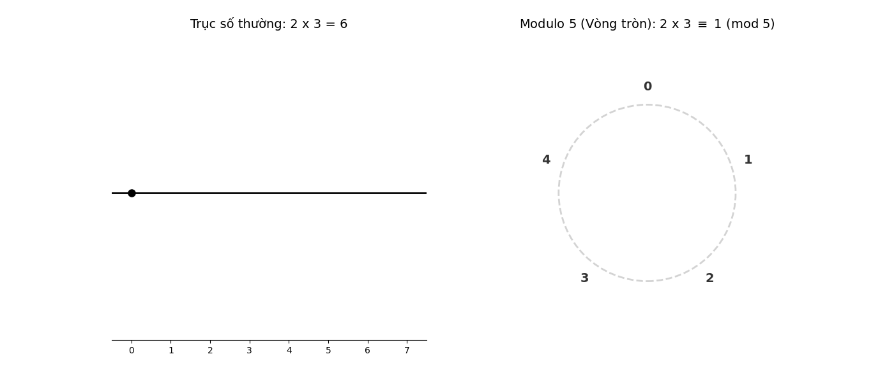

## Mục lục

Nội dung của bài này bao gồm:

- [1. Không gian vector trên trường hữu hạn](#1-không-gian-vector-trên-trường-hữu-hạn)
  - [1.1. Trường hữu hạn](#11-trường-hữu-hạn)
  - [1.2. Không gian vector $\mathbb{F}_2^n$](#12-không-gian-vector-mathbbf_2n)
- [2. Hàm số](#2-hàm-số)
  - [2.1. Tính toán khả nghịch (Reversible Computing)](#21-tính-toán-khả-nghịch-reversible-computing)
  - [2.2. Quantum Oracle ($U_f$)](#22-quantum-oracle-u_f)
- [3. Phase Kickback](#3-phase-kickback)
  - [3.1. Phương trình trị riêng](#31-phương-trình-trị-riêng)
- [4. Thuật toán Deutsch-Jozsa](#4-thuật-toán-deutsch-jozsa)
  - [4.1. Bài toán](#41-bài-toán)
  - [4.2. Thuật toán](#42-thuật-toán)
  - [4.3. Ý nghĩa](#43-ý-nghĩa)
- [5. Giả lập trên Qiskit](#5-giả-lập-trên-qiskit)
- [6. Tham khảo](#6-tham-khảo)

---

Bạn có tin rằng một cỗ máy có thể tìm ra bản chất của một chiếc "hộp đen" chỉ với đúng 1 lần thử, trong khi siêu máy tính mạnh nhất thế giới có thể phải mất hàng triệu năm? Đó không phải khoa học viễn tưởng, đó là Thuật toán Deutsch-Jozsa – thuật toán đầu tiên chứng minh được sự áp đảo tuyệt đối của thế giới lượng tử.

Deutsch-Jozsa là thuật toán đầu tiên và cũng là thuật toán đơn giản nhất trong các thuật toán lượng tử. Tuy nhiên trước khi vào chi tiết thuật toán ta sẽ cần tìm hiểu một vài khái niệm phụ trợ.

## 1. Không gian vector trên trường hữu hạn

### 1.1. Trường hữu hạn

Các vector trong không gian thường được biểu diễn bằng một bộ số (tọa độ) và bản thân các số dùng để biểu diễn tọa độ này được lấy từ một **trường** (field). Trong đại số tuyến tính cơ bản, chúng ta thường mặc định vector được định nghĩa trên trường số thực (vô hạn liên tục) nhưng trong khoa học máy tính hầu như mọi thứ đều rời rạc (không có khái niệm nửa bit) và hữu hạn (số lượng bit máy tính là hữu hạn) vì vậy chúng ta cần làm quen với khái niệm trường hữu hạn.

<div style="background-color: #f8fafc; border-left: 4px solid #3b82f6; padding: 16px; border-radius: 4px; margin: 20px 0;">
  <b>Định nghĩa:</b> Một tập hợp số $F$ được gọi là <b>Trường hữu hạn</b> (Finite Field) nếu nó được trang bị hai phép toán cộng ($+$) và nhân ($\times$) thỏa mãn các tiên đề sau:
</div>

### Đối với phép cộng:


1. **Tính khép kín:** $a + b$ phải nằm trong $F$.  
2. **Tính kết hợp:** $(a + b) + c = a + (b + c)$.  
3. **Tính giao hoán:** $a + b = b + a$.  
4. **Phần tử trung hòa (Số 0):** Tồn tại số $0$ sao cho $a + 0 = a$.  
5. **Phần tử đối:** Với mọi $a$, luôn tồn tại $-a$ sao cho $a + (-a) = 0$.


### Đối với phép nhân:


6. **Tính khép kín:** $a \times b$ phải nằm trong $F$.  
7. **Tính kết hợp và Giao hoán:** Tương tự phép cộng.  
8. **Phần tử đơn vị (Số 1):** Tồn tại số $1$ (khác 0) sao cho $a \times 1 = a$.  
9. **Phần tử nghịch đảo:** Đây là điều kiện "khó" nhất. Với mọi $a \neq 0$, phải tồn tại $a^{-1}$ sao cho $a \times a^{-1} = 1$.


### Sự kết hợp:


* **Tính phân phối:** $a \times (b + c) = ab + ac$.

Trong trường hữu hạn, các phép toán này thường là phép toán modulo (phép lấy dư). Nếu coi toán học thông thường là việc thực hiện phép toán trên một trục thẳng dài vô hạn thì trong toán học modulo các phép toán chỉ thực hiện trên một đường tròn hữu hạn điểm (đi đủ nhiều sẽ quay lại vạch xuất phát).

**Ví dụ:** Ta thực hiện phép toán $2 \times 3 = 2 + 2 + 2 = 6$ (đi 3 bước, mỗi bước 2 đơn vị), đối với tập số nguyên (hoặc thực) ta luôn có thể tìm được một số để biểu diễn kết quả của phép nhân trên. 

Nhưng trong modulo 5 thì $2 \times 3 \equiv 1 \pmod 5$ (cũng đi 3 bước, mỗi bước dài 2 đơn vị, nhưng đi theo vòng tròn). Có thể hình dung phép toán này như hình bên dưới:

<div align="center">



*(Hình 1.1. Biểu diễn phép toán lấy dư)*

</div>

Đây là lý do mà phép cộng trong Modulo được ký hiệu là dấu cộng trong hình tròn ($\oplus$).

Và không phải tập hợp có số lượng phần tử bất kỳ nào cũng làm được trường. Toán học đã chứng minh:

> Một trường hữu hạn chỉ tồn tại nếu số lượng phần tử của nó ($q$) có dạng $p^n$, trong đó $p$ là một **số nguyên tố** và $n$ là một số nguyên dương.

* Nếu $n=1$: Ta có trường nguyên tố $\mathbb{F}_p$ (ví dụ: $\mathbb{F}_2, \mathbb{F}_3, \mathbb{F}_5, \mathbb{F}_7...$).  
* Nếu $n>1$: Ta có trường mở rộng (ví dụ: $\mathbb{F}_4, \mathbb{F}_8, \mathbb{F}_{16}...$).

Hãy xem xét hai tập hợp số dư sau đây để thấy tại sao một cái là trường, cái kia thì không.

**Trường $\mathbb{F}_5$ (Số phần tử là số nguyên tố 5)**

Các phần tử: $\{0, 1, 2, 3, 4\}$. Phép toán: Modulo 5.

* Hãy thử phép chia: $2 \div 3$ tương đương với $2 \times 3^{-1}$.  
* Trong modulo 5, $3 \times 2 = 6 \equiv 1$. Vậy nghịch đảo của $3$ là $2$.  
* Kết quả: $2 \times 2 = 4$. Phép chia thành công! **Đây là một Trường.**

**Tập $\mathbb{Z}_4$ (Số phần tử là 4 - không phải số nguyên tố)**

Các phần tử: $\{0, 1, 2, 3\}$. Phép toán: Modulo 4.

Hãy thử tìm nghịch đảo của $2$: Ta cần tìm số $x$ sao cho $2 \times x \equiv 1 \pmod 4$.

- $2 \times 0 = 0$  
- $2 \times 1 = 2$  
- $2 \times 2 = 4 \equiv 0$  
- $2 \times 3 = 6 \equiv 2$

**Kết quả:** Không có số nào thỏa mãn! Số $2$ không có nghịch đảo, nghĩa là ta không thể thực hiện phép chia cho $2$.

**Kết luận:** $\mathbb{Z}_4$ **không phải là một trường** (nó chỉ là một Vành - Ring). Để có trường 4 phần tử ($\mathbb{F}_4$), ta phải dùng cách định nghĩa phép toán khác phức tạp hơn (đa thức), chứ không dùng modulo 4 thông thường.

### Trường $\mathbb{F}_2$

Trường được sử dụng nhiều nhất trong khoa học máy tính đó chính là trường $\mathbb{F}_2$. Trường hữu hạn $\mathbb{F}_2$ (hay còn gọi là $GF(2)$ - Galois Field of 2 elements) là trường nhỏ nhất và cơ bản nhất trong toán học hiện đại. Nó đóng vai trò nền tảng trong khoa học máy tính, lý thuyết mã hóa và mật mã học.

Trường $\mathbb{F}_2$ chỉ bao gồm hai phần tử: $\{0, 1\}$. Các phép toán cộng và nhân được thực hiện theo **modulo 2**. Trường này có một vài tính chất quan trọng đó là:

* **Tính kết hợp (Associativity)**

$$
(a \oplus b) \oplus c = a \oplus (b \oplus c) \tag{1.1}
$$

Tính chất này cho phép chúng ta thực hiện phép toán trên một chuỗi dữ liệu dài mà không cần quan tâm đến thứ tự ưu tiên của dấu ngoặc. Trong lập trình, điều này giúp tối ưu hóa việc tính toán song song hoặc tính toán theo luồng (streaming).

* **Tính tự triệt tiêu (Self-inverse)**

$$
a \oplus a = 0 \tag{1.2}
$$

Đây là tính chất quan trọng nhất và đặc thù nhất của trường này.

<br />

**Ý nghĩa:** Một phần tử cộng với chính nó luôn bằng phần tử trung hòa (0). Điều này đồng nghĩa với việc mỗi phần tử là nghịch đảo của chính nó.  
**Ứng dụng:** Đây là cơ sở của nhiều thuật toán phục hồi dữ liệu. Ví dụ: Nếu ta có $C = A \oplus B$, ta có thể lấy lại $A$ bằng cách lấy $C \oplus B$ (vì $A \oplus B \oplus B = A \oplus 0 = A$).

<br />

* **Phần tử đơn vị (Identity Element)**

$$
a \oplus 0 = a \tag{1.3}
$$

Trong $\mathbb{F}_2$, số $0$ đóng vai trò là phần tử đơn vị của phép cộng (phép XOR). Bất kỳ giá trị nào XOR với 0 cũng đều giữ nguyên giá trị của chính nó. Điều này tương đương với việc "không thay đổi trạng thái" trong mạch logic.

* **Tính giao hoán (Commutativity)**

Tính chất này khẳng định rằng **thứ tự** của các phần tử trong phép toán không làm thay đổi kết quả. Trong $\mathbb{F}_2$, cả phép cộng (XOR) và phép nhân (AND) đều có tính giao hoán.

- **Giao hoán đối với phép cộng:** 
$$
a \oplus b = b \oplus a \tag{1.4}
$$
  *(Ví dụ: $1 \oplus 0 = 1$ và $0 \oplus 1 = 1$)*

- **Giao hoán đối với phép nhân:** 
$$
a \cdot b = b \cdot a \tag{1.5}
$$
  *(Ví dụ: $1 \cdot 0 = 0$ và $0 \cdot 1 = 0$)*

**Ý nghĩa:** Trong thiết kế vi mạch hoặc lập trình bitwise, ta có thể hoán đổi các luồng dữ liệu đầu vào mà không sợ làm sai lệch kết quả cuối cùng.

* **Tính phân phối (Distributivity)**

$$
a \cdot (b \oplus c) = (a \cdot b) \oplus (a \cdot c) \tag{1.6}
$$

Đây là tính chất quan trọng nhất giúp kết nối phép cộng và phép nhân lại với nhau. Nó cho phép chúng ta "nhân phá ngoặc" tương tự như trong số học thông thường.

### 1.2. Không gian vector $\mathbb{F}_2^n$

Vậy tại sao chúng ta lại cần quan tâm đến khái niệm trường hữu hạn? Đó là bởi vì chúng ta có thể coi trạng thái của một chuỗi $n$ bit trong máy tính giống như một vector trên trường $\mathbb{F}_2^n$, và khi đó chúng ta có thể sử dụng tất cả các tính chất của một không gian vector để giải quyết bài toán.

<div style="background-color: #f8fafc; border-left: 4px solid #3b82f6; padding: 16px; border-radius: 4px; margin: 20px 0;">
  <b>Định nghĩa:</b> Nếu ta có $n$ bit, mỗi bit có 2 khả năng (0 hoặc 1), thì tập hợp tất cả các chuỗi $n$ bit đó chính là không gian vector $n$ chiều trên trường $\mathbb{F}_2$.
</div>

* **Số lượng phần tử:** $2^n$ vector (ví dụ $n=3$ thì có 8 vector từ 000 đến 111).  
* **Ký hiệu:** $\mathbb{F}_2^n$ hoặc $V = \{0, 1\}^n$.

### Phép cộng là "Cộng từng bit" (Bitwise Addition)

Phép cộng hai vector $\vec{u}$ và $\vec{v}$ được thực hiện bằng cách cộng các cặp bit tương ứng tại cùng một vị trí. Vì đây là trường $\mathbb{F}_2$, nên "cộng" ở đây là cộng modulo 2:

* $0 + 0 = 0$  
* $0 + 1 = 1$  
* $1 + 0 = 1$  
* $1 + 1 = 0$ (Đây chính là phép **XOR**).

**Ví dụ:**
$$1011+ 1101=  0110$$  
*(Kết quả của từng vị trí: 1+1=0, 0+1=1, 1+0=1, 1+1=0)*

### Phép nhân là "Nhân từng bit" (Scalar Multiplication)

Trong định nghĩa không gian vector, phép nhân này là **nhân một số vô hướng (scalar)** với một vector. Vì số vô hướng của chúng ta cũng chỉ có thể là $0$ hoặc $1$:

* Nếu nhân với **0**: Tất cả các bit trong vector đều thành $0$.  
* Nếu nhân với **1**: Tất cả các bit giữ nguyên.

Nó thực hiện theo kiểu: $a \cdot (v_1, v_2, \dots, v_n) = (a \cdot v_1, a \cdot v_2, \dots, a \cdot v_n)$. Đây chính là phép **AND** logic giữa số vô hướng và từng bit của vector.

Ta cần phân biệt giữa **Nhân vô hướng** (Scalar Multiplication) và **Tích vô hướng** (Dot Product/Inner Product):

* **Nhân vô hướng:** $1 \cdot (1,0,1) = (1,0,1)$ $\rightarrow$ Kết quả trả về là một **Vector**.  
* **Tích vô hướng:** $(1,1,0) \cdot (1,0,1) = (1\cdot1) \oplus (1\cdot0) \oplus (0\cdot1) = 1 \oplus 0 \oplus 0 = 1$ $\rightarrow$ Kết quả trả về là một **Con số** (0 hoặc 1).

---

## 2. Hàm số

Máy tính lượng tử hay máy tính cổ điển cũng đều được cấu tạo từ các Bit (hoặc Qubit) và các cổng đa năng (cổng AND trong máy tính cổ điển hay cổng Toffoli trong máy tính lượng tử). Vì vậy bất kỳ tác vụ nào cũng phải được chia nhỏ thành các thành phần kể trên, việc biểu diễn một hàm số cũng vậy. 

Việc chuyển đổi các số sang hệ nhị phân là khá đơn giản và phổ biến nhất là chia liên tiếp cho 2.

**Ví dụ:** Chuyển số 13 sang hệ nhị phân.

| Phép chia | Kết quả (Phần nguyên) | Số dư |
| :---: | :---: | :---: |
| 13 ÷ 2 | 6 | **1** (Số cuối cùng) |
| 6 ÷ 2 | 3 | **0** |
| 3 ÷ 2 | 1 | **1** |
| 1 ÷ 2 | 0 | **1** (Số đầu tiên) |

Đọc ngược từ dưới lên, ta được: **1101**. Vậy: $13_{10} = 1101_2$

Sau khi **đại số hóa** hàm số dựa trên các biến bit (0 và 1) ta có thể tiếp tục **chuyển đổi các phép toán** số học (Cộng, Nhân) thành các phép toán logic (**XOR** cho phép cộng, **AND** cho phép nhân).

Ví dụ như phép toán cộng hai số $x,y$ có thể được biểu diễn bằng hàm $f(x,y) = x+y$, trong bài trước tôi đã trình bày cách thực hiện phép toán trên bằng mạch cổ điển.

<div align="center">

![][image2]

*(Hình 1.1. Mạch Half Adder)*

</div>

Và ở bài trước chúng ta cũng đã biết rằng mọi cổng lượng tử có thể được biểu diễn bằng một ma trận vuông. Tuy nhiên trong máy tính cổ điển thì ma trận đặc trưng của các cổng Logic thường là ma trận chữ nhật do số lượng Bit đầu vào và đầu ra khác nhau. Ví dụ ma trận đặc trưng của cổng AND:

$$
M_{AND} = \begin{bmatrix} 1 & 1 & 1 & 0 \\ 0 & 0 & 0 & 1 \end{bmatrix} \tag{2.1}
$$

Hoặc cổng XOR:

$$
M_{XOR} = \begin{bmatrix} 1 & 0 & 0 & 1 \\ 0 & 1 & 1 & 0 \end{bmatrix} \tag{2.2}
$$

Tuy nhiên các ma trận chữ nhật có một vấn đề đó là trong toán học, ma trận chữ nhật đại diện cho một phép ánh xạ **không thể đảo ngược hoàn toàn**. Hay nói cách khác là ta không thể suy ra đầu vào từ kết quả, ví dụ với cổng AND:

- Nếu ta biết đầu ra là $1$, ta biết chắc đầu vào là $11$.  
- Nhưng nếu tôi biết đầu ra là $0$, ta không tài nào biết được đầu vào ban đầu là $00, 01$ hay $10$.

Hay với hàm số $f(x) = x^2$ khi ta thấy $f(x) = 4$ ta không thể biết $x$ ban đầu là 2 hay -2. Đây là một hàm phi tuyến.

**Vậy thông tin đã bị mất.** Trong vật lý nhiệt động lực học (Nguyên lý Landauer), việc mất thông tin này sẽ tỏa ra nhiệt lượng. Tuy hiện tại nhiệt lượng tỏa ra do tính toán trong các thiết bị hiện tại chưa đáng lo nhưng với tốc độ phát triển hiện nay (Định luật Moore) thì chúng ta sẽ sớm gặp phải giới hạn về nhiệt.

### 2.1. Tính toán khả nghịch (Reversible Computing)

Tính toán khả nghịch, đúng như tên gọi của nó, cho phép chúng ta giải quyết vấn đề mất thông tin và tỏa nhiệt của tính toán cổ điển. Trong tính toán khả nghịch:

- Số lượng bit đầu vào **phải bằng** số lượng bit đầu ra.  
- Mỗi trạng thái đầu vào tương ứng với một và chỉ một trạng thái đầu ra (ánh xạ 1-1).  
- Ta luôn có thể suy ngược từ đầu ra để tìm lại chính xác đầu vào ban đầu.

Vậy làm sao để "ép" một hàm phi tuyến thành khả nghịch?

Để biến một hàm số $f(x)$ bất kỳ (vốn là ma trận chữ nhật, không khả nghịch) thành một hệ thống khả nghịch, các nhà khoa học máy tính dùng một kỹ thuật gọi là **Nhúng (Embedding)**.

Thay vì chỉ tính $f(x)$, họ thiết kế một hệ thống nhận vào $(x, y)$ và trả về $(x, y \oplus f(x))$ (với $\oplus$ là phép cộng modulo 2).

* $x$ được giữ lại làm "chứng cứ" để quay về.  
* $y$ là một "thanh ghi nháp" để chứa kết quả.

Dùng các tính chất của trường $\mathbb{F}_2$ đã học phía trên, ta dễ dàng chứng minh tính khả nghịch của nó.

**Chứng minh:**

Để chứng minh một hệ thống (hay một hàm số) là khả nghịch, cách đơn giản nhất là chỉ ra rằng tồn tại một hàm ngược, hoặc chứng minh rằng nếu ta áp dụng phép toán đó **hai lần liên tiếp**, ta sẽ quay trở lại trạng thái ban đầu.

Gọi phép biến đổi hệ thống là một hàm $g$ tác động lên cặp $(x, y)$:

$$
g(x, y) = (x, y \oplus f(x)) \tag{2.3}
$$

Trong đó:
* $x$: Thanh ghi đầu vào (không thay đổi).  
* $y$: Thanh ghi mục tiêu (chứa kết quả).  
* $f(x)$: Một hàm số bất kỳ (có thể phi tuyến, không khả nghịch).

**Thực hiện phép toán hai lần**

Giả sử ta lấy kết quả của lần biến đổi thứ nhất làm đầu vào cho lần biến đổi thứ hai.

* **Lần 1:** $(x, y) \xrightarrow{g} (x, y')$ với $y' = y \oplus f(x)$  
* **Lần 2:** $(x, y') \xrightarrow{g} (x, y'')$ với $y'' = y' \oplus f(x)$

Bây giờ, ta thay giá trị $y'$ từ lần 1 vào phương trình của lần 2:

$$
y'' = (y \oplus f(x)) \oplus f(x) \tag{2.4}
$$

**Sử dụng tính chất của phép XOR ($\oplus$)**

Dựa trên các tính chất của trường $\mathbb{F}_2$ mà chúng ta đã thảo luận:
- **Tính kết hợp:** $(a \oplus b) \oplus c = a \oplus (b \oplus c)$  
- **Tính tự triệt tiêu:** $a \oplus a = 0$  
- **Phần tử đơn vị:** $a \oplus 0 = a$

Áp dụng vào phương trình $(2.4)$:

$$
y'' = y \oplus (f(x) \oplus f(x))
$$  
$$
y'' = y \oplus 0
$$  
$$
y'' = y
$$

Vậy việc áp dụng hai lần toán tử chúng ta đã tìm lại được đầu vào. Điều cực kỳ thú vị ở đây là dù $f(x)$ là một hàm "phá hủy thông tin" (như cổng AND, hay một hàm phi tuyến như $f(x) = x^2$), việc chúng ta giữ nguyên giá trị $x$ ở thanh ghi thứ nhất đóng vai trò như một "bản sao lưu" dữ liệu. Phép XOR ở thanh ghi thứ hai cho phép chúng ta "mở" và "đóng" kết quả mà không làm mất đi dấu vết của trạng thái ban đầu.

Và vì số lượng bit đầu vào và đầu ra là bằng nhau cho nên ma trận đặc trưng của phép biến đổi này là ma trận vuông. Và nếu bạn đọc còn nhớ ở “Bài 2: Quantum Gate” chúng ta đã thảo luận về cách giả lập cổng Toffoli làm một mạch cộng thì ma trận đặc trưng của nó chính là một ma trận vuông.

### 2.2. Quantum Oracle ($U_f$)

Nếu tính toán khả nghịch chỉ là một phương pháp thay thế tính toán cổ điển để giải quyết vấn đề về nhiệt và nghịch đảo của ma trận thì trong điện toán lượng tử mọi quá trình tiến hóa trạng thái (ngoại trừ phép đo) đều phải có khả năng đảo ngược, do đó các hàm số hay các cổng **bắt buộc** phải bảo toàn thông tin (tính Unitary).

Vì vậy việc sử dụng toán tử $(2.3)$ là bắt buộc để mô tả một hàm số bất kỳ. Trong điện toán lượng tử, ta gọi các toán tử này là **Toán tử tiên tri (Quantum Oracle)** và ký hiệu nó là $U_f$.

Có thể hiểu $U_f$ là một hộp đen được thiết kế bằng các cổng lượng tử một cách phù hợp để mô tả hành vi của một hàm số $f(x)$ nào đó, nó nhận hai thanh ghi đầu vào $|x\rangle | y \rangle$ và trả về kết quả $|x \rangle, |y \oplus f(x) \rangle$.

#### Công thức Oracle

$$
U_f |x\rangle |y\rangle = |x\rangle |y \oplus f(x)\rangle \tag{2.5}
$$

Hãy cùng xem toán tử $U_f$ của một hàm số đơn giản như sau:
- $f(x) = 1$ nếu $x = 11$ (số 3 trong hệ thập phân).  
- $f(x) = 0$ cho các trường hợp còn lại.

Với hàm số $f(x)$ ta đã định nghĩa:
- $f(00) = 0$  
- $f(01) = 0$  
- $f(10) = 0$  
- $f(11) = 1$

Toán tử $U_f$ tác động lên hệ thống gồm 3 qubit: 2 qubit đầu vào ($|x\rangle$) và 1 qubit đầu ra ($|y\rangle$). Ma trận đặc trưng của nó sẽ có kích thước $8 \times 8$ ($2^3 = 8$).

#### Phân tích các trạng thái cơ sở

Toán tử thực hiện phép biến đổi: $U_f |x\rangle |y\rangle = |x\rangle |y \oplus f(x)\rangle$.

Thứ tự các trạng thái cơ sở $|x_1 x_0 y\rangle$:
1. $|000\rangle \xrightarrow{f(00)=0} |00, 0 \oplus 0\rangle = |000\rangle$ (Giữ nguyên)  
2. $|001\rangle \xrightarrow{f(00)=0} |00, 1 \oplus 0\rangle = |001\rangle$ (Giữ nguyên)  
3. $|010\rangle \xrightarrow{f(01)=0} |01, 0 \oplus 0\rangle = |010\rangle$ (Giữ nguyên)  
4. $|011\rangle \xrightarrow{f(01)=0} |01, 1 \oplus 0\rangle = |011\rangle$ (Giữ nguyên)  
5. $|100\rangle \xrightarrow{f(10)=0} |10, 0 \oplus 0\rangle = |100\rangle$ (Giữ nguyên)  
6. $|101\rangle \xrightarrow{f(10)=0} |10, 1 \oplus 0\rangle = |101\rangle$ (Giữ nguyên)  
7. $|110\rangle \xrightarrow{f(11)=1} |11, 0 \oplus 1\rangle = |111\rangle$ (Hoán đổi)  
8. $|111\rangle \xrightarrow{f(11)=1} |11, 1 \oplus 1\rangle = |110\rangle$ (Hoán đổi)

<br />

#### Ma trận $U_f$ ($8 \times 8$)

Ma trận này gần giống với ma trận đơn vị, ngoại trừ khối $2 \times 2$ cuối cùng tương ứng với trạng thái $|110\rangle$ và $|111\rangle$ bị hoán đổi (tương tự cổng Pauli-X):

$$
U_f = \begin{bmatrix} 1 & 0 & 0 & 0 & 0 & 0 & 0 & 0 \\ 0 & 1 & 0 & 0 & 0 & 0 & 0 & 0 \\ 0 & 0 & 1 & 0 & 0 & 0 & 0 & 0 \\ 0 & 0 & 0 & 1 & 0 & 0 & 0 & 0 \\ 0 & 0 & 0 & 0 & 1 & 0 & 0 & 0 \\ 0 & 0 & 0 & 0 & 0 & 1 & 0 & 0 \\ 0 & 0 & 0 & 0 & 0 & 0 & 0 & 1 \\ 0 & 0 & 0 & 0 & 0 & 0 & 1 & 0 \end{bmatrix}
$$

#### Biểu diễn trên mạch

<div align="center">

![][image3]
*(Hình 2.1. Biểu diễn mạch lượng tử của hàm số)* 
</div>

Và nếu các bạn để ý thì hàm số này chính là cổng Toffoli mà chúng ta đã học, hay nói cách khác mạch lượng tử của hàm số này có thể được thiết kế bằng một cổng Toffoli duy nhất.

Có một tính chất rất đặc biệt của $U_f$ đó là mọi hàm số $f$ đều có thể được biểu diễn bởi một ma trận đặc trưng $U_f$. Điều này có nghĩa là dù $f(x)$ có phức tạp hay "phi tuyến" đến đâu (ví dụ: $f(x) = x_1 \cdot x_2 \oplus x_3$), thì trong điện toán lượng tử, $U_f$ **luôn luôn là một ma trận tuyến tính**.

Nếu $f(x)$ là **phi tuyến** trên $\mathbb{F}_2$ (ví dụ chứa các phép nhân bit $x_i x_j$): Ma trận $U_f$ vẫn là ma trận tuyến tính, nhưng cấu trúc của nó sẽ "rắc rối" hơn, các vị trí của con số $1$ trong ma trận hoán vị sẽ không tuân theo một quy luật tịnh tiến đơn giản.


## 3. Phase Kickback

**Phase Kickback** (Phản hồi pha) là một trong những kỹ thuật quan trọng và "kỳ diệu" nhất trong điện toán lượng tử. Đây là cơ chế cho phép thông tin từ một qubit đích (target qubit) chuyển ngược lại vào pha của qubit điều khiển (control qubit).

Đây là nền tảng cốt lõi của nhiều thuật toán lượng tử nổi tiếng như Deutsch-Jozsa, Ước lượng Pha (Quantum Phase Estimation - QPE), và thuật toán Grover.

Trước khi đi vào cơ chế hoạt động của Phase Kickback, ta cần phải hiểu rõ về phương trình trị riêng trong đại số tuyến tính.

### 3.1. Phương trình trị riêng

Như chúng ta đã biết thì với mỗi ma trận vuông khả nghịch thì luôn tồn tại một số vector đặc biệt (**vector riêng**) mà khi ta áp dụng ma trận lên chúng thì vector đầu ra không bị thay đổi về hướng mà chỉ co giãn (độ co giãn này gọi là **trị riêng**). 

Hay ta nói, nếu $|u\rangle$ là một **trạng thái riêng** (eigenstate) của toán tử $U$ với trị riêng (eigenvalue) là $e^{i\phi}$ thì:

$$
U|u\rangle = e^{i\phi}|u\rangle \tag{3.1}
$$

*(Tôi sẽ giải thích tại sao chúng ta lại viết trị riêng là $e^{i\phi}$ sau).*

**Ví dụ:** chúng ta hãy lấy một ví dụ đơn giản với U là cổng NOT (hay còn gọi là Pauli-X), cổng này sẽ lật Qubit của chúng ta và ma trận đặc trưng của nó có dạng:

$$
X = \begin{pmatrix} 0 & 1 \\ 1 & 0 \end{pmatrix} \tag{3.2}
$$

Ma trận này có hai vector riêng tương ứng với hai trạng thái $|+ \rangle , |-\rangle$. Nếu ta áp dụng cổng X lên một Qubit đang trong trạng thái $|- \rangle$ ta sẽ được:

$$
X|-\rangle = -1 \cdot |-\rangle
$$

Như chúng ta đã thấy thì sau khi áp dụng X thì vector trạng thái của Qubit vẫn là $|- \rangle$, nếu ta thực hiện đo trên trạng thái này (dù trong bất kỳ cơ sở nào) thì kết quả sẽ giống hệt trước khi áp dụng X.

Và có một điều đặc biệt đó là giá trị $-1$ này chính là $e^{i\pi}$, và pha $\pi$ (180°) này chính là một pha toàn cục (Global Phase). Chúng ta đã biết rằng pha toàn cục không ảnh hưởng đến kết quả đo của một hệ, tuy nhiên nó lại vô cùng quan trọng nếu như ta xét hệ này trong mối tương quan với một hệ lớn hơn.

Cụ thể nếu chọn một Qubit khác làm Control Qubit và ta chỉ áp dụng X lên Target Qubit nếu Control Qubit là 1, khi đó ma trận đặc trưng của toán tử CU (Controlled-U) này sẽ có dạng:

$$
CU = \begin{pmatrix} 1 & 0 & 0 & 0 \\ 0 & 1 & 0 & 0 \\ 0 & 0 & 0 & 1 \\ 0 & 0 & 1 & 0 \end{pmatrix}
$$

Nếu chúng ta còn nhớ thì đây chính là ma trận đặc trưng của cổng CNOT mà chúng ta đã làm quen ở bài 2. Có một điều rất thú vị là nếu ta đặt trạng thái của Control Qubit là $|+ \rangle$ và Target Qubit là $|- \rangle$, hay:

$$
|\psi_{in}\rangle = |+\rangle|-\rangle = \frac{1}{\sqrt{2}}(|0\rangle|-\rangle + |1\rangle|-\rangle)
$$

Sau đó áp dụng CNOT:

$$
\begin{aligned}
CNOT |\psi_{in}\rangle &= \frac{1}{\sqrt{2}} \left( 1 \cdot |0\rangle|-\rangle + (-1) \cdot |1\rangle|-\rangle \right) \\
&= \left( \frac{|0\rangle - |1\rangle}{\sqrt{2}} \right) \otimes |-\rangle = |-\rangle|-\rangle
\end{aligned}
$$

Nếu bạn đọc để ý thì trạng thái của Qubit mục tiêu sau khi áp dụng CNOT không hề thay đổi (vẫn là $|- \rangle$) trong khi Qubit điều khiển lại bị đổi từ $|+ \rangle$ sang $|- \rangle$.

Ở đây Qubit điều khiển không những không thay đổi trạng thái của Qubit mục tiêu mà chính nó còn bị thay đổi. Và nếu chúng ta xem xét cẩn thận hơn thì dường như Qubit điều khiển bị xoay đúng 180 độ (Global Phase mà chúng ta đã đề cập phía trên). Đây chính là lý do mà ta gọi kỹ thuật này là **Phase Kickback** (Qubit mục tiêu đá ngược pha trở lại Qubit điều khiển).

Nói chung Phase Kickback sẽ xảy ra nếu Qubit mục tiêu đang ở trong một vài trạng thái đặc biệt (vector riêng). Đến đây chúng ta đã chuẩn bị đủ kiến thức để vào phần quan trọng nhất của bài này đó là Thuật toán Deutsch-Jozsa.

---

## 4. Thuật toán Deutsch-Jozsa

Thuật toán **Deutsch-Jozsa** (được đề xuất bởi David Deutsch và Richard Jozsa vào năm 1992) là một trong những cột mốc quan trọng nhất của điện toán lượng tử. Đây là thuật toán đầu tiên chứng minh được rằng một máy tính lượng tử có thể giải quyết một bài toán cụ thể nhanh hơn đáng kể so với bất kỳ máy tính cổ điển nào. Trước tiên chúng ta hãy đi vào chi tiết bài toán.

### 4.1. Bài toán

Giả sử ta có một hàm số "hộp đen" (được gọi là **Oracle**) ký hiệu là $f$. Hàm này nhận đầu vào là một chuỗi nhị phân độ dài $n$ và trả về kết quả là $0$ hoặc $1$:

$$
f: \{0, 1\}^n \rightarrow \{0, 1\} \tag{4.1}
$$

Chúng ta được đảm bảo rằng hàm $f$ chỉ có thể thuộc một trong hai loại sau:

* **Hàm hằng (Constant):** Kết quả của hàm luôn giống nhau cho mọi đầu vào. Nghĩa là tất cả đầu vào đều cho ra $0$, hoặc tất cả đều cho ra $1$.  
* **Hàm cân bằng (Balanced):** Kết quả của hàm trả về $0$ cho đúng một nửa số lượng đầu vào khả thi, và trả về $1$ cho nửa còn lại.

> **Nhiệm vụ:** Xác định xem $f$ là **hằng** hay **cân bằng** bằng cách thực hiện ít lần gọi hàm (truy vấn) nhất có thể.

Đầu tiên ta xem xét một hàm cân bằng và xem thuật toán cổ điển sẽ xử lý như thế nào.

**Ví dụ 1:** Ta có đầu vào là một chuỗi 3 bit. Hộp đen của chúng ta sẽ trả về 1 nếu chuỗi ban đầu là số chẵn và 0 nếu chuỗi ban đầu là số lẻ.

#### Phân tích không gian đầu vào

Với chuỗi 3 bit ($n = 3$), chúng ta có tổng cộng $2^3 = 8$ giá trị đầu vào khả thi trong hệ nhị phân, tương ứng với các số thập phân từ $0$ đến $7$:

* **Tập hợp đầu vào:** $S = \{000, 001, 010, 011, 100, 101, 110, 111\}$

#### Kiểm tra điều kiện cân bằng

Một hàm số được gọi là cân bằng nếu số lượng đầu vào cho ra kết quả $0$ đúng bằng số lượng đầu vào cho ra kết quả $1$.

* **Các số chẵn ($f(x) = 1$):** $\{0, 2, 4, 6\}$ $\rightarrow$ Có **4** giá trị.  
* **Các số lẻ ($f(x) = 0$):** $\{1, 3, 5, 7\}$ $\rightarrow$ Có **4** giá trị.

Vì số lượng kết quả $0$ ($4$) bằng số lượng kết quả $1$ ($4$), và mỗi nhóm chiếm đúng một nửa tổng số đầu vào ($4/8 = 50\%$), nên hàm số này thỏa mãn định nghĩa là một **hàm cân bằng**.

#### Cách tiếp cận cổ điển

Ta sẽ phải kiểm tra ít nhất 5 số ($2^{3-1} + 1$). Ví dụ, nếu ta kiểm tra $0, 2, 4, 6$ và tất cả đều ra $1$, ta vẫn chưa biết chắc nó là hàm hằng (tất cả là $1$) hay hàm cân bằng. Ta buộc phải kiểm tra số thứ 5 (số $1$) để xác nhận.

Nói chung để đưa ra kết luận chính xác về hàm số trong hộp đen thì ta cần truy vấn đến hộp đen ít nhất:

$$
2^{n-1} + 1
$$

Trong đó $n$ là số lượng bit đầu vào. Ta dễ dàng nhận thấy rằng khi số lượng bit đầu vào tăng lên thì khối lượng tính toán của chúng ta sẽ tăng theo hàm mũ (mỗi khi tăng thêm 1 bit đầu vào thì khối lượng tính toán lại tăng gấp đôi). Theo lý thuyết về độ phức tạp tính toán thì thuật toán cổ điển trên có độ phức tạp $O(2^n)$.

Tuy nhiên với máy tính lượng tử sử dụng thuật toán Deutsch-Jozsa thì ta chỉ cần một lần truy vấn duy nhất đến hộp đen bất kể số lượng bit đầu vào. Hãy xem thuật toán này hoạt động như thế nào.

### 4.2. Thuật toán

#### Bước 0: Khởi tạo

<br />

Như đã đề cập phía trên, mỗi mạch lượng tử sẽ gồm 2 thanh ghi, một để lưu trữ $n$ Qubit đầu vào và một để lưu trữ kết quả. Trong thuật toán của chúng ta đầu ra chỉ có thể nhận một trong hai giá trị (0 hoặc 1) nên ta chỉ cần thêm 1 Qubit để lưu kết quả (gọi là Ancilla Qubit), vậy ta có thể viết trạng thái ban đầu của hệ thống như sau:

$$
|\psi_0\rangle = |0\rangle^{\otimes n} |1\rangle \tag{4.2}
$$

Trong đó ngoài Ancilla Qubit được đặt ở trạng thái $|1 \rangle$ thì tất cả Qubit còn lại được đặt ở trạng thái $|0 \rangle$.

#### Bước 1: Tạo chồng chập

<br />

Áp dụng cổng Hadamard lên tất cả Qubit. Sau khi các Qubit đi qua các cổng $H$, $n$ qubit đầu trở thành sự chồng chập của tất cả $2^n$ trạng thái khả thi, còn qubit bổ trợ chuyển sang trạng thái $|-\rangle$:

$$
|\psi_1\rangle = \left( \frac{1}{\sqrt{2^n}} \sum_{x \in \{0,1\}^n} |x\rangle \right) \otimes \left( \frac{|0\rangle - |1\rangle}{\sqrt{2}} \right) \tag{4.3}
$$

#### Bước 2: Truy vấn hộp đen ($U_f$)

Đây là phần quan trọng nhất. Oracle $U_f$ thực hiện phép biến đổi: $U_f |x\rangle |y\rangle = |x\rangle |y \oplus f(x)\rangle$. Khi qubit thứ hai ở trạng thái $|-\rangle$, ta có hiện tượng **Phase Kickback**:

- Nếu $f(x) = 0$: $U_f |x\rangle |-\rangle = |x\rangle |-\rangle$  
- Nếu $f(x) = 1$: $U_f |x\rangle |-\rangle = -|x\rangle |-\rangle$

Tổng quát: $U_f |x\rangle |-\rangle = (-1)^{f(x)} |x\rangle |-\rangle$.

Lúc này, giá trị của hàm số $f(x)$ đã được "đẩy" lên làm **pha** của trạng thái:

$$
|\psi_2\rangle = \frac{1}{\sqrt{2^n}} \sum_{x} (-1)^{f(x)} |x\rangle \otimes |-\rangle \tag{4.4}
$$

#### Bước 3: Áp dụng Hadamard lần hai

Ở bước này ta chỉ áp dụng Hadamard lên $n$ Qubit đầu vào, nhưng trước hết chúng ta cần nghiên cứu về công thức tổng quát khi áp dụng Hadamard lên một trạng thái $|x \rangle$ sẽ có dạng như thế nào.

Để đơn giản ta sẽ xét trường hợp $|x \rangle$ chỉ có 1 Qubit, khi đó $|x \rangle$ chỉ tồn tại ở một trong hai trạng thái cơ sở $|0 \rangle$ hoặc $|1 \rangle$. Hãy nhìn vào tác động của cổng Hadamard ($H$) lên các trạng thái này:

- $H|0\rangle = \frac{1}{\sqrt{2}}(|0\rangle + |1\rangle)$  
- $H|1\rangle = \frac{1}{\sqrt{2}}(|0\rangle - |1\rangle)$

Ta có thể viết gọn hai biểu thức này thành một công thức tổng quát cho $x \in \{0, 1\}$:

$$
H|x\rangle = \frac{1}{\sqrt{2}} \sum_{z \in \{0,1\}} (-1)^{xz} |z\rangle \tag{4.5}
$$

**Giải thích:**
- Nếu $x=0$: $(-1)^{0 \cdot z}$ luôn bằng $1$, ta được $\frac{1}{\sqrt{2}}(|0\rangle + |1\rangle)$.  
- Nếu $x=1$: Khi $z=0$, $(-1)^0 = 1$; khi $z=1$, $(-1)^1 = -1$, ta được $\frac{1}{\sqrt{2}}(|0\rangle - |1\rangle)$.

**Mở rộng ra $n$ Qubit:**
Khi áp dụng $H$ cho $n$ qubit song song ($H^{\otimes n}$), chúng ta đang thực hiện phép nhân Tensor. Giả sử ta có chuỗi bit $x = x_1 x_2 ... x_n$.

$$
H^{\otimes n} |x_1 x_2 ... x_n\rangle = (H|x_1\rangle) \otimes (H|x_2\rangle) \otimes \dots \otimes (H|x_n\rangle) \tag{4.6}
$$

Thay công thức 1 qubit ở trên vào từng vị trí:

$$
H^{\otimes n} |x\rangle = \left( \frac{1}{\sqrt{2}} \sum_{z_1} (-1)^{x_1 z_1} |z_1\rangle \right) \otimes \dots \otimes \left( \frac{1}{\sqrt{2}} \sum_{z_n} (-1)^{x_n z_n} |z_n\rangle \right) \tag{4.7}
$$

Khi nhân tất cả các dấu $\sum$ lại với nhau, chúng ta sẽ có một tổng của tất cả các chuỗi bit $z = z_1 z_2 \dots z_n$ có thể có (tổng cộng $2^n$ trạng thái). Khi nhân các số hạng $(-1)^{x_i z_i}$ với nhau, theo quy tắc lũy thừa:

$$
(-1)^{x_1 z_1} \cdot (-1)^{x_2 z_2} \dots (-1)^{x_n z_n} = (-1)^{x_1 z_1 + x_2 z_2 + \dots + x_n z_n} \tag{4.8}
$$

Phần mũ $x_1 z_1 + x_2 z_2 + \dots + x_n z_n$ chính là định nghĩa của **tích vô hướng bitwise** ($x \cdot z$).

- Nếu $x \cdot z$ là số chẵn: Pha là $(-1)^{\text{even}} = +1$.  
- Nếu $x \cdot z$ là số lẻ: Pha là $(-1)^{\text{odd}} = -1$.

Vì vậy, công thức thu gọn cuối cùng là:

$$
H^{\otimes n} |x\rangle = \frac{1}{\sqrt{2^n}} \sum_{z \in \{0,1\}^n} (-1)^{x \cdot z} |z\rangle \tag{4.9}
$$

Thay công thức $(4.9)$ vào trạng thái $\psi_2$ ta sẽ thu được trạng thái cuối cùng trước khi đo (bỏ qua qubit bổ trợ) là:

$$
|\psi_3\rangle = \frac{1}{2^n} \sum_{z} \left( \sum_{x} (-1)^{f(x) + x \cdot z} \right) |z\rangle \tag{4.10}
$$

#### Bước 4: Đọc kết quả đo

Chúng ta chỉ quan tâm đến xác suất đo được chuỗi toàn số không: $|0\rangle^{\otimes n}$ (tức là $z = 0$).

Từ $(4.10)$ ta dễ thấy rằng biên độ xác suất của trạng thái $|00...0\rangle$ là:

$$
C_{0} = \frac{1}{2^n} \sum_{x} (-1)^{f(x)} \tag{4.11}
$$

Ở đây ta sẽ có hai trường hợp.

#### Trường hợp 1: $f(x)$ là hàm hằng (Constant)

- Nếu $f(x) = 0$ với mọi $x$, thì $C_0 = \frac{1}{2^n} \sum (1) = 1$.  
- Nếu $f(x) = 1$ với mọi $x$, thì $C_0 = \frac{1}{2^n} \sum (-1) = -1$.

**Kết luận:** Xác suất đo được $|0\rangle^{\otimes n}$ là $|C_0|^2 = 1$. Điều này có nghĩa là nếu máy đo hiện ra toàn số 0, hàm $f$ của chúng ta là hàm **hằng**.

#### Trường hợp 2: $f(x)$ là hàm cân bằng (Balanced)


Vì $f(x)$ bằng 0 cho một nửa số $x$ và bằng 1 cho nửa còn lại, nên các số hạng $(-1)^0=1$ và $(-1)^1=-1$ trong tổng $\sum (-1)^{f(x)}$ sẽ triệt tiêu nhau hoàn toàn hay $C_0 = 0$.

**Kết luận:** Xác suất đo được $|0\rangle^{\otimes n}$ bằng 0. Nếu máy hiện ra bất kỳ chuỗi nào khác (ít nhất một bit là 1), hàm là **cân bằng**.

### 4.3. Ý nghĩa

Ta thấy rằng với máy tính lượng tử ta chỉ cần truy vấn đến hộp đen Oracle đúng 1 lần cho dù số lượng bit đầu vào có là bao nhiêu hay ta nói độ phức tạp của nó là $O(1)$.

Điểm đặc biệt của thuật toán này đó là nó không đi tìm giá trị cụ thể của $f(x)$ cho từng $x$. Thay vào đó, nó sử dụng sự giao thoa để các trường hợp của hàm cân bằng **tự triệt tiêu lẫn nhau** ở trạng thái $|0\rangle^{\otimes n}$.

Máy tính lượng tử không "thử từng trường hợp một cách nhanh chóng", mà nó bắt tất cả các khả năng phải tương tác với nhau để kết quả cuối cùng chỉ hiển thị đặc tính chung của toàn bộ tập dữ liệu.

---

## 5. Giả lập trên Qiskit

Chúng ta sẽ cùng chạy thuật toán cho hàm số chẵn lẻ mà ta đã nêu ở Ví dụ 1 phía trên trước khi kết thúc bài học. Trước tiên ta sẽ thiết kế mạch:

```python
from qiskit import QuantumCircuit

# Khởi tạo n = 3 qubit đầu vào
n = 3

# Tạo mạch lượng tử với (n+1) qubit và n bit cổ điển để lưu kết quả đo
# Qubit 0, 1, 2 là đầu vào. Qubit 3 là ancilla.
qc = QuantumCircuit(n + 1, n)

# ==========================================
# BƯỚC 1: KHỞI TẠO
# ==========================================
# Đưa qubit bổ trợ (ancilla - qubit số 3) về trạng thái |1>
qc.x(n)
qc.barrier() # Thêm barrier để dễ nhìn mạch chia theo từng giai đoạn

# ==========================================
# BƯỚC 2: TẠO CHỒNG CHẬP (SUPERPOSITION)
# ==========================================
# Áp dụng cổng Hadamard (H) lên tất cả các qubit
for i in range(n + 1):
    qc.h(i)
qc.barrier()

# ==========================================
# BƯỚC 3: ORACLE (HỘP ĐEN) - Hàm Cân Bằng
# ==========================================
# Cài đặt hàm: f(x) = 1 nếu x chẵn (bit cuối cùng = 0), f(x) = 0 nếu x lẻ (bit cuối cùng = 1).
# Trong Qiskit, qubit 0 (q_0) đại diện cho bit ít quan trọng nhất (Least Significant Bit).
# Để mô phỏng f(x) này, ta lật ancilla, sau đó đặt một cổng CNOT điều khiển bởi q_0 tác động lên ancilla.
qc.x(n)
qc.cx(0, n)
qc.barrier()

# ==========================================
# BƯỚC 4: GIAO THOA (INTERFERENCE)
# ==========================================
# Áp dụng lại cổng Hadamard lên n qubit đầu vào
for i in range(n):
    qc.h(i)
qc.barrier()

# ==========================================
# BƯỚC 5: ĐO ĐẠC
# ==========================================
# Đo 3 qubit đầu tiên và lưu kết quả vào 3 bit cổ điển
for i in range(n):
    qc.measure(i, i)

# ==========================================
# VẼ MẠCH
# ==========================================
qc.draw('mpl')
```

Kết quả vẽ mạch:

<div align="center">

![][image4]

*(Hình 5.1. Mạch lượng tử mô tả thuật toán Deutsch-Jozsa)*

</div>

Ta sẽ chạy giả lập 1024 lần để xem kết quả:

```python
from qiskit import transpile
from qiskit_aer import AerSimulator

# ==========================================
# THỰC THI THUẬT TOÁN TRÊN SIMULATOR
# ==========================================
# Khởi tạo máy ảo mô phỏng lượng tử
simulator = AerSimulator()

# Biên dịch mạch lượng tử cho máy ảo
compiled_circuit = transpile(qc, simulator)

# Chạy thuật toán 1024 lần (shots) để lấy phân bố xác suất
job = simulator.run(compiled_circuit, shots=1024)
result = job.result()

# Lấy kết quả thống kê
counts = result.get_counts(compiled_circuit)
print("Kết quả đo đạc sau 1024 lần chạy:", counts)
```

Kết quả sẽ là:

```text
Kết quả đo đạc sau 1024 lần chạy: {'001': 1024}
```

**Vì sao kết quả lại là `001`?** Vì hàm $f(x)$ của chúng ta kiểm tra tính chẵn lẻ dựa trên bit cuối cùng (trong Qiskit được biểu diễn ở $q_0$), nên Oracle chỉ áp dụng cổng CNOT với Control là $q_0$ và Target là Ancilla. Điều này dẫn đến việc chỉ có $q_0$ bị hiệu ứng Phase Kickback tác động làm đảo pha từ $|+\rangle$ thành $|-\rangle$. Hai Qubit còn lại ($q_1, q_2$) không bị ảnh hưởng và vẫn giữ nguyên trạng thái $|+\rangle$. 

Khi đi qua dàn cổng Hadamard cuối cùng, trạng thái $|-\rangle$ của $q_0$ biến thành $|1\rangle$, trong khi trạng thái $|+\rangle$ của $q_1, q_2$ biến về $|0\rangle$. Do Qiskit luôn đọc kết quả ngược từ dưới lên trên ($q_2 q_1 q_0$), kết quả hiển thị cuối cùng là `001`. 

> *Lưu ý: Ở đoạn code phía trên tôi chạy thuật toán trên mạch 1024 lần để lấy phân bổ xác suất của các kết quả đo, nhưng thực tế để kết luận hàm hằng hay hàm cân bằng ta chỉ cần thực hiện đúng một lần (vì cả 1024 lần đo đều không lần nào có kết quả “000”).*

---

## 6. Tham khảo

**Tiếng Anh**

1. N. D. Mermin, *Quantum Computer Science: An Introduction*. (Sách này giải thích rất dễ hiểu về Phase Kickback).  
2. M. A. Nielsen và I. L. Chuang, *Quantum Computation and Quantum Information*. (Bách khoa toàn thư của ngành).

[image1]: <data:image/png;base64,iVBORw0KGgoAAAANSUhEUgAAAnAAAAEMCAMAAABzxXu2AAADAFBMVEX////+/v79/f38/Pz7+/v6+vr5+fn4+Pj39/f29vb19fX09PTz8/Py8vLx8fHw8PDv7+/u7u7t7e3s7Ozr6+vq6urp6eno6Ojn5+fm5ubl5eXk5OTj4+Pi4uLh4eHg4ODf39/e3t7d3d3c3Nzb29va2trZ2dnY2NjX19fW1tbV1dXU1NTT09PS0tLR0dHQ0NDPz8/Ozs7Nzc3MzMzLy8vKysrJycnIyMjHx8fGxsbFxcXExMTDw8PCwsLBwcHAwMC/v7++vr69vb28vLy7u7u6urq5ubm4uLi3t7e2tra1tbW0tLSzs7OysrKxsbGwsLCvr6+urq6tra2srKyrq6uqqqqpqamoqKinp6empqalpaWkpKSjo6OioqKhoaGgoKCfn5+enp6dnZ2cnJybm5uampqZmZmYmJiXl5eWlpaVlZWUlJSTk5OSkpKRkZGQkJCPj4+Ojo6NjY2MjIyKioqJiYmIiIiHh4eGhoaFhYWEhISDg4OCgoKBgYGAgIB/f39+fn59fX18fHx7e3t6enp5eXl4eHh3d3d2dnZ1dXV0dHRzc3NycnJxcXFwcHBvb29ubm5tbW1sbGxra2tqamppaWloaGhnZ2dmZmZlZWVkZGRjY2NiYmJhYWFgYGBfX19eXl5dXV1cXFxbW1taWlpZWVlYWFhXV1dWVlZVVVVUVFRTU1NSUlJRUVFQUFBPT09OTk5NTU1MTExLS0tKSkpJSUlISEhHR0dGRkZFRUVERERDQ0NCQkJBQUFAQEA/Pz8+Pj49PT08PDw7Ozs6Ojo5OTk4ODg3Nzc2NjY1NTU0NDQzMzMyMjIxMTEwMDAvLy8uLi4tLS0sLCwrKysqKiopKSkoKCgnJycmJiYlJSUkJCQjIyMiIiIhISEgICAfHx8eHh4dHR0cHBwbGxsaGhoZGRkYGBgXFxcWFhYVFRUUFBQTExMSEhIREREQEBAPDw8ODg4NDQ0MDAwLCwsKCgoJCQkICAgHBwcGBgYFBQUEBAQDAwMCAgIBAQEAAAAAAABzXsnXAAANYklEQVR4Xu3dCXBU9R0H8N9usptNAiEJSTgCJoEkHHm2RSsyOq2hFVsro1RtrQqCtbVjq516Va1TKXW0HarUo1M7NVUodSpjdbQq9UCCWMcorc60EImCSAGjXCHkWrLkpe/Y4+2P3SXHe//3393vZybZfd937JFf/u9+jwgAAAAAAAAAAAAAAAAAANJQcylPAEZH1fHQdNYjxoPWt9mSVjxq6Yi4pLUlx9o9493gV63dumeDz/BImGr9I1o+ZuSpNVJV42MunWekRR1U9atYX1Nj5Em0z5/Hhp/8ZHd7JDMEXu+7Oi4wLN6yzHyyNC42GW9ml/42olPNSEnKLSqu4C7Qf7VGOyN+SIVxk8kj+rTYGmiTyY/vFqp6E1HuS7HuBAW3KxbtPIWo5YuxXlGNPIiNdg7RIWvuJdpofFlxzqVl5pNEX7pZcMbTyFRtlcsD11Svpcv2ekn1Uuv62Vcc0b7xD47dsuPDp26d/0+iRbR8BT21/zqjv0q3/Ozxm5c33kLfKAh+d+7ZJVOqm2u0KfyeeowpTdheog1FdIzo+EDca9AzjbUPxyci9d18/9MXaX/Thy6ZSk3z9QZk2Wr9AxHtefrH+gPl3bHxbf1xu1ZXr0+juf968GKtj/lJ1xxYUq4PtPQcWqG+0nG5+pA2zgsUqKqjKjIn8zpRiT565BvQqqcvaL62UUjGa9AGMyGP9ipqsPX9Sx45cjcZU1NXXWX2Mt5GVXi4jKRS9SfGt6LSxA8jEZH/QPir0lu4+dQ81hxE+zWPGjdR431mt2+6Ocq15ne5qvV043Ghuticks5oIEPz5yT6txaj+h/GO2/6tvZjvm+9qdGzJqIrmvRBvlKwxmhX7iO9x6In9WGusH5SMls4czLaOJuM571EM83X8C0xHlatNL+BMepKM4+3zPh93n3hb1x/B8bULg6/xF3G2+i1jmIXs+al8HL48fTwvNPr3XP5zHeivfV56sfjox0tse7jFNppZBdsPNd4XDfz38bjC96uX+uPK3Rr9Getze/9zejljoV7tDc8ZxPRF8JBeAYzR5v1GdHG3qVGu1Kg/Sj0zHeMjH3yMG0y2jjmd+U32kTN6tVrjcd1V5vfQLf3nhZz8AR69FcJM6f2Rrjrl8bb8Md620eigtO01Wq/Xvye+YeYoN644D/n09d3sIEu1UpsMr0W7uqm3NxwC3f+o+FB3xrfpT9o/+QPPa8/MQputf7sVGN016y/oYPoxo007iaiwkotuInq9PzGItp4kzmI2VJdqf20vvGq9rtIL7iwicbvA2aHNpnIOPpf0Rjv8Xx9RM1b5cY3MJvor8+ZSYL1sjfDA+vMqb1C+pvS612fnCO1Ic8ynG5Wm7agT8V975+pPdy++IWrqeLYc/V6n4XGMolmWtd87X+ved6d4VGK+tZ2U+UGfRnuRW1+oA91pKLjgZU/JapZN/XCN8ODhZXt9us17ZpntZ/N93dvO5N8bfo89JW+a/R489sNN2zWn7TVvGh8TmPd5mztt1frEx7XH/yF8bitc6w+jDYZcxytPrTJthqLd/St8DdAxjdQ8N8Z1//RHMZSPY8vpcdir2Iyp/Zk+CUeu1h7G/pUM9+wl7BKKH/Y48iv6g6e6O1bZYhnJnOBYvhSrxWMdKoAAAAAAAAAAAAAAAAAAAAAAAAAAAAAAAAAAAAAAAAAAAAAAAAAAAAAAAAA4IS4m1NBWvr5Xe0f8UxaKLi0t+nUzdd2buOprBy5+QMI5C988k66lafSQsGluyJn7onlFBRcujto3j0pXaDg0l7Pl+6h3/AQAAAAAAAAAAAAAAAgA3l4AGki19uv6I9bSX84vn1Kcairs4cNJB8UXFo6pYioc8/0YPBoyAw8g2Vj8nO06qvr6BiIH1YuKLg0E5hcoJVVIMjzCG9xaWDbYH4fz2WBgksv9X46+CkPT6RQ6KNw2ycZFFz68E3P3Zp7nKeJ+ev1pTsJoeDSRc60PNrdxdPkvPk9Mz47wlPXoeDSRfGUVpVnJ1GXR+2HeAhwUkWKsQVkBGryeOIytHDyC9RS7yhOPJ3Rs5dHLsJ5qfILFG7v4NkweMsK5FuUA2nVjX4mpCg+Hrlm9J8GnKTQ/v08G76cASqWpJXL5QHIZDYNe9U0kQHyTwkm3TkBEGHfacN+pYJHrsBKg7wKag8O8mzEBqii6DAPAWKqFPvatzAssUNS9SPd1puC/SU8bJilSqvd/uPayioO2TeThkwylgf2mKWghYEEFKcuwRVwf6YK8pk+gyf28bm75oCCl1B5fhuP7DOjgSdCYZYuod4BB09JOFBRjGPkwGLSJJ7YbMQH10FGUkp5YjfHXwDSSHUNTwCc4xMxv3Nsq8vJYS1VMp4hngc4Kjvy8nkE2UnQVoOA4lbFoYWTSvUsnjgjGKzmEWQjpYgnmQYtnEx8g0d55Bg5DgAGV4nc66SU80QIQQupMCQHeOAgf5kNp4MNH2ap8vAI/e/fS5U8EgEFJ486QauoYftdWUFx9+CoLFe+ns6IdeVP3+bi8d9PdJ9meS/OQQvnovU/snbVqILrzWtdR7nyXUuHg1Bw7nlw3zvWTu8orpA0IqobszcUnGvyzloU171V+LUYDrqwLU7oihFY+aoXLKip3RDprBV/Xnx3TWzLyKWNEwrntVh6OgQXs3FN8DaiLbdFOwOWXqL0+aKXOl/wObqSHrD2hIw2RsRxcBLAMpwkKgWvoprEN6soOEn4PuSJCLXC9zZgpUES++2/ksgQ5I8TvUMVLVxW+4QHjkPBycGlIy9DVMwjyAZ5WbKOihZOEiU8EEZ0AYh+PUioVMTJgYnkzuaJw7CnQQoHXVlH1QgvdBScFERvnHAPZqlScG+doVdwBQh+OZBNu+BdapilZjkHL32YEFo4KQhuZiy8grc4o+Bk4B/GvextpgrefY+Ck0H//3gijuDDN1BwIJSDKw2HxlHneB5CIhN6unmUqZxr4ZaUeL0li3kKiXjtuAvvCG3lgbNsPjXRxS/Occ79b9LkI708ylQ2F5zFkjXar6v+wmNIYGJXD4+EUcQ2cc79264dJBpEvQ2JW7vuAYQTvBvXuRYOhs7nztUo3YCCk8GA4P1LVoKvMIGCk4Eq/oTkKMEnbqHgpODcxoKTKXfoZufJoOCyXH4/TwAc5ODNzhNCC5flfDxwGApOCg0uXIvSHYKPhoLExpS4dd6W6NdFCyeFDh5kLBScFDp5IIoyjScOQ8FJYdCFa1GaBO9ogOxWKnjXPVo4WXhqeSLEJOHXFsFaqiQmD4g+JVl3rFP0jga0cJIITeSJCEeFn7yDgpPEB27svxe+joqCk4Y7F3vYxwMABwlfRwWJiF9/m5g1e3AhAWUyT5zm54EAWIaTRkcpT5wmepOIDgUnjX00hkfOmunghWWSQsHJo7+aJ46qyBW+mwGymF8RfbCvAS2cTERejbJejd4NGrKVInCpagLaGvA18CTjoMxlEvIIu+aDW6WNgpNKm6i/h+LGNjjIWrWu7UUV9R8FQzR1Jk8cEAjs5BFkKZ+QtqeMB5C1BFSc+MMuYzBLlU2I6nlks/EFPIFs5vSx5n5lEo8EQgsnnUHKdfLASE99fzvPILt5FCcPjczjAWS9XOeO5BCx1SUVzFJldDzk1IUpZwk8PADSiENrDrMU8afqQFrwKA40ci6c+AzpIlex+2azDrWakCE8NrdHAaWYRy7ALF1eXWTnXVQrpgYF33QG0o+Sz5ORqp7NE4AT5Cn2XKhQno0hmKVKbaCroqJj9Pd1n1kh+ur4kLZsaOIUR3eVQaZRlLpRbdFQRjU2ZJ9CRRnpVfU9zh/OOTwo/rRQEhzZJadPKQrudOfamsmg4NJFvb912GsPCrUf4pnLUHBS2qL9nBt/P6ScaXm0uysuSslb/VnPOHZLJX2y8wbiMwBNzg+2XMYz8gSoYdrQjp9UlIZCnhk2rOKJWPJsEQSLM39HL63jIQ0G6VBZHR3Zy3vEK6ncSt27Ey+65Y67m0diYZYqqdKXN93KM1OJb7+n4fDhIM91XnXSeEpRkROf7ziPZ2KhhZOUSqfxKKxDm+EeLS2lHcHaYF9X+BohXpVqAjlEWw/3p9gzMX/le9fyTDC0cFJ6Yvr+pr/z8ASeQGDswD5qGBwc7P9Ir7mT0Vca2i/kKQAAAAAAAAAAAAAAAAAAAAAAAAAAAAAAAAAAAAAAAAAAAAAAAAAAAAAAAAAAAAAAADjA5huDFPEgg3QlvnsVSKMoRfml6pWiX4qbraTolapfildL0QtGyssDAAAAGIkcHtho1+VNPIr48q4VPIq4ff3cE29Na7rutQv/xLMYNekk1eVJe1XuWvwIzyLU5eXreQbyaiHvbTyLSrEYT+U8sLiGB1FtzTyJeo8HMZt5YPVbm9fhwdGVhrmkfpNnQ/IYD6K6OpK3cJ/nQcy9XxvLo4gz5vTyKOZ6bAhJJyGiZ3kWlaKFe7iGJxZ/4EHEopAa4lnMvTyIeJSu41FU1UU8Aal93MKTqEY1acWpyXs1BV/lkUXyWeq+PTyJWtj3fR5FJX0fAAAAAAAAAAAAAAAAAAAAAAAAAAAAAAAAkF7+Dz244ClZ18EbAAAAAElFTkSuQmCC>

[image2]: <data:image/png;base64,iVBORw0KGgoAAAANSUhEUgAAAXUAAAD2CAIAAACmzIBdAAAvK0lEQVR4Xu2d91cUSduw39+e3XVXJWcYMigMeWZIYs4ogoCKqwQVw66Ys66KiHFVTJhARXLOcVKHmdH12fe831/03T0lbTs9sMrSMDY35zp9qit3qIuqnvQ/NGNCEASRgv8RRyEIgkwL6BcEQaQC/YIgiFSgXxAEkQr0C4IgUoF+QRBEKtAvCIJIBfoFQRCpQL8gCCIV6BcEQaQC/YIgiFSgXxAEkQr0C4IgUoF+QRBEKtAvCIJIBfoFQRCpQL8gCCIV6BcEQaQC/YIgiFSgX0wUw5ItCYiZKH7yJLtQX4Q/tSvONhETZebjv8jAmifKPzWm0GG7/Psa6C8rmbzCyVO/kmmpZA6CfjGNavXuHl4BikBfPz+dwdg/OOyvCOJTHz156u3jE6BQ5OTlGhkGYow0s3bdOsjs4+vX3duXsXT5q9o3Wr3R28evq6fXpvK29nZNcjIJQ2ZPb19yp+4uLH7w8PGyFat8/QKgcv8AxYmTp23KBgQGd3T1kDCUSklbAo1CZ7JzckklLW0dYREREOnnr4Be3brz53FrJTdu3fHy9uEy+/rB4Qjr9PL29g8IgKTtO3bAwY6MaVWaFJIEbanUn7oKFJeU+Pj6+voroIdQuYubh5+/PxTM2pJNWV0MBwuRcOCkexCGAyThyMXRmZu32IzJMZ1hcXQM1BAaFj40MgYx7h6esAv1r9+QKcx5737VhUt/kKq8fPz6BoYgPDqmc3FzHRzhDge6DU3w+V1cXUk9qWlLhPWQGlzdPHp6+8muu4cHnGo4kLT0dLjutPWEWM9/QLRSCYdCsjU0tewo+JWE4TA9PL3hDC9bvhIt862gX0zDo2MBnFBYiqafPK3u6et3dXMjSUePn1y9Zi25q168qg0JC4Ph9NO8n+FeJ5GwVWs0z148d3ZxpWjOPjYEBQd7enmRzB2dnYlJSZcuX4Hw9h0Fd/+8n5ySNjKmI/U0t7RodVyYx9XdEwxCwidPnRod48Yk0NDYPDQ8WrJnz+asLBJDBvz1ypuHy45CJVfLy/nuCSsEDhw8ROLhqGFYDg6PwLgiSaFhnKqIL2B4gw6Exf/z408wICFm46bNzS2tEPAPCPzz3v24hCSaG/za2Lh4Xz9/iG9qad1Xup/XFgGM8ONP8/QGOEkm6zn8RaszuLl7Gsf7L8wMfjx15hyJn7/QmdghLDyyta0tNCwMIkFP8P8AJmgk/48//WQwct0WozMYWlpbF0dFcbusOTAoiLQFR/nTvHkQAyeBNARbct0h/PP8Be6e3kRAHV3dypg42ircu/fviZtAJgH9YhoZHQM77Npd5ObuDjep0C9Rypjevj5y88FwW7BwIdzZUdExwvEAftmyNQcGPC0azFAE/lWePXf+yLETtNUvKrX6h5/mjen0Nn4BxrTai5cuCYsL/aIIDKStsyfAYKQrb9wCFwwNf5qbMCYL8UvZkWPVz57zJhJz4OBBEoD8ru5uvF9gvMH8C8RUVLIHdsMiFn06RtYMldNWv4Aj3jU0ubi6UQwDJwpmFjADWrDQGXIODI2sW7/By9sX6oF/9SCgRYL5BdDT26cWGCc+IamruxdO+9WK6+UVla3tncLM4JdElTonNz9nax7YnPiFa4imnZydoVEbv/zw44/Qc6jn9dt3wnqAnb/uMlI0SISbm1j9QuKhz1uys7l5masrfzUhDO4Dsfr4+RXs3HX2/EXa6pdoZUxbRxc0TY1fAuQrQb9w8xeYWoNlHj958qT68/wFbrvwiMjevk9Ta72R80v/wIAyJkZYHPyydv16WLbw45+n/Nq1zE1ZV8srfv5lPtzK7Z3dSWrNn/cfRCyKLNmzz8YvIIXrlZXC4rxfoCewVOHjdUbm9t17MLEfHOIWDrAsgtbbOzrI/OVBVRWoyqYnPEK/COcv1ytvZCxdWnH9+i/zoatUUEgwybNuwwYYkzBx+M8PP+4uLFy0eHF2zlaIBxUWFRdX3rgBlcDMC/RRsPPXe/cfHD9xAhZlMJ2xTgk/twvHnpqWzu/GxcV39fZA2YampobGpuGREWHmm7dunTh5Eo4C6pm/YEFPby+cvfUbNoJVYdL0oOqheP7yrr4eFjU9fQPCegw0Ne/nn6FUQqLq3v37Qr8A69avJyeB+AW2zi4uMGc7XFaWl59/+coVmHvSVr+AymHiCQgrR74G9AvnF7hrrbMPJiY2Xjh/2btvf+amzeT+q3n9JjwiAlYfMK8mM2cC+OX5yxewPX/hgnBeA8Cwf1r9/FXtG/gnDEOC+AWGirefb17+dpv10dPqaiPFLR94hPOX0v37YfpAwvXNLYPDo/DvF0Y4iUlJTW1rbyd+GRoZuX3njrAeIcQv0BwMRc5Q434JCw+HDryqqQG/wHguPXCALJTgnGRt2QJLjB+s6yPrP3x3iF/o5AT5a2pr7z94kL5kyeu3dYd++21oZBSKV968rdMb3T28hBM6OPwf580jDzi0egMMe61BDxNG8aSPtvrl9JkzpJ/gdOhPc0tb9bNnNbVvHj+pTkhMFPvF7vqop68XLiWUqnr4OCw8QugXOBQoRdZH/FWDySaEoVdwHmpfvybTGev6KJbMdMRNIJODfuH8AhN7uIMv/nHlSfWznt6BhU4uT6ufPX32ApJgkF+8dLm5tR1uu/6BQbj/Dv12GPLDSgEywL87lSbl2YtXMPZ+mb8Q8vPVcnekmwe5dw8c/A1KgV9Uag1tHWzzfp4PftGkpL14VQuz+n37D3p4etvoCZoGZUCXQFIwDmHdUVffADOs+QucoHLyWHpXYREUXxSlhCUGZP697CjNzfPdYG4P/88fPXk6rolP5G8veFNXD/+cYeC1dXSCp2DyD1lc3Txo63g+f/FSyd5SWCM4ubjeu1/19l1DWnoGHP5/fvxkVVi5wC70jfQWImHFV1F548KlPyhrJ0fHdNCks+snRxMgaVNWdlxCUmNzC6w64XitI9lTmIcH1kenv3z+kr01jzRHcbMMVziBcAm4a1T9rL6xmXuyM/5oVsjOXYU3b9+lrdcCDge2vn7+cET3qx7B4u702fOQBPF19Y1wKaFXXT29oF24+qSt4pK9V8orOrp6wC+wu2r12qpHT8StIJOAfuFuWZ7xSNbIcC/u8ve0IOmLgsJUm2w2YT6PMAaAm95u5Xwe6AnpDBfDcmFhHiOXQdx/E1fE+vq0uBsTxfDxwhhhpDD/xJXYxthgtPaZr02cwSZeXNV4mOUeydvrj01ZYZicbT7eJvxl/Z/Dwsw2TSCTg35BEEQq0C8IgkgF+gVBEKlAvyAIIhXoFwRBpAL9giCIVKBfEASRCvQLgiBSgX5BEEQq0C8IgkgF+gVBEKlAvyAIIhXoFwRBpAL9giCIVKBf5ixmA/MXMosYmQ+iiyI30C9zFO7+Zj8a2Q9iDMzsIO6JvJkLikG/zEUomvOLyfxexAfa/PcsAh0QdUm2EMWIr46cQL/MRYhfWJPFBsr0X8r00fL+L4Bi2DGdgYSlw/z+Q3tn96vaN53dPdA0dEDcK7mCfkHkyT/4xfIBSFKpfHx9WbOF7EoEzZp8/fy6u7vPX7jwvKYO/SIz0C9zEeIXhjXbYGQ/UuyndZN/QEB8fPzIqFY8sZ9GKJoBi5nMZqBg9x7ogLhXcgX9gsiTf/QLYzIfP3Hi+YsXWdk5YilMI0aacffwuHX7dsbSpcNaCv0iM9Avc5HJ/QJyuX7jlourK7DQyWVMpxfP7acLA0V7eHoyLMuaTOrUpegXmYF+mYtM7hcY9tHKGCPNGihmY+amaxXXwThiNUwLxC8gFyA+KQX9IjPQL3ORyf2iN1D+AYEw+EErwyMjYeGRYi9MFwbrj0OnL1kSFh7e0TOAfpEZ6Je5yOR+Aa1QjIlXAExkxF6YRmjWRJqAptEvMgP9MheZ3C9iBcwM6Bf5gX6Zi6BfHAH0CyJP0C+OAPoFkSdf45etubnSvWwkhDZb9hSXjIyOol/kB/plLvI1fvH08qLZz095pYMymaOjovv6+9Ev8gP9MhdxKL8w434xol9kB/plLoJ+cQTQL4g8Qb84AugXRJ6gXxwB9AsiT9AvjgD6BZEn6BdHAP2CyBP0iyOAfkHkCfrFEUC/IPIE/eIIoF8QeYJ+cQTQL4g8Qb84AugXRJ6gXxwB9AsiT9AvjgD6BZEn6BdHAP2CyBP0iyOAfkHkCfrFEUC/IPIE/eIIoF8QeYJ+cQTQL5OhY/6rZyXk4fO681duXiy/BVy4ehPgA8IwCUBOPjMPxPAZhGXJrjCelLVJtVfw1qVrd7XMR3Fvp4CO/T/tl4yy/49i34tP9bSDfnEE0C8TAudFPGCml4Kig8vWbF65LtseW8axiRTnEZe1m2Q3Jx/5KZCxKjM0KnGMnga/iOXCIz7b0w76xRFAv0wIjBCz5YMNJst7ceSUKdi5y2CkxfGzyODQSGBQEGsyiZO+FcbyN/Dhr//agH4R90quoF8mxMYvYJawiIi+/gHxQJoyOwp+1RsocfwsAn4JUCim0S/vP3y0fPiLhrvNZIEA7KJfxL2SK+iXCQG/mMzveSjGdLisbF9pqTDyX7Jte4FObxTHzyIDg8O+fn4My4qTvhXa/DcAXk5ISlJrNMqYmN7+Qcv7v9Av4l7JFfTLhIBfhLfIrdt3jRTlHxCgM1DiG2hq5OZt0+oM4vhZpH9giBt1DCNO+lYo03+BgaGh1LQ01mzhvYN+EfdKrqBfJkToF7g/gkNCa16/Xb5yVXl5ufgGmhIftubmOZpf+voHPTw9p9EvsDJKSFIvWry4vqEB/YJ+kR/T4JeRMZ2zi+vLV7WPn1Qvjooikcmpad4+voCPL7edBD4DBAjWXT83d3cH9IuTs7OXt7f4oEiM3a0NmZuy2HG/EKf0DwwoAgMfPHyMfkG/yIxp8MudP+8f+r2M3CieXt7kpmxqaaurb5g67xrWrF3vgH5x9/B4W1dn29tvoa2jixX4hSyOGptaFi2ORr98vV8oa+bvGj37N/rFPrxf4ObQGyHi0w+hG2kWEN9DU2Brbr4D+mV610evat8EBYeGhIaq1GoDxaBfjF/nF66fpo/iV+W+L/Sm/9Uy/yu+OnLi3/pFOuaCX4SvKOHzl2/zC/sXDFH4Z2ayvKdZ85/37r2rrx/TammYD07r+7CkA+Yv6Bf7zAW/wH3Pz8sI6BcpmLJf4HRlZmYND4/BGlOlUmdtzkpPTdOo1AUFOyGSoqfhbQSSgn6ZkBn2C9yCZUeOkMC27QWwlIDAjoICvfX/F2xJgMt29HjO1rzsnFxYbZCykFB68AAJHz95OnNTFmwhO2SuuH4jc/Omw0eO8Jn3lZaS5yOQunlL9vYdO6EPvGXQL1Lwb/zy5u27gh07IdDQ1JKbm8uYLeAaLrw1Nz42bveu3UaKghhGdJ4dAfTLhMywX4C09HQS8PL2gfju3v6jx44tjlJCzJhOz+dcsnS5zvokgy/Y1dOXpFEPDI1AZOSiKDIrycnNhxrWrt/Amk2MyXTsxKmXNa8h885fd4WFR0IGGFpQEAKKoGD0i6RM2S8sdxrNyUkack1XLl8xMDxC6oRVEmyNLDM4NJQUn3DlyhXhLeEgoF8mZDb8siQlNRVwcnaG+MxNm/QGQ2BQ0JhOJ/RLxtLlW3NzYY4zXtCcpFI1NTefO38ePAJ+Ya03dM3rN0XFxWvXrye7rW0dGzMzIdze0bFq9WqtTgdD69jx43v37du2fQf6RVL+jV+AssNl5AK9eFmzf/9Bcf3w/+bYsRMatbqpuY0Rpc4i6JcJmQ2/pJvMcBuZvLy9tTq9l5dXTGxscEjIk+pnY1qd0C9jWi15DQtuO53B6OrmFhsXx72vf9wvwB9Xr1Y9ekj8AryqfQ0Cqn7+IlqpDAkNPXnqFAyt5paWB1VVIDK+D+gXKfg3foF5SktrK6kH1sgalUZcP2FUq1uWkdHT00eLkmYL9MuEzIZfMkiArI+27djJWm/N4NBwmL8Mj2phVQTrIrI+4ku9eFV77foNyJaYpB4aGQO/gHqguJ+/AjKvXbeB34XikYs5+8BtCk1AKlkf+for5ub8JcA/YP+BA/sPHjxw8CAEuK0Am0ibVDuRfGZrnXwNXODAQfBLcVHRobLjvx05ua+0dG9pKdl+Yt8+bnffvk+B0lLIdujICVIhxBQVFrHWJVJqaqrB+iTOLpAhIT7pavk12jHWSuiXCZlhv8C0tmRvqTVgXr8hE4QCkN2crXnwr2n1mnWrVq/9vezIvtIDYIrxUuaikr1kF1ZA5deuZ+fkJqemle4/SCY4Bw/9rklJKyzeA7sUzYJuSMHc/G2wHRwehRry8rfPUb8EKnK35ubl5uXlku2kAfL3OZ7sjm/F+b/cjYqKysrK2vFr0c5de3LgLzvburVCdj8FPsXs3FVSsKvYWjY/L3dbemoaa71GZ86caWr+NJ2xC7gna1PWzp27xUkzD/plQmbYLw7CnPLLd7E+IiijYsgrgFBJiiZZ3IQNg0MjiQmq/oEhcdJMgn6ZEJvPN8KagrxmLD6JU2bu+IU1c+975uZZZgv6RdwrMWK/kFmq3kCpEpPETYha5B7HxCjjZmWhBMcLl5t7UwX6ZSKEfmlpbXNycvb09lKp1dN4R84Rv+gMemVMjK+fn6+/P/plan7JWJKhG38DVHxcgrgJu/T19r969Zq8kj1jQA9PnD7l7evj4+eHfpkQG78kJqlYs0mt0XR294rP6dSYC36BQeHu5QkTdTKLQb9MzS/b87dp9UZSlUY94UtINkDmpLikoaFPb5mZMbx8fBgTnFgT+mVCvvRLK4y6aKXywMGD03hHbs3Nlb1fDpcdPX7iFD5/+Zd+OXvufE3NGxJOT0v/+nU6xZhg0q3V6sRJ0rFm/brg0NC3796hXybExi9x8fFDw8OhYWHvGhpIZHlF5ekzZ86cPcsz+a4Np86cVak1DugXVze3U6dPiztsF7vHePfeA3bcL/sPHDpx8jT65V/65eat27du3yXhZUuXiZuYhMam1mRN8v0HDx5UVcF2CkxesK2j07ZRs6l/cCA5NXXY+AH9Yp8v/NLWmpjEPVQ7c/bclpxcEpmWnhGgUPAoAgMJdiPFSf6KIA9PLwf0i7OLC9958VGIj06cc/OWHHbcL4PDo+EREYzJwn+mFv0i7pUYG788flJ96Y8/SPhb/TKm0yUlJFZU3ACuVVReu1bJbSsqP8fwXOMiP2WwbkmGz9kESXx8fWOzuFHS7p+Pa9Ev9rHxy+KoqJu37ri5e8IIFJ/KqTEX1kcmy/sVK1empKY1N7e0d3bh85cp+uXpM+IXqCojI+Pr10fA77/9VlX1UBwvHSdOnurvHyguKRmlP6Jf7CP0i4Fiat/UdXT1TOOXe7Nz4/mu5f1f5vcfRrX6U2fOXbp8FcLoF3GvxEyyPkpNSf16v+iMtCpJzczIYRKgbzCjOfR7WXNrGz5/mRB8f92/hDZ9JIqxAf0i7pUYG78cPXa8pbWdVJWYkChuwi602aJKUJM3gs8K6JcJmQG/yPv3SVi7ijH/V8f+LT7b044j+qVv6n7J37ZNq+deAzIY6aSv8wttMnd0djc0NImTZgz0y4Tov/x9NSnI27ZdqzeQbwxi/ol/zEPeXSKOt8kjjvyMydw/OOTt4zMtv682EXBixWd72nFAv2zNySks2ldYtH9b3rZtufncVkhu/nZBGLIVFpUWbC8gJMUn6Izcv6KBwWG1Si1uQtSiRavVKaOUM/zmOhvQLxMitV9gqG/bXsC9q9WR8PH19fNXwDgUd3i6mLN+KdhRsP/A0dIDR4t2lxTuKi7aXQxbjt0CSMyu4tL9R0v3Hykp2kuIiVKSzwc8fvzk2PGT4iaEwMwF5krxMXGzPjtGv0yI3t7v208vDvstzZJ2bM76pa+/n5rS+giKL89YRp7pLsnI0FnfyDsRo2O69JQlly5esr6D1jZ1hkG/TAjcnTASECkQn+1pxzH9MrXnL0aKuXnrNgQMNKVRqyd58WhwaCQpSdXe0SFOmhXQL5OhY2wHBvIvgVNKsxbxqZ525OSXzq4einskZql9/Xrvnr1269cb6aKiooT4hJk5oq8E/YLIE9n4hTaZS4pKGOuX161euap/4NPbO63fs8t9mypQuLtQGaW8ces2ORzH+Qpe9AsiT+ThF5P5vZE1cR+YNnOfVExOTmY/PynnXktav269KiGxvaMTUsWP0mcd9AsiT2Tjlx07dlrfw2JOTk45duR4dlZOSkpq1uasysqbOr1BPKQdCvQLIk/k4Rez5QPNmmEL85eLFy62tLaPjunFL8k5LOgXRJ7IwS/4+/bfA+iXucj37heGtUDO7x0d+7eB+Si+OnIC/TIX+f79IgeM7Ae4CuKrIyfQL3MR9IsjgH5B5An6xRFAvyDyBP3iCKBfEHmCfnEE0C+IPEG/OALol5mDYlhAHM+nThJpN5XET16tTWZ++61lvzvQL44A+mUmaGppVak1MXHx+w8cgvHc3NJ2tbyCJMFu38AQpPr6+Z89f5FXQHlFpZe3j1qTojfSGzdtHh3TGYx0xrIVQyNjgprZNevWxcTGpaSmD49y8VBw2YpVJNDe0bVy1Rp6vEIDxfx2+Eh45KJdu4tg98atO3HxCZChrb2T74k1/6fKMzdv0Rko0p/2zq4Vq1Z/XyZCvzgC6JeZ4NHjp5rk1JEx7e07f4IIal6/AdGQpNa2Nidn54GhYUjdkp0zNDxMM4x/gGJv6X5wysDQiJFmfHz9hkdGoqJj/rhSLhzkEHZxdR8e0w4Ojzq5uLyqqaUY5udfFpDUrOxsZUxMS2sbZBseGXVxdaurbwQ99Q9CE6YdBb9WXK/sHxh2dnHR62mI0eqNoWFhg0NDpDjYraKykjTn5++/YOFC4RE5PugXRwD9MhOAX+ITVe8amlLTM2A+IvSLi6ur3mAYz8m6urldLS/P3LSJzDtoq0R8fH3PnjvX09tvU62RYd3cPalPuwwoAGRE/ALTHZAU3NAgL6jB18+PTHyo8TUR+OXmrdvDI1p3Dw+DkYGkRVHKnt7e8IhIUjn0xM3dAwIgRLVGA32wad3BQb84AuiXmQD8Eh65+OKlyzCJ0Op0Qr9w8wLWPJ7TDLopKi45d/4iX5b4JSY29v7DKptqhX6BbAsWOhvG/QJtHS47AvOaBU4u1mmOK0xPIH5r3raf5s2DScqOggJoet7PP8MECtwEiRAGBy10hvwMFAExqdRqMM7GzMzBkeHgkBCb1h0c9IsjgH6ZCcAvMHOBAMOyx0+c4P0Cwxhu8a6eXj4nrGiqn71YHKXkY4hfYH3008/zDBQ30eAR+gVWPe4eXhADfqG41Y3vluzsnNz8uPhEnYGKiFzU2NxCFjtR0dHEL7fv3BnVarkxxjBv3zXA4gjyRylj7lc9JEp6/uLF0mXL/vPDD3rKGK1UkuLfC+gXRwD9MhOAX1KWZBhZ09t39Y+fVoNfSg8couDsM+bnL145ObvqKBrUULy3FGYQ1rmD67XKmxTL/W4kzDq8/XwhvvbNG0VQCOzy1YJH3DzADibINn+BU0MTZ5B51vmLq5sH0QFMW3r7BxtbWuYvXNjV2wt1LoqOGRwagfXRrbt3KW5F5qE3UsqYWJjsQP7mljYXV3fKai6dwfjjT/N+3VUIu5qUNPFxOTLoF0cA/TITgFD8/BVBwaFbsnNgrIIIFkUpYR4BwO7T6ueKwGD/gMDfy46S/KNaPcwv/Pz9Y+MTYeWiSUkZtS5vVq5e+/xlDV8tlA0MDoWCMXEJnd3cJAhiomNi7967f+7CJeIXKLVuQyYEWts7lyxdCnVmbt4ClR36vQxMB3l2F5XA1CYqOgYagGywjVbGQECl1sB2/YZMmP5AYHvBTpy/TBn0i4yZfb8gMw/6xRFAvyDyBP3iCKBfEHmCfnEE0C+IPEG/OALoF0SeoF8cAfQLIk/QL44A+gWRJ+gXRwD9gsgT9IsjgH5B5Mn37xfZ/D4J+gWRHd+7X0g/xb9Y9n2BfkHkiVz88t7EYWEsZtZiMX3mvfl7AP2CyBN5+MVkfs9a3je1tCar1BqVOjFBpVYl5+TkGow0l2S2iH9S3qFAvyDyRD5+Mb9vaGy0qsRCs2ad3ljf0JCSmrZ61ZrOrm6TYysG/YLIE3n4hRSvb2xgRHUC/f0DqiRVRcV1cZKDgH5B5IlD+YWSxi8A9D8rK3tkbIwxz8SBfCvoF0SeOJxfopVT9su7hgn9YsWcEJ/QPzggip990C+IPPkav4SFhm3dmptrJS83DxAGSNgmkJ+bD9hkE9ZgUwkX2JqXm5MbvTgqKytrx86inbv25GTnANlbssmWBGxiIFvBr8WknsyNmZP6xdI/OKRWaQwUJU6aXdAviDz5Gr+EhIQWFxWXFJfsKdnDwQfEQBJJ5QM2YZsaBElQf0nxnujF0TsLfi09WLb/QFlRYVHR7kKyLS4s5sPclrC7ELLtP3AYyhYXl+TnbZvcL8CNG7fBTeL42QX9gsiTr/HLjK2PJHq+a8PZs2evX3esZ73oF0SezEG/aA36+Ng4cfwsgn5B5Mkc9AtrMq9duxa2oviZhhnvA/oFkSdz0i+Wt3V1BiMtjp9JKMbU1z/Q1d2rM1DoF0SezE2/aPXGkdExcfzMAIfZ3z+4b/8BclZHxnToF0SezE2/GCim9s0bymSmZxB+NQQoAoOE/UG/IPJkbvrFSDEJcfGJCYmq+Jnj8tVy0jqcTHcPL2F/0C8SAre4IyDu2FyAmqt+eVdfP4ufFfD08hbuol8kwgyn1XEQdU/+zE2/6PTGsTEtazIxXKMzhLADy1eu1uqNfDz6RRLgnBrZD+KPq88Ksr/AdpmDfoE81c+e6ahZfv3o97Kjfv7+isDAk6dOo18kYdwv3Hd2sFZIWBgjjhdjzWO2qYQErFsuSZDTfs2yv8B2mYN+AVYuXyV82jrroF8kgfiFnGIfX3+tziA86V09fcrY+CSVZtPmLPEl4clYuhy2aUuWXC2/BoGNmZtgMMTFJ0DByMXRcBuFR0aSmg0U/bKmNipaGaAIWhytHBgaiYmLX7ZiVWr6Ei5V7hfYLnPQL6NaXUJsojh+FkG/SILAL+byaxV/XL4qPOlt7Z13/rwHScEhoeJLwpOckgbbxCRVSGj4yJhu5ao1MBjCIiIhrDfST5+98Avw595hAFfRQOmt76pSJ6cwJlNDU8uFS5eZ8RcOZX+B7TIH/bK/9MCTR0/F8bMI+kUSiF/g3j195oxOrw9QKCiG5W+dtvb25JQUTXLyipUr+UjIPDyq5Z6NjceoNcmwjU9IGB4d8/UPWLFyFVQSEhq2eu26RTB/Yc2+fn7wLwsCYzoDKAYCSSo11EOz5mfPX7p5eJ05dwEiZX+B7eKAfunt6zOwHwzsX9Zr9A8YOBN9IP8k/un7XzhOnzpbWFgkjp9d0C+SQPwCI36hk8vhsqOw0unt6yf3Ddzire2dt+78CYH0jGX8fQ+ZQRZEEwTil7iExJFRbWNzK6yPrH4J7R8cgskKJIVFRAwMDdEs29c3AOWYz37hWoHMfv4K7k6V+wW2i+P4xaoGszJKCYpRadLVyRmLIhcBkRGRJGADiYdskFkZrQSio6Im8QtttnR2dKaok2fgWL4V9IskEL+AL1JS0+Ce7uzujYlLeFD16MHDx4zVL5evXH3X0OTl4yceADxqjYYhfhnTwq2z0MmJ80tYGExzSIam1hZNSnJ3b68iMIjEJKk1oBuQ0cua169q3yiCQtAvNsy8XwjtHd3tnV2tXf2tnf2t7R1f0DaOMNzB5Wzv6AIeVj2axC8Ma0qITxjVacVJsw76RRKIX2DZQlwAXmjr6Fq5ei3EwC4sgp6/rKlvbNYbafEA4IHpNGw7unrIbKWjqxsGQ2d3D5mqMNYlFeS596CKN053LxQxWd8kXgeKITllf4Ht4mh+IYKgvv35CxSsb2gU+4XEaA3GNavWarnHcA70shEP+kUSiF/EN82sIPsLbBdH8wvhW/1C3sHU0NTIfvmeJooxdff0piWn7CnZZ5PkUKBfJAH9MuvIxi+sBfzSzL3FCWYolg8UY37w4EFcbNy2/O0w/RUPaYcC/SIJk/uFPH8VBr4Skp88wRVWMnk9sr/AdpGHX8yWD6b3H5pa2lLUmhRN8pK09JXLV1y/fkNP0eIfe3ZA0C+SMLlfDBSTnJoGxCUkilN5Tp46HROXEB6xSGug0tIzSGRIWAQUL9mzj7GaZUxn8PH1F5cVIvsLbBc5+MX0EYaoyTpQyQ9Omyx/mT7H2A5mBwT9IgmT+6Wru3d3YbE43gZfP+7VJZo1U6w5MUlNIsEmeiO9YtXqy1fLYff02fNr1q4XvrlGjOwvsF2+d78wrAVyfu+gXyRhcr8Aj55UL3ByOX/xDz4GbnSdgRKaYnhUGxoWlr5kCUQmqrjXqiEP92kDig4Lj1yw0BlEo4yN/+1wWf/gsLgJHtlfYLtM7hfydMDL25sxmcVPDaTjW/wiB2AUyP72czi/kCcmRprl37fCWBdNff2D/GvP47BHjh5919CYsWwFecji7eOnp9mg4NDDZUdr39Q9evz08pWrre2d4lY+1yz3C2yXr/GLj68v+kVS0C+SMLlf+gaGXryqbW5t8w8IFKfywNqnp7cvPCISvAPznYbGppu3b6ekpcOKKSAwiGZYZxc3rd54v+phfUOTuDiP7C+wXSb3i9n6OMPP3581W0h4ZkC/yA+H8wtMUp49f/mg6pHw0wBi2jq6rl2/Qd68C7t37z2oef2WLKBa2tph29c3AFvIAIiL88j+Atvln/zCPX0MUCisfrF9Kikd6Bf54XB+mWFkf4HtMpFfZv25KXRA1CXZgn6RBPTLrDOxX5CZA/0iCf/oF1jyUKwFmPytcXxmkk34Vjph2C58quwvsF3QL44A+kUSJvcLjPyunr6o6OjEpCTyJGUievr6omPi4hNVsfEJsFtX3xigCCTi8PUPSFInp6Sm6wzU1rxtEE5OTRsZ04aEhkMq1J+/vYBUIvsLbBf0iyOAfpGEyf0yptW7unnoaZaadCmu1Ru5bEaan6poUlIXR8eQd7sEh4ZD5P2qh2fOXdiYuRnCz56/PHP2/NnzFymGVQQGQyukHtlfYLugXxwB9IskTO6Xh4+fPn76zCaSWzExrPD9dc+eP7977wG/O6YzZG7OAt2oNCmQecFC5/CIiOSUFIZlN2ZuCgsPV6nVNMsVd3P3HBga4QvK/gLbBf3iCKBfJIH4Rfz2cEJbR9euwkLW+rWJwvihkdGunl5+F9Y4ufnb+DylBw6BRzZvyfHxC6AYE8xfDBSjTk4d0+kyN2VBODY+cZT77RuLk7MzZODrkf0Ftgv6xRFAv0jC5H6haHZxtBIWMv0DQ6Na7gu67QKOiFbGnjpzDrI9f/nKXxFErHH0+MmXNbVhEYsgfK2i8vbde2AdxmSBwI2btyDSxdWVFnysRvYX2C7oF0cA/SIJxC82P2Zk81tFrW0d5y9c0hkocQZhztb2jjPnzrd3dr9raCKRsERqaeuAXdYabu/o6uruhTBMYdo7OiHD23fv8PeP0C+OAPpFEqx++Sj++MmsIPsLbBf0iyOAfpEI7qmq4yDqnvxBvzgC6BdEnqBfHAH0CyJP0C+OAPoFkSfoF0cA/YLIk0n8Qgs+nCWInOzzXOIkPr9N0uS738o3Fbfp0jeVlQj0CyJPeL/oDFTlzVv8HU+z7N0/72/NzX9V+2Y8hvua9GvXKw+XHSHfpHPj5m0yVgeHR4tK9m7NzXv9tk44bGjrj4WX7j+Yk5v3pPr5g4ePISc0dPb8BcjPf10pzf0A+Vkofv3GTQhXVN4k8ZC5+vkLCDS3tpVXVF4tr7h67TpAsvGtPH767HDZ0d8Ol7W0tZN4aIh/ZzbURn59nK8T+l+8Z6+BYrR647nzF3cXlTx6Us33pOb12wdVj8juwOAwtEvCkB86MPlP/U0Z9AsiT3i/DI2M+fh9/okFf4Xi9JkzvX19WdnZ7Z3dEPOqtsY/IABG98tXNW/r6hnue7+9YUCeOHkqclHUq9rXnV3dt+7cFQ4b2A0MDql+9ryruwcGZ5JK3dDUAiNcERjU1dOrCAzs7Ooi35p889btru5eGMxQoYurGyn+pu7dmrXrIHDxjysPHz99+Pixj68vWA9UJWxl/sKFr+vqWlrbdu0uPHHyNMOaktTJ9Y3NDPfVYv1R0UoQCsmZuTlLpUl58aqmrr4eTAEOilYqoSdlR451dvcyVr94eXsvWLiQ5L9y9aqbuwcJd/f0url7Tv4VZVMG/YLIky/84utLbncDRedv28GMLyU8PLnfD3Bzd4eJAInhspnMnl5eEHB2ceE/XCqcVpAkrc7AxyepVA1NzeCXsPAI2L185UphURHMPpJT0/iCVr+4krDVL2shBvxCYgKDgvkf+eWZv2Dh8PiwX7DQSac3gl8arH7JyspubWsb/4UJExTn+wmAX1Rq7gcnIHzpCtcExMBBRUVHk/4Ul5Scv3CBfH0iRP66a5fwA2vTCPoFkSe8X2Dc8n5pbevo6x/k734nZ+f6hqaw8HAI641UgCIoKioa5i/wr95IMbn5eeIBA8BCIv7LH66CwQx+AZH9Mn++s5vrjoICyKNOThUqAwa2q5tw/vKFX4KCQ0bGPi92COCUkfEVkFqTMjKqhUkK8Qv0ENyQnZNbV99oMNI9vdwkpamlDQ7hxMmTQ8PD8xcsAAkucHIixklITOobGIJjrHv3DnbTlyw1GKkzZ8+2tber1MlHj52oGV8tTi/oF0SeEL+wJgsMcu57vK0fxYJ5ysOHj0kYPOLh4UHRLDdbMXHTFpggKBSBrPm9t48P7CpjY2w+Ecbj568QfjZVrdE0NreAXyIiIw00BTozUNSWnFzQB58H8rt7eJBSsCbKzcuH8KXLV0lqSGgY+MWmFSdnl5Hxj6e5uLpD98BZjU0tMO2AJkLCIvwDAhctjjbS7J59+yAPiAMq+f3wYfALWAO8c+b8OZhnwSwMpk6QPzQsYt2GDZAzIVEFmQMUCphn9fb3X6uovHy13Kb1aQH9gsgT3i8w5AICFayZ6MDs4eUDqyQI9/QNnD5zFmJgcXH2/AWG+0QoN48Av/j6cT7y8PJ8WVPLcurhfk9eOGzALzdv36G5JO5jqMkpKU3NLSCyxVHRrNmSvTW3vrFJqzd4eHqTgtyqBBoKDoZdCCenpHGPfkzmP658GtVh4ZGjWr3N4HRxdRvV6aGJgeERTUoa5E9OTSciM1IUZIBJlpe3L9dVTy9rhRZwzeGyI0Mjo5CTq8Rsbm3vePbiZXJKKqnTx9cPOhAeEQk9iVLGgNeg2ifVzwuLSmxanxbQL4g8IX4xmd+P6fQwfwkOCQkOCduSs7Xq4ePAoJDwiEWRi6IgFXRgpJmly1cqAoNDQsPTlmRAJKTCVmeg4uITIRoWUKlpaV98pItiNMkpUCQsPCJKGbtsxQoYxiAImDVA6vOXr5atWAU1t7R1KIJg3hAJbcEwhgywB63kbM3jJjJmS0XlTVJhbFwC+Mjmg2P+1sIw6VDGxFo/sPp++YpV0NDa9RuZ8Z9tWr1mXe2buoGh4cXRSugpZL5Sfm10TAc5Tdajg7bWrd84MDhE8i9fubq3fzA8MgL8cuPWnT37SiGyraNz46Ysm9anBfQLIluIX7iRaTFzjH9yndz6fICE+U+c83lIAKYzjBXhsCFJjNlCm7lxznLbTzUI67dBGDnegc99EMM1AVMka0M2xYWtfM7MYVsDX0oYyc3mbHti2/q0YGQ/ol8QueJYnzKdgxiZD6KLIjfQLwiCSAX6BUEQqUC/IAgiFegXBEGkAv2CIIhUoF8QBJEK9AuCIFKBfkEQRCrQLwiCSAX6BUEQqUC/IAgiFegXBEGkAv2CIIhUoF8QBJEK9AuCIFKBfkEQRCrQLwiCSAX6BUEQqUC/IAgiFegXBEGkAv2CIIhUoF8QBJEK9AuCIFKBfkEQRCrQLwiCSAX6BUEQqUC/IAgiFegXBEGkAv2CIIhUoF8QBJEK9AuCIFKBfkEQRCrQLwiCSAX6BUEQqUC/IAgiFegXBEGkAv2CIIhUoF8QBJEK9AuCIFKBfkEQRCrQLwiCSAX6BUEQqUC/IAgiFegXBEGkAv2CIIhUoF8QBJEK9AuCIFKBfkEQRCr+P4NeA5BKy0C8AAAAAElFTkSuQmCC>

[image3]: <data:image/png;base64,iVBORw0KGgoAAAANSUhEUgAAASwAAACrCAYAAADcv6GhAAAR/UlEQVR4Xu2db4hWVR7HnUbTirUo2SI3aBCDlJVCCKFCie2NWAiOUTsh5E4hEUgvBqkXW6AY+6J/L8SpadlWSNdtX4hgJQNOjcSSkYtlrn8i1kaSoT/LgP/I0buc655nfvd7z7nPveO559475/uBLz3nd849z53vc3/fufeZomkRIYQ0hGlYIISQusLAIoQ0BgYWIaQxMLAIIY2BgUUIaQwMrKvgxIkTWCKElEhmYE2bNi0WMmvWLGO9KC72aMe2bduiBx98EMvOyPsz3HPPPfHazs5OnHJK3vNBfv75Z+OxploRrvZ4zdKlS6OXXnoJywlcvRdy9uzZRC/MmTMnWrFiBawy4/qclixZkmvPrDWTnSuLRYsWJfzNInOF2mDu3LnR+++/n6rn2bwdRfYoslYzOjo6qeMkWcdnzUnUuqNHjybGN9xwg1jhjrznhMyYMcN4rKlWhKs9XpMnsBSu3k+Ce+I4iyJr26H2WrduXa49s9Zkzfnmww8/TIzVuX3++eeJmiTzzNXBakP8AdUYa6+//np00003RU8++WSirnnzzTej6dOnR9u3b2/V9B7PPfdcNG/evFYd2bhxY7xW/VNJsmrVqvg3nokHHnggmj17dnTs2DGcihkcHIznbRw6dCjxvp988gkuSYCe6Jq6e0FMa3/55Zfouuuua42Vp8qzt99+W6ya4N57743uvPPORM2074033hg9/fTTWE6gjlu4cCGWjfvZePzxx+Nr4IcffmjV8nzG6n0XL16M5QQ6sC5fvhyH65dffolL4s8b/ZCou9wnnniiNV65cmV03333iRVp5LW3adOm6KmnnorWr1+PyzIp4mEe8uyXtUbP3XLLLdHmzZthtlp27dqVfe5YkKgDMbD0a6ydP38+fq0uJHxDNX722Wfj1yokZF2vPXfuXOo4iWlO1b744ovW6927d7fm7rjjjtbra665JnW+ShcuXGiNbZjmsKb3e/TRRxN1PWdC1VUYKVQzqjvZgYGBxLz29Jlnnknsg5+JCiSNrM+cObM1PnLkiPVcFKa5kydPGusm1Lqvv/46fr127dpEXe9h+oz1eHx8PDUnUR4tWLAgevfdd+OxWvvaa6+15uXnrea2bNmSGOu977rrrsT4lVdeyXxfhZw3rVW1/fv3x691wOG8S/Lsh+d85syZxFj7hXfW7fYusnYyqD0//vhjLLfIfEd1sGqOsbGx6LbbbmvV5D9N3H777dG3334bv1YXiO0uBvfAsQTnbr311tRvbFwjQaP1+Sn6+vri374mTHtiDccS25y649Bzqhlt6zR4/jay1qm7j88++yxR0+BaXVu+fDmWU6h1siEkuG/W+Z06dSpV05g8wrEk633ajSWrV6+OH8M0trWqfvjwYeO8qaZQdZuyaDev0GtMa7EmxziHqHn1JGBbhz8Hyoae37p1K04lsO8QXdlEP2Oq1/39/dHzzz/fGmv0b28p/X1Du5PMGktwDsdYw/PBOcnQ0FCqpjHVsYZjiW3u4Ycfbs2pZnzxxRcT8yZPNbY9FbgOpX6BmDDtiTUca2x1Bc7h+SGmmsL0HRbuhTKtyzOW4ByONeqPKbY5W32y5NkPPZBgPcsrE3nWTBb1tJC1v30munJiMrBsPxi+gXo2loH1/fffJ+Y1eByOJTinxvjdkF7z3XffGdebXiuqCCxV14+A7ZoRxzgnybtO8sILLxjX4l5aiKmmwTncEzHVFFkeFf28240lOIdjhXoCsXmjyKrblEW7eYVas2fPHuNarMkxziH6/GzffeHPgcpD1jr7THTlQPwWX5P1Q6qxvriybvOxjmMJzh08eDBRGxkZaY3fe++9+HsrjfqiNut82wWW/i5J1rLGEvz+THH//fcnalnNaBqr1998842YnQDX5cH0Gakvo001E9dee631r564B56ffBS//vrro5tvvrk1lmR5hJ83Pj5mnYNpLME5HMua+kI/a94VefbTa9T3irg+a4xzEjWneyFr3dWgnjSy9rbPRFdOKk9g6X8vSwsvLv3lr5YGTwzHEnVRmo437Wuaw+MkWYGl0Mfrn0k1p21vEx0dHZnr0S8FeorH2ObyrkNwXdZaE7ZjcR/T2HQcYvII30dLrcM5SbuxxDRXZO81a9ZEr776aqI2WdArfC+JnPvxxx9znzPOaVT9wIEDrbH6xWL763wR8Oexvb8me5aQ/6P+yEGu0K6pJEXWkvY4dZMfztSFn+0E6i/Mef2w/ZGDTI58rhNCSA1gYBFCGgMDixDSGBhYhJDGwMAihDQGBhYhpDEwsAghjYGBRQhpDAwsQkhjYGARQhoDA4sQ0hgYWISQxsDAIoQ0BgYWIaQxMLAIIY2BgUUIaQwMLEJIY2BgEUIaAwOLENIYGFiEkMbAwCKENAYGFiGkMTCwCCGNgYFFCGkMDCxCSGNgYBFCGgMDK0AOHDhg1d69e2NhXSpU0Acp9b+uxxo9cw8DK0CwmaQYWHbQBykGlh8YWAGCzSTFwLKDPkgxsPzAwAoQbCap4eHhWFhn82X71tfXl6rRM/cwsAIEm6moQgV9KCLiBgZWgGAzSfGR0A76IMVHQj8wsAIEm0mKgWUHfZBiYPmBgRUg2ExSDCw76IMUA8sPDKwAwWYqqlBBH4qIuIGBFSDYTFKDg4OxsM7my/atq6srVaNn7mFgBQg2kxQfCe2gD1J8JPQDAytAsJmkGFh20AcpBpYfGFgBgs0kNTQ0FAvrbL5s37q7u1M1euYeBlaAYDMVVaigD0VE3MDAChBsJik+EtpBH6T4SOgHBlaAYDNJ1Tmw/jt2AUteQR+kGFh+YGB5Zvbs2fHFraXQ//QFNpNUHQNr2m/fSWnZ2j24rHTQBykGlh/8dkrgLF26NBVOMrh8gc1UVD7BoJLa+NZBXF4q6EMRETf47ZTAMQWTqnV2dmK5VLCZpOp0h7X305FUSKF8gj5I8Q7LD+kOIqXw1VdfWQNrbGwsMR4ZGTGuReSjZRH19vZa1dPTEwvrUrhfaTIEVEp4TIlCH9ATrOH8ZEUmoBueuPvuu40Xn6wtXrw4unTpknHOBF7YeYXNJMXAsgt9QE+whvOTFZmAbnhi/fr1qYtv/vz5iRrO49gV+LhSVL44cXIsHVAgn6APRUTcUE5HECMqgGbNmhXt378/fj0wMMDAagMGlNTgP0/h8lJBH4qIuKGcjiBW5s2bF61evTp+PWfOnNoFVp2+dNd0LEqH1dadR3BZ6aAPUuqzwlqVnk1VyukIkgt9kWNNcfTo0fhfgygDbCapOgaWporHQAn6IMXA8gMDq0JMd1DHjx+P66tWrcIpZ2AzSTGw7KAPUgwsP6Q7hkx5sJmKqirqHFjtRNzAwAoQbCYp3mHZQR+keIflBwZWgGAzSTGw7KAPUgwsPzCwAgSbSYqBZQd9kGJg+YGBFSDYTEVVFXUOrHYibmBgBQg2k9Tw8HAsrNeh+eocWH19falaHTybajCwAgSbSYqPhHbQByk+EvqBgRUg2ExSDCw76IMUA8sPDKwAwWaSYmDZQR+kGFh+YGAFCDZTUVVFnQOrnYgbGFgBgs0kxTssO+iDFO+w/MDAChBsJikGlh30QYqB5QcGVoBgM0kxsOygD1IMLD8wsAIEm0mKgWUHfZBiYPmBgRUg2ExSDCw76IMUA8sPDKwAwWaSYmDZQR+kGFh+YGAFCDaTFP/THDvogxT/0xw/MLACBJupqKqizoHVTsQNDKwAwWaS4iOhHfRBio+EfmBgBQg2kxQDyw76IMXA8gMDK0CwmaQYWHbQBykGlh8YWAGCzVRUVVHnwGon4gYGVoBgM0nxDssO+iDFOyw/MLACBJtJioFlB32QYmD5gYEVINhMUgwsO+iDFAPLDwysAMFmKqqqqHNgtRNxAwMrQLCZiqoqGFiEgRUg2ExSfCS0gz5I8ZHQDwysAMFmkqprYI2PX2JgEQaWb7Zs2RJf3CifYDNJ1TGwdFChfIM+SDGw/OC3U0gqnB566KFUrWywmYrKJxhSUr9a8ldcXiroQxERN/jtlMBRwdTf34/lWgVWne6w/vDH4VRIoXyCPkjxDssPfjslcEzBdPr06URdvX7jjTeMaxF8rMyr3t5eq3p6emJhXQr3K02GgEoJjylR6AN6gjWcn6zIBHTDI6aLT9Xmzp2LZeNaBC/svMJmkmJg2YU+oCdYw/nJikxANzyCF9/FixdTNY2t7gJ8XCkqn6QCCuQT9KGIiBvK6wqSYvr06YnfnB0dHdZgstVdgM0kNTQ0FAvrVTUfBpTU5cuXcXmpoA9S3d3dqVpVnk1lyusKkgtbMNnqLsBmkqrTl+6abbuPp8KqCtAHKfV5Ya1Kz6Yq5XUFacvo6Kg1mGx1F2AzSdUxsDRVhpUCfZBiYPmhvK4gbdGPhb7BZpIaHByMhfU6NF+dA6urqytVq4NnUw0GVoBgMxVVVdQ5sNqJuIGBFSDYTFJ8JLSDPkjxkdAPDKwAwWaSYmDZQR+kGFh+YGAFCDaTFAPLDvogxcDyAwMrQLCZiqoq6hxY7UTcwMAKEGwmKd5h2UEfpHiH5QcGVoBgM0kxsOygD1IMLD8wsAIEm0mKgWUHfZBiYPmBgRUg2ExFVRV1Dqx2Im5gYAUINlNRVQUDizCwAgSbSYqPhHbQByk+EvqBgRUg2ExSDCw76IMUA8sPDKwAwWaSYmDZQR+kGFh+YGAFCDaTFAPLDvogxcDyAwMrQLCZpBhYdtAHKQaWHxhYAYLNJMXAsoM+SDGw/MDAChBsJqnh4eFYWK9D89U5sPr6+lK1Ong21WBgBQg2U1FVRZ0Dq52IGxhYAYLNJMVHQjvogxQfCf3AwAoQbCYpBpYd9EGKgeUHBlaAYDNJMbDsoA9SDCw/MLACBJupqKqizoHVTsQNDKwAwWaS4h2WHfRBindYfmBgBQg2k1TdAmv30MlWUKF8gz5IMbD8wMAKEGwmqboEVv/f/50KKJt8gT5IMbD8wMAKEGymoiobDKQ8OnvuIm7jHPShiIgbGFgBgs1UVGWCQVREZYM+FBFxAwMrQLCZpKp8JNy17z+pEDIFEtZNa8oAfZDiI6EfGFgVsXDhwmjZsmXx6/Pnz0fj4+OwojywmaSqDCwMH1SedfOW7xQ7ugV9kGJg+YGB5Rl1YSu9/PLL0ebNm1tjn2AzSVUVWCOnz6TCB6XBOqos0AcpBpYf/HZK4IyOjqbCafv27ala2WAzFVUZYOiYlHdtWaAPRUTc4LdTAkcF09jYGJYTgbVu3bp4PGPGDLHCLdhMUlXdYWHomJR37YmTaY9dgD5I8Q7LDwwsj5jupD766CNjXWGra/TjZFH19vZa1dPTEwvrUrifE1nCKS+J43+9Ir2/A6EP6AnWcH6yIhPQDY+YLj5Ve+SRR7AcY1ovOXz48KSk76JM2rlzZyysS+F+LoSBtWDlP1LSYF1JHvvO3z5N7e9C6IOU+qyw5sozMkF2RxCnqIv6p59+ao0fe+wxayjt27cv6uzsxLIT8HGlqMoAA8ukvGvLAn0oIuIGc7eQUhgYGEjc6u/YscMYWOfOnTPWXYHNJDU0NBQL62U336a3/pUKHpQG66iyQB+kuru7U7WyPQuR8rqC5AKDSf37WFhzDTaTlH6EwbqP5sPgQRVd5xr0QUp9Zljz4VlolNsZJJMPPvggFU5qvGHDhpbKAJtJqsrAmrn4L6nwMQUR1k1rygB9kGJg+YGBVSHqIp8/fz6WSwebSWpwcDAW1n01HwaQlOkLdqk//fkQbucU9EGqq6srVfPlWUgwsAIEm6moygaDKI9+87sduI1z0IciIm5gYAUINpNUlY+EEgykLB06NvGX1zJBH6T4SOgHBlaAYDNJ1SWwNBhOUr/fMITLSwV9kGJg+YGBFSDYTFJ1C6w6gT5IMbD8wMAKEGymogoV9KGIiBsYWAGCzSTFOyw76IMU77D8wMAKEGwmKQaWHfRBioHlBwZWgGAzSTGw7KAPUgwsPzCwAgSbSYqBZQd9kGJg+YGBFSDYTEUVKuhDERE3MLACBJtJindYdtAHKd5h+YGBFSDYTFIMLDvogxQDyw8MrADBZpJiYNlBH6QYWH5gYBFCGgMDixDSGBhYhJDGwMAihDQGBhYhpDEwsAghjYGBRQhpDAwsQkhjYGARQhoDA4sQ0hj+BwGU4k+yrN2vAAAAAElFTkSuQmCC>

[image4]: <data:image/png;base64,iVBORw0KGgoAAAANSUhEUgAAAnAAAADpCAYAAACk5QoBAAA1+klEQVR4Xu2dC7AV1Znv5XF8oaWMJoIgipKLXokPSEiIsYbERFAi4otIpTIkFrHmBhQTJZEYQBMlPkbjc3xF9AYQDALxhohcHEVICWpmHPNASYWqJNzBKDOTKCQq6Fk3X5M+2fz76z69d/fa39q9/7+qX3lY3Wef9uNba/3Zvfc+ezlCCCGEENJS7IUDhBBCCCEkbBjgCCGEEEJaDAa4gHj++ee7dcqUKe7xxx9PjNdK6gdrqCl1Z/2JBvaAJnvHD1hDzXju4jhKSCvBABcQuJho7rXXXu773/9+YpyLUDGwhppSd9afaGAPaLJ3/IA11IznLo6jhLQSDHABgYuJJjcBP2ANNRngSBrYA5rsHT9gDTUZ4EgVYYALCFxMNLkJ+AFrqMkAR9LAHtBk7/gBa6jJAEeqCANcQOBi0qikfrCGRSTtB/ZAo5L6wRoWkZBWggEuIHAx0Vy6dKlbt25dYpyLUDGwhppSd9afaGAPaLJ3/IA11IznLo6jhLQSDHABgYuJJm/D+AFrqMlbqCQN7AFN9o4fsIaavIVKqggDXEDgYqJpuQnsPGuiuZ1vvYWXVQpYQ00GOJIG9oCmZe/gPLIwhLmL46gPdu3a5RYvXmyuXAepFgxwAYGLiSY3AftNwKr+JFywBzQtewfnkYUhzF0cR33AAEd8wQAXELiYaHITsN8ErOpPwgV7QNOyd3AeWRjC3MVx1AcMcMQXDHABgYtJo/oCF2QLLTeBvJL2A3ugUX2B88jCdp27DHDEFwxwAYGLieawYcPckiVLEuO+FyEBF2QLLTcBqbtl/Um4YA9oWvYOziMLQ5i7OI76gAGO+IIBLiBwMdHkbRi7TYC3UEka2AOalr2D88jCEOYujqM+YIAjvmCACwhcTDS5CdhvAlb1J+GCPaBp2Ts4jywMYe7iOOoDBjjiCwa4gMDFRJObgP0mYFV/Ei7YA5qWvYPzyMIQ5i6Ooz5ggCO+YIALCFxMGtUXuCBbaLkJ5JW0H9gDjeoLnEcWtuvcbXaAu/rqqxNjIgNc9WCACwhcTDRnzJjhVq1alRj3vQgJuCBbaLkJSN0t60/CBXtA07J3cB5ZGMLcxXHUB40EuPnz57vzzz/fjRgxwvXr18/17dvXHX744e6jH/2omz17tnv44YcT3yN+8YtfjJ5pXLRoUeIYA1z1YIALCFxMNHkbxm4T4C1Ukgb2gKZl7+A8sjCEuYvjqA/qDXATJkxwBx10UHS9ab7//e93n/vc5/b4vji8iV//+tcTj8sAVz1yBzj5V4A0Rp8+fdxhhx0WfT1u3Ljov/KLgklxcDHRbLVNYPWo0dE147iYNp5lCJuAVf3bjc7OTrfo8V+7kZMec3t98HuRPU74njvzy0+4Z17Yiqebgj2gadk7OI/ymDV3z3x//8RYd4Ywd3Ec9UGeAHfLLbe4o48+uiuA9erVy1166aXu1ltv7Xo2beHChe6mm25yJ5xwQtd54sknn+wuvPDCrj+fc845icdngKsmuQLctm3bosa4/PLL3ZtvvhmN3XDDDdFYjx493BtvvAHfQRoBFxPNKm0CaeNZhrAJWNW/3Zh+/fqu4Ib2OukBPN0U7AFNy97BeZTHrLnLAJefPAHuwAMP7Apg8sTI3XffnTin1u9+97vu4x//+B5BLg5v2u1TkQGueuQKcJMmTXLTpk3DYXfiiSe6wYMH4zBpEFxMND/ykY+4Rx99NDHuexEScEHOY9YmkDaepeUmIHW3rH+7gaEN/eFTv8FvMQN7QNOyd3Ae5TFr7rZagIvnLo6jPuguwP3TP/1TVwCT17nh8Sz33Xffru8944wzUsObyABXPboNcLNmzYqaQ2Pq1Kluzpw5XX8+8sgjo6dzf/SjH7mjjjoqesElyQ8uJppPPfWUW79+fWLc9yIk4IKcx3gT2Hr62QnTNocsLTcBqbtl/duJGx54KRHYNFev/3/4rSZgD2ha9g7Oozxmzd1WC3Dx3MVx1AdZAe4zn/lMVGPZL+fNm5c4nmXta97iIHfxxRcnzotlgKseejKr4ZRTTkkNcGeffbZbtmxZ15979+7tfvvb30ZfP/vss6nfR3RwMdGUmrbibZg08fzutNwEeAu1eZx0wbJEWNO8aPZa/FYTsAc0LXsH51Ees+ZuqwW4EG+hfuc734legiTXJc/C4fEsa8Ob3Db92te+Fn293377uXvuuSdxvsgAVz26TVgDBw6MGgORZjj00EPd5s2bu8ZGjx5dc4aLXpSZF3m79IABA9ra6dOnd6v8XcgtbRyvFR+3LHFBzmO8Caz86N8nlHE8vzuHHHFE4rrKEGuoKXW3rH872fP4WxJhTXPfoTMS32sh9oCmZe/gPMpj1txtJMCFMHdxHMXHLkN5mRGGKbH2NWx4LEsMb/Ft03hs4sSJie8R5Trw2miY5iWZzIDjjjsuEeC2bt3q+vfvnxi/6qqr9vjz5MmT9/hzFgxw+RaiVt0EcFxMG88yhE3Aqv7t5D7HzkyENc0Dhnwh8b0WYg9oWvYOzqM8Zs1dBrj8pgW4OHDJbVQ8liaGt9pjsofGx/D7RAa41jEv3Qa4Sy65JGqITZs2dY0NHTrUdXR0lBrgSL5bAVLzVrwNg+Ni2niWIdyGsap/O/HIE5sTYU3zV7/5I36rCdgDmpa9g/Moj1lzt5EAF8LcxXHUB2m3UOOwdf311yeOaWJ4wzcsyMeOZAU43kKtHt0GuC1btrhDDjkken3bsGHD3JAhQ6J3u4wZMyYR4ORNDbWcddZZe/yZZIOLiaZ8ori8vhDHfS9CAi7IeczaBNLGs7TcBKTulvVvJ97Z+W4irKGfvvhx/DYzsAc0LXsH51Ees+ZuqwW4eO7iOOqDrAAnT4TI57vhMbS78CbefvvtDHBtRrcBTmP79u3Riy979uy5x7g0owQ+YcOGDYmAR7LBxUTz1FNPjd44guO+FyEBF+Q8Zm0CaeNZWm4CUnfL+rcbj6/9nesz8qFEcBMHnb4ITzcFe0DTsndwHuUxa+62WoCL5y6Ooz7QApy80UBq+6EPfShxDMXwhsdrlY8hYYBrHxpKWHE4k1uptQwaNMgNHz48+hgRud8+cuTIPY6TbHAx0ZS6t9JtmLK13AR4C7X5vLrtT+7ae1/sCm4nnLfM3fODl932P+3EU03BHtC07B2cRxaGMHdxHPWBFuDkd5nedttt7q677kocq1WeafvYxz6W+cxbrfKY8kwcjosMcNWjoQB3//33Rw0l73ap5de//nX0KdLy67bk97S9/vrrexwn2eBioslNwH4TsKp/O9Nv9IIowMmv1woR7AFNy97BeWRhCHMXx1EfaAGuHuUWa57w1p0McNWjoQD3iU98IpoMK1aswEOkALiYaHITsN8ErOrfzgw47eEowIUK9oCmZe/gPLIwhLmL46gPiga4smSAqx4NBTjiB1xMNOWt7itXrkyM+16EBFyQLbTcBKTulvVvZ6oQ4Cx7B+eRhSHMXRxHfcAAR3zBABcQuJg0qi9wQbbQchPIKymfKgS4PPoC55GF7Tp3GeCILxjgAgIXE03ehrHbBHgL1Y4qBDjL3sF5ZGEIcxfHUR8wwBFfMMAFBC4mmtwE7DcBq/q3MwxwxcB5ZGEIcxfHUR8wwBFfMMAFBC4mmtwE7DcBq/q3MwxwxcB5ZGEIcxfHUR8wwBFfMMAFBC4mmvLZe4888khi3PciJOCCbKHlJiB1t6x/O1OFAGfZOziPLAxh7uI46gMGOOILBriAwMWkUX2BC7KFlptAXkn5VCHA5dEXOI8sbNe5ywBHfMEAFxC4mGjKryubP39+Ytz3IiTggmyh5SYgdbesfztThQBn2Ts4jywMYe7iOOoDBjjiCwa4gMDFRJOvo7HbBPgaODuqEOAsewfnkYUhzF0cR33AAEd8wQAXELiYaFpuArIAm+vpVylhDTUZ4OxggCtGYh5ZGMDcxXHUB/L/LeGpEefeucDNvOHexNeN6Kv+xA4GuIDAxUTTchOoMlhDTQY4OxjgSBpYQ03LAFeE6/4S2r5+/b2JrwkRGOACAhcTTfmFxmvXrk2Mh7wItQJYQ02pO+tvQxUCHHvHD1hDzXju4jgaGgxwJAsGuIDAxaRRSf1gDYtIyqcKAS6PpH6whkUMDQY4kgUDXEDgYqLJ2zB+wBpq8haqHVUIcOwdP2ANNXkLlVQRBriAwMVEk5uAH7CGmgxwdjDAkTSwhpoMcKSKMMAFBC4mmtwE/IA11GSAs4MBjqSBNdRkgCNVhAEuIHAx0Tz55JPdggULEuMhL0KtANZQU+rO+ttQhQDH3vED1lAznrs4joYGAxzJggEuIHAx0eS/4v2ANdTkM3B2VCHAsXf8gDXU5DNwpIowwAUELiaa3AT8gDXUZICzgwGOpIE11GSAI1WEAS4gcDHR5CbgB6yhJgOcHQxwJA2soSYDHKkiDHABgYuJ5tixY93y5csT4yEvQq0A1lBT6s7621CFAMfe8QPWUDOeuziOhgYDHMmCAS4gcDHRXLp0qVu3bl1iPORFqBXAGmpK3Vl/G6oQ4Ng7fsAaasZzF8fR0GCAI1kwwAUELiaavA3jB6yhJm+h2lGFAMfe8QPWUJO3UEkVYYALCFxMNC03gc633rK3sxMvqxSwhpoMcHYwwBUjMY8sDGDu4jgaGiEEOPl727Vrl6m+eqfVYYALCFxMNC03gZ1nTTRXNgIfYA01GeDsYIArBs4jC0OYuziOhkYIAU4C1OLFi02VayBJGOACAhcTTW4C9puAVf3bGQa4YuA8sjCEuYvjaGgwwO2WAU6HAS4gcDFpVF/ggmyh5SaQV1I+VQhwefQFziMLOXfrhwFutwxwOgxwAYGLieawYcPckiVLEuPNWIRwQbbQchOQulvWv52pQoCz7B2cRxaGMHdxHA0NBrjdMsDpMMAFBC4mmrwNY7cJ8BaqHVUIcJa9g/PIwhDmLo6jocEAt1sGOB0GuIDAxUSTm4D9JmBV/3aGAa4YOI8sDGHu4jgaGgxwu2WA02GACwhcTDS5CdhvAlb1b2cY4IqB88jCEOYujqOhwQC3WwY4HQa4gMDFRPOaa65xq1evTow3YxHCBdlCy01A6m5Z/3amCgHOsndwHlkYwtzFcTQ0GOB2ywCnwwAXELiYNKovcEG20HITyCspnyoEuDz6AueRhZy79dNuAe7hhx92ixYtSowzwOkwwAUELiaavA1jtwnwFqodVQhwlr2D88jCEOYujqOh0YoB7ktf+pI7+uijXY8ePaKao/vss4+7+uqrE0FNwlt8zllnnbXHMQY4ndwBbtu2bW7GjBnumGOOcQMHDnSXXnqp27FjR1TsO+64A08nDYCLiSY3AftNwKr+7QwDXDFwHlkYwtzFcTQ0WinALViwwJ1//vmJwJbmoEGD3KxZs7rC2ymnnBKN9+rVy11xxRUMcDnIHeD69esXFbdPnz7usMMOi74eN25c9N9169bh6aQBcDHRbLVNYPWo0dE147iYNp5lCJuAVf3bGQa4YuA8ymPW3D3z/f0TY90ZwtzFcTQ0WinASSDDgCbPxs2cOdNdddVV7sILL3QjR450Bx544B7nzZs3LzO8McClkyvATZo0yU2bNg2H3YknnugGDx6Mw6RBcDHR/MhHPuIeffTRxHgzFiFckPOYtQmkjWdpuQlI3S3r385UIcBZ9g7Oozxmzd1WC3Dx3MVxNDRaIcBJNohvlx555JGJ45ryjNsXvvAFt/fee3cFOQlveF4sA5xOtwFu48aNrmfPnm779u14yF100UVuwoQJXX+eOnWq+/CHPxz9pZD6wcWkUX2BC3IeszaBtPEsLTeBvJLyqUKAy6MvcB7lMWvutlqAy2tohB7gZs+eHeUD6ZNPfvKT0W1UPCdNCXHDhw/vCnDve9/7EufEMsDpdBvg4qc2Nc4++2y3bNkyHHZz5szBIZIDXEw05e+iFW/DpInnd6flJsBbqHZUIcBZ9g7Oozxmzd1WC3C8hdo4WQEu7oehQ4cmjmUZ5wpx8uTJ0bNv8vV1112XOFdkgNPRk1kN8oYFKSwiBT300EPd5s2b8VBDAW7EiBFuwIABbe306dO7Vf4u5JY2jteKj1uWuCDnMd4EVn707xPKOJ7fnUOOOCJxXWWINdSUulvWv53tefzNUYDD8VDEHtC07B2cR3nMmruNBLgQ5i6Oo/jY1k775k1RaMOvm6m8TAoDlXjnnXdGNZU7brfeemvieJq17zaNb5tecMEF0Z9POumkxPmiXANeV5XNSzKZAX379lUDnDxVKuOdnZ14qKEAJxcd/6W2q1OmTOlWOU9uW+M4nuNDXJDzmHUbJm08y/3/+i+1ssUaakrd5Vyr+re1x94YBbjEeCBiD2jKeVa9g/Moj1lzt5EAF8LcxXEUH9vaL8+8Pgpt+HUzlY/9wEAlnnPOOdHx8847L3EszbR3m0qekCeE5LV0t912W+L75BrwuqpsXro985JLLokecNOmTV1j8nRpR0dH6g9qJMCRfLcCpOateBsGx8W08SxDuA1jVf92hrdQi4HzKI9Zc7eRABfC3MVxNDRCvYUqtzqlnvKadzyWZu1tU+2dpvfdd1907Kijjkoc4y1UHT2B1bBlyxZ3yCGHuN69e7thw4a5IUOGuDPOOMONGTOGAa5kcDHRXLVqlXv22WcT481YhHBBzmPWJpA2nqXlJiB1t6x/O1OFAGfZOziP8pg1d1stwMVzF8fR0Ag1wMXPVv7DP/xD4pimdttUMz4ugbt2nAFOR09ggLwT9YADDoiUz3GR26ZyT5oBrlxwMWlUX+CCnMesTSBtPEvLTSCvpHyqEODy6AucR3nMmrutFuDyGhqhBrjTTjst6g35jQp4DE27baoZh7xrr712j3EGOB09gXXDhg0boiLLrdRalixZEikvSIy/JvnBxURT6t5Kt2HK1nIT4C1UO6oQ4Cx7B+eRhSHMXRxHQyPUACe/iUle+4bPlKHyUWNxKMsKbrHyyRaSH26++eY9xhngdBoKcPfff3/0FzJx4sQ9xuO/qFpJfnAx0eQmYL8JWNW/nWGAKwbOIwtDmLs4joZGqAEurwsXLnSjRo3KvG2aRwY4nYYSlqRvmQzyQkZSHriYaHITsN8ErOrfzjDAFQPnkYUhzF0cR0Oj1QOcKCEOb4nWKwOcTkMBjvgBFxNN+ayilStXJsabsQjhgmyh5SYgdbesfztThQBn2Ts4jywMYe7iOBoaVQhwZcgAp8MAFxC4mDSqL3BBttByE8grKZ8qBLg8+gLnkYWcu/XDALdbBjgdBriAwMVEc+7cue7JJ59MjDdjEcIF2ULLTUDqbln/dqYKAc6yd3AeWRjC3MVxNDQY4HbLAKfDABcQuJho8nU0dpsAXwNnRxUCnGXv4DyyMIS5i+NoaDDA7ZYBTocBLiBwMdHkJmC/CVjVv51hgCsGziMLQ5i7OI6GBgPcbhngdBjgAgIXE01uAvabgFX92xkGuGLgPLIwhLmL42hoMMDtlgFOhwEuIHAxaVRf4IJsoeUmkFdSPlUIcHn0Bc4jCzl364cBbrcMcDoMcAGBi0mj+gIXZAu5CbQnDHDFwHlkIedu/TDA7ZYBTocBLiBwMdHs6Ohw8+fPT4w3YxHCBdlCy01A6m5Z/3amCgHOsndwHlkYwtzFcTQ0GOB2ywCnwwAXELiYaFq+jkYWYHM7O/GySgFrqMnXwNlRhQBn2TuJeWRhAHMXx9HQCCHAyd+bBKhGnHnDvW7uX64bv65XX73T6jDABQQuJpqWm0CVwRpqMsDZwQBH0sAaajLA2SDXK9eNX5NyYIALCFxMNBctWuTWrl2bGA95EWoFsIaaUnfW34YqBDj2jh+whprx3MVxNDQY4EgWDHABgYtJo5L6wRoWkZRPFQJcHkn9YA2LGBoMcCQLBriAwMVEc/z48e6xxx5LjIe8CLUCWENNqTvrb0MVAhx7xw9YQ8147uI4GhoMcCQLBriAwMVEk6+j8QPWUJOvgbOjCgGOveMHrKEmXwNnAwOcXxjgAgIXE01uAn7AGmoywNnBAEfSwBpqMsDZwADnFwa4gMDFRJObgB+whpoMcHYwwJE0sIaaDHA2MMD5hQEuIHAx0eQm4AesoSYDnB0McCQNrKEmA5wNDHB+YYALCFxMNLkJ+AFrqMkAZwcDHEkDa6jJAGcDA5xfGOACAhcTTW4CfsAaajLA2cEAR9LAGmoywNnAAOcXBriAwMVEc+zYsW758uWJ8ZAXoVYAa6gpdWf9bahCgGPv+AFrqBnPXRxHQ4MBjmTBABcQuJg0KqkfrGERSflUIcDlkdQP1rCIocEAR7JggAsIXEw0ly5d6tatW5cYD3kRagWwhppSd9bfhioEOPaOH7CGmvHcxXE0NBjgSBYMcAGBi4kmX0fjB6yhJl8DZ0cVAhx7xw9YQ02+Bs4GBji/MMAFBC4mmpabQOdbb9nb2YmXVQpYQ00GODsY4IqRmEcWBjB3cRwNDQa44kjf7dq1y1Rfvc8AFxC4mGhabgI7z5pormwEPsAaajLA2cEAVwycRxaGMHdxHA0NBrjiSIBavHixqXINPmCACwhcTBrVF7ggW2i5CeSVlE8VAlwefYHzyELO3fphgCsOAxxpCriYNKovcEG2kJtAe8IAVwycRxZy7tYPA1xxGOBIU8DFRJO3Yew2Ad5CtaMKAc6yd3AeWRjC3MVxNDQY4IrDAEeaAi4mmtwE7DcBq/q3MwxwxcB5ZGEIcxfH0dBggCsOAxxpCriYaHITsN8ErOrfzjDAFQPnkYUhzF0cR0ODAa44DHCkKeBionnNNde41atXJ8absQjhgmyh5SYgdbesfztThQBn2Ts4jywMYe7iOBoaDHDFYYAjTQEXk0b1BS7IFlpuAnkl5VOFAJdHX+A8spBzt34Y4IrDAEeaAi4mmjNmzHCrVq1KjDdjEcIF2ULLTUDqbln/dqYKAc6yd3AeWRjC3MVxNDQY4IpTJMAtWLDA3Xrrre7222938+bNSxxH77vvPrdo0aLEOANcG4CLiSZfR2O3CfA1cHZUIcBZ9g7OIwtDmLs4joYGA1xx8gY46ZHPf/7zrl+/flGvZLnPPvu4W265ZY/gNmjQoOhY37593T333BNWgNu2bVv0L5hjjjnGDRw40F166aVux44d0QXfcccdeDppAFxMNFttE1g9anR0zTgupo1nGcImYFX/doYBrhg4j/KYNXfPfH//xFh3hjB3cRwNDQa44uQNcIcffngiqEmY+/jHP+5GjRrlPvCBD+xxrKOjw33uc59zDz/8cFd4E2uDXTABLk6lffr0cYcddlj09bhx46L/rlu3Dk8nDYCLiWaVNoG08SxD2ASs6t/OMMAVA+dRHrPmLgNcc2CAK053AU5ueZ533nl7hLOvfOUr6i3TuXPnutNPP93tt99+XeceffTRXV/Ls2/4PeYBbtKkSW7atGk47E488UQ3ePBgHCYNgotJo/oCF+Q8Zm0CaeNZWm4CeSXlU4UAl0df4DzKY9bcbbUAl9fQYIArTncBLg5fn/3sZ93ChQsTx9OUO5K9evWKvrdnz57u2muvTZwTaxbgNm7cGF3c9u3b8ZC76KKL3IQJE7r+fO6550ZPJUo6/cY3vqF+D0kHFxPNp556yq1fvz4x3oxFCBfkPMabwNbTz06YtjlkabkJSN0t69/OVCHAWfYOzqM8Zs3dVgtw8dzFcTQ0GOCKkxXgZs6cGfV4jx49Ese6s/a2qXjKKackzok1C3CzZs2KLk5j6tSpbs6cOV1/vuCCC6J3baxZsyZ6KlH+h0h+cDHRlL+LVrwNkyae352WmwBvodpRhQBn2Ts4j/KYNXdbLcDxFqoNIQc4uUX6d3/3d1FfTJ48OXE8S3nTQjwXDjrooK6vL7/88sS5olmAkzcsyIUhckGHHnqo27x5Mx6K2LRpk/p9aYwYMcINGDCgrZ0+fXq3Sk3lljaO14qPW5a4IOcx6zZM2niWQ444InFdZYg11JS6W9a/ne15/M1RgMPxUMQe0LTsHZxHecyau40EuBDmLo6j+NjWTvvmTVHwwa9bRbleuW78upnKy7wwUD300ENu//33j3pC3oSJx9PEd5vGb1g46aSTukIcfo8o14DXlWVeuk1YcpFaEJNn2mS8s7MTD0XI22i170tDLjouQLs6ZcqUbpXz5LY1juM5PsQFOY9Zm0DaeJb7//U1B2WLNdSUusu5VvVva4+9MQpwifFAxB7QlPOsegfnUR6z5m4jAS6EuYvjKD62tV+eeX0UfPDrVlGuV64bv26m8pEfGKguvvjiruN4LMu0d5vOnj078/HkGvC6ssxLt2ced9xxiQfcunWr69+/f2K8lve9731u7NixOJwKn4HL9y9JqXlV/hWfNp5lCP+Kt6p/O8tn4IqJ8yiPWXO3kQAXwtzFcRQf21o+A1dc7Rm4448/viss4bE0a2+b4rtN5Z2s8d3KO++8M/G9Zs/AbdmyxR1yyCGud+/ebtiwYW7IkCHujDPOcGPGjFED3J///Gc3evRo98tf/hIPkW7A12M0qi9wQc5j1iaQNp6l5eto8krKpwqvgcujL3Ae5TFr7jYS4Dh364evgSuO9hq4OIjJE0d4DE27bYp+9atfjc4555xzEsfMXgMnyDtRDzjggMiRI0dGt00lUWKA27lzpzvzzDOj80j94GKieeqpp7ply5YlxpuxCOGCnMesTSBtPEvLTUDqbln/dqYKAc6yd3Ae5TFr7rZagIvnLo6jocEAV5ysACefnIHH0LTbpuhtt90WnSMZCY+ZBjhkw4YN0YUOHTp0j3EZu/LKK6O3bMeS/OBioik1bqV3spWt5SbAd6HaUYUAZ9k7OI8sDGHu4jgaGgxwxdECXF7lc+Gkb7KeectjUAHu/vvvj/6nJk6cuMd4nFJrJfnBxUSTm4D9JmBV/3aGAa4YOI8sDGHu4jgaGgxwxSkS4ER5LX+R8CYGFeDk96DKZLjuuuvwECkALiaa3ATsNwGr+rczDHDFwHlkYQhzF8fR0GCAK07RAFeGQQU44gdcTBrVF7ggW2i5CeSVlE8VAlwefYHzyELO3fphgCsOAxxpCriYaMov033yyScT481YhHBBttByE5C6W9a/nalCgLPsHZxHFoYwd3EcDQ0GuOIwwJGmgIuJJm/D2G0CvIVqRxUCnGXv4DyyMIS5i+NoaDDAFYcBjjQFXEw0uQnYbwJW9W9nGOCKgfPIwhDmLo6jocEAVxwGONIUcDHR5CZgvwlY1b+dYYArBs4jC0OYuziOhgYDXHEY4EhTwMVEUz5775FHHkmMN2MRwgXZQstNQOpuWf92pgoBzrJ3cB5ZGMLcxXE0NBjgisMAR5oCLiaN6gtckC203ATySsqnCgEuj77AeWQh5279MMAVhwGONAVcTDQ7Ojrc/PnzE+PNWIRwQbbQchOQulvWv52pQoCz7B2cRxaGMHdxHA0NBrjiMMCRpoCLiSZfR2O3CfA1cHZUIcBZ9g7OIwtDmLs4joYGA1xxGOBIU8DFRNNyE5AF2NzOTrysUsAaajLA2cEAV4zEPLIwgLmL42hoMMAVR/pOAlQjzv3L9Yr4db366n0GuIDAxUTTchOoMlhDTQY4OxjgSBpYQ00GOBtCCHBFkOuNr7n261BggAsIXEw0Fy1a5NauXZsYD3kRagWwhppSd9bfhioEOPaOH7CGmvHcxXE0NBjgbGGAI7nBxURz/Pjx7rHHHkuMh7wItQJYQ02pO+tvQxUCHHvHD1hDzXju4jgaGgxwtjDAkdzgYqLJ2zB+wBpq8haqHVUIcOwdP2ANNXkL1QYGOL8wwAUELiaa3AT8gDXUZICzgwGOpIE11GSAs4EBzi8McAGBi4kmNwE/YA01GeDsYIAjaWANNRngbGCA8wsDXEDgYqI5efJkt2LFisR4yItQK4A11JS6s/42VCHAsXf8gDXUjOcujqOhwQBnCwMcyQ0uJpr8V7wfsIaafAbOjioEOPaOH7CGmnwGzgYGOL8wwAUELiaa3AT8gDXUZICzgwGOpIE11GSAs4EBzi8McAGBi4kmNwE/YA01GeDsYIAjaWANNRngbGCA8wsDXEDgYqI5duxYt3z58sR4yItQK4A11JS6s/42VCHAsXf8gDXUjOcujqOhwQBnCwMcyQ0uJo1K6gdrWERSPlUIcHkk9YM1LGJoMMDZwgBHcoOLiebSpUvdunXrEuMhL0KtANZQU+rO+ttQhQDH3vED1lAznrs4joYGA5wtDHAl09nZ6Xb8aaeZ8vN9gYuJpuXraDrfesteT/XHGmpavgbOuu9jfdW/O6oQ4Kx6p+pgDTX5GjgbGOD80nIBTjYRWcitlJ/vC1xMNC03gZ1nTTRXQpwPsIaalgHOuu9jffZ/FgxwJA2soSYDnA0McH5hgKtTnxsYLiaalpsAhikLGeBs9dn/WTDAkTSwhpoMcDYwwPmFAa5OfW5guJg0qi8wTFloGeDy6gPrvo/12f9ZVCHA5ZHUD9awiKHBAGcLA1zJWG9kPjcwXEwa1RcYpixkgLPVZ/9nwQBH0sAaFjE0GOBsYYArGeuNzOcGhouJ5rBhw9ySJUsS481YhDBMWWgZ4KTuVvW37vtYn/2fxeGfXBj9/FDBHtC06p2qgzXUjOcujqOhwQBnCwNcyVhvZD43MFxMNC1fR4NhykLLAMfXwPnt/5g/vPG2u3HeS4mfjX7owh+6ecs3uXd2vosP0XSwBzSteqfqYA01+Ro4Gxjg/MIAV6c+NzBcTDQtNwEMUxYywNnqs/+FFc/81h3+19uleT3x/GX4ME0He0DTqneqDtZQkwHOBgY4vzDA1anPDQwXE03LTQDDlIUMcLb67P+33t6V+Hl5/c73/t3sM+oE7AFNq96pOlhDTQY4Gxjg/MIAV6c+NzBcTBrVFximLLQMcHn1gXXfx/ro/50733Nj//GJxM9qxK/d8hw+fFPAHmhUUj9YwyKGBgOcLQxwJWO9kfnYwGJwMdGcMWOGW7VqVWK8GYsQhikLLQOc1N2q/tZ9H+uj/791z78lfk4RLcAe0LTqnaqDNdSM5y6Oo6HBAGdLZQLctm3boglwzDHHuIEDB7pLL73U7dixI3pa+o477sDTvWG9kfnYwGJwMdG0vA2DYcpCywDHW6jl97/c9sSfobnl9zui83Fc8399+yfwU/yDPaBp1TtVB2uoyVuoNjDA+SV3gOvXr180Afr06eMOO+yw6Otx48ZF/5VfFNwsGtnIrrv/xeh7cfzp57e6t995NzGeZdkbWC24mGhabgIYpvK4etTo6JpxXEwbz5IBrj6l978465nEuPT98ecsTYx3Z9n9v+Gl1xI/Q7OeALffhx+M3snaTLAHNK16p+pgDTUZ4GxggPNLrgAnz75J819++eXuzTffjMZuuOGGaKxHjx7ujTfegO/wRyMbWcfJ89zPfvVfbsCn/vbutstuWB893te/+3zi/CzL3sBqwcVE03ITwDCVRwa4cmik70XpfQkz2Pv19n1s2f3/+ZlrEj9Ds54AJ946/+fwk/yCPaBp1TtVB2uoyQBnAwOcX7oNcBs3bnQ9e/Z027dvx0PuoosuchMmTOj682mnnRY9U7f33nu7iRMnRt9bNo1uZKLwpavXuZ4nPuD+/NYu9z/OWpI4pzvL3sBqwcWkUX2BYSqPVQpwefVBkb6/5u5/ix5Den/Dz16Leh/PyWuZ/f/8z19PPH6a9Qa43ic/EL2rtVlgDzQqqR+sYRFDgwHOlpYPcLNmzYo2Wo2pU6e6OXPmdP35sssucz/4wQ/cmjVr3PHHH+8OOuigv51cEkU2shdf/k/3xvZ33F2LN7qv3LghcTyPZW5gCC4mmk899ZRbv359YrwZixCGqTzGAW7r6WcnbLUAJ3W3qn+RvpcwE/e+0Gjvi2X2/92PbEw8fpr1BjjxuZ+9Dj/RH9gDmla9U3Wwhprx3MVxNDQY4Gxp+QB3yimnpAa4s88+2y1bpn+I5qZNm1K/rwhFNrITzlvW9antPU5IHs9jmRsYgouJpuVtGAxTeYwDXJp4fndaBrhWvIUaG/f+2n99teHeF8vs/2lzn008fpqNBDj5LQ3NAntA06p3qg7WUJO3UG1ggPNLtwmrb9++ahBbsGBBNI4fnvnuu++6nTt3uvPPPz+6nZqXAQMGJDZ31R57JxbqvD713H9EL97+5a//2x19xiOJ47mUn4/XVJJTpkzpVjlPblvjOJ7jQwxTeSz7Fur+vXolrqsMsYaaUnc516T+BfpejHt/x593Nt77Ypn9P+ALicePg1q9yPfhY+11yCeSP9OT2AOacp5J71RcrKFmPHdxHMXHtvbLM6+Pgg9+3SrK9cp149etolxvfM21X/s2L92eedxxxyUecOvWra5///6JcSF+xm7IkCF1vQZuxIgRUYjrzv4Djkou1DkVZt72gvufEx51a17YmjieR/n5eE1lOX369G6V2k6aNCkxXis+bllimMpj2QFuyBFHJK6rDLGGmlJ3q/oX6ftLvvNsV+9LiGu098Uy+7/PB6YkHv+FX7wehTF017vvRf8POB4r34ePdfDgcYmf6UvsAU2r3qm6WEPNeO7iOIqPbe20b94UBR/8ulWU65Xrxq9bRbne+Jprv/ZtXpIJDLjkkkuixpdbojFDhw51HR0daoB75ZVX3IYNG9zw4cOjz4srm0ZvJQ0Z94PoNTHyBgb5syAbG57XnWXeQkLw6XxNqbnVbRgMU3ksO8DxFmr9yrNuce9feevu68Nz8lpm/9/zg5cTj59mI7dQ5U0SzQJ7QNOqd6oO1lCTt1Bt4C1UvyQTmII8k3bAAQdEjhw5MrptOnjwYDXA1SLPqpVNIxvZFTfv/vU6tWPyLFwjz0aUuYEhuJg0qi8wTOWxSgEurz5opO9F6f0Ztzy3x1iRZ6DL7H+Zf/t+6MHEz9CsN8CN+OwP4af5BXugUUn9YA2LGBoMcLZUIsAh8pEi8vlv8vEiabz22mtR4CubejeyY8cviT5O4Nl/T35gaCPPRpS5gSG4mGieeuqp0RtHcLwZixCGqTxWKcBJ3a3qX2/fi3Hvx8861yqE8Az05KuSHzKsWW+Au33hL+An+QV7QNOqd6oO1lAznrs4joYGA5wtlQxwcotUNl+5lVqLfKTI8uXL3dNPPx29du7ggw/e43gZNLKRlWnZG1gtuJhoWt6GwTBloWWAa9VbqGVadv/LrV38GZr1BLj9P/yQ++Obuz8ypVlgD2ha9U7VwRpq8haqDQxwfmkowMnvQZXJcN111+Eh71hvZGVvYLXgYqJpuQlgmLKQAc5WH/2/9/B5iZ+D1hPgmh3eBOwBTaveqTpYQ00GOBsY4PzSUID7xCd2vz1/xYoVeMg71huZjw0sBhcTTctNAMOUhQxwtvro/+vuezHxc9D43ak4rmkB9oCmVe9UHayhJgOcDQxwfmkowFlivZH52MBicDHRlLe6r1y5MjHejEUIw5SFlgFO6m5Vf+u+j/XR/7t2vec+M3VV4mc14lW3v4AP3xSwBzSteqfqYA0147mL42hoMMDZwgBXMtYbmY8NLAYXE825c+e6J598MjHejEUIw5SFlgFO6m5Vf+u+j/XZ//KbIvDn5fWmB3+W+FDxZoI9oGnVO1UHa6gZz10cR0ODAc4WBriSsd7IfG5guJhoWt6GwTBloWWA4y1Uv/0vPPGTLW7gpxYlfm6Wzf7IEA3sAU2r3qk6WENN3kK1gQHOLwxwdepzA8PFRNNyE8AwZSEDnK0++x95cv1/RLdEx/7jE10//8gxi925lz0ZvW4uJLAHNK16p+pgDTUZ4GxggPMLA1yd+tzAcDHRtNwEMExZyABnq8/+z0Juj+7cufvXaYUI9oCmVe9UHayhJgOcDQxwfmGAq1OfGxguJpry2XuPPPJIYrwZixCGKQstA5zU3ar+1n0f67P/WxnsAU2r3qk6WEPNeO7iOBoaDHC2MMCVjPVG5nMDw8WkUX2BYcpCywCXVx9Y932sz/5vZbAHGpXUD9awiKHBAGcLA1zJWG9kPjcwXEw0Ozo63Pz58xPjzViEMExZaBngpO5W9bfu+1if/d/KYA9oWvVO1cEaasZzF8fR0GCAs4UBrmSsNzKfGxguJpqWr6PBMGWhZYDja+D89n8rgz2gadU7VQdrqMnXwNnAAOeXlgtwVQYXE01uAn7AGmpaBjgSNtgDmuwdP2ANNRngbGCA8wsDXEDgYqLJTcAPWENNBjiSBvaAJnvHD1hDTQY4Gxjg/MIAFxC4mGguWrTIrV27NjEe8iLUCmANNaXurD/RwB7QZO/4AWuoGc9dHEdDgwHOFgY4khtcTDTHjx/vHnvsscR4yItQK4A11JS6s/5EA3tAk73jB6yhZjx3cRwNDQY4WxjgSG5wMdHkbRg/YA01eQuVpIE9oMne8QPWUJO3UG1ggPMLA1xA4GKiyU3AD1hDTQY4kgb2gCZ7xw9YQ00GOBsY4PzCABcQuJhochPwA9ZQkwGOpIE9oMne8QPWUJMBzgYGOL8wwLUYc+bMcVu3bsVh0gSk7qw/aRT2jh3x3G01GOBsYYAjhBBCSN0wwNnCAEcIIYSQumGAs4UBjhBCCCF1wwBnCwMcIYQQQuqGAc4WBjhCCCGE1A0DnC0McIQQQgipGwY4WxjgCCGEEFI3DHC2MMARQgghpG4Y4GxhgCOEEEJI3TDA2cIAVxD5FSjDhw93++67rzv22GPdzTffjKcQQgghlaNogPvxj3/s9t57b3fkkUea7J1FAtwzzzzjxo8f7wYNGuS+/e1v4+GmUCTA3Xjjje7ggw92Bx10kFu5ciUeLoXgA9wTTzzhli9f7jZv3uweeught//+++MphBBCSOUoEuBeeOEF17t3b7dx40b34IMPun322QdP8U6RACfh88orr3SLFy9uyQA3duxY9+KLL7pNmza5Xr16uZ/85Cd4SmGCD3DIhAkTcIgQQgipHEUC3KRJk9yoUaO6/nzFFVfUHG0ORQJcLa0Y4Gr54Ac/6L761a/icGFaIsD98Y9/dB0dHVGK/da3voWHCSGEkJbn7bffiYJOXt977z18iC5kz7z33r8Fvl/84hfu+eefrzmjfB5/ekPiGtO86qbvuVdf/y98CJVmBLitr/2n+8ZN9yeuM80nnnkOHyIVuY26ZcsWHC5MSwQ4adKXXnrJ3X333dE9ZUIIIaSKXHnDfYmwoDn7lnn4rXtgEeB27Xo3cZ1prn3uJfz2VJoR4IQ1G/49cZ1p7nr3Xfx2lbvuusutXr0ah0uhJQJcLXPnzsUhQgghpBKsXPNcIixo/vRnm/Bb90Be/H/NNdd0/flf/uVfvDwLhOR5Fuveh3/k3uvsxG9NpVkBTp4sumfh/0lcLyrPHubhpptu8vq6/eAD3OzZs6P0+sorr7j77rvPHXjggXgKIYQQUhnk1iKGhthv3/F9t/1Pf8ZvSSDPtsmbGF5++eXoDYDySQ7NQIJZdyEoD9u3b4/eBCBOnTo1+m+zwOut9b5F+cLn9OnTozdgvvrqq5HyUrCyCT7AXXbZZe6YY46Jbp3Kx4nceeedeAohhBBSKTA4xL7869/iqamsWLEi+hgReTaumR8j8t9/fDO6xYvXLs5f9n/xdJWnn37a7bXXXnvYLP730lWJ6xbnfPdB94c3tuPpKnjtkydPxlMK07yKeOJ3W19zf3rrbRwmhBBCWha5zYgBQmwV5BYvXvu1d3zf7fjTW3hqcMgznN++/fuJ6/+3X/wKTzWlpQPchhd/ubsp7pyPhwghhJCW5l9//rcQJG9u+M2WV/GUoJHbvfH1L3tiLR4OnqUrn/lb+AwwZ5Qa4OS3Jnz60592hx56qDviiCPcmDFj3Ls536nRCHPv2v25OD954ed4iBBCCGlpOjs7o1uOss/V87EVoSC3e+MA9M47O/Fw8Lz9l2uOr/+Vzb/Dw+aUFuDeeOONrnu9hx9+uBswYIDr0aOH+8Mf/oCnlkacinfu3IWHCCGEkJZHbjne9uCjuT+2IjTkWSx59rBVkWtfvmodDgdBKQHupz/9aRTcfv7zxp8Jiz9lmlJKKaW0Xc1LKQHum9/8ZuF3iNz+0NKuX1XRvfOjVCzvCEkeo5RSSiltTfNSLHX9lU996lNNDXDxJ1XjOKWUUkppK5uXYqnrr5x77rmFA5xcND6NSCmllFLaTualWOr6K7NmzSoc4PI/Azc/+h/k7VNKKaWUVs28FEtdNUycODH6tOc1a9Z0jf3+9793O3bsqDmrGPIunO/880J+bAghhBBC2prSAlztx4jIR4gMHDiw9I8R2fDixujZN35sCCGEEELamdICnPDAAw+40aNHu759+0bPxo0dO7bUD/KVX2NRz9OLhBBCCCFVpNQARwghhBBC/MMARwghhBDSYjDAEUIIIYS0GAxwhBBCCCEtBgMcIYQQQkiLwQBHCCGEENJiMMARQgghhLQYDHCEEEIIIS0GAxwhhBBCSIvBAEcIIYQQ0mL8f2XGbfAAmEtUAAAAAElFTkSuQmCC>
