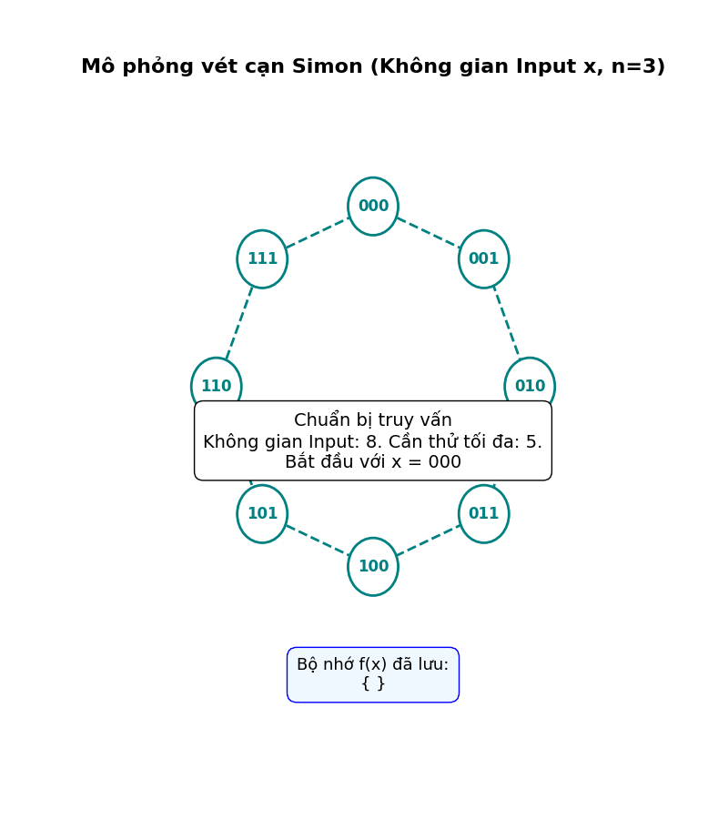
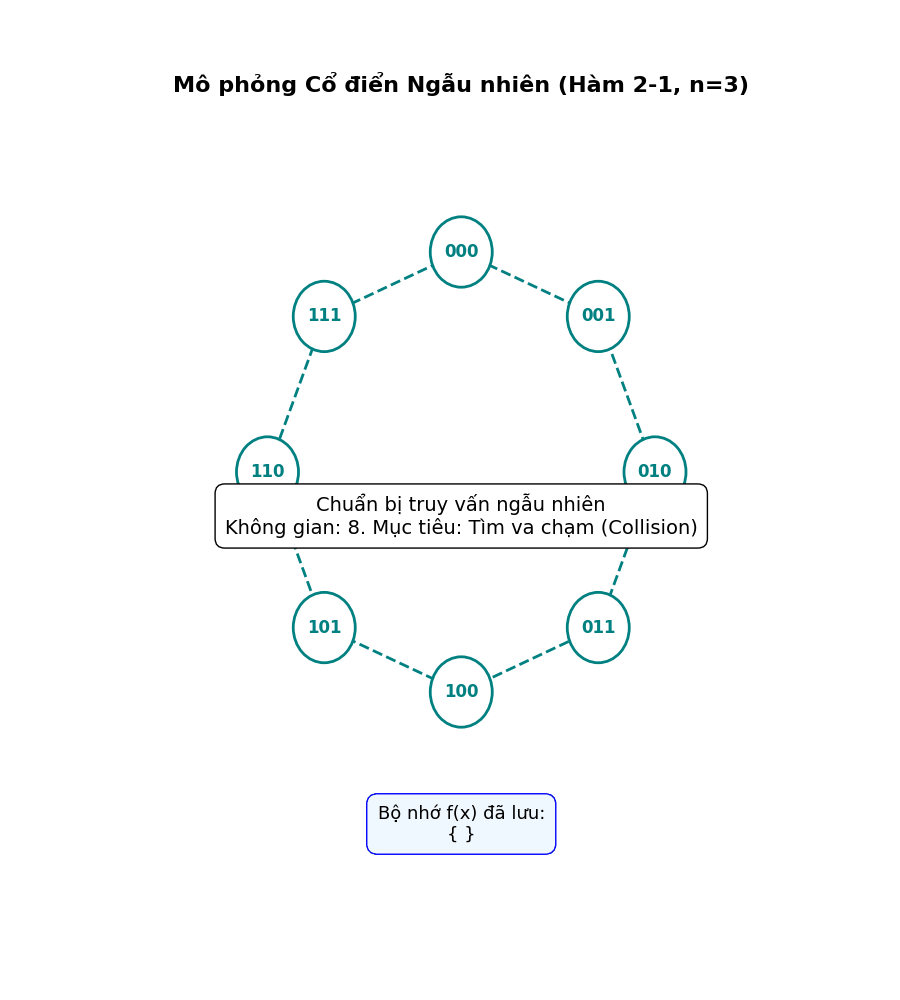

## Mục lục

Nội dung của bài này bao gồm:

- [1. Bài toán Simon](#1-bài-toán-simon)
  - [1.1. Phát biểu](#11-phát-biểu)
  - [1.2. Các thuật toán cổ điển](#12-các-thuật-toán-cổ-điển)
- [2. Thuật toán Simon](#2-thuật-toán-simon)
  - [2.1. Khởi tạo](#21-khởi-tạo)
  - [2.2. Thuật toán](#22-thuật-toán)
  - [2.3. Xử lý cổ điển](#23-xử-lý-cổ-điển)
- [3. Mô phỏng](#3-mô-phỏng)
- [4. Phụ lục](#4-phụ-lục)
- [5. Tham khảo](#5-tham-khảo)

---

Nếu bạn là một lập trình viên hay chuyên gia bảo mật, RSA giống như "bức tường thành" bất khả xâm phạm mà chúng ta tin tưởng bấy lâu nay. Tuy nhiên, bức tường này bắt đầu trở nên lung lay kể từ khi máy tính lượng tử xuất hiện. Nhưng bạn có biết rằng, nền móng của sự sụp đổ đó không bắt đầu từ một cuộc tấn công trực diện vào mật mã, mà lại đến từ một bài toán... chẳng ai quan tâm của Daniel Simon vào năm 1994?

Lúc mới ra đời, thuật toán của Simon bị coi là "vô hại" và thuần túy lý thuyết. Nó giải quyết một vấn đề mà chẳng ứng dụng thực tế nào cần tới. Thế nhưng, chính cái cách mà Simon dùng máy tính lượng tử để tìm ra "chu kỳ ẩn" đã trở thành nguồn cảm hứng trực tiếp cho Peter Shor. Chỉ một năm sau đó, Shor đã mượn đúng tư duy ấy, nâng cấp nó lên, và tạo ra thuật toán có thể bẻ gãy RSA trong nháy mắt.

Trong bài viết này, chúng ta sẽ cùng giải mã "mối liên hệ ngầm" này. Tại sao một thuật toán tìm chuỗi bit bí mật lại có thể trở thành chìa khóa để phá vỡ các hệ thống tài chính và thông tin quan trọng nhất thế giới? Hãy cùng đi sâu vào bản chất của Thuật toán Simon – bước đệm âm thầm của kỷ nguyên hậu lượng tử.

## 1. Bài toán Simon

Trước khi đi vào chi tiết thuật toán, tôi muốn chúng ta cùng nhìn lại bối cảnh lịch sử ra đời của thuật toán này để bạn đọc có thể hiểu rõ ý nghĩa của nó trong lĩnh vực khoa học máy tính cũng như điện toán lượng tử hiện đại.

Vào những năm 1980, nhà vật lý học Richard Feynman và nhà toán học David Deutsch đã đưa ra ý tưởng về một cỗ máy tính toán dựa trên các nguyên lý của cơ học lượng tử. Tuy nhiên, trong suốt một thời gian dài, giới khoa học máy tính vẫn hoài nghi: *Liệu một cỗ máy như vậy có thực sự mạnh hơn máy tính cổ điển, hay nó chỉ là một món đồ chơi lý thuyết tốn kém?*

Đến năm 1992, David Deutsch và Richard Jozsa công bố **Thuật toán Deutsch-Jozsa**, được xem là thuật toán lượng tử đầu tiên chứng minh được sự vượt trội. Tuy nhiên, giới học thuật quốc tế nhanh chóng nhận ra một "điểm yếu chí mạng" trong chứng minh này đó là thuật toán Deutsch-Jozsa thực chất chỉ chứng minh được sự vượt trội của máy tính lượng tử so với các **thuật toán cổ điển tất định (vét cạn)**.

Như chúng ta đã thảo luận ở các phần trước về Nghịch lý ngày sinh, máy tính cổ điển không nhất thiết phải vét cạn. Nếu sử dụng **thuật toán ngẫu nhiên (randomized algorithm)** và chấp nhận một tỷ lệ sai số vô cùng nhỏ, máy tính cổ điển vẫn có thể giải quyết bài toán Deutsch-Jozsa một cách dễ dàng và cực kỳ nhanh chóng.

Điều này dẫn đến một sự bế tắc trong lý thuyết độ phức tạp: Giới học thuật cần một bằng chứng toán học tuyệt đối (Oracle separation) để phân định ranh giới giữa lớp bài toán mà máy tính cổ điển ngẫu nhiên giải được (lớp **BPP**) và lớp bài toán mà máy tính lượng tử giải được (lớp **BQP**).

Vào năm 1994, Daniel Simon, khi đó đang nghiên cứu về lý thuyết tính toán, quyết tâm tìm ra một bài toán mà **ngay cả thuật toán cổ điển ngẫu nhiên tốt nhất cũng phải bó tay**, trong khi máy tính lượng tử có thể giải quyết dễ dàng.

Ông đã thiết kế Bài toán Simon với các rào cản tính toán cực kỳ khắt khe:

- **Tính hộp đen (Black-box):** Che giấu hoàn toàn cấu trúc dữ liệu, buộc máy tính phải truy vấn.  
- **Cấu trúc nhóm $\mathbb{Z}_2^n$:** Sử dụng phép toán XOR để đảm bảo bất kỳ sự trùng lặp nào cũng trực tiếp tiết lộ chuỗi ẩn, ngăn chặn các kỹ thuật phỏng đoán cổ điển.  
- **Độ phức tạp hàm mũ:** Ông đã chứng minh chặt chẽ rằng, ngay cả khi cho phép máy tính cổ điển sử dụng tính toán ngẫu nhiên và chấp nhận sai số, nó vẫn cần tới $\Omega(2^{n/2})$ truy vấn. Trong khi đó, máy tính lượng tử chỉ cần $\mathcal{O}(n)$ truy vấn.

Bài toán Simon chính là **chứng minh toán học đầu tiên trong lịch sử** khẳng định sự tồn tại của tốc độ giải quyết nhanh hơn theo cấp số mũ (exponential speedup) mà không một mô hình tính toán cổ điển nào có thể bắt kịp.

Và ngay sau đây chúng ta sẽ đi đến phát biểu của bài toán Simon.

### 1.1. Phát biểu

> **Bài toán Simon:**
>
> Cho một hàm $f$ biến đổi chuỗi nhị phân độ dài $n$ thành một chuỗi nhị phân độ dài $n$:
>
> $$
> f: \{0,1\}^n \rightarrow \{0,1\}^n
> $$
>
> Hàm $f$ được bảo đảm (promise) sẽ rơi vào một trong hai trường hợp sau:
> 
> 1. **Hàm 1-1 (Injective):** Mỗi đầu vào cho ra một đầu ra duy nhất.
> 2. **Hàm 2-1 (Two-to-one):** Tồn tại một chuỗi nhị phân ẩn $s \in \{0,1\}^n$ với $s \neq 0^n$, sao cho với mọi $x, y \in \{0,1\}^n$ ($x \neq y$), ta có: $f(x) = f(y)$ khi và chỉ khi $x = y \oplus s$
>
> *(Trong đó, $\oplus$ là phép toán XOR từng bit mà ta đã học ở bài trước - bitwise XOR).*
> 
> **Nhiệm vụ:** Tìm ra chuỗi ẩn $s$. Nếu hàm là 1-1, ta ngầm định $s = 0^n$.

### 1.2. Các thuật toán cổ điển

Trên máy tính cổ điển, cách duy nhất để xác định $s$ là tìm ra một sự trùng lặp (collision), tức là tìm được hai giá trị đầu vào $x$ và $y$ khác nhau sao cho $f(x) = f(y)$. Khi đó, $s$ sẽ được tính bằng công thức $s = x \oplus y$. Máy tính cổ điển có hai hướng tiếp cận chính:

#### 2.1. Phương pháp vét cạn (Brute-Force)

Đây là phương pháp luôn cho ra kết quả chính xác tuyệt đối, nhưng khối lượng truy vấn và lưu trữ sẽ tăng rất nhanh khi số lượng bit đầu vào lớn.

**Nguyên lý:** Cách hoạt động của thuật toán rất đơn giản, chúng ta lần lượt đưa các giá trị $x$ vào hàm $f$, lưu kết quả và đối chiếu với các kết quả đã truy vấn trước đó.

Trong trường hợp xấu nhất đó là hàm $f$ của chúng ta là 1-1 (không có $s$ nào khác ngoài chuỗi $0^n$), thuật toán phải kiểm tra qua đủ số lượng đầu vào để chắc chắn không có hai kết quả nào trùng nhau. Thuật toán sẽ phải thử nghiệm đúng $2^{n-1} + 1$ truy vấn (nửa không gian tìm kiếm cộng thêm một).

**Độ phức tạp:** Thời gian chạy trong trường hợp xấu nhất là $\Omega(2^n)$, tăng theo cấp số mũ đối với độ dài $n$ của chuỗi đầu vào.

Chúng ta sẽ chọn số lượng bit đầu vào bằng 3 và định nghĩa một hàm 1-1 để xem cách hoạt động của thuật toán này.

**Ví dụ:** Với $n = 3$, tập hợp các chuỗi nhị phân đầu vào có kích thước là $2^3 = 8$ phần tử. Không gian đầu vào và đầu ra đều là tập $\{0,1\}^3$: `{000, 001, 010, 011, 100, 101, 110, 111}`.

Theo định nghĩa của Bài toán Simon, hàm 1-1 là hàm mà mỗi đầu vào cho ra một kết quả đầu ra duy nhất (không có sự trùng lặp). Ta có thể định nghĩa một hàm $f$ ngẫu nhiên thỏa mãn điều kiện này thông qua bảng ánh xạ sau:

| **Đầu vào (x)** | **Đầu ra f(x)** |
| :---: | :---: |
| **000** | **101** |
| **001** | **010** |
| **010** | **000** |
| **011** | **111** |
| **100** | **001** |
| **101** | **110** |
| **110** | **100** |
| **111** | **011** |

*(Lưu ý: Vì tất cả 8 giá trị đầu ra đều khác nhau, đây chắc chắn là hàm 1-1, đồng nghĩa với việc chuỗi ẩn $s = 000$).*

Theo lý thuyết độ phức tạp, để chứng minh tuyệt đối hàm này là 1-1 (chứ không phải 2-1), thuật toán phải thực hiện đúng $2^{n-1} + 1$ truy vấn. Với $n = 3$, số truy vấn cần thiết là $2^2 + 1 = 5$ lần.

Quá trình thực thi diễn ra như sau:

* **Truy vấn 1:** Thuật toán chọn $x = 000$. Hộp đen trả về `101`.  
  * *Bộ nhớ lưu trữ:* `{101}`
* **Truy vấn 2:** Thuật toán chọn $x = 001$. Hộp đen trả về `010`.  
  * *Kiểm tra:* `010` chưa tồn tại trong bộ nhớ.  
  * *Bộ nhớ lưu trữ:* `{101, 010}`
* **Truy vấn 3:** Thuật toán chọn $x = 010$. Hộp đen trả về `000`.  
  * *Kiểm tra:* `000` chưa tồn tại trong bộ nhớ.  
  * *Bộ nhớ lưu trữ:* `{101, 010, 000}`
* **Truy vấn 4:** Thuật toán chọn $x = 011$. Hộp đen trả về `111`.  
  * *Kiểm tra:* `111` chưa tồn tại trong bộ nhớ.  
  * *Bộ nhớ lưu trữ:* `{101, 010, 000, 111}`
* **Truy vấn 5:** Thuật toán chọn $x = 100$. Hộp đen trả về `001`.  
  * *Kiểm tra:* `001` chưa tồn tại trong bộ nhớ.  
  * *Bộ nhớ lưu trữ:* `{101, 010, 000, 111, 001}`

Đến đây thuật toán sẽ dừng lại. Tại sao? 

Nếu hàm là 2-1, 8 đầu vào sẽ được chia thành đúng 4 cặp (mỗi cặp có cùng một đầu ra). Nếu ta chọn ngẫu nhiên 5 đầu vào khác nhau, theo nguyên lý Dirichlet (xem thêm tại Phụ lục), chắc chắn phải có ít nhất 2 đầu vào rơi vào cùng một cặp (vì $5 > 4$). Tức là, nếu hàm là 2-1, ta **bắt buộc** phải tìm thấy một sự trùng lặp trong tối đa 5 lần thử.

Tuy nhiên, ở bước 5, thuật toán đã thu được 5 giá trị đầu ra hoàn toàn khác biệt. Điều này chứng minh toán học rằng hàm không thể là 2-1.

**Kết luận của thuật toán:** Hàm là 1-1 và chuỗi ẩn $s = 000$.

<div align="center">



*(Hình 1.1. Mô phỏng thuật toán vét cạn)*

</div>

#### 2.2. Phương pháp thử ngẫu nhiên (Randomized Approach)

Cách tiếp cận học thuật chuẩn xác hơn cho máy tính cổ điển là sử dụng thuật toán ngẫu nhiên hóa (Las Vegas hoặc Monte Carlo), hoạt động dựa trên Nghịch lý ngày sinh (Birthday Paradox).

* **Nguyên lý:** Thay vì chọn đầu vào một cách tuần tự, thuật toán sinh ngẫu nhiên độc lập các giá trị $x$, đánh giá $f(x)$ và kiểm tra xem có xảy ra trùng lặp không.  

<br />

* **Xác suất tìm thấy trùng lặp:** Không gian chứa $2^n$ giá trị đầu ra khác nhau. Theo nguyên lý xác suất của nghịch lý ngày sinh (xem thêm phụ lục), để có một xác suất tìm thấy sự trùng lặp đủ lớn (ví dụ $> 50\%$), số lượng truy vấn ngẫu nhiên cần thiết sẽ tỷ lệ thuận với căn bậc hai của kích thước tập không gian.  

<br />

* **Độ phức tạp:** Số lần truy vấn hàm $f$ trung bình cần thiết để tìm ra $s$ bị giới hạn ở mức $\Omega(\sqrt{2^n}) = \Omega(2^{n/2})$. Mặc dù cách này tối ưu hơn nhiều so với phương pháp tất định, độ phức tạp thời gian vẫn là hàm số mũ (exponential bounds).

**Ví dụ:** Ở ví dụ phía trước ta đã dùng một hàm 1-1, vậy ở ví dụ này ta sẽ lấy một hàm 2-1 cũng với $n=3$ để minh họa thuật toán ngẫu nhiên. Trước tiên ta cần định nghĩa hàm $f$ này:

Ở đây tôi định nghĩa chuỗi $s$ cần tìm của chúng ta là `011` và theo định nghĩa của Bài toán Simon, $f(x) = f(y)$ khi và chỉ khi $x \oplus y = 011$, tức là $y = x \oplus 011$. Điều này sẽ chia 8 giá trị đầu vào thành đúng 4 cặp:

- $000 \oplus 011 = 011 \rightarrow$ Cặp 1: $\{000, 011\}$  
- $001 \oplus 011 = 010 \rightarrow$ Cặp 2: $\{001, 010\}$  
- $100 \oplus 011 = 111 \rightarrow$ Cặp 3: $\{100, 111\}$  
- $101 \oplus 011 = 110 \rightarrow$ Cặp 4: $\{101, 110\}$

Bây giờ, ta gán cho mỗi cặp một giá trị đầu ra phân biệt. Bảng ánh xạ hàm $f(x)$ sẽ như sau:

| **Đầu vào (x)** | **Đầu ra f(x)** |
| :---: | :---: |
| 000 | **101** |
| 011 | **101** |
| 001 | **000** |
| 010 | **000** |
| 100 | **110** |
| 111 | **110** |
| 101 | **011** |
| 110 | **011** |

Thuật toán có thể chạy như sau:

<div align="center">



*(Hình 1.2. Mô phỏng thuật toán ngẫu nhiên)*

</div>

Như ta đã thấy trên hình thì chỉ qua 4 lần truy vấn thì hàm số đã bằng nhau tại $f(000) = f(011) = 101$, và từ đây ta có thể suy ra chuỗi $s$ cần tìm bằng $s= x \oplus y = 000 \oplus 011 = 011$.

Trong các trường hợp may mắn hơn có thể ta chỉ cần 2 lần chọn ngẫu nhiên là đã có thể tìm ra được $f(x) = f(y)$ nhưng trong trường hợp xấu nhất ta vẫn cần 5 lần chọn (tương tự vét cạn) để tìm ra được đáp án chính xác nhưng trung bình các trường hợp này thì vẫn tuân theo quy luật của độ phức tạp tính toán ngẫu nhiên mà ta đã đề cập phía trên đó là khoảng 3 lần thử.

**Kết luận**

Cả hai cách tiếp cận bằng máy tính cổ điển đều vấp phải bức tường của độ phức tạp thời gian theo hàm mũ. Ngay cả với máy tính siêu hạng hiện đại nhất, nếu $n = 100$, một máy tính cổ điển sẽ cần khoảng $2^{50}$ truy vấn, một khối lượng tính toán khổng lồ. Đây cũng chính là lý do mà chúng ta cần nghiên cứu về thuật toán Simon ngay sau đây.

## 2. Thuật toán Simon

Sau đây chúng ta sẽ nghiên cứu về cách tiếp cận của Simon với máy tính lượng tử thông qua thuật toán Simon. Trước tiên là việc thiết kế mạch lượng tử.

### 2.1. Khởi tạo

Thuật toán sử dụng hai thanh ghi lượng tử (quantum registers), mỗi thanh ghi chứa $n$ qubit, một thanh để lưu giá trị input $x$ và một thanh để lưu kết quả $f(x)$. Khởi đầu, tất cả $2n$ qubit này đều được đặt ở trạng thái cơ bản $|0\rangle$.

Trạng thái ban đầu của hệ thống được viết là:

$$
|\psi_0\rangle = |0\rangle^{\otimes n} |0\rangle^{\otimes n} \tag{2.1}
$$

### 2.2. Thuật toán

#### **Bước 1: Tạo sự chồng chập (Superposition)**

Thuật toán áp dụng một cổng Hadamard ($H^{\otimes n}$) lên thanh ghi thứ nhất. Cổng Hadamard có tính chất biến một trạng thái xác định thành sự chồng chập đồng đều của tất cả các khả năng. Lúc này, thanh ghi thứ nhất chứa *tất cả* $2^n$ giá trị đầu vào có thể có cùng một lúc:

$$
|\psi_1\rangle = \frac{1}{\sqrt{2^n}} \sum_{x \in \{0,1\}^n} |x\rangle |0\rangle^{\otimes n} \tag{2.2}
$$

#### **Bước 2: Truy vấn Hộp đen (Quantum Oracle)**

Hệ thống đưa cả hai thanh ghi qua một hàm hộp đen lượng tử $U_f$. Hàm này tính toán $f(x)$ cho tất cả các giá trị $x$ đang nằm trong sự chồng chập ở thanh ghi thứ nhất, và ghi kết quả vào thanh ghi thứ hai. Hai thanh ghi lúc này bị **vướng víu lượng tử (quantum entanglement)** với nhau và trạng thái chung của hệ có thể viết:

$$
|\psi_2\rangle = \frac{1}{\sqrt{2^n}} \sum_{x \in \{0,1\}^n} |x\rangle |f(x)\rangle \tag{2.3}
$$

#### **Bước 3: Giao thoa lượng tử (Cổng Hadamard lần 2)**

Ở trạng thái $(2.3)$, nếu ta tiến hành đo lường (measurement), hệ thống sẽ sụp đổ về một trạng thái ngẫu nhiên $|x\rangle |f(x)\rangle$. Đó chính xác là những gì một máy tính cổ điển ngẫu nhiên làm: lấy một mẫu thử duy nhất. Nhưng Simon không dừng lại ở đó. Ông giữ nguyên sự chồng chập và tiếp tục áp dụng toán tử Hadamard $H^{\otimes n}$ lên thanh ghi thứ nhất chứa chuỗi $|x\rangle$.

Nhắc lại một chút kiến thức ở bài trước, cổng Hadamard khi tác động lên một trạng thái cơ bản $|x\rangle$ gồm $n$ qubit sẽ biến đổi nó thành một sự chồng chập của tất cả $2^n$ trạng thái $|y\rangle$, với biên độ xác suất được quyết định bởi hàm mũ phức (ở đây là dấu âm hoặc dương):

$$
H^{\otimes n} |x\rangle = \frac{1}{\sqrt{2^n}} \sum_{y \in \{0,1\}^n} (-1)^{x \cdot y} |y\rangle \tag{2.4}
$$

Trong đó, $x \cdot y$ là tích vô hướng modulo 2 của hai chuỗi nhị phân:

$$
x \cdot y = x_1 y_1 \oplus x_2 y_2 \oplus \dots \oplus x_n y_n \pmod 2 \tag{2.5}
$$

**Phương trình giao thoa**

Áp dụng $(2.4)$ vào thanh ghi thứ nhất của trạng thái $|\psi_2\rangle$, ta thu được trạng thái mới $|\psi_3\rangle$:

$$
|\psi_3\rangle = \frac{1}{2^n} \sum_{x \in \{0,1\}^n} \sum_{y \in \{0,1\}^n} (-1)^{x \cdot y} |y\rangle |f(x)\rangle \tag{2.6}
$$

Đến đây sẽ có hai trường hợp có thể xảy ra, chúng ta sẽ xem xét trường hợp phổ biến hơn trước.

**Trường hợp 1: Hàm $f$ là hàm 2-1**

Để thấy rõ sự giao thoa, ta cần nhóm các phần tử theo giá trị đầu ra của hàm $f(x)$. Vì $f$ là hàm 2-1 (với chu kỳ ẩn $s$), với mỗi giá trị đầu ra $z$, sẽ có đúng hai đầu vào $x$ và $x \oplus s$ sao cho $f(x) = f(x \oplus s) = z$.

Ta có thể gom cặp hai đầu vào này lại để tính tổng biên độ xác suất cho mỗi trạng thái $|y\rangle$. Gọi $A$ là tập hợp chứa đúng một đại diện $x$ cho mỗi cặp. Phương trình được viết lại thành:

$$
|\psi_3\rangle = \frac{1}{2^n} \sum_{x \in A} \sum_{y \in \{0,1\}^n} \left[ (-1)^{x \cdot y} + (-1)^{(x \oplus s) \cdot y} \right] |y\rangle |f(x)\rangle \tag{2.7}
$$

**Cơ chế Triệt tiêu và Khuếch đại**

Ta đã thấy trong phương trình $(2.7)$ thì biên độ xác suất của trạng thái $|y \rangle$ là: $\left[ (-1)^{x \cdot y} + (-1)^{(x \oplus s) \cdot y} \right]$.

Theo tính chất đại số của phép XOR, ta có $(x \oplus s) \cdot y = x \cdot y \oplus s \cdot y$. Do đó, ta có thể phân tích biểu thức biên độ như sau:

$$
(-1)^{(x \oplus s) \cdot y} = (-1)^{x \cdot y + s \cdot y} = (-1)^{x \cdot y} (-1)^{s \cdot y} \tag{2.8}
$$

Rút nhân tử chung $(-1)^{x \cdot y}$ ra ngoài, ta được biên độ xác suất:

$$
\text{Amplitude} = (-1)^{x \cdot y} \left[ 1 + (-1)^{s \cdot y} \right] \tag{2.9}
$$

Đến đây, hiện tượng giao thoa lượng tử diễn ra và chia làm hai trường hợp toán học:

- **Giao thoa triệt tiêu (Destructive Interference):** Nếu $s \cdot y = 1 \pmod 2$.  
  Lúc này $(-1)^{s \cdot y} = -1$.  
  Biểu thức trong ngoặc vuông của $(2.9)$ trở thành $1 - 1 = 0$.  
  Toàn bộ biên độ xác suất của trạng thái $|y\rangle$ này bị triệt tiêu hoàn toàn. Nghĩa là xác suất để hệ thống sụp đổ vào những trạng thái $|y\rangle$ này bằng **0**.

- **Giao thoa cộng hưởng (Constructive Interference):** Nếu $s \cdot y = 0 \pmod 2$.  
  Lúc này $(-1)^{s \cdot y} = 1$.  
  Biểu thức trong ngoặc vuông của $(2.9)$ trở thành $1 + 1 = 2$.  
  Các sóng lượng tử cộng hưởng với nhau, khuếch đại xác suất để hệ thống tồn tại ở các trạng thái $|y\rangle$ này.

Sau khi các trạng thái không phù hợp tự động triệt tiêu lẫn nhau, hệ thống chỉ còn lại những trạng thái $|y\rangle$ thỏa mãn điều kiện $y \cdot s = 0 \pmod 2$. Phương trình cuối cùng thu gọn lại (với hằng số chuẩn hóa phù hợp) là:

$$
|\psi_3\rangle = \frac{1}{\sqrt{2^{n-1}}} \sum_{x \in A} \sum_{y \cdot s = 0} (-1)^{x \cdot y} |y\rangle |f(x)\rangle \tag{2.10}
$$

**Trường hợp 2: Hàm $f$ là hàm 1-1**

Trong trường hợp của hàm 1-1, tất cả các giá trị $f(x)$ đều là duy nhất, vì vậy chúng ta không thể gộp lại thành tập hợp giống như $(2.7)$ được, vì vậy mà ở đây giao thoa cũng không xảy ra. Biên độ xác suất của tất cả các trạng thái $|y \rangle$ vì vậy mà cũng giống hệt nhau.

Tuy nhiên kể cả trong trường hợp $f$ là hàm 1-1 thì các giá trị $y$ đo được cũng phải thỏa mãn: $y \cdot s = 0 \pmod 2$ do chuỗi $s$ của chúng ta là $0^n$.

#### Bước 4: Đo lường thanh ghi thứ nhất

Ở bước này chúng ta sẽ đo lường thanh ghi thứ nhất và thu được một giá trị $y$ ngẫu nhiên thỏa mãn phương trình $y \cdot s = 0 \pmod 2$, hay:

$$
(y_1 \cdot s_1) \oplus (y_2 \cdot s_2) \oplus \dots \oplus (y_n \cdot s_n) = 0 \pmod 2 \tag{2.11}
$$

Đây chính là một phương trình tuyến tính $n$ ẩn của $s$. Ta lặp lại quy trình này vài lần để thu đủ số phương trình độc lập tuyến tính như $(2.11)$ để giải tìm nghiệm của các $s_n$ bằng các phương pháp giải ma trận cổ điển như khử Gauss.

### 2.3. Xử lý cổ điển

Có một vấn đề khi ta chạy thuật toán đó là tại mỗi lần đo ở bước 4, giá trị $y$ chúng ta nhận được là ngẫu nhiên (dãy bất kỳ trong đoạn từ $00...0$ đến $11...1$), vì vậy trong các lần đo sau chuỗi $y$ của chúng ta hoàn toàn có thể bị lặp lại hoặc là một tổ hợp tuyến tính của các chuỗi $y$ phía trước (không cung cấp thêm phương trình nào). Tuy nhiên người ta đã chứng minh được rằng trung bình ta chỉ cần đo khoảng $n+1$ lần ($n$ là số lượng bit đầu vào) là đã có thể thu được đủ số phương trình độc lập tuyến tính để giải hệ phương trình $s_n$.

Thông thường chúng ta sẽ phải chia ra hai trường hợp cho $f$ là 1-1 và 2-1 để làm, nhưng trong trường hợp $f$ là 1-1, thì với một hệ gồm $n$ phương trình đồng nhất độc lập với $n$ ẩn số ($As = 0$) sẽ chỉ có một nghiệm duy nhất. Nghiệm đó bắt buộc phải là nghiệm tầm thường (trivial solution): $s = 0^n$.

Vậy ta chỉ tìm lời giải cho trường hợp $f$ là hàm 2-1.

#### Lời giải

Trong trường hợp $f$ là hàm 2-1, chúng ta sẽ chỉ có tối đa $n-1$ phương trình độc lập tuyến tính. Tại sao?

Hãy nhìn vào phương trình điều kiện mà mỗi phép đo lượng tử trả về:

$$
y \cdot s = y_1 s_1 \oplus y_2 s_2 \oplus \dots \oplus y_n s_n = 0 \pmod 2 \tag{2.12}
$$

Ở góc nhìn này, $s$ **là một hằng số cố định (nhưng ta chưa biết)**, còn $y$ **là tập hợp các biến số**. Chúng ta đang đi tìm xem có bao nhiêu chuỗi $y$ thỏa mãn phương trình trên.

Vì ta đã biết chắc chắn $s \neq 0^n$ (do hàm là 2-1), nên trong chuỗi $s$ bắt buộc phải có **ít nhất một bit có giá trị bằng 1**. Giả sử bit đó nằm ở vị trí thứ $k$ ($s_k = 1$). Ta có thể cô lập $y_k$ và chuyển vế các phần tử còn lại (trong phép XOR, chuyển vế chính là chính nó):

$$
y_k = y_1 s_1 \oplus \dots \oplus y_{k-1} s_{k-1} \oplus y_{k+1} s_{k+1} \oplus \dots \oplus y_n s_n \tag{2.13}
$$

Phương trình này nói lên điều gì?

Nó có nghĩa là giá trị của bit $y_k$ hoàn toàn bị phụ thuộc vào các bit $y$ còn lại. Còn $n - 1$ bit $y$ kia thì **hoàn toàn tự do** (có thể nhận bất kỳ giá trị 0 hoặc 1 nào).

- Số lượng các bit "tự do" chính là **bậc tự do (degrees of freedom)**, hay số chiều của không gian: $n - 1$.  
- Vì có $n - 1$ bit tự do, mỗi bit có 2 cách chọn (0 hoặc 1), nên tổng số chuỗi $y$ thỏa mãn phương trình này là chính xác $2^{n-1}$ giá trị.

Bây giờ ta lật ngược lại vấn đề: Đứng ở góc độ người giải mã, sau khi đo được các chuỗi $y$, $y$ **trở thành các hệ số đã biết**, còn $s$ **mới là các ẩn số cần tìm** ($n$ ẩn).

Và vì $f$ là hàm 2-1 nên **$s \neq 0^n$**. Do đó, về mặt toán học, ta **không bao giờ** có thể tìm được $n$ phương trình $y$ độc lập tuyến tính từ kết quả đo lượng tử. Số lượng tối đa các phương trình độc lập ta có thể thu thập được bị khóa cứng ở con số $n - 1$.

Khi ta có $n - 1$ phương trình độc lập:

- Hệ phương trình này sẽ không định ra một điểm duy nhất, mà định ra một không gian nghiệm (null space) có số chiều là $n - (n - 1) = 1$.  
- Một không gian 1 chiều trong hệ nhị phân chứa đúng $2^1 = 2$ nghiệm.  
- Hai nghiệm đó luôn luôn là: chuỗi toàn zero ($0^n$) và chuỗi ẩn $s$.  
- Vì ta loại bỏ $0^n$, nghiệm còn lại chính là $s$ mà ta cần tìm.

<br />

Vậy sẽ cần bao nhiêu lần đo để rút ra được $n-1$ phương trình độc lập tuyến tính này? Sử dụng một chút kiến thức về xác suất thống kê ta có thể dễ dàng giải quyết vấn đề này.

Đối với các chuỗi $y$ thỏa mãn $y \cdot s = 0 \pmod 2$, biên độ xác suất của chúng cộng hưởng. Vì chỉ có $2^{n-1}$ chuỗi như vậy, nên xác suất để đo được một chuỗi $y$ hợp lệ là $\left|\frac{1}{\sqrt{2^{n-1}}}\right|^2 = \frac{1}{2^{n-1}}$.

Ta đặt $D=n-1$ để các công thức bớt phức tạp.

**Sau bước thứ $k$: Ta cần rút vector độc lập thứ $k+1$ (với $0 \le k < D$)**

Giả sử ta đã thu thập được $k$ vector độc lập tuyến tính. Các vector này tạo thành một không gian con chứa đúng $2^k$ phần tử. Bất kỳ lần đo nào trả về một kết quả rơi vào không gian $2^k$ phần tử này đều bị coi là vô ích (vì nó là tổ hợp tuyến tính của $k$ vector đã có).

- **Tổng số vector có thể đo được:** $2^D$  
- **Số vector "vô ích" (tổ hợp tuyến tính):** $2^k$  
- **Xác suất đo thành công một vector mới ($P_{k+1}$):** 

$$
P_{k+1} = \frac{2^D - 2^k}{2^D} = 1 - 2^{-(D-k)}
$$

Vì mỗi lần đo là một phép thử Bernoulli độc lập, số lần đo cần thiết để vượt qua bước $k$ tuân theo phân phối Hình học (Geometric distribution). Số lần đo kỳ vọng ở bước này là nghịch đảo của xác suất thành công:

$$
E_{k+1} = \frac{1}{P_{k+1}} = \frac{1}{1 - 2^{-(D-k)}} \tag{2.14}
$$

*(Việc lấy nghịch đảo này đã tự động bao hàm và tính toán cộng dồn tất cả các lần đo thất bại - tức là các lần rút phải tổ hợp tuyến tính).*

**Tổng số lần đo trung bình cho cả quá trình ($E$)**

Ta cộng tất cả các kỳ vọng từ lúc chưa có vector nào ($k=0$) đến khi tìm được vector cuối cùng ($k=D-1$):

$$
E = \sum_{k=0}^{D-1} \frac{1}{1 - 2^{-(D-k)}} \tag{2.15}
$$

Đặt biến phụ $i = D - k$, khi $k$ chạy từ $0$ đến $D-1$ thì $i$ chạy từ $D$ lùi về $1$. Ta viết lại chuỗi hội tụ quen thuộc:

$$
E = \sum_{i=1}^{D} \frac{1}{1 - 2^{-i}} \tag{2.16}
$$

**Đánh giá kết quả**

Như đã chứng minh bằng giải tích toán học, tổng này bằng $D$ cộng với một hằng số giới hạn:

$$
E \approx D + 1.60669...
$$

Thay $D=n-1$ vào, số lần đo trung bình là $\approx n + 0.6$ **lần**.

Tuy nhiên trong thực tế, người ta thường đo dư ra một chút (thường là $n+10$ hoặc $n+20$ lần để đảm bảo xác suất thu đủ phương trình độc lập tuyến tính cần thiết).

**Kiểm tra chéo**

Do hàm $f$ có thể là hàm 1-1, nên chúng ta cần kiểm tra chuỗi $s$ vừa tìm được có thỏa mãn điều kiện của bài toán hay không. Máy tính cổ điển thường làm như sau:

- Thuật toán lượng tử đưa ra một "ứng cử viên" $s'$. (Nếu ma trận có hạng $n$, $s' = 0^n$. Nếu ma trận có hạng $n-1$, $s'$ là chuỗi khác $0^n$).  
- Máy tính cổ điển chọn một giá trị $x$ ngẫu nhiên bất kỳ (ví dụ $x = 0^n$).  
- Nó thực hiện **đúng 2 lần truy vấn hộp đen theo cách cổ điển** để tính: $f(x)$ và $f(x \oplus s')$.  
- Đối chiếu kết quả:  
  * Nếu $f(x) == f(x \oplus s')$: Khẳng định chắc chắn 100% hàm là 2-1 và chuỗi ẩn là $s'$.  
  * Nếu $f(x) \neq f(x \oplus s')$: Khẳng định chắc chắn 100% hàm là 1-1 (nghĩa là $s = 0^n$).

Trường hợp $f(x) \neq f(x \oplus s')$ xảy ra như một cơ chế phòng lỗi. Đôi khi, do xác suất ngẫu nhiên, dù hàm là 1-1 nhưng ta không may mắn thu được các vector $y$ không đủ $n$ chiều độc lập (ma trận chỉ đạt hạng $n-1$). Hệ thống sẽ giải ra một nghiệm $s'$ "ảo" khác không. Nhưng nhờ bước kiểm tra chéo cổ điển này, cái $s'$ "ảo" đó ngay lập tức bị chứng minh là sai, và thuật toán tự tin kết luận hàm là 1-1.
## 3. Mô phỏng

Như các bài học trước, bây giờ chúng ta sẽ cùng mô phỏng một mạch lượng tử đơn giản để minh họa thuật toán Simon chúng ta vừa học phía trên. Trước tiên chúng ta cần định nghĩa hàm $f$ (ở đây tôi sẽ định nghĩa một hàm 2-1) và chuỗi $s$ bí mật trước.

Tôi sẽ chọn $n = 4$ để thể hiện rõ sự khác biệt tính toán giữa cả giải thuật cổ điển và thuật toán Simon. 

### 3.1. Khởi tạo

Trong thuật toán Simon, với $n=4$, chúng ta cần $2n = 8$ qubit (4 qubit cho thanh ghi đầu vào $x$ và 4 qubit cho thanh ghi đầu ra $y$).

Oracle $U_f$ cần thực hiện phép biến đổi:

$$
|x\rangle|y\rangle \rightarrow |x\rangle|y \oplus f(x)\rangle
$$

Để đảm bảo hàm này là hàm 2-1 tuân theo tính chất $f(x) = f(x \oplus s)$ với $s = 1100$, ta có thể thiết kế một hàm $f$ đơn giản như sau:

$$
f(x_3, x_2, x_1, x_0) = (x_3 \oplus x_2, 0, x_1, x_0)
$$

Ta có thể kiểm tra các cặp đầu vào của $f$ thông qua bảng chân trị:

| Đầu vào $x (x_3x_2x_1x_0)$ | $y_3 (x_3 \oplus x_2)$ | $y_2$ (Luôn bằng 0) | $y_1 (x_1)$ | $y_0 (x_0)$ | Đầu ra $y (y_3y_2y_1y_0)$ | Đầu vào cùng cặp $(x \oplus 1100)$ |
| :---: | :---: | :---: | :---: | :---: | :---: | :---: |
| **0000** | 0 | 0 | 0 | 0 | **0000** | **1100** |
| **0001** | 0 | 0 | 0 | 1 | **0001** | **1101** |
| **0010** | 0 | 0 | 1 | 0 | **0010** | **1110** |
| **0011** | 0 | 0 | 1 | 1 | **0011** | **1111** |
| **0100** | 1 | 0 | 0 | 0 | **1000** | **1000** |
| **0101** | 1 | 0 | 0 | 1 | **1001** | **1001** |
| **0110** | 1 | 0 | 1 | 0 | **1010** | **1010** |
| **0111** | 1 | 0 | 1 | 1 | **1011** | **1011** |
| **1000** | 1 | 0 | 0 | 0 | **1000** | **0100** |
| **1001** | 1 | 0 | 0 | 1 | **1001** | **0101** |
| **1010** | 1 | 0 | 1 | 0 | **1010** | **0110** |
| **1011** | 1 | 0 | 1 | 1 | **1011** | **0111** |
| **1100** | 0 | 0 | 0 | 0 | **0000** | **0000** |
| **1101** | 0 | 0 | 0 | 1 | **0001** | **0001** |
| **1110** | 0 | 0 | 1 | 0 | **0010** | **0010** |
| **1111** | 0 | 0 | 1 | 1 | **0011** | **0011** |

Như ta thấy có 8 cặp đầu vào giống nhau đầu ra, vậy đây chính là một hàm 2-1. Ta có thể thiết kế mạch cho hàm $f$ như sau:

```python
from qiskit import QuantumCircuit, QuantumRegister, ClassicalRegister
import matplotlib.pyplot as plt

# 1. Khởi tạo các thanh ghi để sơ đồ mạch dễ đọc hơn
# 4 qubit đầu vào (x), 4 qubit đầu ra (y) và 4 bit cổ điển (c) để lưu kết quả đo
qr_in = QuantumRegister(4, name='x')
qr_out = QuantumRegister(4, name='y')
cr = ClassicalRegister(4, name='c')

# Tạo mạch lượng tử
qc = QuantumCircuit(qr_in, qr_out, cr)

# -----------------------------------------------------------------
# BƯỚC 1: Đưa các qubit đầu vào vào trạng thái chồng chập
# -----------------------------------------------------------------
qc.h(qr_in)
qc.barrier(label='Khởi tạo')

# -----------------------------------------------------------------
# BƯỚC 2: ORACLE (Hộp đen được thiết kế tường minh)
# Hàm 2-1 với chuỗi s = 1100
# y_0 = x_0
# y_1 = x_1
# y_2 = 0
# y_3 = x_2 ⊕ x_3
# -----------------------------------------------------------------
# Sao chép x_0 và x_1
qc.cx(qr_in[0], qr_out[0])
qc.cx(qr_in[1], qr_out[1])

# y_2 giữ nguyên trạng thái |0> nên không cần cổng nào

# Gắn phép XOR của x_2 và x_3 vào y_3
qc.cx(qr_in[2], qr_out[3])
qc.cx(qr_in[3], qr_out[3])

qc.barrier(label='Oracle 2-1')

# -----------------------------------------------------------------
# BƯỚC 3: Giao thoa - Áp dụng cổng Hadamard lần thứ hai
# -----------------------------------------------------------------
qc.h(qr_in)
qc.barrier(label='Giao thoa')

# -----------------------------------------------------------------
# BƯỚC 4: Đo đạc thanh ghi đầu vào
# -----------------------------------------------------------------
qc.measure(qr_in, cr)

# -----------------------------------------------------------------
# VẼ MẠCH
# -----------------------------------------------------------------
# Sử dụng matplotlib với style 'iqp' để hình ảnh rõ nét
qc.draw(output='mpl', style='iqp', scale=1.2)
```

Kết quả:

<div align="center">

![][image3]

*(Hình 3.1. Mô phỏng mạch lượng tử của thuật toán Simon)*

</div>

### 3.2. Chạy giả lập

Như đã học, sau mỗi lần chạy chúng ta sẽ thu được một giá trị $y$ ngẫu nhiên và từ đó rút ra một phương trình tuyến tính, sau đó lập hệ phương trình và dùng khử Gauss để tìm ra chuỗi $s$. Quá trình đó có thể được làm như sau:

```python
from qiskit import QuantumCircuit, QuantumRegister, ClassicalRegister, transpile
from qiskit_aer import AerSimulator

def run_quantum_simon():
    # Khởi tạo mạch
    qr_in = QuantumRegister(4, name='x')
    qr_out = QuantumRegister(4, name='y')
    cr = ClassicalRegister(4, name='c')
    qc = QuantumCircuit(qr_in, qr_out, cr)

    # Xây dựng mạch chuẩn
    qc.h(qr_in)
    qc.cx(qr_in[0], qr_out[0])
    qc.cx(qr_in[1], qr_out[1])
    qc.cx(qr_in[2], qr_out[3])
    qc.cx(qr_in[3], qr_out[3])
    qc.h(qr_in)
    qc.measure(qr_in, cr)

    # Giả lập
    simulator = AerSimulator()
    compiled_circuit = transpile(qc, simulator)

    # Khởi tạo danh sách các chuỗi s khả dĩ (từ 0001 đến 1111)
    candidates = [format(i, '04b') for i in range(1, 16)]
    queries = 0

    print("--- TRUY VẤN LƯỢNG TỬ VÀ LẬP HỆ PHƯƠNG TRÌNH ---")

    # Truy vấn hộp đen cho đến khi chỉ còn 1 ứng viên s duy nhất
    while len(candidates) > 1:
        queries += 1
        # Chạy 1 shot (1 lần truy vấn)
        result = simulator.run(compiled_circuit, shots=1).result()
        counts = result.get_counts()
        z = list(counts.keys())[0] # Chuỗi z thu được

        # -------------------------------------------------------------
        # TẠO VÀ IN CHUỖI PHƯƠNG TRÌNH TRỰC QUAN
        # Bit của z hiển thị từ trái sang phải tương ứng: z3, z2, z1, z0
        # -------------------------------------------------------------
        eq_terms = []
        for i in range(4):
            # i = 0 tương đương bit 3 (z_3), i = 3 tương đương bit 0 (z_0)
            eq_terms.append(f"{z[i]}*s_{3-i}")

        equation_str = " + ".join(eq_terms) + " = 0 (mod 2)"

        # Rút gọn phương trình (chỉ hiển thị các s có z = 1)
        simplified_terms = [f"s_{3-i}" for i in range(4) if z[i] == '1']
        if not simplified_terms:
            simplified_str = "0 = 0" # Trường hợp đo được z = 0000
        else:
            simplified_str = " + ".join(simplified_terms) + " = 0 (mod 2)"

        print(f"Truy vấn lần {queries} thu được z = {z}, vậy phương trình thứ {queries} là:")
        print(f"   Dạng đầy đủ: {equation_str}")
        print(f"   Dạng rút gọn: {simplified_str}\n")

        # -------------------------------------------------------------
        # BƯỚC LỌC ỨNG VIÊN (Giải hệ phương trình)
        # -------------------------------------------------------------
        valid_candidates = []
        for s in candidates:
            # Tính tích vô hướng modulo 2
            dot_product = sum(int(z[i]) * int(s[i]) for i in range(4)) % 2
            if dot_product == 0:
                valid_candidates.append(s)

        candidates = valid_candidates

    return candidates[0], queries

# Chạy thử
if __name__ == "__main__":
    s_quant, q_quant = run_quantum_simon()
    print("--------------------------------------------------")
    print(f"=> Kết luận: Giải hệ phương trình trên, ta tìm được chuỗi s = {s_quant}")
    print(f"=> Tổng số lần truy vấn lượng tử: {q_quant}")
```

Kết quả:

```text
--- TRUY VẤN LƯỢNG TỬ VÀ LẬP HỆ PHƯƠNG TRÌNH ---
Truy vấn lần 1 thu được z = 0010, vậy phương trình thứ 1 là:
   Dạng đầy đủ: 0*s_3 + 0*s_2 + 1*s_1 + 0*s_0 = 0 (mod 2)
   Dạng rút gọn: s_1 = 0 (mod 2)

Truy vấn lần 2 thu được z = 1101, vậy phương trình thứ 2 là:
   Dạng đầy đủ: 1*s_3 + 1*s_2 + 0*s_1 + 1*s_0 = 0 (mod 2)
   Dạng rút gọn: s_3 + s_2 + s_0 = 0 (mod 2)

Truy vấn lần 3 thu được z = 0010, vậy phương trình thứ 3 là:
   Dạng đầy đủ: 0*s_3 + 0*s_2 + 1*s_1 + 0*s_0 = 0 (mod 2)
   Dạng rút gọn: s_1 = 0 (mod 2)

Truy vấn lần 4 thu được z = 1110, vậy phương trình thứ 4 là:
   Dạng đầy đủ: 1*s_3 + 1*s_2 + 1*s_1 + 0*s_0 = 0 (mod 2)
   Dạng rút gọn: s_3 + s_2 + s_1 = 0 (mod 2)

--------------------------------------------------
=> Kết luận: Giải hệ phương trình trên, ta tìm được chuỗi s = 1100
=> Tổng số lần truy vấn lượng tử: 4
```

Vậy với mạch lượng tử phía trên ta cần truy vấn hộp đen 4 lần để tìm ra được chuỗi $s$, vậy hãy cùng xem với cách tiếp cận cổ điển chúng ta sẽ cần bao nhiêu lần truy vấn.

```python
import random

# ==========================================
# PHẦN CỔ ĐIỂN: HÀM f(x) VÀ CÁC THUẬT TOÁN
# ==========================================

# Tái tạo hàm f(x) của hộp đen
def f(x_str):
    x3, x2, x1, x0 = int(x_str[0]), int(x_str[1]), int(x_str[2]), int(x_str[3])
    y3 = x3 ^ x2
    y2 = 0
    y1 = x1
    y0 = x0
    return f"{y3}{y2}{y1}{y0}"

def classical_brute_force():
    seen_outputs = {}
    queries = 0
    
    # Duyệt tuần tự từ 0000 đến 1111
    for i in range(16):
        x = format(i, '04b')
        queries += 1
        y = f(x)
        
        if y in seen_outputs:
            # Tìm thấy collision: f(x) = f(x_prev) => s = x XOR x_prev
            x_prev = seen_outputs[y]
            s = format(int(x, 2) ^ int(x_prev, 2), '04b')
            return s, queries
            
        seen_outputs[y] = x
    return None, queries

def classical_random():
    seen_outputs = {}
    queries = 0
    # Tạo danh sách các đầu vào và xáo trộn ngẫu nhiên
    inputs = [format(i, '04b') for i in range(16)]
    random.shuffle(inputs)
    
    for x in inputs:
        queries += 1
        y = f(x)
        
        if y in seen_outputs:
            x_prev = seen_outputs[y]
            s = format(int(x, 2) ^ int(x_prev, 2), '04b')
            return s, queries
            
        seen_outputs[y] = x
    return None, queries

# ==========================================
# CHẠY VÀ IN KẾT QUẢ SO SÁNH
# ==========================================
if __name__ == "__main__":
    print("--- THUẬT TOÁN CỔ ĐIỂN TÌM CHUỖI s ---\n")
    
    s_bf, q_bf = classical_brute_force()
    print(f"=> [Vét cạn] Chuỗi s tìm được: {s_bf} | Số lần truy vấn: {q_bf}")
    
    # Chạy ngẫu nhiên 1 lần để minh họa
    s_rand, q_rand = classical_random()
    print(f"=> [Ngẫu nhiên] Chuỗi s tìm được: {s_rand} | Số lần truy vấn: {q_rand}")
```

Kết quả:

```text
--- THUẬT TOÁN CỔ ĐIỂN TÌM CHUỖI s ---

=> [Vét cạn] Chuỗi s tìm được: 1100 | Số lần truy vấn: 9
=> [Ngẫu nhiên] Chuỗi s tìm được: 1100 | Số lần truy vấn: 6
```

Như chúng ta đã học phía trên, vét cạn sẽ cần 9 lần truy vấn ($2^{4-1}+1 = 9$ lần truy vấn) còn thuật toán ngẫu nhiên cũng cần đến 6 lần truy vấn để tìm ra được $s$.

Vậy chúng ta nghiên cứu xong thuật toán Simon, ở bài học tiếp theo chúng ta sẽ học về **Quantum Fourier Transform (QFT)**, đây là một module cực kỳ quan trọng trong thuật toán Shor. Hẹn gặp các bạn ở các bài kế tiếp.

---

## 4. Phụ lục

### 4.1. Nguyên lý Dirichlet

Nguyên lý Dirichlet (Dirichlet's box principle), hay còn được gọi là Nguyên lý chuồng bồ câu (Pigeonhole Principle), là một trong những định lý nền tảng và trực quan nhất trong toán học tổ hợp (combinatorics) và khoa học máy tính. Khái niệm này được nhà toán học Peter Gustav Lejeune Dirichlet chính thức phát biểu vào năm 1834.

**Định nghĩa:** Ở dạng cơ bản nhất, nguyên lý phát biểu rằng: **Nếu ta có $N$ con bồ câu và $M$ cái chuồng, với điều kiện $N > M$, thì khi nhốt tất cả bồ câu vào chuồng, chắc chắn sẽ có ít nhất một cái chuồng chứa từ hai con bồ câu trở lên.** Hay phát biểu toán học: Cho hai tập hợp hữu hạn $A$ và $B$. Nếu số lượng phần tử của tập $A$ lớn hơn tập $B$ (tức là $|A| > |B|$), thì mọi hàm số $f: A \rightarrow B$ đều không thể là hàm đơn ánh (injective). Suy ra, luôn tồn tại ít nhất hai phần tử phân biệt $a_1, a_2 \in A$ sao cho $f(a_1) = f(a_2)$.

**Áp dụng vào Bài toán Simon (Trường hợp $n = 3$)**

Để hiểu rõ tại sao thuật toán vét cạn trong phần 1 có thể dừng lại ở bước thứ 5, chúng ta áp dụng Nguyên lý chuồng bồ câu như sau:

* **Chuồng (M):** Trong bài toán Simon, nếu hàm là 2-1, 8 giá trị đầu vào sẽ tạo ra đúng 4 giá trị đầu ra phân biệt. 4 giá trị đầu ra này chính là 4 cái "chuồng cùng giá trị đầu ra".  
* **Bồ câu (N):** Thuật toán thử lần lượt 5 giá trị đầu vào khác nhau. Đây là 5 con "bồ câu".  
* **Kết luận:** Vì số bồ câu (5) lớn hơn số chuồng (4), theo nguyên lý Dirichlet, chắc chắn phải có ít nhất 2 con bồ câu bay vào cùng một chuồng. Nghĩa là, nếu hàm thực sự là 2-1, trong 5 lần thử bắt buộc phải có ít nhất 2 đầu vào cho ra cùng một kết quả (xảy ra sự trùng lặp).

Tuy nhiên, thực tế là sau 5 lần thử, thuật toán nhận được 5 kết quả hoàn toàn khác biệt. Điều này phá vỡ giả thiết ban đầu, chứng minh bằng phản chứng rằng hàm đó **không thể** là hàm 2-1, và do đó nó phải là hàm 1-1.

### 4.2. Nghịch lý ngày sinh

#### 4.2.1. Phát biểu bài toán

Bài toán đặt ra một câu hỏi đơn giản: **Cần tập hợp bao nhiêu người trong một căn phòng để xác suất có ít nhất hai người trùng ngày sinh lớn hơn 50%?** (Giả sử một năm có 365 ngày và xác suất sinh vào bất kỳ ngày nào là như nhau).

Trực giác con người thường suy luận rằng: Vì có tới 365 ngày, ta cần một số lượng người xấp xỉ một nửa số đó (khoảng 180 người) để đạt được tỷ lệ 50%. Tuy nhiên, đáp án toán học thực tế chỉ là **23 người**. Nếu số người tăng lên 70, xác suất trùng ngày sinh lên tới **99.9%**.

#### 4.2.2. Giải thích

Sự sai lệch trực giác xảy ra vì con người thường có xu hướng so sánh ngày sinh của *chính mình* với những người khác (chỉ tạo ra $n-1$ phép thử). Trong khi đó, bài toán yêu cầu tìm sự trùng lặp giữa *bất kỳ ai* trong nhóm, tức là phải tính tất cả các cặp có thể ghép được.

Với $n = 23$ người, số lượng cặp (pairs) được tạo ra là tổ hợp chập 2 của 23:

$$
C(23, 2) = \frac{23 \times 22}{2} = 253 \text{ pairs}
$$

Với 253 cơ hội để xảy ra sự trùng lặp, xác suất bắt đầu tăng vọt.

Để chứng minh chính xác, lý thuyết xác suất không tính trực tiếp khả năng trùng nhau, mà tính **xác suất của biến cố đối (complementary event)**: Xác suất để *không có ai* trùng ngày sinh với ai, gọi là $P(A')$.

- Người thứ 1 có 365 lựa chọn ngày sinh: $\frac{365}{365}$  
- Người thứ 2 phải sinh vào một ngày khác người thứ 1: $\frac{364}{365}$  
- Người thứ 3 phải sinh vào một ngày khác cả người 1 và 2: $\frac{363}{365}$  
- ...  
- Người thứ 23 phải sinh vào một ngày khác 22 người trước: $\frac{343}{365}$

Công thức tổng quát cho $n$ người là:

$$
P(A') = \frac{365}{365} \times \frac{364}{365} \times \dots \times \frac{365 - n + 1}{365}
$$

Áp dụng $n = 23$:

$$
P(A') \approx 49.27\%
$$

Xác suất để có **ít nhất hai người trùng ngày sinh** sẽ là $1$ trừ đi xác suất không ai trùng nhau:

$$
P(A) = 1 - P(A') = 1 - 0.4927 = 50.73\%
$$

Như vậy, chỉ với 23 người, xác suất để tìm thấy một cặp trùng ngày sinh đã vượt qua mức 50%.

#### 4.2.3. Ứng dụng trong Khoa học Máy tính

Nghịch lý ngày sinh chính là nền tảng toán học cho cách tiếp cận ngẫu nhiên (Randomized Approach) đã đề cập trong Bài toán Simon, cũng như là nguyên lý cốt lõi của **Tấn công ngày sinh (Birthday Attack)** trong mật mã học (cryptography).

Khi đánh giá độ an toàn của một hàm băm (Hash function), nếu hàm băm tạo ra các chuỗi đầu ra có độ dài $N$ bit (không gian đầu ra là $2^N$), hacker không cần thử đến $2^N$ lần để tìm ra một xung đột (collision). Dựa trên Nghịch lý ngày sinh, họ chỉ cần tạo ra khoảng $\sqrt{2^N} = 2^{N/2}$ chuỗi đầu vào ngẫu nhiên là đã có xác suất rất cao (khoảng 50%) tìm thấy hai chuỗi đầu vào khác nhau cho ra cùng một mã băm.

Đây là lý do tại sao các chuẩn mật mã hiện đại như SHA-256 phải sử dụng không gian đầu ra rất lớn (256 bit), khiến cho dù áp dụng Nghịch lý ngày sinh, số phép thử $2^{128}$ vẫn nằm ngoài khả năng tính toán của bất kỳ hệ thống máy tính nào.

#### 4.2.4. Giới hạn của thuật toán ngẫu nhiên

Thuật toán ngẫu nhiên hóa dựa trên Nghịch lý ngày sinh **không bao giờ** có thể đưa ra kết luận chắc chắn 100% nếu nó không quét qua đủ số lượng truy vấn là $2^{n-1} + 1$ (tức là quay trở lại giới hạn của thuật toán vét cạn). Trong giới học thuật, đặc tính này được gọi là **Lỗi một chiều (One-sided error)** của các thuật toán lớp Monte Carlo. Cụ thể, cách thuật toán này đưa ra kết luận diễn ra theo hai trường hợp bất đối xứng như sau:

**Sự chắc chắn tuyệt đối (Khi tìm thấy trùng lặp)**

Nếu trong quá trình truy vấn ngẫu nhiên, thuật toán vô tình tìm được hai đầu vào $x$ và $y$ khác nhau nhưng cho ra cùng một kết quả $f(x) = f(y)$, nó có thể dừng lại ngay lập tức và đưa ra kết luận với **độ chính xác 100%**:
- Hàm này chắc chắn là hàm 2-1.  
- Chuỗi ẩn $s$ được tính chính xác bằng công thức $s = x \oplus y$.  
- Ở chiều này, không có bất kỳ rủi ro xác suất nào.

**Sự phỏng đoán có xác suất (Khi không tìm thấy trùng lặp)**

Ngược lại, nếu thuật toán đã thực hiện $k$ truy vấn (ví dụ $k \approx \sqrt{2^n}$ để đạt xác suất 99% theo Nghịch lý ngày sinh) mà **vẫn chưa** tìm thấy bất kỳ sự trùng lặp nào, nó sẽ rơi vào tình trạng tiến thoái lưỡng nan:
- Nó sẽ kết luận: *"Đây là hàm 1-1"*.  
- Tuy nhiên, kết luận này **chỉ có độ tin cậy 99%**. Vẫn tồn tại 1% rủi ro (lỗi) rằng đây thực chất là hàm 2-1, nhưng do "kém may mắn", các giá trị ngẫu nhiên được chọn chưa rơi vào cùng một cặp (chưa có bồ câu nào bay chung chuồng).

Để tăng độ tự tin từ 99% lên 99.99%, máy tính cổ điển buộc phải tăng số lần truy vấn $k$ lên. Nhưng theo toán học, để đạt được con số **100%**, không có con đường tắt nào khác ngoài việc vét cạn qua nửa không gian tìm kiếm.

#### 4.2.5. Giới hạn của cấu trúc đại số

Trong thuật toán ngẫu nhiên, việc kết luận chuỗi $s = x \oplus y$ dựa trên kết quả $f(x) = f(y)$ chỉ xảy ra với phép XOR ($\oplus$). Nếu không gian bài toán sử dụng một phép cộng nào khác (ví dụ phép cộng thông thường), kết luận của chúng ta là chưa đủ cơ sở. Nguyên nhân đến từ bản chất của phép XOR.

**Bản chất của phép XOR (Cấu trúc nhóm $\mathbb{Z}_2^n$)**

Phép XOR từng bit thực chất là phép cộng modulo 2 trên không gian vector $\mathbb{Z}_2^n$. Đặc tính quan trọng nhất của không gian này là **mọi phần tử đều là nghịch đảo của chính nó**. Nghĩa là, với mọi $x$, ta luôn có $x \oplus x = 0^n$.

Do đó, không tồn tại khái niệm "bội số" (multiples) lớn hơn 1 trong không gian này. Nếu hàm $f$ có chu kỳ $s$ dưới phép $\oplus$, tức là $f(x) = f(x \oplus s)$, thì việc ta tìm được một cặp $x \neq y$ sao cho $f(x) = f(y)$ đồng nghĩa với việc:

$$
x \oplus y = s
$$

Không có trường hợp $x \oplus y = 2s, 3s$ vì $2s = s \oplus s = 0^n$, và $3s = s \oplus s \oplus s = s$. Do giới hạn đại số này, bất kỳ sự trùng lặp nào được tìm thấy cũng **chắc chắn 100%** cung cấp chu kỳ cơ sở $s$.

**Nếu áp dụng phép cộng thông thường (Cấu trúc nhóm $\mathbb{Z}_N$)**

Nếu chúng ta thay $\oplus$ bằng phép cộng số học thông thường ($+$), bài toán sẽ chuyển từ không gian Boolean sang không gian các số nguyên (nhóm cyclic). Lúc này hàm có tính chất:

$$
f(x) = f(x + s) = f(x + 2s) = f(x + 3s) = \dots
$$

Lúc này, nếu thuật toán ngẫu nhiên (hoặc vét cạn) tìm được một cặp $x$ và $y$ ($x < y$) sao cho $f(x) = f(y)$, điều này chỉ cung cấp cho ta phương trình:

$$
y - x = k \cdot s
$$

(Trong đó $k$ là một số nguyên dương vô định).

Khoảng cách $y - x$ lúc này có thể là chu kỳ đầu tiên $s$, nhưng cũng có thể là chu kỳ thứ 2 ($2s$), thứ 3 ($3s$), v.v. Để tìm ra $s$ thực sự, máy tính sẽ phải tiếp tục tìm kiếm thêm nhiều cặp trùng lặp khác, sau đó tính **Ước chung lớn nhất (GCD - Greatest Common Divisor)** của tất cả các khoảng cách thu được. Điều này làm tăng độ phức tạp của thuật toán lên gấp nhiều lần.

#### 4.2.6. Bước đệm dẫn đến thuật toán Shor

Đây chính xác là tiền đề cho một trong những thuật toán quan trọng nhất của thế kỷ 21: **Thuật toán Shor (Shor's Algorithm)**.

Cả Bài toán Simon và Thuật toán Shor đều là các trường hợp cụ thể của một khung lý thuyết tổng quát hơn có tên là **Bài toán Nhóm con ẩn (Hidden Subgroup Problem - HSP)**:

- **Simon:** Giải quyết HSP trên nhóm Abelian hữu hạn $\mathbb{Z}_2^n$ (sử dụng phép $\oplus$).  
- **Shor:** Giải quyết HSP trên nhóm số nguyên $\mathbb{Z}$ (sử dụng phép cộng thông thường để tìm chu kỳ hàm số, từ đó ứng dụng vào việc phá mã RSA).

Nhờ việc bài toán Simon đã đơn giản hóa cấu trúc chu kỳ bằng phép XOR, nó cho phép chúng ta tập trung hoàn toàn vào việc chứng minh sự vượt trội của máy tính lượng tử trong việc xử lý truy vấn, trước khi đối mặt với sự phức tạp của phép cộng thông thường trong thuật toán Shor.

---

## 5. Tham khảo

**Tiếng Anh**

1. D. R. Simon, "On the power of quantum computation", *Proceedings of the 35th Annual Symposium on Foundations of Computer Science (FOCS)*, 1994. ([IEEE Xplore](https://ieeexplore.ieee.org/document/365701)): Bài báo gốc khai sinh ra thuật toán, cung cấp chứng minh toán học kinh điển cho sự vượt trội theo hàm mũ của tính toán lượng tử so với cổ điển.  
2. E. Rieffel và W. Polak, *Quantum Computing: A Gentle Introduction*. ([Google Books](https://books.google.com/books?id=9Cs3AgAAQBAJ) / MIT Press): Cuốn sách này có phần diễn giải thuật toán Simon cực kỳ chi tiết, theo dõi sát sao sự biến đổi của trạng thái lượng tử sau mỗi lần đi qua cổng Hadamard mà không đòi hỏi nền tảng vật lý quá sâu.  
3. R. Cleve, A. Ekert, C. Macchiavello, và A. Zeilinger, "Quantum algorithms revisited", *Proceedings of the Royal Society of London*, 1998. ([DOI: 10.1098/rspa.1998.0164](https://doi.org/10.1098/rspa.1998.0164) | [arXiv:quant-ph/9708016](https://arxiv.org/abs/quant-ph/9708016)): Bài báo học thuật xuất sắc giúp tái định hình và chuẩn hóa thuật toán Simon bằng ngôn ngữ sơ đồ mạch lượng tử hiện đại mà chúng ta thao tác trên mã code ngày nay.

[image1]: <data:image/png;base64,iVBORw0KGgoAAAANSUhEUgAAAbYAAAHtCAMAAABCnqt2AAADAFBMVEX////+/v79/v79/f38/f37/f38/Pz6/Pz5/Pz4+/v6+vr4+Pj3+/v1+vr0+fny+Pjx+Pjw+P/29vfy9vbz8/Px8fHw8PHv9/ru9vbt9vbs9fbr9PXo8/Pt7/Hl8fPr6+3p6enj8fHh8PDg7+/f7+/h7PHc7e3Z7OzY6+vW6urT6enm5v/g6P/g5//m5+jk5PDk5OTi4uLW5urP5+fN5ubL5eXJ5OTH4+Pe4OLf39/a3ODZ2dnW1tbU1NTO1dvP0f/Gzf/L0tjR0dHMzs/IyP/MzMzKysrHx8fGxsbD4eG/39+83d253Ny329uz2dmv19et1tas1dWr1dWp1NTDxcuvzNG9v8W/v7+zub+7u7uztcS2trarsbaxsrKh0NCdzs6bzc2ZzMyXy8uVysqSyMiNxsaKxMSHw8OFwsKCwMCAvr58vb15u7t1urpxuLhvt7dttrZptLRmsrJjsbFgsLBfr69er6+rq/+iov+sra2pqamkpKWdn6+fn5+Vmp+bnJySlLSTlJWRkZGMjo+MjIyGiImEhIWBgYF/f399gYV4fP94eP97fH55eXl2d3dzdHRxcXJvb29ubm5tbW1bra1YrKxVqqpQqKhOp6dNpqZKpaVHo6NFo6NCoaE/n587nZ02m5swmJgslpYqlZUplJQolJQok5Mmk5MkkpIhkJBra2wwiIhnZ2gdjo4ajY1jY2RgYWFfX19cX2IYjIwXi4sViooSiYkRiIgQiIgNhoYKhYUJgoIIhIQHg4MGg4MFgoIEgoICgYEBgIAAgIAAZ2dXWntdXl5aW1xXV1hUVVVTU1NQUFBNTU1KS0tGSElHR0dFRUZDQ0NAQEA/Pz89P0E3OI89PT05OjozNzg1NTUyMjIvLy8tLS0qLC0rKyspKSkhIv8PEP8oKCgmJyclJSUjIyMhISEeICEfHx8dHh8cHBwZGhoXFxcUFBQTExMREhIPEBAODg4MDAwLCwsKCgoJCQkICAgHBwcGBgYFBQUEBAQDAwMCAgIBAQEAAP8AAADfawmcAAAqp0lEQVR4Xu2dB1wUR/vHnwMBAQtBQEWiFEXFHjXGQuLfxEKMoKLBjiIq8TVRQzT2XjCxx9gL2EssaOwtr6cSFQs2EBt2BFEEQQHh/rPl7vaGuxOVu53dd74fvZ39zd7dcM8+s9MHgEKhUCgUCoVCoVAoFAqFQqFQKBQKhUKhUCgUCoVCoVAoFAqFQqFQKBQKhUKhUCgUCoUiXyxx4X0Z0/4ILglI/XV1Nq7pI6LiZVwyNYqIC69xTTIocOHdqNh3TRvLHhzTEvf8UugC7afuvDxREGMA60uW1XHNIE3XuhQ82TIZxk+ZNQqP08fMUQouyTNGw6RDp6/W4fXXERPefc+qYMJUXGNpevpDfjoD7Gxe5u6+cPRt0R3xKANY4EKRmAIwlg04j7Co/haLFOKUVwSrweRdjNWCVNF4hB7qn6766naVSQCJ5zLwOH3EjLrJBeaNzh07Wau3Gji5R5D21ADnziXiUpFQqXDFGP5Pn9T4OQ0gNiAejzJACVwoCqnjJ3wN6Q4olJWdYnOUV5PLw7hfH/owQcW4kQ+YwJTBVn/8CHCldrNFni+80J+y02+phz93n27t2msDZNs+/BRO1ynRshnjEf6q3QHsR032r5n2y6axjZo73PZLQj/C0yU9XMM2sFHj4BvuC70bH0MfDONGX/3C7oZtK5TJtlhT+cauCcgRrn5xyeX7g+xV8AW0Zo87O762YwNTurNxt/9clcSYTQVjuledPh29Ozq7Xho0i2EvGjv6ziDGnxqDN/Qe46pKCY5h/r4xo556cx/LgDyuFPtFQZt33w6y6RDDOif6+joq5nNZv04v+8IRhado7t5of/hm6xvvLO3HsE+q9LKOAF9l1RDKRvggb2sMLf6GHBSwy5pik9xRe2cNf1VT1R0dC37KrfkQqjwbb5E2RMX45ekS2R55YH2nY357f/7a72E5gC20AFXTu4lNVXAuHp6eu8RGvZhQ/35WN+jf9sn1GncZZyk/5HWp9dzbzsMRVcoU/jMQP+c2eZWVVi4O/dTKqvF1xj9DWu1XWWUOcNENAO6xgY6ZnNVqh7JxmUk1rlW7wLrbyALbaY7wTOn4PI17D/qoafYFp9Unw6wSs6uddmQvzamWzgbUqL/Iv8OzcqftNfI5xk/3MiGHbZ9MzoDHOnnO3y9cX7VDmQsHo5x9UBbaAKBiQDvhhYb5IG+7B/tL9vkdBZQAZeCG9+iZfIQTurEiNwH4ngRVJTheDhwh1WkaupXR3aayhI0eYA+PK/IXZ5SBGeizpkHMEhjnHfR50OYznK9ZOkC3Lej4+dAwJ4CqjOQMsQ3bsT/QTKefwXn8eM2DpRyo7LttQX98m2lgk9tzfTmkva7+4JZXXbaQo31Y8OWP166A4q6VQml0ebrxTBLAJ/DHkB+ml0NpdErlrqk7DSo/GK++N3yVPsjiw8cDc6mq7A/TeZ2hMv9Fj6uhR+eRpmr5cxV8zge/z5gg8DUWW/QrhR7YwvyJPI3R/xaHmVAb/nZ7Bx/kbXClFGxkjp8wL9dBe5vBS7BGryfZsAvz8pgNcoIX8/KIDSIOQ9Pe6MwbFTLWeoMg8/kU8vYwx0vjnHglEyAPynLh8F5z3yA/52NYWMdoBJAL19jz5AcoyCXKSnORS3MujrnM/lOAU5ACFty35rA/QwwwnsqAbqwH3IcyXPyM+TLN/a3zi6m/CP2V8eoEYswC0PN816aLQfE1KpKzIQ8d3SAf5G3QKCcznzm+YL7FBwQZdVn0d6hJYWJd2eAr9vV2fY2A6KLa6pbTAhJhBle80fAArDowt2IlaHvor0BGQblHCh9Z9/KGDeEvHKpf1F6P3oCIRSXS3FrsOUoPmzxgDc7R7sDJL5WaOPSOZqdcoIArcHCFqiYH1HfJE5RvPGvGn6AbiimFGio3cl+EDF0T3bIAJaG9bjxTfIvRuKGAoM3ckf3gY9u6cpa4qok3yoeZLZf/I758BS+fVgN1HgnPkM1C1CfQ6rxj2ksnmKAReiR4ZCZrzAaZbtAvCcaNHfP9y/JuCnR7+58dy+QU+S/Lbp6qSkA55l+PBE7I0S3uSYq9AwitxnFowpScuHqgeT5xzJzBBw5+c+REOps7MORn2Z+8VB96JKkFSCs3qVM9Pnx53LTUOPUJIq66rnMUptLN7LrwDeRbjhngzJynO9x8sYApQ1lfsug294sse51aEYs2k1wQdtXRnTU6aH9K43xYJqkmq9SkPNdobXrmlEpQcAU+hqRy08Bpm0Jb8cn13GX1t7aMixwJPQdBsat8vTxk2wfzcxpXYCMcpsRVLrUZmv1rc5h5guowbY7K0zVWX7Kn+t71uTpN7TFq3gJf6j/qCw7cT8NQyiOh1s1mgseLk+8LR3vIi2NPpo/LVvRQx3g8c206SX1igN27ndKaZYHVtJwHrJdWulu1MXvHva6ZuKUS2KHyaYHuOwREX/dyip2ECuaj2XylKBjy/Q8AFZDf9WlB4w62rgtj1R7wTiJafZ+Ea+9Jg5N270oVy/jR+wq6gh9fIkjZ4BEAt6rpXmIQVAHgClOGcXla7jmuFSIf/A7hmn4+LJP8UM4UhOUUrW2Do33tikm49p5cFJSXjHHEoXeZywFJ/NnpPlZnoouYYRWJlKLcO+9utaFQKBQKhUKhUCgUCoVCoVAoFAqFQqFQKBQKhUKhUCgUCoVCoVAoFAqFQqFQKBQKhUKhUCgUCoVCoVAoFAqFQqFQKBQKhUKhUCgUCoVCoVAoFAqFQqFQKBQK5V0UZcccyeIR0MkCoGBn9F08RurI12xlIp0B7l54W+IzD4C1W4q027NkkK3Z1lSFqz+oT5bUhlv9hLFSR65bhn3nXxAWqTnb61ytXAq/bboskKm3La4TP1BXWV7zymBdRcrI09uGtPp9NibtSetkfxbTpIsszXa0XiS/O7KAGxa9eq3FRamib0tdqRNqfXsVriFW3bYOxTUKOShH4ArPSGa/dFkgQ29rCILttHXYDD64JFFkaLY5qfdxied+6mJckigyNJvlOFzRME4uJTD5mW0wXMclDddBJnU3+Zkt0FAWyfCwM65IkxK4IHmsX3LHsK45E2JhabUnoW/4MOKFm/BS6SI/b4ND7Gtozz/2zrPdUeuPgsN8mFEP61wpXWRotr/Z1+C3u/6Egc4bd/WHClyYUffoXCldZGi2t9zhOfpfF7IhDxrwYW2c5JGh2XjKof+XwR6s4CIflhHyK5LwRAV3rATLv+r+OBCSuTB+hZSRobeVZV+jILxb7uvVEO5+gw9r4yjkoeyLKwL6yaQxWYbe5osLAlrggkSRn9nivXFFgLfhhi9JIT+zvQW2Yq2XUnALl6SJXJrEtYyCBntxTc0Cl+ohLfJlMIRLXt4WgP6cqPQauKyhRnoUeI8KwGXpISdvC1nYzPE0XNjb+1kiHsXRwTcwZk2GS/vDkh+iLJ/q9v5SkDCACWTcGll+JR7LMKDPLWSv7dsVKjiwe9djPFpKyMTbvNOgRcwAvqE4OqT+/le68QwVp4Eme6zYpWvvmDRhrLSQxajkJrNh/nbBudfCMq3yBOcsVscyfryjPXVbZbdxifZUYpBstpIeHqrLj3C1EJFekNoXe1odLzEwXlepufzt/+kqZTLgx4YhBbpiYSrVVdzFPkt8yH22VQzsaIMOu59FveOX9YJHfd9g2rwRC9roKgtgnq4AyNLf2UWFFHJLIRbBTv7ocPPC9id4lKiQ6m2BwwAeP4u3aFAV4PUgg9MKy67vAI3P4Sqi9D74a7fmbR4rbODbTGE8h6LDCEjvabBc6bEM1dxvXSyoyfTV6WTDYkOm2UZ2gNua7MtzuU1KoE60mp+6gqq7oVx0GHrPtej9AH4BtSBnzwI8nqfxnA3LcI1nh3POQPXT0GK1l17DiwSRZjtol91WeF55A+iZ5eSwB7bvuY2rAhx+q8kF4kem68bgKOOG4BIsrgM9dQaBHbLVTZWYkGg2JbTH860D9rf76gjtv/sBwpbqSB9BWE9I3KHbJBbpldVORwBYVM9o74I5IbDe1rnphlO4dq6p28Z8wXnASJc1wA6hKxZiLeuXa3HihUApOTQ1HK/X7beu+5KQMiV5Zqs0R89zKG1L735rNGchC5vdiSrWH/DCmgyX1dBe28h8PLc9bjVkXefgQ2Q838gz275XhR9jiKiQRvv4oNu0hM47i9VqiPhdAKtDbB9xZvmzfEvdaI5T3/fQ3jxiQpzZ+jRsp7+epmi3DkV4b9uVk7HGRMMd1zh16dr71HNUm/119SU8kmVrcH4crokBaWYb1O/qblzjuBjScVOTzQE5B/DiSjFyes3h75bl2yp2lvwJj+Io+NzP+jwuigBpJUml4cJax3Ao3IplCk4oYHY0LqoxkkAzIqFu0oPw+lEPM1gNHqvnEZALYWbrAFdxScNruNcNb3s0Cd2Y7zLEVfgOl0SAMLN1hsm4pGV3jUa4ZBIag8EsElD6SJgiR1gPQNWEZObQcD4z3HFpLXbQo1I99DHBv1nx1bCN0BQS2OMqb8j9Go5ZwY1QbSKSEwwPVTEfhHkb8/Mgzvsy1aMwX3aGIRtm+Bta8iHT0jqTa+fy/sXXulOgle8v1QWJ4FMoMqSZrVCzlgAVOOOSSXC4p2IOjeAMQNs2gA7CzPm0ICwahGWSkIMLYsDV99l7xEob5DFLqehdkGY2/S0kZuYe+3oJrPLgssKbnSGnhfVEsSHNbKXY19KtHaBznOOnJaDzDujMhI31qxU7XuzrE1j9LywvETikCSQLEmGvc6lIkPZs+4p9LT+8Ewxv3nK4PQwHYMOMWhIMDk4oVu56M4NYANpYtB/+OvPn9orWgkTwKaQIUUbiioBAZRgumYQwpf4xEByRJ3BFBAjztmte1XFJS1s4gksm4QgYGXxQ3esaLokAYWa7ZKxq5pVhnifcHf7hppeWQELPDWFmWwq9cEmL9WTzlOIKwBqXtPSCYhvB8hEQZjZ4a7hsOwjMtdbxRm7tGX2UIGNpE9LMNtfgGp7Qi2spNANLEnrjkpotKIUEQJrZ9gxwMfBgWQTsNCizMAB9m168XEJNNCDi/SDNbJAA4bjEUc+cY6Yy6+EKRzjcwCVRIM5ssLKO3l615drJaWYgAPSOMG9UR+98R/ND2hAggLivuusZjBjWKsJsjzZEQUonm8J9e5VW3jbSi2tOyDMb7OoQnIZlRa776q4rvCGDKblp1SvkIHb37O+R2l1XEQ0CzQZbPu8UEvNMIAycmjHPvFYDOJ9St5eVcGxdzZ3WV/sIzkWFtAF3HH4DnCFCPZXiP91g20KdaDPxU1fY/Ccfbj8KUkkYRMJDptmg7HoHuLnrbDI07Ofsqm+WlFlYXAcep645DxW6fFYNVB34RZhJgFCzgfK3duxyqwA5O9V3vAj8pxPXhwOXD44gYVgr4YQQMdBGByVJ2y0abAEUlar9knBJdGbsxxURIa+6zTAVJuKS6JBkNULN5gaChV9IYdVQXBEPMs02yGA3gIh4tOZG35EAidVtgFRz9ay9D+mt6qvns4oOkd62jsidaKLBQLeACJBotsruhpaIEZfHUBmXxIJEs00lY+RvISaq6uOSWJBYb/M0zwCt9yahx0NcEgsCvc0CDO9SKS7EWI1EswUT9PNgbP8ZVygSgJiNu8nzttK4QBBzoSIuiQN5ZltIyh2th7cwA5fEgTyzVTXPbKgPI6kqrogDcRUABUzCJYKYaM5Rf0YgztuGktj4r+EOvk62SJBmNv/AK7hEFiF+uCIGpGWSu/fwgzcIpWS/HBL6S0nzNlARsYCEQd4AEbcVYWZzxQXiIKMbgLBu0kXhpwovUUwUV/wb7MI180OYt3lGGth6jRhuRHni0v883xLcQkIUZHnb0GxcoeiFLLPdE2WKxnviR7MEHNKqkfoooayES2aHLG8jY/WId/AWpuGS2SHKbMr2uEIk68TvBiDJbE3A4D7nRLEcpVRkSDLbRCKWbi0Ccfp3UjEjJJmtNBlrfrybIaLfXwSZzQHouKiiQpDZKqaLfhMXFeUqXDEzBDUlP9uEK8Ri21Jn7QvzQ463DSChQ6SILAaDS+CZB2LMVqLPWlwimHyR23OIMVtbfmMZaZBgbDllM0DMs21RXmgurpHLfxUbccmsiOvriEpu5e4y28PazXyFRxFM5hLm1cbTI+2hKFMoRTWb64oy6uBOIGZedNEYbKNZgitjwGNhjDkQcfGmSuus8jfdZ4aveXzWxQ3mb8cvIBhF52Hw8C82xX6dvC3zepvZ50Qzm6J/cHZ/7UQ2xUpvCJVK4xZUXwmJodqZym6r7KJWmXXismhFksVtoO8Dwfnu7lbfrBecE81Gq9ddBacZJwLrNzRrJi+Wt0V6ZeNF6DJ7idgbuQgooT2+I/FBu9t9MUmGDFf64BK6hZSk75vMcUip52b3UQ7DJRMiTibpOWaFvl2G/upbjogtJI0zorafnhpmakGvf9Jx0WSI00oSlam3JSszKkCc9LwPFv5RemuYBv4m0yDKz9QX/HGJYyVEa2pyhFI2GgzsBeCP/i5zIYrZAg2O0LrmQMqS7Ybo5mBo/7a3YGy3vuJFFLM5zMEVNWHGNgIjgl5gcMvGOQ64YjLEMFsfMDxnJY/fMplUrFAKDbELzLZPgAhmK93fSBPeQhiCS0QxBIyMd3/c31yLqojQlNzZgiv8D+log6rXi+oxlWzbFY4T2D1ldvVpQ8isdv20TeVyCjbBAa11E3+kTyczlSZF8Lay8IQ9BrHTabmlNRdVKT2LG5Kcxu28TSr23KxJKybB4McmngszPAFzPd1EMFtrfvCx7xr2ld3LwvsXX+tRrEr6dBYufWuYBHcKYxPPhRl1L7QUXGlKRDCbQ+FVPhvBGXWQ9GaSU+xrFSbBfKOqNqwCZ811pkUEsxknCxcIg4z0kWG2WO1kiJJCnUBs2dd7TIIPcoowbC5EKEnm883X6CmhXLGWefWFxNmQy22xW0twJYn4sCu59VuKErxzhD+TeC7MxeYLLzUhInjbAz0rsgy5n/krV1AhZMFGg3Arp+QxCeYVbbgk3Oc1GRKmNNZ2F3kCV4hCGYkrAgKVBhu+ihkRvO0YtMElLdW9DLXUksE1r+q4pKUt6OtFNAUimC1xh56ebTXjgOhGEpgLY3FJS83tt3DJRIhgNpgPHrikwR3IXgYo0UjaPWEBLpkKEUqSqFYaEQSKcjVxHVFH8YTwYUDJFQfrW/EyPk0FMwu3I5gKMcwGN6pDm7XlcZWnCy6QRnNcYHna55Cr+cZ56hmDZAaUjfqSuEPbRxEUGUt4RvHRPHHEFRngyHVsmAUxiiQAds9xRQY8t8MV0yHKOElLm39wSQ7Y/hdXTIYo3lZOMksivBc5TrhiMkQpSbrew5Vi4I5Htj2uFR3HmKYfnXHfq5SKS7Kifk9c+QCim+qc5ru7jxec8nWrIlakrsfxLfgfRU/zbaYoird9HPOHxh3rt3S0rnjW8tLvU3UlBq5IHh0Rg+m6NPjRQmJ+Isqz7aNo3sej/s+fMEs6PnhqyfrTePTf4jUz0lnVJu4l74SOKfenqEd++J9WXYErp/ODGOdLhpg2ALNZP8xAFZHY5tBl80ZUCowIuvlMKhUT6Xnbkv8kATs2YLtrlRcV1IsrN4K6R1ENvlE9UHEtCHEuLudP8hOvdjPeVtsmFzazp00zykA4O9yx9OGG0PAULB8Lb9EPsczBMaWR6IvXFQnpeZuDuityCdwr/YVWv7wZ+Zl2e7WlkLI0VBuLynna2U3MINRtTCChDkAuM6wAkoB5y3PLOpqLiEZ6ZktXL/LE9G2pR0o1z1sQ0VJn9af5yK6NhIJgo6rdvtMnnGQC7Qpg9mRUnDkTwYzOvAhMD4QkkJ7Zfljkjl6FZX1knUUVh47WLf4PQ1eyQ4URBUy+yQzzSEc5JDoE7B7DFV/uTZ4djhz0dpNRn/CXSgTpPdtOrbt7CZUkx/CnCTfS0a33y70VA5lFabR0cunurG4n/2vr2qzpTGDwqzXfMMcSN/mYmaqn6LXaH51lPAik2CiWetvHcMckw1DNWG+TXib5Xuivbs+pILFqWiFkbjb9PWA/DcIVShEQPZM0DTSTNC1fG55a2HQiJsw2MjpQPAgwG//8sU40ttyY/ofUh9H9QHqhsRjJ3KEBN8RfzfisGVmHgiI058WZio9CTLOpmKbBBuqzSWGVhE34GHoeUk2Z6rEeBL/t2UfzVNrSR5zqzPw3QcgY5e2Fv3+E4OTisTMAzZgQ24Vg5/J6Ihxm145EREQAlsKgKxERX+tK5kHceluMnfMzgCkjX7rmQ8EylyHoN5/Qo0L9e6iIXqrGf9mGpirz20yboQClAub1zdr6M1xpcsdhljoni/afOnLeaPRj9nJqmMS2RqoUKlDtVm9q3lgBZzXLrI63KpEPw+whqPS92ej0Smb9fuw4pF9B9bQCLOz+sipcqQMHzswPb8TYXgUK6y6DUZJaN2AnTDY49mQyTLU77Wr5/VH1R8Jebi6l2RHT28Dxi2bIavCf5fAbKMaWPLwWnfhnphxAXlhmI98MfLzjUt5IfaOyhtsB/HPy7wnqD2Dey/xwAS8ecdMFEbNg1r8QzbuFHdsqwtFjKtNQkgWjHh6chAIlneKiWP0qzFoBlh2PV+CWRCnYuAe9zno6axacQknS9AYdTMpC11e1PHELxSfzHvrVDPMVQ4SI6m1p3COmHPykCr/U9hDMmDka8pqh+3xmuALGdmMjXT2Swrnf6BMYVmVjR5izBa44Mdbm31ul1TGwagTplvwkpVG/IkOO555Vihzr81+qL63B7zOAsuXR46dChdJMKzJib230BieUlBfsBSnNmM65Ue2R2EgBM8apbwCLBmD5Fi6jLCDWLrszd7s/HvngxA5zLpGmRlRvayF4qvgg79rzLQC7GTk6Mm3BiAaJSeorVNERP3gBoIztTjW1hoh3BtgBkNBKoMHlFPagslGMPKHWcrlGS7vExNlf2LNt/oJhCEwbV6H58k9QktThL0+yzZrtXsdGlK0Hp9mWaFAqkyoP1VxuRkQ126lmKs16QNdRQfs79VKazJH7OS56u/Na2wUBo/BVHNV0Rr50jAkE4TFwRrP8y7QYxrntx1bz/kVnCJLg3nmNstTGXJAZ0lYRJUkdpWzBaitsG40ioC9V1EwSYj7725LPY+oXPDgbqC6Xj7Z+tp53xZS7cwezgYMHVH0NTevI+9cuKx8mpR1n+25mx62LjmWfSQ8ebx36nCmnMCdTuxSc+Xdgv3n9zhcUCHpxYO/IeRn84/P7u7El+X2/a85UjYm9fzaQbYJGZBVcfIsyyDHpR+qhikpyefYjk5MeBrZFpZtp5h5jLaq3IWdqr85jVNNz22jXPgrP7DGAc4kvd/0whdPmhy35P80FukR/4uYHMPm1b0t0Mu8nzTSCRm9+2M42+bPUH+MVunLLs0D3Mtx8Y56Tk8LUjV1Jl2u+4S16ZsRoaI6SNE59WVsP+2CAdSnt0u6qJVjl5bdQGkuXFgfvbtxyB7jRjg3VRTnfA93IQow3UuEzI2Zs3BI3kzSI9znbOQfYUNdtHnGfYrEUUXi3t70Da70POU2tQCTM6G0iP9s+ECt8SuMVAN83c7hVzHBeg6bJUTaIMnWjgou+CZnvRjXQJWzLTFR7+jIzC51N5mWX8d80P/XwVM0IvSWWia1hxtHTRh6PlheGBU9GFRHVJ1sv3oKgmPL71R/8ntRNNdvdIS1vSxnV5SazOsZRrjatUUelxsCnKZpWaR2QDUYbXclrTH2fz1ENrfnDYZ2WAMztNOyh7jB1EpGW2RjuAzyc+3g+NGVa5BlUW+fHAvz177w7Z7m6M3vPOzH+pYJ2uf9eVl3hM0n3dJhaOCOd+FAF24NgZXs46g7gehTaL8UvIQ5CS5IGqK+C86cA3Jwi49KmAtf6PnP6OKb9EtXVhgu7Y565oTLCQtiPqsXP1YNgk6LmDeZWIOKvZOvMlg/Rs7H2Fs/L/FVw2V0dIhZpme1SA+geV88xZfId7UDJb8MAlnSD2PKxujPe5/fcsIxbUlT5JVeXABiqcucC6uYYFiv0Lw8Ei/uTP/1OWmZDJHhAePAGWK9Zlmxf+xj4AaChguk5Uw9gRQzPOsh3VbfgemQQj79M4gwm9LaEhgAhtSFyvLqPZvwqPkAu0jKbS4T9kC9hXmqDH9FJ7LnDzBjX0aqy+S0AEq8fHAjaAawIm0dTAPxyLti9Uc/vGPtY2S3RmwkJva12bHwmPIdwVbkQP4BuGauH6vgikUirSOL6a+h2JTw7G8YU0Qd6cnPcJg3o0QagrfMgps96U3J39fiFa9aLAQ5c8i7PDjJANB0ZCFuEfT4c+S3KeDKXjBtwE2WmW24PMLI80/80H91KQia0lYRiHFHMluiJK7LAU29LqUkQxWzZ/XBFFoSoiz6mRxSzQTlckAVmHKwgSlMyuHyuGZgjH8bHH8QlkyGO2Q7+NC8uCRcljeLrk3n9cdF0iFaz7F7LyL6ITSqnsQOxpEPGNX4U5v80v3ALilAMQGjj1vwOFmV6BjBtiruerRU27JsZRR+njuiQeGGD/WY9s0dEQ7RM8h24NRihTtrLAWZcX1OXiivK8iHVzs7UbO8kcBg82radCflV6W6R29vI/oqmw3W9VcGme8zods8GXSvBfDY9ZECk2aqvhMRQbdbotsoucrXZc0pF/+Ds/g+1pyu970w3XzPIOyDRbAN735+mu8jIT10hyMwO57oFtv6ho9RcDuuW6yjiIU69zSgdwzaOxoY8njn9Ze+NfLeoebDZkz5EPZGE51mkTa8XCbqaWJBntkpz4/hB/wLSNvXutwYXTck/ee34ORwCYht2OpSJi6IgTpukMboD1/uJEWVkl5LixwN9nx5Gg2Z8g7gQZzaLgCi9N3RU5lpcMiFrM/WaLTMqgIzCAGlmKxMNK3GNIwCCcclkBIM/LnGshO1G2uTMB2lmW+wQiks8efGGYoqd70Lj3+IazwDnP3FJDEgzWxXQHe0o4Gcw143+Ez8DWQ8J4I5LYkCY2b6Dq7ik4RUwQ7PMgS07S0c/V7XTuUWEMLNVAyNzalOqM4scm57SYKRqfwiq4pIIENYD0CaV3UehYmBHG1+AxpOfh76BIWwYcbB3J7OUJjvxW4zarnCcEAuL6jErR2kSsbN3G27pDVEhzNtKHWcPDp8xDbg75u4tOAzAhhkO61t5ywT48pufHyrYO8+W39dekwj4xzwubxzCzAb/sq/xIS+AWXb8z/5QAdgww12oobnOlNS4dZ85VISQP2EgDGELlZpEgPENPMwEaWbDutbymKWWzA43cK4+s49HXSyqUArFgTSzFeieWrGL85ube+zrJWYGlWbSmwaz9yDpgzSzYUWkz0SZLO/Ovj5B387MXcWwxgUxIKwHIOQmu0J/1egGEJJ/pElomxu7QcmE49jY/Eidq01E8GtuW7AW3UNyR4OyJISsESSieQuzdkVIAmU4rgjwUZqnYelPpQ8uCQgnYVAZYZnk47ZGEtSKL5ibmkPwf7ikxaKtsSWdzYWRX0kMjtsaaS/umPE3LpmEPajCbZBQ239wSQQIM9sxA3vIs9gcxsqZJqIAuOUU9NICSBgvTVjjViJ44pIGDwgMNLA+U7HSET1fPbSLD2J4AAnDtwjzNrgOzCo/eomA+XfClaafHzHkzgDQLv2PEQjXcIkCoFhhqKDmwZbvVigNmrUYcN2vZIch+yh1tvAToFxBxKgEwuptqDwQ0ggb6MazJ5Nped+zJh49AWMKj6oqBry3BVnuYduyU7/vrr9ytri8kdKKGSHObKDyu6yv2W+Zs5+6QFKpQ5eQ6yYohu/K6bOQX1Nta3ATfaXWhsGrLuGaKJD2bGNG1qk3QtTBJ0uzxPij4AyYvap4MyuFG6o0BmvGjudl1RLGqhmjfxye+SneP75YqLzhTqExWmE9dfvaSkZW8mUWyiombFa6Zwfrtn4qYQO+0J3nRM+ehdsoRYFAs4HPMtXmxTrKFlfVV4Vb3pXpvV7img4eAZ1QblKwM9pgcZ6l9EYH+E2zTwOP4r+Kx7q7CvynGwy6rqOIB4lmA4vjFgU/n9ecDugDwcKF+9U0mquAbQa3YisT6Qxw98LbEp95AKzdYmjnB4YTP6v3DBbiGQVrV2jOGs61WLei8K0jEkSaDcBhQxm4setkOvh891kluPoDHs/j1SHQ0DiFNVUFb1tSG271E8Zq+LPuXwtwTQN626MLf18Hhx6fVYeXvdLxePEg1GzocTOP33A+d+ci3RgcZeKOvbhm8Y8i/KxQ+HyOqmWhpjFm+6FCTzAdhnTiu9euDCdqkUnyKgA8+XtPFFhlP3/42zxj6xwzhJRr8RwfE/tn+Xhdczxq6tyokHFXo3Kr8RlrZ7fFuWa/Slm7dL1Zp2m9E2K97T0I9PfEihRDgn7fLTxn8B+xRcdt+6+CwGhDY8ZJRw5mQ3/F8gHgk64ZlHrUOlLPAqz9++Z+rQ67rioFUQbmiEgBwnoAPhDVAIBlkBfGNc6HWt/WYzVY5esVylvqmFV+tLlGplOM43ZQqWzCBJQj8CiekWwzNbpmrRseJTHIa9z6YB4GZwCzlVhDZkNFvWwGH1CsQm7WV7sCgjSRRybJkdy+5BuAdZ+mGmqBup+6+IE7PCr5plBVQGrIyWwAyGpu7qDZKa8Q45a5Fy5iShEZZZIcDzeB4YbD67BJFlaTn9kg0FAWyfCwM65IE3llkgzWJ9lDw/nMjKfvfgW4EWp1DICrsykJWaDiY5Gft/FTYrLZ4mQIzLlbHYJhzmZrducUff3mUkSGZuNGE8SzLVnOG3f1hwrBb3cxM9VAsPu5xJGh2XTaGbPZKXLMdvbsTDWptkHiyNBsOtizU+SYBewLz1STMPIrkvCUbg3QOS61++NASI4K7lgJjPfQSAxi+9s+GH4sXuUIgKapY77we9X17QWbfp6j2HpBkzb6xz9SxEbZF1cE9DM05lliyPDZZmh0CUMLXJAo8jNbPLsdogG8DTd8SQr5me0X4Lck1UMpMNQVJzHkZ7YMmItLGn4HY8MlJYT8zAabauOKhtpy2YhGhmZbDx1wiacDs++zLJBfvQ1yvuxgeQEXGQYMvrUV1ySKDL0N+kFwBVxDVOwD+geUSxAZehvAiVa91xcaLmL1d8ZAzTJ1Ukcew1sLcbzEQN3tVqDm8rdGFomRGnLMJBHzAJ9HswBp8kGm3gal98FfuzWzET1W2MC3eneFkChyNRvAsECAa9H7AfwCakHOHtz7pI18zQbg8FtNLhA/kqAZhRQKhUKhUCgUCoVCoVAoFAqFQqFQKBQKhUKhUCgUCoVCoVAoFAqFQqFQKBQKpdiR2kSpOnsMba1cTNzvcAWXCERiZqt15X7fNBPuWVhOEVm5jgQ2RJeW2Wrtq49Lxc+lb8m3m6Sm3H9yxQxWg/oSyCUlZbaLxnZmKD7M8y0fhaTMVnkJrpiEJXq3SicKSZkNzuic7U8Snj3fxwfYpZIBhj95DsP4YmfpsXwceJz2sIV7dZaxJwlqVZczFXGFOKS4MnnbTZDc4xJAlVW2r/E4gNbsPg0A4ycCDJnPhTMH7eAXBToP57ufX35U6numSNFsMGM2PEf/fXCd5TDAhClM4A+wTlKLV/dU5QKOp5oDTJ+u1jlWh+iek48kzWbj4fN8DxwoeXRAv6Po9PmNHb3DD4PzpC8eh8CD5V/X7Y3EH+HHOz4zUeSukOeO8Ot/2Tf++zzZAWWuJ2GoC/9RKO7Hyfn7vmVD6J9EkNazjcfL2yfXGj5vOfXGNvZ8y+91pwHkTWrXETzip7YEZoPtP+CPve2QUd1qn/8K4Eoae6HntyH2AH7T1+mW8Z35o2SsJk2zXT/4u91OyAc4wZ2j51ZZAHaln6pKYCI4cpwAsrd6MDYqwwovAFIAEsfW4feuV5MKgCmEI0mzISxsmaUwCy/5f8tXsEbmsXoAX4efaQ9Qx4oVPgFAuaPT9L2aZwOyNco271Y28KAkFUk+277OcbIOhrPHj9XoikfdrTm+laaaMPvoUdgSvDe5Asxi9pRCsfuSswDSxlXhrIiYGxONrLoodiHzSdJ5tkmqTbKgVRwuGedmNT5wvy22Kqgx6pU4gkukIdVMkqEt50JGUFsNKr+H1aSAlM12UDJ5WrEjZbP9DyNrsx1NZQ/LrkurdF8EZG02S64ePSjwDyxC8sjabNn8Mf5THVkGyNlsdc6pQ6WFshyQsdmeH5+oDlo+/1EYI30k2UpSNBzrTNbYTW5VBRl7G9xwV4dkt568nM2WW54PlOYqAjJCzmaDOlzr17J7EViE5JHxsw2gEncYNEhXlgHS8rYmuGASmjzFFeKQltnM082keIgrxCEps42ZgSsmYQb5mypKymwR991wyQS43ccV8pDW3qTzz8WY/LlTb5s7LpGHeZ4Wxcevgz81pTMoPn2weBYuUigUCoVCoVAoFAqFQqFQKBQKhUKhUCgUCoVCoVAoFAqFQqFQKBQKhUKhUCgUCoVCoVAoFAqFQqFQKBQKhUKhUCgUCoVCoVAoFAqFQqFQKBQKhUKhUCgUCoVCoVAoFAqFQqFQKBQKhUKRGP8PWCV/2FYfmk8AAAAASUVORK5CYII=>

[image2]: <data:image/png;base64,iVBORw0KGgoAAAANSUhEUgAAAbsAAAHsCAMAAAB8PPNjAAADAFBMVEX////+/v79/v79/f38/f37/f38/Pz6/Pz5/Pz4+/v6+vr4+Pn3+/v2+vr1+vr1+fnz+fnx+Pjw+P/29vbx9vby8vLw8PDv9/ru9vbt9vbs9fbr9Pfo8/Pm8vTk8fHh8PDu7u7r6+vm6/Do6Ojm5ubk5OTj4+Pg7+/f7+/e7u7b7e3Z7OzX6+vV6urY5+vR6OjO5ubN5ubK5OTH4+PG4uLg4OPf39/c3NzS3ODX19fC4OC/39+93t673d2429u22trR09fR0dHKzdLLy8vEx87GxsbCwsK/v7+5v8W8vMK5ubm2tra02dmx2Niu1tat1tas1dWr1dWo09Om0tKi0NCfz8+dzs6bzc2Yy8uXy8uVysqRyMirvMGOxsaKxMSHw8OwtMiwsbKsra2lpq2hoqKfn5+enp6FwsKCwMB/v798vb16vLx3u7t0ublxuLhvt7dttrZqtLRlsrJisLBhsLBfr69crq5Zra1Wq6tSqalQqKhOp6dNpqZKpaVHo6NFo6NDoaFAoKA+n5+Xm6WYmJmKj/+IiP+Pk5iSkpONjo+Ki4uGh4mBhf+FhYaAgqR/gIB/f393e399fX15enp2d3h0dHRxcnNtboNtbW1qampnaGlmZmZkZGRhZGdiYmJgYGA6nZ03m5s2m5szmpowmJgvl5ctlpYrlZUplJQnlJQjkZEhkJAej48djo4cjo4ajY0YjIwXi4sWi4sUiooSiYkQiIggf4YNhoYLhYUJhIQIhIQHg4MGg4MFgoIEgoIDgYECgYEBgIAAgIBRU9ZfX19ZXF9cXV1aWlpVVldUVFRTU1NRVFZRUVFOT09MTExJSkpHR0dGRkdERERCQkJAQEA/Pz89P0E7PT89PT07Ozs5Oz0zNH83Nzc2NjYzNDQxMTIuLy8rKysmKCglJSYjIyMgICEfHx8dHh8dHR0VHBwSE/8REf8JCf8YGBgVFRUUFBQSEhIQEBAODg4NDQ0LCwsKCgoJCQkICAgFBU0GBgYFBQUEBAQDAwMCAgIBAQEAAADRQbCqAAAkSUlEQVR4Xu3dCXwM5/848E9IIkHcVDSOlFJn1dWidaURVUcTqiV1i7gJRRXf4k/rbtw3dR9VV1wJcWyps+74xZWIM44giboS9j/n7syT3UmwO/PM+LxfLzszn2ey+9jPzj3PMwAIIYQQQgghhBBCCCGEEEIIIYQQQgghhBBCCCGEEEIIIYQQQggh9OaykwEKJQ2c/pKMMeJ+u3WKjCEHC69NRiySFpMRW6ZMJCOcwmYyIvffQ3MZMmaDfzgZkbPz6dpz0nJnHjVqNMDEKPb1+vkFo8lSMTBxE1FkNXP5qFZRj6Bh/MDF4V8LsaMjp3bccnDWjpvse4xNdZHObx4VOBdiZh2+Yon8Oh76S2aQECtgZue+cu632WT5j79x84Tv8F8MUdtv2Fi+y0yYN1Zc7nNNWzfOX+lXOH3BxJDkk1D7+s6bZNFbyEYGHGYCwGB2WHhl2KfdyEJRYdnXL+Fr7p09tvJeyD7Xpd2YkmK0ZnHwLRx97B5ArG/uC+TffkxMx36QQ0y6HceeA4z3DYnMKQ+PhSrSSTfyjVmDu91PWzyTH6/YM11eSOqbFuuzaAIcgsNkydtwJQOOcmfI0IaQkgfgSUDY3U587Ja3y4Vi/dkfqMulot9tY7637iltD0FMhU/nfTR9KMDi4EVV6jaJZGeNg5CFzA8aIPXpgxDhLWd3nf+0f/ejSyoUjof1/7otYkJm1wvcG/GuluIGwtt0czvzsjozC7iwn3CULTHDh/s9PrvEjJU1QZW7UDMHwOXDuZY9YYu6hif58u8zHOKFd2TUmlvKvfan7AyN11+v1HX6papceFIoE+rdhxs/6hIy3/oH7Ky5Ywq02mUNML+yCUMaMH80uPYha/RtOW25qw21t8N/zNf/uOpFn91ThKj5We5FTZnhqye5tjJbu6HZSv7DLpNHXD2GlIWEzi+b1rW8AZM65u/TqycU2caOApzp6eInrgMThz+9P+ARM5LOvRFvaklu+RHfZmT2iy8vi2WiS6kFLrLD84/fu8MFri6AW72esmNTn5RKEeZK4F6PHg1iXit5J9ypxW1ZN6dW/O/3Zx+f5gq5d+beypbHKV5RzP+Wx0wfjR1irgMwDOaRc74Fpy138bDLo8s4gAMwbgSYBw7iowFRH17c5A5Q59CJT/x3FYB87s8XMJkZN2LCkNBBJSAn3Hhf9i7zYFYfMHfl1rmVwR3OVObj78Et8M0L4hvxwUEDrycyA/FtakRX8IDOS/gykQvwOziuwhBKwjV45pGL+ZXlA7MXF6oNO7lhTe518eet+TDztuaczN9b1qfJUA6mf8YsmWLAyvfq1ZJlLltX6sxbufhehpcg1N8hnJY76LoIljC5Kwj7JcGTcAncmOEheMIv8i+48BbmZ8zvNSXKc1cL5LsJByz/d/aLLXzP+kaskAWpwhj7NnfhYnJN/v8nfPm2se9Uay8ZBTbP4cxynuZ6J5bPIuGVC5MbvwpkmHOVWWUUAG49zeXWBRruOe8un+etOS93i6euZAfLhi/x6QrcSomxp/IBiJHMVGQoPJBMfnqkujB2rtJzrxelIn7aOnlhY3ERAf9dPcQ5ocg9mH7PMsVbuIDfqxHfppw/s+J64R5worh0LlKZKzBJlrpD0EQy5QpFcz2WTAuYGLPIQUVpjNmeSyeFBZf5jVWJhvbwjN2rPyub4e04L3fMOog14oeSZm6ng7OfGa9kmePL3XfgZUHLZMO9h+FMlVfceOVDnzH7gFe3XShnFhebchei4EQ1ftZGe+4yr/2EP7QIYPdzxLdJzmtm98ibRe0Ud2JsKXeB3XJxe8RWlh1bxpyeNg8jmU86zO2EsJg56pq7L5DPYSmFXLvZV2+A3yBUUqwrt2x+CxZFmH8vlWfJird/m7FmYYfzNZnFfR17uP0Wh3HicvfaPmF3ESaQ0df29m8zYvgZxS2kXXnIgFxtbjWLEEIIIYQQQgghhBBCCCGEEEIIIYQQQgghhBBCCCGEEEIIIYQQQgghhBBCCCGEEEIIIYQQQgghhBBCCCGEEELIgMhnphpM9cZfsYP0zRuvkUX6Z+jc+czzgt0nb+XwCSoGMMJEFuudkXO3qUCanzjusdQbmmX2iDOdMW7uiq2Bdjck0y47coZvkEzrn5OeTa+9qoseNZYvZysKdyj4jyyic0bNnc/CuO/I2MGHnV7xD7g2BqPmbmtSWzIEEJuj43H2ObEG4bRn02trHQSSIdbcW7PIkI4ZM3clivYlQ7zvwU6BHhkzdytS7G3XVn9LRvTLkLkrCq3IkGgO9CZDumXI3PWC52TIYleG3U/dMmTuGqwkI1bhmT2EXD+MmDsPmEeGrFIhmAzplRFz10wc8VwzHOCTrWs8AEJ3DReCTxuKxXpnxNyVF0ciXwVs8Jq2/VUUBAfPDBBOZu4qKhbrnRFz5x/HD72hw6pCXWF2RygamrZ5VSE+etQ6o84ZMXcQyw+KQnoy5AZIY8YeQ7JQ+MAym94ZMnfCf+ok1CgL5wFqwKlb+aGsUOhqmU3vjPM/kRDTtGcqDP+7lwmioX20CYSdFcMcIhjSSMW7G35ULNUTI64z/48MyDROJCN6ZcTcbSUDMh57yYheGTF3zyCUDFnlAYUTZvpixNyB0mmv/jAvBxnTKcPlzuUXgBlgPz3+29/fFUEG9clgucuxZr9fZfgT/iILRD1hfL2+zwEqkgU6ZKx7jdb18ho56i5AdNsTd8gy3tQ/j8KddVB+budL18gyvTFQ7iq6pR7eNz6BHU3+qs0SspizxqsnN7y//suWnR+fJ0p1xjD3RX/+KyS2sU6akmzdKNajXe+z4rjL6DPr8z+UluqNQXJXeRYkdnksCfisiuskmeQFhi1aKguY0vrFyAK6Qvk606e4qzQjdtRPuOvb8c8X0lDKyXaBq6UBxpCOW+bII7u+CsrKds8la9VQG8XLXbHxpfiRB5MPyAoIg1pCPTIGWW1Lknvxix/ImFyPNsL5+gdT/paXaI3a3FWa5gabI88B5P++RS6YuY4sF/3iB2tmk0Ee2Ybr61RpqVWNqauJ5dGK+WHc2rD+VabV0AKtuVvqmxpqWWpcRjd44W+WFltFrFhLhizYtpPRJ267Fw/yVmw7OaQZbJlMBlkll8Na613wStXQAp25c4uG/ielAY8o6JvxVueebX/IZGOV1TbLvb7/2cZ62S36jvw2atvV0AqVuXPdk+5H/r6XlxxwQh75sQVETJKH3spSj47PZIFs+xYslwXAVjW0Q+V+5r70RmQINvr2iJRvr8av6eXQppAPWrZvtU/6EftfDpRM8TJWA0lts71l2mINe6y1PctbqrxX+raZV0NjFC531Vu0s9mof3VnH/5rK7amm9cI7tyXg91duvMxmC7zm8ZMq6E5CnO39obtc5GQ0m5NOjtcmLfvBGekjvEYXANadn7CnmxZe9NONZKD+WqgDHra/1Xv2wFfmD4mo47mMtrEVKGHYjWoQN9yNzV6PxkSXWza2S9xkdN/9PuWHLvrNtl+Nc41t7NEqoy6+zNzwzQyZPEPJH5HHjs4xTn4VqEax6HDMjKmhWxkQGv94REZsoorqkrqGKUUq9GNjGiCutwF7CYjEjPJgNM0iSYjEupVQxF160y2AQGr6nT2rIkJuscyL+KFguPgotaCJ1RjVCN47l9vLECjdGk1sr2yzqkZ6pY72MkPTnHfE/8iOctvaRfpbEI1GoXVy/HN2N31YJmsGl9bR7VDW+58QPkiZxky4Bw+wJ/4qgP/MqsAiIV7PrJylaqhjLbcZdZKR6V1vJcwjAc3gIdQEPLLitmo9mjLneU0VJ5AyB0IgVCtPgR6Q2A5IZwmljuX2NDyNizrBfOT2rZ0natFNZTRlrtb4kixMGgYBmHQoy+EfQNhVYSwSq1WLW2FArI17f80MKrPylWyaiSJ5UjCVI2MSJlKkBEnMVUnI1KqVUMRbcsdwBdkQMIb+HP8KlCqRlH1qqGEutw9bExGJJTKHOtBABmRUK8aiqjL3RRxF8+WrkLvG843NRcZkegWT0Y0QV3uTGCjw1mBGwwjQ85ignZkyELFaiiiLndwg2/tYctgZp9dLTd6kBGLH617w5qiL3fd4RsyJHBromKPwd1t91rMcPtKxWoooS93j6Mz3p3F2wT2b6N1uMe7w8iQQNVqKKEvdzAa/iBDnBZeCs3IHW8MyNsMiVSuhgL67nkAONXO1mMMSkzetp2MOdXJdu7/kjENqmEfjblLdO+YsUlqsVV3+pMx50p0D854X4r61bCPxtzBv/k6NtooD7X/LdnevoPT/Jtv4uH78pAW1bCLyvYI3FXzUEnXUm6r3lunxY0G64puniKZ1KoadlCaO3DZnguGHeTHfWbng5AL8nKVBIfCrvHCBR8Nq2EbrbkDMCXnZY6QX3h6A7wacIosVU079hhd+2rYQm3uvutdD0p+81XO1ANRNvb2VBUUWJipxq7jZBzZYaLkAFiqkomMIJvykQEKmILIiJYoPK8iULgvWTN3qXqKF625M7UnIzQYRdXhMKW5KwpryBANzkEfMqQhle53fF3j6biLLoOmynf+qovS5e6DhWSEDjSljtLc1YBlZIgSO34hI0gvelF0iEfnckev2eD09u5ZRmXu2lH04yaljSYjSMrUgYzQw9P+bWwIoA7Fix1NaFxnDn9CRqhCzYJH47H5RKf3oPJW2h6i5DIejcvdfuF6OaVejCEjGqEwd//LrN2yxqbRcnWKvtxl+5Ly3EWA5DkMWqIvdwNB2rs6jTYJ/Xdojb59lRabyQhtppIBjVC33PnA72SIOvXpuHxOXe5urKahuydlteW9tyMdyWEqSoa0QNty9wU1Zy0UPIdeZEgLtOVuuGqdvb2NRQ3IiBZo28/M+RMZodFSG+0D1UfZctcBHPq4Cqeh4owmZbmjpOeSTOVeQUZQnmJkhFIm+73AqIay5S6Fjp5LMqfQC4xq6MpdFD038mTiJwpav1GVuxIeZ8gQra6Bve5X1EPVMcIEUKsX9rc3XPuHv1K13L1v58GtNNI+dVTlrj6djX/sGLiMjKiNptzt70dGaHavFBlRG025o+NsRVYth7pkSGUU5S5UZ+cq/htBRlRGUe6CVetQ2DHGKXVL/G7xMBUiQ5TT+nev/fFd8xLuL65FAAwAot816rE3Z7h9W8D1uUY3Smt7Zuf7XpC2+eTj3J+0dIMnI3TXcZAJIGlD3FOv2k0Btk4kS51Oy9yVWwDRltZsn/8K8R2lpdQLDk0JsfQ93qMdzF0lLVWBhrnr0+aO7H6rauHgR2fvDjatK/rnDOl0328TVb5fWrvcrSy+YLk84hLt2sbyECXamWQdfLLKzxOfS2l0I00VyRBAhEn7faesiTZl/NW7mJQeEut4Wu3nfuv/cwwZY/Y5X+4hQ3Ra5eaX8ZKH2c9N1U2eVrnru+UAGWI1hMFkiEaVfHrZ2jKn9fKpRMacSKPcLYfJZIg3r7lGNXots++dI0Occ/fUvIqlzTdVqKS9pyGtBOqbAQGEQmsyJGjNlKlGm9xNBrvNkvvlJSP0Cd6ZcWPHM0eq+NASbXKn0NXbKXr6UbAnv0Izs6kq9rerSe7qKHX1Fk3BnY/K+sNTMmTxFNR7bIkmuWtCBqQWkAHqNNpARiQ2+JERp9HkWLjBbn7o3bNBPWje4b3useC5JPfIk1zwFpS4JpmXRsJ9Rp5b9o2DIc3YsymhrZlRzgH1ugPXZLkD4UlNhe4yL6W5J/9Evto+zVMobSAMKZUNhAc2RM4MYJbAVGYsOJgbZR1X7ytV7YNkhI4SzrIP1wlnz0V4Q4fZ0F0oVW+t80Y+F4besHlVIb4TptA0dpQodzptcpeh615fSGf33zipHvIy2hQWhr4AD8TYQ+uopdzptMldBvHgxn4BnHSqOrLPSKxePEBBMVbAOqreV6raB9mSJxACy1ULhGr1b8OyXjCfj3o+l89FG7F6t6Fl2/sQ6AqBMM+VHSXKnU6b3FXlB8XCIKyKXxj06AsB2Zr2F46aPKhoEGzfJXEkoE9kEIR5QRisXMmOkuWGZFLsW8ZE+xVMk7Bhtim/iYw4jSbLXWojMiJDQTMNZY3JgEQAGXAeTXIXZd2wZ9Sa+oZc5lZkRCJIvdpnvHLvPI3/engzlgwa1If5Kk4dRAb1q8shMmJs/gb6nQqHb++OCWRAt/yakhGkFxQ9GFwtSrtkDqDefqbDzlKa3+zxCQUvkxHeRPOrr8mYgxQgA3pl/zaHzMj2umcklQ6xTvFFWdgtjz1r9/NjbXQMwt87yn5Quq2b+bLoQzLgWJpce82y2XX/br9Y1pFJzrPVK2S4sl6HezUrHO+U7ZktgYwJavXMVsbOIrmZ2UrnyNFwLxmnhHrn7FtsISOZmmFusX18JIwa4BsxGsyjIaT6iZRHoYPHgHlosW0z2dOfo3qWYYqus62JJtTNX/xEwoCKETGz4daUxj9FQOIcZplh/sz3+PRb6Z2GjgfzYJ+tXMMjc0iZzX9fbXildf+jN+P4otEQbr5iKerdqdby3HvanYDTQR16ToCr/b6fPVZWtSwpaL0wpG9211n2XavNDZhV4oGG7GsIt7acW4sdD+DuYmVGus2VrDnZc/gx7H0T7BQXvlAarviyI1e5QHhnbtbC4B7PTibXkhRxp7P4opgANhQCXX4HOF6Yvd74JqvOd3mdmWJ5ysVxd2EkOWHfF9xNEg+rCJGNI4URVrxl7GDDptx1+IA9H3wQD6+OHeHfIYb/D9+DFznY4XmwFgn4okh+ok7XAQDVIhPYMHWozl3XnfkBcv1nme64FPJUAWLDFbhDMvGS+ZePvR0BPn+Ul9v+XfVtvAQg4VPoIZnNorykyF/6RoJDTxUveWiL6twdWX3qwA+LhNOCF6/cZzbOaQcKJ0lnSdwUatlFmXmKWy97L/6S3c64Csvgwq3MYlRqbrOMvTt+mX4u0SwU3TyT/oIsZyx61ODvtkqXfN4Nb7C9eysJWblvJGNCHcnJ2zv1js2dyNbx3YwimW6hSp24wm30UGbUXu4ogMsdskOj3AlruXi7j0uztRrMoloHAHwX2roA0zALHfjbaEnNKzNFPs3VUKymvLo5j8gmnUXt/cxa86uCudxFfsK9y155qRV/movwMOFoiLhXGVPWjfnKmgjHYRa3isG5TgD9unWThQO+gv7TYMdivzdvzX+B2ct9krgt6EFlSVCspry6T5y8shSofU7s/ebLXhS5DqM8txWMhOzRY36DkOqrx659BGO3FdvGna/yjQt9Uv3E9dEwa1XvFU9i/kgYYGntNt47oslVYde/97C2u3M2233FPBpqrV0Ms9d3mc5EzV6j8t+Zsxi+3lBmLtyaAjFCG+IrO3eOqr3zyvSIm+Z/TpfaennU7+yR4KvRkPP6ZO5z2JlcYieWiujNfWCZo5OKb4UDH21JvJjQN5wtzN4pHG6067dj6rI09ytjEk/BKLa2TDWXrOs2jR123991OgT0nTgh+iac7M8dKxrsnFitC2b2LIa5DCTnAnMuSIOQNHA3Q+1EKMyveJhXcwj7mosdj7kMta+J66Trp+ZbVrIxZcxwMlcAW8KsJOPEs423uMlDY6H0A3Y8Rr5aO1ALzJ3h6kMo/IgNdQc42oD/HG6OglBQ+MDSAN2mwAFfMMdC17ls4fixlrdiqv3wU3GdOZ5bOZuh8TUoZYYAtvbMNH+s6OTFT+11Jnjw/6/LsKxu1JP/2M+fwkZmBAtnnQozmeJ+6BA8iT0lVhsOFRdviTIPudrF3XII/W/BqpZTLr7yviw/OxIutm7IcDfVEljhCve4ltHzG+6tuU/4HOaTbyZBkvCBV05XzH5jEMTDxS9gEbc6KPin5R2YareZVUOY2HDwCnc/97yG7GlRmMNH3YRSp1J9X+XhZ8Kv96X4pbJn720o/TN3UktylFb4ZdTFEGtz4ToxQpM3G/1YDhgwwEVYdjNKsHzi6lqnxc+x4D4wJcg1G7c5Sb8nfEcpxaUzWR11i0+W3K9p6+SMs6ieOzjyqbgWg5w52eY/nL4rhTsE7pVgu2NkuKRDWXFG4C4osD00j97GjzNeDGMXtselYDlY15n80nZkIoA/bA+BksKf2vHeej/r59x7n11n8lwfkbemz+gD0Iy9XeoEW+21vcW4H+ya9xUzDN0DRSwz1zxsGXUi1deZzC+1rHiVNMfFguLK5dDC58LB+wcPH05iM3o58qm1s5J/uL/4Msl91nZhHNi1HyPfzbSgqVB67vPrZdjJFekzVzHrzImPk3+BkMuTzot/atvUgUmSz8l2yXsld+0BoNAF1yryZhFXqwJsqxXvE1OHrXY/y1FAtoTCy9hz2VHj/ku0fNIS7tKScWRyXsWd3dSzmBSIC2PWWBZjh8pwnNfVn4zYJ5wud/K+isKP0sEWyo+4SP9WuP0hu98OE3q8arOLLFVS2yn37NY8RkZe34dGaRKE9/g5mnrH5s/LG+VXmGX2u2FxCPX2M6NXkhGjs3VK1ZHUyx0Mcsp2iV7+LcmIg6m3r/KOteHKX8FIbbiyqAMZoI+pGhnRhIrrzCxaRgaoEwonyJAm6MsdUP8kteC9ZEQbFOaudXsyQhcP4TqH5ijMXYKknQ+Nnq1551rwZpmPbh6SoDEKl7sbFDx+WkEFmzfHIz0wjSIjWqFwuQOVbhl4M5607KlQmrulb34nntOFAXebEg2ozN0wLS7nZ1E96z1HyBbTEDKCMqJyuYONzcgILdR7ckXm6MxduON6Y3GwLfaeBIRoF2giIxqic7lT97ria+grazCtMVpzt78+GaGC6//IiIZozV3KcDJCg7pwlgyhDKrTtGGhFK3L3b9qPsAxq7zIgLZozR3s4xtWUXJmk6/GALpWBtSefPof5AgTerqNmyg8t0sTrdsKHbXETfJfKy/SGKX74gBFF+SFPXuYH3rlJs0Bhh0ky1XSox082bIhkalGQAsNq2ETrbkb9tXLAZZGVF6L30t1Vt+yigptgG3Wu5s1q4YddObOJSrHpAhpoOg6+OGaNKAKl/1ErrSphq64mEziMygt/jKVJ0PO5mLiGuDKrDdVIEOaUa8d0GswQb0MzSfXNW63Xs3G3MBWI+NxigbVsIvGY4QNYOuEWNsn28iQc/1FRzXsozB3lQt1t9kMuQkMJkPOVKlwqJ1q0HJhmMLczbprp7HQ3OZqHo3Ovvt/ZIg3t5ma1VBAX+7aw7dkSLAKuJ6i1UFJNZTQl7uQOJurKtYIrjcidYTEU1ENJdTlzg2GkSELE7QlQ86iXI12ZEgT1OVuINwmQ1Y3epIRZwlT6kr6Oh23tVOXu6/3kBGJWWTAaZoptbFTrxqKKNllkhD27rx7NoiYBMMbrJ8HfZp7Co9ePggudrdCDiZcuvBcknvkyeYd3useK6nGP+pVQwl1y534RJBCd5kXr4CZwe2gSJS19AvrqHMJ1Yh8tX2aZ2lux1KTaiihLXf5xdv9z7L9IHVdtTmtB/xPsun52DrqTGI1vKHDbOgevoodl1ajqnVUO7Tlzls2lTuZfYySlEr33Ba1DNOZWsiKOCpVQxltuUuRTZ0vC/ktvQxzMpyjdo5UYXgSatjo0u/NnsrlcLTtqySKIx/Nh+bN6w3wgw7M8RSYZgjNb97seaGvzVKNPVPh+abBzWH+3dYaVENnTIqbEtNHZMRJTJ+QESn1ryXaQts6U3kXLj/YOU3teJ+TAYn84oGMtqjLXaqk4+wM1HtEegod1VBEXe4WKp3oDZXvuDgRJdVQRF3uNoL9Fm4u4KPSvtWAgYrV+IkMaYK63MGdPmTEYhBMSYeNzn8M5HBT0F+J9h8WOhCukSFN0Hev0d9tLtn5alzGL1oL2Xq1/f6Yc1vBrai+IOzI3u8VqiHvfl8r9OXucaNW3IMPMtqYcwCAecmeZq0625nj7eVfc/nWpsVnmCO4horVoAF9uYONnYv9TcZYNQJ7cs97SV6x8XYsBDljN/2jle09dt7mrxFs7Py+iSjmiNXQHoW5gyvdU200Hsn/xx6xa5NnsdC7W+eXDl9zfR6e1iXccun3SojtauxdR8Y0QmPuEvJ1upxhW5N7a4rwvBfOsSVFv+v8wpGtUIN+2nRt48Jka4CpRsa1puc2WTU0RWPu4HCx7uRqs+Wsp8QR8YElXoughsKdCbzyrT+v+VH8czJM6jDjs5SN8EwWO1xs3A7iMkaLOc/YBzfRgc62JFD//734VtrD6FLf7eMlkxYmCN9AxiTyb7aMDjwuiWdggh2/kTHG1jwr50mn7VVDG5TmDjwiXZ71F3ZH3P4oDgNsd6+d7Y9SsHAZGRX4LPbYGcGvVuv3LwRTrImUGzEWgu08eKNfa9goPnFPoRraoDV3ACXm5wSIepHjS6aKk7lnxdo27MDftu8eCQ1+0t262WSyfMPWrXlsRpTaZTHZg5TDmVdDA/TmjlGnYQDAtY0bbKZGYkyDqLFkDDYUWsU9qNWi8izwy3DNdFOBTDPiFdQ6b5aqoTaqc5dlwaFwvZM8LxF5g6/LAsz/dbdbffn375ZWjZJnHbzLWpjkv8M/TOItJ1Km/dKpkaY/pJO6Y4zljmey7N1AsyH9T8rKeC77r1oeWbPKB+bZ2UPRCSqP795Q9NdBnc/yB3wL960mCnmXW0Vwt5oUegIfbhrmyEN7DRgpd8krN/oFcadChpS180Soa22/W8ocr68O/i/mwEWyUG+MlDuAZ+uWgOu+V6d/m2tvkdr8w7ESa5o/7/IPWaBDKl2HVlH69q5dgbuR2ZaUl6OG3+0ivwsUUcSk0HdUkM0LO7pE3z0PjqDQmn8DtCBDemXE3H0MCWRIqiIZ0Cvjbe8kd+eaIGIS7HaH6NFu0QDD+ctKCU1sXTHQIyMud23ihJF6cwAGuNfz8ysanVZv1Tg+uMAwpyOMmDuQHrnlYxvtfAAP4YEQMM4+piFz90oy/ojtsyEOCkBBIaBSKzAVGDJ3YkfFgd65AxdB72WQOM+1Zdv7fDCHZTa9M+K+yv3PhJEwgIYb+49NbQwrc/eJFLZ39PShiDLqo3j4vVx2HUjPjLjOtHlnrkXJnWREr4yYu9NQjgxJ2Wg+rk9GzB3AGDJgFQSZ3J6iH4bM3Sx5Tx8yfdk+d4zBkLlba7+jvTzZR5Eh3TJk7mCr3Y721qefI0O6ZczcTbS3xfvCoxUZ0i9j5g4mNrDZP4rLuKvSVg46Z9DcbY2bZuv+zP1mO/cg6ZKx7jWy2hTUPlrSlo7jEp29ARHSNaPmDlY3/8FD3myr8p/ZG0mvMOieYS5EZpS1dkA6ZuDcse3vIrfyjdKbdVFof6dXRs7da7R71SVj545Rvn6OV482iX2ZIoQQQgghhBBCCCGEEEIIIYQQQgghhBBCCCGEEEIIIYQQQlmi1/Z3HrvKOb7q5gsdxa6m9cDxX4Aq7v/xKxlyiEGhxZ+SMWrpM3f3P3baN3yxEBmhli776CjgtZcMOczCX6LIEK102a/RZuesMDlPO5ERaukyd4rd0r47dJk7eaVPVZFMRPCDwU35QRIM9uEjl4QZ8vmc94SEsvaXXP10faTL3AmSwgYnAAyt+jVZwOxxbOcGPxWEQTf4SE3hKdqlirvl8Sz55GdhRj3Tc+7g90m5AVxvNuImkobdDmMGB+PyAeyaHRPJhuBgrSlQ9iSzYwqPenJzTY54/uJO47MHPhXegllOkyLZhTUCSucSYnqh69wlJflB7XrvDz3MTYV7DwGoXfeDC3B06Ps32J70C0LdkQvgYmTg9eLCs2QGpxZvDLC/cinpo3x78YPwypKYHug6dwULboJfv4ETH3JTTyEO4BD7qJXSJ+AbyRMKf1q4VDwc/GE0jAc49ktL/nHMvCvMP0+A5vxPQD90nTsAL/j5L6gq7oeIrlSFv4QN2i+hAGc+bukjPD1nxS/wE3N8OHpzeWHWCvAegCmQ7aMY15lqSrrnD4cO3p4sPv9HVGvy7YOH+NETgyBsy43KpyHfHHZyUvXrzKG3f/xB8TnLC293YKLD4ibrcJ2py3Ni98tKp5LEp6PZNHg1v6N5iV+xZi62CBmhlQGew6X8YK1JwjCrqdMRXa8zeXfIwLvCALlTUiWO2xb+ek58nKGRGDx3Wz7gdvx/DhpDlhiAwXPnJQwvVpKFjcHgubPITwYMwNi5OzhVHHNNksaNwdi5qzvQMqp4EKhPxs6d1T0yYAAGz92tWp7sIN8w4z0dwRDnVZRUrpaHvYRQYscpssQAdJm717gt4QT3eoaIKtHPmkg/NZW4QAbeTbq8P3Pzz8qPn38bnp54f6YzPejE7YE4xekfyQi1dHn9DtsjcHSaO2wHhBBCCCGEEEIIIYQQQgghhBBCCCGEEEIIIYQQQgghhBBCCCGEEEIIIYQQQgghhBBCCCGEEEIIIYQQQgghhBBCCCGEEEIIIYQQQgghhNAb+P/Lk94XZEEC8wAAAABJRU5ErkJggg==>

[image3]: <data:image/png;base64,iVBORw0KGgoAAAANSUhEUgAAAnAAAAFPCAIAAABCtWQRAAA8DElEQVR4Xu2dDZgVxZnvzyAIAsbxEQdBHHQ1euNnxOtNdEUlgNe96kVjNhLDBr0a1qhIzC5+JHt1g+FG46qZm40LCEEMwriGq26IH2HNrkiCe4xBA4mIqEmMG7+FKExocPqWp6Tp+fd0nzo9VV1ddf6/p57z9KnuqrJe3pff6T7jUAkJIYQQ0mcq2EEIIYSQxqFQCSGEEA1QqIQQQogGKFRCCCFEAxQqIYQQogEKlRBCCNEAhUoIIYRogEIlhBBCNEChEkIIIRqgUAkhhBANUKiEEEKIBihUQgghRAMUqiqPPvrokCFDsJcQQgip0exCrVR2RWDPPff8yle+Ap1x3n///XfffVcejx49+qWXXupxmpAGeeGFF0SyjR07duLEieLgF7/4BV6hRlrGxvn85z+/2267nXfeeeLiN954A0/XJhH88Ic/xBPu8MlPflJs4eyzz95rr7369esnO1WC0yvRwIULF06dOrXHOUJ6I2eqeUNUM7vvvvvNN98MncCMGTPE61NPPSVeN27cGARB/GzaKELSEDmzbdu2+NvYyQZoaOBPf/rTQYMGYW+NU045xV2hnnvuuSeffHL0Vnz8jZ3MA4VKGqWBOtRC97vvvf/LdVqamApnbxxZM+LD7F133RXvPOmkk8QNq3Sn5Pzzzx8wYMBnPvOZL3zhC2Fvd6jyA76c8LXXXhP3HAMHDhQ3H9EFK1eu3HfffUeOHLl27dpdw0izcuuttx555JHxnrPOOkseyET63Oc+t2nTpvHjxx9zzDGHHnroHnvsIc92d3eLs+JuTJyKrpcHX/rSl8RHQ5GlUU+SZ555RmQy9tbILVSNdS0azq5G2pajfnHw53/+5+Lm9bjjjpM94rOF6Jw8ebK4d981oIYwqDglXsXdvBDqpEmThg8fPmHChGi2rVu3ir8ihMUrO+/4H3/88f3220/MJnrEn1GP6ZR5TR84NTFP7yloDlEtwVmf1dJyF14c+TfXgw8+CJ3iVdyARsUjKmfOnDnylDzoVajR8a9//Wt5IG5kV69eLQ7WrFkT/S0mrnz11Veji0lzcvrpp19zzTXxHplaYYobTjzxxHXrPsj5ffbZ57HHHoufktfv2LEjes4peOCBB3ZdEUNcnPaRLrdQNda1aDi7GvGgTa2R7IcecRDdyEafTiKiy4RQxd8A8viMM8648847xUH0ExXPP/98POyCH//4x+IzTbxHnU594NTEPJhqptFYeLqEesUVV4hbSehMO3j55ZfljUK2UJ999tnKTk499VTRM2jQoN///vfyrPgk+7GPfSy6mDQnt9xyyxFHHBHvOfPMM+VBPJdaWlrEvaw4EDes4m92OCuRPUuXLm1vb5cuEdxxxx1wmUDcQkXH8iZMEGWyN0KNv40fLF++vNdTcAw98Ue+19eIn42OhWvHjh375ptvPvfcc+Lvh+hsQ6AV+wBOTcyDOWQajYWnS6jiddq0aYMHD4bOXg/EncEhhxwS1hOqOBa3C/JY/CUlXg8++OCVK1fKnkWLFk2YMGHntaR5EXkS/yY+mW/x4/79+0uhijtU8ZksuiC6Rky1++67x/sBkYQXXngh9sZwWqjnnHPOuHHjorfJYPZ6oHiHmhRqdIe6ceNGeYcaXT9lyhQKtTmhUD+MgCiY6KlOsvCGDh06b968sPaX2jPPPBP2JtQDDzzwl7/8pTwWBSb1OXv2bClUeOT7hz/84cNhpInZsGGDSAaRIaeddpo4ePLJJ2V/XKijRo1qa2sTyXn22WdLocrvUE888cToY1l0/eWXXy7uaM8999xPfOITzz777M45PkD4RmRvdP8aPyURQ8Qqhx12mDjAc/XQWNdBXqEKjj/++Ertp3xF0EQcZGe8nI899thKDdmzatWqSu276uR3qGHtehFJccfZq1C3bt36kY98RH5dLb9D/da3viVnu+aaayjU5oRC3RUBUQmtra3xTjgrjBjdGSSFKgrsoIMOkkPEx96jjz5a3En87Gc/k0INa3e3w4YNGzFiRORdQvxAY10HfRCqB6AV+wBOTczT7EI1StzHhHiMxroOKFRN4NTEPEX/ja+x8MovVHjmRoivaKzrgEKtx5w5c+bNm4e9Na6++uroGKcm5qFQlagmOOigg7CrBo4kxACYdrYTUmNdBwUKFYNlO4xhulAXLVokv1GK09LScu2110bXiLeV2v/XJ9/i1MQ89YXa2tp6wgknRG/32muvLVu2xM43Rnbhjd5j8IoTTo3eiuRIXhM1CjWDbcGOUy5cXjlq/pjP3rdl63Y8TRwH0852QmbXddCzlsXxhvFnJK+JGs5uDAyW7TCGKUI97rjjpEEHDRp01llnXXfddX/3d3938MEHy85+/fp9//vflza99NJLo1E4NTFPfaGGte8ClyxZsmnTJnGwceNGPN0I2YXnkFCXLVuGXTVwpA2GfmKRUGm87fbxBXgRcRlMO9sJmV3XgTtCtRvGsDehSmumPeMV7LPPPvIa6MepiXmUhPrwww/LP7BVq1ZFnRMmTBg6dOijjz4au7A+2YVHofadV9/cCjaV7en1b+KlxFkw7WwnZHZdBxSqMiDFcePGiXAtXboU+iMuueQS+ZezYPr06fFTODUxj5JQu7q6xJ/WlClTop7Ro0fL34LW1ta2devWXZfGWNcbL/zL8mT9RE0I9bR99/urUQfKli1UMRXOboxHErS3t2NXDRxZOKdPuy9pU9E+fm4nXkqcBdPOdkJm13VQk2i8rrOFirMbA4NlO4yCuBGFR0WsvvOd78Q740ibtrS0dO68kY2fxamJboQZwXr1hSr/L/K5c+dWYv8TSHT8xBNPiI9FUX8c+QcMnLzPvsn6iVpDd6hiKpzdGBcnaG1txa4aOLJ42i9J2vSDdvBX8UriLJh2thMyu66DBu9QcXZjYLBsh7HS04gnnngi9MSJ21Rwww03iLfTpk2LLoCZiXbW1e4qe1gP3icRw+S/ayZSbeLEiVGnPAiCQPypRxfHQZvXyP4k25BQeYfaKz9a8SSqtNYWdP4ULyXOgmlnOyGz6zpoUKg4uzEwWLbDuK7nHar8WzveE6cSs2nUs9tuu0VvcWqim4bvUPv16xf98s/33nuvsvNXX0ZCffPNN//iL/4iur4u2d+1NCRUu9+hpoEjbdByNNpUNLyIuAymXTo40gzZdR00KFSc3RgYrHRwpDFifvxAkEcddVS8J6KlBnT2798/LmCcmpinjlDTiIR6ww033HvvvT1PZlG38NSbXaFa//H6bPofuyBu09z/OiMpJ5h2thNSY10HVoVqN4xhQqjnnXdevEci/w8Z7O3sPPzwwylUu+QU6kMPPbTXXnvNmDED/iHAumgsPAo1m23BDqHS6trX8QRxH0w72wmpsa4DCrUe48aNi///pmng1MQ8OYWaG42FR6HWRQh13fNvYy9xH0w72wmpsa4DClUTODUxD4WqBJZXOjjSKhSqr2DapYMjzaCxrgOrQk0DRxoDrdgHcGpiHgpVCSyvEnySVYFC9RVMO9sJqbGuA6tCtRvGkEJ1HApVCSyvEhSeChSqr2Da2U5IjXUdUKiawKmJeShUJbC8SlB4KlCovoJpZzshNdZ1QKFqAqcm5qFQlcDySgdHWoVC9RVMu3RwpBk01nVgVahp4EhjoBX7AE5NzEOhKoHlVa1OnjwZu2rgSKtQqL6CaWc7ITXWdWBVqHbDGFKojkOhKoHlVYJHQypQqL6CaWc7ITXWdWBVqHbDGFKojlO0UB0Fy6sEhacCheormHaOJGTZwGC5EMarb5wr2quvvyVe8RyxDYWqBJZXtTpz5kzsqoEjrUKh+gqmnSMJWTYwWC6EkUItMxSqElhe1erYsWOxqwaOtAqF6iuYdo4kZNnAYLkQRgq1zFCoSmB5ufBoKKRQ/QXTzpGELBsYLBfCSKGWGQpVCSwvFwovpFD9BdPOkYQsGxgsF8JIoZYZClUJLC8XCi+kUP0F086RhCwbGCwXwkihlhkKVQksLxcKL6RQ/QXTzpGELBsYLBfCSKGWGQpVCSwvFwovpFD9BdPOkYQsGxgsF8JIoZYZClUJLK9qddmyZdhVA0dahUL1FUw7RxKybGCwXAgjhVpmKFQlsLxcKLyQQvUXTDtHErJsYLBcCCOFWmYoVCWwvFx4NBRSqP6CaedIQpYNDJYLYaRQy0zRQtX4Oz/5u3zrQqH6Cqad7YTUWNdBc/8u37roFSr+/t8+gFM3JRSqElhe6eBIq1CovoJplw6ONIPGug6sCjUNHGkPCrXMUKhKYHlVqx0dHdhVA0dahUL1FUw72wmpsa4Dq0K1G0YVKNQyQ6EqgeXlwqOhkEL1F0w72wmpsa4Dq0K1G0YVKNQyQ6EqgeXlQuGFFKq/YNrZTkiNdR1QqJlQqGWGQlUCy8uFf5UipFD9BdPOdkJqrOvAqlDthlEFCrXMUKhKYHmlgyOtQqH6CqZdOjjSDBrrOrAq1DRwpD0o1DJDoSqB5eXCo6GQQvUXTDvbCamxrgOrQrUbRhUKE+rSpUsvvfTSUaNG7b///qeeeuo3vvGN+NkFCxb0798/3oNTNyXlEuroPQavOOHU6G2lUkleEzUKtS4Uqq9g2tlOyOy6DnrWsjjeMP6M5DVRw9mNgcGyHUYVChDqwoULd99990pvjBkzRl4j386fPz8ahVM3JfWF2tXVJQLX3d0tjg+qgVc0QnbhOSTUyZMnY1cNHGmVYoR65mWPiIWittvHF+AVRDeYdrYTMruuA3eEajeMKhgV6uLFi6UpjzjiCDglmDNnjjwrECKAszh1U1JfqIJjjjnmkEMOGTt2bGtrK55rkOzCc0ioaeBIqxQg1AdX/i5uU9n2G3c3Xke0gmmXDo40Q3ZdB+4INQ0caQ+jQpWy/Id/+Afoj1iwYIG8ZsmSJXAKp25KlIQqEBEcMGBA9Hb06NFtbW2iM3aJEtmFJ4Qq/7QiktdEza5Qy/9oKCxEqC1Ho01lw+uIVjDtbCdkdl0HNYnGKa1Q7YZRBXNCPeCAA8QfzTe/+c14Z5zIpsOGDdt9993hLE7dlCgZcdKkSSKIAwcOhP5KplBj5bOLk/fZN1k/UWvoDlVMhbMb4+IE4mYdu2rgSLsItw0ciZ16Saj0w7bbULyS6APTznZCZtd10OAdKs5uDAyW7TCqIIU6rG2EeMVzjRPpUNxxirfiTimmyB5ENpXfm4qDb3/72/EL4tM2CevW4U1dlhElf/M3f9PS0hLWBLlmzZr4qQqFmgBH2sWiUCsteCXRB6ad7YTMruuAQtWHIaGOGTNGvL377rtjitwF2LSzps+hQ4fGr4lP2yQ0LNS5cz/4M5PHs2fPjo4l8FaF7EdDDQnV7iPfNHCkVSrmH/le/n9+hiqtNbyOaAXTLh0caYbsug4aFCrObgwMVjo40h6GHvlKQ8T8uIukTQUDBgyA63HqpiTLiCtWrBAh27FjR9Qj3i5atCj+NjpWJLvwHBJq+X+jSliIUMPaKtB+88of8SKiFUw72wmZXdeBO0K1G0YVzAl15MiRMT9+SK82FUycOJFCTdKwEeNoF2pDza5Qy//DC2FRQhXs9vEFUqVtpyx+/a2teJroBtPOdkJqrOvAqlDthlEFQ0K99NJL//Zv/zbmxw/p1aaC2bNnf+lLX4r34NRNScNGlEydOlUGWrBw4UI8nY7GwqNQ61KYUMOd96nYS8yAaWc7ITXWdUChZmJIqGksWbIkadNewambkpxCzY3GwrMr1DRwpFUoVF/BtEsHR5pBY10HVoWaBo60R8FCVQenbkooVCWwvFz4JBtSqP6CaWc7ITXWdWBVqHbDqAKFWmYoVCWwvFwovJBC9RdMO9sJqbGuAwo1Ewq1zFCoSmB5uVB4IYXqL5h2thNSY10HFGomFGqZoVCVwPKqVpctW4ZdNXCkVShUX8G0s52QGus6sCpUu2FUgUItMxSqElheLhReSKH6C6ad7YTUWNcBhZoJhVpmKFQlsLxceDQUUqj+gmlnOyE11nVgVah2w6gChVpmihZq97vvidrT0sRUOLsxsLxcKLyQQvUXTDvbCamxrt/nB+VM9Ar1tUyefe75G749P3rF0z3BqZuSooXqKFhe6eBIq1CovoJplw6OJDEwWOngSHvoFWo2cpXoFU+TBBSqElhe1WpHRwd21cCRVqFQfQXTzpGELBsYLBfCSKGWGQpVCSwvFx4NhRSqv2DaOZKQZQOD5UIYKdQyQ6EqgeXlQuGFFKq/YNo5kpBlA4PlQhgp1DJDoSqB5eXCP/MUUqj+gmnnSEKWDQyWC2GkUMsMhaoElpcLn2RDCtVfMO0cSciygcFyIYwUapmhUJXA8nKh8EIK1V8w7RxJyLKBwXIhjBRqmaFQlcDycqHwQgrVXzDtHEnIsoHBciGMFGqZoVCVwPJKB0dahUL1FUy7dHAkiYHBSgdH2oNCLTMUqhJYXi58kg0pVH/BtHMkIcsGBsuFMFKoZaZooWr8FWX81YN1oVB9BdPOdkJqrOv3+asHM3FXqPi7CvsATl0aihbq+/p+iTYLry4Uqq9g2tlOSI11HfCX42firlDxt+n3AZy6NFCoSmB5pYMjrUKh+gqmXTo40gwa6zqwKtQ0cKQ9KNROCjVCY+HZFWr5P8mGFKq/YNrZTkiNdR1YFardMKpAoXZSqBEaC49CrQuF6iuYdrYTUmNdBxRqJhRqJ4UaobHwKNS6UKi+gmlnOyE11nVAoWZCoXZSqBEaC8+uUNPAkVahUH0F0y4dHGkGjXUdWBVqGjjSHhRqJ4UaobHw7Ap15syZ2FUDR1qFQvUVTDvbCamxrgOrQrUbRhUo1E4KNSK78EbvMXjFCadGbyuVSvKaqNkVavkfDYUUqr9g2tlOyOy6DnrWsjjeMP6M5DVRw9mNgcGyHUYV/BPqTTfdVOmNwYMHywsuv/xy2RMNwalLQ32h3njjjWIn8njjxo3RcT6yC49C1YuXQv1f162Ua4l27pX/iqebA0w72wmZXdcBhaoPz4Q6evRokQ8tLS3CmkuWLJGd3/zmNw888EAp0S9+8Ytg006nhSoQmxFb3bRpkzgQTsXTjZBdeA4JNQ0caRX/hLrH8Qsjm8rWcrTxRUsIpl06ONIM2XUduCPUNHCkPXwS6sCBA0UytLe344mdSJWCTTtdF+rDDz8sd7Vq1SrZc+utt44aNWrkyJFr167teW0dsgvPIaFOnjwZu2rgSKt4JtTOh14AmxawaDnBtLOdkNl1HbgjVLthVMEboX7sYx8TmXDmmWdCfxw/hdrV1SW2NGXKlKhn5cqV8qCS/gR4XW+88C/Lk/UTNSHU0/bd769GHShbtlDFVDi7MR5JID5VYVcNHGkVIZv7H6pirxmk27BXK0mVynbXstV4qe9g2tlOyOy6DmoSjdd1tlBxdmNgsGyHUQUp1FWrq+IVz+lGrhK94ukGiRvxu9/9rkiDYcOGxTuBlpYWcY38hhXuYnFqSwgzgvVSdRjR3d0t9jN37txe3XnkkUe+88472FtDfrIATt5n32T9RK2hO1QxFc5ujIsTtLa2YlcNHGkX4ZuBI7HTEFJvRkmo9MP2kePwSt/BtLOdkNl1HTR4h4qzGwODZTuMKkihDmsbIV7xnG7kKtErnm6QuBH32msv6AGkTeXx3nvvDRfDzLYQTkXrwfskYtjNN98sDkSqTZw4MX7q3XffFduO98RBm9fI/iTbkFDt3qFedtll2FUDR1ql4tcd6kH/fTGqtNaqP38GL/UdTDvbCZld10GDQsXZjYHBsh1GFfy4QxU5MGLEiHhPHGnTadOmybe33367eHvBBRdEF+DUlmj4DrVfv34XXnihPH7vvffErt5//335dvv27ZXe7lmzyf6upSGh2v0ONQ0caZUPDOfRd6ib/rgtaVPTi5YTTLt0cKQZsus6aFCoOLsxMFjp4Eh7SKE6/R3qggULRA5cccUVUU8csKmk0vOpL05dGho2omTHjh05bBoqFJ56syvU8v94feidUAUdi/Gb1Bk3rsaLmgBMO9sJqbGuA6tCtRtGFTwQ6pe//GWhj7vvvjvqiejVpp07n/FGb3Hq0pBHimHP70dfeuklPJ2OxsKjUOvin1AjCl6ubGDa2U5IjXUdUKiZeCDUDD71qU9hV2/g1KUhp1Bzo7Hw7Aq1o6MDu2rgSKtQqL6CaWc7ITXWdWBVqHbDqILfQlUEpy4NFKoSWF7p4EirUKi+gmmXDo40g8a6DqwKNQ0caQ8KtZNCjdBYeHaFWv5HQyGF6i+YdrYTUmNdB1aFajeMKlConRRqhMbCo1DrQqH6Cqad7YTUWNcBhZoJhdpJoUZoLDwKtS4Uqq9g2tlOSI11HVComVConRRqhMbCsyvUNHCkVShUX8G0SwdHmkFjXQdWhZoGjrQHhdpJoUZoLDy7Qi3/J9mQQvUXTDvbCamxrgOrQrUbRhUo1E4KNUJj4VGodaFQfQXTznZCaqzrgELNhELtpFBdB8vLhcILKVR/wbRzJCHLBgbLhTC6K9Rs4msVsDVDUKhKYHmlgyOtQqH6CqZdOjiSxMBgpYMj7UGhlhkKVQksLxc+yYYUqr9g2jmSkGUDg+VCGCnUMkOhKoHl5ULhhRSqv2DaOZKQZQOD5UIYKdQyQ6EqgeXlQuGFFKq/YNo5kpBlA4PlQhgp1DJDoSqB5ZUOjrQKheormHbp4EgSA4OVDo60B4VaZihUJbC8XPgkG1Ko/oJp50hClg0MlgthpFDLDIWqBJaXC4UXUqj+gmnnSEKWDQyWC2GkUMsMhaoElle1umzZMuyqgSOtQqH6CqadIwlZNjBYLoSRQi0zFKoSWF4uFF5IofoLpp0jCVk2MFguhJFCLTMUqhJYXi48GgopVH/BtHMkIcsGBsuFMFKoZaZooWr8nZ/8Xb51oVB9BdPOdkJqrOuAv8s3EwpVhddeew1//29exFQ4ezoUqhJYXi4UXkih+gumne2E1FjXAYWaCYWqAoXacLMr1DRwpFUoVF/BtEsHR5pBY10HVoWaBo60B4WqAoXacLMr1PJ/kg0pVH/BtLOdkBrrOrAqVLthVIFCVYFCbbhRqHWhUH0F0852Qmqs64BCzYRCVYFCbbhRqHWhUH0F0852Qmqs64BCzYRCVYFCbbjZFWoaONIqFKqvYNqlgyPNoLGuA6tCTQNH2oNCVaGPQl26dGl0TKHqB8vLhU+yIYXqL5h2thNSY10HVoVqN4wqUKgqZAv1nHPO2WOPPSo7GT9+fNyg3/ve90Tn1VdfLd86LNTRewxeccKp0Vuxq+Q1UaNQ60KhauGeh19Y8P+ew16rYNrZTsjsug561rI43jD+jOQ1UcPZjYHBsh1GFShUFdKEesQRR0QeBYYNG9a506aCefPmySGahXrjjTeK2eXxxo0bo+N8ZBcehaoXCrWPTP3aY3Ih2f75kRfxCktg2tlOyOy6DihUfVCoKiSFevfdd0tT7r333nPmzImfuuuuu/7sz/5MnpVENu3ULlSBWGDJkiWbNm0SB8KpeLoRsgvPIaGmgSOtQqH2hev+8am4TWX7xa/fwOtsgGmXDo40Q3ZdB+4INQ0caQ8KVYWkUKUpr732WuiPuOmmm+Q1HR0d8X79Qn344YflSqtWrZI906dPb2trO+CAAx599NGe19Yhu/AcEurkyZOxqwaOtAqF2heSNhVt4HEL8TobYNrZTsjsug7cEardMKpAoaoAQhV3nCLrbr755nhnnOhJryR+Sr9Qu7q6xBpTpkyJerZv3y4Phg8fvmXLlqg/Tvy/L+LkffZN1k/UhFBP23e/vxp1oGyVTKGKqXB2Y1ycoLW1Fbtq4Ei7CAcMHImdhpDKKYwClkvYtIhF1cC0s52Q2XUd1CQar+tsocLk5sBg2Q6jCtI3w9pGiFc8pxu5SvSKp7USX6vvWzv88MPjUhQ9xx9/fLwnTvx704suukgcTJ06NTorporPHGfdOrypqy/U7u5uMXLu3A92iOfCcP/999+2bRv21sDFa2QXXkN3qBRqfSjUvpBUaQGLqoFpZzshs+s6aPAOFWc3BgbLdhhVoFBViAv1zjvvrPS86QTkkOh7U/k2OqtZqJXanbI4EKk2ceLEeL9g8eLFuy5VIPvRUENCtfvId+bMmdhVA0dapcJHvn0APVprbac0lvCGwLSznZDZdR00KFSc3RgYLNthVEH6ho98s4k/8j3jjDMq6UL96Ec/Wun5U0hCc/HrtT3yXbFihZh3x44dUY94u2jRotgl4QMPPDBr1qx4TzbZheeQUMeOHYtdNXCkVSjUPgI23ffkUtg0LF9CZtd14I5Q7YZRBQpVhbhQ5b1f9DYietIL/fLngWfMmCHfahNqBtFj3vb29qeeeqrnySzqFp56syvU8v94fUih6mD+svVyrcee/E88Zw9MO9sJqbGuA6tCtRtGFShUFZI/5Ztk3LhxcG/aK0UI9YILLthzzz1HjBjx4IMP4rlMNBYehVoXClULIoaFraUIpp3thNRY1wGFmgmFqoKKUDtrN6nYlaAIoeZGY+HZFWpHRwd21cCRVqFQteCEUO0mpMa6DqwK1W4YVaBQVVAUqgoUqn6wvNLBkVahULXghFDTwJFm0FjXgVWhpoEj7UGhqkChNtzsCrX8j4ZCClUTTgjVbkJqrOvAqlDthlEFClUFCrXhRqHWhULVAoVaF411HVComVCoKlCoDTcKtS4UqhYo1LporOuAQs2EQlWBQm242RVqGjjSKhSqFpwQaho40gwa6zqwKtQ0cKQ9KFQVKNSGm12hlv+TbEihasIJodpNSI11HVgVqt0wqkChqtAsQnUULC8XCi+kUDVBofoKBsuFMFKoWjC0NQpVCSwvFwovpFA1QaH6CgbLhTBSqFowtDUKVQksr3RwpFUoVC04IdQ0cCSJgcFKB0fag0LVgqGtUahKYHm58Ek2pFA14YRQnUjIsoHBciGMFKoWDG2NQlUCy8uFwgspVE1QqL6CwXIhjBSqFgxtjUJVAsvLhcILKVRNUKi+gsFyIYwUqhYMbY1CVQLLy4XCCylUTVCovoLBciGMFKoWDG2NQlUCy8uFwgspVE1QqL6CwXIhjBSqFgxtjUJVAsvLhcILKVRNUKi+gsFyIYwUqhYMbY1CVQLLKx0caRUKVQtOCDUNHEliYLDSwZH2oFC1YGhrFKoSWF4ufJINKVRNOCFUJxKybGCwXAgjhaoFQ1ujUJXA8nKh8EIKVRMUqq9gsFwII4WqBUNbo1CVwPJyofBCClUTFKqvYLBcCCOFqgVDW6NQlcDySgdHWoVC1YITQk0DR5IYGKx0cKQ9KFQtGNoahaoElle12tHRgV01cKRVKFQtOCFUJxKybGCwXAgjhaoFQ1ujUJXA8ir9o6F3twS33bVWaOAr33ri7c1/wtMGKNJwYbHLOSHUkidkOcFguRBGClULhrZGoSqB5VXiwrv4+pVSNtAmz/wJXqqVIg0XFrscheorGCwXwkihasHQ1ihUJbC80sGRBXLQ6fckPQptn7Hfx2GaKNJwYbHLOSHUNHAkiYHBSgdH2oNC1YKhrVGoSmB5VaszZ87Erho4sig+euY/J/XZa2s7ZTEO1kGRhguLXc4JoZYtIZ0Ag+VCGClULRjaGoWqBJZX+R4NJcUpHXD42T9I9t95/wYc32eKNFxY7HJOCLVsCekEGCwXwkihasHQ1uoLtVLpcc3gwYPjb5sELK+SFd6SH21MWlM6oFehmtCDoWnTKHI5CtVXMFguhJFC1YKhrSkJdcWKFfL48ccfB782CVhe1erkyZOxqwaOLISkLyPfpAn1Ryt/h7P0jWjFYihyOSeEWqqEdAUMlgthpFC1YGhr9e141FFHTZo0SR4Lmz799NPyeMKECUOHDn300Ud3XeovWF7p4MhCSPoy8k2aUMd89j6cpW9EKxZDkcs5IdQ0cCSJgcFKB0fag0LVgqGt1RfqwoUL5V3plVde2draKjtHjx69bt06cdDW1rZ169b49V6C5VWmR0NvvN2V9GXkmzShajeEiTkzKHI5J4RanoR0CAyWC2GkULVgaGv1hdrd3S2FKl63b98uO6MHv0888cT06dOji+NUPOLiBOKzBXbVwJEFMHB/dUf28KteTMyZQZHLDRxZ3FpqYNqVKiHdAYPlQhilb4a1jRCveE43cpXoFU9rJb6WK1uTd5Vx6gs13KnGDRt2/WhoZadQgyA48cQTo/446zzikQSXXXYZdtXAkeZZu/aD34gkm/BlvIk/hbOmPxLvGXjcwuhinKhvmJgzgyKXu/+hamFrKYJpV6aEdAgMlgthlL5ZtboqXvGcbuQq0Sue1kp8LVe21tXVBdZTEuphhx02fPjweE8k1Iw7VJ/AB0Dp4MhCiBwJLUx/5Pu5qzT/4qRoxWIocjknHvmmgSNJDAxWOjjSHtI3fOTbRwxtTUmoQp/d3d3xnvb29nX8DrU3cGQhHHJG77/VIUwX6patHz6910W0YjEUuZwTQi1VQroCBsuFMFKoWjC0tTpC3bx585AhQ6666io8EYbjx48Xp5r2p3xLVXhvbfpTUpnSAb0Ktd8xC3CKPlOk4cJil6NQfQWD5UIYKVQtGNpallCnT58+aNCgWbNm4YnmA8urfIWXtKZ0QK9C7fqT5tvTsFjDhcUuR6H6CgbLhTBSqFowtLUsoZIILK90cGRR/OvqV5LihJ9Ckm3x8udxsA6KNFxY7HJOCDUNHEliYLDSwZH2oFC1YGhrFKoSWF6l/CT72JP/mXQqtB/8+EUcpokiDRcWu5wTQi1hQpYfDJYLYaRQtWBoaxSqElheJS68//I/7016VLT205bCT5bppUjDhcUuR6H6CgbLhTBSqFowtDUKVQksr9IX3iM/ffncK//1sLPuPevyH//w33+Lpw1QpOHCYpejUH0Fg+VCGClULRjaGoWqBJZXOjiyaSjScGGxyzkh1DRwJImBwUoHR9qDQtWCoa1RqEpgebnwSbZgijRcWOxyTgiVCZkDDJYLYaRQtWBoaxSqElheLhRewRRpuLDY5ShUX8FguRBGClULhrZGoSqB5eVC4RVMkYYLi12OQvUVDJYLYaRQtWBoaxSqElhe6eDIpqFIw4XFLueEUNPAkSQGBisdHGkPClULhrZGoSqB5VWtdnR0YFcNHNk0FGm4sNjlnBAqEzIHGCwXwkihasHQ1ihUJbC8XHg0VDBFGi4sdjknhMqEzAEGy4UwUqhaMLQ1ClUJLC8XCq9gijRcWOxyFKqvYLBcCCOFqgVDW6NQlcDyqlbHjh2LXTVwZNNQpOHCYpdzQqhMyBxgsFwII4WqBUNbo1CVwPJy4ZNswRRpuLDY5ZwQKhMyBxgsF8JIoWrB0NYoVCWwvFwovIIp0nBhsctRqL6CwXIhjBSqFgxtjUJVAsurWl22bBl21cCRTUORhguLXc4JoTIhc4DBciGMFKoWDG2NQlUCy8uFwiuYIg0XFrscheorGCwXwkihasHQ1ihUJbC8XHg0VDBFGi4sdjknhMqEzAEGy4UwUqhaMLQ1ClUJLC8XCq9gijRcWOxyFKqvYLBcCCOFqgVDW6NQlcDycqHwCqZIw4XFLkeh+goGy4UwUqhaMLQ1ClUJLK90cGTTUKThwmKXc0KoaeBIEgODlQ6OtAeFqgVDW6NQlcDycuGTbMEUabiw2OWcECoTMgcYLBfCSKFqwdDWKFQlsLxcKLxiOG/mo9Jt8bbfuLtfee09vFQrFCrAhMwBBsuFMFKoWjC0NQpVCSwvF35FmWnu/8lvkiqNtwlffBDH6INCBZiQOcBguRBGClULhrZGoSqB5ZUOjvSU6/7xqaRBk+3nv3oDR2qCQlUER5IYGKx0cKQ9KFQtGNoahaoElpcLj4bM8fT6N5PuPPzsH4iW7N+x430crwMKFWjmhMwNBsuFMFKoWjC0tTpC7e7urlR6XPP1r3/95Zdfjvc0A1heLhSeOZLWjHyT7B943MIegzVBoQLNnJC5wWC5EEYKVQuGtlZHqAIh1E2bNsXfxk42C1heLhSeIebe+2zSmhlCFe3tzX/qOYcG4ouahkL1FQyWC2GkULVgaGv17divX7/Zs2fL4zFjxpxyyik9TjcHWF7p4EjvSPoy7rZkv2hjPntfzzk0EF/UNE4INQ0cSWJgsNLBkfagULVgaGv1hTpt2rSRI0eKA3GfGt2ejh49uq2trXnuVrG8qtXJkydjVw0c6R1JX8bdluyPn9WIoWl7xQmhNm1C9gUMlgthpFC1YGhr9Y24fv16Kc4BAwbcdttt8VPZQl3nEY8kaG9vx64aONI7IkcOPG6h/EEk2eQferwn/jNKOEufMTRtr9z/ULWwtRTBtGvihOwLGCwXwih9s2p1VbziOd3IVaJXPK2V+FqubK2rq6un9BSEGtbEeeihh5555pnJfuiJU/GIixO0trZiVw0c6R87HRlJNIPoYpyk7xiatlcGjixuLTUw7Zo5IfsABsuFMErfDGsbIV7xnG7kKtErntZKfC1Xtiacin/jwfte6devX6U3d/ba6SX4ACgdHOkduxzZs6mc1YihaXvFiUe+aeBIEgODlQ6OtIf0DR/59hFDW1MyohDqggULsLe5hVr+36hiiJajUZZxtyX7K2Z+ZVJ8UdM4IdSmTci+gMFyIYwUqhYMba2+Ee+9914hVOi84447pk6dKoQqXh9//HE46x9YXi78eL0hfvjvv00qM/JNsl+0bcGOnnNoIL6oaZwQatMmZF/AYLkQRgpVC4a2liXURYsWySfFQRDguSYDy8uFwjNHUpmRb5L9I8cv6TlaDxQq0MwJmRsMlgthpFC1YGhrWUIlEVhe1WpHRwd21cCRPvL6W1uT4pSn0vq1Y3RywAmhNnNC5gaD5UIYKVQtGNoahaoEllc6ONJTlj/W+4NfaG+8jT9WrgsKVREcSWJgsNLBkfagULVgaGsUqhJYXi48GjLNb//z3aRB4+0bc9fgGH1QqAATMgcYLBfCSKFqwdDWKFQlsLxcKLzC+OmaV9tPWyoNd+xf3vdP9/warzAAhQowIXOAwXIhjBSqFgxtjUJVAsurWl22bBl21cCRxAwUKsCEzAEGy4UwUqhaMLQ1ClUJLC8XCs9vKFSACZkDDJYLYaRQtWBoaxSqElheLjwa8hsKFWBC5gCD5UIYKVQtGNoahaoElpcLhec3FCrAhMwBBsuFMFKoWjC0NQpVCSwvFwrPbyhUgAmZAwyWC2GkULVgaGsUqhJYXungSGIGClURHEliYLDSwZH2oFC1YGhrFKoSWF4ufJL1GwoVYELmAIPlQhgpVC0Y2hqFqgSWlwuF5zcUKsCEzAEGy4UwUqhaMLQ1ClUJLC8X/pknv6FQASZkDjBYLoSRQtWCoa1RqEpgebnwSdZvKFSACZkDDJYLYaRQtWBoaxSqElheLhSe31CoABMyBxgsF8JIoWrB0NYoVCWwvFwoPL+hUAEmZA4wWC6EkULVgqGtUahKYHm58CvK/IZCBZiQOcBguRBGClULhrZGoSqB5eVC4fkNhQowIXOAwXIhjBSqFgxtjUJVAsvLhUdDfkOhAkzIHGCwXAgjhaoFQ1ujUJXA8nKh8PyGQgWYkDnAYLkQRgpVC4a2RqEqgeXlQuH5DYUKMCFzgMFyIYwUqhYMbY1CVQLLq1rt6OjArho4kpiBQgWYkDnAYLkQRgpVC4a2RqEqgeXlwidZv6FQASZkDjBYLoSRQtWCoa1RqEpgeblQeH5DoQJMyBxgsFwII4WqBUNbo1CVwPJy4Xd++g2FCjAhc4DBciGMFKoWDG2NQlUCyysdHEnMQKEqgiNJDAxWOjjSHhSqFgxtjUJVAsvLhUdDfkOhAkzIHGCwXAgjhaoFQ1urL9RKpcc1gwcPjr9tErC8XCg8v6FQASZkDjBYLoSRQtWCoa0pCXXFihXy+PHHHwe/NglYXi4Unt9QqAATMgcYLBfCSKFqwdDW6tvxqKOOmjRpkjwWNn366afFwa233jpq1KiRI0euXbu2x9WeguWVDo4kZqBQFcGRJAYGKx0caQ8KVQuGtlZfqOvXr5d3pQMGDLjtttvg7KGHHvrGG29Ap2SdRzySoL29Hbtq4EhiBilU7DXD/Q9VC1tLEUw7JmQuMFguhFH6ZtXqqnjFc7qRq0SveFor8bVc2VpXVxdYr75Qw9qN6fLly3t92Ntrp6TiERcnaG1txa4aOJIYoiZU7DTEwJHFraUGph0TMhcYLBfCKH0zrG2EeMVzupGrRK94WivxtVzZmnAqWg/e94ocvGHDBug//fTTv/71r0NnBNrcZfDzqgufZP2Gd6gAEzIHGCwXwih9wzvUPqJlaznvUA877LDhw4dD52c+85np06dDp6/gNyrp4EhiBn6HqgiOJDEwWOngSHtI3/A71D5iaGtKQhW3p93d3fGeKVOmXHTRRfEev8HycuE3qvgNhQowIXOAwXIhjBSqFgxtrY5QN2/ePGTIkKuuugr648+RX3rpJTjrH1heLvx4vd9QqAATMgcYLBfCSKFqwdDWsoQ6ffr0QYMGzZo1C080H1heLhSe31CoABMyBxgsF8JIoWrB0NayhEoisLxc+HcT/YZCBZiQOcBguRBGClULhrZGoSqB5ZUOjiRmoFAVwZEkBgYrHRxpDwpVC4a2RqEqgeXlwqMhv6FQASZkDjBYLoSRQtWCoa1RqEpgeblQeH5DoQJMyBxgsFwII4WqBUNbo1CVwPKqVpctW4ZdNXAkMQOFCjAhc4DBciGMFKoWDG2NQlUCy8uFwvMbChVgQuYAg+VCGClULRjaGoWqBJaXC4+G/IZCBZiQOcBguRBGClULhrZGoSqB5eVC4fkNhQowIXOAwXIhjBSqFgxtjUJVAsvLhcLzGwoVYELmAIPlQhgpVC0Y2hqFqgSWVzo4kpiBQlUER5IYGKx0cKQ9KFQtGNoahaoElpcLn2T9hkIFmJA5wGC5EEYKVQuGtkahKoHl5ULh+Q2FCjAhc4DBciGMFKoWDG2NQlUCy8uFf+bJbyhUgAmZAwyWC2GkULVgaGsUqhJYXi58kvUbChVgQuYAg+VCGClULRjaGoWqBJaXC4XnNxQqwITMAQbLhTBSqFowtDUKVQksLxcKz28oVIAJmQMMlgthpFC1YGhrFKoSWF7p4EhiBgpVERxJYmCw0sGR9qBQtWBoaxSqElheLnyS9RsKFWBC5gCD5UIYKVQtGNoahaoElpcLhec3FCrAhMwBBsuFMFKoWjC0NQpVCSwvFwrPbyhUgAmZAwyWC2GkULVgaGsUqhJYXungSGIGClURHEliYLDSwZH2oFC1YGhrFKoSWF4ufJL1GwoVYELmAIPlQhgpVC0Y2hqFqgSWlwuF5x9vvtN18P+4R6o0avuNuxuv08TSBzfCWoP+68Kf/+oNvM4GmHZMyFxgsFwII4WqBUNbo1CVwPJyofA840crfwd6i7f5y9bjgD6w/sV3kktEreXo+Vu2bscxxYJpx4TMBQbLhTBSqFowtDUKVQksr3RwJNHBGZc9khQbtDGfvQ+H5WL2vDXJyZPtP375Oo4sEEy7dHAkiYHBSgdH2oNC1YKhrVGoSmB5VaszZ87Erho4kvSZL9+0Oumzw8/+gWjQKbyLgxvkgZ/8JrnWwOMWJtcS7e3Nf8LxRYFpx4TMBQbLhTBSqFowtDUKVQksLxceDfnBlq3bkyar7PwRoWT/7199r+cEjZGcsFKTd9opHF8UmHZMyFxgsFwII4WqBUNbqy/USqXHNYMHD46/bRKwvFwoPD8YfurdSY1FJkv29z92Qc8JGiM5YSVTqPc+8iJOUQiYdkzIXGCwXAgjhaoFQ1urL9R+/frNnj1bHo8ZM+aUU07pcbo5wPJKB0eSPrC1q/fb00q6UEX71ca3e06jyklf+GFytkqmUCuWblIx7dLBkSQGBisdHGkPClULhrZWX6jTpk0bOXKkONi0aVN0tzpkyJBLLrlk6tSpcP/qK1he1erkyZOxqwaOJH3gH5f+KimwuMaS/aLNuHF1z2lUSU4lmxNCZULmAIPlQhgpVC0Y2lp9Ha5fv15ac8CAAbfddhucPeecczZu3AidkopHXJygtbUVu2rgSNIXDrgYrJbBrp8bOvirOI8iymuFcb/aANOOCZkLDJYLYZS+GdY2QrziOd3IVaJXPK2V+FqubG3dunX41wK87xUxcvny5ZWeN6PXX3+9yLP+/fvHO+Pg4i6D5eVC4fnAqIvUJRcT6rU4jyLKa4UUqhdgsFwII4WqBS1byy9UwYYNG6Bf3Ju2tLRAp5fgAyAXfrzeAxbe/9wub/Vs8oJkv2hf7Xiy5zSqJKeSzYlHvkzIHGCwXAij9A0f+fYRQ1tTEuphhx02fPhw7K3xwAMPzJo1C3u9A8srHRxJ+sD27e8nBRbXWLJftN+88see06hy+iUPJ2erOCLUNHAkiYHBSgdH2oNC1YKhrSkJVdyednd3x3u2bdsmD9rb25966qn4KS/B8nLhx+v9ICmwuMaS/X0x3B/f25acrZIp1M9d9ROcpRAw7ZiQucBguRBGClULhrZWR6ibN28eMmTIVVddBf0XXHDBnnvuOWLEiAcffBBOeQmWlwuF5wfzl61PaqySLtSrbv2PnhM0RnLCSqZQ4YNmYWDaMSFzgcFyIYwUqhYMbS1LqNOnTx80aFAzPNGtC5aXC4XnDUP+251Jk8lT0NlydP7bU8mxf3lfcq00oX5j7hocXxSYdkzIXGCwXAgjhaoFQ1vLEiqJwPJKB0cSHfz97U8lfQZt6tcew2G5eOjxl5OTJ9urb27FkQWCaZcOjiQxMFjp4Eh7UKhaMLQ1ClUJLC8XPsl6xm9e+WPSalFb8+ybOKAPbNm6XdzsJleRbdjJi3FA4WDaMSFzgcFyIYwUqhYMbY1CVQLLy4XC84/u7u7zr/430NuZff4XZtJ44eXNoyYsja91/Ofuf29LgNfZANOOCZkLDJYLYaRQtWBoaxSqElheLhQe8RhMOyZkLjBYLoSRQtWCoa1RqEpgeaWDIwkxAKZdOjiSxMBgpYMj7UGhasHQ1ihUJbC8XPgkSzwG044JmQsMlgthpFC1YGhrFKoSWF4uFB7xGEw7JmQuMFguhJFC1YKhrVGoSmB5uVB4xGMw7ZiQucBguRBGClULhrZGoSqB5ZUOjiTEAJh26eBIEgODlQ6OtAeFqgVDW6NQlcDycuGTLPEYTDsmZC4wWC6EkULVgqGtUahKYHm5UHjEYzDtmJC5wGC5EEYKVQuGtkahKoHl5ULhEY/BtGNC5gKD5UIYKVQtGNoahUoIIc5AoWrB0NYoVEIIcQYKVQuGtkahEkKIM1CoWjC0NQqVEEKcgULVgqGtUaiEEOIMFKoWDG2NQiWEEGegULVgaGsUKiGEOAOFqgVDWytUqEEQDBky5Pnnn8cThBBCFFARaqVSueOOO8QrnmgQFeu89NJLI0aM0LtW2tbOPffcv/7rv77llltuv/12PNcgKlubOHHinDlzzj///EmTJuG5FPoahYYYPHjw9ddfT6ESQkg+VIT64osvytevfe1reK4RVKwjKUaoEXqXy95a2Mhyqtf1neXLlz/55JMUKiGE5EZFqBFHHnkkdjWCunXUlZNGQ0L99Kc/jV0Nori1So01a9bgiRT6GgV19t57b/FKoRJCSKP8/bfvlE365rpbvydeZc9bm/6IV+8kn1DfemeznFmuEr3KTry6Rl+E+k+LH4C1oq3hpTXGjh2LXcr86Cer07b23bvuw6t3MmDAAOxKIX8UGkIYXqpegqcJIYSk8+6WrdI00OZ3/ggvjT3y/epXv4rn1Lhj6fLkWqKJ/wy8tEYf/1ZPLiTaNb3dp06aNGnx4sXY2wjX3DQvudbVva0Vob471et0wTtUQgjJwbKHHlPUgBDA/Pnz1TXQK8m1xH8AXlTjhhtuEGuJ12eeeQbPqfG/b1mQXC7Yvh0uu/LKK08++eTv14BT6mzfsSO51utvvoPX1W6F582bN378+JNOOgnPpdCniBNCCCkMuLva0vUnvEIfW7Z2xdcSS+MV+uju7gbD/dtq1a8tc7DyP56Jr7Xgnl7u8vNhU6hXp3y8IoQQ0itfu3m+1EAQ4A2cdrYF2+VaYlE8Z4DIcNWnn8Vzuvn52uei5fBcH8gpVHEv3MfvRH/3ymvXmvzIQwgh/vH+zps5PGEGuZZYFE8Y4IXfviLWmvV/F+EJM9zwnbvEcs+/9Hs80QfyuHDGjBkqEn319bcymtjJsxt/m+xnY2NjY8toP/nZL559/jfJfhNNLPRvq9ck+w21b81dmuw0126asyTZqd6S3/LW92ISYdPOzk7sTRDdULOxsbGxsXnWXk38D6w5hfqHP/wBexMkfR61q3l7ysbGxsbmctN2h3rPPfdgb4Kkz9nY2NjY2Pxor2q5Q73iiitUvkNNLs/GxsbGxuZH0yNUwSc/+cl8P+XLH+4lhBDiJQ24UAvC6m+8vQl7CSGEEMcpWqiEEEKIl1CohBBCiAYoVEIIIUQDFCohhBCiAQqVEEII0QCFSgghhGiAQiWEEEI0QKESQgghGqBQCSGEEA38fzz1Xe465/f2AAAAAElFTkSuQmCC>
