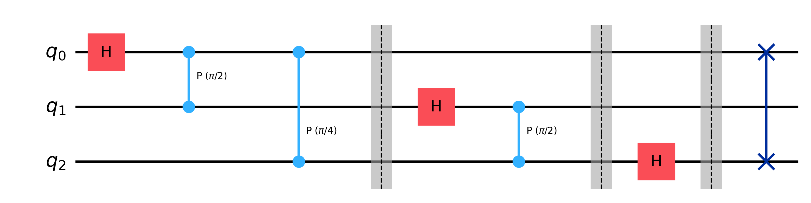

## Mục lục

Nội dung của bài này bao gồm:

- [1. Biến đổi Fourier rời rạc](#1-biến-đổi-fourier-rời-rạc)
  - [1.1. Bài toán](#11-bài-toán)
  - [1.2. Định nghĩa Toán học của DFT](#12-định-nghĩa-toán-học-của-dft)
- [2. Biến đổi Fourier lượng tử](#2-biến-đổi-fourier-lượng-tử)
  - [2.1. QFT chính là một Toán tử xoay pha $U_{QFT}$](#21-qft-chính-là-một-toán-tử-xoay-pha-uqft)
  - [2.2. Các cổng xoay pha thực chất là các cổng $CU$](#22-các-cổng-xoay-pha-thực-chất-là-các-cổng-cu)
  - [2.3. Ý nghĩa của QFT](#23-ý-nghĩa-của-qft)
  - [2.4. Kết luận](#24-kết-luận)
- [3. Tham khảo](#3-tham-khảo)

 

Trong lĩnh vực tính toán lượng tử, Quantum Fourier Transform (QFT) không chỉ là một phép toán căn bản mà là "trái tim" kiến tạo nên sự vượt trội lượng tử (quantum advantage). Nó là sự mở rộng của phép biến đổi Fourier rời rạc (DFT - thường được dùng trong phân tích tín hiệu số), QFT chuyển đổi thông tin sang miền tần số bằng cách thao tác trực tiếp trên các biên độ xác suất của trạng thái chồng chập lượng tử.

Điểm đột phá mang tính cách mạng của QFT nằm ở độ phức tạp tính toán: nó mang lại sự tăng tốc theo cấp số nhân, tối ưu hóa từ mức $O(n 2^n)$ của thuật toán Fast Fourier Transform (FFT) cổ điển xuống chỉ còn $O(n^2)$ đối với hệ thống $n$ qubit. Về mặt ứng dụng, QFT không nhắm đến việc xử lý tín hiệu thông thường. Sức mạnh cốt lõi của nó là khả năng trích xuất chu kỳ và pha tinh vi từ các hàm toán học ẩn. Đặc tính này biến QFT thành động cơ chính bên trong thuật toán Shor và thuật toán Ước lượng Pha Lượng tử (QPE), đánh dấu bước ngoặt cho mật mã học và hóa học lượng tử.

## 1. Biến đổi Fourier rời rạc

Vì bản chất của Quantum Fourier Transform là phiên bản lượng tử của Discrete Fourier Transform nên tôi muốn chúng ta hiểu thật kỹ phép biến đổi Fourier rời rạc này trước. Vậy để đơn giản hãy cùng bắt đầu với một ví dụ thực tế trong đời sống hàng ngày của chúng ta.

> **Ví dụ thực tế:**
> 
> Chắc hẳn trong chúng ta ai cũng đã từng tham gia một buổi trình diễn âm nhạc của các thần tượng đúng không. Trên sân khấu ngoài giọng hát của ca sĩ còn có những nghệ sĩ chơi đàn, trống, … sự tổng hợp của các nhạc cụ và giọng hát của ca sĩ lan truyền qua không khí dưới dạng sóng âm, sóng âm này gây ra sự giao động của màng nhĩ và não bộ sẽ phân tích sự giao động này để chúng ta có thể cảm nhận được âm nhạc. 
> 
> Các thiết bị ghi âm hiện nay như microphone cũng hoạt động tương tự dựa trên cơ chế này. Nhưng dù trong phòng thu có một dàn nhạc giao hưởng 50 người đang chơi cùng lúc, màng rung của microphone không có khả năng "nghe" từng nhạc cụ riêng biệt. Tại một phần ngàn giây bất kỳ, nó chỉ ghi nhận được **một con số duy nhất** – đại diện cho áp suất không khí tổng cộng đập vào màng rung tại thời điểm đó. Bản ghi âm số chính là mảng $x$ chứa hàng triệu con số biên độ tổng hợp này (ví dụ chuẩn CD lấy mẫu 44.100 lần mỗi giây). Nếu nhìn trực tiếp vào mảng dữ liệu này ở miền thời gian, nó chỉ là một biểu đồ dạng sóng nhiễu loạn, hỗn độn.

Đây chính là lúc chúng ta cần sử dụng DFT. Vậy DFT sẽ bóc tách “âm hưởng” như thế nào?

Khi áp dụng DFT lên mảng dữ liệu hỗn độn này, thứ chúng ta nhận được là phổ tần số. DFT không trực tiếp xuất ra cho chúng ta "đoạn thu của riêng cây piano" (đó là bài toán phân tách nguồn âm - Blind Source Separation phức tạp hơn), nhưng nó chỉ ra chính xác **thành phần tần số nào đang tồn tại và chiếm ưu thế**.

Bởi vì mỗi nhạc cụ có một dải tần hoạt động và cấu trúc họa âm (harmonics - tạo nên âm sắc) rất đặc trưng:

* Âm trầm của trống Bass sẽ xuất hiện thành một đỉnh (peak) lớn ở dải tần số thấp (khoảng 40-80 Hz).  
* Tiếng leng keng của chũm chọe (cymbal) sẽ hiển thị ở dải tần số rất cao (trên 5000 Hz).  
* Giọng hát của ca sĩ nằm ở dải trung.

DFT giống như một lăng kính quang học: ta chiếu một chùm ánh sáng trắng (âm thanh tổng hợp) đi qua, và nó tách chùm sáng đó thành bảy sắc cầu vồng (các dải tần số cấu thành). Vậy ta cùng đến với cơ chế toán học của DFT.

### 1.1. Bài toán

Giả sử hệ thống máy tính (hoặc máy ghi âm) của chúng ta lấy mẫu được một chuỗi tín hiệu gồm $N$ điểm dữ liệu. Chuỗi này được biểu diễn dưới dạng một vector cột (hoặc mảng) trong không gian $N$ chiều:

$$
x = (x_0, x_1, \dots, x_{N-1}) \tag{1.1}
$$

* Mỗi chỉ số $j$ (từ $0$ đến $N-1$) đại diện cho một bước thời gian (time step).  
* Giá trị $x_j$ đại diện cho biên độ của tín hiệu tại thời điểm $j$. Đây có thể là số thực (như áp suất âm thanh) hoặc số phức.

Mục tiêu của DFT là ánh xạ vector $x$ này sang một vector mới $y$ chứa thông tin về các tần số cấu thành nên nó.

### 1.2. Định nghĩa Toán học của DFT

DFT biến đổi vector đầu vào $(1.1)$ của chúng ta thành một vector đầu ra ở miền tần số $y = (y_0, y_1, \dots, y_{N-1})$, trong đó giá trị của mỗi thành phần $y_k$ của vector đầu ra được tính thông qua phương trình:

$$
y_k = \frac{1}{\sqrt{N}} \sum_{j=0}^{N-1} x_j e^{2\pi i j k / N} \tag{1.2}
$$

Công thức trên trông có vẻ phức tạp, nhưng thực chất nó là một phép **tích vô hướng (dot product)** giữa tín hiệu gốc và các "sóng mẫu". Hãy cùng mổ xẻ từng thành phần:

#### **A. Thành phần đầu ra $y_k$ (Biên độ Tần số)**

* Chỉ số $k$ (chạy từ $0$ đến $N-1$) đại diện cho một "bin" tần số cụ thể.  
* Giá trị $y_k$ là một số phức. Độ lớn (magnitude) của nó là $|y_k|$, cho biết **tần số $k$ này xuất hiện mạnh đến mức nào** trong tín hiệu gốc $x$.

#### **B. Hàm cơ sở $e^{2\pi i j k / N}$ (Chiếc Lăng kính)**

Trong công thức Euler $e^{i\theta} = \cos(\theta) + i\sin(\theta)$, góc $\theta$ đại diện cho một vị trí trên vòng tròn đơn vị (vòng tròn có bán kính bằng 1). Một vòng quay hoàn chỉnh tương đương với $2\pi$ radian (360 độ).

Trong DFT, góc $\theta$ của chúng ta là $\frac{2\pi j k}{N}$. Hãy chia nhỏ nó ra để xem bánh răng này hoạt động thế nào:

* **Hằng số $2\pi$:** Định nghĩa một vòng quay hoàn chỉnh.  
* **Tỷ lệ $\frac{j}{N}$ (Trục thời gian):** Nhắc lại rằng $N$ là tổng số mẫu dữ liệu, còn $j$ là bước thời gian hiện tại (chạy từ $0$ đến $N-1$). Vậy $\frac{j}{N}$ chính là phần trăm thời gian đã trôi qua. Khi $j$ chạy từ đầu đến cuối mảng dữ liệu, tỷ lệ $\frac{j}{N}$ chạy từ $0$ đến gần $1$.  
* **Biến $k$ (Tốc độ / Tần số):** Đây là hệ số nhân. Nó quyết định xem khi $\frac{j}{N}$ chạy hết một chu kỳ dữ liệu, thì cái điểm trên vòng tròn đơn vị sẽ quay được **bao nhiêu vòng**.

Bây giờ, hãy xem điều gì xảy ra khi máy tính cho $k$ thay đổi (thay đổi lăng kính để so khớp):

* **Khi $k = 1$:** Sóng cơ sở là $e^{2\pi i j (1) / N}$. Trong suốt thời gian thu thập $N$ mẫu, hàm này quay đúng **1 vòng** hoàn chỉnh. Tức là nó tạo ra một sóng hình sin (và cosin) dao động với chu kỳ dài bằng toàn bộ khoảng thời gian lấy mẫu.  
* **Khi $k = 2$:** Sóng là $e^{2\pi i j (2) / N}$. Do bị nhân đôi tốc độ, hàm này sẽ quay được **2 vòng** hoàn chỉnh trong cùng khoảng thời gian $N$. Sóng lúc này "dày đặc" gấp đôi.  
* **Khi $k = 100$:** Hàm này quay rất nhanh **100 vòng**, tạo ra một sóng có tần số rất cao.

Như vậy, bộ lăng kính của chúng ta chính là một tập hợp các sóng dao động hoàn hảo, từ rất chậm ($k=1$) đến rất nhanh ($k=N/2$).

#### **C. Toán tử Tổng $\sum_{j=0}^{N-1}$ (Phép so khớp / Tích vô hướng)**

Toán tử này nhân từng mẫu tín hiệu $x_j$ với giá trị của sóng cơ sở tại cùng thời điểm $j$, sau đó cộng dồn tất cả lại. Ý nghĩa cốt lõi của phép toán này là sự **Giao thoa (Interference)**, hãy nhìn phép so khớp này dưới hai góc nhìn sau:

> **Góc nhìn Vật lý: Bài toán "Đẩy Xích đu" (Cộng hưởng)**
> 
> Thực chất, phép tổng $\sum$ trong phương trình Fourier hoạt động y hệt nguyên lý cộng hưởng trong vật lý cơ học.
> 
> Hãy tưởng tượng ta đang nhắm mắt và đứng cạnh một chiếc xích đu. Nhiệm vụ của ta là kiểm tra xem chiếc xích đu đang dao động với chu kỳ bao nhiêu (đây chính là biến $k$ – tần số thử nghiệm).
> 
> * **Tín hiệu $x_j$:** Chính là lực đẩy của một người vô hình nào đó lên chiếc xích đu tại mỗi giây $j$.  
> * **Sóng cơ sở (Chiếc lăng kính):** Chính là nhịp điệu tay của bạn đưa ra đẩy tới và kéo về.
> 
> **Trường hợp Lệch pha (Không khớp tần số):**
> 
> Giả sử xích đu đang đung đưa rất chậm (tần số 1 Hz), nhưng ta lại thử nghiệm bằng cách đưa tay đẩy thóp liên tục thật nhanh (tần số 3 Hz, tức $k=3$).
> 
> Điều gì xảy ra? Sẽ có lúc tay ta đẩy trúng lúc xích đu đang đi tới (lực cộng dồn, giá trị dương). Nhưng ngay tích tắc sau, vì ta đẩy quá nhanh, tay ta lại đẩy tới đúng lúc xích đu đang dội ngược về (lực triệt tiêu, giá trị âm).
> 
> Sau một hồi đẩy ($N$ thời điểm), những lần đẩy trúng và trật sẽ **triệt tiêu lẫn nhau hoàn toàn**. Chiếc xích đu không bay cao hơn. Tổng năng lượng ta truyền vào bằng $0$. Phương trình kết luận: $y_3 = 0$ (Không có tần số 3 Hz).
> 
> **Trường hợp Cộng hưởng (Khớp tần số):**
> 
> Bây giờ, ta thử đổi nhịp tay, đẩy chậm lại đúng bằng nhịp của xích đu ($k=1$).
> 
> Lúc này, mỗi lần xích đu đi tới, tay bạn đẩy thêm một lực. Mỗi lần xích đu lùi về, tay ta kéo hùa theo. Tất cả các lực tại mọi thời điểm $j$ đều **cùng chiều** với chuyển động. Năng lượng liên tục được cộng dồn ($\sum$), xích đu vút lên cao nhất. Giá trị tổng này đạt mức cực đại. Phương trình kết luận: Tần số này có tồn tại và rất mạnh!

---

> **Góc nhìn Đồ thị Toán học: Phép nhân hai làn sóng (Tích vô hướng)**
> 
> Bây giờ, hãy nhìn nó dưới dạng đồ thị 2D thuần túy trên trục tọa độ. Phép toán cốt lõi bên trong dấu $\sum$ thực chất chỉ là: **Lấy giá trị của sóng tín hiệu NHÂN với giá trị của sóng thử nghiệm, rồi TÍNH TỔNG (diện tích dưới đồ thị).**
> 
> Giả sử tín hiệu gốc $x$ của ta là một sóng hình sin hoàn hảo có tần số là **3 Hz**.
> 
> * **Thử nghiệm sai ($k=4$ Hz):** >   Máy tính lấy đồ thị sóng 3 Hz nhân với đồ thị sóng 4 Hz tại từng điểm $j$.  
>   Vì hai sóng này lệch nhịp nhau, sẽ có những đoạn cả hai cùng dương (dương $\times$ dương = dương), hoặc cùng âm (âm $\times$ âm = dương). Nhưng cũng sẽ có những đoạn sóng này đang chóp dương thì sóng kia đã tụt xuống âm (dương $\times$ âm = âm).  
>   Đồ thị kết quả sau khi nhân sẽ uốn lượn nhấp nhô, lúc nằm trên trục hoành, lúc nằm dưới trục hoành một cách đối xứng. Khi ta tính tổng ($\sum$) toàn bộ các giá trị này, phần diện tích dương và âm sẽ bù trừ cho nhau, kết quả **bằng 0**.  
> * **Thử nghiệm đúng ($k=3$ Hz):** >   Máy tính lấy đồ thị sóng 3 Hz nhân với chính một sóng 3 Hz khác.  
>   Lúc này, hai sóng hoàn toàn đồng bộ.  
>   Khi sóng tín hiệu dương, sóng thử nghiệm cũng dương $\rightarrow$ Kết quả nhân là DƯƠNG.  
>   Khi sóng tín hiệu âm, sóng thử nghiệm cũng âm $\rightarrow$ Âm $\times$ Âm = DƯƠNG!  
>   Sự kỳ diệu nằm ở đây: **Đồ thị kết quả sau khi nhân bị lật toàn bộ lên phía trên trục hoành.** Không còn bất kỳ giá trị âm nào để bù trừ nữa. Khi thực hiện phép tổng $\sum$, ta đang cộng dồn một loạt các số dương lại với nhau, tạo ra một con số khổng lồ (chính là $y_3$).

**Kết luận:** Phép tổng $\sum$ đóng vai trò như một màng lọc. Chỉ khi sóng thử nghiệm $k$ "vào hùa" (đồng bộ pha) với một thành phần bên trong tín hiệu gốc, phép nhân mới tạo ra toàn số dương để tích lũy thành một biên độ lớn. Mọi sự lệch nhịp đều dẫn đến triệt tiêu toán học.

Nhưng trong các ví dụ phía trên ta luôn giả định sóng đầu vào chỉ tồn tại ở một tần số duy nhất, tuy nhiên thực tế $x_j$ luôn là sóng được tổng hợp từ nhiều thành phần tần số khác nhau. Vậy trong trường hợp sóng ban đầu là tổng của hai sóng 3Hz và 4Hz trong đó sóng 3Hz có biên độ lớn hơn 4Hz rất nhiều có thể khiến cho phép lấy tổng của chúng ta sai lệch hay không?

Câu trả lời là **KHÔNG,** điều này đến từ một trong các tính chất quan trọng nhất của Đại số tuyến tính và là cũng là lý do cốt lõi khiến phép biến đổi Fourier trở thành công cụ vĩ đại: **Tính Trực giao (Orthogonality)** và **Tính Tuyến tính (Linearity)**.

Dù thành phần 3 Hz có biên độ (âm lượng) khổng lồ, lớn gấp hàng triệu lần thành phần 4 Hz, thì khi ta "thử nghiệm" ở tần số $k=4$, hệ thống vẫn sẽ bóc tách và trả về chính xác biên độ nhỏ bé của 4 Hz mà không hề bị sóng 3 Hz đè bẹp hay làm sai lệch thành $0$.

#### **Tính Tuyến tính (Bóc tách độc lập):**

Phép biến đổi Fourier là một toán tử tuyến tính. Nghĩa là, nếu tín hiệu đầu vào $x_j$ của ta là tổng của hai sóng:

$$
x_j = \text{Wave}_{3Hz} + \text{Wave}_{4Hz}
$$

Khi bạn đưa tín hiệu tổng hợp này vào máy tính để nhân với sóng thử nghiệm 4 Hz và tính tổng ($\sum$), toán học cho phép ta tách biểu thức đó ra làm hai phần hoạt động hoàn toàn độc lập:

$$
\begin{aligned}
\sum \left( (\text{Wave}_{3Hz} + \text{Wave}_{4Hz}) \times \text{Test}_{4Hz} \right) &= \underbrace{\sum (\text{Wave}_{3Hz} \times \text{Test}_{4Hz})}_{\text{Part 1}} + \underbrace{\sum (\text{Wave}_{4Hz} \times \text{Test}_{4Hz})}_{\text{Part 2}}
\end{aligned}
$$

#### **Sự "Miễn nhiễm" nhờ Tính Trực giao (Orthogonality):**

Toàn bộ bí mật nằm ở **Phần 1**.

Trong không gian toán học của Fourier, tất cả các sóng cơ sở (với các tần số nguyên $k$ khác nhau) đều **trực giao** với nhau. Từ "trực giao" ở đây mang ý nghĩa là sự độc lập tuyệt đối.

Khi ta nhân một sóng 3 Hz với một sóng thử nghiệm 4 Hz (như chúng ta đã phân tích ở trường hợp lệch pha) và tính tổng trên một khung thời gian $N$ chuẩn, diện tích phần đồ thị nằm trên trục hoành (giá trị dương) sẽ bằng **chính xác 100%** diện tích phần đồ thị nằm dưới trục hoành (giá trị âm).

Do đó:

* **Phần 1** (Tác động của sóng 3 Hz lên kết quả đo 4 Hz) = Sự bù trừ hoàn hảo = $0$.  
* Điều quan trọng nhất là: Dù biên độ của sóng 3 Hz có lớn bằng quả núi, thì theo quy tắc nhân phân phối, một quả núi nhân với $0$ vẫn bằng $0$. Sóng 3 Hz hoàn toàn "vô hình" trước lăng kính thử nghiệm 4 Hz.  
* **Phần 2** (Tác động của sóng 4 Hz lên kết quả đo 4 Hz) = Cộng hưởng hoàn hảo. Các giá trị âm nhân âm thành dương, dương nhân dương thành dương. Kết quả sẽ tự động tích lũy và trả về chính xác biên độ của sóng 4 Hz (dù nó rất nhỏ bé).

**Ví dụ thực tế:**

Giống như ta dùng một chiếc radio chỉnh đúng tần số 99.9 MHz để nghe một đài phát thanh ở xa (tín hiệu cực yếu). Dù ngay sát vách nhà chúng ta có một tháp truyền hình đang phát sóng với công suất khổng lồ ở tần số 100.1 MHz, chiếc radio của chúng ta (hoạt động dựa trên sự cộng hưởng trực giao) sẽ hoàn toàn "phớt lờ" đài truyền hình kia và chỉ thu nhận tín hiệu yếu ớt ở 99.9 MHz.

#### **D. Hệ số Chuẩn hóa $\frac{1}{\sqrt{N}}$ (Nền tảng cho Lượng tử)**

Hệ số này đảm bảo rằng tổng năng lượng của tín hiệu ở miền thời gian bằng với tổng năng lượng ở miền tần số (Định lý Parseval): $\sum |x_j|^2 = \sum |y_k|^2$. Trong điện toán lượng tử, điều này là bắt buộc vì ma trận biến đổi phải là Unitary, đảm bảo tổng xác suất của hệ thống luôn bằng $1$.

Ta có thể hình dung DFT như một quá trình chất vấn tín hiệu: Nó cầm lần lượt từng sóng cơ sở (với tần số $k=0, 1, 2, \dots$) đến hỏi tín hiệu $x$ rằng: *"Bạn có giống sóng này không, và giống bao nhiêu phần?"*. Câu trả lời cho mỗi lần hỏi chính là giá trị $y_k$. Máy tính cổ điển thực hiện điều này bằng cách chạy vòng lặp nhân và cộng ma trận khổng lồ.
## 2. Biến đổi Fourier lượng tử

Ở phần phía trên chúng ta đã hiểu rõ về sự quan trọng của DFT trong phân tích tín hiệu số, bây giờ chúng ta hãy cùng xem tại sao DFT lại quan trọng đến vậy trong điện toán lượng tử.

Để thiết lập sự tương đương toán học giữa xử lý tín hiệu số và điện toán lượng tử, ta có thể thực hiện phép ánh xạ dữ liệu cổ điển vào không gian trạng thái lượng tử. Xét một tín hiệu âm thanh đầu vào, bản chất của nó là một chuỗi rời rạc các biên độ vật lý theo miền thời gian, trong đó mỗi mốc thời gian được đặc trưng bởi một chỉ số rời rạc $j$.

Tương tự, trong hệ thống thông tin lượng tử, một hệ gồm $n$ qubit được định nghĩa trong không gian Hilbert có chiều $N = 2^n$. Thay vì lưu trữ từng giá trị tuần tự, thông tin của toàn bộ phổ âm thanh có thể được nhúng vào một trạng thái lượng tử duy nhất thông qua sự chồng chập. Trong cấu trúc này, mốc thời gian $j$ của hệ thống cổ điển được ánh xạ trực tiếp một - một với trạng thái cơ sở tính toán $|j\rangle$. Đồng thời, giá trị biên độ của tín hiệu tại thời điểm đó đóng vai trò tương đương với biên độ xác suất phức $\alpha_j$ của cơ sở $|j\rangle$.

Mô hình toán học của sự chồng chập này được biểu diễn dưới dạng:

$$
|\psi\rangle = \sum_{j=0}^{N-1} \alpha_j |j\rangle \tag{2.1}
$$

Sự khác biệt cốt lõi ở phép ánh xạ này nằm ở hai điều kiện biên. Thứ nhất, trong khi biên độ tín hiệu âm thanh là các giá trị thực đo lường dao động vật lý, biên độ xác suất lượng tử $\alpha_j$ là các số phức, chứa đựng thông tin về pha – yếu tố quyết định tạo ra hiện tượng giao thoa lượng tử. Thứ hai, hệ lượng tử bị ràng buộc bởi định luật bảo toàn xác suất, đòi hỏi tổng bình phương độ lớn của toàn bộ các biên độ phải tuân thủ điều kiện chuẩn hóa:

$$
\sum_{j=0}^{N-1} |\alpha_j|^2 = 1 \tag{2.2}
$$

Khung lý thuyết này cho thấy trạng thái chồng chập lượng tử về cơ bản chính là một phiên bản mã hóa của dữ liệu chuỗi thời gian và phép biển đối DFT trên không gian trạng thái này chính là **QFT (Quantum Fourier Transform)** trong điện toán lượng tử.

Vậy bản chất của QFT là gì?

### 2.1. QFT chính là một Toán tử xoay pha $U_{QFT}$

Trong cơ học lượng tử, mọi thao tác (trừ phép đo) đều là các phép biến đổi tuyến tính thuận nghịch, được biểu diễn bằng một ma trận Unitary $U$. Khi tác dụng lên một trạng thái cơ sở $|j\rangle$, toán tử $U_{QFT}$ thực chất không làm thay đổi "độ lớn" của xác suất (vì phân bố đầu ra là một trạng thái chồng chập đều). Tuy nhiên, nhờ tính tuyến tính, khi áp dụng lên một hệ đang chồng chập sẵn, nó sẽ tạo ra sự giao thoa cộng gộp và triệt tiêu, làm thay đổi đáng kể biên độ xác suất để khuếch đại các trạng thái mang thông tin chu kỳ.

Với trạng thái cơ sở $|j\rangle$, toán tử này áp dụng một hàm xoay pha cụ thể:

$$
U_{QFT} |j\rangle = \frac{1}{\sqrt{N}} \sum_{k=0}^{N-1} e^{\frac{2\pi i j k}{N}} |k\rangle \tag{2.3}
$$

Như ta thấy, phần lõi $e^{\frac{2\pi i j k}{N}}$ chính là hàm xoay pha $U_f$ mà chúng ta đã học ở các bài trước.

### 2.2. Các cổng xoay pha thực chất là các cổng $CU$

Về mặt kiến trúc phần cứng, toán tử biến đổi lượng tử $U_{QFT}$ không được triển khai dưới dạng một cổng logic nguyên khối (monolithic gate) mà buộc phải được phân rã thành một chuỗi các cổng lượng tử cơ sở.

Trong cấu trúc này, cơ chế "xoay pha tăng dần" được thực thi thông qua họ các cổng điều khiển xoay pha (Controlled-Phase gates, ký hiệu là $CR_k$). Bản chất của $CR_k$ là một biến thể của cổng điều khiển $CU$ (Controlled-$U$), trong đó toán tử mục tiêu $U$ được xác định cụ thể là ma trận xoay pha $R_k$:

$$
R_k = \begin{bmatrix} 1 & 0 \\ 0 & e^{\frac{2\pi i}{2^k}} \end{bmatrix} \tag{2.4}
$$

Việc kiến tạo nên hàm nhân Fourier diễn ra khi ta mắc nối tiếp chuỗi các cổng $CR_k$. Khi chỉ số $k$ tăng lên, hệ thống sẽ thực hiện các phép xoay với góc pha giảm dần theo lũy thừa của 2 ($\frac{\pi}{2}, \frac{\pi}{4}, \frac{\pi}{8}, \dots$). Dựa trên nền tảng đại số của hàm mũ phức, trong đó $e^A \cdot e^B = e^{A+B}$, việc áp dụng liên tiếp toán tử $CR_k$ thực chất là một quá trình tích lũy tuyến tính. Mạch lượng tử sẽ cộng dồn các góc xoay pha rời rạc này lại với nhau, từ đó tổng hợp thành công thành phần pha phức hợp $e^{\frac{2\pi i j k}{N}}$ cấu thành nên hạt nhân của thuật toán QFT.

  
*(Hình 2.1. Minh họa một mạch QFT đơn giản)*

### 2.3. Ý nghĩa của QFT

Việc áp dụng đơn lẻ các toán tử $CR_k$ lên một trạng thái cơ sở thuần túy (chẳng hạn như trạng thái $|101\rangle$) sẽ chỉ dẫn đến sự dịch chuyển pha cục bộ (tức là nhân thêm một hệ số pha $e^{i\theta}$). Quá trình này hoàn toàn không làm thay đổi biên độ, và do đó, không sinh ra bất kỳ sự phân bố xác suất mới nào trên không gian trạng thái. Sự tinh tế và sức mạnh thực sự của QFT nằm ở kiến trúc lặp (iterative architecture) đan xen chặt chẽ giữa hai cơ chế cốt lõi:

1. **Khởi tạo chồng chập (Superposition Initialization):** Áp dụng cổng Hadamard ($H$) lên qubit hiện tại để phá vỡ tính tất định của trạng thái cơ sở, tạo ra một sự chồng chập kết hợp. Thao tác này đóng vai trò mở rộng không gian Hilbert, thiết lập một "bức tranh nền" chứa toàn bộ các nhánh xác suất cần thiết để hệ thống có thể lưu trữ thông tin pha.  
2. **Điều chế pha có kiểm soát (Conditional Phase Modulation):** Kích hoạt chuỗi các cổng $CR_k$ mắc nối tiếp để thực hiện quá trình "điêu khắc pha" trên các nhánh chồng chập vừa được tạo ra. Sự can thiệp pha này không độc lập mà bị chi phối trực tiếp bởi trạng thái của các qubit đứng sau nó, thiết lập nên một mạng lưới tương quan pha phức tạp và chính xác giữa các phần tử trong hệ.

Chu trình vi mô này được lặp lại tuần tự trên thanh ghi lượng tử (quantum register) từ qubit có ý nghĩa cao nhất đến thấp nhất. Chính sự kết hợp mang tính chu kỳ giữa việc liên tục mở rộng không gian xác suất (qua cổng $H$) và định hình giao thoa (qua các cổng $CR_k$) đã biến QFT thành một trong những biến đổi tinh xảo nhất của điện toán lượng tử.

### 2.4. Kết luận

Nói chung QFT có thể được coi là phiên bản “lượng tử” của DFT trong không gian trạng thái của các Qubit. Cụ thể:

* **Về không gian vật lý:** DFT hoạt động trên một mảng dữ liệu một chiều thông thường trong bộ nhớ tĩnh. QFT thì hoạt động trong **không gian Hilbert** — nơi chứa đựng vector trạng thái nhiều chiều mô tả mọi khả năng tồn tại của toàn bộ hệ qubit.  
* **Về bản chất dữ liệu:** Thay vì xử lý các giá trị biên độ thực rời rạc, phiên bản lượng tử này áp dụng biến đổi Fourier trực tiếp lên các **biên độ xác suất** (các số phức chứa đựng thông tin về pha).  
* **Về cách thức vận hành:** Phép nhân ma trận khô khan của thuật toán tính toán cổ điển được vật lý hóa thành một **toán tử Unitary** ($U_{QFT}$), chi phối trực tiếp sự tiến hóa của hệ thống thông qua các cổng giao thoa và xoay pha.

Vậy ở bài này chúng ta đã tìm hiểu xong về Quantum Fourier Transform, ở bài tiếp theo chúng ta sẽ tìm hiểu về ứng dụng tuyệt vời nhất của QFT trong điện toán lượng tử đó chính là Thuật toán Shor (Phá mã RSA). Hẹn bạn đọc ở bài tiếp theo.

---

## 3. Tham khảo

**Tiếng Anh**

1. **Cleve, R., Ekert, A., Macchiavello, C., & Mosca, M. (1998).** *Quantum algorithms revisited*. Proceedings of the Royal Society of London. Series A: Mathematical, Physical and Engineering Sciences, 454(1969), 339-354. ([https://arxiv.org/abs/quant-ph/9708016](https://arxiv.org/abs/quant-ph/9708016))  
2. **Coppersmith, D. (1994).** *An approximate Fourier transform useful in quantum factoring*. IBM Research Report RC 19642. (https://arxiv.org/abs/quant-ph/0201067)

[image1]: <data:image/png;base64,iVBORw0KGgoAAAANSUhEUgAAAAwAAAAPBAMAAAAizzN6AAAAMFBMVEX///8AAAAAAAAAAAAAAAAAAAAAAAAAAAAAAAAAAAAAAAAAAAAAAAAAAAAAAAAAAAAv3aB7AAAAD3RSTlMAELvvZjKJIqvNRFSZ3Xbg+Mk9AAAAEUlEQVR4XmP8zwACTGCSlhQAbigBHV8/R9QAAAAASUVORK5CYII=>

[image2]: <data:image/png;base64,iVBORw0KGgoAAAANSUhEUgAAAnAAAACdCAYAAAA0VkXWAAAbbUlEQVR4Xu3dC6wc1WHGcWywIS5WIWCbNgkIqGLHxTQy4SnVQMEWdhVF5eUEkhQig3hEiZ0HCk1aIkLAUhveSUhkEiemjk2EwRATIoNSCBUFY4ONw9MC81CDDeaCjV/3Nc0ZuuuZ7+ydM3P3zOzMzv8nfdq9Z2cvl3P3nPvdnfXevQIAAABUyl46AAAAgHKjwAEAAFQMBQ4AAKBiKHAAAAAVQ4EDAACoGAocAABAxVDgAAAAKoYCBwAAUDEUOAAAgIqhwAEAAFQMBQ4AAKBiKHAAAAAVQ4EDAACoGAocAABAxVDgAAAAKoYCBwAAUDEUOAAAgIqhwAEAAFQMBQ5AoZ544onE7LXXXtaYBsjTyy+/bD3mopk8ebI1pkGczo/Gte5ffPFF/ZS1R4EDUCjdmDWujdwEyBMFzj+dH41r3VPgbBQ4AIXSjVnj2shNgDxR4PzT+dG41j0FzkaBA1Ao3Zg1Z511ljWmAfLkKnBf/vKXrTEN4nR+NK51T4GzUeAAFEo35uEEyJOrwKUJ4nR+soYCZ6PAASiUbswa16kUEyBPrgLHKdTsdH40rnVPgbNR4AAUSjdmjWsjNwHyRIHzT+dH41r3FDgbBS6i/8cLgt5Pn1togp079csAuppuzBrXRm4C5IkC55/Oj8a17ilwNgpcBAUOyJ9uzMMJkCdXgUsTxOn8ZA0FzkaBi6DAAfnTjXk4AfJEgfNP5ydrKHA2ClwEBQ7In27MGtepFBMgT64CxynU7HR+NK51T4GzUeAiKHBA/nRj1rg2chMgTxQ4/3R+NK51T4GzUeAiKHBA/nRj1rg2chMgTxQ4/3R+NK51T4GzUeAiKHBA/nRjHk6APLkKXJogTucnayhwNgpcBAUOyJ9uzMMJkCcKnH86P1lDgbNR4CIocED+dGPWuE6lmAB5chU4TqFmp/Ojca37ogvcXlMWhNn4v9v0Jkvj2A2vvac35YoCF5GlwP3H334yfMDpeKuxpFS9wC19OQh+8MyfF+dbeguGo38gCG5cHwQ/fT4Itvbqrd1BN2aNayM3AfJEgfNP50fjWvdFF7gv/dsjzWL2xpvv681NB0+7IzzmyFl36k25K22BmzJlSvgNNTn//PODG264IbyeJwpceqZgHLM8nmPvDYLeAT0SaZ16vz2nX/qDHlV9ujFrXBu5CZAnCpx/Oj8a17ovusAZc676Q7PEtTL+5A/K26EzluhNhci3EQ2T+UZeeumlzY/NYjFjI0aMiBzlHwUunVNaFI1onntX74EkfYP2HGq6iW7MwwmQJ1eBSxPE6fxkTScKnNGzdbf1TFxv30Bz7K//YbHcozilK3Df+ta3gnHjxsXG+vr6wmI0b9682LhvFDg3c1pPy0WrIL2Zv7PnT3P3Rr1XdenGrJk4caI1pgHy5CpwZ5xxhjWmQZzOj8a17jtV4IxoiTOviWtcP2LmUj20UKUrcKYAmcKmzPi6deuaH1977bXh2P777x8MDg5Gjmzts5/9rDP3nznbKlhDpVHgWkWPTco/z55tfR1lzj/e8DurXLSK3o8MHZ27Vjl2+aB1v6rmuuuuS4xZQzqm0c9JiM9885vftB5z0Xz0ox+1xjT6OesenR+Na91feeWV1ucsMqMPv6hZ3MJMzO97vGPHDq0wLZWywKm33347Nv7kk082P37llVda3kdpyWqVm6dMtQrWUPH1DNxf7L2P9XWUOZOuf9IqF60ycvSHrPuS1tG5Gyp6v6pmzpw5iUl7DCF5Zdq0adZjLhpzlkjHNPo56x6dH43rmOnTp1ufs/Ac9dM9BU5v85itW7dqhWnJ3XwKZr54NWrUqNi4uf7cc8/FPn722WebHw8Xp1DdVr1lF4tWQXo6d61yYRf9YwY9NaI54IADrDENkCfXKdTjjjvOGtMgTudH41r3nTyFasSeffv/vJriLUbyZLelDjMFaNeuXc2PBwYGwrHx48fHjon6xCc+ESxbtiw2NhwUuHS0XGi+8LDeA0keedOeQ83Ofr1XdenGPJwAeXIVuDRBnM5P1nSywB3894vCwvax6b8KL/9p7spmiXs94S1G8la6Ajd16tSwBJ100klhMWs8pfjtb3+7eYwWuEmTJlHgCvTHHrtgRIPsTvutPY+NXP2UHl1tujFrzOuLdEwD5MlV4E455RRrTIM4nR+Na913qsBNOOU/w6J22IwlweYtO8PrL7++1fkWI0UoXYEzLrzwwmC//fYLFiz4YGJMKXrjjTeat5uP169fH/v4hRdeaH48XFkKnK9UscAZPbvtomFKCIbvqjX2nJpT1t1GN2aNWc86pgHy5CpwvA9cdjo/Gte670SBO+CkX8ZKWrTAGV/8l4fDj/f+5O3RuxWmlAVO6TNuprw1xsy/TNXbh4sCl12jaLxV7f+NUmnMabfSjVnj2shNgDxR4PzT+dG41n3RBa5R3KJvFaIFzoi+xUjRr4nz03xy1qqgLVy4MBw/8MADU72NSBoUuOwocP7VvcAddNBB1pgGyJOrwJ144onWmAZxOj8a17ovusCdNe9B633eWhU4w5xO/asOvKGv3YxKZtOmTcGjjz6qw7mgwGVHgfOv7gUuTYA8uQpcmiBO5ydrii5wrQxV4Dql9AWuSBS47Chw/tW9wLlOpZgAeXIVOE6hZqfzo3GtewqcjQIXQYHLjgLnHwUueSM3AfJEgfNP50fjWvcUOBsFLoIClx0Fzj8KXPJGbgLkiQLnn86PxrXuKXA2ClwEBS47Cpx/dS9wY8eOtcY0QJ5cBe5Tn/qUNaZBnM6PxrXuKXA2ClwEBS47Cpx/dS9waQLkyVXg0gRxOj9ZQ4GzUeAiKHDZUeD8q3uBc51KMQHy5CpwnELNTudH41r3FDgbBS6CApcdBc4/ClzyRm4C5IkC55/Oj8a17ilwNgoc2uIqcCtWrAjT32//NXbzN2yTbNy4MVi9enXw0EMPNcceeOCBP3feIf5jXYICl7yRmwB5osD5p/Ojca17CpyNAoe2uAqc+aPPhv41jd27dwff+973YmNRixcvDnbs2BFs2/bBnyaJ3t/89Y1uVvcClyZAnlwFLk0Qp/OTNRQ4GwUObUlb4M4+++zY+Ny5c5vXzTNxp59+ehjz51SMMWPGNG83Pv7xjzevH3XUUZFbug8Fzh0gTxQ4/3R+soYCZ6PAoS2uAnfEEUcE8+fPt56BGzFiRPP6IYccEl5u2bIlePDBB8PrJ510UvP2np6e2OnW7373u8GuXbuaH3ebuhc416kUEyBPrgLHKdTsdH40rnVPgbNR4NAWV4FrPAOnJk6c2LzeKHef//zng4GBgWD58uXB4OBgOPbDH/4wLIBRF1xwQezjbkOBS97ITYA8UeD80/nRuNY9Bc5GgUNbhlvgHnvssWDDhg3h9cMPPzy8NM/E9fX1BSNHjmweN2XKlODuu+8O06DP5nUbClzyRm4C5IkC55/Oj8a17ilwtu7+SYjcuQpcksbr3dRxxx2nQ03mX7Nec801OtxV6l7gjj32WGtMA+TJVeDMa3p1TIM4nR+Na91T4GwUOLSlnQKH1upe4Fy/iZsAeXIVOJ6By07nR+Na9xQ4GwUObaHA+UeBS97ITYA8UeD80/nRuNY9Bc5GgUNbKHD+UeCSN3ITIE8UOP90fjSudU+Bs1Hg0BYKnH91L3BpAuTJVeDSBHE6P1lDgbNR4NAWCpx/dS9wrt/ETYA8uQocz8Blp/Ojca17CpyNAoe2UOD8o8Alb+QmQJ4ocP7p/Ghc654CZ6PAoS0UOP8ocMkbuYlPvZ8+t/Cg3Chw/un8aFzrngJno8ChLRQ4/yhwyRu5iU9arooIyo0C55/Oj8a17ilwNgoc2kKB86/uBS5NfNJyVURQbq4ClyaI0/nJGgqcjQKHtlDg/Kt7gXP9Jm7ik5arIoJycxU4noHLTudH41r3FDgbBQ5tocD5R4FL3shNfNJyVURQbhQ4/3R+NK51T4GzUeDQFgqcfxS45I3cxCctV0UE5UaB80/nR+Na9xQ4GwUObaHA+Vf3AnfjjTdaYxqftFwVEZSbq8AtWLDAGtMgTudH41r3FDgbBQ5tocD5V/cClyY+abkqIig3V4FLE8Tp/GQNBc5GgUNbKHD+1b3AuU6lmPik5aqIoNxcBY5TqNnp/Ghc654CZ6PAoS0UOP8ocMkbuYlPWq6SsmjqCcGvjjnRGr95ylRrLCkoNwqcfzo/Gte6p8DZSlvgenp6gqOPPjrYZ599gttvvz0cu/jii+UodEr/YBCccN+esmEy73E9CsNBgUveyE180nKVlIn7jw2m/uWB1rj5mnUsKVX10nvxNW9y/n/pUdVHgfNP50fjWvcUOFspC5x5MaP5Zk6YMCH4yU9+El7/yle+El6i8zbtsDfxRkypQ3vqXuCWLl1qjWl80nKVlDoXuIUv2uu9kfO6rMS5Ctw999xjjWkQp/Ojca17CpytlI2oVVEzY63GUazBwN68NcdT4tpS9wL3s5/9zBrT+KTlKil1LnC6zjXz1+o9qstV4JYsWWKNaRCn86NxrXsKnK10jWjWrFnBMccco8PhBjllypTmxwMDA8HChQuDRYsWRY4a2ubNm4mHLHl2m7Vxt4rej6RPt8/hI488khiz1nVMo5+znWi5SoopcI1fJjV6bFL0ayh7ntjYY63xVtH7VTVr1661HnPRTJo0yRrT6Oese3R+NK51v2bNGutzFp1nX3w9LHCr1r5i3eYzg4PmqRK30hW4cCPs7dXhcHzZsmWxj2fPnh2cfvrpkaOGppstGV4m/WCVtWm3yojR+1n3JenSmEMd75bMmTMnMWmP8RUtV0nx9Qycfg1lz8cuvsVa462i96tqpk2bZj3mohk3bpw1ptHPWffo/Ghcx0yfPt36nIVn77Fhgdtr1MH2bR6zdWu6Z/hKWeDU+++/H45v375db6LAFZxDL7vN2rRbRe9H0qfb51A3Zk3aY3xFy1VS6lrgDp4xx1rjraL3q2oocP6j86NxHUOBs9ltqcPMF//MM89YYyatpC1w8CPNa+COu1fvhSwa89it9LUtw4lPWq6S4qvAVZGuc81Va/Qe1eV6DVyaIE7nJ2t4DZytdSvqoHPOOSfcDJcvXx48/fTTwcEHHxyMGTOGAlciV66yN+9odvXrPZBFYx67lW7Mmuuuu84a0/ik5SopFLih001cBe7WW2+1xjSI0/nRuNY9Bc7WuhV1WPSpxJUrV4aXM2fO1MNCFLjOuOIJewM32cwb+ratG38gRunGrDHrXcc0Pmm5KiJVdfIKe81342PVVeB4H7jsdH40rnVPgbOVssAp841dt26dDococOg23fpDsUE3Zo1rIzfxSctVEam62b/v7scoBc4/nR+Na91T4GyVKXAq+ixd45k6oBtQ4JI3chOftFwVkaqjwE22xjSI0/nRuNY9Bc5mN6MSalXggG5V9wKXJj5puSoiVVf3ApcmiNP5yRoKnI1mBJRM3QvcFVdcYY1pfNJyVUSqru4Fbv78+daYBnE6PxrXuqfA2ShwQMnUvcC5TqWY+KTlqohUXd0LHKdQs9P50bjWPQXORoEDSoYCl7yRm/ik5aqIVB0FbrI1pkGczo/Gte4pcDYKHFAyFLjkjdzEJy1XRaTqKHCTrTEN4nR+NK51T4GzUeCAkql7gUsTn7RcFZGqq3uBSxPE6fxkDQXORoEDSqbuBc71m7iJT1quikjV1b3A8Qxcdjo/Gte6p8DZKHBAyVDgkjdyE5+0XBWRqqPATbbGNIjT+dG41j0FzkaBA0qGApe8kZt41dtXfCqOAjfZGtMgTudH41r3FDgbBQ4omaQCZza5X/ziF8GZZ54Z7NwZ/8Ozrje8jv494f333z+47bbbwuvz5s1rjhdBN2bNrFmzrDENOstV4C655JJgwYIFwciRI4OBgYHYbffdd1/s4yjzWHzhhReCGTNmBD/60Y+CU089tXnbnXfeGTkyX64Cd9FFF1ljGsTp/Ghc654CZ0ve8QEUzlXgGk477bTILUHwuc99LrzcuHFjeFwjV199dbBmzZrgrbfeCm/funVrsGHDhmaB6+/vDy6//PLm58mbbszDCTrLVeDuuOOO8HLx4sXBU0891RzfsmVL83r0Mdp4XJvCFxV9vO+9996RW/LlKnBpgjidn6yhwNkocEDJpClw5lmKtWvXxm4zP3Qa7r333vCycfxBBx3UvG3EiBGxAmeMGjWqeT1vujFrXKdSTNBZaQvchAkTgm3btjXHzz13z+v/brnllmDz5s3BXXfdFWzatCkcu+CCC5q3G+ZUZYPrGWafXAWOU6jZ6fxoXOueAmcrbkUASMVV4F599dXgzTff1JuC9957T4fCU63GoYceGl7Onj07PKWlBa7IH466MWtcG7kJOstV4G666abgtddeC3bv3h0bnz59evP68ccfH15OnTq1ORb14Q9/OPZxkY9RCpx/Oj8a17qnwNmKWxEAUnEVuKGcd9554eX9998fXq5cuTJYtWpVeF1/kOop1Msuuyx2e550Y9a4NnITdJarwDWegVN6CjV6aV43p7dFlekUKgUuO50fjWvdU+Bs9ioB0FFJBe7222/XoabGD72HHnoovOzt7Q1fg2SeCVHm2brnn38+vP71r39dbs2Xbsyar33ta9aYBp3lKnDmF4Sh/OY3vwkvf/7zn4eXy5YtC3p6epqvfzOnVc3jvJGGJUuWNK/nzVXgrrnmGmtMgzidH41r3VPgbBQ4oGSSClySHTt2hM+mZRV9kXkRdGPWuH4TN0FnuQpckuF8/4bzuG6Hq8DxDFx2Oj8a17qnwNkocEDJDLfAVYVuzBrXRm6CzmqnwFUBBc4/nR+Na91T4GwUOKBkKHDJG7kJOosCN9ka0yBO50fjWvcUOBsFDiiZuhe4e+65xxrToLPqXuBWrFhhjWkQp/Ojca17CpyNAgeUTN0LXJqgs+pe4NIEcTo/WUOBs1HggJKpe4FznUoxQWfVvcBxCjU7nR+Na91T4GwUOKBkKHDJG7kJOosCN9ka0/g0+P72oP/fbyo0g9ve1y+jLTo/Gte6p8DZKHBAyVDgkjdyE3QWBW6yNabxabCnJ+j99LmFZnDLO/pltEXnR+Na9xQ4GwUOKJm6F7g0QWfVvcCliU91KHCuUOBsFDigZOpe4L7xjW9YYxp0Vt0L3LXXXmuNaXyqQ4FzrXsKnI0CB5RM3Quc61SKCTqr7gWOU6jZ6fxoXOueAmejwAElQ4FL3shN0FkUuMnWmMYnChwFrhUKHFAyFLjkjdwEnUWBm2yNaXyiwFHgWqHAASVT9wKXJuisuhe4NPGpDgXOFQqcjQIHlEzdC9zs2bOtMQ06q+4F7qtf/ao1pvGpDgXOte6LLnDvbtsd/M+6TbGxoQrc9p19wW8ffT02VgQKHFAydS9wrlMpJuisuhc4TqFmp/Ojca37ogucKWomTz3/dnNsqALXOPYPq/8UG89bqQvcAw88EP5z7Ya+vr7IrUB3GRgMgi88vKfAzfydHtEddGPWuDZyE3TOv67e8xg94b4geP5dPaL6ql7gzBpqNXbF30yyxodK3Qvc9h19zWJ2zOy7wzEtcNu29zaPWf3sW9G7F6KUBe6dd94Jv5nRPP744+El0I0efXPPD0XNrn49utp0Y9a4NnITFG9br/3YbGRV8T+7ckWBo8AZ0YL22NpNsQL3fuS2dS9u0bsWopSNyHwjzzjjjObHL730UrPIAd1m94D9A1HTTXRjHk5QPH1MarqJq8CliU91KHCudKLAGTv//Bt0o6iteOS18PLZDT3NsU+e88Gzc51Qukb0/e9/Pxg/frwOhw++sWPHxsbWr18fDAwMxMaAqtEfhK1yyX/rvapLN2aN6zdxExRrR5/9mNQce6/eq7pcBa4Kz8C1SpkLnGvdd6rANTQKWzRrntvz+rhOKF2BGzlyZLBhwwYdDr+5N998c3h97ty5wejRo4PvfOc74eURRxwhR9v0gUxIWaI/CIeK3q+qmTNnTmLSHkOKy0e+ON96PLaK3q+qmTZtmvWYi2bcuHHWmEY/ZzsZP3pfq2AlxdznvVlnxWLGshS4Q/bdz/o62onOj8Z1zPTp063PWWhG7hsvcPt9zD7GU7ZuTfc2JaUrcOaLb8WMv/5663+ma27r7e3V4RidIELKEv0hOFT0flWNbsyatMeQ4vKRL15nPR5bRe9X1XRDgWs1RoFrIyNHxwvchw63j/GUripwn/nMZ1qON5jb+vu77JXeqA39Idgql3IKNRYUqzfF6zRNukU3nEJtNZalwHEKNa5R3P7u7GWcQh3KkUceGYwZM6b5sTltOmrUqCEL3L777htcfvnlOgxUhvlXpvqDUNNNdGMeTlA8fUxqBvUOFeYqcGniUx0KnCudKnCt3irEvHFvY6zxFiOd0LoVdVj0qcTDDjssvDz66KP1sGDRokXBaaedpsNA5ax+2/6B2Ih5AXk30Y1Z4/pN3ATF257wDxn+2KNHV5urwJX9GbhfTj2h5diTJ8+wxodK0QXOte47UeCi5W3tC/G3CtG3GOmEUhY4Zb6xt956a2xs2bJlQz4rB1RR/2AQnPXQnh+KJ6/QI7qDbswa10Zugs659ul4eXtzhx5RfVUvcD5S9wK3I/L2IUO9VUj0mCee2aw3564SDUiL2rnnfvB08MyZM5v505+K/RMWAIZHN2aNayM3AfJEgaPANYrZUyle59Y49vF1xZa4ShY4ANWlG7PmqquussY0QJ5cBe7666+3xjQ+1aHAudZ90QXu3a27gzUp/zyWOZ368JPFP4lEMwJQKN2YhxMgT64ClyY+1aHAuVJ0gasCChyAQunGrHGdSjEB8uQqcJxCzU7nR+Na9xQ4GwUOQKF0Y9a4NnITIE8UOApcFVDgABRKN2aNayM3AfJEgaPAVQEFDkChdGPWLF682BrTAHlyFbi77rrLGtP4VIcC51r3FDgbBQ5AoXRj1vz617+2xjRAnlwFbvny5daYxqc6FDjXuqfA2ShwAAqlG7PGdSrFBMiTq8BxCjU7nR+Na91T4GwUOACF0o1Z49rITYA8la7A7d4dDKz8faEZ3LVLv4y26PxoXOueAmejwAEolG7MGtdGbgLkqWwFrhvo/Ghc654CZ6PAASiUbszDCZAnV4FLE8Tp/GQNBc5GgQNQKN2YNQsXLrTGNECeXAVu6dKl1pgGcTo/Gte6p8DZKHAACqUbs8Z1KsUEyJOrwHEKNTudH41r3VPgbBQ4AIXSjVnj2shNgDxR4PzT+dG41j0FzkaBA1Ao3Zg1ro3cBMgTBc4/nR+Na91T4GwUOAAAgIqhwAEAAFQMBQ4AAKBiKHAAAAAVQ4EDAACoGAocAABAxVDgAAAAKoYCBwAAUDEUOAAAgIqhwAEAAFQMBQ4AAKBi/g9Avdk2wDdPdAAAAABJRU5ErkJggg==>