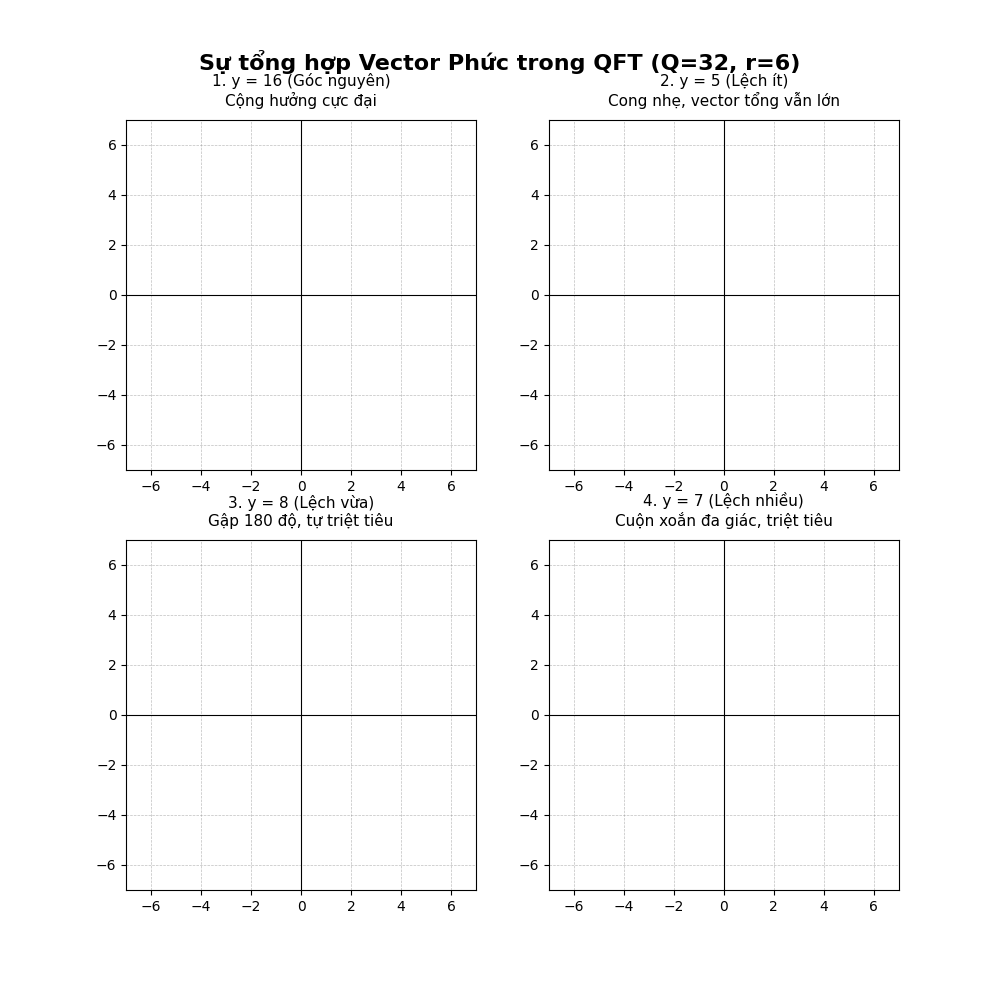
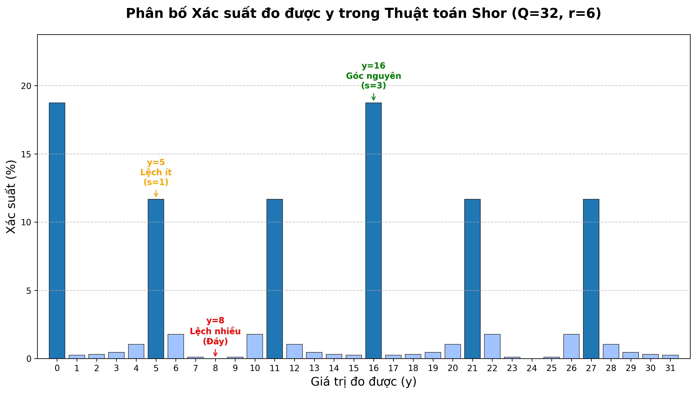
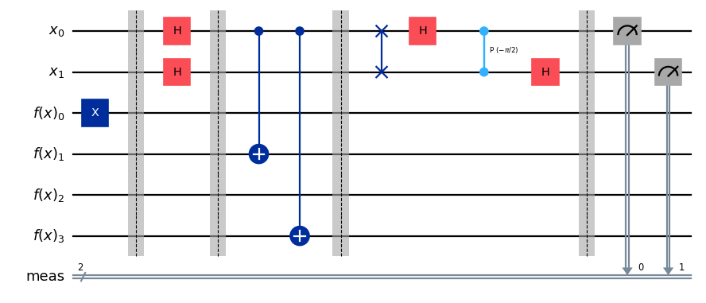

**Mục lục:**

Nội dung của bài này bao gồm:

1. [Xử lý lượng tử](#1-xử-lý-lượng-tử)  
2. [Phân tích thuật toán](#2-phân-tích-thuật-toán)  
3. [Mô phỏng](#3-mô-phỏng)  
4. [Tham khảo](#4-tham-khảo)

<br />

Ở bài trước chúng ta đã tìm hiểu về sự quan trọng của mã hóa RSA và các bước xử lý cổ điển để giải bài toán phân tích thừa số nguyên tố. Bài này chúng ta sẽ tiếp tục phần còn lại và cũng là phần quan trọng nhất trong thuật toán Shor.

## 1. **Xử lý lượng tử**

### 1.1. **Phát biểu bài toán**

Ở bài trước ta đã biết rằng bài toán phân tích thừa số nguyên tố $N$ đã được Shor đưa về bài toán tìm chu kỳ khi mà ở đó ta có thể tận dụng khả năng tính toán song song của máy tính lượng tử để tìm ra đáp án nhanh hơn máy tính cổ điển nhiều lần.

Mục tiêu của bài toán này là tìm chu kỳ $r$ nhỏ nhất sao cho hàm số $f(x) = a^x \bmod N$ tuần hoàn, tức là $a^r \equiv 1 \pmod{N}$.

### 1.2. **Thuật toán** Thuật toán có thể được chia thành các bước như sau

#### **Bước 0: Khởi tạo các thanh ghi lượng tử (Initialization)**

Hệ thống sử dụng hai thanh ghi (register) lượng tử.

* **Thanh ghi 1 (Input):** Chứa $t$ qubit, với $t$ được chọn sao cho $N^2 \le 2^t < 2N^2$. Đặt $Q = 2^t$. Kích thước này đảm bảo đủ độ chính xác cho phép khai triển liên phân số ở bước cuối (tôi sẽ giải thích kỹ hơn phía sau).  
* **Thanh ghi 2 (Output):** Chứa $n$ qubit, đủ để biểu diễn các số từ $0$ đến $N-1$ (tức là $n = \lceil \log_2 N \rceil$).

<br />

Cả hai thanh ghi được khởi tạo ở trạng thái cơ bản:

$$
|\psi_0\rangle = |0\rangle^{\otimes t} |0\rangle^{\otimes n} \tag{1.1}
$$

#### **Bước 1: Tạo trạng thái chồng chập (Superposition)**

Áp dụng các cổng Hadamard ($H$) lên tất cả $t$ qubit của Thanh ghi 1. Phép toán này tạo ra một trạng thái chồng chập đồng đều của tất cả các số nguyên từ $0$ đến $Q-1$.

$$
|\psi_1\rangle = \frac{1}{\sqrt{Q}} \sum_{x=0}^{Q-1} |x\rangle |0\rangle^{\otimes n} \tag{1.2}
$$

#### **Bước 2: Đánh giá hàm lượng tử (Quantum Modular Exponentiation)**

Sử dụng một toán tử unita $U_f$ (đóng vai trò như một oracle) để tính hàm $f(x) = a^x \bmod N$. Kết quả được lưu vào Thanh ghi 2. Do tính chất vướng víu lượng tử (quantum entanglement), trạng thái của hệ thống lúc này là:

$$
|\psi_2\rangle = \frac{1}{\sqrt{Q}} \sum_{x=0}^{Q-1} |x\rangle |a^x \bmod N\rangle \tag{1.3}
$$

Cả ba bước này thì vẫn chưa có gì đặc biệt, nó khá giống các thuật toán như Deutsch-Jozsa và Simon mà ta đã học ở các bài trước.

#### **Bước 3: Đo Thanh ghi 2 (Về mặt khái niệm)**

***Lưu ý:** Việc đo lường thanh ghi này không thực sự bắt buộc trong mạch thực tế, nhưng thường được trình bày để dễ hiểu cấu trúc toán học.*

Khi thực hiện phép đo trên Thanh ghi 2, ta thu được một giá trị $k = a^{x_0} \bmod N$. Trạng thái của hệ thống sẽ suy sụp (collapse), làm cho Thanh ghi 1 chỉ còn chứa các giá trị $x$ thỏa mãn $a^x \bmod N = k$.

Vì hàm này có chu kỳ $r$, các giá trị $x$ này sẽ có dạng $x = x_0 + j \cdot r$, với $j = 0, 1, 2, \dots, m-1$. Trạng thái của Thanh ghi 1 trở thành một sự chồng chập tuần hoàn:

$$
|\psi_3\rangle = \frac{1}{\sqrt{m}} \sum_{j=0}^{m-1} |x_0 + j r\rangle \tag{1.4}
$$

Vấn đề là chúng ta **không thể đo trực tiếp** chu kỳ $r$ từ trạng thái này. Nếu ta thực hiện phép đo, hệ thống sẽ sụp đổ ngẫu nhiên về một trạng thái $|x_0 + j r\rangle$ duy nhất. Ta thu được một con số vô nghĩa, và mọi thông tin về chu kỳ $r$ (khoảng cách giữa các trạng thái) bị phá hủy hoàn toàn.

#### **Bước 4: Phép Biến đổi Fourier Lượng tử (Quantum Fourier Transform - QFT)**

Nếu chúng ta còn nhớ thì ở bài 7 thì Phép biến đổi Fourier lượng tử tác dụng lên một trạng thái cơ bản $|x\rangle$ theo định nghĩa là:

$$
QFT|x\rangle = \frac{1}{\sqrt{Q}} \sum_{y=0}^{Q-1} e^{2\pi i x y / Q} |y\rangle \tag{1.5}
$$

Khi ta áp dụng định nghĩa này cho toàn bộ trạng thái chồng chập $|\psi_3\rangle$, ta nhận được $|\psi_4\rangle$:

$$
|\psi_4\rangle = \frac{1}{\sqrt{mQ}} \sum_{j=0}^{m-1} \sum_{y=0}^{Q-1} e^{2\pi i (x_0 + j r) y / Q} |y\rangle \tag{1.6}
$$

Để dễ nhìn hơn, ta phân tách phần mũ số và nhóm các số hạng theo các trạng thái cơ sở $|y\rangle$. Biên độ xác suất $c_y$ của mỗi trạng thái $|y\rangle$ sẽ có dạng:

$$
c_y = \frac{1}{\sqrt{mQ}} e^{2\pi i x_0 y / Q} \sum_{j=0}^{m-1} e^{2\pi i j \left(\frac{r y}{Q}\right)}
$$

Xác suất để ta đo được một giá trị $y$ bất kỳ tỷ lệ thuận với $|c_y|^2$. Hãy nhìn vào phần cốt lõi trong công thức của $c_y$: đó là một chuỗi cấp số nhân của các số phức (complex geometric series):

$$
S(y) = \sum_{j=0}^{m-1} e^{2\pi i j \left(\frac{r y}{Q}\right)} \tag{1.7}
$$

Mỗi số hạng $e^{2\pi i \theta}$ biểu diễn một vector (hay mũi tên) có độ dài bằng $1$ trên mặt phẳng phức, hướng theo một góc $\theta$. Việc tính tổng $S(y)$ giống như việc ta xếp các vector này nối tiếp nhau. Hệ quả sẽ chia thành hai trường hợp:

* **Giao thoa triệt tiêu (Destructive Interference):** Nếu $\frac{ry}{Q}$ không phải là một số nguyên, phần góc quay $2\pi i j \left(\frac{r y}{Q}\right)$ sẽ thay đổi liên tục khi $j$ tăng. Các vector phức sẽ quay vòng vòng và hướng về mọi phía trên mặt phẳng phức. Khi cộng chúng lại với nhau, chúng sẽ tự triệt tiêu (tạo thành một hình đa giác khép kín). Kết quả là tổng $S(y) \approx 0$. Xác suất đo được các giá trị $y$ này gần như bằng không.  
* **Giao thoa tăng cường (Constructive Interference):** Đây là lúc phép màu xảy ra. Nếu $y$ là một giá trị sao cho $\frac{ry}{Q}$ là một số nguyên (hãy gọi số nguyên đó là $s$), tức là $\frac{y}{Q} = \frac{s}{r}$. Khi đó, hàm mũ trở thành $e^{2\pi i j \cdot s}$. Vì $j$ và $s$ đều là số nguyên, ta có $e^{2\pi i \cdot (\text{số nguyên})} = 1$.  
  Lúc này, toàn bộ $m$ số hạng trong tổng $S(y)$ đều có giá trị đúng bằng $1$ (các vector chỉ cùng về một hướng). Tổng của chúng cộng dồn lại đạt mức cực đại: $S(y) = m$.

#### **Bước 5: Đo lường Thanh ghi 1**

Thực hiện phép đo trên Thanh ghi 1. Dựa vào sự giao thoa tăng cường từ bước QFT, phép đo này sẽ trả về một số nguyên $y$ với xác suất rất cao thỏa mãn:

$$
\frac{y}{Q} \approx \frac{s}{r} \tag{1.8}
$$

#### **Bước 6: Xử lý hậu kỳ cổ điển (Classical Post-Processing)**

Sau khi đo được $y$ từ hệ thống lượng tử, máy tính cổ điển tiếp quản lại:

* **Khai triển liên phân số (Continued Fractions Expansion):** Sử dụng thuật toán liên phân số trên giá trị $\frac{y}{Q}$. Vì ta biết mẫu số $r \le N$ và $Q \ge N^2$, định lý về liên phân số đảm bảo rằng $\frac{s}{r}$ sẽ là một trong các giản phân (convergents) của khai triển liên phân số của $\frac{y}{Q}$.  
* **Kiểm tra tính hợp lệ:** Với ứng viên $r$ tìm được, ta kiểm tra xem $a^r \equiv 1 \pmod{N}$ có đúng không.  
  * Nếu đúng, ta đã tìm được chu kỳ.  
  * Nếu sai, hoặc $s$ và $r$ có ước chung lớn hơn $1$, hệ thống sẽ chạy lại phần mạch lượng tử (thường chỉ mất số ít lần lặp với $\mathcal{O}(1)$) cho đến khi tìm được đúng $r$.

Yên tâm nếu bạn thấy những bước phía trên quá khó hiểu, chúng ta sẽ cùng làm rõ từng bước ngay sau đây.

## 2. **Phân tích thuật toán**

Chúng ta bỏ qua các bước 1, 2, 3 vì chúng ta đã nghiên cứu về chúng khá nhiều ở các bài trước. Vậy hãy bắt đầu với bước 4 trước.

### 2.1. **Bước 4: Quantum Fourier Transform - QFT**

Ở đoạn tóm tắt thuật toán chúng ta đã biết về giao thoa tăng cường và giao thoa triệt tiêu. Tuy nhiên có một vài thứ cần lưu ý ở đây.

### **Sự thật về "Giao thoa tăng cường luôn cho góc là số nguyên"**

Trong một thế giới lý tưởng, điều này là hoàn toàn chính xác. Nếu tỷ số $\frac{r y}{Q}$ là một số nguyên hoàn hảo, thì góc quay giữa các vector sẽ là một bội số chuẩn xác của $360^\circ$ ($2\pi$). Các vector sẽ nằm thẳng tắp, không có một chút sai lệch nào.

Tuy nhiên, **trong thực tế, điều kiện lý tưởng này hầu như không bao giờ xảy ra.**

Lý do nằm ở cấu trúc phần cứng lượng tử: $Q$ luôn luôn là một lũy thừa của $2$ (như $32, 64, 1024, \dots$). Trong khi đó, chu kỳ $r$ là một con số ngẫu nhiên sinh ra từ bản chất của $N$ (ví dụ $r=6, r=15, r=20$).

Xác suất để một số ngẫu nhiên $r$ có thể chia hết hoàn hảo cho một lũy thừa của $2$ là cực kỳ thấp.

Nhưng nếu tỷ số $\frac{r y}{Q}$ là một số nguyên, thì đây sẽ là các đỉnh giao thoa cực đại. Nhưng các đỉnh này chưa chắc đã hữu ích.

Hãy xem xét ví dụ sau:

- **Hệ thống:** $Q = 32$.  
- **Chu kỳ thực tế cần tìm (ẩn):** $r = 6$.

Với bài toán trên:

- Trạng thái lý tưởng để có góc nguyên là tìm được $y$ sao cho $\frac{6 \times y}{32}$ là một số nguyên.  
- Nếu ta quét qua các giá trị, chỉ có $y = 16$ mới cho ra số nguyên ($\frac{96}{32} = 3$).  
- Nhưng tại đỉnh giao thoa của lời giải (tương ứng với phân số $\frac{1}{6}$), máy tính lượng tử đo được $y = 5$.  
- Lúc này, tỷ số là $\frac{6 \times 5}{32} = \frac{30}{32} = 0.9375$. Con số này **không phải là số nguyên**.

Vì nó là $0.9375$ (chứ không phải $1$), góc quay của mỗi bước vector không phải là $360^\circ$, mà là khoảng $337.5^\circ$. Nghĩa là mỗi bước đi, vector bị **lệch đi $22.5^\circ$**.

Dưới đây là minh họa sự tổng hợp của các vector cho các trường hợp đo được các giá trị $y$ khác:

<div align="center">

  
*(Hình 2.1. Mô tả tổng hợp vector phức trong QFT)*

</div>

Độ dài của vector tổng hợp chính là xác suất đo lường được trạng thái $y$ của chúng ta, với ví dụ trên, phân bố xác suất của $y$ sẽ có dạng:

<div align="center">

  
*(Hình 2.2. Mô tả phân bố xác suất của $y$)*

</div>

Thậm chí trong trường hợp giao thoa cực đại (góc quay là một số nguyên lần $2\pi$) thì nó cũng chưa chắc giúp chúng ta tìm ra lời giải.

### **Nghịch lý: Đỉnh hoàn hảo nhưng lại vô dụng**

Nhắc lại công thức cốt lõi: Để có một đỉnh giao thoa, tỷ số $\frac{y}{Q}$ phải xấp xỉ một phân số $\frac{s}{r}$.

Hay nói cách khác, các đỉnh sẽ xuất hiện tại các vị trí: $y \approx s \cdot \frac{Q}{r}$.

Với $Q=32$ và $r=6$, ta có các ứng cử viên cho $s$ chạy từ $0$ đến $5$. Hãy xem các đỉnh $y$ tương ứng:

- Với $s=1 \implies y \approx 1 \times \frac{32}{6} = 5.33 \implies$ Đỉnh tại $y=5$. Tỷ số $\frac{ry}{Q} = \frac{30}{32} = 0.9375$ (bị rò rỉ phổ, đường cong thoải).  
- Với $s=3 \implies y = 3 \times \frac{32}{6} = 16 \implies$ Đỉnh tại $y=16$. Tỷ số $\frac{ry}{Q} = \frac{96}{32} = 3$ (số nguyên tuyệt đối).

Tại $y=16$, góc quay của mỗi vector là đúng $3 \times 360^\circ$. Các vector nằm thẳng tắp chồng lên nhau một cách hoàn hảo vô khuyết. Xác suất đo được $y=16$ thực chất còn *nhỉnh hơn một chút* so với xác suất đo được $y=5$.

Nếu xác suất cao như vậy, giả sử máy tính lượng tử thực sự đo đạc và trả về cho bạn con số $y = 16$. Điều gì sẽ xảy ra ở phần xử lý cổ điển?

Máy tính cổ điển nhận được $\frac{y}{Q} = \frac{16}{32}$.

Nó bắt đầu rút gọn phân số này (hoặc chạy liên phân số), và kết quả trả về là:

$$
\frac{16}{32} = \frac{1}{2}
$$

Máy tính cổ điển sẽ nhìn vào mẫu số và kết luận: *"Aha! Chu kỳ $r$ là $2$!"*

Nó đem $r=2$ đi thử vào phương trình $a^2 \equiv 1 \pmod{N}$ và nhận ra kết quả **SAI**. Thuật toán thất bại ở lần chạy này.

**Nguyên nhân của sự thất bại:** $y=16$ sinh ra từ giá trị $s=3$. Phân số lý tưởng của nó là $\frac{s}{r} = \frac{3}{6}$.

Tuy nhiên, vì $3$ và $6$ có ước chung là $3$, phân số này đã bị tối giản thành $\frac{1}{2}$. **Toán học đã xóa sổ thông tin về chu kỳ thực $r=6$**, chỉ để lại một nhân tử của nó là $2$.

Đo được một góc hoàn hảo (không bị rò rỉ phổ) nghe thì có vẻ lý tưởng về mặt vật lý, nhưng về mặt thuật toán, nó lại mang đến một phân số bị rút gọn, làm mất đi chu kỳ $r$ gốc và gây ra sự "nhiễu" thông tin.

### **Sự thật thứ nhất: Các đỉnh "tốt" gần như phải bị lệch (Rò rỉ phổ)**

Đây là một hệ quả toán học tuyệt đẹp mà Peter Shor đã tính toán trước. Hãy nhìn lại phương trình tạo ra một đỉnh giao thoa hoàn hảo (góc nguyên):

$$
y = \frac{s \cdot Q}{r}
$$

Để đỉnh này mang lại thông tin hữu ích, ta cần $s$ và $r$ nguyên tố cùng nhau, tức là $\gcd(s, r) = 1$.

Nhưng hãy nhớ lại, kiến trúc phần cứng lượng tử bắt buộc $Q$ phải là một lũy thừa của $2$ (ví dụ $Q = 2^t$).

Nếu phân số $\frac{s}{r}$ đã tối giản, thì để $y$ có thể là một số nguyên hoàn hảo, **mẫu số $r$ bắt buộc phải là một ước số của $Q$**. Nghĩa là bản thân chu kỳ $r$ cũng phải là một lũy thừa của $2$.

Trong thực tế bẻ khóa mã hóa RSA, chu kỳ $r$ hầu như **không bao giờ** là một lũy thừa của $2$.

**Hệ quả trực tiếp:** Vì $r$ không phải lũy thừa của $2$, phương trình $y = \frac{s \cdot 2^t}{r}$ sẽ KHÔNG BAO GIỜ cho ra $y$ là một số nguyên nếu $\gcd(s, r) = 1$.

Nói cách khác: **Tất cả các giá trị $s$ hữu ích (giúp tìm ra đúng $r$) HẦU NHƯ SẼ TẠO RA CÁC ĐỈNH BỊ LỆCH.** Sự "rò rỉ phổ" mà chúng ta thấy không phải là lỗi hệ thống, mà nó chính là chữ ký sinh trắc học của một phân số tối giản! Những đỉnh hoàn hảo (như $y=16$) đa phần đều là những đỉnh "xấu" chứa phân số có thể rút gọn được.

### **Cách máy tính cổ điển đối mặt với "Nhiễu"**

Khi ta đo được một $y$ và dùng thuật toán liên phân số, máy tính cổ điển không hề bị "bối rối" nếu đó là một đỉnh xấu. Logic vận hành cực kỳ dứt khoát:

1. Tính ra ứng cử viên $r'$.  
2. Thử nghiệm đại số: $a^{r'} \equiv 1 \pmod{N}$?  
3. Nếu **SAI**: Máy tính cổ điển lập tức vứt bỏ kết quả này (coi như rác). Nó ra lệnh cho máy tính lượng tử: *"Đỉnh vừa rồi bị rút gọn mất rồi, bắn tia laser chạy lại mạch đi!"* 4. Nếu **ĐÚNG**: Dừng toàn bộ hệ thống. Ta đã có chu kỳ.

Máy tính lượng tử tính toán với tốc độ của các hạt vi mô, nên việc chạy lại mạch 3-4 lần chỉ tốn thêm vài mili-giây. Cái giá này là quá rẻ so với việc phải chờ hàng tỷ năm nếu dùng siêu máy tính cổ điển.

### 2.1. **Bước 6: Xử lý hậu kỳ cổ điển (Classical Post-Processing)**

Trong máy tính lượng tử, kết quả chúng ta đo được là một số nguyên $y$. Tỷ số $y/Q$ là một phân số có mẫu số là lũy thừa của $2$ (vì $Q = 2^n$). Tuy nhiên, phân số chứa thông tin thật sự mà chúng ta cần lại là $s/r$. Sự nhiễu lượng tử khiến $y/Q$ chỉ *xấp xỉ* bằng $s/r$ chứ hiếm khi bằng chính xác.

Nhiệm vụ của khai triển liên phân số là bóc tách lớp vỏ xấp xỉ $Q$ này để khôi phục lại mẫu số thực sự $r$.

### 2.1.1. **Định lý Legendre (Legendre's Theorem):**

Tại sao chúng ta lại dùng liên phân số mà không phải thuật toán nào khác? Câu trả lời nằm ở một định lý toán học kinh điển của Adrien-Marie Legendre. Định lý này phát biểu rằng:

Nếu tồn tại một phân số $s/r$ sao cho:

$$
\left| \frac{y}{Q} - \frac{s}{r} \right| < \frac{1}{2r^2} \tag{2.1}
$$

Thì phân số tối giản $s/r$ **chắc chắn** phải là một trong các "giản phân" (convergents) của khai triển liên phân số của tỷ số $y/Q$.

Đây cũng là lý do trong thuật toán Shor, ta luôn chọn độ dài thanh ghi đầu vào sao cho $Q \ge N^2$ (với $N$ là số cần phân tích nhân tử). Cụ thể:

### **Giới hạn sai số của phép đo Lượng tử (Độ phân giải)**

Khi thực hiện Phép ước lượng pha lượng tử (Quantum Phase Estimation) ở bước QFT nghịch đảo, hệ thống lượng tử cố gắng mã hóa giá trị chính xác là $s \cdot Q / r$ vào thanh ghi.

Tuy nhiên, thanh ghi chỉ có thể chứa các trạng thái cơ sở là số nguyên. Do đó, kết quả đo được $y$ sẽ là số nguyên gần nhất với giá trị thực $s \cdot Q / r$.

Khoảng cách tối đa giữa một số thực và số nguyên gần nhất của nó không bao giờ vượt quá $0.5$. Về mặt toán học, điều này được biểu diễn là:

$$
\left| y - \frac{s \cdot Q}{r} \right| \le \frac{1}{2}
$$

Chia cả hai vế cho $Q$, ta có được "giới hạn sai số lượng tử" lớn nhất có thể xảy ra:

$$
\left| \frac{y}{Q} - \frac{s}{r} \right| \le \frac{1}{2Q} \tag{2.2}
$$

Nghĩa là, dù máy tính lượng tử có bị "lệch" đến đâu (miễn là vẫn nằm trong đỉnh giao thoa chính), khoảng cách giữa phân số đo được $y/Q$ và phân số thực $s/r$ chắc chắn không lớn hơn $1 / (2Q)$. Mẫu số $Q$ càng lớn, "độ phân giải" của máy tính lượng tử càng cao, và sai số này càng nhỏ.

### **"Bán kính an toàn" của Toán học Cổ điển**

Như chúng ta đã thảo luận ở phần trên, thuật toán khai triển liên phân số chỉ bảo đảm tìm ra đúng phân số tối giản $s/r$ nếu điều kiện của Định lý Legendre được thỏa mãn:

$$
\left| \frac{y}{Q} - \frac{s}{r} \right| < \frac{1}{2r^2}
$$

Giá trị $1 / (2r^2)$ đóng vai trò như một "bán kính an toàn" (hoặc "miệng phễu"). Nếu tỷ số lượng tử $y/Q$ rơi trúng vào bên trong bán kính này, thuật toán liên phân số chắc chắn sẽ hút nó về đúng lõi $s/r$ . Nếu rơi ra ngoài, kết quả thu được sẽ là rác.

Để Thuật toán Shor luôn thành công, chúng ta phải đảm bảo rằng: **Sai số lượng tử tệ nhất cũng phải nằm gọn bên trong bán kính an toàn của định lý Legendre.**

Và từ $(2.2)$ và $(2.1)$ ta dễ dàng rút ra được điều kiện về bán kính an toàn phải thỏa mãn:

$$
\frac{1}{2Q} \le \frac{1}{2r^2}
$$

Nghịch đảo hai vế (đồng thời đổi chiều bất đẳng thức), ta có được điều kiện cốt lõi:

$$
Q \ge r^2 \tag{2.3}
$$

### **Vậy tại sao lại là $N^2$ chứ không phải $r^2$?**

Phương trình $Q \ge r^2$ cho chúng ta biết kích thước thanh ghi tối thiểu cần thiết. Tuy nhiên, có một nghịch lý ở đây: Mục đích toàn bộ của thuật toán Shor là để **tìm ra chu kỳ $r$**. Tại thời điểm chúng ta thiết kế mạch lượng tử (chọn số lượng qubit cho thanh ghi đầu vào), chúng ta hoàn toàn chưa biết $r$ bằng bao nhiêu!

Vậy làm sao để chọn $Q$?

Giải pháp của Peter Shor là sử dụng giới hạn cận trên. Theo lý thuyết số (Định lý Euler), chu kỳ $r$ của hàm $f(x) = M^x \pmod N$ luôn nhỏ hơn mô-đun $N$ (Cụ thể hơn là $r \le \phi(N) < N$, với $\phi$ là hàm phi Euler).

Bởi vì chúng ta biết chắc chắn $r < N$, nên hiển nhiên:

$$
r^2 < N^2
$$

Để đảm bảo an toàn tuyệt đối, bao phủ cho **mọi trường hợp xấu nhất** (khi chu kỳ $r$ lớn gần bằng $N$), chúng ta thiết kế thanh ghi sao cho:

$$
Q \ge N^2 \tag{2.4}
$$

Do kích thước thanh ghi $Q$ luôn là một lũy thừa của $2$ (tức là $Q = 2^n$ với $n$ là số qubit), trên thực tế, người ta thường chọn số qubit $n$ sao cho:

$$
N^2 \le 2^n < 2N^2 \tag{2.5}
$$

Nói chung, việc chọn $Q \ge N^2$ là một sự "chuẩn bị dư dả" về mặt tài nguyên qubit. Nó khiến độ phân giải của máy tính lượng tử (được đo bằng $1/2Q$) trở nên cực kỳ mịn, mịn đến mức nó ép mọi sai lệch pha lượng tử lọt thỏm vào bên trong bán kính an toàn của định lý Legendre ($1/2r^2$). Nhờ đó, máy tính lượng tử mới có thể giao quyền điều khiển lại cho máy tính cổ điển một cách an toàn để trích xuất ra chu kỳ $r$.

Vậy cụ thể thuật toán khai triển liên phân số sẽ hoạt động như thế nào?

### 2.1.2. **Thuật toán Khai triển Liên phân số:**

Một liên phân số của số thực $x$ được biểu diễn dưới dạng:

$$
x = a_0 + \frac{1}{a_1 + \frac{1}{a_2 + \frac{1}{a_3 + \dots}}}
$$

Ký hiệu gọn là: $[a_0; a_1, a_2, a_3, \dots]$. 

Cách tìm các hệ số $a_i$:

1. Đặt $x_0 = y/Q$.  
2. Hệ số nguyên đầu tiên $a_0 = \lfloor x_0 \rfloor$ (phần nguyên của $x_0$).  
3. Tìm phần dư: $f_0 = x_0 - a_0$.  
4. Lấy nghịch đảo phần dư để tạo số mới: $x_1 = 1 / f_0$.  
5. Lặp lại quá trình: $a_1 = \lfloor x_1 \rfloor$, $f_1 = x_1 - a_1$, v.v. cho đến khi phần dư bằng $0$ (vì $y/Q$ là số hữu tỉ nên thuật toán sẽ dừng sau hữu hạn bước).

### **Tìm ứng cử viên Chu kỳ ($r$) thông qua Giản phân (Convergents):**

Từ dãy hệ số $[a_0; a_1, a_2, \dots]$, ta tính các phân số cắt cụt tại bước thứ $n$. Các phân số này gọi là giản phân (convergents) $p_n/q_n$, và chúng là những giá trị xấp xỉ tốt nhất cho tỷ số ban đầu.

Công thức truy hồi để tính tử số $p_n$ và mẫu số $q_n$ là:

$$
p_n = a_n p_{n-1} + p_{n-2}
$$

$$
q_n = a_n q_{n-1} + q_{n-2}
$$

Với điều kiện cơ sở: $p_{-1} = 1, q_{-1} = 0$ và $p_{-2} = 0, q_{-2} = 1$.

**Mấu chốt của Thuật toán Shor nằm ở đây:** Danh sách các mẫu số $q_1, q_2, q_3 \dots$ chính là tập hợp các **ứng cử viên tiềm năng** cho chu kỳ $r$. Máy tính cổ điển sẽ lần lượt lấy các $q_n$ này, đưa vào hàm gốc $f(x) = M^x \pmod N$ để kiểm tra xem $M^{q_n} \equiv 1 \pmod N$ hay không. Nếu đúng, $q_n$ chính là $r$.

### **Ví dụ thực tế (Nối tiếp trường hợp $y=5, Q=32$)**

Hãy áp dụng thuật toán này để xem làm sao nó tìm ra được chu kỳ ẩn $r=6$ từ dữ liệu đo đạc lượng tử bị "lệch ít" là $y=5$ và $Q=32$.

**Bước 1: Khai triển hệ số $a_i$ của số $5/32$**

* **$x_0 = 5/32 \implies a_0 = \lfloor 5/32 \rfloor = 0$**, dư $5/32$.  
* $x_1 = 32/5 = 6.4 \implies a_1 = \lfloor 6.4 \rfloor = 6$, dư $0.4 = 2/5$.  
* $x_2 = 5/2 = 2.5 \implies a_2 = \lfloor 2.5 \rfloor = 2$, dư $0.5 = 1/2$.  
* $x_3 = 2/1 = 2 \implies a_3 = \lfloor 2 \rfloor = 2$, dư $0$. (Dừng)

Chuỗi hệ số:

$$
[0; 6, 2, 2]
$$

**Bước 2: Tính các giản phân $p_n/q_n$**

* Tại $n=0$ ($a_0 = 0$): $q_0 = 0 \cdot 0 + 1 = 1$

  Giản phân $c_0 = 0/1$. (Mẫu số $1$ - Bỏ qua)

* Tại $n=1$ ($a_1 = 6$):

  $$
  p_1 = a_1 p_0 + p_{-1} = 6 \cdot 0 + 1 = 1
  $$
  $$
  q_1 = a_1 q_0 + q_{-1} = 6 \cdot 1 + 0 = 6
  $$

  Giản phân $c_1 = 1/6$. **Ứng viên $r = 6$!**

* Tại $n=2$ ($a_2 = 2$):

  $$
  p_2 = a_2 p_1 + p_0 = 2 \cdot 1 + 0 = 2
  $$
  $$
  q_2 = a_2 q_1 + q_0 = 2 \cdot 6 + 1 = 13
  $$

  Giản phân $c_2 = 2/13$. Ứng viên $r = 13$.

Ngay tại giản phân thứ hai ($c_1 = 1/6$), thuật toán cổ điển kiểm tra thấy mẫu số bằng $6$. Máy tính đem $6$ đi thử nghiệm và xác nhận đây chính là chu kỳ chính xác. Lớp vỏ nhiễu $32$ đã bị loại bỏ hoàn toàn nhờ tính chất lọc xấp xỉ của liên phân số.

## 3. **Mô phỏng**

Để tạo ra một minh họa trực quan, ngắn gọn nhưng vẫn giữ nguyên vẹn độ chính xác toán học của Thuật toán Shor, ta có thể xây dựng một mạch lượng tử với thanh ghi đầu vào chỉ gồm **2 qubit**.

Dưới đây là thiết kế mạch với phương trình cốt lõi là phân tích thừa số nguyên tố cho $N=15$. Ta chọn cơ số $a=11$.

Hàm số cần tìm chu kỳ là:

$$
f(x) = 11^x \pmod{15}
$$

Nhẩm tính chuỗi giá trị:

* $x=0: 11^0 \pmod{15} = 1$  
* $x=1: 11^1 \pmod{15} = 11$  
* $x=2: 11^2 \pmod{15} = 121 \equiv 1$  
* $x=3: 11^3 \pmod{15} = 11$

Chuỗi lặp lại là $1, 11, 1, 11 \dots$ Do đó, chu kỳ ẩn ở đây là $r=2$.

Vì $r=2$, thanh ghi đầu vào chỉ cần chứa tối đa giá trị lớn hơn $r^2$ (tức là $4$). Một thanh ghi $2$ qubit (đại diện cho $Q=4$) là hoàn hảo.

Mạch lượng tử của thuật toán Shor với ví dụ trên có thể được viết bằng Qiskit như sau:

```python
!pip install qiskit qiskit-aer matplotlib pylatexenc
import numpy as np
import matplotlib.pyplot as plt
from qiskit import QuantumCircuit, QuantumRegister, ClassicalRegister, transpile
from qiskit_aer import AerSimulator
from fractions import Fraction

# ==========================================
# 1. THIẾT LẬP THÔNG SỐ VÀ THANH GHI
# ==========================================
a = 11
N = 15
Q = 4

qr_x = QuantumRegister(2, name='x')
qr_f = QuantumRegister(4, name='f(x)')
cr = ClassicalRegister(2, name='meas')

qc = QuantumCircuit(qr_x, qr_f, cr)

# ==========================================
# 2. KHỞI TẠO & CHỒNG CHẬP
# ==========================================
# Qiskit dùng Little-endian, số 1 (0001) nghĩa là qubit 0 ở trạng thái |1>
qc.x(qr_f[0]) 
qc.barrier()

qc.h(qr_x)
qc.barrier()

# ==========================================
# 3. GẮN ORACLE THỰC SỰ (11^x mod 15)
# ==========================================
# --- U^1 (điều khiển bởi x[0]) ---
# Nhân f(x) với 11 (1011_2). Biến 0001 thành 1011 -> Cần lật bit 1 và bit 3
qc.cx(qr_x[0], qr_f[1])
qc.cx(qr_x[0], qr_f[3])

# --- U^2 (điều khiển bởi x[1]) ---
# Nhân f(x) với 11^2 mod 15 = 1. Không làm thay đổi gì -> Không cần cổng nào.
qc.barrier()

# ==========================================
# 4. IQFT (VIẾT THỦ CÔNG)
# ==========================================
qc.swap(qr_x[0], qr_x[1])
qc.h(qr_x[0])
qc.cp(-np.pi/2, qr_x[1], qr_x[0])
qc.h(qr_x[1])
qc.barrier()

# ==========================================
# 5. ĐO ĐẠC
# ==========================================
qc.measure(qr_x, cr)

# --- VẼ MẠCH ---
print("1. SƠ ĐỒ MẠCH LƯỢNG TỬ:")
display(qc.draw(output='mpl', style='iqx', scale=0.8))
```

Kết quả:

<div align="center">

  
*(Lưu ý: Thanh ghi 2 cần 4 qubit để đủ dung lượng chứa số $11$ trong hệ nhị phân là $1011$)*

</div>

### 3.1. **Phân tích Toán học từng bước (State Tracing)**

**Bước 1: Khởi tạo**

Hệ thống bắt đầu ở trạng thái cơ sở:

$$
|\psi_0\rangle = |00\rangle \otimes |0001\rangle
$$

**Bước 2: Chồng chập (Cổng Hadamard)**

Áp dụng Hadamard lên 2 qubit đầu tiên để tạo ra tất cả các giá trị $x$ từ $0$ đến $3$ cùng lúc:

$$
|\psi_1\rangle = \frac{1}{2} \left( |0\rangle + |1\rangle + |2\rangle + |3\rangle \right) \otimes |1\rangle
$$

**Bước 3: Gắn Oracle (Vướng víu Lượng tử)**

Cổng $U$ tính toán $f(x)$ và lưu vào thanh ghi 2. Các trạng thái giờ đây bị khóa chặt (vướng víu) với nhau:

$$
|\psi_2\rangle = \frac{1}{2} \left( |0\rangle|1\rangle + |1\rangle|11\rangle + |2\rangle|1\rangle + |3\rangle|11\rangle \right)
$$

Nhóm các trạng thái có chung kết quả đầu ra ở thanh ghi 2 lại với nhau, ta sẽ thấy sự tuần hoàn xuất hiện:

$$
|\psi_2\rangle = \frac{1}{2} \left[ (|0\rangle + |2\rangle)|1\rangle + (|1\rangle + |3\rangle)|11\rangle \right]
$$

**Bước 4: QFT Nghịch đảo (Giao thoa Lượng tử)**

Đây là nơi phép thuật xảy ra. Máy tính áp dụng QFT nghịch đảo (IQFT) lên thanh ghi 1. Toán tử IQFT cho hệ $4$ chiều biến đổi các trạng thái tuần hoàn như sau:

* Phần có pha chẵn $(|0\rangle + |2\rangle)$ sẽ giao thoa tăng cường, biến thành: $|0\rangle + |2\rangle$  
* Phần có pha lẻ $(|1\rangle + |3\rangle)$ cũng tự triệt tiêu các thành phần nhiễu, gộp lại thành: $|0\rangle - |2\rangle$

Khi thay vào phương trình tổng, trạng thái hệ thống trước khi đo đạc trở thành:

$$
|\psi_3\rangle = \frac{1}{2} \left[ (|0\rangle + |2\rangle)|1\rangle + (|0\rangle - |2\rangle)|11\rangle \right]
$$

Rút gọn lại theo thanh ghi 1:

$$
|\psi_3\rangle = \frac{1}{2} |0\rangle (|1\rangle + |11\rangle) + \frac{1}{2} |2\rangle (|1\rangle - |11\rangle)
$$

**Quan sát Đáy giao thoa:** Ta có thể thấy các trạng thái $|1\rangle$ và $|3\rangle$ (những giá trị "rác" khiến tỷ số $y/Q$ bị lệch) đã biến mất hoàn toàn khỏi phương trình. Xác suất đo được chúng là $0\%$.

**Bước 5: Đo đạc**

Khi ta thực hiện đo thanh ghi 1, toán học đảm bảo rằng:

* Có $50\%$ cơ hội ta đo được $y=0$ (Trường hợp này không cho ta thông tin, hệ thống sẽ chạy lại).  
* Có $50\%$ cơ hội ta đo được $y=2$.

Khi đo được $y=2$, ta chuyển cho máy tính cổ điển. Máy tính thiết lập tỷ số:

$$
\frac{y}{Q} = \frac{2}{4} = \frac{1}{2}
$$

Vì phân số này đã tối giản ($s/r$), ta dễ dàng đọc được mẫu số chính là chu kỳ $r=2$.

Để chứng minh phân tích toán học trên, ta sẽ thử chạy giả lập mạch lượng tử của chúng ta để kiểm tra lại:

```python
# ==========================================
# 6. MÔ PHỎNG VÀ XỬ LÝ HẬU KỲ CỔ ĐIỂN
# ==========================================
print("\n2. KẾT QUẢ ĐO VÀ XỬ LÝ HẬU KỲ:")

simulator = AerSimulator()
compiled_circuit = transpile(qc, simulator)
job = simulator.run(compiled_circuit, shots=1024)
result = job.result()
counts = result.get_counts()

print(f"Tần suất đo được (1024 lần chạy): {counts}")

for y_bin in counts.keys():
    y_val = int(y_bin, 2)
    prob = (counts[y_bin] / 1024) * 100
    
    print(f"\n--- Phân tích trường hợp đo được y = {y_val} (Xác suất ~{prob:.1f}%) ---")
    
    if y_val == 0:
        print("-> Lỗi: y = 0 không cung cấp thông tin về chu kỳ. Chạy lại mạch.")
        continue
        
    tiso = y_val / Q
    print(f"-> Tỷ số lượng tử y/Q = {y_val}/{Q} = {tiso}")
    
    phan_so_toi_gian = Fraction(tiso).limit_denominator(N)
    r_candidate = phan_so_toi_gian.denominator
    
    print(f"-> Khai triển liên phân số trả về r = {r_candidate}")
    
    if r_candidate % 2 != 0:
        print("-> Thất bại: r là số lẻ.")
    else:
        if (a**r_candidate) % N == 1:
            print(f"-> THÀNH CÔNG! Đã xác minh chu kỳ r = {r_candidate}.")
            p = np.gcd(a**(r_candidate//2) - 1, N)
            q = np.gcd(a**(r_candidate//2) + 1, N)
            print(f"-> Phân tích nhân tử của {N} thành: {p} và {q}")
        else:
            print("-> Thất bại: r không phải là chu kỳ thực sự.")
```

Kết quả:

```text
2. KẾT QUẢ ĐO VÀ XỬ LÝ HẬU KỲ:
Tần suất đo được (1024 lần chạy): {'00': 509, '10': 515}

--- Phân tích trường hợp đo được y = 0 (Xác suất ~49.7%) ---
-> Lỗi: y = 0 không cung cấp thông tin về chu kỳ. Chạy lại mạch.

--- Phân tích trường hợp đo được y = 2 (Xác suất ~50.3%) ---
-> Tỷ số lượng tử y/Q = 2/4 = 0.5
-> Khai triển liên phân số trả về r = 2
-> THÀNH CÔNG! Đã xác minh chu kỳ r = 2.
-> Phân tích nhân tử của 15 thành: 5 và 3
```

### 3.2. **Lưu ý quan trọng:**

Trong thuật toán phía trên chúng ta đã đơn giản hóa hai thứ, đó là không gian trạng thái đầu vào và tác động thực tế của $U_f$ lên không gian đó. Thực tế để thuật toán hoạt động hoàn hảo cho ví dụ trên mà không cần biết trước chu kỳ, ta bắt buộc phải chọn $Q \ge N^2$.

Với $N = 15$:

* $N^2 = 225$  
* Lũy thừa của $2$ gần nhất lớn hơn $225$ là $Q = 2^8 = 256$.  
* Vậy thanh ghi đầu vào cần **8 qubit**.  
* Thanh ghi đầu ra chứa giá trị $N=15$ cần **4 qubit**.

Tổng cộng, một mạch Shor nguyên bản và đúng chuẩn sách giáo khoa cho $15$ sẽ cần tới **12 qubit**!

### **Mạch thực tế (Shor chuẩn):**

* Cần một thanh ghi đầu vào lớn ($Q=2^8=256$) với 8 qubit.  
* Các cổng U^1, U^2... sẽ không chứa thông tin về chu kỳ. Thay vào đó, chúng là các ma trận toán học khổng lồ được thiết kế để thực hiện phép tính lũy thừa theo mô-đun trên một không gian trạng thái cực lớn (mô tả tác động thực tế của hàm số $f(x) = 11^x \pmod{15}$). Máy tính lượng tử **phải thực sự "tìm"** ra chu kỳ mà không biết trước nó bằng bao nhiêu.

### **Mạch trong mã code (Mô hình thu nhỏ):**

* Ta đã sử dụng toán học cổ điển trước để biết rằng cơ số $11$ mod $15$ chỉ có thể tạo ra chu kỳ $r=2$.  
* Vì đã biết $r=2$, ta "ăn gian" bằng cách thiết kế một mạch lượng tử nhỏ nhất có thể (chỉ 2 qubit đầu vào là đủ vì $2^2=4 \ge r^2$) có khả năng trình diễn sự tuần hoàn này.  
* Ma trận thực sự của cổng U^1 trong mạch nhỏ này được "lập trình cứng" để tạo ra chu kỳ $2$. Nó không còn là ma trận tổng quát của Shor nữa.

### **Vậy tại sao ví dụ mạch 2 qubit (hoặc 3 qubit) lại tồn tại và thường xuyên được sử dụng?**

Nguyên nhân đến từ sự chênh lệch giữa lý thuyết và khả năng minh họa thực tế (hoặc khả năng của phần cứng lượng tử sơ khai):

1. **Sự quá tải khi tính toán tay:** Một mạch 12 qubit sẽ tạo ra một không gian trạng thái khổng lồ với $2^{12} = 4096$ chiều. Việc viết từng phương trình trạng thái (state tracing) như tôi đã làm ở trên là bất khả thi trên một trang giấy hay một bài viết.  
2. **"Biên dịch trước" (Pre-compilation):** Để giải quyết vấn đề này trong giảng dạy (và cả trong thí nghiệm máy tính lượng tử thực tế đầu tiên của IBM năm 2001), các nhà nghiên cứu đã sử dụng một thủ thuật gọi là "biên dịch dựa trên sự hiểu biết trước". Bằng cách chọn cố tình cơ số $a = 11$, họ lén dùng toán học cổ điển để biết trước rằng chu kỳ chỉ có thể là $r=2$. Vì $r=2$, họ thu nhỏ thanh ghi đầu vào xuống chỉ còn 2 qubit (vì $2^2 = 4 > r^2$) để tạo ra một "mạch đồ chơi" (toy circuit).

Mục đích của mạch 2 qubit này không phải là để máy tính lượng tử thực sự "tìm" ra một chu kỳ chưa biết, mà là để **trình diễn một cách rõ ràng và gọn gàng nhất** cơ chế Giao thoa Lượng tử và QFT Nghịch đảo hoạt động như thế nào.

Vậy trong bài này chúng ta đã hoàn tất nghiên cứu về thuật toán Shor, ở bài tiếp theo chúng ta sẽ tìm hiểu về một trong những thuật toán quan trọng nhất trong hóa học phân tử đó là thuật toán **QPE (Quantum Phase Estimate).** Hẹn gặp bạn đọc ở bài sau.

## 4. **Tham khảo**

**Tiếng Anh**

1. Shor, P. W. (1994). *"Polynomial-Time Algorithms for Prime Factorization and Discrete Logarithms on a Quantum Computer"*. SIAM Journal on Computing. ([https://arxiv.org/abs/quant-ph/9508027](https://arxiv.org/abs/quant-ph/9508027)): Đây là bài báo lịch sử nơi Peter Shor lần đầu tiên công bố thuật toán này với thế giới. Đọc bản gốc sẽ giúp bạn đọc hiểu rõ tư duy hình thành nên việc kết hợp Lý thuyết số (Định lý Legendre) vào cơ học lượng tử.  
2. IBM Quantum Learning. *"Shor's Algorithm - Qiskit Textbook"*. ([https://learning.quantum.ibm.com/course/fundamentals/shors-algorithm](https://learning.quantum.ibm.com/course/fundamentals/shors-algorithm)): Tài liệu hướng dẫn chính thức từ IBM. Nếu bạn đọc muốn sao chép, chỉnh sửa và chạy thử các đoạn mã Python (Qiskit) được sử dụng trong bài viết này trên các hệ thống lượng tử đám mây thực tế của IBM, đây là nơi tốt nhất để bắt đầu.

